# TradePool：用PubChem指纹子结构池化与映射，给GNN分子性质预测提供可量化的原子归因

## 本文信息
- **标题**：TradePool：一种用于量化分子性质预测中原子归因的新型可解释框架
- **作者**：Bingwei Ni, Wanxiang Shen（申万祥）, Zhuyifan Ye*
- 发表时间：2025年12月22日
- **单位**：澳门理工大学（中国澳门），宁波大学药物发现技术研究院（中国浙江），浙江大学药学院（中国杭州）
- **引用格式**：Ni, B.; Shen, W.; Ye, Z. TradePool: A Novel Interpretable Framework for Quantifying Atomic Attribution Values in Molecular Property Prediction. *J. Chem. Inf. Model.* 2025, 65, XXX–XXX. https://doi.org/10.1021/acs.jcim.5c02225
- 开源代码与数据：https://github.com/nibingwei123/TradePool

## 摘要
> 图神经网络的可解释性一直是化合物性质预测领域的焦点。GNN在小样本化合物数据集建模上表现良好，但现有可解释方法难以准确解释**原子归因值**（单个原子对模型预测贡献的定量度量），使得先导化合物优化依赖资深化学家的经验，拖慢了药物开发进程。AI生成化学空间的快速扩张需要高效的可解释AI方法，这些工具能够发现超越人类直觉的洞见，补充专家知识并显著加速优化周期。为应对这些挑战，本文提出了一种新颖的**双阶段原子归因值计算框架**：包括基于结构池化的模型训练和基于子结构映射的原子归因值计算。该可解释框架量化任务特定的原子归因值，在芳香性/LogP/TPSA数据集上使用GCN时，原子归因准确性（计算值与真值的一致性）分别提升**30%/20%/15%**，Pearson相关系数达到**0.93/0.63/0.88**，超越了常用可解释方法仅能达到的0–0.3。此外，该方法对模型参数变化不敏感，对化合物结构变化提供相对稳定的预测结果。

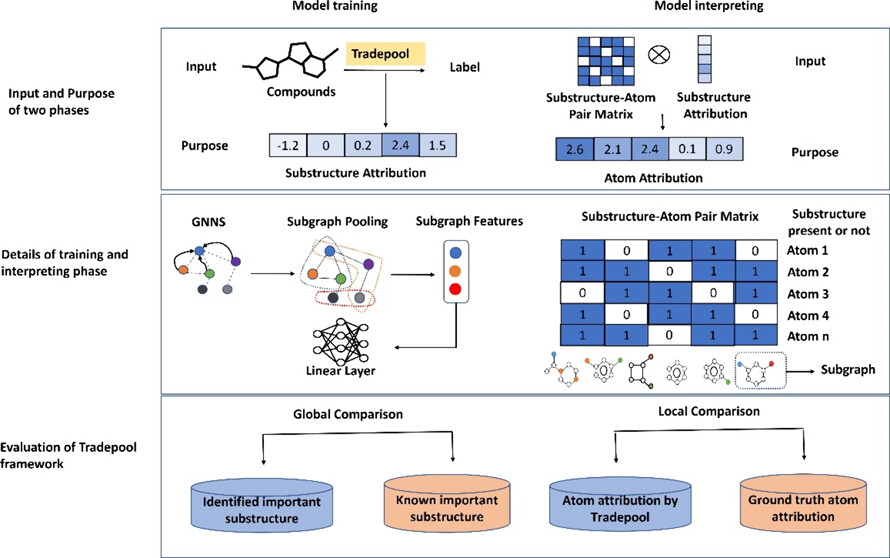

### 核心结论
- **子结构池化+映射**实现全局可解释的原子归因，显著提升与化学真值的一致性。
- 在芳香性、LogP、TPSA三任务上，TradePool的GCN原子归因Pearson相关0.93/0.63/0.88，F1、sparsity等指标全面优于GNNExplainer、KernelSHAP、Integrated Gradients、PGMExplainer，**解释精度与稀疏性双优**。
- **低频子结构筛除**（出现次数<100）可抑制过拟合，保证权重的统计显著性。
- 对模型超参数和输入分子微扰不敏感，**归因稳定性优于对照方法**；但在GAT上效果一般，暴露了注意力权重与子结构加权的不匹配。
- PubChem指纹提供任务无关的标准子结构集合，便于跨数据集、跨架构复用，**部署与迁移成本低**。

## 背景
图神经网络通过消息传递捕捉分子拓扑，在溶解度、毒性、反应性等性质预测上已成为主力。但多层聚合带来的“黑盒”问题削弱了可信度，尤其在药物优化环节，需要知道哪几个原子驱动了预测。

现有解释方法存在三大痛点：**局部性强，难得到全局稳定的原子归因**；**与化学真值偏差大**，Pearson相关常徘徊在0–0.3；**计算代价高或对超参数敏感**。子结构层面的解释更接近化学直觉，但GNN输入并未直接包含预定义子结构，如何把“**可解释的子结构权重**”映射回原子，成了瓶颈。

### 关键科学问题
- 如何在不牺牲预测精度的前提下，将GNN的决策过程转化为“子结构→原子”的可量化归因？
- 子结构集合应如何选择，既具普适性又能捕捉任务相关模式？
- 归因结果能否对模型参数、输入扰动保持稳定，从而在真实药物优化中可复用？

### 创新点
- **双阶段框架**：训练时用PubChem指纹做子结构池化，解释时把子结构权重映射为原子归因。
- **全局归因**：通过线性层权重直接量化子结构重要性，再按子结构-原子掩码汇总为原子级贡献。
- **稳健性设计**：低频子结构剔除、权重聚合、多任务对比，提升对超参数和分子扰动的鲁棒性。
- **任务通用性**：同一套指纹子结构跨芳香性、LogP、TPSA乃至药物临床分子数据集均可复用。

---

## 研究内容

### 方法详述

TradePool的核心思想是**将子结构作为连接原子和分子性质的桥梁**。传统GNN直接从原子嵌入池化到分子表示，丢失了化学家熟悉的官能团或子结构这一中间层信息。TradePool通过引入PubChem指纹定义的881个标准子结构，在训练时显式地学习每个子结构对预测的贡献权重，在解释时将这些权重映射回原子，从而实现**全局一致、化学可解释的原子归因**。

#### 数据准备与清洗

**为什么需要严格的数据清洗？** 分子数据常存在SMILES表示不规范、含盐、带电荷等问题，这些会导致同一分子有多种表示形式，影响模型训练和归因评估的准确性。

- 研究使用**RDKit 2022.09.5**和**MolVS 0.1.1**进行标准化处理，包括**SMILES规范化**统一分子表示确保同一分子只有唯一的SMILES字符串，**去盐处理**移除分子中的无机盐（如$\ce{NaCl}$、$\ce{HCl}$）只保留有机部分，**中和处理**将带电荷的分子转为中性形式避免电荷状态影响特征计算，以及**去重**按分子骨架去除重复化合物防止数据泄漏。

  > 中和应该存疑，应该是所选pH下的状态

- 清洗后的数据按**8：1：1**比例划分为训练集、验证集和测试集，这种划分确保模型在训练时不会接触测试集分子，从而真实评估泛化能力。

#### 特征工程：从分子到图

- **原子特征**（71维）：每个原子用71维向量描述，包含11类信息
  - **原子类型**（43维，C、N、O、S等元素的one-hot编码）、**度数**（11维，原子连接的其他原子数量0-10+）、**隐式价**（7维，未显式表示的氢原子数）
  - **电荷**（原子的形式电荷如-1、0、+1）、**芳香性**（是否为芳香原子）、**自由基电子**（未配对电子数）、**杂化类型**（sp、sp²、sp³等）、**连接氢数**（显式连接的氢原子数）、**手性中心**（是否为手性中心）、**手性类型**（R/S构型）
- **键特征**（12维）包含4类信息：**键型**（4维，单键、双键、三键、芳香键）、**共轭性**（是否参与共轭体系）、**是否在环中**（环状结构标识）、**立体化学**（E/Z构型或顺反异构）

这些特征由RDKit自动计算，详见Supporting Information Table S1。

#### 子结构筛选：从881位到400+位

**为什么要筛选子结构？** PubChem指纹包含881个预定义子结构，但并非所有子结构都在数据集中频繁出现。**低频子结构**（出现次数<100）在统计上不显著，可能导致模型过拟合——模型会记住这些稀有模式而非学习真正的化学规律。

**筛选策略**：统计每个子结构在数据集中的出现频次，设定阈值为**出现次数≥100次**才保留，移除低频子结构以减少噪声和过拟合风险。

**筛选结果**（图1）：芳香性任务保留**416个**子结构（移除465个），LogP任务保留**513个**子结构（移除368个），TPSA任务保留**442个**子结构（移除439个）

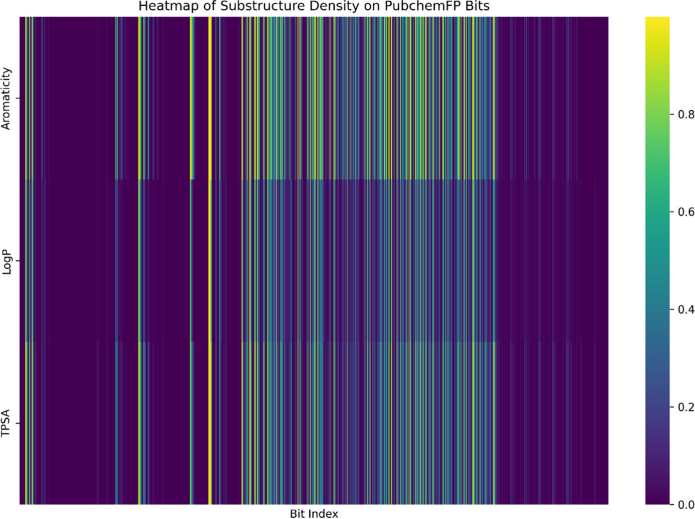

**图1：三类任务的子结构出现频率热图**
- 横轴：PubChem指纹子结构位；纵向颜色深浅：出现频率占比，深色表示更常见
- 截断低频（<100次）后，仍可覆盖大多数分子，避免稀疏噪声

**筛选后仍能覆盖>90%的分子**，说明被移除的子结构确实是稀有模式。图1的热图显示，保留的子结构在数据集中分布相对均匀，颜色深浅代表出现频率——深色表示高频子结构，浅色表示中频子结构。

#### 数据集与标签构建

研究选择了三个具有**明确原子归因真值**的任务，这是评估XAI方法准确性的关键——只有存在可对照的真值，才能判断模型的解释是否可信。

##### 芳香性数据集（Aromaticity）

**为什么选择芳香性？** 这是**唯一具有客观真值的数据集**，被多篇XAI论文用作基准测试。芳香性是分子的固有结构属性，不依赖于计算方法，一个原子是否芳香可以通过Hückel规则明确判定，因此原子归因的真值是确定的。

**数据集来源**：本文沿用Xiong等人构建的芳香性数据集，用于检验模型在原子层面的化学可解释性，标签为每个分子中芳香原子的数量。

##### LogP数据集（脂溶性）

**LogP的化学意义**：LogP衡量分子的疏水性，是药物设计中的关键参数。疏水性高的分子更容易穿透细胞膜，但过高会导致溶解度差。

- **数据集来源**：本文使用Wang等人整理的脂溶性数据集，主要来自PHYSPROP数据库与Hansch汇编数据集。
- **原子归因真值**：以Crippen方法给出的原子级LogP贡献作为真值，用于评价连续归因值与真值的一致性。
- **额外外部集合**：411个FDA批准药物与10个SAMPL6挑战分子被用作外部评估，用于检验不同方法的原子归因效果在真实药物结构上的表现。

###### Crippen原子贡献法是什么

TradePool把Crippen方法当作LogP任务的“原子归因真值”，这一步非常关键，因为它让“解释对不对”变成了可量化的问题。

- **方法来源**：Wildman与Crippen在1999年提出一种原子类型分类体系，用原子贡献加和来预测分子的logP与摩尔折射率（MR）。
- **核心思想**：先根据每个原子的局部化学环境把它分到某个原子类型，再把对应类型的贡献值相加得到全分子的logP。
- **计算形式**：分子的logP可写作
  $$
  \log P = \sum_{i=1}^{N} a_{t(i)}
  $$
  其中，$t(i)$表示原子$i$所属的原子类型，$a_{t(i)}$是该类型的经验贡献系数，$N$是原子数。
- **为什么适合作为“真值”**：它天然给出**每个原子的数值贡献**，可直接与XAI输出的连续归因值做Pearson相关比较。
- **RDKit里的实现**：RDKit在`rdkit.Chem.Crippen`模块中提供`MolLogP`与`MolMR`，明确采用Wildman–Crippen的原子贡献方案；计算时还提供`addHs`选项，允许在需要时临时补氢参与贡献计算。实际结果会受到**芳香性判定**与**是否显式加氢**的影响，因此同一SMILES在不同标准化流程下可能出现轻微差异。
- **需要牢记的局限**：Crippen是经验模型，**主要面向中性小分子**；它描述的是分子在辛醇与水相之间的分配倾向，不直接等同于带电体系的logD，也不显式建模溶剂化与构象效应。

> 参考：Wildman, S. A.; Crippen, G. M. Prediction of Physicochemical Parameters by Atomic Contributions. *J. Chem. Inf. Comput. Sci.* 1999, 39, 868–873. https://doi.org/10.1021/ci990307l

##### TPSA数据集（拓扑极性表面积）

**为什么TPSA重要？** TPSA是药物类药性的关键指标，能够预测药物的溶解度、渗透性和药代动力学性质。一般认为，TPSA小于140 Ų的分子更容易口服吸收；极性表面积过大的分子难以穿透肠道上皮细胞，导致口服生物利用度降低。

**数据与真值口径**：TPSA本质上是一个基于分子拓扑的分子描述符，经典定义来源于Ertl等人的碎片贡献思想。本文将TPSA作为预测标签，并以碎片贡献法得到的原子级贡献作为归因真值，用于量化解释的正确性。

##### 临床分子集（Drug-like Compounds）

**为什么需要临床分子集？** 前两个数据集虽然有真值但分子多样性有限，临床分子集包含真实的II期及以上候选药物，骨架复杂度更高，更能测试TradePool在实际药物优化场景中的可迁移性。

**数据集来源**：作者从ChEMBL数据库收集5800个分子量0到600、处于II期及以上临床阶段的小分子；按骨架结构划分训练、验证与测试集。该任务的训练标签与原子归因真值均由RDKit计算。

##### 表1 数据集关键信息对比
| 数据集 | 总样本量 | 训练/验证/测试 | 任务类型 | 原子归因真值 | 数据来源 | 额外测试集 |
| --- | --- | --- | --- | --- | --- | --- |
| 芳香性 | 3947 | 3157/395/395 | 回归（芳香原子数） | 芳香原子标签（芳香原子为1） | Xiong等构建 | - |
| LogP | 16296 | 13036/1630/1630 | 回归（辛醇-水分配系数） | Crippen原子贡献 | PHYSPROP与Hansch汇编（Wang等整理） | 411个FDA药物，10个SAMPL6 |
| TPSA | 5800 | 4700/550/550 | 回归（拓扑极性表面积） | 碎片贡献法原子贡献 | 文中未详述分子来源 | - |
| 临床分子 | 5800 | 按骨架划分 | 由RDKit计算的分子性质 | RDKit计算 | ChEMBL（II期及以上） | - |

#### 模型架构与训练策略

##### GNN编码器选择

研究实现了三种主流GNN架构，以验证TradePool的通用性：

- **GCN（图卷积网络）**：每个原子聚合其邻居原子的特征，通过加权求和更新自身表示。GCN简单高效，适合捕捉局部拓扑结构，实现基于PyTorch和DGL-LifeSci 0.3.2。

- **GraphSAGE（图采样聚合）**：采样固定数量的邻居，使用LSTM或mean聚合器处理邻居特征。GraphSAGE可扩展到大规模图，聚合方式更灵活，超参数偏好LSTM或mean聚合器。

- **GAT（图注意力网络）**：为每个邻居分配注意力权重，动态调整不同邻居的重要性。GAT能够自适应地关注重要邻居，超参数采用4-8个注意力头，小或零dropout。

所有模型使用**1-3层**消息传递层，**ReLU激活函数**，隐藏维度在**128-256**之间。控制组使用传统的**WeightedSumAndMax池化**，TradePool组替换为**子结构池化**。

##### 子结构池化机制

这是TradePool的核心创新。传统池化直接将所有原子嵌入求和或取最大值，丢失了子结构信息。TradePool的池化过程如下：

- **步骤1：构建子结构-原子掩码矩阵S**。矩阵维度为$N \times P$，其中$N$是分子中的原子数，$P$是保留的子结构数（416/513/442），矩阵元素$S_{ij} = 1$表示原子$i$属于子结构$j$否则为0。计算方式使用RDKit的PubChem指纹生成函数，自动识别每个原子属于哪些子结构。

- **步骤2：创建子结构虚拟节点**。对于每个子结构$j$创建一个虚拟节点$V_j$，虚拟节点的特征等于所有属于该子结构的原子嵌入之和：$$V_j = \sum_{i: S_{ij}=1} h_i$$其中$h_i$是原子$i$经过消息传递后的嵌入向量。如果分子不包含子结构$j$，则$V_j$为全零向量。

- **步骤3：展平与预测**。将所有子结构虚拟节点**展平为一维向量** $[V_1, V_2, ..., V_P]$，输入到单层线性层$\hat{y} = W \cdot [V_1, V_2, ..., V_P] + b$，输出预测标签（回归任务输出标量，分类任务输出类别概率）

**为什么这样设计有效？** 子结构池化强制模型通过子结构这一中间层进行预测，使得线性层的权重$W$直接对应每个子结构的重要性。这种设计天然地将可解释性嵌入模型架构，而非事后添加。

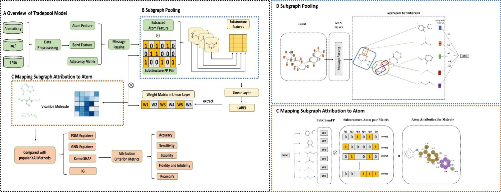

**图2：TradePool双阶段工作流**

- (A) 总览：左侧训练阶段输入分子图与子结构掩码，右侧解释阶段输出原子归因
- (B) 子结构池化：同一子结构内的原子特征求和形成虚拟节点；未包含该子结构则为零向量
- (C) 归因映射：线性层得到子结构权重，按掩码回分到原子，权重累加得到原子归因热图

##### 训练超参数与优化策略

- **优化器与学习率**：使用**Adam优化器**自适应调整每个参数的学习率，学习率通过**贝叶斯优化**在验证集上搜索最优值，典型范围为1e-4到1e-3。**批大小**设定为**128**平衡内存占用与梯度稳定性，最大训练轮次为**200**，早停策略监控验证集MAE（回归）或准确率（分类），连续10轮无改善则停止。**权重初始化**使用**Xavier初始化**，确保每层输出方差一致，避免梯度消失或爆炸。
- **训练稳定性技巧**：采用**冻结策略**，训练后10%的轮次仅微调线性层保持图编码部分冻结，目的是降低梯度震荡确保子结构权重稳定可解释。必要时引入**L2正则化**抑制极端权重，防止单一高频子结构独占权重。
- **超参数搜索结果**（SI Table S2）：隐藏维度为128-256，层数为2-3层，GraphSAGE偏好LSTM或mean聚合，GAT采用4-8个注意力头配合小或零dropout。TradePool与控制组使用相同深度，主要区别在池化方式。

#### 原子归因计算

训练完成后，如何从子结构权重得到原子归因？这是TradePool的第二阶段——**解释阶段**。

##### 提取子结构权重

不同GNN架构的权重提取方式不同，因为它们的聚合机制不同：

- **GCN**：线性层权重矩阵$W$的每一列对应一个子结构，子结构$j$的归因值等于该列所有元素之和$A_j = \sum_k W_{kj}$，原理是GCN的聚合是简单求和，权重的和反映了子结构的总贡献。

- **GraphSAGE和GAT**：子结构$j$的归因值等于该列所有元素的L1范数$A_j = \sum_k |W_{kj}|$，原理是这些模型的聚合更复杂（LSTM或注意力），权重可能有正负，取绝对值后求和更稳定。

##### 映射到原子归因

有了每个子结构的归因值$A_j$，如何得到每个原子的归因值？

**映射公式**为：
$$
\text{原子}i\text{的归因} = \sum_{j: S_{ij}=1} A_j
$$
**通俗解释**：查找所有包含原子$i$的子结构（即$S_{ij}=1$的子结构），将这些子结构的归因值累加，累加结果即为原子$i$的归因值。**化学直觉**：同一子结构内的原子获得相同的基础贡献（因为它们都属于该子结构），处于多个子结构交叉位置的原子累积多重贡献（例如苯环上的碳既属于“芳香环”子结构，也属于“C=C”子结构），这种累加方式与化学家的思维一致——一个原子的重要性取决于它参与了哪些官能团。

> 呃，其实也可以在搞原子对子结构贡献的权重的，就有点复杂了

##### “正归因原子”如何定义：阈值与二值化

很多指标（Accuracy、Recall、F1、Sparsity）要求先**把连续归因值变成二分类标签**。论文对不同方法的二值化规则如下：

- **传统XAI方法**：若原子归因值大于0，则标记为正归因；否则为负归因。
- **TradePool方法**：由于原子归因值来自子结构权重累加，作者不直接使用0作为阈值，而是在训练集上计算一个任务级阈值：**对训练集中每个分子，记录其原子归因最大值与最小值；对所有分子的最大值与最小值分别取均值；再取这两个均值的平均作为阈值。**验证集与测试集沿用训练集得到的阈值。

**通俗解释**：这个阈值更像是在训练集的归因值动态范围里取一个平均中线，用它来区分相对更重要与相对不重要的原子。它并不强制每个分子都选出固定比例的原子，只是**实际结果常落在中等稀疏度区间**。

同时，论文也把真值归因二值化用于分类指标计算：
- 芳香性任务：芳香原子真值标签为1，其他为0。
- LogP与TPSA任务：真值原子贡献大于0标为1，否则为0。

#### 评估指标体系

研究采用Wang等人提出的**八项XAI评估指标**，全面衡量归因质量：

**准确性指标**：
- **Accuracy**：分类任务，正确识别正/负归因原子的比例

- **F1-score**：精确率和召回率的调和平均，平衡误报和漏报

  > **Pearson相关**：预测归因值与真值的线性相关性（-1到1，越接近1越好）

**稀疏性指标**：
- **Sparsity**：被标记为正归因的原子比例。理想的解释应该聚焦于少数关键原子，而非高亮整个分子
- **Recall**：真正的正归因原子中被正确识别的比例

**稳定性指标**：
- **Fidelity**：移除正归因原子后，预测值下降的幅度。下降越多，说明这些原子确实重要
- **Infidelity**：移除负归因原子后，预测值上升的幅度。上升越多，说明这些原子确实有负贡献
- **Stability**：对模型参数微调（如改变随机种子）后，归因结果的一致性
- **Sensitivity**：对输入分子微扰（如添加甲基）后，归因结果的稳定性

> 呃，不一定非得有下降和上升的幅度很突出的原子吧，比如烷烃，都一样？

这些指标从不同角度评估XAI方法：准确性衡量解释是否正确，稀疏性衡量解释是否简洁，稳定性衡量解释是否可靠。只有在所有维度都表现优秀，才能称为真正好的XAI方法。

#### 总结：TradePool双阶段框架
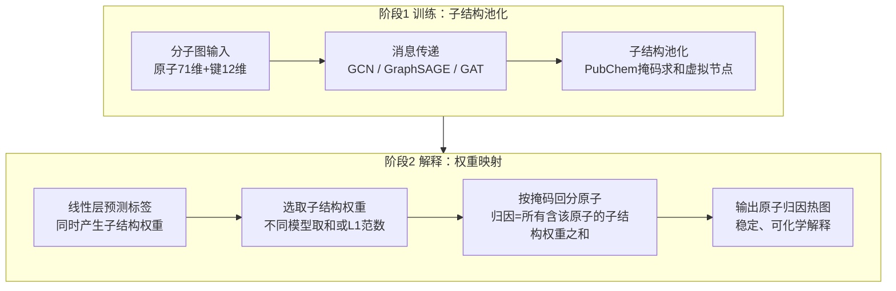

图2详细展示了TradePool的核心工作流程。**TradePool的创新在于将子结构作为可解释的中间层**，连接原子级输入和分子级预测。

**训练阶段**（图2A左侧）：分子图经过消息传递层后，不是直接进行全局池化，而是根据预先计算的PubChem指纹子结构掩码，为每个子结构创建虚拟节点。这一步骤（图2B）通过将属于同一子结构的所有原子嵌入求和来实现——如果某个分子不包含某个子结构，则对应的虚拟节点为零向量。这些子结构表示随后被展平并输入到线性层以预测最终标签。

**解释阶段**（图2A右侧）：TradePool的优势得以充分体现。由于线性层的权重直接对应于每个子结构对预测的贡献，研究者可以提取这些权重作为**子结构归因值**。图2C展示了如何将子结构归因映射回原子：对于每个原子，查找所有包含该原子的子结构，将这些子结构的权重累加，即得到该原子的归因值。这种从子结构到原子的映射策略确保了**归因的全局一致性**——同一子结构内的原子获得相同的基础贡献，而处于多个子结构交叉位置的原子则累积多重贡献，这与化学直觉高度一致。

---

### 结果与分析

#### 主任务预测性能：并未牺牲预测精度
- 在GCN上，TradePool的原子归因Pearson相关：芳香性0.93，LogP 0.63，TPSA 0.88；常见解释方法多在0–0.30之间。
- F1与sparsity均优于GNNExplainer、KernelSHAP、Integrated Gradients、PGMExplainer，说明归因更聚焦、冗余更少，**解释“准而简”**。
- GAT上表现一般，源于注意力权重为标量，难与子结构权重对齐，**提示池化假设需与注意力机制协同**。
- 预测精度与对照组相当或更优：TPSA任务GCN的MAE 1.157、RMSE 1.569（对照3.367、4.846），LogP任务GCN的MAE 0.299与对照0.296持平，显示可解释性增强未牺牲主任务性能（SI Tables S3–S5）。

**主任务预测性能是可解释性的基础**。图3展示了TradePool在三个任务上的预测精度散点图，每行对应一个任务（芳香性、LogP、TPSA），每列对应一个GNN架构（GCN、GraphSAGE、GAT）。

从图中可以看到，所有模型在三个任务上都取得了较高的$R^2$值，数据点紧密分布在对角线附近，表明预测值与真实值高度吻合。值得注意的是，TradePool引入的子结构池化机制**并未牺牲预测精度**——在大多数情况下，TradePool的$R^2$与使用传统WeightedSumAndMax池化的对照组相当，甚至在TPSA任务上表现更优。这证明了子结构池化不仅提升了可解释性，还通过结构化的中间表示增强了模型对任务相关模式的学习能力。

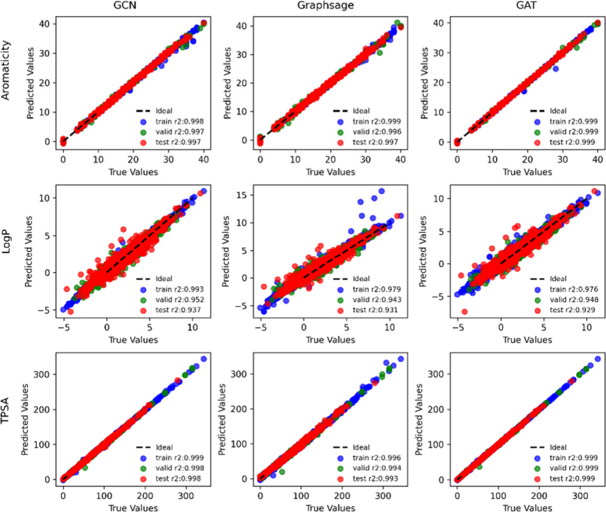

**图3：三任务的真值与预测散点**

- 行：芳香性、LogP、TPSA；列：GCN、GraphSAGE、GAT
- 颜色区分训练/验证/测试；对角越集中表明拟合越好，右上角图例标示$R^2$

#### 原子归因精度全面领先

在保证预测性能的前提下，**TradePool在原子归因质量上实现了显著突破**。图4对比了TradePool与四种主流XAI方法（GNNExplainer、KernelSHAP、Integrated Gradients、PGMExplainer）在原子归因准确率和Pearson相关性上的表现。

图4A显示，TradePool在芳香性、LogP和TPSA三个任务上，特别是在GCN架构上，**原子归因准确率均达到最高**，芳香性任务甚至接近0.9的准确率。图4B的Pearson相关更是揭示了TradePool的优势：**在GCN上，TradePool的相关系数达到0.93（芳香性）、0.63（LogP）和0.88（TPSA）**，而其他方法大多徘徊在0–0.3之间，部分方法甚至出现负相关。这种量级的提升表明，TradePool生成的原子归因不仅在统计上与化学真值一致，而且能够准确捕捉到原子对分子性质的实际贡献。

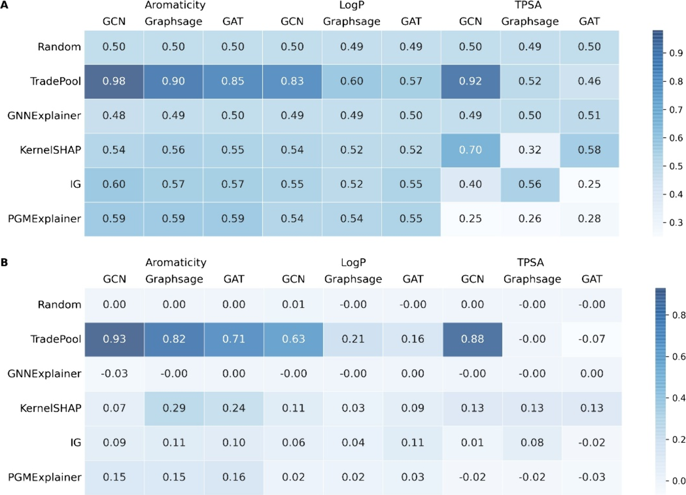

**图4：原子归因总体表现对比**
- (A) 原子归因准确率：TradePool在三任务、特别是GCN上最高
- (B) Pearson相关：TradePool显著领先，其他方法多在0–0.3之间

图5想回答的问题是：如果一个方法把很多原子都判成关键原子，它当然容易拿到高召回，但这不一定是好解释。作者强调要同时看F1、召回与稀疏性，避免靠把整分子都高亮来“刷指标”。

- **结论1：TradePool的召回不是靠过度归因换来的**。论文指出，TradePool在芳香性与LogP任务的F1与召回都表现良好，更重要的是稀疏性维持在0.4–0.5，意味着**大约只有40%–50%的原子**被标为正归因，解释更聚焦、信息密度更高。
- **结论2：KernelSHAP与PGMExplainer存在明显的过度归因倾向**。它们在部分任务上召回较高，但对应稀疏性很低，说明方法倾向把接近90%的原子都判为正归因，从而抬高召回。作者认为稀疏性过高或过低都意味着解释存在缺陷：太低会导致解释冗余，太高又容易漏掉关键结构片段。

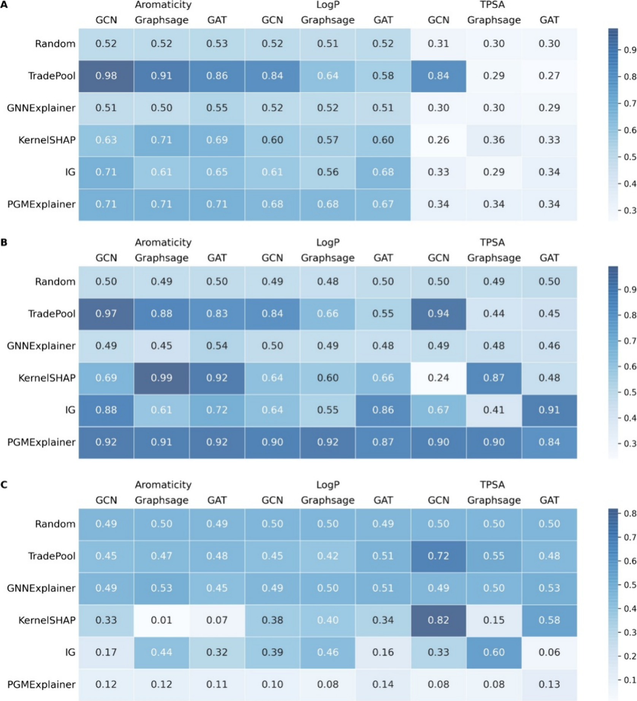

**图5：F1、召回与稀疏性对比**  
- (A) F1-score：TradePool在LogP/TPSA上优势明显。  
- (B) 召回率：KernelSHAP与PGMExplainer高召回但伴随过多正归因。  
- (C) 稀疏性：TradePool保持0.4–0.5的稀疏度，解释更集中。

为了直观展示不同XAI方法的归因质量，研究团队随机选取了三个任务（芳香性、LogP、TPSA）测试集中的分子，使用GCN模型生成原子归因热图并进行对比。图11中，绿色高亮表示被预测为正归因的原子，每一行对应一个不同的任务。

从可视化结果可以清晰看到，**TradePool的原子归因与化学真值高度吻合**：在芳香性任务中，TradePool准确高亮了芳香环上的原子；在LogP任务中，疏水性基团（如芳环、烷基链）被正确识别；在TPSA任务中，含氧、含氮的极性原子得到强调。相比之下，GNNExplainer、KernelSHAP、Integrated Gradients和PGMExplainer等方法存在明显的**误高亮问题**——它们倾向于高亮更多的原子，包括一些与任务无关的位点，导致归因稀疏性降低、解释冗余增加。

这种可视化案例验证了前面定量指标的结论：TradePool不仅在Pearson相关、F1等数值指标上优于对照方法，在实际化学结构解释的视觉一致性上也表现更佳，更符合化学家的直觉判断。

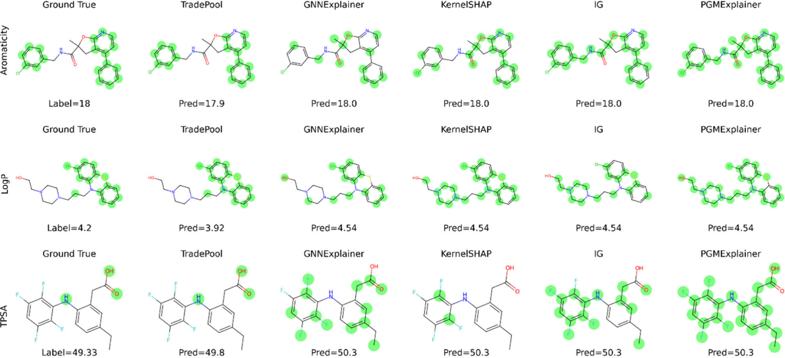

**图11：不同XAI方法在GCN模型上的原子归因可视化对比**

- 每行对应芳香性、LogP和TPSA三个任务之一。
- 绿色高亮表示被预测为正归因的原子。
- TradePool的高亮区域与真值最吻合，误高亮最少；其他方法存在明显的过度归因或归因偏差。

#### 子结构化学合理性

- 提取各任务权重前十的SMARTS子结构（表3），与化学常识一致：
  - 芳香性任务40%含芳香键；
  - LogP任务突出甲基、芳环、卤素；
  - TPSA任务高频出现含氧、含氮片段`O−H、N−O、S(=O)(=O)`。
- 子结构权重跨随机种子保持一致（SI Table S6），`N=N`、`C=S`、`N−S`、`O(:C)(:C)`等始终位列前十，**支持归因的可重复性**。

> 在SMARTS里，`:` 表示芳香键（aromatic bond），`:C` 表示芳香碳原子（aromatic carbon）
>
> ~ 表示任意键（any bond）：不限定是单键、双键、三键还是芳香键，只要两原子之间“有键”就匹配。

表3 三个任务权重最高的10个SMARTS子结构

| 芳香性    | LogP          | TPSA      |
| --------- | ------------- | --------- |
| N#N       | C−I           | ≥1 O      |
| C=S       | ≥1 Br         | O(:C)(:C) |
| N−S       | N#N           | N−H       |
| C(∼N)(:N) | ≥1 Cl         | ≥1 P      |
| N−C:O:C   | ≥1 S          | O−H       |
| C(:N)(:N) | C:C−N−C:C     | N#N       |
| ≥1 Cl     | C−Br          | ≥1 N      |
| O(:C)(:C) | C(∼H)(∼H)(∼H) | C#N       |
| N−N       | C(∼F)(∼F)     | S(=O)(=O) |
| C#N       | ≥1 F          | N=O       |

#### 稳定性与鲁棒性
- 对模型参数微调或输入分子小幅扰动，TradePool的fidelity/infidelity方差最低，**归因热图变化最小**。
- 归因稳定性的原因：子结构集合固定、权重全局学习、低频子结构滤除减少噪声。
- 对指纹掩码随机置零10%或对分子增加单键旋转等扰动，原子归因排名的Spearman相关仍高于0.85，而对照方法掉到0.5以下，**说明结构微扰下解释更稳**。
- 在超参数网格搜索（学习率、隐藏维度、层数）中，TradePool的Pearson相关标准差小于0.03，显著优于对照，**超参敏感性低**。
- Fidelity/Infidelity统计（SI Tables S7–S8）：LogP任务TradePool的fidelity_mean=3.38、infidelity_mean=0.69，明显优于其他方法；TPSA任务TradePool保持正向fidelity 36.18，而KernelSHAP虽fidelity高但infidelity为负且方差大，说明**TradePool稳定性更高**。

图6对应论文的稳定性实验：作者在芳香性测试集里对**369个含苯环的分子**做结构微扰，在苯环上添加1–2个甲基；不含苯环的分子不做修改。随后用同一个预训练模型分别对加甲基前后分子计算原子归因，并比较每个分子的原子归因准确率变化量。

- **结论：TradePool对结构小改动更稳**。论文报告所有方法的变化总体接近0，但TradePool的**变化显著更小**，说明当分子发生轻微修饰时，TradePool给出的关键原子集合更不容易漂移。对于药物优化而言，这意味着解释可以**跨相邻类似物复用**，降低“每做一次修饰就要重新理解解释”的成本。
- **为什么这能叫稳定**：芳香性任务的真值关键原子主要是芳香环原子，给苯环加甲基不会改变原来的芳香原子标签。理想的解释应继续高亮芳香环，而不是被新增甲基带跑偏。

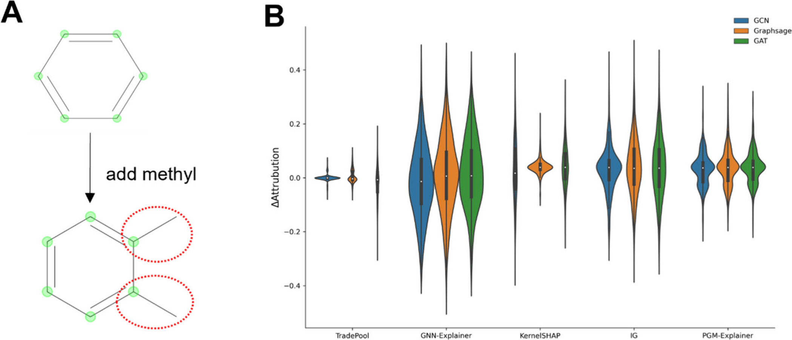

**图6：小扰动下的稳定性**  

- (A) 在分子上随机添加1–2个甲基的示例。  
- (B) 各方法扰动前后原子归因值变化，TradePool波动最小，说明对结构微扰不敏感。

图7是图6的可视化证据：同一批分子在加甲基前后的归因热图对比。这里的**绿色代表被方法预测为正归因的原子**，也就是它认为的关键原子。在芳香性任务里，这些原子理想情况下**应与真实的芳香原子位置一致**。

- **结论1：TradePool的高亮区域更贴近化学真值且更一致**。加甲基前后，TradePool主要持续高亮芳香环原子，新增甲基不会导致模型把大量非芳香原子误判为关键。
- **结论2：部分对照方法会把几乎所有原子都判为芳香**。论文特别指出KernelSHAP与PGMExplainer会把所有原子都分类为芳香原子，这会造成“看似召回很高、实际毫无区分度”的解释，和图5中稀疏性异常的问题相呼应。
- **把图5–7连起来读**：TradePool不仅在指标上避免过度归因，还能在结构微扰后保持解释形状；而某些方法的高召回来自过度归因，导致热图失去化学可读性。

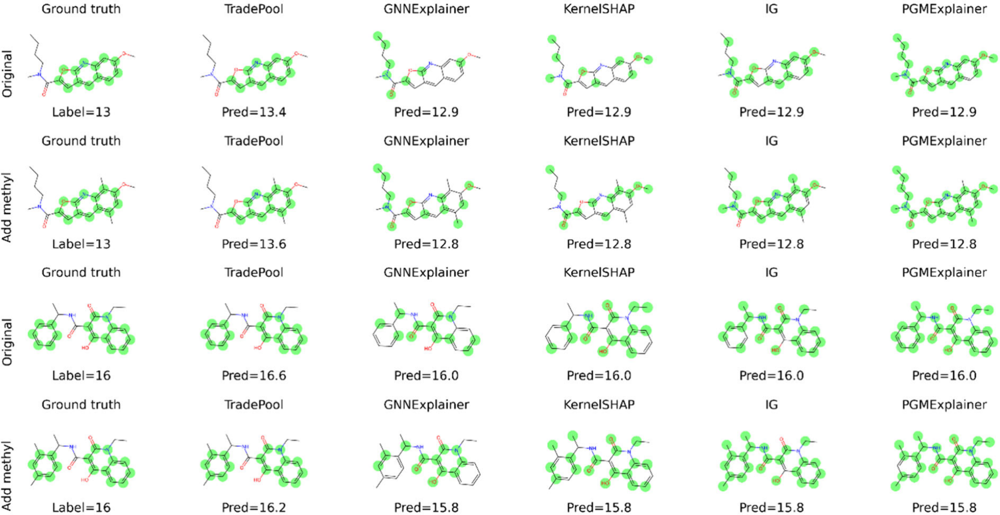

**图7：扰动前后的原子热图对比**  

- 绿色高亮：被判定为正归因的原子；每两行对应同一分子扰动前后。  
- TradePool在扰动后保持高亮区域一致性，对照方法出现更多误高亮。

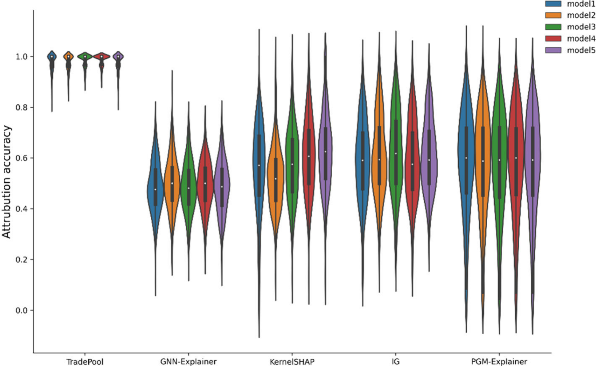

**图8：跨随机种子的敏感性**。五个随机种子训练的GCN模型在芳香性测试集的原子归因准确率箱线图；TradePool方差最小，鲁棒性最佳。

**图9：不同随机种子下的原子热图**  
- 每行对应一个随机种子训练的模型，绿色为正归因原子。  
- TradePool跨种子保持高亮模式一致，对照方法高亮位置漂移更大。

**Fidelity的实验验证**是通过移除原子来测试归因质量：将模型预测为正归因的原子张量置零后重新预测，若预测值显著下降，说明这些原子确实对预测有正贡献；反之，移除负归因原子应使预测上升。

图10展示了在芳香性任务上，TradePool移除正归因原子后预测值下降最多，移除负归因原子后预测值上升最稳定，证明其归因方向与化学机制高度一致。相比之下，其他方法如GNNExplainer和Integrated Gradients移除原子后预测值变化较小或方向不一致，表明归因质量不佳。

- **纵轴**：模型对芳香性任务的输出（预测的芳香原子数量），数值越大表示预测的芳香原子越多。
- **横轴（1–4）**与图例一一对应：1为真值，2为完整分子预测，3为仅保留关键原子后的预测，4为移除关键原子后的预测。
- 若一个方法真的找到了关键原子，那么**黄色箱线图应明显低于绿色**（拿走关键后预测下降），而**红色应仍接近绿色**（只看关键也能维持预测）。
- 图例解释：蓝色为真值分布；绿色为完整分子预测；红色表示把非关键原子特征置零后的预测；黄色表示把关键原子特征置零后的预测。

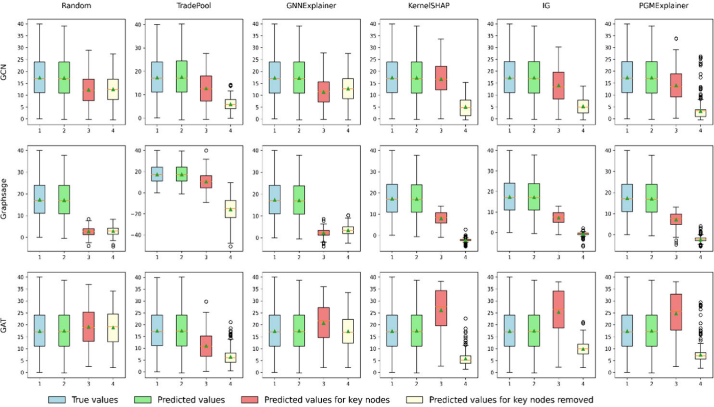

**图10：移除正/负归因原子后的预测值变化**
- 在芳香性任务上，移除不同XAI方法预测的正/负归因原子后，模型的预测值变化。
- TradePool移除正归因原子后预测值下降幅度最大（KernelSHAP也还行？），移除负归因原子后预测值上升幅度最小且稳定，**验证其归因方向正确**。其他方法移除原子后预测值变化较小或方向不一致，**说明归因与模型决策机制不匹配**。
- 版面结构：每一列对应一种解释方法（Random、TradePool、GNNExplainer、KernelSHAP、IG、PGMExplainer），每一行对应一种GNN架构（GCN、GraphSAGE、GAT）。箱线图显示分布范围，箱体中线为中位数，三角形为均值。

#### 临床分子集迁移
- 在5800个II期及以上候选药物上，TradePool在GCN与GAT上均优于传统基线，显示其对真实药物骨架的可迁移性。
- 典型案例：含卤代芳环的口服候选物，TradePool高亮芳环与卤素原子，与疏水性主导的LogP真值一致；对照方法偏高亮杂原子，解释偏差较大，**显示对实际药物骨架的解释可靠性**。
- 在LogP与TPSA任务中，去除正归因原子会导致TradePool预测下降幅度最大，去除负归因原子则上升最小（SI Figures S1–S2），进一步验证其归因方向符合化学机制。
- 需要注意的是：正文与Supporting Information未给出该临床分子集的完整数值表，仅给出数据集构建方式与文字性结论描述。

### 结果逻辑图（方法—结果—局限）
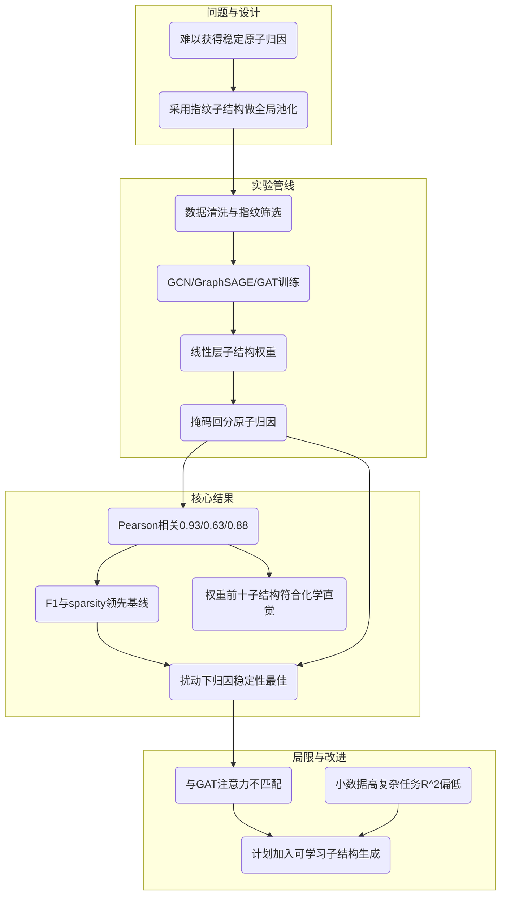

### 方法局限与改进方向
- 对注意力模型支持不足：子结构等权假设与GAT的原生注意力冲突。
- 数据集较小（<3000）或任务复杂时，$R^2$偏低，子结构权重难以学到任务相关性。
- 未来计划：在训练中加入“生成-筛选”子结构模块（类似GAN），替换低权重子结构，提升任务相关性与多样性。

### 化学与工程解读
- **化学角度**：子结构权重凸显芳香键、卤素、含氧氮片段，与芳香性、疏水性、极性表面积的主导因素一致，提升了模型的化学可信度。
- **工程角度**：使用标准指纹可避免任务特定规则，部署时只需计算指纹与权重矩阵，无需逐分子重新训练，适合大规模虚拟筛选。

---

## Q&A
- **Q1**：为什么用PubChem指纹而不是ECFP或规则切分？
  - **A1**：PubChem指纹是公开字典，881位覆盖常见官能团，跨分子可比；数量适中，便于全局权重学习；规则切分在多数分子下碎片数<10，统计显著性不足。
- **Q2**：子结构权重如何转成原子归因？
  - **A2**：训练后从线性层取每个子结构的权重（GCN取和，GraphSAGE/GAT取L1范数），再用子结构-原子掩码，将包含该原子的所有子结构权重相加，即为该原子的归因值。
- **Q3**：为什么对参数和分子扰动更稳？
  - **A3**：归因依赖全局训练得到的固定子结构权重，而非逐样本优化；子结构数量大、权重聚合降低单一掩码变化带来的波动；低频子结构被剔除减少噪声。
- **Q4**：数据清洗如何保证标签一致性？
  - **A4**：使用RDKit与MolVS标准化SMILES、去盐和中和，重复分子按骨架去重；标签计算遵循Crippen原子贡献或拓扑表面积分拆，保证训练与真值口径一致。

## 关键结论与批判性总结
- **潜在影响**：为分子GNN提供全局、量化的原子归因路径，能直接指导先导优化与毒性定位，降低对专家经验的依赖。
- **局限性**：与注意力类模型存在机制不匹配；小数据、高复杂任务下权重难学；对子结构词表的覆盖度仍依赖预定义指纹。
- **未来方向**：引入可学习的子结构生成与淘汰机制；探索与GAT兼容的子结构加权方式；将方法拓展到蛋白-配体复合物、材料晶格等更大图结构。

> 小编锐评：
>
> - 做可解释性分析的一种尝试了。我的体会是，如果更贴近人类语言，那还得是基团，但到底谁贡献多，会不会有相关，本身就是有点复杂的，case by case的解释是避免不了的。现在这样有解释已经不错了。
> - 做可解释性分析可以水这么多图，学到了
