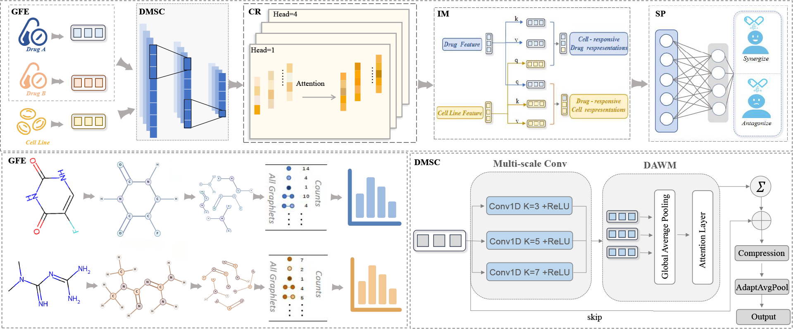
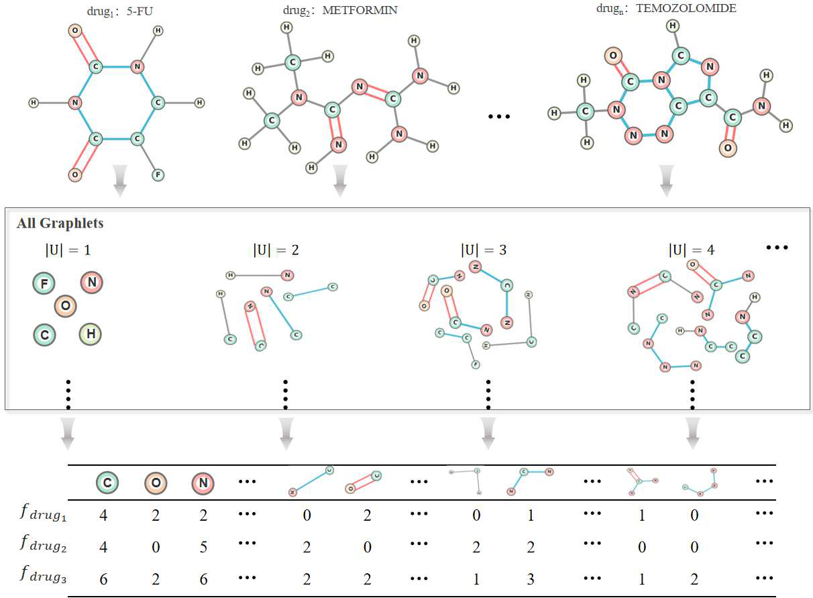
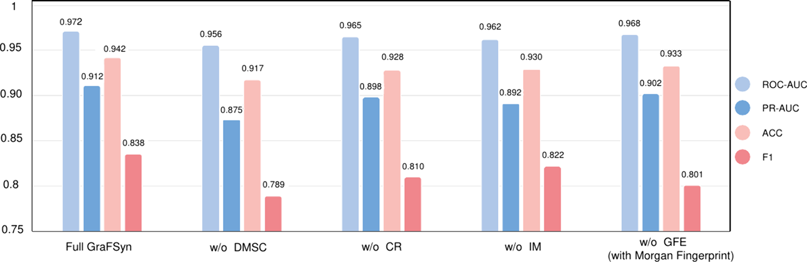
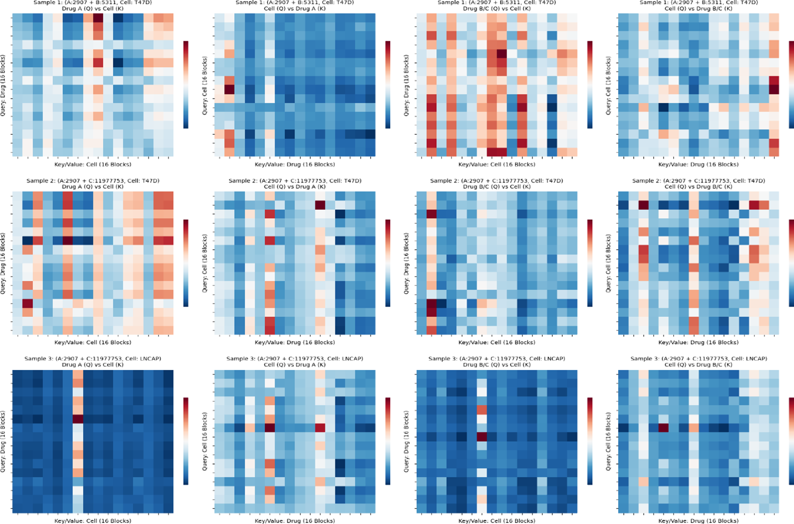
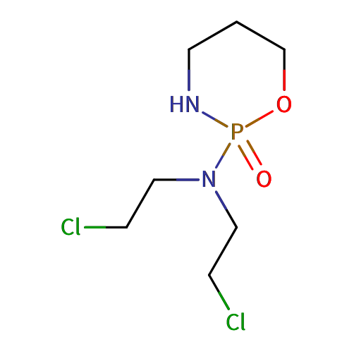
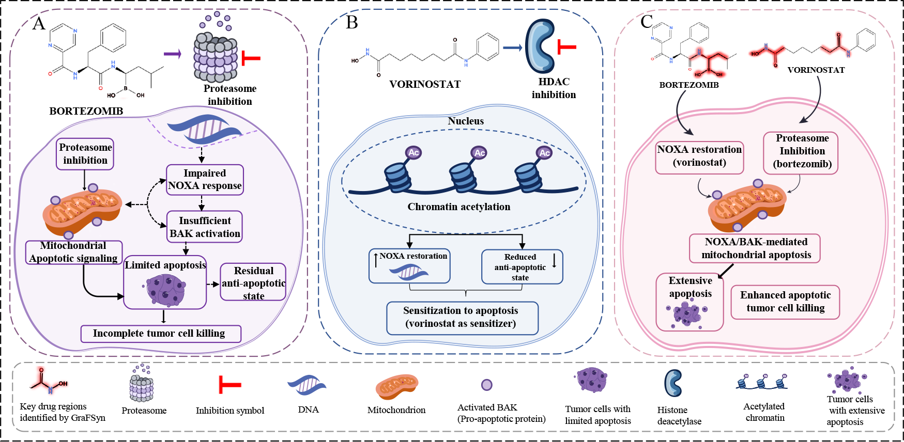

# 药物协同预测黑箱怎么破？用graphlet指纹把子结构直接送进模型

## 本文信息
- 标题：GraFSyn：An Interpretable Deep Learning Framework for Anticancer Drug Synergy via Graphlet Fingerprints
- 作者：Wei Xia, Yayu Tian, Shiyu Zhou, Huanhuan Du, Mingchen Xiao, Zhuxu Ge, Xuan He
- 发表期刊：Journal of Chemical Information and Modeling
- 发表时间：2026年（Received February 12, 2026；Revised May 9, 2026；Accepted May 13, 2026）
- DOI：https://doi.org/10.1021/acs.jcim.6c00458
- 单位：中国辽宁省沈阳市，东北大学医学院与生物信息工程学院
- 引用格式：Xia, W.; Tian, Y.; Zhou, S.; Du, H.; Xiao, M.; Ge, Z.; He, X. GraFSyn: An Interpretable Deep Learning Framework for Anticancer Drug Synergy via Graphlet Fingerprints. *Journal of Chemical Information and Modeling*. 2026. https://doi.org/10.1021/acs.jcim.6c00458
- 代码与数据：https://github.com/drug-XW/GraFSyn.git

## 摘要
> 预测药物协同对加速发现有效的抗癌联合疗法具有重要意义。协同效应本质上依赖于**关键化学子结构**在特定细胞环境中的精确相互作用。然而，当前基于分子图的计算方法通常依赖于**隐式的原子级特征聚合**，这可能掩盖关键化学子结构的拓扑表示，并限制结构可追踪性。因此，我们提出了**基于Graphlet指纹的协同预测框架（GraFSyn）**，这是一个用于抗癌药物协同预测的深度学习框架，它使用graphlet指纹将药物编码为**明确的连通子结构单元**，保留了预定义的化学子结构及其拓扑特征。我们进一步引入了**动态多尺度卷积模块（DMSC）**，以便从高维和稀疏的graphlet特征中学习信息丰富的表示。该框架还包括一个**交互模块**，用于捕捉药物子结构与细胞系基因表达之间**依赖于上下文的相互作用**。在Merck和AstraZeneca基准数据集上，GraFSyn分别实现了**0.972/0.912和0.823/0.906的ROC-AUC/PR-AUC值**，优于代表性基线方法。此外，**归因信号可以映射回特定的药效团区域**，支持协同相互作用的**子结构级分析**。总体而言，GraFSyn为抗癌药物组合筛选提供了一种**准确且结构可追踪**的方法。

### 核心结论
- GraFSyn使用graphlet指纹编码药物：将药物表示为**明确的连通子结构单元**，保留预定义化学子结构及其拓扑特征
- DMSC模块处理稀疏高维特征：从高维和稀疏的graphlet特征中学习**信息丰富的表示**
- 交互模块捕捉上下文依赖：建模药物子结构与细胞系基因表达之间的**环境依赖相互作用**
- 性能优于代表性基线方法：在Merck数据集上达到**ROC-AUC/PR-AUC为0.972/0.912**，在AstraZeneca数据集达到0.823/0.906
- 归因信号可映射到药效团区域：支持协同相互作用的**子结构级分析**，提供结构可追踪的药物组合筛选方法

## 背景

### 药物协同预测的结构可解释性困境

药物协同预测的核心目标：两种药合在一起，是产生加成效应、相互抵消，还是能把肿瘤细胞压得更狠？这个问题在抗癌药物研发中尤其重要，因为临床上很多有效方案都是药物联用而非单药高剂量。然而，传统深度学习方法虽然能给出不错的预测分数，却常常难以回答一个更实际的问题：**模型到底看中了分子的哪一块**？

当前基于分子图的 GNN 方法普遍采用**隐式原子级特征聚合**策略，存在几个关键问题：

- 结构语义在层层压缩中被磨平：通过若干层卷积、池化和读操作将原子和键的初始特征压缩成**单一表示向量**，端到端训练虽方便，但代价是**丢失关键的子结构信息**，这意味着模型难以回答“哪些子结构、哪些药效团、哪些局部化学模式在驱动协同”
- 难以追踪具体化学区域：对药物发现而言，真正有用的不是一串漂浮的 embedding，而是能明确回答"**是因为哪个芳香环**"、"**因为哪类取代基**"还是"**因为某个特定的药效团模式**"这类具体问题
- 解释停留在抽象层面：如果模型只能说"**某个隐藏维度重要**"或"**某个特征向量权重更大**"，这种解释对后续药物优化的帮助有限，药化人员需要的是能回到具体化学区域的指导

更关键的问题是，这类黑箱模型难以回答药物化学家和生物学家的实际问题：是因为哪个芳香环产生作用？是因为哪类取代基贡献显著？还是因为某个特定的药效团模式在驱动协同？如果模型只能说“某个隐藏维度重要”，这种解释对后续药物优化帮助有限。

### Graphlet Fingerprints 的独特优势

Graphlet fingerprints 是一种**显式编码预定义子结构**的表示方法。与传统的 ECFP 等扩展连通性指纹不同，它不是枚举所有路径或环形子结构，而是**枚举连通诱导子图**并按节点数和原子/键属性进行分类计数。这意味着每个 graphlet 都有明确的化学含义：5节点的苯环、3节点的酰胺片段、包含氮和氧的特定模式，等等。

这种表示方式有几个关键优势：**模型从输入层就知道自己在处理哪些子结构**，而不是在黑箱里自行推断官能团；**不同的 graphlet 可以组合成更复杂的模式**，不像某些固定模式指纹那样僵化；**药物化学家习惯从子结构和官能团角度思考问题**，graphlet 正好符合这种思维模式。

当然，graphlet 也有自己的问题。最大的挑战在于**稀疏性**：预定义的子结构类型很多，但单个分子通常只包含其中一小部分，导致大多数 graphlet 计数为零。这种高维稀疏输入直接喂给深度模型很难训练，这也是 GraFSyn 引入 DMSC 模块的直接动机。

### 传统方法的可解释性局限

当前药物协同预测领域的可解释性方法大致分为三类，各有明显局限：**基于注意力的方法**虽然能标出原子重要性，但注意力权重往往过于分散，很难形成清晰的结构级解释；**基于梯度的归因**能反推哪些原子对预测贡献更大，但容易受局部梯度消失或爆炸影响，且难以捕捉全局结构模式；**事后解释器（如 LIME、SHAP）**在训练好的黑箱模型外再加一层解释，这种方法的问题是“预测和解释说两套话”，且特征替换未必符合化学合理性。

GraFSyn 的思路与这些都不同。它**从输入定义开始就把可解释性写进架构里**。graphlet fingerprints 确保了”**模型看什么**”和”**人能读懂什么**”之间的对应关系，DMSC 确保了这种结构语义能被模型有效利用。

### 关键科学问题

1. 如何把药物的明确子结构信息保留下来：避免一上来就压成**不可追踪的隐向量**，让模型从一开始就站在**官能团和局部拓扑**的层面上
2. 如何处理graphlet计数这种稀疏高维输入：原始graphlet很稀疏，直接喂给模型会不好学，需要专门设计把**能看懂**与**能训练**接起来
3. 如何把预测结果映射回具体化学区域：让解释能落到**药效团和官能团**上，而不是停在**抽象权重或热图**上
4. 如何建模药物与细胞背景的交互：协同效应高度依赖细胞系，模型不能只看**药本身**，还得看**这套细胞背景下药会怎么表现**

## 研究内容

### 整体架构：从 graphlet 到协同预测的完整管线

GraFSyn 的整体框架可以看作一条清晰的流水线：**分子图 → graphlet fingerprints → DMSC → 特征精炼（CR） → 交互模块（IM）→ 协同预测**。这条线上每个环节都有明确职责，不是简单地把组件堆在一起。

**图1：GraFSyn 的整体框架**。GFE 先从分子图中提取 graphlet fingerprints，DMSC 把稀疏计数变成密集表示，CR 做特征精炼，IM 负责药物子结构与细胞系基因表达的交互，最后进入协同预测。

> 这条管线的关键设计哲学是**可解释性前置**：从输入定义开始就确保模型能看到的东西是人类能理解的化学单元，而不是等到最后再拿解释器补救黑箱。

### Graphlet Fingerprints：显式子结构编码

graphlet fingerprints 的构建过程可分为三个层次：

- 第一层是连通诱导子图枚举：给定分子图，系统性地枚举所有不超过6个节点的连通诱导子图。这里的“诱导”意味着子图继承原分子图中节点的**原子属性和键属性**，不是抽象拓扑图。原文中原子特征包括元素类型、形式电荷和芳香性，键特征包括单键、双键、三键和芳香键
- 第二层是graphlet分类：每个子图由拓扑结构、原子属性和键属性共同决定类别。1节点graphlet由原子属性定义，2节点graphlet由两个端点原子和连接键定义，更高阶graphlet通过递归哈希函数映射到唯一的同构类别
- 第三层是计数和归一化：统计每个graphlet同构类别在分子中出现的精确次数，形成频率直方图$f(G)$，再归一化成与分子大小弱相关的 concentration profile $z_G$。因此，模型输入的每一维都对应一类预定义、可追踪的化学子结构

**图2：graphlet fingerprint 的构建流程**。分子先表示成带属性的图，再枚举连通诱导子图，按节点数和原子/键属性分配类型，并把计数归一化。

与 ECFP 等传统指纹相比，graphlet fingerprints 的独特之处在于**每个维度都有明确的化学含义**。

> ECFP 的某个哈希位可能对应多种不同子结构的混合，难以说清该位到底代表什么。graphlet 的每个计数都对应一类特定子结构，归因时可直接回到“这个芳香环”“这个杂环片段”等药化语言。

### DMSC：处理稀疏高维输入的关键模块

DMSC（Dynamic Multi-Scale Convolution）是 GraFSyn 的核心创新之一。其设计动机是处理**高维稀疏的 graphlet 计数输入**。

在典型的药物分子数据集里，可能的 graphlet 类别数以千计，但单个分子通常只包含其中几十到几百类。如果直接把这种稀疏向量喂给全连接层，**模型很难学到有效的权重表示**，大多数位置在大部分样本里都是零，**梯度信号很弱**。

> DMSC 的解决思路是**多尺度卷积**，它通过三种机制来处理稀疏的graphlet计数：

- 多尺度卷积核：使用$k = 3$、5、7的并行一维卷积核，从graphlet频率中捕捉不同粒度的局部相关和motif共现模式
- 动态自适应加权：DAWM模块受selective kernel networks启发，对不同卷积尺度做全局平均池化，再用softmax得到尺度权重$\alpha_k$，让模型根据具体分子在细粒度原子模式和粗粒度环系模式之间调整关注点
- 压缩与池化：多尺度特征加权后，还经过最大池化、$1 \times 1$压缩层和AdaptiveAvgPool1d，得到固定维度的紧凑药物表示$H_d$；细胞系基因表达特征也经过类似流程得到$H_c$

消融实验清楚证明了 DMSC 的重要性：去掉该模块后，F1 分数和 PR-AUC 都明显下降。这表明原始 graphlet 计数虽有明确的化学含义，但**直接用作特征表示过于粗糙**，必须经过适当变换才能被深度模型有效利用。

### 交互模块：建模药物与细胞背景的依赖关系

抗癌药物协同效应的一个关键特点是**高度依赖细胞背景**。同一对药物在不同细胞系中的协同强度可能差异巨大，这是因为不同细胞系的基因表达谱、代谢状态、信号通路活性各不相同。

GraFSyn 的交互模块（Interaction Module）专门处理这个问题。它不是简单地把药物表示和细胞系特征拼接，而是通过**学习的交互模式**来捕捉药物子结构与细胞基因表达之间的依赖关系。

具体来说，IM 不是简单拼接，也不是普通点乘交互，而是使用**双向 cross-attention机制**：

- cell-guided drug view：以药物特征作为Query，细胞系特征作为Key和Value，回答“在这个细胞背景下，哪些药物子结构更关键”
- drug-guided cell view：反过来以细胞系特征作为Query，药物特征作为Key和Value，建模“哪些细胞表达模式可能被药物motif调制”
- 残差与层归一化：cross-attention输出与原表示相加后做LayerNorm，再用全局平均池化压成固定长度向量
- 药物对称融合：对药物A和药物B的上下文表示做逐元素加和、逐元素乘积和绝对差拼接，保证药物输入顺序不影响最终预测

> 该设计**将协同建模从”只看药”推进到”药+细胞一起看”**。许多药物协同失效或毒副作用增强，恰恰来自**细胞背景差异**，若模型忽略这一点，在实际应用中容易出问题。

#### 训练和数据
GraFSyn 的 benchmark 分成两类：一类是 **Merck**，一类是 **AstraZeneca**。两者都用于抗癌药物协同预测，但**规模、类别比例和化学空间不同**，因此不能只看一个平均分。

- Merck原始数据包含22,737个drug-cell line triplets，覆盖38个药物和39个癌细胞系。作者用Combenefit按Loewe additivity模型计算协同分数，Loewe分数大于30定义为协同样本，小于0定义为拮抗样本，0到30之间的模糊样本被排除。预处理后留下10,650个有效triplets，其中1,973个阳性、8,677个阴性，覆盖36个药物和31个细胞系
- AstraZeneca用于测试更宽的化学空间。该数据集覆盖**52个药物和24个癌细胞系**，同样使用上述阈值后得到668个有效triplets，其中480个阳性、188个阴性。它的类别比例和Merck明显不同，所以论文在训练损失中按数据集类别分布设置权重
- 细胞系表达来自**Cancer Cell Line Encyclopedia**。作者使用LINCS L1000定义的977个landmark genes，在控制维度的同时保留广泛转录组信息。原文说这些基因约能捕捉总转录组变异的80%
- 药物结构来自SMILES。标准SMILES主要从PubChem获得，少数无法匹配的化合物由ChEMBL和DrugBank补充验证，并用RDKit解析与校验

训练目标是**二分类协同概率**，预测层为MLP加sigmoid。由于**协同样本和非协同样本比例不均衡**，作者使用**加权二元交叉熵**，按训练集类别分布重新平衡正负样本梯度贡献；文中给出的权重参数为Merck的0.818和AstraZeneca的0.285。标准比较采用**一致的5-fold cross-validation**，并和LR、RF、XGBoost、DeepSynergy、DTF、DeepDDS-GAT、DeepDDS-GCN、MPFFPSDC、DFFNDDS、SynergyGTN等十个基线比较。

更重要的是，论文没有只报告随机切分，还做了**三类冷启动评估**：Leave-Combination-Out、Leave-Cell-Line-Out和Leave-Drug-Out。LCO考察未见药物组合，LCLO考察未见细胞系，LDO考察**完全未见药物**；其中LDO**最接近新药筛选场景**，也最难。

### 创新点
- **将子结构语义直接融入输入层**，避免模型在黑箱中自行推断官能团
- **用 DMSC 处理稀疏 graphlet 计数**，将难学的离散输入转换为连续表示
- **将解释集成到架构设计**，预测和归因使用相同的结构线索

许多“可解释模型”仅在输出端添加解释器，模型本身仍是黑箱。GraFSyn 将子结构池化、权重映射和归因回传整合到同一链条中：**模型所见与最终解释尽量一致**。这虽不保证解释百分之百正确，但至少减少了“预测和解释不一致”的问题。

## 研究结果

### 主要基准测试结果

在三个不同测试设置中，GraFSyn 均取得良好表现：

| 场景 | GraFSyn 的表现 |
| --- | --- |
| Merck | ROC-AUC 0.972，PR-AUC 0.912 |
| AstraZeneca | ROC-AUC 0.823，PR-AUC 0.906 |
| Leave-Drug-Out | ROC-AUC 0.798，PR-AUC 0.526 |

> 数值本身不是最突出，真正有意义的是其在冷启动场景下的稳定表现。这对药物协同任务至关重要，因为实际应用常遇到未见新药。许多方法在训练集上表现优异但 Leave-Drug-Out 性能大幅下降，而 GraFSyn 证明**将子结构语义融入输入层**确实有效，模型因此保留了可迁移信息。

从数值看，Leave-Drug-Out 的 PR-AUC 0.526 虽低于主结果，但考虑到任务难度——**模型预测的是包含未见药物的组合**——这一下降是预期中的。更关键的是，DeepDDS-GAT在同一LDO设置下PR-AUC为0.370、F1为0.194，降幅更明显；GraFSyn仍保留了较强的未见药物泛化能力。

### 与基线方法的对比

GraFSyn 在三类基线方法上都有明显优势：

- 对比传统机器学习：如随机森林、SVM等基于手工特征的方法，通常需要**专家精心设计特征**，且对新结构的**泛化能力有限**
- 对比传统GNN：如GraphCNN、GAT等基于原子级卷积的方法，在标准任务上表现不错，但在需要结构可解释性的协同预测场景下，难以解释**模型为何如此预测**
- 对比基于ECFP的方法：ECFP虽也是子结构指纹，但基于**路径和环的枚举**，非明确的连通诱导子图，且**缺乏针对稀疏性的专门设计**

GraFSyn 的优势不仅体现在分数上，还体现在**结果的稳定性**。在 AstraZeneca 等外部数据集上，许多方法遇到分布变化时性能明显下降；GraFSyn 证明，将子结构语义融入输入层确实有效，模型因此保留了可迁移信息。这一设计思路比单纯的百分比提升更重要。

### 消融实验：验证各模块必要性

为证明 GraFSyn 的高分并非偶然，作者进行了三类补充验证：

- **特征置换控制实验**：随机打乱 graphlet 特征后，性能明显下降。这直接证明模型确实在学习 graphlet 特征中的结构信息，而非仅凭细胞系表达猜测结果。若模型能通过细胞背景解决问题，药物结构信息即为多余，这显然不合理。
- **顺序消融实验**：逐个移除 GraFSyn 模块后，DMSC 影响最大。原文报告去掉DMSC后F1下降0.046、PR-AUC下降0.036。这与主文判断一致：**DMSC 非装饰性组件，而是将稀疏子结构输入转换为可学习表示的关键步骤**。缺少这一步时，原始 graphlet 计数虽可解释，但过于稀疏，深度模型难以从中学习稳定表示。

**图3：消融结果**。作者比较完整GraFSyn、去掉DMSC、去掉CR、去掉IM，以及用2048维Morgan fingerprint替换GFE的版本。去掉DMSC后，F1和PR-AUC掉得最明显，说明原始graphlet计数虽然可解释，但太稀疏，必须靠DMSC把它接到可学习的连续表示上。

- **欠采样实验**：药物协同数据集通常存在严重类别不平衡，协同 pair 远少于非协同 pair。简单下采样可平衡类别，但会浪费大量数据。作者测试了不同采样比例下的模型表现，发现 GraFSyn 对类别比例变化具有一定耐受性，不仅限于“理想数据分布”。

这些验证表明：**GraFSyn 的高分并非偶然**，其结构设计和训练流程确实有效。如果某模块仅是偶然作用，顺序消融会立即暴露；如果依赖过拟合，Leave-Drug-Out 会明显下降。GraFSyn 在这些测试中表现稳定，说明其设计思路是可靠的。

## 解释性结果

GraFSyn 的另一重要特点是归因可映射到具体化学区域。

**图4：双向cross-attention权重热图**。行对应不同drug-cell line样本，列对应不同attention方向；作者把权重聚合成$16 \times 16$特征块，横轴是药物子结构特征块，纵轴是细胞系表达特征块，颜色越深表示权重越高。

这张图回答的是**模型是否真的在按上下文重排子结构重要性**。原文用Cyclophosphamide在T47D中的配对案例说明：当它与Zolinza配对时，注意力分布和与BEZ-235配对时明显不同，说明GraFSyn并没有把药物表示固定死，而是会随配对药物和细胞背景改变关注区域。

原文还比较了同一药对在T47D和LNCaP中的权重分布。作者将这种差异与两类细胞已知的遗传背景差别联系起来，例如PIK3CA突变和PTEN缺失等。这一点很关键：GraFSyn 的交互模块不是只在数学上“做了attention”，而是确实学到了**细胞背景改变后，哪些化学子结构更值得看**。

**图5：训练前后embedding的t-SNE投影**。列对应CAOV3、KPL1、SW837三个细胞系，行对应训练前后；蓝点是协同样本，黄点是非协同样本。

这张图属于表示学习的 sanity check。训练前，协同和非协同样本大幅混在一起，边界很模糊；训练后，三种细胞背景下都出现了更清晰的分离趋势，只是分离程度因细胞系而异。原文据此认为，GraFSyn 确实把drug-cell interaction投影到了更有判别力的潜空间里，而不是仅仅在输出层“调阈值”。

**图6：药效团热点的归因可视化**。深红色表示贡献更高。5-FU/ABT-888 在不同细胞系中会把关注点从 C-F 键切换到嘧啶骨架，这说明模型学到的是上下文相关的结构信号。

作者还提供了具体案例：Vorinostat 和 Bortezomib 在 MSTO-211H 细胞系的协同预测中，模型将贡献较高的区域指向**羟肟酸片段、芳香帽和蛋白酶体抑制相关结构**，这与已知机制相符。这表明 GraFSyn 的解释不仅停留在热图层面，至少在典型药物对上能与已知药理逻辑对应。

该案例说明：**同一对药在不同细胞系中，关注的子结构可能不同**。这与真实生物环境一致。GraFSyn 输出的不是孤立“药物标签”，而是带上下文的结构解释。对药物联用研究而言，这种信息比简单高分更有价值，因为它能直接解释背景变化时模型预测改变的原因。

**图7：Vorinostat-Bortezomib 的 leave-combination-out 案例**。图里把单药作用、协同机制和细胞层面解释放到一起，方便读者把模型输出和已知药理机制对照起来。

该图不仅展示“模型认为重要的区域”，还将这种重要性连接到已知机制。Vorinostat 侧重 HDAC 抑制，Bortezomib 侧重蛋白酶体抑制，两者叠加指向更强的肿瘤细胞杀伤。GraFSyn 的归因结果重建了这一机制链条。

此外，这类案例图说明了：**可解释性不是附加组件，而是筛选候选组合时的关键证据**。如果一个模型只能预测协同分数却无法说明原因，药化人员仍需自行分析。GraFSyn 将这一步骤前移，虽非真正的机制证明，但已比纯黑箱预测更实用。

## 关键结论与批判性总结

- 优点：GraFSyn 的路径清晰，**graphlet fingerprints、DMSC、交互模块和解释模块分工明确**，并非简单堆砌组件
- 局限：graphlet 依赖预定义子结构，**表达能力受子结构库约束**；若真实药效来自**细微构象变化**，该表示可能无法完全捕捉
- 未来方向：将该方法应用于**更多外部药物组合和不同肿瘤背景**，验证其解释是否仍能与已知机制稳定对应，而非仅在 benchmark 上成立

GraFSyn 的核心价值在于**推动协同预测的发展**：模型能回答”**为什么是这个结构**””**为什么在此细胞背景下是这个解释**”。这类方法需要**更多数据集和外部验证**才能走向实用。

**一句话总结**：**它不仅构建了更强的预测器，还将药物子结构、细胞上下文和解释结果形成完整链条**。这条链条若能在更多任务上验证，才真正有价值。

## 补充验证

- 超参数设置：batch size = 32，最大图节点数 = 6，优化器 = Adam，调度器 = ReduceLROnPlateau，L2正则化 = $1 \times 10^{-5}$，预测层dropout = 0.3。**该配置较为克制**，非依靠极端大模型获得的结果
- 特征置换控制实验：打乱特征后性能下降，说明**模型确实在学习graphlet特征**，不是只依赖数据集偏差
- 顺序消融实验：移除DMSC影响最大，与主文判断一致
- 欠采样实验：不平衡数据下，模型仍能保持可用表现，说明其不仅限于**理想数据分布**

仅看主文图表可能误解为“新指纹 + GNN”。SI 提示，真正有效的是整套输入表示、稀疏处理、上下文交互和验证流程。

本文没有将可解释性停留在热图层面，而是将解释前移：从输入定义到模型池化再到案例回溯形成完整链条。对依赖上下文的药物协同任务，这种方法比单独提供 attention map 更可靠。
