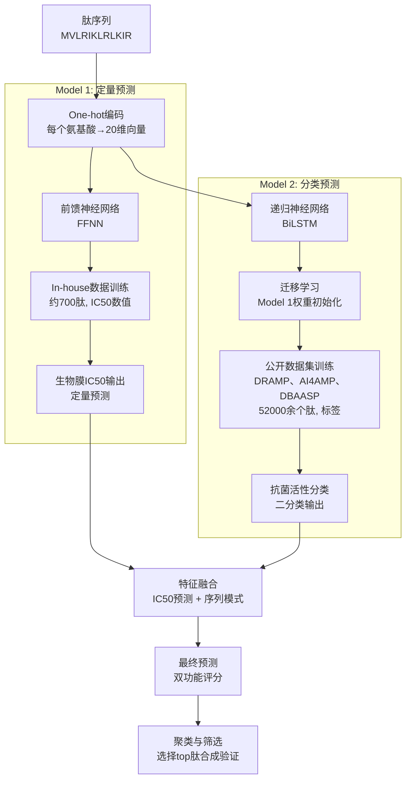
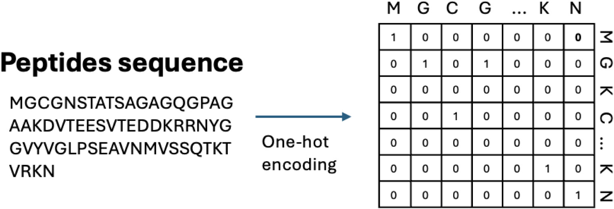
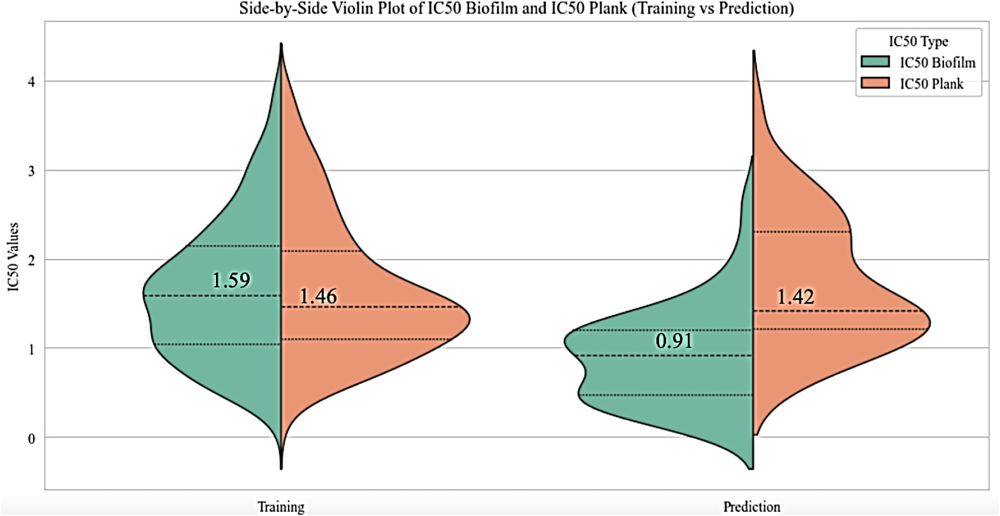
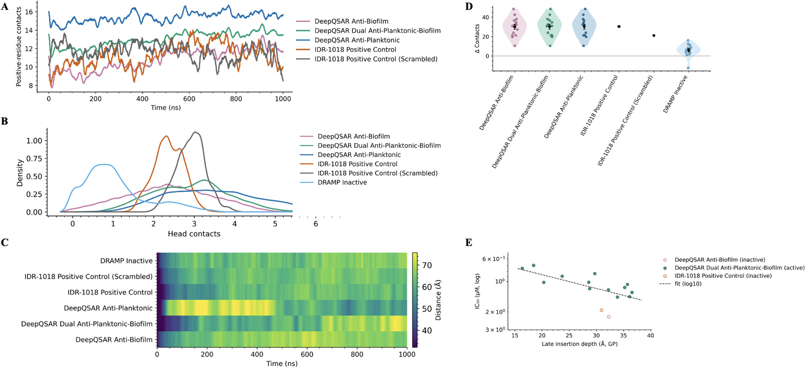

# Deep Learning破解双功能抗菌肽设计：DeepQSAR模型的应用与突破

## 本文信息

- **标题**：The Use of DeepQSAR Models for the Discovery of Peptides with Enhanced Antimicrobial and Antibiofilm Potential
- **作者**：Jiaying You, Hazem Mslati, Evan F. Haney, Noushin Akhoundsadegh, Robert E.W. Hancock, Artem Cherkasov
- 发表时间：2025年
- **单位**：加拿大不列颠哥伦比亚大学（UBC）、渥太华大学，加拿大
- **引用格式**：You, J., Mslati, H., Haney, E. F., Akhoundsadegh, N., Hancock, R. E. W., & Cherkasov, A. （2025）. The use of DeepQSAR models for the discovery of peptides with enhanced antimicrobial and antibiofilm potential. *Journal of Chemical Information and Modeling*, https://doi.org/10.1021/acs.jcim.5c02138
- **源代码**：https://github.com/chill-bear/peptides（包含数据预处理脚本、模型训练代码和图表生成脚本）

## 摘要

> 针对抗生素耐药性的全球危机，抗菌肽（AMPs）因其独特的直接杀菌机制和较低的抗性风险而被视为下一代治疗药物。然而，**同时预测抗菌和抗生物膜活性的计算方法仍然匮乏**。本研究开发了一种新型Deep QSAR框架，将前馈神经网络（用于定量预测生物膜抑制效率）与递归神经网络（用于二分类抗菌活性预测）相结合，通过迁移学习实现高效的多目标肽设计。模型在5折交叉验证中达到**90**%的准确率，准确度和召回率分别为0.90和0.88。基于模型预测和聚类分析，我们合成并验证了100个设计肽，其中**44**个显示出优于参照肽IDR-1018的抗生物膜活性，**31**个表现出更强的抗菌活性，**29**个实现了两种活性的同步增强。分子动力学（MD）模拟揭示了这些肽通过强而选择性的细菌膜结合机制（特别是多价的赖氨酸/精氨酸-磷脂酸酯相互作用）来实现其效能的。

### 核心结论

- **首次实现同时预测**：开发了第一个能够同步预测抗菌和抗生物膜活性的Deep QSAR模型，突破了传统单一功能预测工具的局限
- **显著的性能优势**：**90**%准确率（5折CV）、精确度0.90、召回率0.88，超过现有Macrel、AI4AMP和DBAASP等预测工具。
- **实验验证的成功率高**：100个设计肽中**29**个实现双功能增强，展现出模型的实用价值。
- **最强肽的10倍增强**：顶级肽MVLRIKLRLKIR对生物膜的IC50仅为0.147 μM，较参照肽（1.417 μM）低近**10**倍。
- **机制清晰**：MD模拟证实膜结合和选择性是关键驱动因素，为进一步优化提供了理论基础。

---

## 背景

**抗生素耐药性（AMR）已成为全球公共卫生危机**。过度使用和滥用抗生素导致环境污染加剧，迫使微生物产生防御机制。这不仅削弱了现代医学的治疗效果，还增加了医疗成本和感染死亡率。然而，小分子抗生素的传统开发模式**面临瓶颈**：新药研发周期长、成本高、成功率低，而且耐药菌株快速进化。

抗菌肽（AMPs）是一类天然防御性蛋白质，广泛分布于细菌、植物、真菌和动物中。与传统小分子抗生素不同，**AMPs通过直接破坏细菌膜（如pore formation、carpet机制）和诱导细胞内应激反应来杀灭病原体**，这种机制导致耐药菌株发展的可能性大大降低。此外，AMPs还展现出对生物膜的抑制活性，这对治疗慢性感染和医疗器械相关感染至关重要。

然而，**传统AMP发现仍依赖于高成本的高通量实验筛选和试错法**。虽然机器学习（ML）和深度学习（DL）技术在近年来加速了肽设计过程，但**现有的计算工具多专注于单一功能预测（通常是抗菌活性），而对生物膜抑制的预测能力有限**。这导致发现同时具有两种功能的候选肽变得极其困难，阻碍了下一代治疗药物的开发。

## 关键科学问题

本研究针对以下核心问题进行了深入探索：

**问题一：如何在同一模型框架中预测多个端点的AMP活性？** 传统QSAR模型通常采用单一预测目标（如抗菌活性），基于简单的分子描述符或SMILES编码。而**肽的序列和功能的多样性使得多目标预测成为独特挑战**——需要模型既能捕捉序列模式信息，又能准确回归生物膜抑制的定量数据。

**问题二：如何有效利用异质数据源进行转移学习？** 本研究整合了自建的抗生物膜活性数据库（约700个肽，3000个数据点）和三个大规模公开AMP数据库（DRAMP、AI4AMP、DBAASP，共52000余条目）。这些数据来源差异大、标注方式不一、样本分布不均，如何在保证泛化性的同时充分利用这些信息**是关键**。

**问题三：设计的肽能否真正优于参照标准？** IDR-1018作为well-characterized的宿主防御肽，已被证明具有广谱抗生物膜活性。**新设计肽需要通过实验验证来证明其优越性**，这要求模型不仅预测准确，还需识别那些未被充分探索但具有高潜力的序列空间区域。

## 创新点

- **首个多功能Deep QSAR框架**：融合前馈网络（定量）和RNN（分类），通过迁移学习实现抗菌和抗生物膜活性的同步预测，打破了传统单功能预测工具的局限
- **创新的双模型整合策略**：Model 1的数值输出（生物膜IC50预测）直接馈入Model 2作为额外特征，增强了RNN对序列的理解，避免了简单的模型stacking
- **大规模数据融合**：自建in-house数据库与DRAMP、AI4AMP、DBAASP三大公开库的整合，构建了迄今最全面的AMP训练集，提升了泛化能力
- **实验验证与机制解析的结合**：不仅进行体外活性测试（抗菌、抗生物膜、溶血、细胞毒性），还通过微秒级MD模拟精准解析设计肽的膜相互作用，建立了序列-结构-活性的完整链条

---

## 研究内容

### 核心方法：DeepQSAR双模型框架

为了实现同时预测抗菌和抗生物膜活性，该研究设计了一个创新的两阶段深度学习框架。

**方法详述**：

1.**数据准备与编码**：
  - 使用One-hot编码将20种标准氨基酸转换为长度为20的二进制向量，保留了序列信息的顺序性。
  - 自建in-house数据集由Kinexus生物信息公司合成的肽阵列组成，约700个唯一肽，每个肽测定了抗MRSA生物膜的IC50值（共3000个数据点）。
  - 结合DRAMP（22259肽）、AI4AMP（10716正例+10718负例）和DBAASP（19751活性肽），构建了超过52000条目的训练集。

2.**Model 1**—前馈神经网络（定量预测）：
  - 基于in-house数据集构建，目标是学习肽序列和生物膜抑制IC50的定量关系
  - 输入为One-hot编码的肽序列，通过多层前馈网络处理，直接输出IC50数值预测
  - 这一模块为后续的RNN提供了生物膜抑制的数值信息基础

3.**Model 2**—递归神经网络（分类预测）：
  - 采用双向LSTM（BiLSTM）架构，针对抗菌活性进行二分类（活性/非活性）
  - 关键创新是**迁移学习**：将Model 1的训练权重初始化到Model 2
  - 使RNN能够继承关于肽序列和生物膜相互作用的知识，学习序列特定的抗菌模式
  - 融合了定量的生物膜抑制信息，实现多维度特征学习

4.**整合与特征融合**：
  - 将Model 1的IC50预测输出与Model 2的RNN架构级联（concatenate）
  - 使分类器能够利用数值洞察和序列模式来做出更准确的预测。
  - 设计优势：在架构层面实现了信息流的有机整合，比简单的模型融合更有**优势**。

### 数据集与实验方法

使用了四个主要数据源：
- **In-house数据**：约700个肽，3000个抗MRSA生物膜IC50测定数据
- **DRAMP**：22259个肽，包含综合的已知AMP序列
- **AI4AMP**：平衡数据集，10716个正例加10718个负例
- **DBAASP**：19751个已实验验证的活性肽

肽的合成在芹菜素膜阵列上进行（Kinexus），通过如下步骤测定活性：
- 甲氧西林耐药金葡萄球菌（MRSA）用作检验菌株
- 肽浓度范围1-256 μg/mL，测定OD600（生长）和水晶紫吸收（生物膜）
- 使用非线性回归拟合IC50值（**50**%抑制浓度）

### 模型性能评估

**图3：Model 1前馈神经网络的训练过程**

前馈网络的平均绝对误差（MAE）和损失函数都随迭代次数逐步下降，最终在验证集上MAE约1.5，表明模型能够准确预测生物膜IC50的量级。训练和验证曲线显示稳定收敛，未出现过拟合现象。

**图4：Model 2递归神经网络的分类性能**

精确度-召回曲线（左）和ROC曲线（右）显示模型在不同阈值下都保持**90**%以上的精确度，同时维持**88**%的召回率。ROC曲线的AUC接近1.0，说明模型具有**优异的区分活性和非活性肽的能力**。

定量评估结果为：
- **精确度（正样本）**：0.90
- **召回率（正样本）**：0.88
- **F1得分**：0.89（两个类都>0.88，说明性能均衡）

这些指标远优于现有工具（见附录对Macrel、AI4AMP和DBAASP的对比）。

### 高通量筛选与设计肽的验证

**筛选流程**：
- 从UniProt数据库中提取了20417个已审核的人类蛋白序列
- 过滤掉长度<100氨基酸的蛋白
- 使用滑动窗口方法（每次移动1个位置）系统性地分割成12-mer肽片段
- 对约50000个候选肽进行了预测，筛选出预测评分最高的100个
- 按照序列相似性进行层级聚类，从每个簇中选择最高评分肽用于化学合成和生物检验

**图5：设计肽与训练肽的IC50对比**

使用小提琴图展示了设计肽和训练肽在抗生物膜和抗菌两个维度的IC50分布。中位IC50值为：

| 活性类型 | 训练肽（μM） | 设计肽（μM） |
|---|---|---|
| 抗生物膜 | 1.59 | 0.91 |
| 抗菌（浮游） | 1.46 | 1.42 |

设计肽的生物膜IC50显著低于训练肽，表明**模型成功识别并优化了生物膜抑制特性**。

**图6：合成肽的有效性分类**

100个设计肽按照相对于参照肽IDR-1018的表现分类：
- **44**肽：抗生物膜活性更强
- **2**肽：仅抗菌更强
- **25**肽：两者都改善但幅度不同
- **29**肽：两种活性都明显优于对照——这是最有价值的候选

### 顶级肽的表征

**表1：Top 5双功能肽（抗生物膜与抗菌均优）**

| 肽ID | 序列 | 抗生物膜IC50（μM） | 抗菌IC50（μM） |
|------|------|---------------|------------|
| 10 | WKKKGRMRWKWI | 0.27 | 0.74 |
| 20 | LKIKVHIYRMKR | 0.35 | 1.07 |
| 99 | MLIRVRKLWRIL | 0.24 | 0.70 |
| 40 | RARGRKRLVVTI | 0.30 | 1.18 |
| 86 | RALKKIIKRLCR | 0.38 | 0.70 |
| IDR-1018（对照） | VRLIVAVRIWRR | 1.42 | 1.73 |

**最强肽（ID 105, MVLRIKLRLKIR）**在抗生物膜上达到**0.147 μM**，约为IDR-1018的1/10，这代表了迄今最强的AMP生物膜抑制活性之一。其抗菌IC50为1.29 μM，也优于对照的1.73 μM。

**图7：阵列肽生物膜vs MRSA活性**

该图展示了Top 5肽及对照肽在肽阵列上的生物膜和浮游菌抗性活性曲线。六个面板分别对应肽ID 10、20、99、40、86和105（对照为IDR-1018），每个肽的剂量-反应曲线清晰显示了其多维度效能，进一步验证了设计肽相比对照的改进。

### 安全性评估

为评估毒性风险，对三个代表肽（J20、J28、J39）进行了溶血和PBMC细胞毒性测定。结果表明：
- **溶血IC50**：全部>250 μg/mL，显示对红细胞的膜破坏极小
- **PBMC细胞毒性**：J28、J39的IC50 >250 μg/mL；J20为166 μg/mL
- **治疗窗口**：生物膜IC50（MBIC）为1-4 μg/mL，远低于毒性阈值，提供了**60-250倍的安全边际**

这表明**设计肽具有良好的生物相容性**，适合进一步的临床前开发。

### 分子动力学揭示作用机制

通过微秒级MD模拟（GROMACS + MARTINI 3粗粒化力场），对43个设计肽在三种膜系统（革兰氏阳性菌模型、革兰氏阴性菌模型、哺乳动物细胞对照）中的相互作用进行了表征。

**图8：MD模拟结果——肽-膜相互作用、驻留、选择性和构效关系**

**A子图 - 时间分辨赖氨酸/精氨酸-膜接触**：
- 所有肽在50-100 ns内建立与膜的多价接触，然后维持高位
- **抗浮游设计肽**：接触数最高（平均15.4，峰值16.7）
- **双功能肽**：中间水平（约13.0）
- **抗生物膜肽**：较低但稳定（约10.8）
- **IDR-1018对照**：接近抗生物膜肽（11-12）
- **非活性肽**：无接触（缺乏赖氨酸/精氨酸）

**B子图 - 磷酸头基团接触密度分布**：

磷酸头基团接触密度定义为肽与膜磷脂头基团（PO4）在0.5 nm范围内的接触数，反映肽与膜表面的结合密集程度：
- **抗浮游菌肽和双功能肽**：峰值约3.3
- **抗生物膜肽**：峰值约2.3
- **IDR-1018**：约2.3（与抗生物膜类相同）
- **非活性肽**：仅0.8（极少接触）

设计肽与膜表面的多价磷酸结合密度远高于对照肽，表明肽通过**多个精氨酸/赖氨酸残基同时结合多个磷酸基团**，形成稳定的多价网络结构，这是膜破坏和细胞溶解的前提条件。

**C子图 - 肽-膜中面距离热力图**：

热力图显示肽在1微秒模拟过程中与膜的轴向距离演变。根据原文，使用GP膜（革兰氏阳性，用于评估浮游菌杀伤）和GN膜（革兰氏阴性，用于评估生物膜抑制）：
- **抗浮游菌肽和双功能肽**：在GP膜上保持浅层驻留（z值约-0.5至0 nm），全程稳定
- **抗生物膜肽**：在GN膜上保持近表层驻留（z值约-0.5至0 nm），持久不变
- **IDR-1018**：界面驻留但波动更大，不如设计肽稳定
- **非活性肽**：远离膜（z值小于-3 nm），无实质接触

**D子图 - 选择性评估（细菌膜 vs 哺乳动物膜）**：
- **设计肽（所有类）**：接触数差（Δ）均值约30 contacts（相对于哺乳动物细胞膜），分布集中
- **IDR-1018**：类似正偏移（25-30范围）
- **非活性肽**：接近零（无选择性）

**E子图 - 构效关系（插入深度vs活性）**：

肽膜插入深度与活性的相关性分化明显：

**抗菌活性（浮游,革兰氏阳性）**：
- **Spearman相关**：ρ = 0.69, p = 0.0045（显著正相关）
- **趋势**：浅层插入与低IC50（高活性）强烈关联
- **解释**：保持在浅表的肽能更有效地破坏膜结构，形成孔隙或地毯溶解；深度插入反而降低活性

**抗生物膜活性（革兰氏阴性）**：
- **相关性**：无显著相关（p > 0.05）
- **含义**：生物膜抑制机制**不依赖于膜插入深度**，可能依赖于膜表面捕获后的胞内信号干扰（如ppGpp、quorum sensing）

---

## Q&A

- **Q1: 为什么One-hot编码而不用其他肽特征（如BLOSUM矩阵、物化性质）?**
- **A1**: One-hot编码保留了序列的精确顺序信息和完整的氨基酸恒等性，这对RNN学习局部和全局序列模式至关重要。物化性质或BLOSUM会损失肽的某些特异性特征（如某个Cys位置的disulfide潜力）。此外，One-hot编码与循环网络的设计在概念上更贴切——RNN本身就是为处理离散序列而优化的。

- **Q2: Model 1和Model 2之间的迁移学习具体如何工作?**
- **A2**: Model 1在in-house抗生物膜数据集上训练，学习了肽序列到IC50（数值）的映射。其中间层权重编码了肽的生物膜亲和力。Model 2初始化时直接复制这些权重到BiLSTM的嵌入层，使RNN一开始就知道哪些序列特征与膜相互作用相关。后续在大型AMP分类数据集上微调时，RNN保留了这些初始化的特征，同时学习抗菌活性的额外模式。这比随机初始化快速得多，也减少了过拟合的风险。

- **Q3: 为什么选择12-mer作为设计肽的长度?**
- **A3**: 12氨基酸是**最小可行的功能肽长度**（short peptides），足以形成α-螺旋或其他二级结构，但避免了合成和成本的复杂性。UniProt滑动窗口方法系统性地生成了大量候选，而12-mer的长度也是文献中well-characterized肽（如IDR系列）的标准。这样既保证了生物学意义，也便于后续的优化。

- **Q4: 设计肽对其他常见致病菌（如绿脓杆菌、肠杆菌）的活性如何?**
- **A4**: 论文中仅报告了对MRSA的测定数据（革兰氏阳性）。对广谱活性的验证（包括革兰氏阴性菌）计划在后续研究中进行。MD模拟显示肽在革兰氏阴性模型膜上也有强劲的结合，但体外验证仍是必要的——这也是论文Discussion中强调的局限性。

---

## 关键结论与批判性总结

### 研究意义与影响

- **开创性的多目标预测框架**：首次实现在单一模型中同时预测抗菌和抗生物膜活性，为多功能AMP设计树立了新范式
- **高实用性的设计管道**：从50000个候选肽到100个合成肽，再到**29**个双功能增强肽，展现了**29**%的实现率，远超随机合成
- **强有力的实验验证**：不仅测定了生物活性，还进行了毒性评估和分子动力学模拟，建立了序列-结构-活性的完整理解
- **开源资源分享**：代码、数据和模型已上传GitHub，便于学术界复现和扩展

### 存在的局限性

- **单一菌株验证**：实验仅在MRSA上进行，对其他常见致病菌（绿脓杆菌、鲍曼不动杆菌等）的广谱活性需进一步验证
- **体内模型缺失**：所有活性数据来自体外测定（肽阵列），动物模型和临床相关性评估尚待进行
- **机制理解仍需深化**：虽然MD模拟提供了膜相互作用的线索，但关于肽的具体杀菌模式（是否形成孔隙、地毯机制还是其他）仍需要补充生物物理学实验
- **长期稳定性未评估**：肽的血清稳定性、给药形式和体内代谢还没有系统研究

### 未来研究方向

- **扩展菌种覆盖**：针对多重耐药菌（MDR）、泛耐药菌（XDR）进行活性测定，包括临床分离株
- **动物模型验证**：利用小鼠感染模型评估体内疗效和毒性，为临床前开发奠定基础
- **结构优化循环**：基于MD洞察，进行理性的点突变和截断，进一步提升特异性和效能
- **AI模型迭代**：整合更多数据源（如微生物组数据、宿主防御肽文献），开发下一代多参数预测模型
