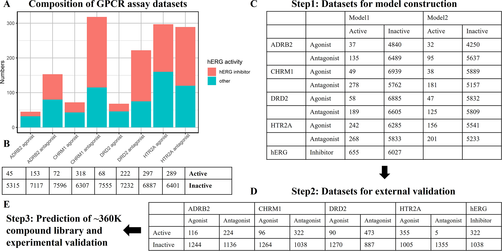
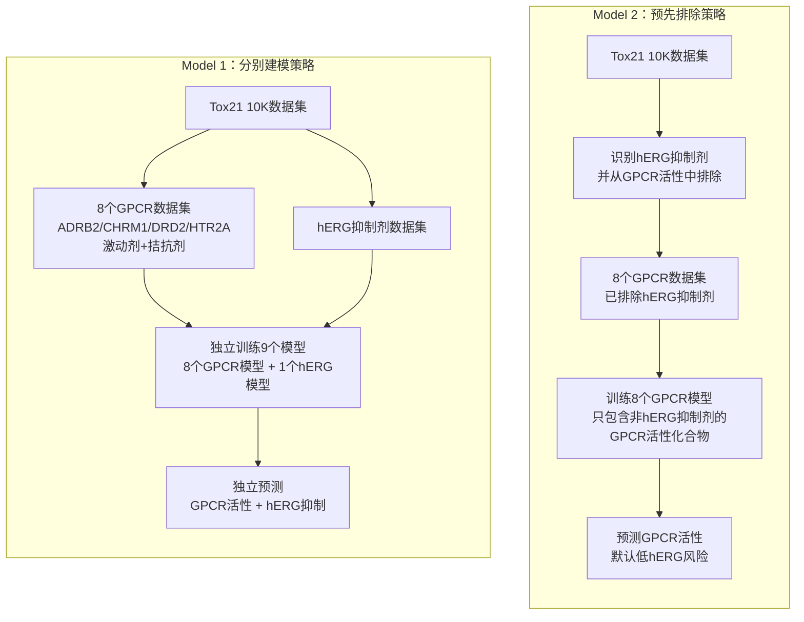
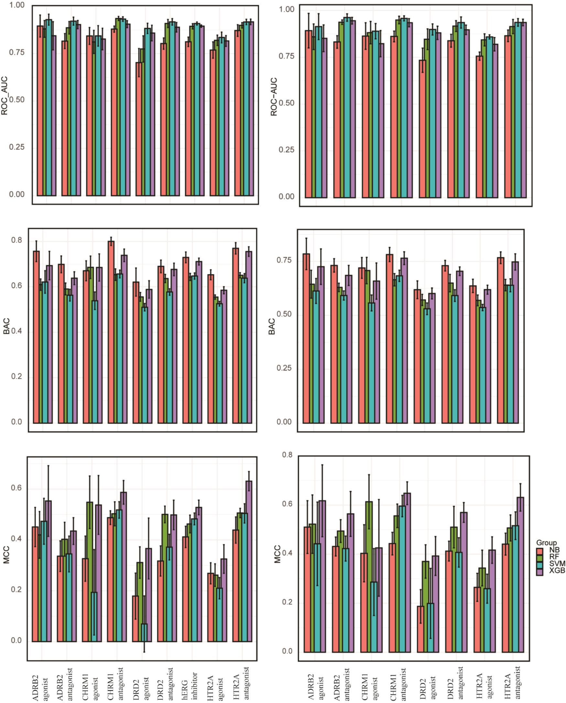
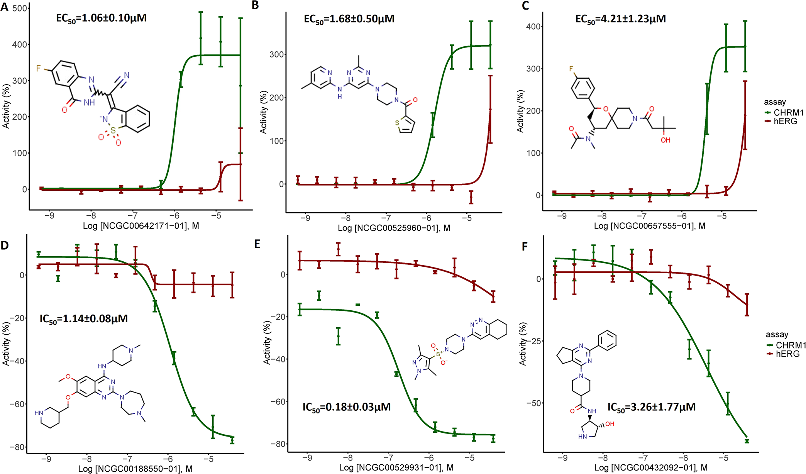

# 整合qHTS与QSAR：筛选hERG风险较低的GPCR先导化合物

## 本文信息
- **标题**：整合qHTS和QSAR模型以识别安全的GPCR靶向化合物：关注hERG依赖性心脏毒性
- **作者**：Xi Luo, Jinghua Zhao, Srilatha Sakamuru, Menghang Xia, Tuan Xu, Jameson Travers, Carleen Klumpp-Thomas, Hu Zhu, Matthew D. Hall, Stephen S. Ferguson, David M. Reif, Ruili Huang
- 发表时间： 2026年2月17日
- 单位： 美国国家推进转化科学中心（NCATS）、北卡罗来纳大学等（美国）
- 引用格式： Luo, X., Zhao, J., Sakamuru, S., Xia, M., Xu, T., Travers, J., Klumpp-Thomas, C., Zhu, H., Hall, M. D., Ferguson, S. S., Reif, D. M., & Huang, R. (2026). Integrating qHTS and QSAR Models to Identify Safe GPCR-Targeted Compounds: A Focus on hERG-Dependent Cardiotoxicity. *Journal of Chemical Information and Modeling*, *66*(7), 2474–2487. https://doi.org/10.1021/acs.jcim.5c02291
- **相关工具**：ChemoTyper（ToxPrint chemotypes）https://github.com/mn-am/chemotyper

## 摘要

> G蛋白偶联受体是**七跨膜受体家族**，通过G蛋白介导细胞外信号转导，在多种生理和神经过程中发挥**关键作用**。ADRB2、CHRM1、DRD2和HTR2A等重要GPCR靶点，与哮喘、精神分裂症等疾病的治疗密切相关。然而，许多靶向GPCR的药物会抑制**hERG钾离子通道**，导致**QT间期延长**，也就是心电图上反映心室去极到复极全过程的时间变长，并增加**心律失常风险**。本研究整合**定量高通量筛选**和基于**机器学习的定量结构活性关系模型**，采用不同的数据处理顺序预测**hERG风险较低的选择性GPCR靶向化合物**。模型在Tox21 10K化合物库上训练，经LOPAC数据集，即Library of Pharmacologically Active Compounds，外部验证，随后用于虚拟筛选约**36万个**多样化化合物，并对预测排名靠前的化合物进行实验验证，发现了多个**hERG风险较低的新型GPCR调节剂**。

### 核心结论

- **hERG毒性普遍存在**：在GPCR活性化合物中，尤其是拮抗剂模式中，hERG抑制剂的占比接近或超过**50%的GPCR活性拮抗剂**，强调在GPCR药物开发中**监测hERG抑制的重要性**
- **双模型策略有效**：Model 1和Model 2都能给出**稳定预测**，最优模型的AUC-ROC可达**AUC-ROC值0.84**以上
- **共识模型成功筛选**：使用四种ML算法（RF、SVM、NB、XGB）的共识策略筛选**1408个**CHRM1预测活性化合物，实验验证显示激动剂PPV达**阳性预测值0.72**，拮抗剂PPV达**阳性预测值0.91**，hERG模型的NPV为**阴性预测值81.6**%
- **发现新型先导化合物**：鉴定出多个具有**微摩尔级活性**的CHRM1激动剂和拮抗剂，且hERG抑制较弱，说明这套流程适合用于**早期候选物优先级排序**

## 背景

G蛋白偶联受体是**最大的细胞表面受体家族**，跨越细胞膜七次，通过细胞外环与配体结合，通过细胞内环与G蛋白相互作用。GPCR在各种生理和神经过程中至关重要，是哮喘、阿尔茨海默病、帕金森病、精神分裂症等**多种疾病的治疗靶点**。例如，β2肾上腺素受体激动剂如沙丁胺醇用于治疗哮喘，毒蕈碱乙酰胆碱受体M1激动剂如占诺美林可改善阿尔茨海默病的认知功能，多巴胺D2受体激动剂如普拉克索用于帕金森病，5-羟色胺受体2A拮抗剂如氯氮平用于精神分裂症。

然而，许多靶向GPCR的药物与**心脏毒性副作用**相关，这主要归因于它们对hERG（human Ether-à-go-go-Related Gene）钾离子通道的抑制作用。hERG编码Kv11.1，是延迟整流钾通道快速组分的α亚基，对心脏复极化至关重要。抑制hERG通道会导致**QT间期延长**。这里的QT间期，指的是心电图中从Q波起点到T波终点的一段时间，可粗略理解为心室完成一次电活动所需的时间。这个时间一旦拉长，就会增加尖端扭转性室性心动过速等**严重心律失常**的风险，可能进展为室颤和猝死。因此，hERG抑制是**药物淘汰和市场撤市的主要原因**，FDA要求几乎所有新的低分子量药物都必须进行“全面QT”研究以评估其对QT间期延长的影响。在**药物开发早期识别hERG抑制**对于预防心脏毒性、提高药物安全性、确保监管合规和优化药物开发过程至关重要。

定量高通量筛选是**一种强大的工具**，可用于识别各种分子靶点的新型先导化合物。**Tox21计划**应用qHTS测试了约10000个药物和环境化学物质（Tox21 10K化合物库），涵盖约80个体外实验，包括核受体、应激反应通路、GPCR以及其他毒性相关靶点。重要的是，扩展的Tox21实验组合还包括专门的**hERG通道抑制实验**，提供了**关键心脏毒性终点**的直接测量。Tox21实验数据已用于构建毒性预测模型以及识别疾病靶点的新型先导化合物。

基于机器学习的**定量结构活性关系模型**是传统湿实验室实验的实用且有效的替代方案，已被用于**虚拟筛选**大型化学库，以识别GPCR激动剂、拮抗剂以及hERG抑制剂。qHTS实验数据为开发ML模型提供了稳健的数据集，用于预测小分子对不同靶点，如GPCR与hERG的活性和选择性。先前研究已经报道，ML模型可以成功识别具有GPCR活性和hERG抑制活性的分子。然而，设计用于识别GPCR活性化合物的机器学习模型也可能同时选出抑制hERG的候选物。因此，需要在药物发现早期优先考虑兼具**GPCR活性和较低hERG风险**的虚拟筛选方法。

### 关键科学问题

- **GPCR药物的心脏毒性风险**：许多靶向GPCR的药物会抑制hERG通道，导致QT间期延长和心律失常，如何在药物开发早期**有效识别和排除hERG抑制剂**？
- **选择性预测的挑战**：如何构建能够**同时预测GPCR活性和hERG抑制**的机器学习模型，以筛选出具有选择性的安全先导化合物？
- **数据不平衡问题**：在GPCR活性化合物中，hERG抑制剂的比例很高（尤其是拮抗剂），如何处理这种**数据不平衡并训练稳健的分类模型**？
- **模型泛化能力**：如何确保模型在**化学结构多样的化合物库**中保持良好的预测性能，并成功应用于**外部验证和大规模虚拟筛选**？

### 创新点

- **双模型策略**：提出两种不同的建模策略，Model 1分别为8个GPCR靶点和hERG构建独立模型，Model 2在构建GPCR模型前排除hERG抑制剂，系统比较了两种策略的性能
- **整合qHTS与QSAR**：利用Tox21 10K化合物库的qHTS数据构建ML模型，结合ECFP4指纹和多种ML算法，实现了**从高通量筛选数据到虚拟筛选的有效转化**
- **共识模型筛选**：采用四种ML算法（RF、SVM、NB、XGB）的共识策略筛选约**36万个化合物**，并通过严格的**hERG排除阈值0.3**（预测概率≥预测概率阈值0.3）降低心脏毒性风险
- **实验验证成功**：对模型预测的CHRM1活性化合物进行实验验证，发现了多个具有**微摩尔级活性且无明显hERG抑制**的新型先导化合物，验证了模型的实用性

---

## 研究内容

本研究整合**定量高通量筛选**和**机器学习QSAR模型**，旨在开发能够预测**选择性GPCR靶向化合物**，即**hERG风险较低候选物**的计算方法。研究针对四个重要的GPCR靶点，即ADRB2、CHRM1、DRD2和HTR2A的激动剂和拮抗剂模式，采用两种不同的数据建模流程，即Model 1和Model 2构建分类模型，通过Tox21 10K化合物库的qHTS数据训练，LOPAC数据集外部验证，最终应用于NCATS内部约**36万**个化合物的虚拟筛选，并对预测排名靠前的化合物进行实验验证。

### 方法详述

#### 数据来源

Tox21 10K化合物库包含**8599个独特化合物**，其中约**3000个**为获批药物。研究通过qHTS获得四个GPCR靶点，即ADRB2、CHRM1、DRD2和HTR2A的激动剂与拮抗剂活性数据，以及hERG通道抑制数据。每个化合物都在**15个浓度**下进行**三重复测试**。

#### 数据处理流程

- **曲线分级**：根据浓度-响应曲线观察到的形状分配类别（**1.1-1.4和2.1-2.4为活性**，**3为活性**，**4为非活性**）
- **曲线秩次**：转换为-9到9之间的整数，秩次越高表示曲线质量、效力和有效性越高**。抑制剂分配负秩次，激活剂分配正秩次**
- **活性判定**：基于**平均曲线秩次和三次重复实验的重现性**，将化合物分配为“活性激动剂/拮抗剂”、“非结论性激动剂/拮抗剂”、“非结论性”或“非活性”

**图1：模型构建和外部验证的数据集与框架**
- **图1A**：hERG抑制剂（橙色段）在八个数据集的活性GPCR化合物中的分布（包含橙色和蓝色段的柱子），包括**ADRB2、CHRM1、DRD2和HTR2A**的激动剂和拮抗剂
- **图1B**：GPCR实验数据中**活性和非活性化合物的分布**
- **图1C**：两种ML模型使用的数据集中活性和非活性化合物的分布，Model 1分别为**8个GPCR靶点和hERG**构建独立模型，Model 2从GPCR活性化合物中**排除hERG抑制剂**
- **图1D**：外部验证数据集（LOPAC）中**活性和非活性化合物的分布**
- **图1E**：虚拟筛选约**36万个**多样化化合物并对选定的预测进行**实验验证的流程**

这张图把整篇文章的逻辑压缩得很清楚。图1A先说明问题本身，即**活性GPCR化合物里混有大量hERG抑制剂**；图1C再展示**两种建模流程的差别**；图1D和图1E则对应外部验证与大规模虚拟筛选，基本就是全文的方法主线。

#### 双模型建模策略

本研究采用两种不同的建模流程来预测选择性GPCR靶向化合物：

**Model 1**采用**分别建模**策略，为8个GPCR靶点和hERG构建**独立的分类模型**，优点是**灵活性高**，可根据实际需求调整GPCR活性和hERG毒性的权重。**Model 2**采用**预先排除**策略，在训练GPCR模型前先排除hERG抑制剂，直接训练选择性模型，优点是**简化后续筛选流程**。通过对比两种策略，可以系统评估**先识别活性、再剔除hERG风险**与**直接训练选择性模型**的优劣。

#### 分子描述符

ECFP4（Extended Connectivity Fingerprints 4）为**1024位指纹**，编码局部原子环境，如原子类型、芳香性、环成员、杂原子和键序，用来捕获**常见亚结构特征**。

#### 机器学习算法

| 算法 | 作用特点 |
| --- | --- |
| 朴素贝叶斯 | 概率分类器，假设特征之间相互独立 |
| 随机森林 | 集成学习方法，通过多棵决策树投票得到结果 |
| 支持向量机 | 通过寻找最优超平面拉开不同类别间隔 |
| XGBoost | 梯度提升树方法，迭代优化分类误差 |

#### 模型评估

| 项目 | 设置 |
| --- | --- |
| 交叉验证 | 5折分层交叉验证，重复10次 |
| 性能指标 | AUC-ROC、平衡准确率、马修斯相关系数 |
| 类别平衡 | 在训练集上使用随机欠采样 |

#### 共识策略

使用**四种经过验证的机器学习分类器**，即RF、SVM、NB和XGB，在Tox21 10K化合物库上训练并经LOPAC数据集外部验证的模型，对NCATS内部约**36万个化学多样性化合物进行虚拟筛选**。如果四个模型独立给出的活性概率都高于各自阈值，化合物才会被判定为GPCR活性。

#### hERG排除

为最大限度降低心脏毒性风险，研究统一使用**hERG排除阈值0.3**：凡是预测hERG抑制概率大于等于阈值0.3的化合物都会被排除。由于资源限制，最终每个GPCR靶点只保留约2000个候选，优先进入实验的是预测GPCR活性更高、预测hERG风险更低的那一批。

#### 实验验证

基于四种ML模型的预测概率，研究选择模型预测的CHRM1活性化合物进行实验验证。总计测试**1408个化合物**，其中包括382个预测激动剂和1037个预测拮抗剂，另有**12个化合物**同时被预测为激动剂与拮抗剂。这些样品随后在CHRM1激动剂模式、CHRM1拮抗剂模式和hERG抑制实验中接受测试。

### 结果与分析

#### hERG毒性在GPCR药物中的普遍性

图1A揭示了hERG抑制剂在GPCR活性化合物中的广泛分布。例如，在45个ADRB2活性激动剂中，有13个化合物是hERG抑制剂。在其他GPCR活性化合物中也发现了大量的hERG抑制剂，尤其是在拮抗剂模式实验中，接近或超过**50%的GPCR活性拮抗剂**也抑制hERG。这种高比例的hERG毒性表明，单纯筛选GPCR活性化合物不足以确保药物安全性，必须同时评估hERG抑制风险。

#### 模型训练性能评估

**图2：Model 1（左）和Model 2（右）的性能**
- 使用**四种ML算法**（NB、RF、SVM和XGB）开发的模型通过受试者工作特征曲线下面积（AUC-ROC）、平衡准确率和马修斯相关系数进行评估
- 指标报告为**10次5折分层交叉验证**中各折的**平均值±标准差**
- 在每一折中，数据集分为**训练和测试子集**，对训练数据应用**随机欠采样**以处理类别不平衡，并通过评估预测概率与测试集对比来计算AUC-ROC、BAC和MCC指标

图2的重点不是某一个单独柱子有多高，而是两个关键观察。
- 第一，不同算法之间确实有差异，但多数任务都能维持在可用区间，说明**数据本身足以支撑分类建模**。
- 第二，Model 2在大多数GPCR任务上的AUC-ROC略高，但这**并不自动意味着它在筛掉hERG风险这件事上更好**，后面还要结合表2和实验验证一起看。

#### Model 1与Model 2性能对比

| 靶点 | Model 1最佳算法 | Model 1 AUC-ROC | Model 2最佳算法 | Model 2 AUC-ROC |
| --- | --- | --- | --- | --- |
| ADRB2激动剂 | SVM | **0.93±0.03** | SVM | **0.91±0.07** |
| ADRB2拮抗剂 | SVM | **0.92±0.02** | SVM | **0.96±0.02** |
| CHRM1激动剂 | NB | **0.84±0.04** | SVM | **0.89±0.04** |
| CHRM1拮抗剂 | RF | **0.94±0.01** | SVM | **0.96±0.01** |
| DRD2激动剂 | SVM | **0.88±0.03** | SVM | **0.90±0.03** |
| DRD2拮抗剂 | SVM | **0.92±0.02** | SVM | **0.94±0.03** |
| HTR2A激动剂 | SVM | **0.84±0.03** | SVM | **0.86±0.01** |
| HTR2A拮抗剂 | SVM | **0.92±0.01** | SVM | **0.94±0.02** |
| hERG抑制剂 | SVM | **0.91±0.01** | NA | NA |

- AUC-ROC结果表明大多数模型表现良好，至少有一种ML方法在每个GPCR靶点上达到AUC-ROC>**AUC-ROC阈值0.84**，在预测hERG抑制剂时达到AUC-ROC=**AUC-ROC值0.90**
- GPCR的AUC-ROC值范围为**AUC-ROC下限0.70**至**AUC-ROC上限0.94**，hERG抑制剂的AUC-ROC值范围为**AUC-ROC下限0.81**至**AUC-ROC上限0.91**
- SVM在大多数GPCR和hERG分类任务中表现最佳，表明其在处理**高维分子描述符方面的优势**
- **模型稳定性**：10次迭代的性能指标（表S1）显示**高度一致性**，支持模型达到**稳定性能**。BAC和MCC的最优值遵循与AUC-ROC相同的趋势，即当AUC-ROC值较大时，**BAC和MCC也显示较大值**。

#### 骨架拆分验证

为了评估**结构泛化能力**，研究使用**Bemis-Murcko骨架拆分**评估了RF和SVM模型。如预期的那样，基于骨架的分区降低了大多数靶点的AUC，反映了**预测新型化学类型活性的难度**。
- CHRM1激动剂和HTR2A拮抗剂观察到最大的下降，可能是由于这些靶点的活性化合物**结构多样性有限**，限制了**骨架特定特征的可转移性**。
- 相比之下，包括ADRB2和CHRM1拮抗剂以及DRD2激动剂/拮抗剂在内的几个靶点的模型保持了相对较高的AUC（**AUC下限0.80**至**AUC上限0.89**），表明**更一致的结构-活性关系**。
总体而言，骨架拆分分析表明，虽然在严格的骨架分离下性能有所下降，但模型对**多个GPCR靶点和hERG抑制保留了有意义的预测能力**。

**结构冗余评估**：在使用**Tanimoto系数**评估LOPAC外部验证集与训练数据之间的**结构冗余**后，发现**630个LOPAC化合物**的Tanimoto系数为1，表明**可能是重复化合物**。这些**高相似性化合物**可能会**高估外部验证性能**，因此研究在计算PPV时**排除了这些化合物**。

#### 外部验证结果

使用**LOPAC数据集**（Library of Pharmacologically Active Compounds）作为**外部验证集**评估了在Tox21 10K数据上训练的模型性能。

**表1：基于LOPAC实验的两种建模流程外部验证结果**

| GPCR | Model 1最佳算法 | Model 1 PPV范围 | Model 2最佳算法 | Model 2 PPV范围 |
| --- | --- | --- | --- | --- |
| CHRM1激动剂 | SVM | **0.41-1.00** | SVM | **0.47-1.00** |
| CHRM1拮抗剂 | SVM | **0.65-0.95** | SVM | **0.64-0.94** |
| HTR2A激动剂 | XGB | **0.65-0.90** | XGB | **0.60-0.90** |
| DRD2拮抗剂 | SVM | **0.74-0.90** | SVM | **0.73-0.86** |
| ADRB2拮抗剂 | RF | **0.58-0.81** | RF | **0.53-0.76** |
| DRD2激动剂 | XGB | **0.32-0.69** | SVM | **0.30-0.73** |
| ADRB2激动剂 | SVM | **0.54-0.64** | RF | **0.51-0.68** |
| HTR2A拮抗剂 | RF | **0.14-0.20** | RF | **0.14-0.23** |
| hERG抑制剂 | SVM | **0.93** | NA | NA |

外部验证显示**大多数模型表现良好**，至少有一种ML方法在每个GPCR靶点上达到PPV>**PPV阈值0.64**（Model 1）或PPV>**PPV阈值0.68**（Model 2）。SVM在识别hERG抑制剂方面表现突出，Model 1的SVM达到**PPV为0.93**。值得注意的是，由于原始LOPAC集合中只有**5个HTR2A拮抗剂**，研究添加了**49个经验证的其他活性物质**使总数达到54个，产生了**更可靠的PPV**。

**表2：GPCR激动剂与拮抗剂的平均hERG抑制效力**

原文的**表2**比较了不同靶点、不同模式下化合物的**平均hERG抑制强度**，以 `-LogAC50` 表示。这个表**很关键**，因为它回答的不是**谁的分类分数更高**，而是**模型挑出来的分子到底是不是更不容易打到hERG**。

| 靶点 | 模式 | Active | Inactive | Model 1 active | Model 1 active（hERG-inactive only） | Model 2 active |
| --- | --- | --- | --- | --- | --- | --- |
| ADRB2 | 激动剂 | 4.32 ± 0.54 | 4.14 ± 1.00 | 4.17 ± 0.35 | 4.12 ± 0.31 | 3.61 ± 1.99 |
| ADRB2 | 拮抗剂 | 4.63 ± 0.63 | 4.07 ± 1.00 | 4.73 ± 0.80 | 4.16 ± 0.42 | 4.75 ± 0.88 |
| CHRM1 | 激动剂 | 4.24 ± 1.09 | 4.15 ± 0.96 | 4.27 ± 0.54 | 4.00 ± 0.00 | 4.24 ± 0.51 |
| CHRM1 | 拮抗剂 | 4.58 ± 0.82 | 4.03 ± 0.98 | 4.79 ± 0.66 | 4.08 ± 0.27 | 4.65 ± 0.68 |
| DRD2 | 激动剂 | 4.31 ± 0.41 | 4.15 ± 1.00 | 4.35 ± 0.40 | 4.17 ± 0.30 | 4.33 ± 0.40 |
| DRD2 | 拮抗剂 | 4.36 ± 1.37 | 4.05 ± 0.65 | 4.93 ± 0.75 | 4.20 ± 0.41 | 4.92 ± 0.81 |
| HTR2A | 激动剂 | 4.44 ± 1.05 | 4.06 ± 0.92 | 4.39 ± 0.51 | 4.15 ± 0.29 | 4.53 ± 0.61 |
| HTR2A | 拮抗剂 | 4.32 ± 0.73 | 4.16 ± 0.97 | 4.68 ± 0.89 | 4.17 ± 0.92 | 4.20 ± 0.75 |

这张表支持了文中的一个**重要判断**：GPCR活性化合物，尤其是拮抗剂，平均来看往往伴随更强的hERG抑制；而在Model 1中先用hERG模型做排除，通常能把预测命中的hERG抑制强度再往下压一截。换句话说，Model 2在若干分类指标上略占优，但Model 1在**先识别活性、再剔除hERG风险**这条路线下，对**降低hERG负担更直接**。

#### 实验验证结果

**图3：模型预测的CHRM1激动剂/拮抗剂的实验验证**
- **图3A-C**：代表性强效CHRM1激动剂的**结构和浓度-响应曲线**，**绿色曲线表示CHRM1活性**，**红色曲线表示hERG活性**
- **图3D-F**：代表性CHRM1拮抗剂的**结构和浓度-响应曲线**，**绿色曲线表示CHRM1活性**，**红色曲线表示hERG活性**

图3是全文**最重要的落地证据**。前三个例子显示，模型不仅能找到CHRM1激动剂，而且这些化合物的绿色曲线与红色曲线明显分开，说明**CHRM1活性先出现而hERG作用较弱**。后三个拮抗剂例子也传达同样的信息，即真正值得继续推进的，不只是**有活性**，而是**活性与hERG风险之间有窗口**。

#### CHRM1激动剂验证

| 指标 | 结果 |
| --- | --- |
| 第一轮测试数量 | 382个预测CHRM1激动剂 |
| 确认为活性 | 274个 |
| PPV | **阳性预测值0.72** |
| 强效激动剂 | 103个，$\mathrm{EC50} < 10~\mu\mathrm{M}$ |
| 代表化合物1 | NCGC00642171-01，$\mathrm{EC50} = 1.06 \pm 0.10~\mu\mathrm{M}$ |
| 代表化合物2 | NCGC00525960-01，$\mathrm{EC50} = 1.68 \pm 0.50~\mu\mathrm{M}$ |
| 代表化合物3 | NCGC00657555-01，$\mathrm{EC50} = 4.21 \pm 1.23~\mu\mathrm{M}$ |

这部分结果说明，模型在激动剂方向上的主要价值是把**极低的原始命中率显著拉高**，并且挑出了一批后续值得进入确认实验的候选。

#### CHRM1拮抗剂验证

| 指标 | 结果 |
| --- | --- |
| 第一轮测试数量 | 1037个预测CHRM1拮抗剂 |
| 确认为活性 | 945个 |
| PPV | **阳性预测值0.91** |
| 确认后仍活跃且无显著hERG抑制 | 66个 |
| 强效抑制 | **34个化合物**，$\mathrm{IC50} < 5~\mu\mathrm{M}$ |
| 更强一档 | 10个，$\mathrm{IC50} < 1~\mu\mathrm{M}$ |
| 已知CHRM1拮抗剂 | 6个 |
| hERG例外 | riboflavin tetrabutyrate 与 NCGC00449480 |

拮抗剂结果比激动剂更亮眼，尤其体现在**PPV**上。这也和前面的数据分布一致，即CHRM1拮抗剂数据集本身更大、更容易学到稳定的结构信号。

#### hERG选择性预测性能

使用阴性预测值（NPV）评估时，TN指在hERG实验中未显示抑制，或hERG抑制效力至少比CHRM1活性低3倍的化合物；FN指以与CHRM1活性相似或更高效力抑制hERG的化合物。总体而言，模型预测化合物在hERG抑制实验中的命中率为**命中率18.4**%，对应hERG模型的NPV为**阴性预测值81.6**%。这个结果不能理解成“几乎没有hERG风险”，但足以说明它能把原始化合物库中大量潜在hERG抑制剂预先筛掉。

---

## 关键结论与批判性总结

### 主要贡献

本研究把qHTS数据、QSAR建模、外部验证和后续实验确认串成了一条**完整流程**。通过比较Model 1与Model 2，作者表明**活性预测**和**hERG风险控制**可以被同时纳入同一个筛选框架。对约**36万**个化合物的虚拟筛选及CHRM1实验证明，这套流程确实能**提高命中率**，并在一定程度上**降低hERG相关风险**。实验验证结果显示，ML模型可用于识别具有最小hERG抑制的潜在GPCR药物，模型在识别具有最小hERG抑制的新GPCR靶向化合物方面表现良好。这些模型预测的GPCR靶向化合物为**实验测试和进一步开发为药物先导化合物**提供了优先级排序的候选列表，为开发更安全的GPCR靶向疗法提供了框架，强调了**平衡疗效和心脏安全性的策略需求**。

### 方法学优势

- **双模型策略**：Model 1提供了GPCR与hERG的独立预测，Model 2则把**去除hERG抑制剂**这一步提前到了建模阶段，两者侧重点不同。根据模型去除hERG抑制剂能力的评估，分别为GPCR靶点和hERG构建的独立模型在去除hERG抑制剂方面比从训练数据中预先排除hERG抑制剂的模型更有效
- **共识模型**：四种ML算法联合决策，减少了单一模型偶然命中的影响。与CardioGenAI和CToxPred2等先进hERG责任框架相比，本研究的分类模型（特别是XGB和SVM）表现出更高的特异性（**特异性范围0.98-0.99**）和更强的平衡准确率（XGB=**平衡准确率0.77**，SVM=**平衡准确率0.75**）
- **实验闭环**：不是停留在交叉验证或外部验证，而是进一步做了CHRM1与hERG实验确认，发现了多个具有**微摩尔级活性**的新型CHRM1激动剂和拮抗剂，且大多数CHRM1激动剂和拮抗剂对hERG抑制的影响较小（hERG实验中IC50>**IC50阈值6.2μM**）
- **可解释比较**：不仅比较分类指标，还用表2直接比较了命中化合物的hERG抑制强度，为模型选择提供了**定量依据**

### 局限性

- **仅验证CHRM1**：由于资源限制，研究仅对CHRM1预测化合物进行实验验证，其他GPCR模型（ADRB2、DRD2和HTR2A）的实验验证性能可能不同，且一些预测为非活性的化合物可能实际上是活性的（即假阴性）
- **体外实验依赖性**：研究仅应用了一种体外实验方法来生成GPCR靶点和hERG的数据以训练和测试模型，这些实验本身存在假阳性和假阴性率，模型质量因此依赖于实验的技术和生物学可靠性。例如，CHRM1激动剂模式实验的确认率相对较低
- **单一心脏毒性终点**：研究仅考虑了hERG依赖性心脏毒性，未考虑来自其他潜在途径的心脏毒性效应
- **骨架泛化能力**：骨架拆分验证表明模型在预测新型化学类型时性能下降，在某些GPCR靶点（如CHRM1激动剂和HTR2A拮抗剂）观察到最大下降，可能是由于这些靶点的活性化合物结构多样性有限

### 未来方向

- **扩展验证范围**：对其他GPCR靶点（ADRB2、DRD2、HTR2A）的预测化合物进行实验验证，评估模型在不同靶点上的泛化能力
- **多目标优化**：探索同时考虑GPCR活性、hERG抑制与其他ADMET性质的**多目标筛选策略**，优化hERG排除阈值以适应不同GPCR靶点和项目阶段的风险容忍度
- **数据来源多样化**：尝试更丰富的分子表示方法和更广的训练数据来源，提升模型对新骨架的外推能力
- **多心脏毒性终点整合**：除了hERG依赖性心脏毒性外，还应考虑来自其他潜在途径的心脏毒性效应，构建更全面的心脏安全性预测框架
