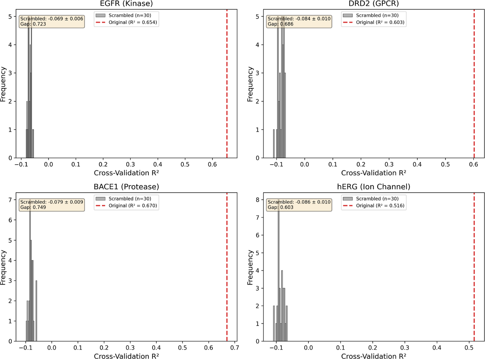
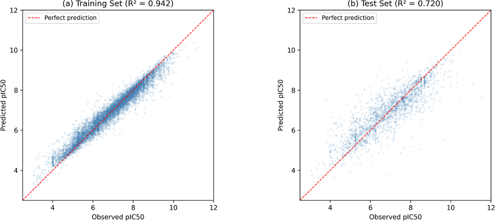
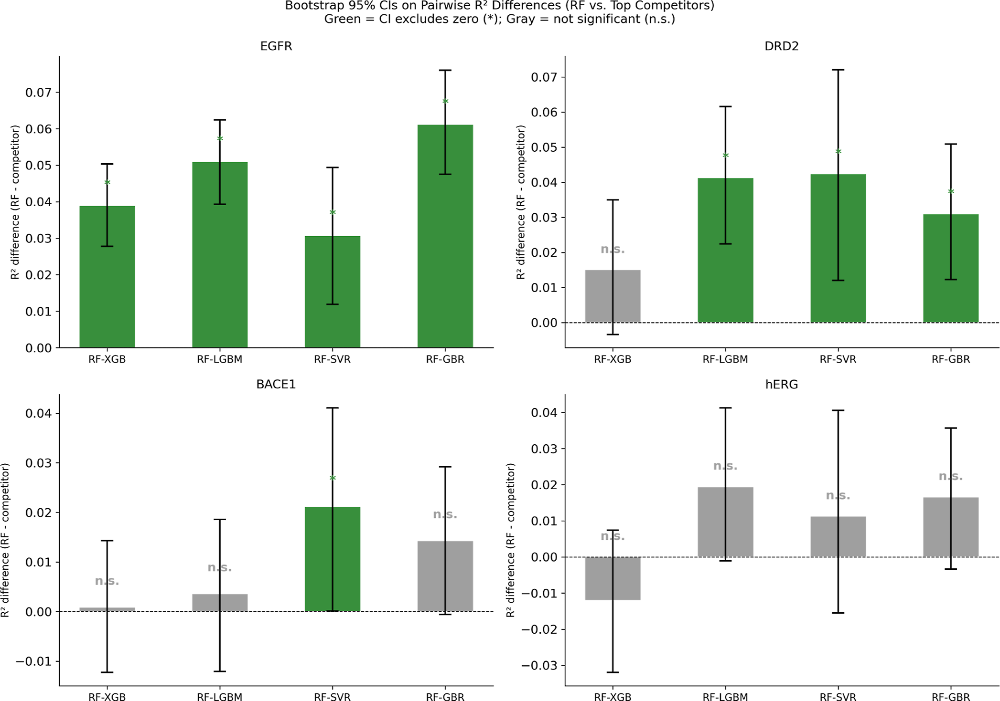
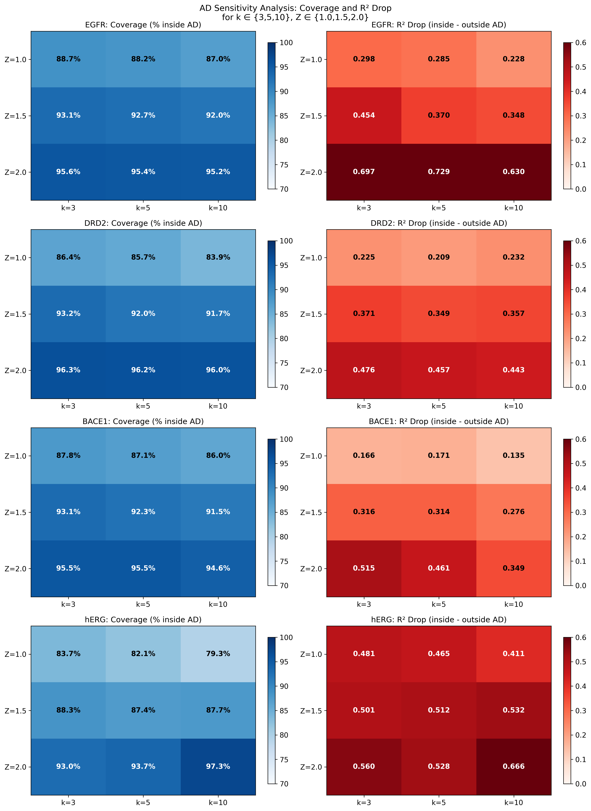
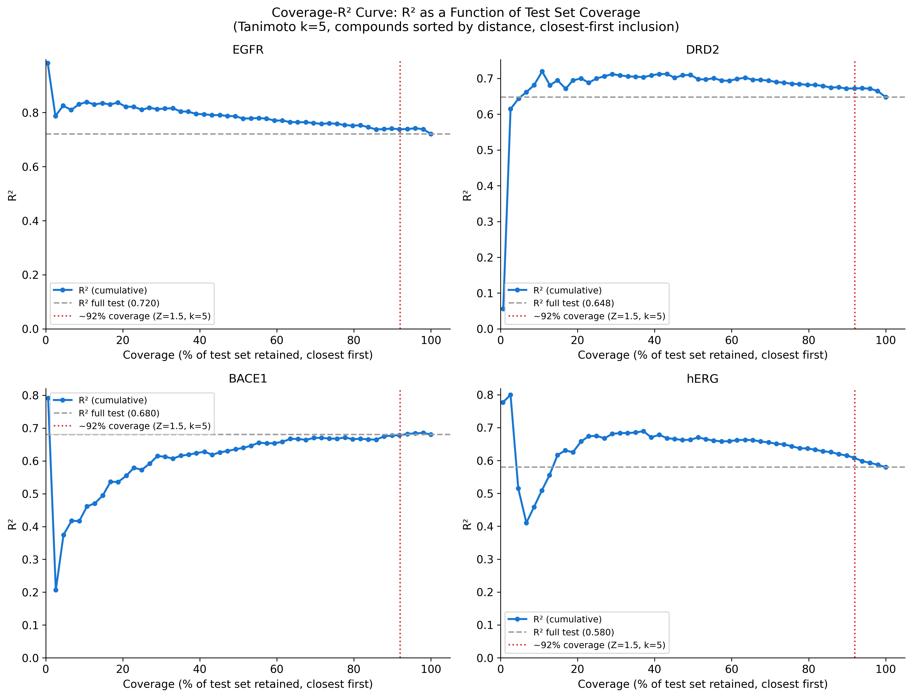
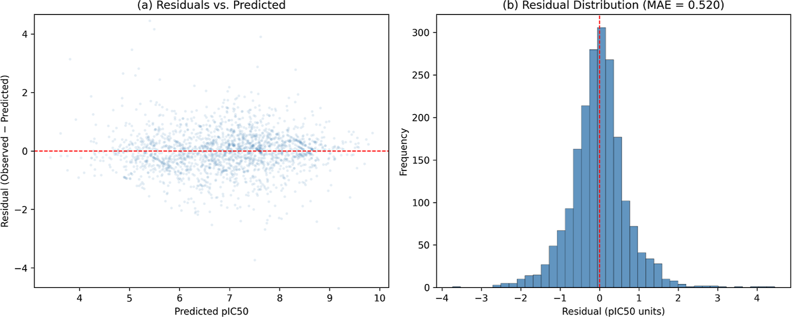

# 附录：QSAR基准测试的技术细节与补充分析

本附录补充主文档中未展开的技术细节，包括Y-scrambling验证、bootstrap置信区间分析、scaffold划分的详细统计量，并补充适用域敏感性分析、EGFR残差分析和活性悬崖完整描述符对比。

## Y-scrambling验证

Y-scrambling（响应变量随机打乱）是验证QSAR模型是否捕获了真实的构效关系信号、而非偶然相关性的标准方法。本研究在LightGBM + ECFP4上进行了30次打乱迭代：

**方法流程**：保持描述符矩阵不变，随机打乱训练集的pActivity值，每次打乱后重新训练模型并计算5折交叉验证$R^2$。

| 靶点 | 原始CV $R^2$ | 打乱均值 | 打乱SD | 差距 |
| --- | --- | --- | --- | --- |
| EGFR | 0.654 | −0.069 | 0.007 | 0.723 |
| DRD2 | 0.603 | −0.084 | 0.010 | 0.687 |
| BACE-1 | 0.670 | −0.079 | 0.010 | 0.749 |
| hERG | 0.516 | −0.086 | 0.010 | 0.602 |

**图8：四个靶点的Y-scrambling验证**。红色直方图为30次打乱后的CV $R^2$分布（均值接近零或为负值），红色虚线为原始模型的CV $R^2$。原始模型与打乱分布之间的巨大差距（0.60–0.75 $R^2$）证实了模型捕获的是真实的结构-活性关系信号

所有四个靶点的打乱$R^2$均值均在零附近或为负值（−0.069至−0.086），与原始模型$R^2$的差距均超过0.60。

> **Y-scrambling验证了模型捕获的是真实构效关系信号**：打乱后$R^2$均值接近零或为负值，与原始模型的差距（0.60–0.75）显著，排除了算法偏差或数据伪影导致虚假高性能的可能性。这是QSAR模型验证的标准步骤，确保模型学到的是真正的结构-活性关系而非偶然相关性。

## Bootstrap置信区间与算法差异的统计检验

为了评估RF对其他算法的优势是否具有统计显著性，研究计算了1000次bootstrap重采样的95%置信区间。以EGFR为例（ECFP4，随机划分）：

| 对比 | $\Delta R^2$（RF − 对手） | 95% CI | 是否显著 |
| --- | --- | --- | --- |
| RF vs XGB | +0.039 | [+0.028, +0.050] | 是 |
| RF vs LGBM | +0.051 | [+0.039, +0.062] | 是 |
| RF vs SVR | +0.031 | [+0.012, +0.049] | 是 |
| RF vs GBR | +0.061 | [+0.048, +0.076] | 是 |

**图3：EGFR上RF + ECFP4的预测值与观测值散点图**。训练集$R^2$ = 0.942（a），测试集$R^2$ = 0.720（b），训练-测试差距为0.222，反映了RF在中等规模数据集上的典型过拟合程度。测试集中数据点沿完美预测线的分散程度在活性范围两端略有增大，这与训练数据密度效应一致

**图4：四个靶点上RF与Top竞争算法的$R^2$差异的bootstrap 95%置信区间**。绿色柱表示RF优势具有统计显著性（CI不包含零），灰色柱表示差异不显著。RF在EGFR和DRD2上的优势较稳定，但在BACE-1和hERG上的多数小幅差异并不显著

统计显著性具有明显的靶点依赖性：RF在EGFR上相对四个竞争算法均显著占优，在DRD2上相对LGBM、SVR和GBR显著但相对XGB不显著；在BACE-1上仅相对SVR显著；在hERG上所有对比均未达到显著。

> **统计显著性检验揭示了RF优势的靶点依赖性**：在EGFR上RF的优势最稳健（对所有竞争算法均显著），但在hERG上所有小幅$R^2$差异均未达到统计显著。这说明**RF是可靠的强基线，但不能把所有小幅$R^2$差异都解释为真实优势**，特别是在hERG等噪声较高的靶点上。

## Scaffold划分的详细统计量

Bemis-Murcko scaffold划分（seed = 42，目标80:20比例）的详细统计信息：

| 靶点 | 总化合物 | 唯一scaffold | 孤立scaffold（%） | 最大cluster | 训练集 | 测试集 | 测试占比 | pActivity偏移（KS检验） |
| --- | --- | --- | --- | --- | --- | --- | --- | --- |
| EGFR | 10036 | 3700 | 2490（67.3%） | 547 | 7780 | 2256 | 22.5% | +0.249（p < 0.001） |
| DRD2 | 7558 | 3549 | 2501（70.5%） | 69 | 6036 | 1522 | 20.1% | +0.008（p = 0.256） |
| BACE-1 | 8080 | 3156 | 2089（66.2%） | 146 | 6463 | 1617 | 20.0% | +0.168（p < 0.001） |
| hERG | 8077 | 4131 | 2977（72.1%） | 103 | 6460 | 1617 | 20.0% | +0.086（p < 0.001） |

几个关键观察：

- **EGFR的scaffold cluster最大**（547个化合物），且scaffold多样性较低（3700个唯一scaffold对应10036个化合物），这与其激酶抑制剂的高度保守骨架结构一致
- **DRD2的pActivity偏移最小**（+0.008，KS p = 0.256），说明训练集和测试集在活性分布上高度一致，其较小的scaffold gap（0.084）不能归因于分布偏移
- **EGFR的pActivity偏移最大**（+0.249，KS p < 0.001），测试集的活性均值高于训练集，这意味着scaffold划分将更多高活性化合物分入了测试集，这是其较大scaffold gap的重要贡献因素之一
- **hERG的孤立scaffold比例最高**（72.1%），反映了hERG抑制剂化学空间的高度碎片化

## 适用域参数敏感性分析

**图S2：适用域参数敏感性热力图**。展示不同参数组合（$k \in \{3,5,10\}$近邻，$Z \in \{1.0,1.5,2.0\}$阈值）下的域内覆盖率和域内外$R^2$降幅。左列蓝色热图为域内覆盖率，右列红色热图为域内$R^2$减域外$R^2$。覆盖率总体随$Z$阈值放松而增加，hERG在多数参数组合下都表现出最大的域内外$R^2$降幅，说明其预测质量对化学域边界最敏感

**图S3：测试集覆盖率与累积$R^2$关系**。图面显示化合物按到训练集的Tanimoto距离从近到远依次纳入时的累积$R^2$变化；PDF图注将其概括为适用域覆盖率与域内$R^2$的权衡。灰色虚线为完整测试集$R^2$，红色虚线为默认参数（$k=5, Z=1.5$）对应的约87–95%覆盖率。总体上，阈值越严格，覆盖率越低，但保留下来的化合物通常更接近训练域，域内预测质量更高

## 残差分析

**图14：EGFR上RF + ECFP4的残差分析**。（a）残差与预测$\mathrm{pIC}_{50}$的关系：x轴为预测值，y轴为残差（观测值 − 预测值），点云未显示随预测值单调变化的系统性趋势。（b）残差分布直方图：残差近似对称，平均绝对误差为0.520 $\mathrm{pIC}_{50}$单位。该结果说明EGFR随机划分测试集上没有明显的整体偏高或偏低预测偏差，但并不等价于对活性极端区域或新scaffold完全可靠。

## 活性悬崖的完整描述符对比

不同描述符识别的cliff对数量差异巨大。使用各描述符自身的Tanimoto相似度阈值（相同活性阈值$|\Delta \mathrm{pActivity}| \ge 2.0$）统计时，ECFP4在四个靶点上识别出的cliff对分别为EGFR 8547对、DRD2 1222对、BACE-1 9531对和hERG 2529对。

MACCS结构键指纹**过度识别cliff对**（如EGFR上MACCS识别2,330,306对，而ECFP4仅8547对），这是因为166位预定义子结构模式过于粗糙，将大量结构略有差异的化合物对判定为“高度相似”。ECFP6相比ECFP4识别的cliff对少40–56%，因为radius=3的圆形环境使化合物显得更不相似，在相同Tanimoto阈值下更难满足”结构相似”的条件。

这一数量差异进一步印证了**描述符选择对活性悬崖分析的影响**：使用不同描述符会得到截然不同的cliff景观，因此cliff相关结论需要谨慎考虑描述符依赖性。

完整的活性悬崖预测结果如下（RF，随机划分，seed = 42）。这里的cliff测试化合物按ECFP4 Tanimoto $\ge 0.6$且$|\Delta \mathrm{pActivity}| \ge 2.0$定义，表格比较不同描述符对这些cliff化合物与非cliff化合物的预测质量：

| 靶点 | 描述符 | cliff测试化合物 | 非cliff测试化合物 | $R^2_{all}$ | $R^2_{cliff}$ | $R^2_{non-cliff}$ |
| --- | --- | --- | --- | --- | --- | --- |
| EGFR | ECFP4 | 765 | 1243 | 0.720 | **0.632** | 0.773 |
| EGFR | ECFP6 | 765 | 1243 | 0.716 | 0.631 | 0.765 |
| EGFR | MACCS | 765 | 1243 | 0.646 | 0.543 | 0.706 |
| EGFR | RDKit-2D | 765 | 1243 | 0.671 | 0.575 | 0.727 |
| EGFR | RDKit-2D+ECFP4 | 765 | 1243 | 0.706 | 0.613 | 0.761 |
| DRD2 | ECFP4 | 219 | 1293 | 0.641 | **0.476** | 0.682 |
| DRD2 | ECFP6 | 219 | 1293 | 0.634 | 0.449 | 0.681 |
| DRD2 | MACCS | 219 | 1293 | 0.541 | 0.316 | 0.597 |
| DRD2 | RDKit-2D | 219 | 1293 | 0.556 | 0.375 | 0.599 |
| DRD2 | RDKit-2D+ECFP4 | 219 | 1293 | 0.628 | 0.437 | 0.677 |
| BACE-1 | ECFP4 | 618 | 998 | 0.682 | **0.517** | 0.767 |
| BACE-1 | ECFP6 | 618 | 998 | 0.679 | **0.517** | 0.761 |
| BACE-1 | MACCS | 618 | 998 | 0.638 | 0.457 | 0.731 |
| BACE-1 | RDKit-2D | 618 | 998 | 0.650 | 0.465 | 0.746 |
| BACE-1 | RDKit-2D+ECFP4 | 618 | 998 | 0.671 | 0.495 | 0.763 |
| hERG | ECFP4 | 174 | 1442 | 0.584 | 0.481 | 0.581 |
| hERG | ECFP6 | 174 | 1442 | 0.575 | 0.458 | 0.577 |
| hERG | MACCS | 174 | 1442 | 0.550 | 0.426 | 0.551 |
| hERG | RDKit-2D | 174 | 1442 | 0.568 | 0.478 | 0.557 |
| hERG | RDKit-2D+ECFP4 | 174 | 1442 | 0.595 | **0.497** | 0.591 |

ECFP4在EGFR和DRD2两个靶点的cliff化合物预测上表现最佳，在BACE-1上与ECFP6并列最高（均为0.517）；hERG上则是RDKit-2D + ECFP4组合描述符最高（0.497），略高于ECFP4（0.481）。MACCS的cliff预测$R^2$始终最低，尤其是对DRD2（$R^2_{cliff}$仅0.316），进一步印证了预定义结构键指纹在精细结构区分上的局限性。

> **MACCS结构键指纹不适用于cliff分析**：166位预定义子结构模式过于粗糙，在EGFR上错误识别233万对cliff（而ECFP4仅8547对），将大量结构略有差异的化合物对判定为“高度相似”。这导致MACCS的cliff预测$R^2$在所有靶点上始终最低，说明**描述符选择会显著影响cliff景观**，cliff相关结论必须考虑描述符依赖性。
