# QSAR算法排名在四大靶点上高度一致，但scaffold泛化差距因靶点而异

## 本文信息

- **标题**：系统性多靶点QSAR基准测试：机器学习算法、分子描述符与验证策略
- **作者**：Salah A. Alshehade, Ghazi Al Jabal, Iqbal H. Jebril
- **发表期刊**：Journal of Chemical Information and Modeling
- **发表时间**：2026年（Received：2026年4月21日；Revised：2026年5月21日；Accepted：2026年5月26日）
- **DOI**：https://doi.org/10.1021/acs.jcim.6c01237
- **单位**：Universiti Sultan Zainal Abidin（马来西亚）、MAHSA University（马来西亚）、Yarmouk Private University（叙利亚）、Al-Zaytoonah University of Jordan（约旦）
- **引用格式**：Alshehade, S. A.; Al Jabal, G.; Jebril, I. H. Systematic Multi-Target QSAR Benchmarking: Machine Learning Algorithms, Molecular Descriptors, and Validation. *J. Chem. Inf. Model.* **2026**. https://doi.org/10.1021/acs.jcim.6c01237
- **代码与数据**：https://github.com/salahalsh/ML_QSARX （v1.0 tagged release）；QSAR-X网页界面：https://insilicosigma.com/qsar-x/

## 摘要

> 定量构效关系（QSAR）建模是计算药物发现的核心方法之一，但**算法选择、描述符类型和验证策略**对模型性能的影响尚未在多靶点、统一实验条件下得到系统性评估。本研究在四个治疗性靶点家族（EGFR激酶、DRD2 G蛋白偶联受体、BACE-1蛋白酶、hERG离子通道）的33751个化合物上，以完全一致的实验流程比较了**10种机器学习算法和5种分子描述符**。结果表明，**scaffold划分导致的泛化差距**在不同靶点间存在约2倍的变异（$\Delta R^2$均值：0.084–0.171）；**适用域分析**证实，超出Tanimoto化学域的化合物预测质量大幅下降（$R^2$降幅0.31–0.51），其中hERG对结构远缘化合物的预测能力几乎丧失（$R^2$：0.62 → 0.11）；**算法排名**在四个蛋白家族间高度一致（Spearman $\rho$均值=0.92），树集成方法（随机森林 + ECFP4）在每个靶点上均优于基础图卷积网络（GCN，平均$R^2$亏损0.22）。

### 核心结论

- **算法排名跨靶点高度一致**：随机森林、XGBoost、LightGBM的排序在四个靶点上几乎不变（$\rho = 0.92$），说明最优算法选择具有可迁移性
- **scaffold泛化差距是数据属性，而非算法属性**：hERG的泛化差距最大（0.171），DRD2和BACE-1最小（约0.085），且这一差距在不同算法间变化不大
- **ECFP4是最稳健的描述符选择**：在全部四个靶点上表现最优或接近最优，优于ECFP6、MACCS和RDKit-2D
- **适用域报告不可或缺**：域内$R^2$与域外$R^2$差距巨大，尤其对hERG而言，不报告AD等于掩盖模型的真实局限
- **基础GCN远不及精心构建的指纹基线**：3层GCN（无边特征、无预训练）在所有靶点上均明显弱于RF + ECFP4

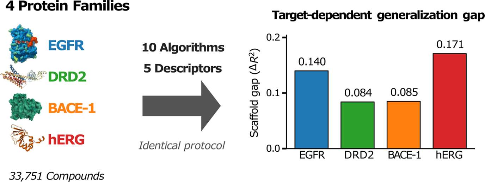

---

## 背景

药物发现是一项**资源密集型工作**，开发一种获批药物通常需要**10–15年和超过26亿美元的投入**。传统上，识别生物活性小分子主要依赖高通量筛选（HTS），但HTS成本高昂且受限于物理化合物库，而可药性分子空间的估计规模高达约 $10^{60}$ 个分子。定量构效关系（QSAR）建模通过将分子结构特征映射为生物活性预测值来应对这一挑战，其理论基础是Hansch-Fujita线性自由能框架。现代QSAR借助**高维描述符和机器学习**来捕获本质上**非线性的结构-活性关系**，已在虚拟筛选、先导化合物优化和ADMET预测中得到广泛应用。

- **在描述符层面**：二维QSAR仅从分子图提取特征，无需三维坐标。扩展连通性指纹（ECFP）通过Morgan算法枚举原子周围的**圆形化学环境**，是当前最常用的分子表示之一；MACCS结构键以166位预定义子结构模式编码分子的宏观特征；RDKit-2D物理化学描述符则捕获分子量、logP、极性表面积等**全局性质**
- **在算法层面**：随机森林（RF）因其**鲁棒性强、对超参数不敏感**、内部特征子采样天然适合**高维稀疏指纹**，已成为QSAR回归的事实标准。梯度提升方法（XGBoost、LightGBM、GBR）通过**序列化误差校正**可达到与RF相当的精度，而深度神经网络在表格型分子描述符数据上的提升并不一致
- **图神经网络的挑战**：近年来，图神经网络（GNN）直接在分子图上端到端地学习任务特定的表示，理论上能捕获比手工描述符更丰富的结构信息，但在**中等规模化学数据集**（n < 10000）上是否能超越精心构建的指纹基线，仍缺乏严格对照

尽管算法和描述符选择的研究已有大量积累，但现有基准研究普遍存在几个共性问题：

- **不同研究使用的数据集、靶点、划分策略和评估指标差异巨大**，跨研究的直接比较几乎不可行
- 大多数基准仅使用**随机划分评估模型**，而OECD QSAR验证原则强调的**scaffold划分（Bemis-Murcko骨架）**才能真正模拟对新骨架化合物的前瞻性预测能力
- **单靶点基准无法区分靶点特异性现象与普遍规律**

本文通过在四个治疗性靶点家族（EGFR激酶、DRD2 GPCR、BACE-1蛋白酶、hERG离子通道）的33751个化合物上，以完全一致的实验流程系统比较10种算法和5种描述符，填补了这一空白。

| 已有基准研究的常见局限 | 本文的应对 |
| --- | --- |
| 单靶点评估，结论难以推广 | 四靶点跨家族（激酶/GPCR/蛋白酶/离子通道） |
| 仅随机划分，$R^2$可能虚高 | 同时使用随机和scaffold划分，量化泛化差距 |
| 缺少适用域分析 | Tanimoto距离AD分析 + 参数敏感性检验 |
| 描述符和算法比较不充分 | 10种算法 × 5种描述符的完整交叉对比 |
| 单次随机种子，结论不稳定 | 5个随机种子 + 1000次bootstrap置信区间 |
| GNN对比缺少严格控制 | 3层GCN基线 vs RF + ECFP4，相同划分和数据 |

### 关键科学问题

- **算法选择是否具有跨靶点一致性？** 在激酶、GPCR、蛋白酶和离子通道这四类截然不同的蛋白家族上，同一种算法是否始终表现最佳？
- **描述符层级的泛化性如何？** ECFP4在文献中常被报告为最优描述符，但这一结论是否在多靶点、大样本量条件下依然成立？
- **scaffold划分会暴露多大的泛化差距？** 随机划分给出的乐观 $R^2$ 在多大程度上掩盖了模型在结构新颖化合物上的真实预测能力？
- **适用域（AD）能否量化预测可靠性？** 当化合物超出训练集覆盖的化学空间时，模型性能下降多少？这一现象在不同靶点间是否一致？

### 创新点

- **理论贡献：揭示scaffold泛化差距是数据内在属性**：通过四靶点对比证明，scaffold gap的靶点依赖性（hERG为0.171，DRD2/BACE-1约0.085）在不同算法间保持一致，说明这一差距本质上是**数据集的化学结构特征**（如scaffold多样性、活性分布偏移），而非算法缺陷。这改变了"通过算法改进缩小泛化差距"的直觉，为理解QSAR模型的泛化机制提供了新视角
- **方法论创新：建立多靶点统一基准框架**：首次在涵盖激酶、GPCR、蛋白酶、离子通道四个蛋白家族的33751个化合物上，以完全一致的实验流程（10算法×5描述符×2划分策略）进行系统评估。这一框架可作为未来新算法、新描述符的**标准参考基准**，避免单靶点评估的偶然性和不可迁移性
- **实践指导：提出可操作的模型选择与验证指南**：通过统计显著性检验（bootstrap 95% CI）明确算法优势的靶点边界——RF在EGFR上显著优于所有竞争算法，但在hERG上多数差异不显著。结合适用域参数敏感性分析（$Z \in \{1.0,1.5,2.0\}$，$k \in \{3,5,10\}$），为实际药物发现项目提供了基于靶点特性的模型决策树
- **技术完善：强调适用域报告的必要性**：通过量化域内外$R^2$降幅（hERG达0.51），证实不报告AD等于掩盖模型在远缘化合物上的预测失效。这一发现支持OECD QSAR验证原则中AD的要求，并为AD方法选择提供了实证依据

---

## 研究内容

### 数据集与方法

研究通过ChEMBL REST API从ChEMBL 35数据库中提取了四个靶点的结合活性数据（$\mathrm{IC}_{50}$或$K_i$），并使用**自定义Python脚本**（RDKit 2025.03.6）进行统一的**数据清洗流程**：

- 有效性过滤：去除缺少SMILES或活性值为非正的记录
- 去重：同一canonical SMILES对应多条测量值时取中位数
- SMILES规范化：使用RDKit canonical SMILES标准化
- 盐去除：去除含片段分隔符的SMILES
- 分子量过滤：100–900 Da
- 活性转换：$\mathrm{IC}_{50}$（nM）转为pActivity（= $-\log_{10}(\mathrm{IC}_{50}/\mathrm{M})$）

最终获得33751个化合物，涵盖四个最重要的蛋白家族：

| 靶点 | ChEMBL ID | 蛋白家族 | 活性类型 | 原始记录 | 最终数量 | pActivity范围 | 均值 ± SD |
| --- | --- | --- | --- | --- | --- | --- | --- |
| EGFR | CHEMBL203 | 激酶 | $\mathrm{IC}_{50}$ | 17652 | 10036 | 3.05–11.52 | 6.90 ± 1.35 |
| DRD2 | CHEMBL217 | GPCR | $K_i$ | 13041 | 7558 | 3.07–11.52 | 6.77 ± 1.02 |
| BACE-1 | CHEMBL4822 | 蛋白酶 | $\mathrm{IC}_{50}$ | 14298 | 8080 | 3.00–12.00 | 6.68 ± 1.27 |
| hERG | CHEMBL240 | 离子通道 | $\mathrm{IC}_{50}$ | 12886 | 8077 | 3.00–9.85 | 5.43 ± 0.91 |

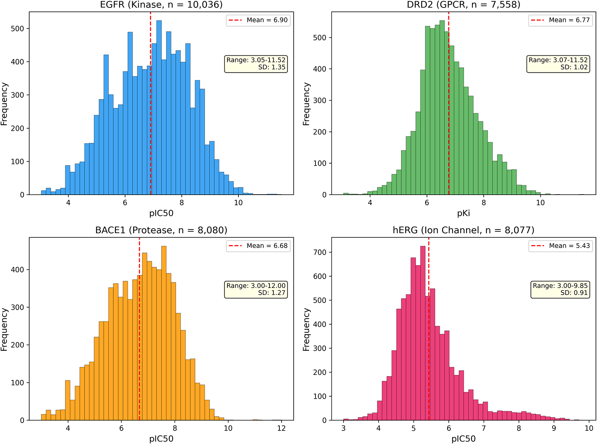

**图1**：四个靶点的pActivity分布直方图。EGFR（激酶，n=10036）和DRD2（GPCR，n=7558）的活性分布范围较宽，BACE-1（蛋白酶，n=8080）居中，hERG（离子通道，n=8077）的分布最窄（SD仅0.91），反映了hERG抑制剂的活性范围相对集中

描述符方面，研究计算了5种分子表示：

- **ECFP4**（半径=2，2048位）：捕获中心原子周围2个化学键范围内的局部原子环境，是QSAR建模中最广泛使用的圆形指纹，radius=2在特异性和泛化性之间提供了有效平衡
- **ECFP6**（半径=3，2048位）：将捕获范围扩展至3个化学键，编码更大的分子子结构和药效团模式，但以增加稀疏性为代价
- **MACCS结构键**（166位）：基于预定义的166个子结构模式的存在/不存在，是一种结构键指纹
- **RDKit 2D物理化学描述符**（217维）：通过RDKit的`Descriptors.descList`模块计算全部210个命名描述符（constitutional、topological、physicochemical），加上fragment-count描述符后保留217维。包括分子量、logP、拓扑极性表面积（TPSA）、氢键供体/受体数、可旋转键数等经典药物化学参数
- **组合描述符**（RDKit-2D + ECFP4）：将局部子结构信息与全局理化性质相结合

算法方面，研究比较了10种回归算法。**主体实验（Experiments 1-6, 8-10）使用下表默认超参数**，Experiment 7专门对Top 4算法（RF、XGB、LGBM、SVR）进行了Bayesian超参数优化。

| 算法 | 类别 | 关键超参数 |
| --- | --- | --- |
| 随机森林（RF） | 集成 | n_estimators=500, min_samples_split=5 |
| XGBoost（XGB） | 集成 | n_estimators=300, max_depth=6, lr=0.1 |
| LightGBM（LGBM） | 集成 | n_estimators=300, max_depth=6, lr=0.1 |
| 梯度提升（GBR） | 集成 | n_estimators=300, max_depth=5, lr=0.1 |
| 支持向量回归（SVR） | 核方法 | kernel=RBF, C=10, γ=scale |
| K近邻（KNN） | 实例学习 | k=5, weights=distance |
| Ridge | 正则化线性 | α=1.0 |
| LASSO | 正则化线性 | α=0.01 |
| 弹性网络（Elastic Net） | 正则化线性 | α=0.01, `l1_ratio`=0.5 |
| 多层感知器（MLP） | 深度学习 | layers=(256,128), relu, adam, lr=0.001 |

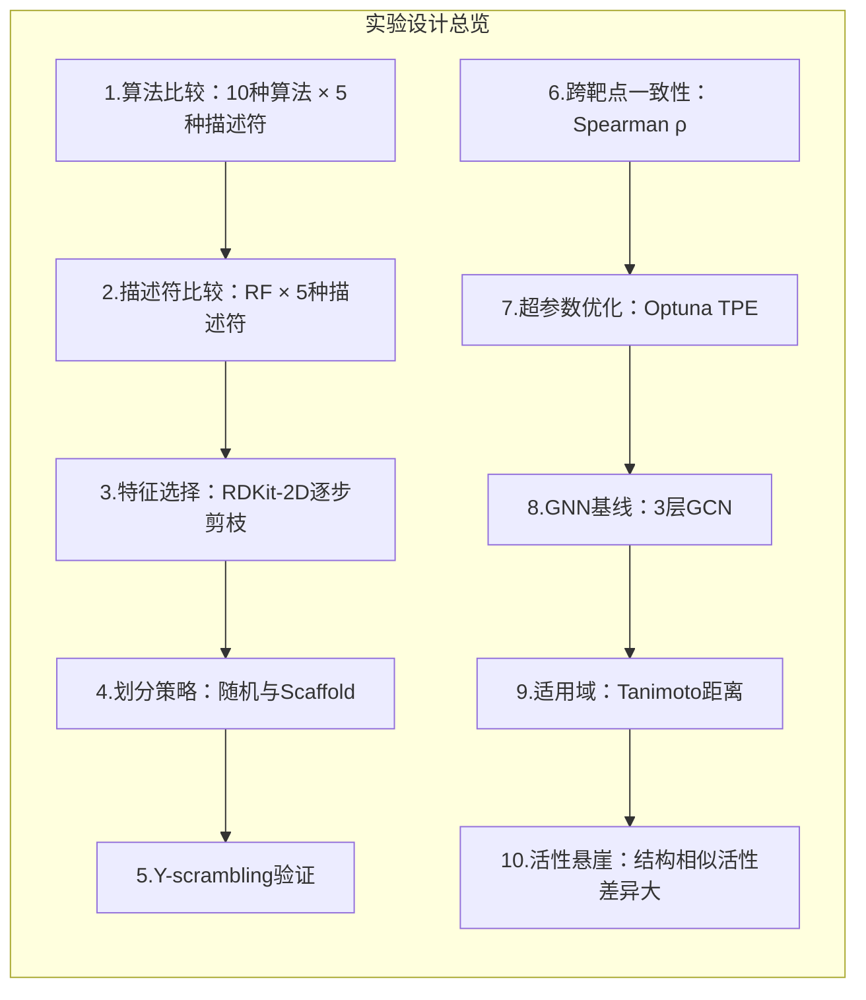

所有实验采用80:20的训练/测试划分。数据划分策略包括两种 orthogonal 方式：

- **随机划分**：stratification-free随机采样，固定随机seed=42确保可复现性
- **Scaffold划分**：使用RDKit的`MurckoScaffold.GetScaffoldForMol()`函数实现Bemis-Murcko scaffold划分
  - 提取每个分子的Bemis-Murcko骨架（环系统+连接链），无环化合物归为单一`no-ring`组
  - 相同scaffold的分子聚成cluster；**整个cluster只分配到训练集或测试集之一**，确保scaffold不跨集
  - 所有唯一scaffold cluster随机打乱（seed=42），贪心累积到测试集直到约20%总化合物数，剩余进训练集
  - 单独出现的scaffold（singleton）作为独立cluster处理

评估指标包括**决定系数$R^2$**（coefficient of determination，衡量模型解释的方差比例）、RMSE和MAE，结果报告为5个随机种子（42、0、1、2、3）的均值 ± SD，并通过1000次bootstrap重采样计算95%置信区间。

### 实验1：算法比较——树集成方法的持续领先

以EGFR + ECFP4为例，10种算法在随机划分下的测试集$R^2$排名如下：

| 排名 | 算法 | $R^2$（均值 ± SD） | RMSE | MAE |
| --- | --- | --- | --- | --- |
| 1 | RF | **0.726 ± 0.008** | 0.706 | 0.520 |
| 2 | XGB | 0.689 ± 0.011 | 0.752 | 0.574 |
| 3 | SVR | 0.692 ± 0.009 | 0.747 | 0.556 |
| 4 | GBR | 0.670 ± 0.010 | 0.774 | 0.594 |
| 5 | LGBM | 0.674 ± 0.010 | 0.769 | 0.587 |
| 6 | Elastic Net | 0.610 ± 0.017 | 0.841 | 0.648 |
| 7 | LASSO | 0.596 ± 0.014 | 0.857 | 0.664 |
| 8 | KNN | 0.604 ± 0.013 | 0.849 | 0.648 |
| 9 | MLP | 0.587 ± 0.017 | 0.866 | 0.637 |
| 10 | Ridge | 0.536 ± 0.028 | 0.917 | 0.695 |

**RF以$R^2$=0.726排名第一**，且bootstrap 95%置信区间证实RF对所有竞争算法的优势均具有统计显著性（CI不包含零）。前5名算法的$R^2$集中在0.67–0.73区间内，而线性模型（Ridge、LASSO）和MLP则明显落后。

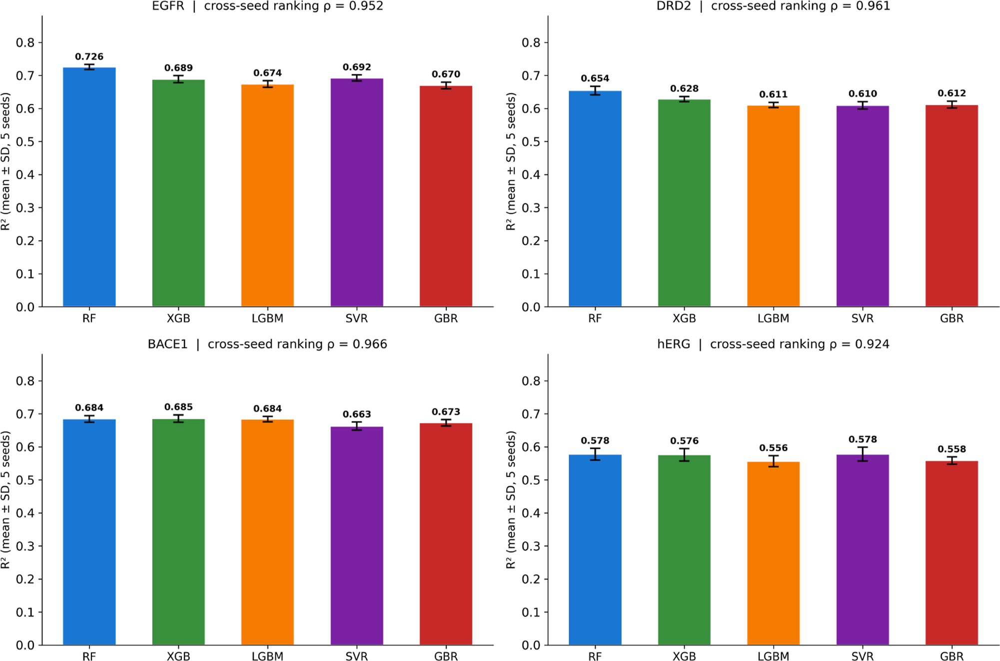

**图2：四个靶点上Top-5算法的测试集$R^2$比较**（ECFP4指纹，随机划分）。每个子图顶部标注了跨种子排名的Spearman $\rho$值（均 > 0.92），表明算法排名在不同随机种子间高度稳定。RF在所有靶点上均排名第一或接近第一，其误差棒（SD）也是最小的

**图3**：EGFR上RF + ECFP4的预测值与观测值散点图。（a）训练集（$R^2$ = 0.942）：浅蓝色点沿红色虚线（完美预测线）紧密排列。（b）测试集（$R^2$ = 0.720）：数据点分散度增大，训练-测试差距为0.222，反映了RF在中等规模数据集上的典型过拟合程度。活性极端区域（$\mathrm{pIC}_{50} < 5$和$> 10$）的偏差略有增大

**图4**：四个靶点上RF与Top竞争算法的$R^2$差异的bootstrap 95%置信区间（1000次重采样）。**绿色柱表示RF优势具有统计显著性（CI不包含零），灰色柱标注“n.s.”表示差异不显著**。RF在EGFR上对所有四个竞争算法均显著优于（绿色柱全为绿），在DRD2上对三个显著、对XGB不显著，在BACE-1上仅对SVR显著，在hERG上对所有算法均不显著

当将比较扩展到全部四个靶点时，这一模式高度一致：**RF在EGFR和DRD2上明确排名第一**；BACE-1上XGB以0.685略高于RF和LGBM（均为0.684），但bootstrap检验显示RF只显著优于SVR；hERG上RF和SVR同为0.578，所有Top算法差异均不显著。四个靶点的Top-5算法测试集$R^2$汇总如下（Table 4）：

| 算法 | EGFR | DRD2 | BACE-1 | hERG |
| --- | --- | --- | --- | --- |
| RF | **0.726** | **0.654** | 0.684 | **0.578** |
| XGB | 0.689 | 0.629 | **0.685** | 0.576 |
| SVR | 0.692 | 0.610 | 0.663 | **0.578** |
| LGBM | 0.674 | 0.611 | 0.684 | 0.557 |
| GBR | 0.670 | 0.612 | 0.673 | 0.559 |

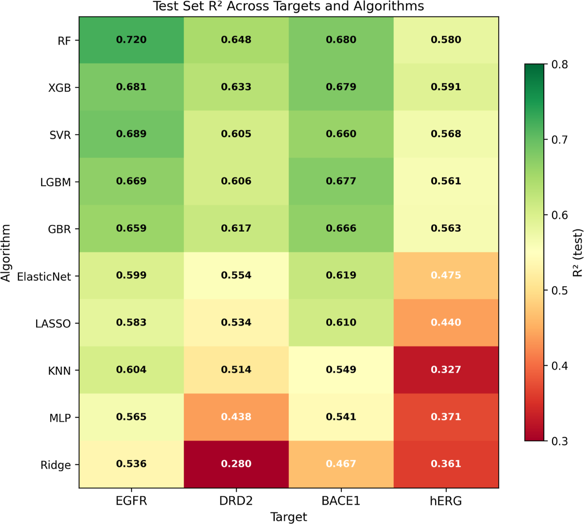

**图9：10种算法在4个靶点上的测试集$R^2$热力图**。颜色从深红（$R^2 \approx 0.3$）到深绿（$R^2 \approx 0.8$），清晰展示了树集成方法（RF、XGB、LGBM、GBR）和SVR等强基线的优势。线性模型（Ridge）在所有靶点上排名末位

> 核心发现：**树集成方法在QSAR回归任务上的统治地位不是偶然的**。RF的内部特征bagging机制使其对高维稀疏特征（如2048位指纹）具有天然的鲁棒性，而梯度提升方法通过序列化学习也能有效处理这类数据。

### 实验2：描述符比较——ECFP4的稳健优势

> 小编锐评：我觉得应该把所有表征和模型都组合一遍，然后每一个target出一个热图。现在这种固定，然后训练和对比，这事我也干过，反正就是省点资源偷懒了，还多水了几张图

**使用RF作为固定算法**，比较5种描述符在四个靶点上的表现：

| 描述符 | EGFR | DRD2 | BACE-1 | hERG |
| --- | --- | --- | --- | --- |
| ECFP4 | **0.726** | **0.654** | **0.684** | 0.578 |
| ECFP6 | 0.720 | 0.641 | 0.678 | 0.577 |
| MACCS | 0.656 | 0.574 | 0.643 | 0.523 |
| RDKit-2D | 0.670 | 0.577 | 0.650 | 0.564 |
| RDKit-2D+ECFP4 | 0.706 | 0.643 | 0.670 | **0.598** |

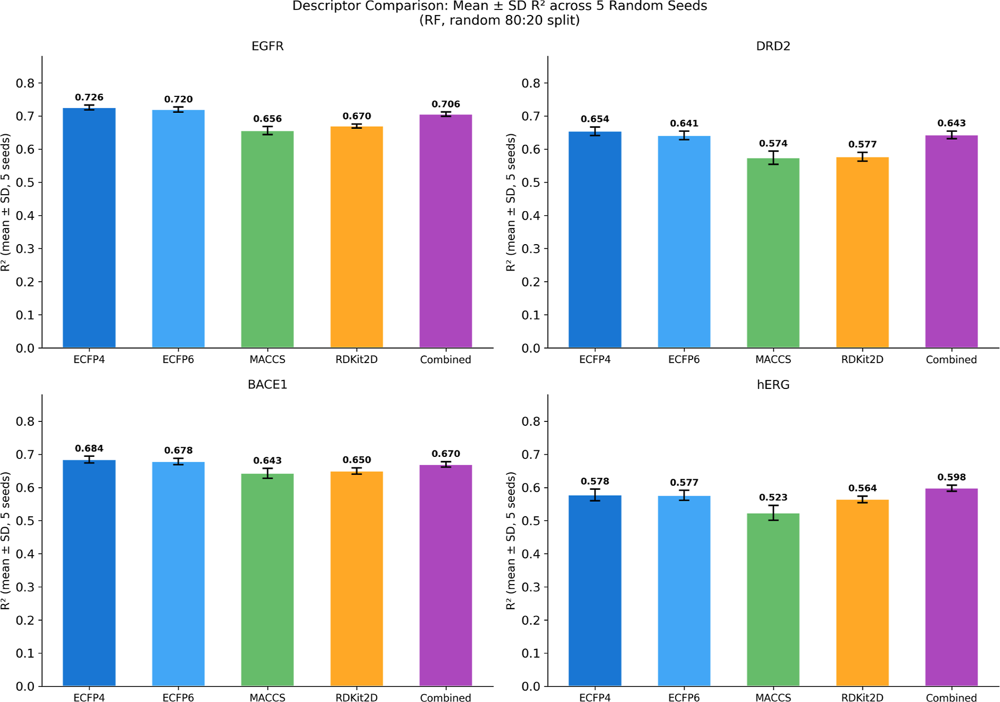

**图5：5种描述符在4个靶点上的RF测试集$R^2$比较**。ECFP4在EGFR、DRD2和BACE-1上均表现最佳；仅在hERG上，组合描述符（RDKit-2D + ECFP4）以0.020的$R^2$优势略胜。MACCS在四个靶点上整体最弱，因为166位预定义子结构模式无法区分仅差几个原子的精细结构差异（如cliff对之间的小取代基变化或环修饰），而ECFP4的圆形原子环境编码能捕获这些细微变化

> **描述符层级的稳定性**值得注意：四个靶点上的描述符排名Spearman $\rho$均高于0.90，说明圆形指纹相对MACCS的优势并非特定于某个靶点，而是反映了ECFP在编码局部化学环境方面的**固有信息优势**。hERG的例外（组合描述符略优）提示，全局理化性质（如logP、极性表面积）对hERG阻断的预测提供了额外的互补信息。

### 实验3–4：特征选择与scaffold泛化差距

**特征选择对RF的影响微乎其微**。在EGFR上使用RDKit-2D描述符进行逐步特征剪枝：从无选择（217维）到方差过滤（183维）、相关性过滤（$|r| ≤ 0.95$，148维）、更严格的$|r| ≤ 0.75$（112维），$R^2$仅从0.673下降至0.661。**删去48%的特征（217→112维）仅损失0.012的$R^2$**，这归功于RF的内部特征子采样机制。

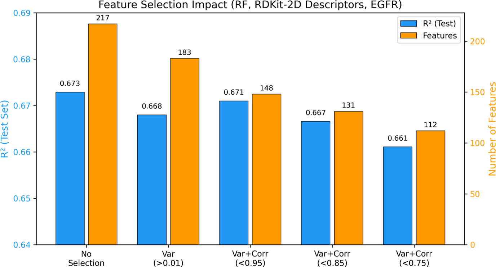

**图6**：特征选择对EGFR上RF性能的影响。蓝色柱为测试集 $R^2$（左轴），橙色柱为保留的特征数（右轴）。五种特征选择配置下，$R^2$ 从0.673仅下降至0.661

相比之下，scaffold划分揭示的**泛化差距才是真正值得关注的问题**。使用Bemis-Murcko scaffold划分后，$R^2$出现了靶点依赖的系统性下降：

| 靶点 | RF | XGB | LGBM | GBR | 均值差距 |
| --- | --- | --- | --- | --- | --- |
| EGFR | 0.146 ± 0.061 | 0.145 ± 0.069 | 0.130 ± 0.057 | 0.139 ± 0.065 | **0.140** |
| DRD2 | 0.102 ± 0.037 | 0.080 ± 0.042 | 0.080 ± 0.049 | 0.075 ± 0.038 | **0.084** |
| BACE-1 | 0.097 ± 0.057 | 0.087 ± 0.044 | 0.080 ± 0.041 | 0.078 ± 0.040 | **0.085** |
| hERG | 0.179 ± 0.043 | 0.172 ± 0.065 | 0.158 ± 0.050 | 0.174 ± 0.047 | **0.171** |

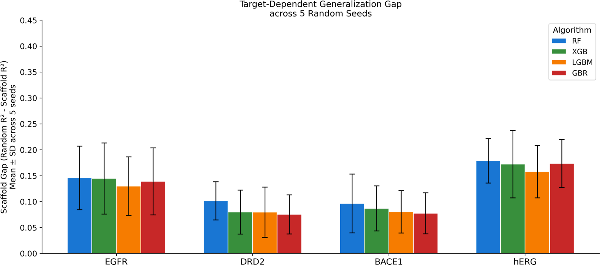

**图7**：四个靶点的scaffold泛化差距（随机 $R^2$ 减去scaffold $R^2$），四种算法（蓝色=RF，绿色=XGB，橙色=LGBM，红色=GBR）在EGFR、DRD2、BACE-1、hERG上的表现。hERG的差距最大（均值0.171），DRD2和BACE-1最小（约0.085），呈现约2倍的变异范围。误差棒反映了5个随机种子的变异性

> **scaffold gap是数据集属性而非算法属性**。四种算法在同一靶点上的差距高度一致，说明泛化困难源于数据本身的结构分布（如scaffold多样性、活性分布偏移），而非特定算法的过拟合倾向。

补充分析（Table S1）进一步揭示了scaffold划分导致的**pActivity分布偏移**：EGFR的测试集pActivity均值比训练集高0.249个log单位（KS检验p < 0.001），这是导致其较大scaffold gap的重要因素之一。

### 实验7：超参数优化——梯度提升获益最大，但也不多

使用Optuna TPE采样器进行贝叶斯超参数优化（每靶点30次试验，5折交叉验证$R^2$目标），三个规律浮现：

- 梯度提升方法获益最大：LGBM的$\Delta R^2$均值为+**0.040**，XGB为+**0.034**，而RF仅+**0.010**，SVR仅+**0.007**
- 优化后排名可能改变：XGB在优化后在四个靶点中的三个跃升至第一位，但这依赖于单次测试集划分，结论需谨慎对待
- 树方法收敛于狭窄的$R^2$区间：优化后，前5名算法的$R^2$差距不超过0.025，表明**描述符信息量才是性能天花板**

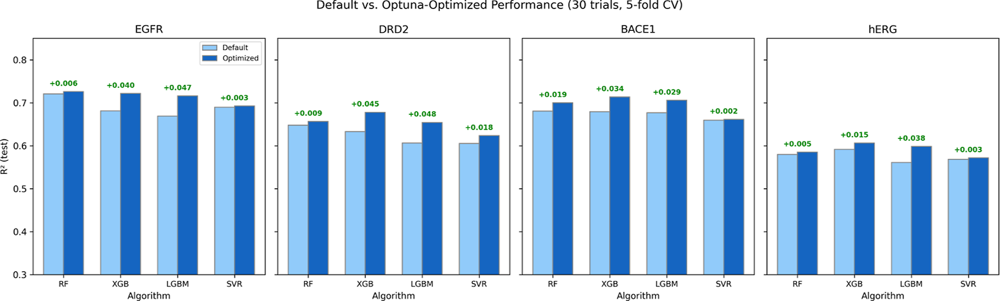

**图10**：默认超参数 vs Optuna优化后的测试集 $R^2$（30次Optuna试验，5折交叉验证）。四个子图分别为EGFR、DRD2、BACE-1、hERG，浅色柱为默认参数，深色柱为优化后参数。每个柱顶标注了$\Delta R^2$值。梯度提升方法（XGB、LGBM）的提升幅度显著高于RF和SVR

### 实验8：GNN基线——基础GCN不敌指纹

研究构建了一个3层图卷积网络（GCN），使用128维隐藏层、ReLU激活、全局平均池化，与RF + ECFP4进行对比：

| 靶点 | 划分方式 | RF $R^2$ | GCN $R^2$ | $\Delta R^2$ |
| --- | --- | --- | --- | --- |
| EGFR | 随机 | 0.720 | 0.513 | −0.207 |
| DRD2 | 随机 | 0.648 | 0.374 | −0.274 |
| BACE-1 | 随机 | 0.680 | 0.556 | −0.124 |
| hERG | 随机 | 0.580 | 0.312 | −0.268 |
| EGFR | Scaffold | 0.474 | 0.275 | −0.199 |
| DRD2 | Scaffold | 0.541 | 0.321 | −0.221 |
| BACE-1 | Scaffold | 0.632 | 0.548 | −0.084 |
| hERG | Scaffold | 0.331 | 0.153 | −0.178 |

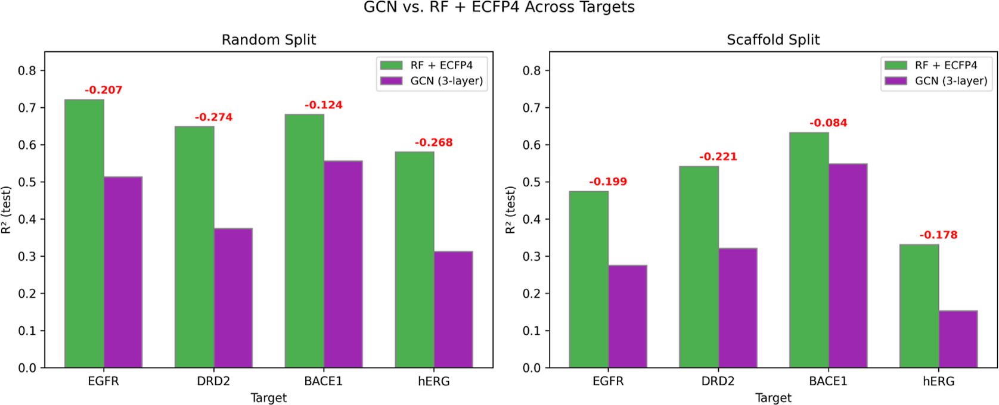

**图11**：GCN vs RF + ECFP4在四个靶点上的 $R^2$ 对比。左图为随机划分，右图为scaffold划分。绿色柱为RF + ECFP4，紫色柱为3层GCN。红色数字标注了RF相对于GCN的优势（均为正值）。随机划分下DRD2的差距最大（$\Delta R^2$ = −0.274），scaffold划分下DRD2的差距也最大（$\Delta R^2$ = −0.221）

**GCN在随机划分下平均亏损0.218 $R^2$，在scaffold划分下平均亏损0.170 $R^2$**。随机划分下差距最大的靶点是DRD2（亏损0.274），hERG也接近这一水平（亏损0.268）。研究使用的GCN不含边特征和预训练，属于最基础的图架构，但即便如此，这一结果也提醒我们

> **在中等规模的化学数据集（约7500–10000个化合物）上，GNN的数据效率远不及精心构建的分子指纹**。

### 实验9：适用域——预测可靠性的量化

适用域分析旨在量化模型对不同化学相似度化合物的预测可靠性。本研究采用**基于Tanimoto距离的方法**：

- 距离计算：**对每个测试集化合物，计算其到训练集中k个最近邻的平均Tanimoto距离**。Tanimoto距离定义为$d(A, B) = 1 - |A \cap B|/|A \cup B|$，即1减去Tanimoto相似系数
- **AD边界**：边界阈值$D_{\text{threshold}} = \bar{d}_{\text{train}} + Z \cdot \sigma_d$，其中$\bar{d}_{\text{train}}$为**训练集化合物k-NN距离的均值**，$\sigma_d$为标准差，Z是经典Williams图阈值，来自Sahigara等2012年方法学比较研究
- **域内外分类**：测试化合物的距离$\le D_{\text{threshold}}$则为域内（Inside AD），否则为域外（Outside AD）
- **参数敏感性**：研究还测试了k∈{3, 5, 10}和Z∈{1.0, 1.5, 2.0}的组合，确认域内外$R^2$差异对参数选择稳健（结果见附录图S2-S3）

基于Tanimoto距离的适用域分析（k=5近邻，Z=1.5阈值）揭示了模型预测的可靠性边界：

| 靶点 | AD阈值 | 域内占比 | $R^2$（域内） | $R^2$（域外） | $R^2$降幅 |
| --- | --- | --- | --- | --- | --- |
| EGFR | 0.475 | 92.7% | 0.738 | 0.369 | **−0.370** |
| DRD2 | 0.468 | 92.0% | 0.672 | 0.322 | **−0.350** |
| BACE-1 | 0.447 | 92.3% | 0.680 | 0.366 | **−0.314** |
| hERG | 0.590 | 87.4% | 0.620 | 0.108 | **−0.512** |

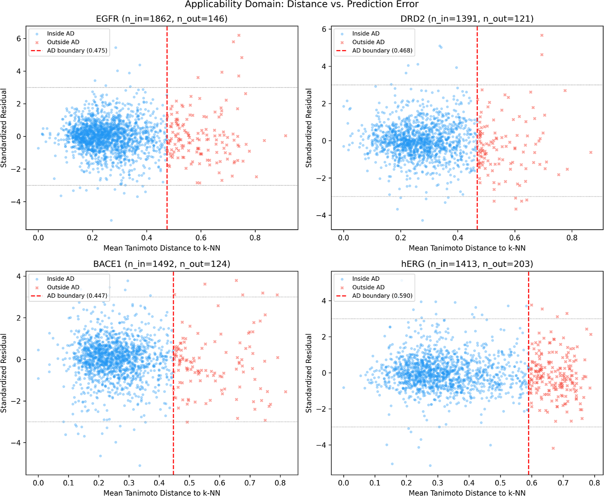

**图12**：Williams图——四个靶点**测试集**的标准化残差（y轴）与Tanimoto距离（x轴）关系。**标准化残差=（观测值-预测值）/残差标准差**，衡量预测偏差的标准化程度。蓝色圆点为域内化合物（Inside AD），红色叉号为域外化合物（Outside AD），红色虚线为AD边界。各靶点的AD阈值分别为：EGFR 0.475、DRD2 0.468、BACE-1 0.447、hERG 0.590

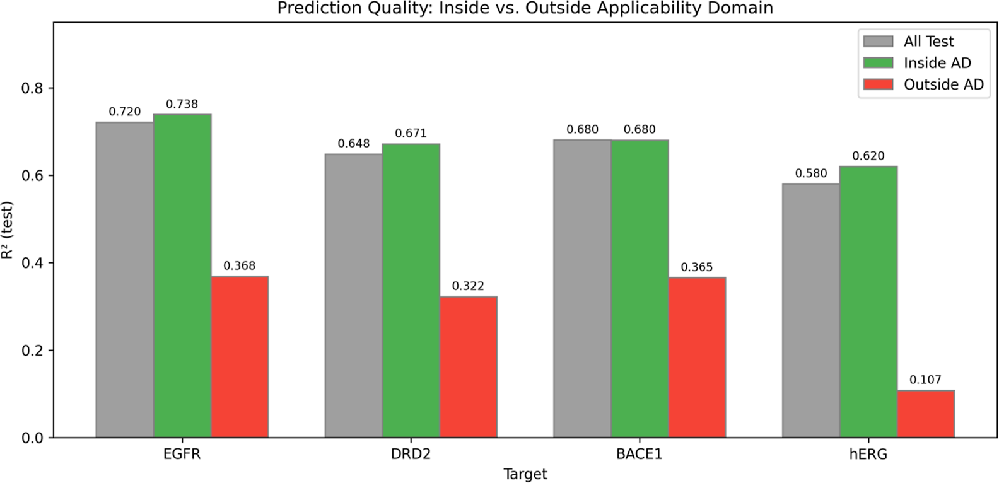

**图13**：**测试集**域内与域外预测质量对比。灰色柱为全部测试集 $R^2$，绿色柱为域内 $R^2$，红色柱为域外 $R^2$。hERG的域外 $R^2$ 仅0.107，几乎丧失预测能力

> - **适用域分析揭示了预测质量的化学域依赖性**：四个靶点的域内外$R^2$差距均高达0.31–0.51，说明超出训练集化学域的化合物预测质量会大幅下降。
> - **hERG的适用域问题最为严峻**：约13%的测试化合物位于AD之外，这些化合物的$R^2$从0.62骤降至0.11，意味着模型对结构远缘的hERG抑制剂**几乎丧失了预测能力**。这一发现对hERG安全性预测的实际应用提出了重要警示。

### 实验10：活性悬崖——描述符的分辨力差异

活性悬崖（Activity Cliff）是指结构高度相似但活性差异巨大的化合物对，是QSAR建模的“天敌”。研究定义cliff对的条件为**ECFP4 Tanimoto** $\ge 0.6$且$|\Delta \mathrm{pActivity}| \ge 2.0$。各靶点的cliff密度差异显著：

| 靶点 | cliff对数量 | 全部化合物中cliff占比 | 测试集化合物中cliff占比 |
| --- | --- | --- | --- |
| **BACE-1** | 9531对 | **39.6%** | **38.2%** |
| **EGFR** | 8547对 | 37.0% | 38.1% |
| DRD2 | 1222对 | 15.2% | 14.5% |
| hERG | 2529对 | 10.2% | **10.8%** |

- **MACCS的cliff预测能力最差**：四个靶点的MACCS cliff $R^2$均低于ECFP4和ECFP6，尤其在DRD2上仅为0.316，因为166位结构键指纹无法区分仅差几个原子的cliff对

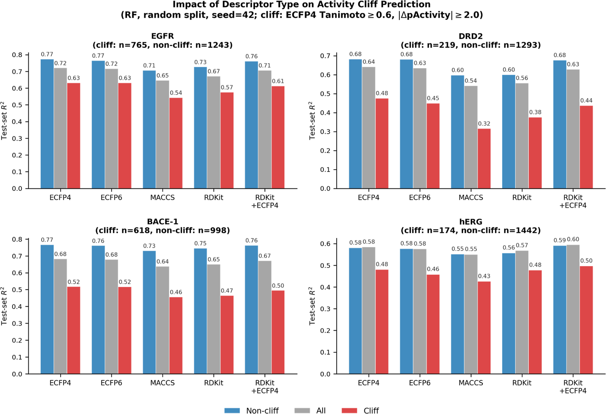

**图15**：描述符类型对活性悬崖化合物预测的影响（RF，随机划分，seed=42）。四个面板分别为EGFR、DRD2、BACE-1、hERG。每个面板中，蓝色柱为非cliff化合物的 $R^2$，灰色柱为全部测试化合物的 $R^2$，红色柱为cliff化合物的 $R^2$。各面板上方标注了cliff和非cliff化合物的数量。ECFP4在EGFR、DRD2和BACE-1上给出最高cliff $R^2$，hERG上则是RDKit-2D + ECFP4略高

> **描述符选择显著影响cliff预测能力**：在5种描述符的全面对比中，**ECFP4在EGFR、DRD2和BACE-1三个靶点上对cliff化合物的预测$R^2$最高**，证明了圆形指纹在精细结构区分上的优势。**MACCS结构键指纹的cliff预测$R^2$在四个靶点上始终最低**（DRD2上仅0.316），166位预定义子结构模式过于粗糙，无法区分仅差几个原子的cliff对。hERG的cliff密度最低（10.8%）且cliff预测$R^2$差距最小，与其较窄的活性分布一致。

残差分析（图14，见附录）证实了RF + ECFP4模型在EGFR上无系统性偏差，MAE = 0.520 $\mathrm{pIC}_{50}$单位，残差分布近似对称。

## 关键结论与批判性总结

### 潜在影响

- **树集成方法的统治地位在跨家族验证**：RF在激酶、GPCR、蛋白酶和离子通道四类截然不同的蛋白家族上均表现最优或接近最优，证明了RF + ECFP4作为QSAR建模默认配置的普适性
- **算法排名的可迁移性**：Spearman $\rho$均值=0.92表明单一靶点的算法选择结论可为其他靶点提供参考，但性能幅度仍需按靶点验证
- **实用权衡**：LightGBM在精度上与RF相当但速度快约100倍，在工业高通量筛选场景中可能是更实用的选择

### 主要贡献

- **为QSAR建模提供了可操作的决策指南**：RF + ECFP4作为默认配置在多数常规基线场景下是合理的选择；超参数优化优先应用于梯度提升方法
- **量化了scaffold泛化差距的靶点依赖性**：约2倍的变异范围（0.084–0.171）提醒研究者，不同靶点的结构外推难度可能截然不同
- **强调了适用域报告的必要性**：域内外$R^2$差距高达0.31–0.51，不报告AD等于对使用者隐瞒了模型的关键局限

### 存在的局限性

- **特征选择仅在EGFR上进行了详细分析**，结论的跨靶点普适性有待验证
- **超参数优化只使用30次Optuna试验和单一测试划分**，优化后XGB排名上升这一现象仍需要多随机种子确认
- **ECFP指纹折叠为2048位向量**，哈希折叠不可避免地带来一定bit collision风险
- **GNN基线仅测试了最简单的GCN架构**，未包含边特征、attention、预训练或Chemprop、AttentiveFP、Uni-Mol等更强模型
- **ChEMBL assay异质性仍然存在**，同一化合物多条记录取中位数只能部分缓解实验噪声
- **本文限于二维描述符和四类靶点**，三维描述符、interaction fingerprint、physics-informed表示以及更多靶点类别仍需要进一步验证

> 小编锐评：基本上涵盖了“对比表征+组合”这件事基础和主要的方面，虽不必全做，值得借鉴。但也很难过多深化得到更多的“解释”，比如hERG和亲疏水性描述符等，MACCS为啥差。
