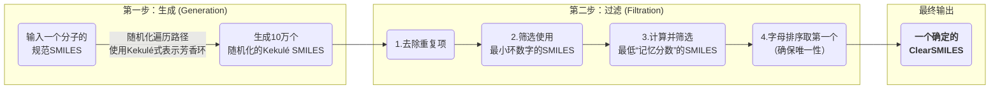

# 为AI炼丹炉“净化”原料：SMILES、SELFIES与更可靠的分子生成表示法

## 本文信息

  - **标题**: 提高用于生成化学的分子字符串表示的可靠性
  - **作者**: Etienne Reboul, Zoe Wefers, Harish Prabakaran, Jérôme Waldispühl, and Antoine Taly
  - **发表时间**: 2025年8月29日 (Accepted)
  - **单位**: 巴黎西岱大学/法国国家科学研究中心 (法国)，麦吉尔大学计算机科学学院 (加拿大)
  - **引用格式**: Reboul, E., Wefers, Z., Prabakaran, H., Waldispühl, J., & Taly, A. Improving the Reliability of Molecular String Representations for Generative Chemistry. *Journal of Chemical Information and Modeling*. Published online September 17, 2025. [https://doi.org/10.1021/acs.jcim.4c02261](https://doi.org/10.1021/acs.jcim.4c02261)
  - **源代码**:
      * **ClearSMILES**: [https://github.com/EtienneReboul/ClearSMILES](https://github.com/EtienneReboul/ClearSMILES)
      * **训练数据、模型和样本**: [https://doi.org/10.5281/zenodo.14420504](https://www.google.com/search?q=https://doi.org/10.5281/zenodo.14420504)
      * **SELFIES稳定性测试**: [https://colab.research.google.com/drive/1jZwRGyXqUSaQhQ-yRILBoqiM1HMlikK0?usp=sharing](https://www.google.com/search?q=https://colab.research.google.com/drive/1jZwRGyXqUSaQhQ-yRILBoqiM1HMlikK0%3Fusp%3Dsharing)

-----

## 摘要

> 近年来，用于化学的生成式建模发展迅速，但这一热潮也提出了一个根本性问题：哪种分子表示法最适合现代机器学习模型？尽管SMILES并非为生成任务而设计，但它仍然是最常用的基于字符串的表示法。然而，虽然SMILES遵循严格的语法规则，但语法正确的SMILES字符串**并不总能对应于化学上有效的分子**。另一种语法SELFIES通过确保每个SELFIES字符串都能表示一个有效分子来解决这一局限。本研究全面评估了SMILES和SELFIES作为生成模型表示法的局限性。我们分析了两个关键标准：**有效性（viability）**，即生成的字符串能表示新颖、独特且化合价正确的分子；以及**保真度（fidelity）**，即生成分子的理化性质分布与训练数据相似。我们发现，使用RDKit默认的规范化SMILES生成的分子中，约有五分之一是无效的，未能通过有效性检验。相比之下，所有由SELFIES生成的分子都是有效的，但它们显著偏离了训练数据的分布，表明保真度较低。为了解决这些问题，我们为这两种表示法开发了数据增强程序。虽然简化SELFIES语法在保真度上仅取得了微不足道的增益，但我们为SMILES开发的随机增强方法——**ClearSMILES**，显著提高了有效性和保真度。ClearSMILES通过使用Kekulé SMILES显式编码芳香性并减少词汇量来简化语法，使模型更容易处理字符串表示。使用ClearSMILES后，**无效样本的比例从20%下降了一个数量级至2.2%**，并且对训练数据分布的保真度也得到了中度改善。

-----

## 背景

传统的计算机辅助药物设计通常涉及对大型化合物库进行虚拟筛选，以识别有潜力的“命中”分子。然而，这个过程成本高昂且耗时。近年来，**生成式化学（Generative Chemistry）**为分子发现带来了新的范式：它不再是被动地“筛选”，而是让AI模型主动“创造”，直接从学习到的化学知识中生成具有期望性质的新分子，从而大大缩短了药物优化的周期。

要让AI模型学会“创造”分子，首先要教会它如何“阅读”分子。目前主流的分子表示法分为两类：图（Graph）和字符串（String）。分子天然是一种图结构（原子为节点，化学键为边），图表示法虽然直观，但处理起来相对复杂。而字符串表示法，如SMILES，将分子结构线性化为一串文本，可以无缝对接自然语言处理（NLP）领域的强大模型（如Transformer），近年来已展现出与图模型相当的性能。

然而，这一领域的飞速发展背后，一个基础性问题却被长期忽视：我们喂给AI的“原料”——分子字符串，本身可靠吗？最广泛使用的**SMILES**表示法，虽然有明确的语法（如括号表示支链，数字表示环），但一个**语法上无懈可击的SMILES字符串，却完全可能描述一个化学上荒谬的分子**（如一个碳原子有五根键）。这导致生成模型在“咿呀学语”时，常常“说出”一些听起来通顺但毫无意义的“句子”。为了解决这个问题，**SELFIES**应运而生，它通过更严格的语法设计，保证任何生成的字符串都能被确定性地解码为一个化学上有效的分子。但SELFIES的这种“万无一失”是否是以牺牲其他重要性质为代价？这两大主流表示法，究竟谁更适合AI炼丹炉？

## 关键科学问题

在分子生成任务中，哪种字符串表示法（SMILES还是SELFIES）更可靠？它们各自的“死穴”是什么？我们能否通过数据增强的手段，设计出一种新的表示法，同时解决SMILES的**有效性（Viability）**问题和SELFIES的**保真度（Fidelity）**问题？

  - **有效性 (Viability)**：衡量生成模型“说人话”的能力，要求生成的分子必须是化学上有效（化合价正确）、新颖的（不在训练集中）且独特的（非重复）。
  - **保真度 (Fidelity)**：衡量生成模型是否“跑偏”，要求生成的分子在整体性质分布上（如类药性、分子量、合成可及性等）与训练集中的真实分子相似。

## 创新点

  - **系统性基准测试**：首次对SMILES和SELFILES作为生成化学模型输入的可靠性进行了全面的、并排的基准测试，明确量化了它们在**有效性**和**保真度**两个关键指标上的优缺点。

  - **提出了ClearSMILES**：开发了一种新颖的、基于随机化和过滤的SMILES数据增强流程（ClearSMILES），旨在通过**显式编码芳香性**和**最小化长程依赖**来简化SMILES语法，使其更易于机器学习模型学习。

  - **验证了ClearSMILES的优越性**：实验证明，使用ClearSMILES能将生成模型（VAE）产生的无效分子比例从**20%急剧降低到2.2%**，下降了一个数量级，同时在一定程度上改善了生成分子的性质分布保真度。

-----

## 研究内容

### 核心方法论：模型、指标与增强策略

#### 1. 分子表示法：SMILES vs. SELFIES

**图1：γ-丁内酯（GBL）的SMILES和SELFIES表示法示例。**
如图所示，对于同一个分子，SMILES使用匹配的括号`()`和数字`1`来表示支链和环的闭合，这是一种隐式的、需要前后对应的语法。而SELFIES则使用显式的`[Branch]`和`[Ring]`标记，其后的“重载标记”（overloaded tokens）用于定义支链或环的长度，语法更严格。

#### 2. 评估标准：有效性(Viability)与保真度(Fidelity)

  * **有效性指标**：包括**Validity**（RDKit能否解析为有效分子）、**Novelty**（生成分子不在训练集中的比例）和**Uniqueness**（生成分子中不重复的比例）。三者结合构成本文的Viability。
  * **保真度指标**：通过计算生成分子与训练集分子在四个关键理化性质上的分布相似性来衡量，包括**QED**（类药性）、**SA**（合成可及性）、**MW**（分子量）和**TPSA**（拓扑极性表面积）。分布的差异用**Wasserstein距离**来量化。

#### 3. 详解ClearSMILES流程

为了解决SMILES表示法存在的问题，作者提出了一种名为ClearSMILES的数据增强流程，其核心思想是为每个分子找到一种“对AI更友好”的SMILES变体。

**图3：ClearSMILES流程图，展示了随机化Kekulé SMILES的生成和过滤步骤。**

该流程的关键步骤及其物理意义如下：

  * **使用Kekulé式**：标准SMILES用小写字母表示芳香原子（如'c', 'n'），这是一种抽象概念，模型需要自行学习其与脂肪族大写字母的复杂关系。ClearSMILES通过**将芳香环用显式的单双键交替模式表示**，统一使用大写字母。这样做的好处是：1）消除了芳香性这一抽象概念，模型只需学习简单的键模式；2）减少了词汇表大小，降低了输入矩阵的维度。

  * **随机化与过滤**：一个分子可以有多种合法的SMILES字符串。ClearSMILES通过随机生成10万个变体，然后进行多步过滤，找到“语法最简单”的一个。

      * **筛选最小环数字**：SMILES用数字标记环的开合。例如，一个分子中的两个不相交的环可以表示为`C1...C1...C2...C2`（解耦），也可以表示为`C1...C2...C1...C2`（耦合）。ClearSMILES优先选择前者，因为它使用的最大数字更小，语法更简单。
      * **筛选最低“记忆分数”**：这是ClearSMILES的核心创新。作者定义了一个“记忆分数”来量化SMILES的语法复杂度，它衡量了在遍历字符串时，平均有多少个“未闭合”的括号或环数字。分数越低，意味着字符串的结构越接近线性，分支和环的跨度越短。这极大地**减轻了模型（尤其是RNN）学习长程依赖的负担**。

  * **实用性**：该流程虽然计算密集，但高度并行化。补充材料（图S9）显示，**96%的分子的ClearSMILES生成过程可在12秒内完成**，具有很高的实用性。

### 结果与分析

#### 1. 基线模型的表现：SMILES与SELFIES的“死穴”

**表1：基于SMILES的VAE（22维潜空间）生成的30万个样本的有效性指标。**
| 增强方法 | 有效性(Validity) | 新颖性(Novelty) | 独特性(Uniqueness) | 综合有效性(Viability) |
| :--- | :--- | :--- | :--- | :--- |
| RDKit默认规范SMILES | 80.75% | 99.57% | 99.92% | 80.35% |
| 规范Kekulé SMILES | 94.26% | 99.70% | 99.99% | 93.97% |
| **ClearSMILES** | **97.80%** | **99.13%** | **99.92%** | **96.89%** |

**表2：基于SELFIES的VAE（22维潜空间）生成的30万个样本的有效性指标。**
| 增强方法 | 字符串稳定性 | 有效性(Validity) | 新颖性(Novelty) | 独特性(Uniqueness) | 综合有效性(Viability) |
| :--- | :--- | :--- | :--- | :--- | :--- |
| 常规SELFIES | 45.43% | 100.00% | 99.92% | 99.96% | 99.88% |

  * **SMILES的死穴——有效性**：如表1所示，使用标准SMILES训练的模型，其生成的分子中有**近20%是化学无效的**。
  * **SELFIES的死穴——保真度**：如表2所示，SELFIES的有效性确实是100%。但补充材料（表S2）的深入分析显示，**约92%的不稳定SELFIES字符串在解码过程中发生了信息丢失**（即解码再编码后，字符串变短了）。

#### 2. 错误溯源：为什么会失败？

**图2：(a) VAE模型和(b) MolGPT模型生成的SMILES样本的错误类型分布。**

  * **SMILES的错误根源**：如图2a所示，在SMILES生成的无效分子中，**绝大多数错误（蓝色条）都与芳香性（aromaticity）有关**。这证实了芳香性的抽象表示是模型学习的难点。
  * **SELFIES的保真度问题根源**：SELFIES的100%有效性是通过其解码算法强制实现的。当遇到可能导致化合价错误的指令时，算法会**主动删除**这些指令。补充材料（图S3）的分析表明，**删除（deletion）是导致字符串不稳定的最主要原因，其中环和支链相关的标记**最常被删除。这种纠错机制导致了生成分子的系统性偏差（如环更少、结构更简单），从而严重损害了对训练集性质分布的保真度。

#### 3. ClearSMILES的性能：有效性与保真度的双重提升

ClearSMILES通过生成语法更简单的字符串来提升模型性能。作者通过图4和图5定量分析了其语法优越性。

**图4：MOSES数据库中不同SMILES表示法的(a)支链长度分布直方图, (b)记忆分数和(c)主链token比例的核密度估计图。**

- **更低的记忆分数**：如图4b所示，ClearSMILES（橙色）的“记忆分数”分布集中在1.0以下，远低于标准SMILES（蓝色）。这定量地证明了**ClearSMILES字符串的语法结构更简单，需要模型记忆的“未闭合”特征更少**。
- **更短的支链**：如图4a所示，ClearSMILES中的支链长度（括号对之间的token数）更短，长度超过10个token的支链比标准SMILES少52倍，这减少了长程依赖。
- **更线性的结构**：如图4c所示，ClearSMILES的主链token比例更高，表明其编码的分子图遍历路径更接近线性。

**图5：不同SMILES表示法中成对环数字的关联热图。**

- **更简单的环结构**：该热图显示了环数字（y轴）和闭环跨度（x轴，即两个相同数字间的token数）的分布。与标准SMILES（a）相比，ClearSMILES（c）**极大地减少了长跨度的环闭合**（图中右侧几乎为空白），并且**使用的环数字更少**（主要集中在1和2），表明其成功地将复杂的嵌套环结构“解耦”成了更简单的形式。

**图6：所有VAE模型（22维潜空间）生成的有效样本的各项指标评估。**
**表6：VAE（22维潜空间）生成的样本与MOSES训练集的各项性质指标的Wasserstein距离。**
| 模型 | TPSA | 分子量 | QED（类药性） | SA（合成可及性） |
| :--- | :--- | :--- | :--- | :--- |
| SELFIES (无十六进制) | 7.798 | 6.805 | 0.115 | 1.316 |
| SELFIES (无重载) | 10.094 | 6.693 | 0.141 | 1.315 |
| 常规SELFIES | 4.363 | 7.017 | 0.112 | 1.258 |
| RDKit默认规范SMILES | 4.716 | 7.149 | 0.041 | 0.430 |
| **ClearSMILES** | **4.304** | **7.344** | **0.022** | **0.345** |

  * **有效性的大幅提升**：如表1所示，改用ClearSMILES后，VAE生成的**无效分子比例从19.25%骤降至2.2%**，综合有效性（Viability）从80.35%提升至**96.89%**。错误分析（图2a，橙色条）表明，ClearSMILES几乎完全消除了芳香性错误，并大幅减少了与环和括号相关的错误。
  * **保真度的中度改善**：如图6和表6所示，SMILES系列表示法在保真度上普遍优于SELFIES系列。特别是，SELFIES在类药性（QED）和合成可及性（SA）两个关键指标上与训练集（MOSES Dataset）的分布差异巨大。而**ClearSMILES在标准SMILES的基础上，进一步缩小了与训练集在QED和SA上的差距**（Wasserstein距离更小），表明其生成的分子在性质上更接近真实药物分子。

#### 4. 更强模型的表现：MolGPT

**图7：所有MolGPT模型（采样温度1.5）生成的有效样本的各项指标评估。**
作者还使用了一个更强大的基于Transformer的MolGPT模型进行验证。结果（表3）显示，虽然MolGPT能将标准SMILES的有效性提升到90%以上，但ClearSMILES仍然能将其进一步提升至近95%。这表明，**即使对于更强大的模型，一个更优的分子表示法依然能带来性能上的增益**。

-----

## Q&A

  - **Q1**: 什么是SMILES的“语法正确”但“化学无效”？可以举个例子吗？

  - **A1**: 一个典型的例子是 `C(C)(C)(C)(C)C`。从SMILES的语法来看，它是完全正确的：一个中心碳原子，通过五个独立的括号，连接了五个甲基。所有括号都正确配对。然而，从化学角度看，它描述了一个六价的碳原子，这严重违反了化合价规则，因此是化学无效的。生成模型在学习SMILES时，学会了括号配对的语法规则，但很难同时掌握隐含在其中的、复杂的化合价规则，因此常常生成这类“语法通顺的胡言乱语”。

  - **Q2**: SELFIES号称100%有效，为什么论文说它的保真度低，甚至引入了“字符串不稳定性”的问题？

  - **A2**: SELFIES的100%有效性是一种“程序正义”，是其解码算法强制保证的结果。当生成模型产生一个不合理的SELFIES序列时（例如，指令一个饱和碳原子再形成一个新键），解码器不会报错，而是会**默默地忽略掉这个指令**，以保证最终输出的分子化合价正确。这种“自作主张”的纠错机制，虽然保证了有效性，但也导致了**信息丢失**。补充材料的分析表明，超过90%的不稳定SELFIES在解码过程中都发生了token丢失，其中最常被删除的就是环和支链。模型本想生成一个复杂的分子，但最终可能被解码成一个简单的链状分子，这就是其保真度低的根本原因。

  - **Q3**: ClearSMILES的核心思想是“最小化长程依赖”，这对机器学习模型为什么如此重要？

  - **A3**: “长程依赖”是指字符串中相互关联但位置相距很远的符号，在SMILES中典型的例子就是匹配的括号和环数字。例如 `C1(...长长的链...)1`，模型在处理到第二个`1`时，必须“记住”很久之前遇到的第一个`1`的上下文信息。对于RNN这类序列模型，存在“梯度消失”问题，很难学习到这种远距离的依赖关系。即使是基于注意力机制的Transformer，处理过多的、嵌套的长程依赖也会增加学习的负担。ClearSMILES通过筛选，找到那些环和支链的跨度尽可能短、嵌套尽可能少的SMILES变体，相当于把一篇“长难句”改写成了“简单句”，大大降低了模型的学习难度，从而减少了语法错误的产生。

  - **Q4**: 论文使用了相对简单的VAE模型，而不是最先进的Transformer。这是出于什么考虑？这个结论对更强大的模型也适用吗？

  - **A4**: 作者特意选择了一个简单的RNNAttn-VAE模型，主要有三个原因：

    1. **轻量且快速**，便于进行大量的对比实验；
    2. **可解释性强**，简单的注意力机制更容易分析模型在学习什么；
    3. **凸显问题**，一个简单的模型更能暴露分子表示法本身的内在缺陷。如果一个表示法在简单模型上表现很差，说明其本身就“难学”。

    论文也用更强大的MolGPT（一种Transformer模型）进行了验证，结果表明，虽然强力模型能部分弥补表示法的缺陷（例如，将SMILES的有效性从80%提升到90%），但ClearSMILES依然能在其基础上带来进一步的提升（从90%到95%）。这说明，**选择一个更优的分子表示法，对于任何水平的生成模型都是有益的，它能让强大的模型变得更强**。

-----

## 关键结论与批判性总结

  * **核心结论**

      * 标准的SMILES表示法在用于生成模型时存在严重的**有效性**问题，约有20%的产出是化学无效分子，其中芳香性相关的错误是主因。
      * SELFIES表示法虽然通过其解码算法保证了100%的有效性，但代价是严重的**保真度**损失，生成的分子在性质上与训练集有显著偏差，且存在“字符串不稳定性”问题。
      * 本文提出的**ClearSMILES**数据增强策略，通过使用Kekulé式表示芳香环和最小化长程依赖，显著提升了SMILES的可靠性，将无效分子率降低至**2.2%**，并中度改善了保真度。
      * 即使对于更强大的Transformer模型，使用更优的分子表示法（如ClearSMILES）依然能带来性能上的提升。

  * **潜在影响**

      * 为生成化学领域的研究者在选择和预处理分子表示法时提供了重要的基准和指导。
      * ClearSMILES作为一种简单有效的数据增强方法，可以被广泛集成到现有的基于SMILES的生成模型工作流中，直接提升模型的可靠性和产出质量。

  * **存在的局限性**

      * ClearSMILES的预处理过程需要额外的计算成本（尽管作者指出这是可并行的CPU密集型任务，成本可接受）。
      * 研究主要在一个相对简单的VAE模型上凸显问题，虽然也在MolGPT上进行了验证，但在更大、更前沿的生成模型上的效果有待进一步探索。
      * Fidelity的评估主要基于几个理化性质，更复杂的生物活性或三维构象的保真度未被涉及。

  * **未来研究方向**

      * 探索能够兼顾SELFIES的100%有效性和SMILES的更高保真度的新型分子表示法。
      * 将ClearSMILES策略应用于更大型、更多样化的化学数据集，并与最前沿的生成模型（如扩散模型）相结合进行测试。