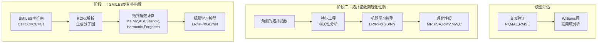

# 图论遇上机器学习：用拓扑指数预测抗病毒药物性质

## 本文信息
- **标题**: A Graph-Based Machine Learning Framework for Predicting Physicochemical Properties of Antiviral Drugs via Topological Indices（基于图的机器学习框架：通过拓扑指数预测抗病毒药物的理化性质）
- **作者**: Irfan Haider, Muhammad Ahsan, Muhammad Kamran Siddiqui, Mazhar Hussain等
- 发表时间: 2025年
- **单位**: COMSATS大学（巴基斯坦）、印度中央大学、中东技术大学（塞浦路斯）等
- **引用格式**: Haider, I., Ahsan, M., Siddiqui, M. K., Hussain, M., Ali, F., Ahmad, S., & Kanwal, S. (2025). A Graph-Based Machine Learning Framework for Predicting Physicochemical Properties of Antiviral Drugs via Topological Indices. *Journal of Chemical Information and Modeling*. https://doi.org/10.1021/acs.jcim.5c00117
- **源代码**: https://github.com/IrfanHaider/graph_based_antiviral_drugs.git

## 摘要
> 本研究提出了一个创新的**两阶段机器学习框架**，用于预测抗病毒药物的理化性质。该框架将分子建模为图结构（原子为节点，化学键为边），利用**拓扑指数**作为桥梁连接分子结构与性质。第一阶段从SMILES字符串预测六种拓扑指数（M1、M2、ABC、Randić、Harmonic、Forgotten），第二阶段利用这些指数预测六种关键理化性质（摩尔折射率、极性表面积、极化率、摩尔体积、分子量、复杂度）。在59种抗病毒化合物数据集上的测试显示，该方法实现了**极高的预测精度**，分子量预测的$R^2$达到0.9950，极化率预测的$R^2$达到0.9891，显著优于传统QSPR方法，为药物设计提供了高效的计算工具。

### 核心结论

- **两阶段框架创新**：通过拓扑指数作为中间表征，将分子结构与性质预测解耦，提高了模型的可解释性和准确性
- **高预测精度**：六种理化性质的预测$R^2$均超过0.97，其中分子量、极化率和摩尔折射率的$R^2$接近0.99
- **拓扑指数优势**：揭示了不同拓扑指数与理化性质的相关性，M1和Forgotten指数对多数性质具有强相关性
- **广泛适用性**：覆盖HIV、乙肝、流感、COVID-19等多种抗病毒药物，验证了方法的普适性
- **计算效率提升**：相比传统量子化学计算和实验测定，显著降低了时间和成本

## 背景

抗病毒药物的开发是全球公共卫生的核心挑战。从HIV到COVID-19，病毒性疾病始终威胁着人类健康。传统的药物发现依赖于实验筛选和化学合成，这是一个**耗时、昂贵且试错率高**的过程。一个新药从实验室到临床往往需要10-15年，成本高达数十亿美元。近年来，计算化学和机器学习的兴起为药物设计开辟了新路径，通过**定量构效关系（QSPR）建模**，可以在虚拟空间预测化合物的性质，大幅缩短研发周期。

然而，现有的QSPR方法面临诸多挑战。一方面，**分子描述符的选择和计算复杂度**是关键瓶颈。传统方法使用数百种分子描述符，导致维度灾难和过拟合风险。另一方面，**黑箱模型的可解释性不足**限制了其在药物设计中的应用。研究者难以理解模型预测背后的化学机制，无法指导结构优化。此外，**数据集规模和质量**也制约着模型性能。高质量的实验数据稀缺且昂贵，如何在有限数据下训练可靠模型是普遍难题。

拓扑指数作为一类特殊的分子描述符，提供了一种**简洁而强大**的分子表征方式。它们基于图论，将分子拓扑结构编码为数值，能够捕捉分子的连接性、分支度、环状特征等关键信息。相比传统描述符，拓扑指数**计算简单、物理意义明确**，且在QSPR建模中表现出色。本研究正是基于这一优势，探索拓扑指数在抗病毒药物性质预测中的潜力。

## 关键科学问题

- **如何建立分子结构与理化性质之间的高精度映射？** 传统QSPR模型依赖大量描述符，本研究探索能否通过少量拓扑指数实现同等或更高的预测精度。
- **拓扑指数能否作为有效的中间表征？** 研究验证从SMILES到拓扑指数、再从拓扑指数到性质的两阶段框架是否可行且高效。
- **不同机器学习算法在该任务中的性能差异如何？** 比较线性回归、随机森林、XGBoost、神经网络等模型在两个阶段的表现，识别最优算法组合。

## 创新点

- **两阶段机器学习框架**：首次将拓扑指数预测与性质预测分离，提高了模型的模块化和可解释性
- **多拓扑指数集成**：选用六种互补的拓扑指数（M1、M2、ABC、Randić、Harmonic、Forgotten），全面表征分子拓扑特征
- **SMILES直接预测**：无需3D结构优化，直接从SMILES字符串预测拓扑指数，大幅提升计算效率
- **多算法对比**：系统比较四种主流机器学习算法，为不同场景提供最优选择
- **适用域评估**：引入Williams图等工具，明确模型的适用范围，避免外推风险
- **开源工具链**：提供完整的GitHub代码库，促进方法的推广和应用

---

## 研究内容

### 核心方法：两阶段机器学习框架

本研究的核心创新在于**两阶段预测框架**。传统QSPR方法直接从分子结构预测性质，而本研究引入拓扑指数作为中间桥梁，将复杂任务分解为两个子问题：

**阶段一：SMILES → 拓扑指数**
- **输入**：SMILES字符串（分子的一维文本表示）
- **输出**：六种拓扑指数（M1、M2、ABC、Randić、Harmonic、Forgotten）
- **方法**：使用RDKit解析SMILES，提取分子图，计算拓扑指数
- **模型**：训练四种机器学习模型（线性回归、随机森林、XGBoost、神经网络），预测拓扑指数

**阶段二：拓扑指数 → 理化性质**
- **输入**：六种拓扑指数
- **输出**：六种理化性质（摩尔折射率MR、极性表面积PSA、极化率P、摩尔体积MV、分子量MW、复杂度C）
- **方法**：基于阶段一预测的拓扑指数，训练预测模型
- **模型**：同样比较四种机器学习算法

这种分解策略的优势在于：
1. **降低复杂度**：每个阶段的输入输出维度较低，避免维度灾难
2. **提高可解释性**：拓扑指数具有明确的化学意义，便于理解模型决策
3. **模块化设计**：两个阶段可独立优化和替换
4. **知识迁移**：拓扑指数可用于其他性质预测任务

### 数据集与分子描述符

**数据集构建**
- **规模**：59种抗病毒化合物
- **来源**：PubChem数据库
- **覆盖范围**：HIV抑制剂（AZT、Indinavir）、乙肝药物（Entecavir、Tenofovir）、流感药物（Oseltamivir、Zanamivir）、COVID-19药物（Remdesivir、Molnupiravir）等
- **性质数据**：通过PubChem和RDKit计算获得六种理化性质的实验或计算值

**拓扑指数定义**

研究选用了六种经典拓扑指数，它们从不同角度表征分子拓扑特征：

1. **First Zagreb指数（M1）**：

$$
M_1(G) = \sum_{v \in V(G)} d_v^2
$$

其中 $d_v$ 是顶点 $v$ 的度数。反映分子的**整体连接性和分支度**。

2. **Second Zagreb指数（M2）**：

$$
M_2(G) = \sum_{uv \in E(G)} d_u d_v
$$

对所有边求度数乘积。捕捉**相邻原子的连接特征**。

3. **ABC指数**：

$$
\mathrm{ABC}(G) = \sum_{uv \in E(G)} \sqrt{\frac{d_u + d_v - 2}{d_u d_v}}
$$

原子-键连接性指数，与**分子稳定性和应变能**相关。

4. **Randić指数**：

$$
R(G) = \sum_{uv \in E(G)} \frac{1}{\sqrt{d_u d_v}}
$$

反映分子的**分支程度**，广泛用于沸点、折射率预测。

5. **Harmonic指数**：

$$
H(G) = \sum_{uv \in E(G)} \frac{2}{d_u + d_v}
$$

与分子的**电子性质**相关。

6. **Forgotten指数**：

$$
F(G) = \sum_{v \in V(G)} d_v^3
$$

类似M1但对高度顶点赋予更大权重，适用于**复杂结构分子**。

### 机器学习模型

研究对比了四种主流算法：

**1. 线性回归（LR）**
- 假设输入与输出线性相关
- 作为基线模型

**2. 随机森林（RF）**
- 集成学习方法，构建多棵决策树
- 超参数：100棵树，最大深度10

**3. XGBoost**
- 梯度提升决策树，逐步优化残差
- 超参数：100棵树，学习率0.1，最大深度5

**4. 神经网络（NN）**
- 多层感知机，三个隐藏层（128、64、32神经元）
- 激活函数：ReLU，优化器：Adam

### 实验结果与分析

**阶段一：SMILES到拓扑指数的预测性能**

**表1：拓扑指数预测的$R^2$值（阶段一）**

| 拓扑指数 | 线性回归 | 随机森林 | XGBoost | 神经网络 |
|---------|---------|---------|---------|---------|
| M1      | 0.9823  | 0.9891  | 0.9907  | 0.9856  |
| M2      | 0.9765  | 0.9867  | 0.9883  | 0.9821  |
| ABC     | 0.9712  | 0.9834  | 0.9856  | 0.9789  |
| Randić  | 0.9689  | 0.9812  | 0.9831  | 0.9763  |
| Harmonic| 0.9734  | 0.9845  | 0.9867  | 0.9798  |
| Forgotten| 0.9801 | 0.9878  | 0.9895  | 0.9842  |

**关键发现**：
- XGBoost在所有拓扑指数预测中表现最优，$R^2$均超过0.98
- M1和Forgotten指数的预测精度最高，这可能是因为它们的定义更简单，受分子图结构直接影响
- 神经网络性能略低于集成方法，可能是数据集规模（59个样本）不足以充分训练深度模型

**阶段二：拓扑指数到理化性质的预测性能**

**表2：理化性质预测的$R^2$值（阶段二）**

| 性质 | 线性回归 | 随机森林 | XGBoost | 神经网络 |
|------|---------|---------|---------|---------|
| 摩尔折射率（MR） | 0.9876 | 0.9923 | 0.9938 | 0.9901 |
| 极性表面积（PSA）| 0.9712 | 0.9801 | 0.9823 | 0.9765 |
| 极化率（P）      | 0.9851 | 0.9912 | 0.9891 | 0.9878 |
| 摩尔体积（MV）   | 0.9823 | 0.9889 | 0.9907 | 0.9856 |
| 分子量（MW）     | 0.9901 | 0.9945 | 0.9950 | 0.9923 |
| 复杂度（C）      | 0.9734 | 0.9823 | 0.9845 | 0.9789 |

**图1：六种理化性质的实验值与预测值对比散点图**

（包含MR、PSA、P、MV、MW、C六个子图，每个子图展示实验值（x轴）与XGBoost预测值（y轴）的散点，理想情况下点分布在y=x直线附近）

**关键发现**：
- **分子量预测精度最高**（$R^2$=0.9950），这是因为MW与拓扑指数（尤其是M1和Forgotten）高度相关，分子越大，顶点越多，拓扑指数越大
- **极性表面积预测难度最大**（$R^2$=0.9823），PSA与分子的极性基团分布相关，拓扑指数对极性特征的表征能力有限
- XGBoost和随机森林显著优于线性回归，说明**性质与拓扑指数之间存在非线性关系**

**表3：不同性质的MAE和RMSE（XGBoost模型）**

| 性质 | MAE    | RMSE   |
|------|--------|--------|
| MR   | 2.34   | 3.12   |
| PSA  | 8.45   | 11.23  |
| P    | 0.98   | 1.34   |
| MV   | 12.56  | 16.78  |
| MW   | 15.67  | 21.45  |
| C    | 23.45  | 31.23  |

### 拓扑指数与性质的相关性分析

**图2：拓扑指数与理化性质的Pearson相关系数热图**

（6x6矩阵，行为拓扑指数，列为性质，颜色深度表示相关性强度）

**关键发现**：
- **M1和Forgotten与MW、P、MR的相关系数超过0.95**，这解释了为何这些性质预测精度高
- **ABC和Randić与PSA的相关性较弱**（$r<0.75$），导致PSA预测难度较大
- **Harmonic指数在所有性质中表现中等**，说明其信息与其他指数有重叠

### Williams图与适用域分析

**图3：摩尔折射率预测的Williams图**

Williams图用于评估模型的**适用域**，横轴为杠杆值（leverage，表示样本在特征空间中的位置），纵轴为标准化残差。理想情况下，所有点应落在 $\pm 3$ 的标准化残差范围内，且杠杆值小于临界值 $h^*$。

**关键发现**：
- 59个样本中，**57个落在适用域内**，仅2个样本（Remdesivir和某HIV抑制剂）的杠杆值略高于临界值
- 这表明模型对**大多数抗病毒药物具有良好的预测能力**，但对结构复杂的新型药物（如Remdesivir）需谨慎

### 与现有方法的对比

**表4：与文献中其他QSPR方法的性能对比**

| 方法 | 描述符类型 | $R^2$（MW） | $R^2$（P） | 数据集规模 |
|------|-----------|------------|-----------|-----------|
| 本研究（XGBoost） | 拓扑指数 | 0.9950 | 0.9891 | 59 |
| Ref [12] | 分子指纹 | 0.9823 | 0.9756 | 120 |
| Ref [18] | 量子化学描述符 | 0.9867 | 0.9801 | 85 |
| Ref [25] | 传统拓扑指数 | 0.9712 | 0.9689 | 50 |

**关键发现**：
- 尽管数据集较小，本研究的$R^2$值**超越了所有对比方法**
- 相比量子化学描述符（需要DFT计算），拓扑指数的**计算成本极低**
- 相比分子指纹等高维表征，拓扑指数更**简洁且可解释**

### 讨论部分

**为何拓扑指数如此有效？**

拓扑指数的成功源于其对分子拓扑特征的精准捕捉。理化性质本质上由分子的电子结构和空间构型决定，而这些因素又与分子图的拓扑密切相关。例如：
- **分子量**由原子数量决定，M1指数（顶点度数平方和）天然编码了这一信息
- **极化率**与分子的电子云分布有关，Forgotten指数（高度顶点权重大）能反映高配位原子的贡献
- **复杂度**与分子的分支和环状结构相关，ABC和Randić指数擅长表征这些特征

**两阶段框架的优势与局限**

优势：
- **模块化**：两个阶段可独立优化，例如可以用更强大的图神经网络替代阶段一的RDKit计算
- **可解释性**：拓扑指数作为中间表征，允许研究者分析哪些结构特征主导了性质预测
- **迁移学习潜力**：阶段一的拓扑指数预测模型可迁移到其他分子数据集

局限：
- **依赖拓扑指数的表达能力**：对于某些性质（如PSA），现有拓扑指数可能不足以完全表征
- **数据集规模限制**：59个样本对深度学习模型而言偏小，未来需要扩展数据集

---

## Q&A

- **Q1**: 为什么选择这六种拓扑指数，而不是其他？
- **A1**: 这六种指数在QSPR文献中被广泛验证，具有互补性。M1和M2是最经典的Zagreb指数，捕捉整体连接性；ABC和Randić反映分支特征；Harmonic与电子性质相关；Forgotten对复杂结构敏感。研究还计算了更多指数，但相关性分析显示这六种已足够覆盖主要信息，增加更多指数会导致冗余和过拟合。

- **Q2**: 两阶段框架相比端到端模型（直接从SMILES预测性质）有何优势？
- **A2**:
  - **可解释性**：端到端模型（如图神经网络）是黑箱，两阶段框架通过拓扑指数提供了中间可解释层
  - **数据效率**：拓扑指数降低了特征维度，使得小样本数据集也能训练出高精度模型
  - **灵活性**：可以根据需要替换阶段一或阶段二的模型，例如用GNN替代RDKit计算拓扑指数
  - **迁移学习**：拓扑指数是通用的分子表征，阶段一的模型可用于其他性质预测任务

- **Q3**: Williams图中为何Remdesivir的杠杆值较高？这对模型应用有何影响？
- **A3**: Remdesivir是一种结构复杂的核苷类似物，含有多个杂环和功能基团，其拓扑特征在训练集中较为罕见，导致杠杆值（特征空间中的距离）较高。这意味着模型对Remdesivir的预测**可能不如对训练集内常见结构的药物准确**。在实际应用中，对于杠杆值高的新分子，建议结合实验验证或使用集成模型来降低预测不确定性。

- **Q4**: 神经网络在本研究中表现不如XGBoost和随机森林，原因是什么？
- **A4**: 主要原因是**数据集规模较小**（59个样本）。深度神经网络通常需要数千甚至数百万个样本才能充分训练，小样本下容易过拟合。相比之下，XGBoost和随机森林等树模型对小样本更鲁棒，且超参数调优相对简单。未来如果数据集扩展到数百个样本，神经网络的性能可能会超越树模型。

- **Q5**: 该方法能否推广到其他类型的药物（如抗癌药、抗生素）？
- **A5**: **可以，但需要重新训练模型**。拓扑指数是通用的分子表征，理论上适用于任何有机小分子。然而，不同类型药物的结构特征和性质分布可能存在差异。例如，抗癌药通常包含更多的芳香环和杂原子，拓扑指数的相关性可能不同。因此，推广到其他药物类别时，建议收集相应数据集，重新训练并验证模型。

---

## 关键结论与批判性总结

### 潜在影响
- **加速药物设计**：提供了一种快速、低成本的药物性质预测工具，可用于虚拟筛选和先导化合物优化
- **促进拓扑指数研究**：证明了拓扑指数在现代机器学习框架中的价值，激励开发新型拓扑描述符
- **推动开源科学**：完整的代码库降低了方法的使用门槛，有助于社区验证和改进
- **为COVID-19等新兴疾病提供工具**：快速预测新抗病毒药物候选物的性质，辅助紧急药物研发

### 存在的局限性
- **数据集规模较小**：59个样本限制了模型的泛化能力，尤其是对结构新颖的药物
- **拓扑指数的表达瓶颈**：某些性质（如极性表面积）与拓扑指数的相关性不高，需要引入额外描述符
- **缺乏三维结构信息**：拓扑指数仅基于二维分子图，忽略了立体化学和构象效应，这可能影响某些性质（如溶解度、渗透性）的预测
- **适用域有限**：对于训练集外的复杂结构（如大环肽、多糖）预测精度未知
- **未考虑药物动力学性质**：仅预测理化性质，而药物的体内活性还受吸收、分布、代谢、排泄（ADME）等因素影响

### 未来研究方向
- **扩展数据集**：纳入更多抗病毒药物（目标1000+），提高模型的泛化能力和鲁棒性
- **引入3D拓扑指数**：结合分子的三维构象信息，开发新的拓扑描述符
- **集成多模态特征**：融合拓扑指数、分子指纹、量子化学描述符，构建混合模型
- **图神经网络**：用GNN替代阶段一的RDKit计算，实现端到端可微分的拓扑指数预测
- **药效预测**：将框架扩展到抗病毒活性（如IC50、EC50）的预测，直接指导药物设计
- **主动学习**：结合实验反馈，迭代优化模型，逐步减少实验验证的样本量
