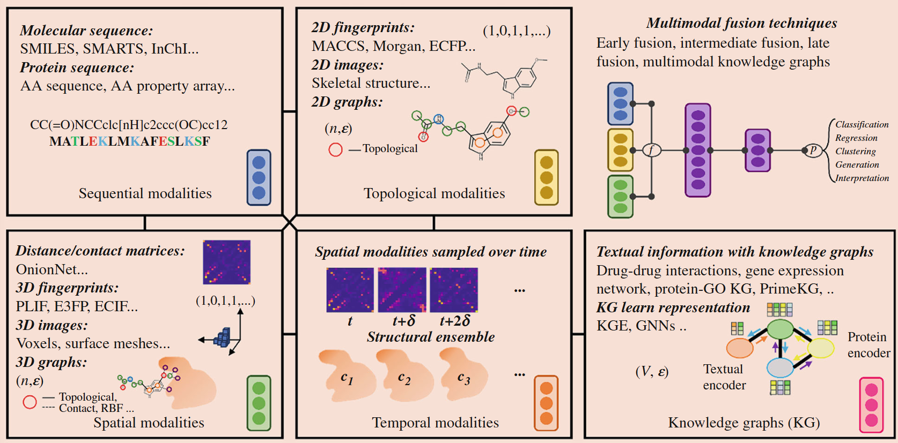
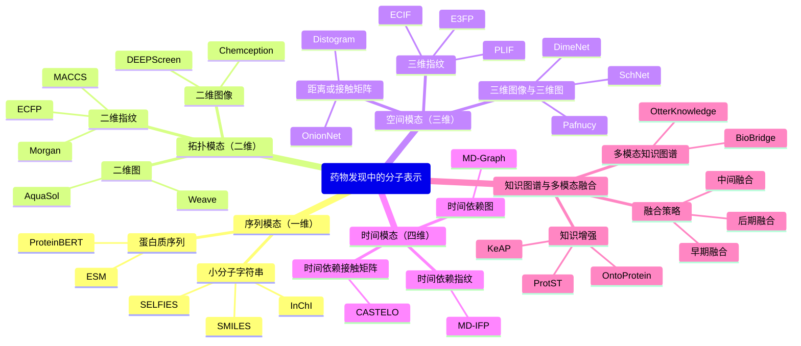
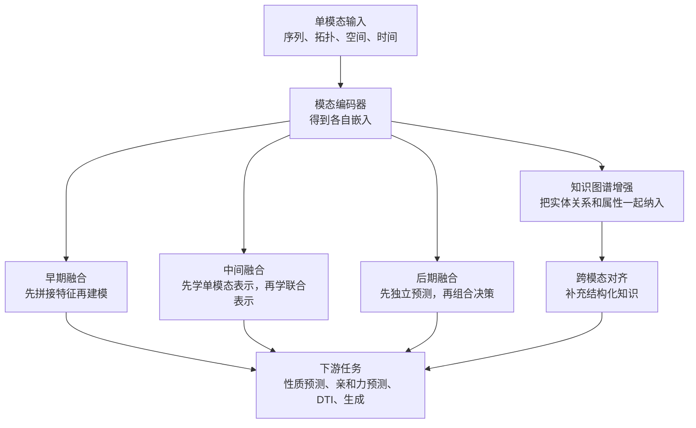

# 药物发现中的分子表示：从序列到多模态融合

## 本文信息
- **标题**：Molecular Representations for Drug Discovery（药物发现的分子表示方法）
- **作者**：Leili Zhang, Alex Golts, Vanessa Lopez Garcia
- 发表时间：2025年（Springer Handbook of Chem- and Bioinformatics 第48章）
- 单位：IBM Research（美国、以色列、爱尔兰）
- 引用格式：Zhang, L., Golts, A., & Lopez Garcia, V. (2025). Molecular Representations for Drug Discovery. In J. Leszczynski (Ed.), *Springer Handbook of Chem- and Bioinformatics* (pp. 1105-1121). Springer Nature Switzerland AG. https://doi.org/10.1007/978-3-031-81728-1_48

## 摘要

> 在机器学习辅助药物发现的任务中，**分子和靶点首先需要转换为机器可处理的数据格式**，然后才能使用各种机器学习算法进行处理。这些**机器可处理的数据被称为分子表示**。受蛋白质结构层次，即一级、二级、三级和**构象系综**结构的启发，本文将典型的分子表示重新定义为**四种数据模态**：序列模态（一维）、拓扑模态（二维）、空间模态（三维）和时间模态（四维）。每种模态都配有文献中的实例进行说明。此外，本文还讨论了用于表示学习的**知识图谱**以及旨在利用各模态优势的**多模态融合技术**。

### 核心观点

- **四维模态分类体系**：基于蛋白质结构层次，将分子表示分为序列（一维）、拓扑（二维）、空间（三维）和时间（四维）四种模态，每种模态都有其**独特的物理含义和应用场景**
- **序列模态的高效性**：SMILES和蛋白质序列等**一维字符串表示**因其紧凑性和高效性，在大规模预训练中占据重要位置，如MolFormer和ESM等**基础模型**
- **拓扑模态的实用性**：二维指纹和分子图捕获了**分子的局部环境和连接模式**，是传统QSAR和现代GNN方法的核心表示
- **空间模态的结构敏感性**：三维表示充分利用**坐标信息和空间关系**，对构象敏感，是**基于结构的药物设计**的核心，但也面临SE(3)对称性等挑战
- **时间模态的探索性**：四维表示包含**时间依赖信息**，如MD轨迹和构象系综，目前在机器学习中的应用仍相对较少，但**熵估计和结合动力学**等任务显示出其独特价值
- **多模态融合的必要性**：单一模态往往无法捕获分子的全部信息，**多模态融合**（早期融合、中间融合、后期融合）可以结合不同模态的优势，但也面临**信息冗余和模态崩溃**等挑战
- **知识图谱的整合作用**：知识图谱能够**整合异构数据源**的结构化知识，为表示学习提供领域知识注入，如PrimeKG和OtterKnowledge等方法展示了**知识增强表示学习的潜力**

**图1：分子表示的四维模态分类体系**。该图是本文的**核心框架图**，展示了基于蛋白质结构层次的数据模态分类方法。图中展示了不同模态的典型表示示例：
- **序列模态**：SMILES字符串（如`CC(=O)NCCc1c[nH]c2ccc(OC)cc12`）和蛋白质序列（如`MATLEKLMKAFESLKSF`）
- **拓扑模态**：MACCS、Morgan、ECFP等二维指纹以及骨架结构图
- **空间模态**：距离/接触矩阵（如OnionNet、Distogram）、三维指纹（如PLIF、E3FP）、三维图像（体素网格）和三维图（节点N和边E）
- **时间模态**：随时间采样的MD轨迹（c1、c2、c3表示不同时刻的构象）
- **知识图谱**：整合药物-药物相互作用、基因表达网络、蛋白质-GO等多源信息
- **多模态融合**：右侧展示了多模态融合技术（聚合函数f和学习函数p）的应用

## 背景

在机器学习辅助药物发现的任务中，分子和靶点首先需要转换为机器可处理的数据格式，然后才能使用各种机器学习算法进行处理。这些机器可处理的数据被称为**分子表示**。分子表示的选择对模型性能有决定性影响，不同的表示方式会编码分子的不同特征，从而影响模型对分子性质的理解和预测能力。

传统的分子表示分类基于人类阅读习惯，包括文本、图、图像和视频；或基于生物医学概念，包括DNA、RNA、蛋白质、小分子、疾病文本描述、生物网络等。然而，这些分类缺乏**物理意义的统一框架**。本文受蛋白质结构层次的启发，将分子表示重新定义为基于**物理理解的数据模态**：蛋白质的**一级结构**对应序列（一维）模态，**二级结构**对应拓扑（二维）模态，**三级结构**对应空间（三维）模态，而**构象系综**对应时间（四维）模态。

### 为什么要关注分子表示

分子表示是**连接化学世界和机器学习模型的桥梁**。一个好的分子表示应该能够：
- **充分编码分子的关键信息**，包括拓扑结构、电子性质、空间构象等
- **满足机器学习算法的要求**，如平移和旋转不变性、可微分性等
- **适应下游任务的需求**，如性质预测、生成模型、虚拟筛选等
- **平衡表达能力和计算效率**，在编码足够信息和保持计算可行性之间取得平衡

近年来，随着深度学习技术的发展，分子表示学习方法也取得了显著进展。从传统的QSAR描述符到现代的图神经网络和预训练语言模型，分子表示已经从**人工设计的特征**发展到**数据驱动的表示学习**。这种转变不仅提高了预测性能，也拓展了分子表示的应用范围。

### 分子表示的演进历程

分子表示的发展可以分为几个阶段：
- **人工设计阶段**：化学家根据经验设计分子描述符，如分子量、LogP、拓扑指数等，这些描述符通常具有明确的物理或化学意义
- **自动化提取阶段**：随着计算化学的发展，出现了自动化的分子指纹生成方法，如MACCS keys、ECFP等，这些方法能够系统地提取分子特征
- **表示学习阶段**：深度学习的兴起带来了数据驱动的表示学习，如自动编码器、图神经网络等，能够从数据中自动学习分子表示
- **预训练模型阶段**：大规模预训练模型的出现，如MolFormer、ESM等，通过自监督学习在海量数据上预训练，然后迁移到下游任务

### 当前挑战

尽管分子表示研究取得了显著进展，但仍面临多个挑战：
- **表示选择的主观性**：如何为特定任务选择合适的分子表示仍缺乏明确指导原则
- **多模态融合的有效性**：如何有效融合不同模态的信息，避免信息冗余和模态崩溃
- **知识整合的复杂性**：如何将领域知识融入表示学习，提高模型的可解释性和泛化能力
- **评估标准的不一致性**：缺乏统一的评估框架来比较不同表示方法的性能

---

## 分子表示的四维模态体系

下面这张思维导图可以先把全文主线抓住：本文不是简单罗列工具，而是在回答一个更根本的问题，即**药物发现中的分子信息究竟可以按什么物理层次来组织**。

### 序列模态（一维）

序列模态通常把分子写成**线性字符串**，用原子符号及其相关属性来编码分子，相邻原子之间的连接关系往往以隐式方式体现在字符串规则中。这类表示**紧凑且高效**，能够直接借用自然语言处理领域的技术进展。

#### 小分子字符串表示

**SMILES**（Simplified Molecular Input Line Entry System）是最流行的小分子字符串表示方法。SMILES通过遍历分子图获得，具有**非唯一性**（同一化合物可有多个SMILES字符串）但**明确性**（给定SMILES字符串对应单一化合物）的特点。

**SMILES的扩展和变体**：
- **SMARTS**（SMILES Arbitrary Target Specification）：增加了额外的符号来帮助指定子结构模式
- **SELFIES**（Self-Referencing Embedded Strings）：专注于提供**鲁棒表示**，始终代表有效分子
- **InChI**（International Chemical Identifier）：开源的**唯一标识符**，但可能存在歧义
- **InChIKey**：InChI的**哈希版本**，用于网络和库搜索

**MolFormer**是一个基于 transformer 的**基础模型**，在来自 ZINC 和 PubChem 数据集的**超过10亿条 SMILES**上训练。作为基础模型，MolFormer可以在更小的数据集上微调，用于光谱预测、溶解度预测和毒性预测等任务。

#### 蛋白质序列表示

蛋白质这类大分子通常用**核苷酸序列或氨基酸序列**来定义。在本文讨论的表示学习语境中，更常见的是氨基酸序列。氨基酸由**氨基、羧基和侧链**组成，是肽和蛋白质的**基本构件**，常用单字母符号或三字母缩写表示。已知遗传密码编码**22种蛋白源性氨基酸**，其中通常包括20种常见氨基酸和2种较少见的氨基酸。

对蛋白质序列进行**聚类和划分**，已被证明是解析蛋白质序列的重要工具，因为蛋白质之间往往存在源自共同进化起源的**同源性**。为避免数据泄露和过拟合，聚类时通常希望**增大**训练集与保留评估集内部的同类相似性，而在划分任务中则往往需要**控制甚至降低**训练集与评估集之间的相似性。**多序列比对**（MSA）是一类对齐与聚类方法，可用于评估未知序列的分子系统发育关系，并估计序列之间的进化相似性与分化程度。

**蛋白质语言模型**：
- **ESM**（Evolutionary Scale Modeling）：通过掩码重建学习特定氨基酸出现在序列中的概率，从原始序列中捕获**共进化和残基间接触信息**
- **ProteinBERT**：与 ESM 类似的蛋白质语言模型

除这类纯序列预训练模型外，原文还提到像**HPNN**这样的表示，会在每个残基上附加一个向量，用来表示其对其他残基的注意力，因此更接近**结合序列与结构关系的信息表示**，而不只是标准的蛋白质语言模型。

#### 数据划分策略

由于SMILES的**非唯一性**以及大型数据集中的**固有冗余**，**有意义地划分数据以避免机器学习模型的过拟合非常重要**。常用的划分策略包括：
- **简单划分**：确保相同的化合物不会同时出现在训练和测试折中
- **骨架划分**：MoleculeNet实现的基于**二维结构框架**划分数据的方法
- **相似性划分**：考虑分子相似性的更鲁棒的划分方法

### 拓扑模态（二维）

拓扑模态利用**扩展的成键信息**，或直接采用分子图像的形式，来表示分子中的原子及其**局部环境**。这类表示通常与向量化机器学习模型或基于图像的机器学习模型配套使用。

#### 二维指纹

二维指纹包括**扩展连接信息**，主要分为两类：

**结构密钥**是编码不同化学基团存在与否的二进制字符串。MACCS keys（也称为MDL keys）是二维结构密钥的流行例子，包含**166个密钥**，每个密钥编码分子中的**特定结构特征或原子排列**。

**哈希指纹**是从分子图映射的物理化学或结构属性的编码向量，可分为：
- **基于拓扑或路径的指纹**：如Daylight指纹
- **环形指纹**：如ECFP和Morgan指纹

**ECFP**（Extended Connectivity Fingerprints，扩展连接指纹）考虑每个原子的**二维圆形环境**，直到给定直径。通过选择圆形原子邻域的最大直径值，可以生成不同类型的ECFP。**最常用的是直径为4或6**，生成ECFP4和ECFP6指纹。ECFP的变体FCFP编码原子的**功能或角色**。

如果要更直观地理解，ECFP的构造思路可以概括为：
- 以每个原子为中心，逐层向外看它在二维拓扑上的邻居
- 设定一个最大直径，决定“看多远”，这就对应ECFP4、ECFP6这类不同版本
- 把每个局部原子环境编码后汇总，形成整分子的指纹向量

因此，**ECFP本质上是在统计“某类局部结构片段是否出现，以及出现了哪些”**，只是这里的片段不是人工手写规则，而是围绕原子自动枚举得到的。

#### 二维图像

分子图像主要用于**可视化目的**，而一些研究工作将其用作AI模型的输入形式。这主要得益于深度神经网络在计算机视觉应用中展现的**令人印象深刻的成功**。

作为二维图像，分子通常由其**骨架结构**表示。分子图像的**布局和渲染属性的标准化具有挑战性**，无论是出于可视化还是基于AI的计算目的。

**基于图像的深度学习方法**：
- **Chemception**：通过深度卷积神经网络（CNN）预测化学性质，与基于专家特征的模型相当
- **DEEPScreen**：类似方法用于DTI预测，药物候选分子图像输入CNN以预测与给定蛋白靶点的二元活性
- **ImageMol**：在1000万个骨架图上预训练的**基础模型**，随后在 SARS-CoV-2 数据集上微调用于 DTI 预测

### 空间模态（三维）

空间模态利用分子的**坐标信息**（因此对构象和对称性敏感），包括距离/接触矩阵、三维指纹、三维分子图和三维图像。使用空间模态的药物发现工作流通常被称为**基于结构的药物发现**（SBDD）。

#### 距离/接触矩阵

从已知结构构建坐标矩阵以利用三维信息是很自然的。然而，标量属性预测（如亲和力预测、溶解度预测、毒性预测、可合成性预测、蛋白口袋识别等）要求输入数据是**旋转和平移不变的**（即满足SE（3）对称性），而原始的三维坐标不满足这一要求。

预处理三维坐标以满足SE（3）对称性的一种方法是将坐标转换为距离，从而得到**距离矩阵**。使用距离矩阵作为特征以及各种神经网络的经验是，**连续距离通常比分箱距离表现更差**。这一观察体现在文献中分箱距离矩阵的主导地位。

这几种表示虽然都属于距离或接触矩阵，但构造思路并不完全一样：

| 方法 | 主要编码对象 | 怎么算的 | 直观理解 |
| --- | --- | --- | --- |
| **Distogram（AlphaFold）** | 残基间距离分布 | 不直接保留连续距离，而是把β碳原子之间的距离分到若干区间中；以AlphaFold为例，共使用39个cutoff，因此表示成分箱距离分布矩阵 | 更像“距离落在哪个范围”的概率表示 |
| **RF-Score** | 蛋白-配体粗粒化接触 | 先把蛋白和配体中的原子都粗粒化为9种常见原子类型，再统计12 Å以内不同原子类型对之间出现了多少次接触，因此最多形成$9 \times 9 = 81$维特征 | 用有限类型的接触计数近似三维相互作用 |
| **OnionNet** | 多层接触模式 | 延续按接触数建模的思路，但不是只用一个cutoff，而是在8种原子类型之间引入60个不同截断值，以描述更细的分层接触模式 | 像把蛋白-配体接触按距离一层层“切片”统计 |

这些方法的共同点是：**先把原始三维坐标转换为更稳定、更适合学习的距离或接触特征**，而不是直接把坐标喂给模型。

#### 三维指纹

三维指纹和二维指纹的区别很明显：三维指纹利用二维指纹经常省略的**结构信息**，考虑原子在三维空间中的空间排列以及它们如何相对定位。

这几种三维指纹最适合放在一起看，因为它们的关键差别就在于“**到底把哪一类三维信息编码成特征**”。

| 方法 | 主要编码对象 | 怎么算的 | 直观理解 |
| --- | --- | --- | --- |
| **NNScore** | 近距离接触、静电作用和配体整体特征 | 使用194维特征，包含2 Å内氢键接触、4 Å内其他近距离接触、4 Å内静电相互作用能、原子类型计数以及配体可旋转键数 | 把“接触强不强、近不近、是否有静电作用”这些信息拼成一个三维指纹 |
| **ECIF** | 蛋白-配体原子对接触 | 把蛋白端22类原子与配体端70类原子两两配对，统计这些原子对在空间中的接触，因此仅接触特征就有$22 \times 70 = 1540$维，另外再叠加RDKit的170个分子描述符 | 更细粒度的蛋白-配体原子对接触统计 |
| **PLIF** | 蛋白-配体相互作用类型 | 不只记录“是否接近”，还记录主链氢键、侧链氢键、溶剂氢键、离子相互作用、金属结合、芳环相互作用等事件 | 更像一张“相互作用事件清单” |
| **E3FP** | 配体三维局部环境和立体化学 | 借鉴ECFP，但不是围绕原子看二维圆形邻域，而是看三维球形邻域，并通过把球体划分为八分体来编码立体化学信息 | 可以看作ECFP的三维版本，重点是显式保留立体信息 |

#### 三维图像

虽然对人类来说不容易理解，但三维图像可以看作是二维图像对计算机的扩展。注意**三维图像不是旋转不变的**，因此不满足SE(3)对称性。在实践中，数据通常通过图像的旋转作为初始输入进行增强。

三维图像这几类方法很适合并排看，因为它们的核心差别就在于“**体素里到底存了什么信息**”。

| 方法 | 空间离散方式 | 通道或特征设计 | 主要任务 |
| --- | --- | --- | --- |
| **Ragoza et al.** | `24 × 24 × 24 Å` 网格，分辨率 `0.5 Å` | 按 `smina` 原子类型把蛋白和配体原子画到类RGB通道中 | 蛋白-配体相互作用预测 |
| **DeepSite** | `16 × 16 × 16` 体素网格 | 8个通道对应化学性质，而不是具体原子类型 | 蛋白结合位点预测 |
| **Pafnucy** | 体素网格 | 每个原子附加19类描述特征，再映射到体素表示 | 蛋白-配体结合亲和力预测 |

如果进一步看它们“怎么算”：
- **Ragoza et al.**：先把蛋白和配体复合物离散到三维网格中，再根据 `smina` 原子类型把原子投影到不同通道；体素占据程度由结合高斯项和二次项的密度函数决定，并结合原子的空间位置和范德华半径来计算
- **DeepSite**：同样先把空间切成体素，但8个通道不再表示具体原子类型，而是表示**疏水性、芳香性、氢键受体、氢键供体、正离子化、负离子化、金属原子**以及**排斥体积**。原文还提到，体素占据值是结合原子范德华半径，通过指数形式计算的
- **Pafnucy**：不是只问“这个体素里有没有原子”，而是进一步给原子附加**19类属性特征**，例如原子类型、杂化、重原子价、杂价、疏水性、芳香性、氢键供受体、环原子、部分电荷，以及它属于配体还是蛋白。也就是说，Pafnucy的体素表示比普通占据图更“富特征”

#### 三维分子图

分子图与早期图神经网络（GNN）方法密切相关，后者最初面向分子、图像以及部分 Web 结构数据等对象。分子图在节点和边中存储信息，节点存储关于所代表单元（原子或残基）的信息，边存储关于连接关系（相邻单元、键类型和键属性等）的信息。

**二维和三维分子图的区别**在于是否使用三维坐标信息来构建图（在节点或边中）。无向图在当前分子图应用中占主导地位。

这几种分子图方法同样适合表格化，因为区别主要体现在“**节点和边里装了什么，以及几何信息怎样进入模型**”。

| 方法 | 图的类型 | 节点和边怎么定义 | 几何信息怎么进入模型 |
| --- | --- | --- | --- |
| **AquaSol** | 无向二维分子图 | 节点只包含配体原子类型，边只包含键类型 | 基本不显式使用三维几何，更像最简图表示 |
| **Weave** | 无向二维分子图 | 节点有27个描述符，如原子类型、手性、形式电荷、部分电荷、环大小、杂化、氢键和芳香性；边有12个描述符，如键类型、图距离以及两个原子是否同环 | 仍以二维拓扑为主，不显式编码三维坐标 |
| **SchNet** | 无向三维分子图 | 节点包含原子属性和笛卡尔坐标信息 | 不直接生硬使用原始坐标，而是先转成**原子间距离**，再用径向基函数展开，从而保留几何信息并更容易满足SE(3)对称性 |
| **DimeNet** | 有向三维分子图 | 在图消息传递中显式考虑原子三元组 | 在距离之外进一步加入**原子三元组之间的夹角**，并配合 Fourier-Bessel 基函数，因此比SchNet更强调局部几何构型 |

从主线上看，`AquaSol / Weave` 更接近“二维拓扑图怎么编码”，而 `SchNet / DimeNet` 更接近“如何把三维几何稳定地注入图网络”。进一步说，**SchNet** 主要编码“距离信息”，而 **DimeNet** 在距离之外，还进一步显式编码“角度信息”。

### 时间模态（四维）

时间模态添加**时间依赖信息**，包括时间序列中的接触、构象时间序列、构象灵活性和熵项。分子动力学（MD）模拟中的时间在估计构象的熵和配体结合动力学中起着**关键作用**。

#### 时间依赖指纹

**MD-IFP**利用PLIF和两个动态特征：（1）配体第一溶剂化壳层中的**水分子数**；（2）配体与参考（结合）位置的**均方根位移**（RMSD）。这些四维指纹从数十个短MD模拟（1 ps）收集的数百个快照中计算，然后应用k-means聚类。随后的聚类用于计算不同状态的**驻留时间**，与实验结果有良好相关性。

它的思路可以理解为：先对每个MD快照计算一个“瞬时相互作用指纹”，再把许多快照串起来看其随时间如何变化。相比静态PLIF，MD-IFP多加了两类动态信息：
- 配体周围第一溶剂化壳层中的水分子数，反映局部溶剂环境
- 配体相对参考结合构象的RMSD，反映结合姿态是否稳定

随后再对这些时间序列快照做聚类，并用聚类结果估计不同状态的**驻留时间**。因此，**MD-IFP并不是单帧的三维指纹，而是把相互作用模式和动态稳定性一起编码进四维表示**。

#### 时间依赖接触矩阵

**代表方法**：
- **Ribeiro et al**.：使用时间依赖接触特征（从RAVE实现的序参数）与变分自编码器架构来选择蛋白-配体相互作用的关键接触特征的线性组合，这些特征随后通过metadynamics验证，以观察通常具有分钟或更长timescale的罕见蛋白-配体解离
- **CASTELO**：构建“时间接触矩阵”，矩阵的一半是时间依赖配体-残基接触数矩阵，另一半是从t到t + δ的接触数增量矩阵，与无监督卷积变分自编码器（CVAE）和HDBSCAN聚类方法配对，识别分子中被认为不稳定的**热点区域**

#### 时间依赖图

**MD-Graph**：提出基于MD轨迹的时间依赖图，其中每一帧由一个连接图表示，该连接图由二维配体图和具有12个截断距离的三维蛋白-配体相互作用图连接而成，预测的softmax值在所有帧上平均以计算损失函数，这些MD-图随后用GCN训练以预测HLA-肽复合物免疫原性

**表1：分子表示方法快速参考**

| 数据模态 | 子类别 | 代表方法 | 关键特征 |
| --- | --- | --- | --- |
| **序列模态（一维）** | 小分子字符串 | SMILES, SELFIES, InChI, MolFormer | 紧凑高效，利用NLP技术 |
| | 蛋白质序列 | ESM, ProteinBERT | 蛋白质语言模型，捕获共进化信息 |
| **拓扑模态（二维）** | 二维指纹 | MACCS, ECFP, Morgan | 固定长度向量，快速计算 |
| | 二维图像 | Chemception, DEEPScreen | 类似CNN处理视觉图像 |
| | 二维图 | AquaSol, Weave | 节点和边存储原子和键信息 |
| **空间模态（三维）** | 距离/接触矩阵 | AlphaFold (Distogram), RF-Score, OnionNet | 分箱距离，粗粒化接触 |
| | 三维指纹 | NNScore, ECIF, PLIF, E3FP | 包含空间排列和相互作用信息 |
| | 三维图像 | DeepSite, KDEEP, Pafnucy | 体素网格，需要数据增强 |
| | 三维图 | SchNet, DimeNet, GemNet | 满足SE(3)对称性，消息传递机制 |
| **时间模态（四维）** | 时间依赖指纹 | MD-IFP | 驻留时间与实验相关 |
| | 时间依赖接触矩阵 | Ribeiro et al., CASTELO | 序参数，识别热点区域 |
| | 时间依赖图 | MD-Graph | MD轨迹的图表示 |
| **知识图谱** | 知识增强学习 | OntoProtein, KeAP, ProtST | 整合GO功能、生物医学文本 |
| | 多模态知识图谱 | OtterKnowledge, BioBridge | 跨模态对齐，归纳学习 |
| **多模态融合** | 早期/中期/后期融合 | GraphMVP, MDeePred, CPAC | 聚合不同模态的嵌入 |

### 知识图谱

积累的科学知识是**知情决策构建的基础**，特别是在生命科学和治疗学领域。科学数据分散在多个来源，本质上是异构的，涵盖多组学数据、公开可用的知识库、实验、药理学测量、临床数据和科学文献。

知识图谱正逐渐成为一种关键工具，它不仅能整合来自**异构来源的丰富事实知识**，也有助于推动多模态学习。通过利用图拓扑（关系），知识图谱可以帮助**对齐不同模态的嵌入空间**。

#### 知识图谱的基本概念

知识图谱可以形式化描述为有向标注图$G = (V, E)$，其中顶点或具有唯一标识符的节点代表感兴趣的现实世界实体（如蛋白质、基因、化合物、细胞组分、通路），而边代表实体之间的关系（如结合、关联、类型等）或实体的数据类型属性（如分子功能、分子的质量、蛋白质的描述）。这些关系通常以RDF三元组的形式表达，也就是“主体—谓词—客体”这样的结构化关系句。例如，“药物X—作用于—蛋白Y”就是一个最简单的三元组例子。

#### 知识图谱嵌入

在图表示学习中，研究者利用图的拓扑结构（实体及其关系）学习**紧凑的向量嵌入**，使具有相似特征的节点在向量空间中彼此靠近。评分函数用于衡量三元组在知识图谱中的合理性，真实三元组得分较高，错误或损坏的三元组得分较低。这些优化后的嵌入随后可用于训练各种下游任务模型。

- **传统知识图谱嵌入模型**（KGE）通常是**直推式的**，不太适合归纳链接预测。这里的链接预测，指的是预测两个实体之间是否应该有一条关系边。这在药物发现场景中至关重要，因为涉及训练期间未见过的节点的预测。
- **归纳图神经网络方法**非常适合通过几何关系捕获跨模态依赖和异构实体类型之间的多样化相互作用类型。它们能够以归纳方式学习实体（对于该实体，许多边可能作为其他实体的主体和客体存在）、边或子图的表示。

#### 知识增强的表示学习

**代表方法**：
- **OntoProtein**：将**基因本体GO**（包含基因功能信息）的综合文本数据注入到用于序列的**预训练蛋白质语言模型（PLM）**中，通过**重建掩码氨基酸**来微调PLM，同时**最小化蛋白质的上下文表示与相关GO功能注释之间的嵌入距离**
- **KeAP**：比OntoProtein**更细粒度的token级方法**，其中非掩码氨基酸**迭代查询相关知识token**以收集信息（来自GO）以通过**交叉注意力**恢复掩码氨基酸
- **ProtST**：采用由**生物医学文本中的文本属性描述增强**的蛋白质序列数据集，**联合训练PLM和生物医学语言模型**

#### 多模态知识图谱

**OtterKnowledge**和**BioBridge**是利用多模态知识图谱整合不同来源、不同模态知识的代表性归纳方法。两种方法都先用预训练的单模态模型计算各模态的初始嵌入，再学习如何在多模态知识图谱中完成不同模态之间的转换或融合，同时保持这些单模态基础模型参数固定。

**代表方法**：
- **OtterKnowledge**：从实体本身及其相邻实体中**任意数量、任意组合的已知模态**出发，学习图中每个实体的表示。**知识图谱仅在训练阶段使用**，而在推理阶段，这些**知识增强后的预训练模型**可直接用于下游机器学习任务，以提高预测准确性
- **BioBridge**：在训练期间基于 **PrimeKG** 对单模态模型或单模态基础模型的嵌入空间进行**跨模态对齐**。它使用蛋白质、分子、生物过程、分子功能、细胞组分和疾病等实体类型之间的三元组，并将信息归为三种模态：**蛋白质序列**、**SMILES**，以及其他实体类型对应的**自然语言描述**

---

## 多模态融合策略

### 数据模态的选择

药物发现涉及探索**极其庞大的候选物空间**。AI可以通过预测和生成模型发挥关键作用，用于在进入昂贵实验之前缩小最有希望的候选物（例如可以与靶蛋白结合的小分子）。利用预测和生成模型进行候选物生成的关键在于学习蛋白质靶点、分子和疾病等实体的**有效表示**。

目前尚无共识认为哪种数据模态能带来普遍更优越的模型性能。一个假设是任务（如二级结构预测）可能需要**分子表示和机器学习算法的特定组合**以获得优化性能。要找出哪种组合是最优的，提供**公正的基准测试过程**以比较数据模态和机器学习算法至关重要。

**高维不一定更好**：
- 分子建模启发的三维指纹和代数拓扑启发的三维指纹尚未被时间模态实现
- 时间作为一个额外维度，尚未系统地证明对预测任务有帮助
- 即使三维图可以看作是二维指纹（存储在节点中）和三维指纹（存储在边中）的组合，三维图可能并不总是优于其组成的二维/三维指纹

### 多模态融合方法

如果把前面的单模态表示看成不同的信息入口，那么这里讨论的就是**这些入口如何在模型里会合**。下图概括了本文讨论最多的几条路径。

#### 非知识图谱方法的多模态融合

**Stahlschmidt et al**. 将多模态融合策略分为三类：
1. **早期融合**：简单连接每个输入数据模态的向量作为输入
2. **中间融合**：先学习每个模态各自的表示以捕获模态内相关性，再在潜在空间中融合这些表示以学习联合表示
3. **后期融合**：组合每个模态的子模型所做的决策

**早期融合示例**：
- **Zhang et al**.：使用多模态深度信念网络（DBN）结合一维序列、二维指纹（特定二级结构）和三维指纹（三级结构）以预测RNA结合蛋白的结合偏好
- **GraphMVP**：通过对比学习结合二维配体图和三维几何图，从二维图重建三维图，从而连接模态

**中间融合示例**：
- **MDeePred**：在深层潜在空间中结合二维配体指纹（ECFP4）和基于一维蛋白质序列的能量矩阵表示
- **CPAC**：结合基于一维蛋白质序列的表示（HPNN）和三维蛋白质图

**Jones et al**.的研究比较了不同融合方法，结合三维图像和三维图与各种融合策略，其中**早期融合策略**在亲和力预测任务上优于其他方法，而**后期融合策略**平均表现与中间融合策略相当。

---

## 挑战与未来方向

### 重用传统QSAR描述符用于深度学习任务

一维和二维模态（如SMILES和二维指纹）已被QSAR方法广泛使用并已适应深度学习算法。然而，**三维或更高维的描述符**（如CoMFA、CoMSIA、G-WHIM和VolSurf）在深度学习相关研究中**较少使用**（显著少于三维图和三维指纹）。

作者怀疑，这是由于传统QSAR领域和新兴深度学习领域之间的“**知识壁垒**”造成的，其原因可能包括付费软件带来的使用门槛、难以获取或高度领域化的文档，以及两个研究社区之间不够理想的交流。尽管如此，作者也认为这一问题有望随着领域发展而逐步缓解。

### MD轨迹在机器学习任务中的最佳实践

4D-QSAR和四维模态的机器学习任务面临类似问题——包含多个分子构象的数据集相对罕见。因此，**MD模拟**（以及其他模拟）提供了**理想替代方案**来补充数据稀缺性。

如上所述，目前时间依赖的机器学习主要集中在**聚类和MD特征学习**上。对于预测任务，CASTELO使用聚类结果之间的比较指标并利用来自MD轨迹的分子灵活性信息预测分子中的热点。MD-Graph在聚合结果以进行免疫原性预测之前用GCN处理每一帧。

这两种方法都可以归类为“**后期融合**”方法，假设四维模态学习是一个多模态融合问题。因此，探索**四维模态的早期融合和中间融合策略**将是有趣的。此外，收集MD轨迹相对耗时。构建MD轨迹数据库将有助于四维模态的机器学习的进一步发展。

### 将知识整合到现有模型中需要更高效和可扩展的框架

挑战在于将从许多来源提取和编码的信息融合到向量表示中，并将**大量知识有效注入机器学习和大型语言模型**中，这可能反过来帮助探测或提供LLM输出的来源。

这需要实现**高效且可扩展的训练与推理框架**，能够处理大规模知识，包括规模（即三元组数量）和异构性（即词汇表规模、关系类型和属性类型的复杂性）。知识图谱存储的管理，包括演化和维护，本身也是一个活跃研究方向，其性能在生物医学场景中也已有系统研究。

然而，缺乏**原生支持不同模态和/或基于该模态计算嵌入的图存储**。大型多模态知识图谱对所有基于嵌入的链接预测技术都具有挑战性；多模态嵌入并不显著更差，因为它们被视为额外的三元组。尽管如此，多模态编码器/解码器的训练成本更高。通常需要批处理、分区和采样等技术进行训练，例如在OtterKnowledge中使用GAS方法扩展训练。

### 探索超越语言和视觉的多模态研究

虽然多模态知识图谱研究主要集中在语言（文本）和视觉（图像）上，但需要深入研究**跨不同模态和领域的多模态研究**，特别是对于药物发现。

此外，这可能涉及具有多个目标的多任务训练，如链接预测和数值回归，以及实现**多模态补全模型**，从更广泛的模态谱中生成缺失的多模态信息，例如文本属性、蛋白质序列或图像。这不仅需要结合编码器来学习用于链接预测的多模态嵌入，还需要**神经解码器根据知识图谱中的信息生成缺失的多模态属性**。

### 将学习表示泛化到多个下游任务

将已学习到的表示泛化到多个下游任务，需要开发**鲁棒的训练技术**，使模型能够对具有**未见模态或缺失模态**的实体进行预测，这在药物发现中很常见。这既包括把预训练阶段得到的嵌入迁移到多个下游任务，也包括分析训练阶段与后续任务阶段的数据可用性差异会如何影响模型表现。

一个关键方面涉及分析预训练期间可用的数据与后续任务期间可用的数据之间的**差异如何影响下游任务**。在训练期间，可能与蛋白质或药物相关联许多（多模态）属性，而在下游微调期间，可能需要推断只有氨基酸序列和SMILES可用的蛋白质或配体的属性。

### 多模态融合问题面临的1 + 1 < 2挑战

如果目标是在多模态融合中实现**叠加式的预测增益**，那么每个模态最好在其**信息空间中彼此正交**。但这在现实中几乎不可能做到。一个简单反例就是 AlphaFold，它可以仅凭一维蛋白质序列预测三维蛋白质结构。换句话说，一维蛋白质序列与三维蛋白质结构之间本身就共享了足够多的信息。

然而，这种相关性对大多数机器学习算法并不透明，因此最终常常只带来“**轻微增量**”的性能提升。若想进一步提高预测能力，一个关键问题是：如何在尽量提供更多信息的同时，减少不同模态之间的冗余。假如描述蛋白-配体复合物的所有可能模态都已被纳入，那么问题就转化为一个更工程化的优化过程，即选择合适的模态组合以及与之兼容的机器学习算法。

**模态崩溃**是训练数据中的**不平衡**和标签呈现长尾分布的挑战，即一小部分标签常见，有大量训练样本，而大多数标签不频繁甚至从未出现过。此外，分子的结构模态可能为表示学习提供有价值的见解，但某些模态（如三维图像）的稀疏性可能导致收益相对较小。

一个潜在问题是**模态崩溃**，即在多模态融合或知识图谱训练过程中，只有一部分最有帮助的模态占据主导地位，导致模型**过度依赖这些模态，而忽视其他模态的信息**。这种学习过程中的不平衡，或某些模态数据不足，都可能导致次优表示。此外，多模态数据质量不佳，以及来自多个来源的知识图谱本身稀疏且不完整，也都可能引入偏差。

### 跨未对齐异构数据集的学习表示

当在具有略有不同模式的数据库上依次训练模型时，可能会发生灾难性遗忘；模型在**从新数据库学习时可能会忘记它在前一个数据库中学到的所有内容**。

源模式之间的对齐不是一个小问题，即使一个数据源中的关系可能与另一个数据源中的关系共享一些相似性；由于它们不完全相同，不可能将它们视为相同类型的关系。这阻碍了模型在没有明确强制机制的情况下**有效地传递这两个关系之间的共性**。

为了解决这个问题，OtterKnowledge采用**集成方法**来处理分别在未对齐的知识图谱上训练的预训练模型。然而，集成方法并不实用，因为**需要的模型数量随着数据库数量的增长而增长**。设计一种**动态学习方法**，使得模型能够学习跨具有不同模式的数据源进行传递，是一个**开放的研究问题**。

### 预训练模型的基准测试和可解释性

这强调了对**公开可用的基准和排行榜**的需求，以评估使用不同模态的预训练模型的有效性。如果没有标准化的基准，就很难客观地评估跨模态模型与现有单模态模型在各种任务上的性能比较。

尽管MoleculeNet、ChEMBL、DUD-e、DrugBank和BindingDB等数据集已由本章综述的研究用作基准，但已发现**数据集偏差导致模型偏差**，从而产生误导性结果。**持续的数据库维护**以及资助持久性竞赛（如CASP、CAPRI、CAFA和D3R）非常重要。

此外，**模型输出的可解释性缺乏**限制了它们的实际适用性。基于注意力的GNN已被用于增强分子性质预测的可解释性。对于知识图谱，一个有趣的研究方向是探索知识图谱嵌入模型和神经符号方法如何增强模型决策背后的可解释性或理解。

---

## 关键结论与未来展望

### 主要贡献

本文系统性地梳理了药物发现中的分子表示方法，提出了基于蛋白质结构层次的**四维模态分类体系**，为理解和选择分子表示提供了一个更统一的物理框架。从序列到时间，从单模态到多模态融合，从数据驱动到知识增强，这一领域的表示方法正在持续扩展。

### 方法学进展

- **表示学习的演进**：从人工设计的QSAR描述符到数据驱动的深度学习表示，再到大规模预训练的**基础模型**，分子表示的**表达能力和泛化能力不断提升**
- **多模态融合的多样化**：早期融合、中间融合和后期融合策略各有优势，**选择需要考虑具体任务和数据特性**
- **知识增强的前景**：知识图谱为整合异构数据源和领域知识提供了有效途径，OtterKnowledge和BioBridge等方法展示了**知识增强表示学习的潜力**
- **基础模型的崛起**：MolFormer、ESM等基础模型在**海量数据上预训练**，并在**多个下游任务中展现出较强的迁移能力**

### 挑战与局限

- **模态选择的困境**：缺乏明确的指导原则来选择适合特定任务的数据模态，**高维表示不一定带来更好的性能**
- **多模态融合的复杂性**：**信息冗余**、**模态崩溃**、**长尾分布**等问题限制了多模态融合的有效性
- **知识整合的难度**：高效可扩展的知识增强框架仍在发展中，**跨未对齐数据集的学习表示是开放问题**
- **评估标准的不统一**：缺乏标准化的基准测试和评估体系，**不同研究之间难以公平比较**
- **可解释性的不足**：深度学习模型的**黑箱特性**限制了其在药物发现等高风险领域的应用

### 未来方向

- **探索新的表示形式**：继续挖掘可能被忽视的重要分子表示，**特别是传统QSAR描述符和四维模态**
- **优化多模态融合策略**：开发能够有效提取正交信息、**避免模态崩溃**的融合算法
- **构建高效知识框架**：实现大规模知识图谱与深度学习模型的无缝集成，**支持知识的注入和推理**
- **建立统一评估体系**：开发标准化基准和评估指标，**促进不同方法的公平比较**
- **增强模型可解释性**：结合神经符号方法、注意力机制等**提高模型透明度，建立可信AI**
- **打破领域壁垒**：促进传统计算化学与现代深度学习领域的交流与合作，**加速方法创新**

药物发现中的分子表示学习是一个快速发展的领域。随着新方法的涌现和旧方法的重新审视，结合合适的领域知识、模态组合和算法设计，机器学习辅助药物发现仍有很大的发展空间。
