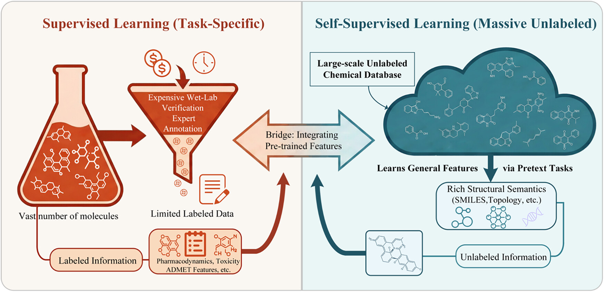
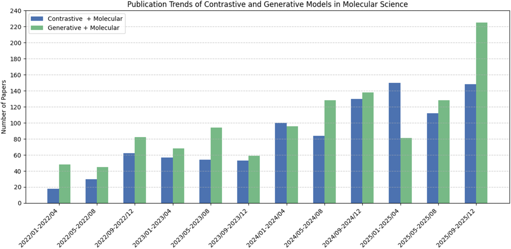
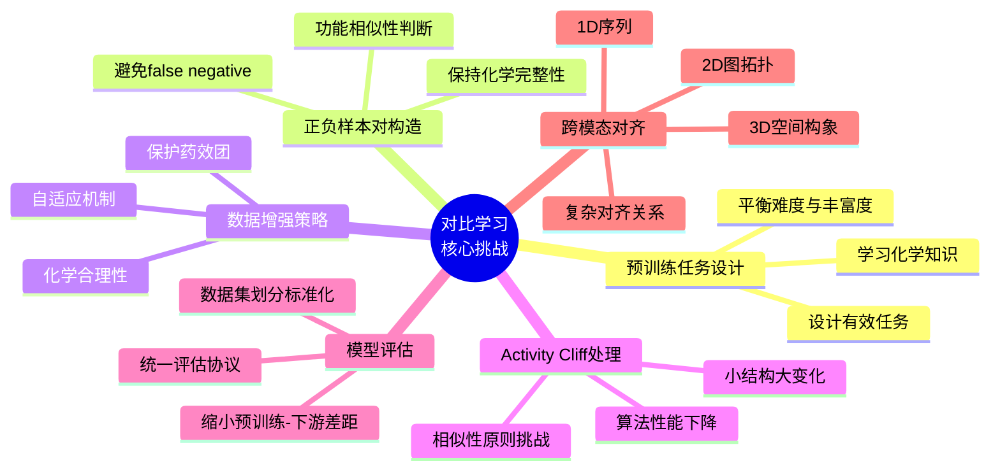
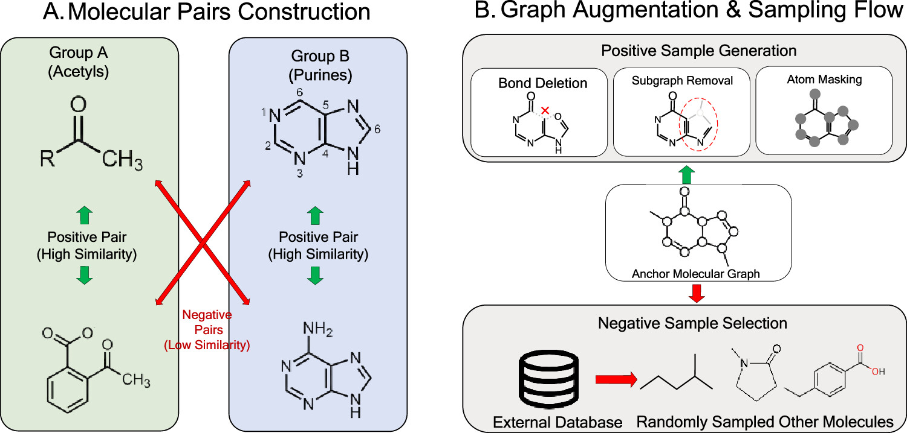
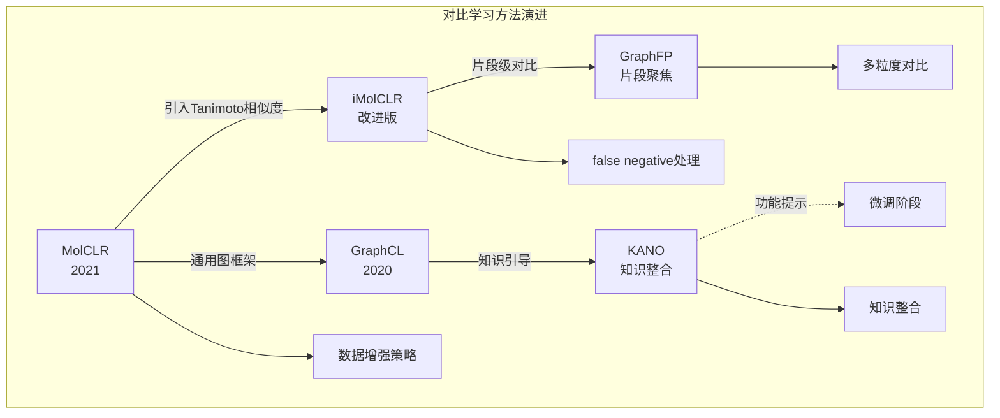
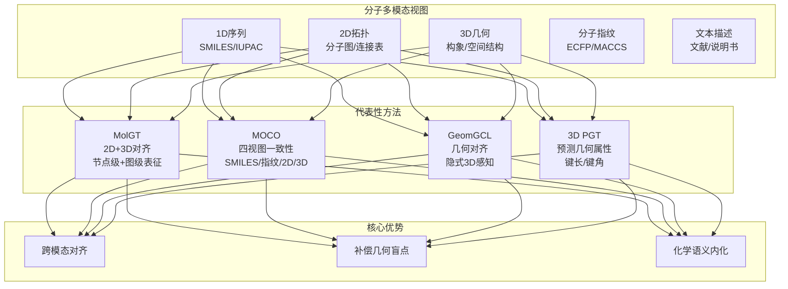
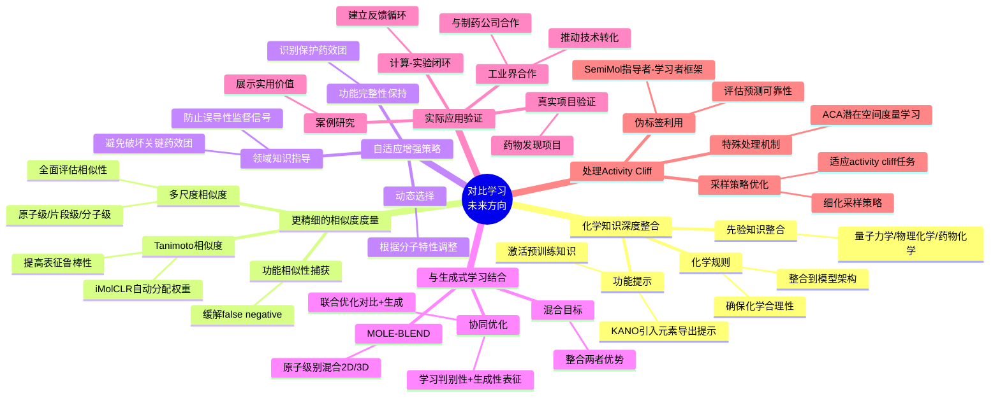

# 小分子表征学习如何突破药物发现的数据瓶颈？对比学习给出答案

## 本文信息

- **标题**：小分子表征学习中对比与生成式自监督方法的综合评述
- **作者**：Zengqian Deng, Dongjiang Niu, Zhen Wang, Zhen Li
- **发表期刊**：*Journal of Chemical Information and Modeling*
- **发表时间**：2026年（Received February 20, 2026; Revised April 29, 2026）
- **DOI**：https://doi.org/10.1021/acs.jcim.6c00547
- **单位**：青岛大学计算机科学与技术学院、中国海洋大学计算机科学与技术学院
- **引用格式**：Deng, Z., Niu, D., Wang, Z., & Li, Z. (2026). Comprehensive review of contrastive and generative self-supervised learning for small molecular representation. *Journal of Chemical Information and Modeling*. https://doi.org/10.1021/acs.jcim.6c00547

## 摘要

> **药物发现是一个复杂且资源密集的过程**，开发有效的计算工具来分析海量且异质的分子数据至关重要。在此背景下，**对比学习**和**生成式学习**已成为分子表征学习的两大基础范式，推动了显著进展。这些方法的核心在于**通过利用多种数据模态高效学习信息密集的嵌入**，从分子的内在1D、2D和3D结构到其在复杂生物网络中的外在背景。所得表征为**分子性质预测（MPP）、相互作用分析和药物设计**等广泛的下游应用提供了鲁棒特征。本文第一部分深入剖析对比学习的应用原理与实践，系统梳理从**InfoNCE损失函数**设计到**数据增强策略**选择、从**分子级对比**到**片段级对比**的技术演进，全面解析MolCLR、iMolCLR、GraphCL等代表性方法的创新之处。

### 核心结论

- **对比学习核心思想**：通过拉近正样本对、推远负样本对来学习表征，使得模型能够捕获对化学变换不变的分子特征
- **数据增强是成功关键**：MolCLR系统研究表明，原子遮蔽、键删除、子图提取等增强操作的组合对性能影响巨大
- **False negative问题亟待解决**：简单随机选择负样本可能将功能相似但结构不同的分子错误地视为负样本，iMolCLR通过Tanimoto相似度校正样本权重
- **多粒度对比增强表达**：从分子级到片段级、从单模态到多模态，对比学习通过挖掘分子内部的层次关系显著提升了表征质量
- **评估标准化仍需改进**：不同研究的数据集划分、评估指标差异较大，需要建立更统一的评估协议

## 背景与动机

**图1：分子表征学习中数据可用性的二分法。**
- **左图**：监督学习场景依赖高质量的专家标注数据，在特定任务上表现优异，但受限于数据稀缺和高昂的标注成本
- **右图**：自监督学习利用海量未标注的化学数据库，通过设计 pretext task 从数据本身创建监督信号

> 这张图清晰展示了两种学习范式的核心差异。**监督学习虽然性能优异，但标注成本高昂且数据稀缺**；**自监督学习则能够充分利用海量的未标注化学数据库**，这正是药物发现领域面临的瓶颈问题的解决方案。

在药物研发领域，**高质量的分子表征**是推动下游任务成功的基石。传统方法依赖人工设计的分子指纹（如ECFP、MACCS），虽然简单高效，但**表达能力有限**，**难以捕获分子复杂的结构特征和化学性质**。

近年来，深度学习的兴起为分子表征学习带来了新机遇。基于图神经网络的方法能够自动从分子结构中学习特征，在多个药物发现任务上超越了传统方法。然而，深度学习的成功依赖于**大规模标注数据**，这在药物研发领域是一个**严重瓶颈**——实验数据获取成本高昂、耗时漫长，且高质量的生物活性数据相对稀缺。

### 分子数据库资源

自监督学习的成功离不开海量分子数据库的支持。目前已有多个大规模分子数据库可用于预训练：

- **ZINC数据库**：包含超过370亿个可枚举、可搜索的商业可用2D化合物，其中超过45亿个已构建3D构象。ZINC-22是最新的版本，提供分子结构特征，是预训练图神经网络以学习通用化学语法的最常用语料库
- **ChEMBL数据库**：包含超过290万个具有药物样性质的生物活性分子，是手动策划的数据库。它桥接了基因组数据与有效药物开发之间的鸿沟，包含大量生物活性标签，如IC50和抑制常数Ki
- **PubChem数据库**：截至2026年4月，包含3.42亿种物质和1.23亿个化合物，以及2.99亿条生物活性数据。虽然在大规模预训练任务中，研究者通常丢弃异构标签信息，仅依赖大量结构数据

> **自监督学习**的出现为解决这一瓶颈提供了新思路。通过设计**无需人工标注的预训练任务**，模型可以从海量未标注的分子数据中学习丰富的化学知识，然后迁移到下游任务中。这种范式在自然语言处理和计算机视觉领域已经取得巨大成功，如BERT、GPT、SimCLR等方法。

在小分子领域，自监督学习主要沿着两条路线发展：**对比学习**和**生成式学习**。对比学习通过拉近相似分子、推远不相似分子的表征来学习，而生成式学习则通过重构分子或预测masked部分来捕获结构信息。本文第一部分将深入探讨对比学习的原理、方法与实践。

**图2：对比学习和生成模型在分子表征中应用的趋势（2022-2025）。**
- **数据来源**：Web of Science (WoS) 核心合集
- **检索关键词**：对比学习、生成学习、分子表征
- **时间范围**：2022年1月至2025年12月
- **筛选标准**：仅包括与本文综述语境严格相关的出版物

这张趋势图展示了该领域的快速发展。从2022年到2025年，**相关出版物数量持续增长**，说明**自监督学习在分子表征中的应用正受到越来越多的关注**。

### 关键科学问题

对比学习在小分子表征中面临多个核心挑战：

## 对比学习核心原理

### 基本框架与InfoNCE损失

> 对比学习的核心思想是**学习一个表征空间，使得相似的分子在空间中距离接近，不相似的分子距离远离**。这种范式不需要人工标注，而是通过构建正负样本对来定义相似性。在分子场景中，正样本通常是同一分子的不同增强视图，负样本是不同的分子。然而，构造合适的负样本是一个挑战，因为**结构不同的分子可能具有相似的功能性质**。

对比学习的训练目标通常使用**InfoNCE损失**（Information Noise Contrastive Estimation，信息噪声对比估计）来形式化。设$x$为输入分子，数据增强模块将其转换为两个相关的视图$\tilde{x}_i$和$\tilde{x}_j$。编码器将这些视图映射到表征向量，然后投影到潜在嵌入$z_i, z_j$。

$$
\mathcal{L}_{\text{InfoNCE}} = -\log \frac{\exp(\text{sim}(z_i, z_j) / \tau)}{\sum_{k=1}^{2N} \mathbb{1}_{[k \neq i]} \exp(\text{sim}(z_i, z_k) / \tau)}
$$

其中$\text{sim}(z_i, z_j)$是相似度度量，通常使用**余弦相似度**，$\tau$是**温度参数**控制分布的锐度。

#### 公式的通俗解释

InfoNCE损失的目标是**最大化正样本对的相似度，同时最小化负样本对的相似度**。分子中的指数项表示相似度，除以温度$\tau$可以控制相似度的锐度。分母对所有负样本求和，表示模型需要将正样本与所有负样本区分开来。通过优化这个损失函数，模型学习到一个表征空间，使得**同一分子的不同增强视图在这个空间中距离接近**，而**不同分子的表征距离远离**。

### 对比学习vs监督学习

> **对比学习 vs 监督学习的权衡**：与监督学习相比，对比学习具有不同的优势。监督学习需要大量标注数据，针对特定任务优化，可能过度拟合标注任务。对比学习只需要未标注数据，学习通用的表征特征，学习对数据变换鲁棒的特征。然而对比学习也面临挑战：需要设计合适的pretext task、化学合理的数据增强策略，以及计算成本较高。

## 数据增强策略

数据增强是对比学习成功的关键，对于分子图需要设计**化学合理的增强操作**。MolCLR系统研究了不同增强策略的效果，发现适当的增强组合对性能至关重要。

**图4：分子表征的对比学习框架。**
- **图4A**：对比学习的基本框架，通过增强数据生成正样本对，数据集中的所有其他样本被视为负样本
- **图4B**：常用的图增强策略，包括原子遮蔽（atom masking）、键删除（bond deletion）和子图提取（subgraph removal），用于生成正样本对

这张图清晰地展示了对比学习的核心框架和常用的数据增强方法。图A说明了正负样本的构造方式，这是对比学习成功的关键。图B展示了三种主要的图增强技术，这些增强策略需要在保持化学合理性和提供足够变化之间找到平衡点。

### 分子图增强方法

常用的分子图增强方法各有特点：

| 增强类型 | 具体操作 | 化学合理性 | 适用场景 |
| --- | --- | --- | --- |
| **节点遮蔽** | 随机遮蔽部分原子 | 模拟官能团保护/脱保护 | 保留整体骨架 |
| **边删除** | 随机删除部分化学键 | 模拟键断裂反应 | 测试结构鲁棒性 |
| **子图采样** | 随机提取分子子结构 | 关注局部药效团 | 学习局部特征 |
| **构象扰动** | 三维结构的小幅旋转/平移 | 模拟热运动 | 三维感知模型 |
| **原子类型替换** | 替换相似性质的原子 | 电子等排体替换 | 学习性质不变性 |

### 增强策略的实验发现

MolCLR的研究表明，**并非所有增强组合都有效**。过于激进的增强会破坏分子的化学完整性，而过于保守的增强则无法提供足够的变化。最佳策略通常是**组合多种轻量级增强**，如节点遮蔽+边删除。

> **关键发现**：数据增强通过使pretext task更具挑战性，迫使模型学习更丰富的潜在语义信息。这与图像领域的SimCLR类似，但需要针对分子的化学特性进行领域特定的创新。

### False Negative问题

对比学习中的一个关键挑战是**false negative问题**：简单地从数据集中随机选择负样本可能会引入false negative案例，即**结构不同但具有相似功能性质的化合物被错误地视为负样本**。

例如，两个分子结构不同，但都含有相同的药效团；电子等排体替换后的分子，功能相似但结构不同；同一药物的不同盐型或前药。

> **false negative的核心问题**：这些分子应该被视为"某种程度上相似"，但在标准对比学习框架中被强制视为负样本，可能导致模型学习到错误的相似度度量。

## 代表性方法详解

对比学习在小分子表征领域已发展出多种代表性方法，下图展示了主要方法的演进关系和核心特点：

这些方法各有侧重，共同推动了对比学习在分子表征领域的发展。

### MolCLR：分子对比学习框架

**MolCLR**（2021）是分子对比学习的代表性工作，系统研究了数据增强策略对性能的影响。

> **MolCLR的核心创新**：首次系统评估了不同增强组合对分子对比学习的影响，提出了三种图增强技术：**原子遮蔽**（随机遮蔽部分原子模拟官能团保护）、**键删除**（随机删除部分化学键测试结构鲁棒性）、**子图提取**（提取分子子结构关注局部药效团）。

在多个分子性质预测任务上，MolCLR显著优于监督学习和无监督基线。在**MoleculeNet的11个数据集上平均提升了约10%**的性能，小样本场景下优势更加明显。研究还发现不同数据增强策略对预训练性能有不同影响：属性遮蔽提升最小，原子丢弃略好一些，而对分子结构和性质进行剧烈修改的方法不适合分子表征学习。

**ContraDTI**引入了四种更符合化学规则的图增强策略：**收缩烷基链**（去除乙基）、**伸长烷基链**（将乙基转换为丙基）、**交换卤素**（Cl换成Br）、**构象扰动**。这些策略在保持化学合理性的同时提供了足够的多样性，使得模型能够学习到更鲁棒的分子表征。

**MolCLR的局限性**：随机选择负样本可能将功能相似的分子视为负样本的**false negative问题**、没有考虑不同分子特性的**固定增强策略**、只在分子级别进行对比而未考虑子结构级别的**单粒度对比**。

### iMolCLR：改进的分子对比学习

**iMolCLR**在MolCLR的基础上进行了改进，专门针对false negative问题提出了解决方案。

> **iMolCLR的核心创新**：引入**Tanimoto相似度**来校正对比损失中的样本权重，进行**片段级对比学习**将分子分解为有意义的片段通过学习理解这些构建块来更好地表征分子间相互作用机制，以及使用**动态样本权重**自动为正负样本对分配权重降低false negative样本的权重。

iMolCLR使用Tanimoto相似度$S_T(A,B)$来衡量两个分子$A$和$B$的相似度：

$$
S_T(A,B) = \frac{|A \cap B|}{|A \cup B|}
$$

在**ClinTox任务**上，iMolCLR相比基础MolCLR提升了**2.1%**的性能，缓解了结构不同但功能相似的分子被强制排除的问题，片段级对比学习更好地捕获了分子子结构，模型可解释性增强可以识别关键的药效团。iMolCLR的改进表明，领域知识（化学信息学）与深度学习的结合能够显著提升对比学习的效果，这为后续研究提供了重要启示。

### GraphCL：通用图对比学习

**GraphCL**（2020）虽然是针对通用图的学习方法，但其框架对分子图同样适用。

> **GraphCL的核心思想**：强调augmentation的选择对对比学习成功至关重要，通用图框架不针对特定类型的图可以应用于分子图、社交网络等，系统性评估了不同增强策略对图对比学习的影响。

GraphCL研究了以下图增强方法：**节点删除**（随机删除部分节点）、**边扰动**（随机添加或删除边）、**特征遮蔽**（随机遮蔽节点特征）、**子图采样**（随机提取子图）。虽然GraphCL是通用方法，但为分子对比学习提供了重要启示：**增强策略需要领域知识**，通用增强可能不适用于分子图，增强强度需要控制，多尺度增强可能更有效。

### KANO：知识引导的对比学习

**KANO**通过整合外部领域知识来学习更鲁棒和可解释的表征。该框架首先从基础化学原理构建面向元素的知识图谱（ElementKG），使用元素-属性三元体构建语义知识图，然后使用它构建增强的分子图，将原始图和增强图视为正样本对。

> **KANO的核心创新**：通过将化学先验知识整合到对比学习框架中，学习到更鲁棒和可解释的分子表征。
- **元素引导的增强策略**：在对比预训练阶段，使用元素引导的增强策略从原始图创建富集的分子图作为正样本
- **功能提示**：在微调阶段引入也从元素导出的功能提示来激活预训练期间学到的任务相关知识

---

## 多粒度与多模态对比

### 片段级对比学习

除了分子级对比，**片段级对比学习**也是一个重要方向。这种方法将分子分解为更小的、有意义的片段，通过学习这些片段的表征来理解分子的整体性质。与将整个分子视为单一实体不同，这些方法将化学结构划分为更小的、有意义的片段即子图，通过学习理解这些构建块，片段级对比学习可以更好地表征分子间相互作用机制并增强模型可解释性。

片段级对比学习具有更好的可解释性，可以识别关键的药效团和功能基团，能够缓解false negative问题因为片段级相似度可以捕获功能相似性，可以学习层次化表征学习从局部到全局的多层次分子特征。

代表性方法包括：
- **GraphFP**：专注于片段级结构，通过从大规模数据集构建常见分子片段的词汇表来学习分子表征，然后使用片段池化机制将节点特征聚合成聚合嵌入
- **FragCL**：将每个分子分解为片段，进一步在2D和3D结构之间应用跨视图对比学习，通过对比同一分子的不同视图来学习更鲁棒的表征
- **iMolCLR**：结合化学信息学相似度度量来缓解false negatives，采用片段级对比学习来捕获分子子结构

### 多视图对比学习

**多视图对比学习**从不同角度描述同一分子，学习跨视图的一致性。通过显式地最大化1D、2D和3D模态之间的互信息，产生不变的表征，自然补偿纯拓扑描述符中固有的几何盲点。

> **多视图学习的核心优势**：通过显式地对齐跨模态相关性，将对比学习从简单的特征提取提升到化学语义的系统内化，产生自然补偿纯拓扑描述符固有的几何盲点的不变表征。

## 性能评估与应用

### 下游任务性能

对比学习在多个分子性质预测任务上展现出强大性能。**MoleculeNet**是最广泛认可的基准数据集之一，由斯坦福大学DeepChem团队开发，包含回归和分类任务的多样化集合，覆盖量子力学性质、溶解度、脂溶性、蛋白-配体结合亲和力以及毒性、抗病毒活性（HIV）和药物安全性（SIDER、BBBP）。超过70万个化合物的数据使MoleculeNet成为评估虚拟筛选、分子性质预测和先导化合物优化模型的标准平台。

| 任务类型 | 数据集 | 性能提升 | 主要优势 |
| --- | --- | --- | --- |
| **分子性质预测** | MoleculeNet | 相比监督学习提升10-15% | 小样本场景下优势明显 |
| **药物-靶标相互作用** | DTI | 相比传统方法提升5-10% | 更好捕获相互作用模式 |
| **分子性质预测** | ClinTox | iMolCLR相比MolCLR提升2.1% | 缓解false negative问题 |
| **迁移学习** | 跨数据集 | 小样本场景下提升20%+ | 更好的泛化能力 |

> **TDC（Therapeutic Data Commons）**：代表了基准测试领域的重大进展，它是一个覆盖整个药物发现过程的综合评估中心，广泛用于评估模型在真实药物发现场景中的表现。Tox21和ToxCast在MoleculeNet中可访问，提供大规模毒性数据以帮助评估化合物的安全性和环境影响。

### 评估偏差与挑战

然而，需要注意的是，**评估结果存在显著偏差**。不同研究使用不同的数据集划分方式，使得直接对比变得困难。评估指标不一致，有些使用ROC-AUC，有些使用PR-AUC，有些使用准确率。超参数选择不同，不同的优化策略影响性能。某些方法可能存在**数据泄露**问题，即预训练和测试集包含相似分子。

> **评估标准化的紧迫性**：不同研究使用不同的数据集划分方式、评估指标和超参数选择，使得直接对比变得困难。某些方法可能存在**数据泄露**问题，即预训练和测试集包含相似分子。

为了建立更公平的评估，需要统一评估协议建立标准的数据集划分、评估指标、实验设置，严格的数据划分确保预训练和测试集没有分子相似性泄露，多样化评估指标不仅关注性能数字还要关注数据效率、泛化能力、可解释性，以及可复现性开源代码、预训练模型、详细实验设置。

## 关键结论与展望

### 主要发现

通过系统梳理对比学习在小分子表征中的应用，我们得出以下核心结论：

- **对比学习在小分子表征中已取得显著成功**：能够从无标注数据中学习有用的化学知识，在多个下游任务上超越了传统方法和监督学习
- **数据增强和预训练任务设计是成功的关键**：增强策略的选择至关重要，需要根据具体任务和数据集进行调整，MolCLR的研究表明适当的增强组合比单一增强效果更好
- **False negative问题是重要挑战**：需要通过化学信息学相似度度量、片段级对比等策略来缓解，iMolCLR通过Tanimoto相似度校正样本权重在ClinTox任务上提升2.1%
- **多粒度和多模态对比是未来方向**：从分子级到片段级、从单模态到多模态，显著提升表征质量，片段级对比学习能够更好地捕获分子子结构
- **评估标准化仍有待改进**：需要建立更统一的评估协议和基准，不同研究的数据集划分、评估指标差异较大

### 局限性与挑战

尽管取得了显著进展，该领域仍面临诸多挑战。

在**可解释性**方面：
- **黑箱问题**：深度学习模型通常是黑箱，**难以解释模型学到了什么化学知识**
- **工具开发需求**：需要开发工具和框架帮助理解模型决策，建立模型决策与化学直觉的联系
- **决策解释**：需要解释模型预测的依据，提供可解释的预测结果

在**领域适应**方面：
- **分布外性能下降**：预训练模型在分布外数据上性能下降明显，**限制了在真实药物发现场景中的应用**
- **数据差异影响**：如果预训练数据如药物样分子与下游数据如天然产物分布差异大，性能可能显著下降
- **适应策略**：需要领域自适应预训练在目标领域数据上继续预训练，混合数据预训练预训练时包含多个领域的数据

在**计算成本**方面：
- **资源需求高**：大规模预训练需要大量计算资源，**对许多研究实验室来说是障碍**
- **效率优化**：需要开发更高效的预训练方法和模型架构，降低计算成本
- **资源分配**：需要在性能和成本之间找到平衡点

在**理论理解**方面：
- **机制不明确**：我们仍不完全理解为什么对比学习有效，**什么因素决定了其成功**
- **理论框架缺失**：需要建立更完整的理论框架来指导对比学习的设计和优化
- **经验性发现**：当前很多发现都是经验性的，需要理论解释和验证

### 未来方向

**下期预告**：本文第二部分将深入探讨**生成式学习**在小分子表征中的应用，包括GraphMAE、MoleculeBERT等代表性方法，以及对比学习与生成式学习的融合策略。敬请期待！