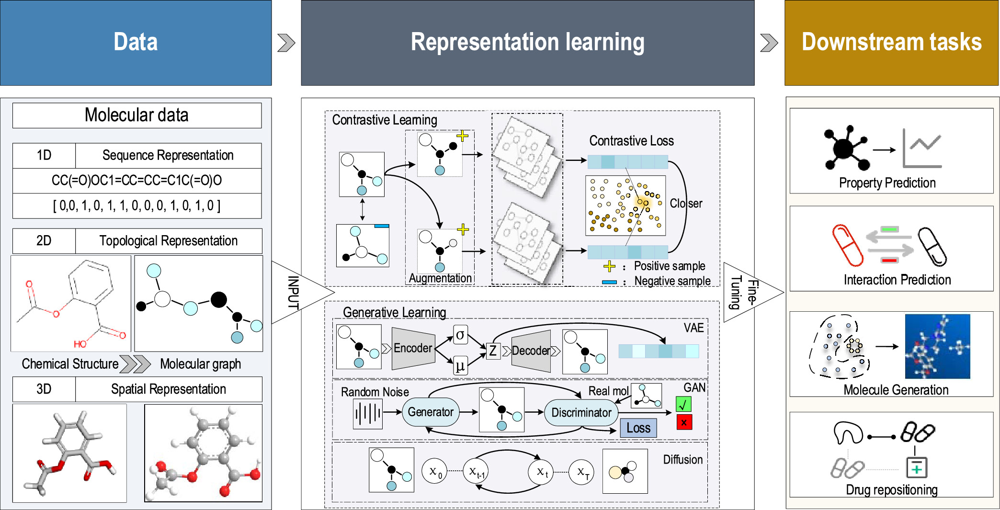
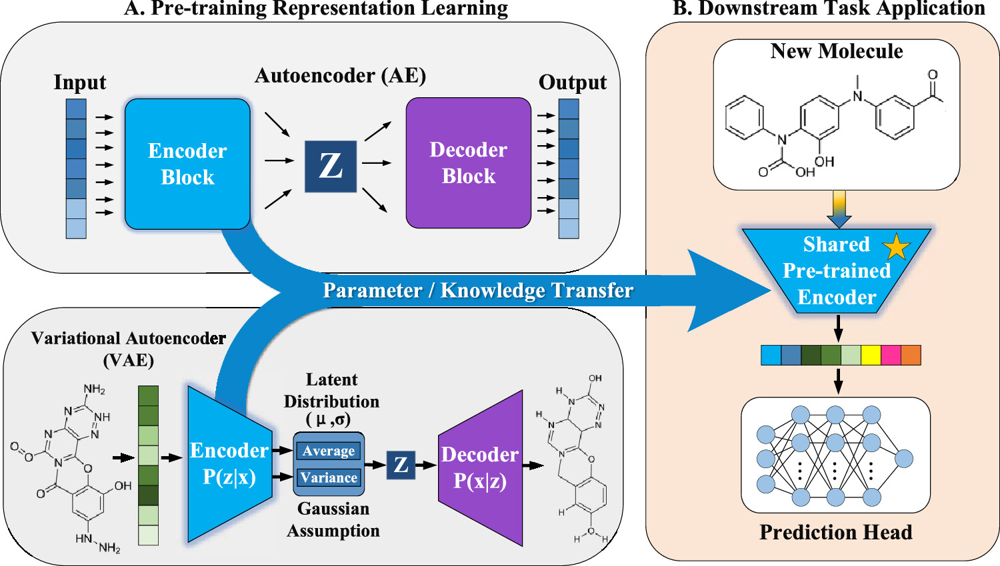
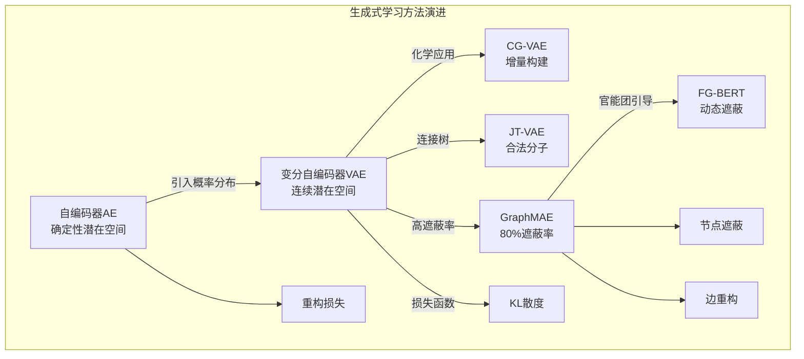
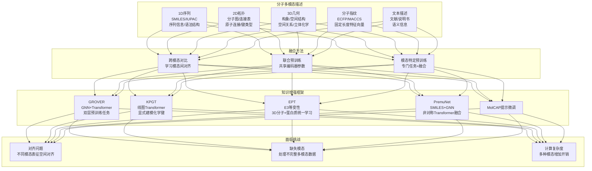
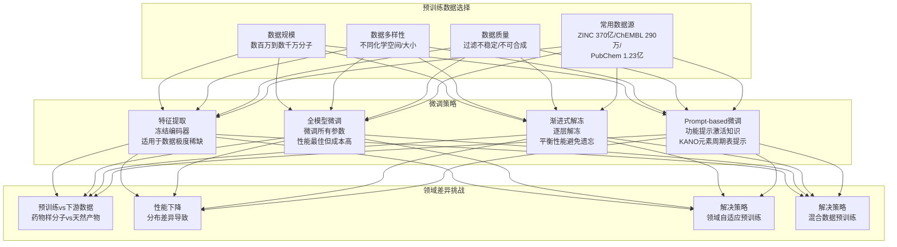
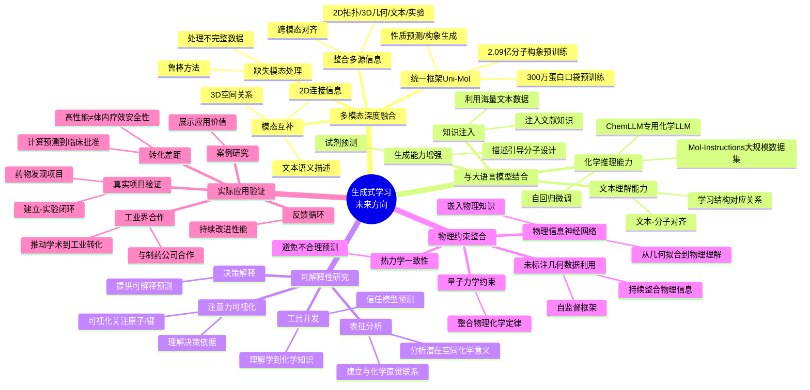

# 从分子重构到药物发现，生成式学习如何改变自监督表征？

## 本文信息

- **标题**：小分子表征学习中对比与生成式自监督方法的综合评述
- **作者**：Zengqian Deng, Dongjiang Niu, Zhen Wang, Zhen Li
- **发表期刊**：*Journal of Chemical Information and Modeling*
- **发表时间**：2026年（Received February 20, 2026; Revised April 29, 2026）
- **DOI**：https://doi.org/10.1021/acs.jcim.6c00547
- **单位**：青岛大学计算机科学与技术学院、中国海洋大学计算机科学与技术学院
- **引用格式**：Deng, Z., Niu, D., Wang, Z., & Li, Z. (2026). Comprehensive review of contrastive and generative self-supervised learning for small molecular representation. *Journal of Chemical Information and Modeling*. https://doi.org/10.1021/acs.jcim.6c00547

## 摘要

> **药物发现是一个复杂且资源密集的过程**，开发有效的计算工具来分析海量且异质的分子数据至关重要。在此背景下，**对比学习**和**生成式学习**已成为分子表征学习的两大基础范式，推动了显著进展。这些方法的核心在于**通过利用多种数据模态高效学习信息密集的嵌入**，从分子的内在1D、2D和3D结构到其在复杂生物网络中的外在背景。所得表征为**分子性质预测（MPP）、相互作用分析和药物设计**等广泛的下游应用提供了鲁棒特征。本文第二部分深入剖析**生成式学习**的应用原理与实践。与对比学习不同，生成式学习通过**重构分子图或预测masked部分**来学习表征，避免了负样本构造的难题。文章系统梳理了从**自编码器（AE）**到**变分自编码器（VAE）**、从**图重构**到**masked预测**的技术演进，全面解析GraphMAE、MoleculeBERT、FG-BERT等代表性方法的创新之处。同时，文章探讨了**三维几何信息整合**、**多模态融合**、**预训练-微调范式**等前沿方向，并对该领域的**评估标准化**、**可解释性**、**实际应用**等挑战进行了批判性分析。

### 核心结论

- **生成式学习核心假设**：能够准确重构或预测分子结构的模型，必然捕获了分子的关键特征。与对比学习不同，生成式学习不需要构造负样本对，避免了false negative问题
- **Masked预测是关键技术**：GraphMAE通过高遮蔽率（高达80%）强制模型学习分子的潜在结构模式，在MoleculeNet上达到72.8%的准确率
- **多粒度遮蔽提升性能**：FG-BERT通过整合官能团知识，采用基于节点局部环境的动态遮蔽技术，达到74.0%的准确率，超过GraphMAE
- **三维信息整合是趋势**：三维图神经网络（如SchNet、DimeNet）能够捕获原子的空间关系，提升相互作用预测精度
- **多模态融合增强鲁棒性**：整合二维拓扑、三维几何、序列等多种模态信息，通过跨模态对比学习对齐表征空间

## 生成式学习核心原理

### 基本思想

**图3：自监督分子表征学习的综合流程。**
- **左图**：多模态分子数据输入，包括一维序列、二维拓扑图和三维空间构象
- **中图**：表征学习由对比学习和生成式学习驱动，对比学习通过增强优化鲁棒嵌入，生成式学习通过重构建模数据分布
- **右图**：下游应用包括通过微调预训练特征实现的性质预测和药物重定位

> 这张图展示了自监督分子表征学习的完整pipeline，说明了如何从多模态数据输入到最终下游应用的全过程。

生成式学习采用与对比学习不同的范式：它**不直接对比样本，而是通过重构输入或预测masked部分来学习分子表征**。

> **生成式学习的核心假设**：能够准确重构或预测分子结构的模型，必然捕获了分子的关键特征。与对比学习不同，生成式学习不需要构造正负样本对，而是通过重构任务直接学习分子表征。这种方法的优势在于**不需要负样本**，避免了false negative问题。

### 编码器-解码器架构

生成式学习通常采用**编码器-解码器**结构：编码器将分子映射到潜在表示常用GNN、Transformer等，解码器从潜在表示重构分子可以是图解码器或序列解码器。

> **关键设计挑战**：如何设计解码器是一个核心问题。简单的解码器可能无法捕获复杂的分子结构，而复杂的解码器又可能导致预训练任务过于简单学不到有用的表征。需要在模型复杂度和任务难度之间找到平衡点。

### 生成式vs对比式学习

| 方面 | 对比学习 | 生成式学习 |
| --- | --- | --- |
| **核心思想** | 拉近正样本，推远负样本 | 重构输入或预测masked部分 |
| **优势** | 学习判别性表征 | 避免false negative问题 |
| **挑战** | 负样本构造困难 | 解码器设计复杂 |
| **适用场景** | 需要强判别性的任务 | 需要理解结构的任务 |

## 自编码器与变分自编码器

### 自编码器（AE）

> **自编码器的基本思想**：是最简单的生成式架构，包含编码器和解码器两部分。标准的AE将离散分子压缩为确定性潜在向量Z，通过编码器网络和解码器网络重构分子。AE的损失函数通常为重构损失，即输入与重构之间的差异。

**AE的局限性**：潜在空间不规则导致确定性编码使得潜在空间可能不连续难以采样，过拟合风险可能简单地记忆训练数据而不是学习通用特征，生成能力有限难以生成新的合理的分子。

### 变分自编码器（VAE）

> **变分自编码器的关键创新**：通过引入概率分布解决了AE的局限性。VAE的编码器将输入映射到由均值和方差定义的连续高斯分布，从正则化空间采样后解码器既重构原始输入又通过插值生成新结构。

**图5：AE和VAE的分子特征提取和跨任务知识转移示意图。**

- **图5A**：标准AE将离散分子压缩为确定性潜在向量Z；VAE编码器将输入映射到由均值和方差定义的连续高斯分布，从正则化空间采样使VAE解码器既能重构原始输入又能通过插值生成新结构
- **图5B**：预训练编码器提取新分子的低维嵌入，任务特定的预测头使用这些嵌入预测分子性质或生物活性

这张图清晰地展示了VAE通过引入概率分布解决了AE的潜在空间不规则问题，以及预训练-微调范式的完整流程。

> **VAE的优势**：损失函数包含重构损失和KL散度两项，其中重构损失衡量重构质量，KL散度正则化潜在空间。VAE的优势包括正则化潜在空间使得潜在空间连续且平滑便于采样，生成能力强可以通过采样生成新的合理的分子，插值能力可以在潜在空间中进行插值探索分子空间。

专门为化学应用开发的VAE包括：
- **CG-VAE**：增量构建分子确保化学合理性。该框架标志着分子生成从无约束图生成到规则感知图构建的重大转变，集成了门控图神经网络编码器和顺序解码器。它逐步构建分子图同时在每一步确保化学有效性，导致更结构和可解释的潜在空间
- **JT-VAE**：基于连接树的VAE生成更有效的分子。为克服SMILES表征导致的缺乏化学合法性和潜在空间不连续的问题，该方法引入连接树结构，将分子图分解为化学上有意义的子图簇，实现复杂拓扑结构的准确建模同时确保100%合法性。这是基于原始的模型如层次和片段级表征的始祖
- **MolVAE**：结合化学先验知识提升生成质量，专注于解开与分子性质相关的潜在因子

> **VAE的化学创新**：这些方法将通用VAE框架与化学领域知识深度结合，从规则感知的分子构建（CG-VAE）到层次化片段表征（JT-VAE），在确保化学合理性的同时提升了潜在空间的结构性和可解释性。

## Masked图自编码器

Masked图自编码器是生成式学习的重要分支，下图展示了主要方法的技术路线：

这些方法通过不同的技术路线，共同推动了生成式学习在分子表征中的应用。

### GraphMAE：开创性工作

**GraphMAE**（2022）是将masked自编码器框架成功应用于图结构的代表性工作。它探索了在图上进行遮蔽和重构时遇到的挑战，如同时重构节点特征和网络结构。

> **GraphMAE的核心创新**：通过高遮蔽率强制模型学习潜在结构而不是记忆表面特征。

- **高遮蔽率**：随机遮蔽分子图中的大量节点高达**80%**，强制模型学习潜在结构模式而不是记忆表面特征
- **同时重构**：同时重构节点特征和网络结构，使用GNN作为编码器和解码器共享权重
- **遮蔽策略**：节点特征遮蔽随机遮蔽节点的特征向量、边连接遮蔽随机遮蔽图的边连接

重构目标包括节点特征重构损失和边连接重构损失，其中$\lambda$是平衡参数。在**MoleculeNet的多个分子性质预测任务上，GraphMAE达到72.8%的平均准确率**，显著优于传统自编码器和无监督方法，在小样本场景下优势明显。

### FG-BERT：功能感知的改进

**FG-BERT**在GraphMAE的基础上进行了改进，整合了官能团知识。

> **FG-BERT的核心创新**：通过官能团知识引导的动态遮蔽技术，实现多粒度遮蔽以捕获复杂的化学功能语义。
- **动态遮蔽技术**：基于节点局部环境的遮蔽策略，根据每个原子周围的化学环境确定遮蔽概率
- **官能团知识整合**：利用化学知识指导遮蔽过程，首先识别分子中的官能团
- **多粒度遮蔽**：同时考虑原子级和官能团级的信息，同时遮蔽原子和官能团

FG-BERT提出了基于局部环境的动态遮蔽：首先识别分子中的官能团，然后分析每个原子周围的化学环境，根据局部环境确定遮蔽概率，最后同时遮蔽原子和官能团进行多粒度遮蔽。

在多个任务上达到**74.0%的准确率**超过了GraphMAE的72.8%，说明多粒度遮蔽的重要性捕获复杂的化学功能语义，化学知识的价值领域知识显著提升性能，动态策略的优势自适应遮蔽比固定遮蔽更有效。

### SMILES-BERT与ChemBERTa：序列化预训练

受NLP领域BERT成功的启发，多个研究工作将masked语言建模方法应用于化学领域。**SMILES-BERT**和**ChemBERTa**在大规模SMILES数据上使用masked token恢复任务进行预训练，通过预测随机遮蔽的token来学习深度的双向分子表征。

这些方法的核心思想是将分子图转换为SMILES字符串序列，然后使用BERT风格的预训练。然而，SMILES语法存在局限性，如不同的SMILES生成策略会产生不同的序列，可能导致序列表示丢失图的拓扑结构信息。

为了解决SMILES语法的问题，**SELFFormer**利用self-supervised equivariant框架来更好地捕获分子的几何和拓扑特征。

> **序列化方法的权衡**：优势包括实现简单可以直接使用预训练的BERT模型，计算效率高序列处理比图处理更高效，预训练资源丰富可以利用大量NLP预训练模型。局限包括丢失空间信息SMILES序列不能完全捕获三维空间信息，序列依赖性不同的SMILES生成策略产生不同的序列，化学语义丢失序列表示可能丢失图的拓扑结构信息。

## 三维几何信息与多模态融合

### 三维几何数据库

**分子的三维几何构象对其性质和功能至关重要**。为了支持三维感知的模型训练，多个专注于分子构象的数据库被开发出来：

- **GEOM数据库**：专注于分子构象，提供分子的3D几何信息。包含超过3700万个分子构象，覆盖超过45万个分子，提供与分子能量值和统计权重相关的几何信息，还包括密度泛函理论计算的能量
- **PDBbind数据库**：来源于PDB，是实验测定结合亲和力的综合集合，为基于结构的药物设计提供关键指导
- **QM9数据库**：提供量子力学性质的小分子数据集，用于验证和基准测试分子表征学习方法

这些三维几何数据使深度学习模型能够**超越2D拓扑特征**，**捕获基于结构的药物设计所需的精确物理约束和几何依赖性**。

### 三维图神经网络

**三维图神经网络能够处理分子的空间结构**。常用的三维图神经网络包括SchNet使用连续滤波卷积处理三维坐标，DimeNet考虑方向信息的消息传递网络，SphereNet基于球面坐标的消息传递网络。

整合三维信息带来的优势包括**更精确的相互作用预测**药物-靶标相互作用高度依赖三维互补性，**构象敏感性**能够区分不同构象的差异，**物理化学性质预测**如溶解度渗透性等与三维形状相关。

然而三维方法的引入也带来了新的挑战：**计算成本**三维结构的生成和处理比二维图更耗时，**构象不确定性**同一分子可能存在多个合理构象，**数据可用性**高质量的三维结构数据相对稀缺。

### 多模态融合策略

**分子可以用多种方式描述**，每种描述都提供了互补的信息。通过显式地最大化1D、2D和3D模态之间的互信息，**产生不变的表征**，**自然补偿纯拓扑描述符中固有的几何盲点**。

### 预训练-微调范式

自监督学习的成功依赖于预训练-微调范式：先在大规模无标注数据上预训练，然后在下游任务上微调。

## 关键结论与未来方向

### 主要发现

通过系统梳理生成式学习和自监督学习在小分子表征中的应用，我们得出以下核心结论：

- **生成式学习避免了false negative问题**：不需要构造负样本对，通过重构任务直接学习表征
- **Masked预测是关键技术**：高遮蔽率强制模型学习潜在结构，GraphMAE和FG-BERT证明了这一点
- **三维信息整合带来性能提升**：尤其是在需要精确空间理解的任务上
- **多模态融合增强鲁棒性**：整合多种模态信息可以学习更全面的表征
- **预训练-微调范式是标准流程**：在大规模无标注数据上预训练，然后在下游任务上微调

### 局限性与挑战

尽管取得了显著进展，该领域仍面临诸多挑战。

在**评估偏差**方面：
- **数据泄露问题**：许多研究可能存在数据泄露问题，**预训练和测试集包含相似分子**
- **实验设置差异**：不同研究的实验设置差异很大难以直接对比，**需要更统一的评估协议和基准**
- **标准化基准**：MOSES是从ZINC数据库精炼出的基准数据集，包含190万个分子结构，提出分子生成的评估指数以评估模型生成以前未见过的骨架的能力，旨在标准化研究并促进模型之间的比较

在**可解释性**方面：
- **黑箱问题**：深度学习模型通常是黑箱，**难以解释学到了什么化学知识**
- **工具开发**：需要开发工具和框架帮助理解模型决策，建立模型决策与化学直觉的联系
- **表征分析**：需要分析潜在空间的化学意义，理解模型预测的依据

在**领域适应**方面：
- **分布外性能下降**：预训练模型在分布外数据上性能下降明显，**限制了在真实药物发现场景中的应用**
- **预训练数据差异**：如果预训练数据如药物样分子与下游数据如天然产物分布差异大，性能可能显著下降
- **解决策略**：包括领域自适应预训练在目标领域数据上继续预训练，混合数据预训练预训练时包含多个领域的数据

在**计算成本**方面：
- **资源需求高**：大规模预训练需要大量计算资源，对许多研究实验室来说是障碍
- **3D几何成本**：在生物活性严格由立体化学驱动的场景中，3D几何深度学习变得不可或缺，尽管计算成本更高
- **权衡选择**：对于需要零样本推理或解释复杂化学指令的泛化任务，大规模多模态方法可能更合适

在**可解释性**方面，深度学习模型通常是黑箱，难以解释学到了什么化学知识，需要开发工具和框架帮助理解模型决策，建立模型决策与化学直觉的联系。需要开发注意力可视化来可视化模型关注的原子和键、表征分析来分析潜在空间的化学意义、决策解释来解释模型预测的依据。

在**领域适应**方面，预训练模型在分布外数据上性能下降明显，限制了在真实药物发现场景中的应用。如果预训练数据如药物样分子与下游数据如天然产物分布差异大，性能可能显著下降。解决策略包括领域自适应预训练在目标领域数据上继续预训练，混合数据预训练预训练时包含多个领域的数据。

在**计算成本**方面，大规模预训练需要大量计算资源，对许多研究实验室来说是障碍。在生物活性严格由立体化学驱动的场景中，如蛋白-配体结合亲和力预测，3D几何深度学习变得不可或缺，尽管计算成本更高。然而，对于需要零样本推理或解释复杂化学指令的泛化任务，大规模多模态方法可能更合适。

### 未来方向

## 结语

> 自监督学习为小分子表征学习带来了革命性变化。对比学习和生成式学习两种范式各有所长，共同推动了该领域的发展。通过设计巧妙的预训练任务、合理的增强策略、强大的架构，我们能够从海量无标注分子数据中学习丰富的化学知识，然后迁移到下游药物发现任务中。

然而，该领域仍处于早期阶段，许多挑战尚未解决。特别是可解释性、领域适应、评估标准化等问题需要深入研究。未来的突破可能来自于多模态融合、与大语言模型结合、物理约束整合等方向。

对于药物发现实践者而言，现在是开始采用自监督学习方法的时机。通过利用开源的预训练模型和工具，可以显著提升分子性质预测、虚拟筛选等任务的性能。但同时也要保持批判性思维，理解方法的局限性，谨慎解读结果。

最终，自监督学习的成功不仅在于提升性能数字，更在于帮助我们从数据驱动的角度理解化学，发现新的化学规律，加速药物发现进程。这正是AI与科学交叉研究的核心价值所在。