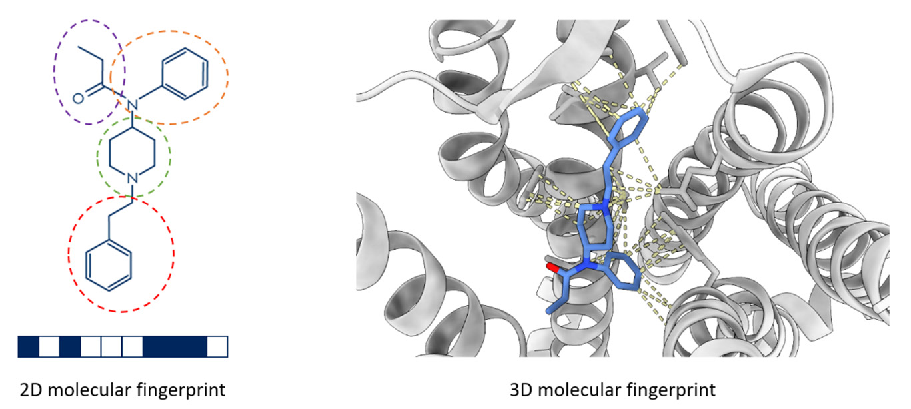
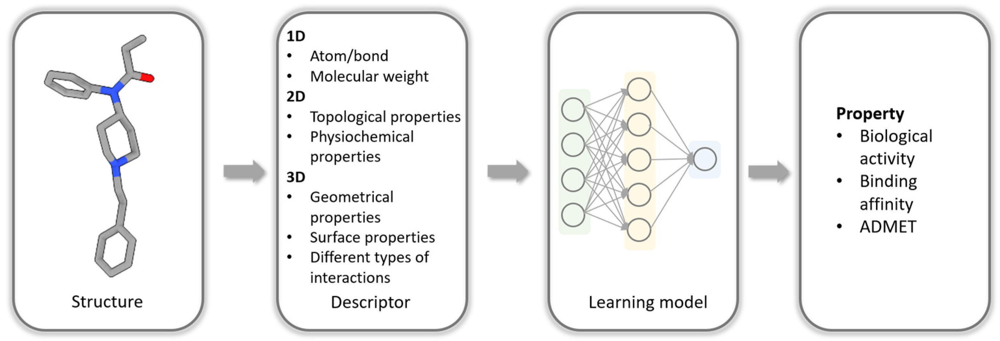
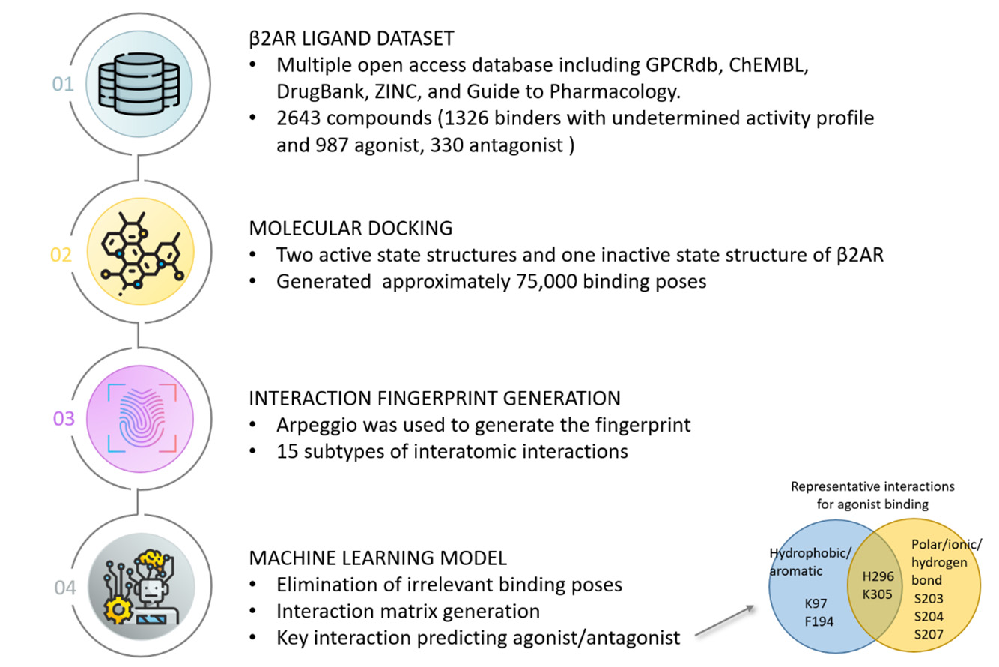
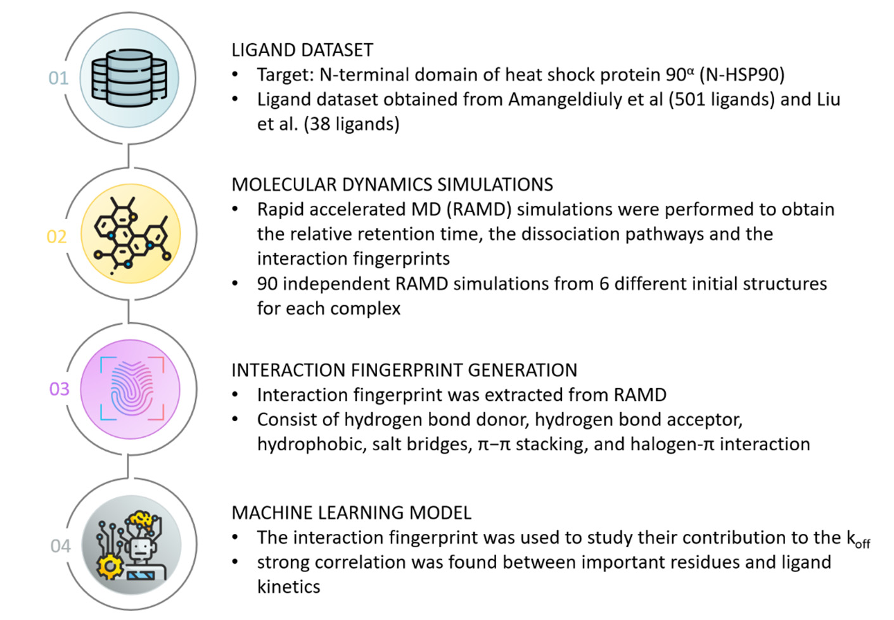
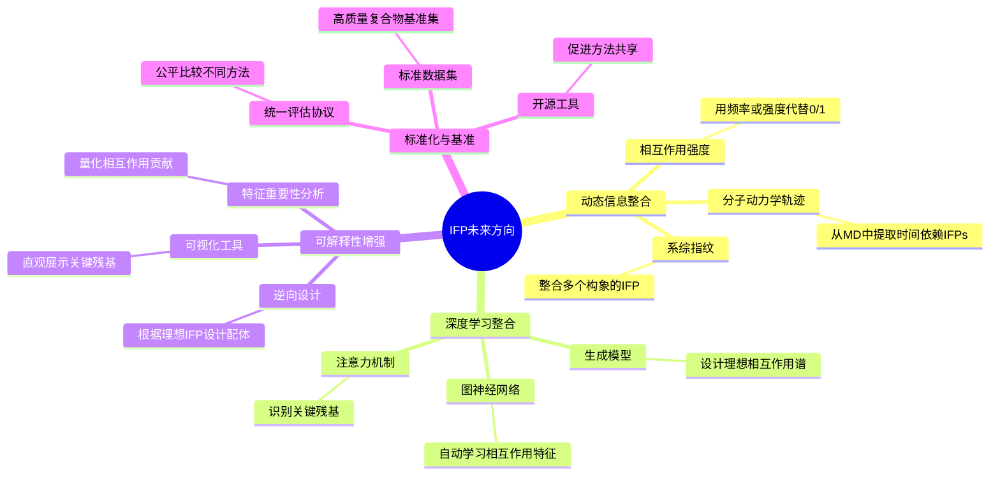

# 从分子指纹到相互作用指纹：让机器学习更好地理解蛋白-配体识别

## 本文信息
- 标题：Fingerprinting Interactions between Proteins and Ligands for Facilitating Machine Learning in Drug Discovery
- 作者：Zoe Li, Ruili Huang, Menghang Xia, Tucker A. Patterson, Huixiao Hong
- 发表期刊：Biomolecules
- 发表时间：2024年1月5日
- DOI：https://doi.org/10.3390/biom14010072
- 单位：
  - National Center for Toxicological Research, US Food and Drug Administration, USA（美国食品药品监督管理局毒理学研究中心）
  - National Center for Advancing Translational Sciences, National Institutes of Health, USA（美国国家卫生研究院国家转化科学促进中心）
- 引用格式：Li, Z.; Huang, R.; Xia, M.; Patterson, T.A.; Hong, H. Fingerprinting Interactions between Proteins and Ligands for Facilitating Machine Learning in Drug Discovery. *Biomolecules* 2024, *14*, 72. https://doi.org/10.3390/biom14010072

## 摘要
> 分子识别是生物学的基本过程，通过特定的**蛋白-配体相互作用**支撑复杂生命活动。理解这一过程对药物发现至关重要，然而传统实验方法在探索广阔化学空间时面临局限。计算方法，特别是**定量结构-活性/性质关系分析**，已得到广泛应用。**分子指纹**编码分子结构并作为性质谱图，在药物发现中不可或缺。虽然**二维指纹**常用，但**三维结构相互作用指纹**能提供针对特定靶点蛋白的结构特征。在相互作用指纹上训练的机器学习模型能够实现更精细的结合预测。近期研究焦点已转向基于结构的预测建模，机器学习评分函数也受益于关键相互作用指导的特征工程。本文回顾了已发展的结构相互作用指纹，并给出两个案例：第一个案例解析β2肾上腺素能受体配体的结构-活性关系，展示区分激动剂和拮抗剂的能力；第二个案例使用基于逆合成预训练的分子表示预测蛋白-配体解离速率，并结合相互作用指纹解释结合动力学。尽管进展明显，复杂机器学习模型的解释性、结合位点可塑性和诱导契合效应仍是重要挑战。

### 核心结论

- 相互作用指纹是连接结构数据与机器学习的桥梁：它把蛋白-配体复合物中的**相互作用模式编码为向量或矩阵**，便于后续建模。
- 机器学习评分函数的进展与特征工程密切相关：氢键、疏水接触、盐桥、π堆积和π-阳离子相互作用等特征，能把结构信息转化为可学习信号。
- 本文重点不是提出新算法，而是综述SIFt、PyPLIF、Triplet IFP、APIF、SILIRID、SPLIF、PLECFP等结构相互作用指纹，并列出现有软件。
- 两个案例分别对应**β2AR激动剂/拮抗剂分类**和**HSP90抑制剂解离速率预测**，说明IFP既可服务结构-活性关系，也可辅助解释结合动力学。
- 当前挑战集中在结构依赖、能量项不足、复杂模型解释性、结合位点可塑性、诱导契合，以及对已知蛋白-配体相互作用数据的依赖。

---

## 背景

### 分子识别与药物发现

药物发现的核心挑战之一是**从海量的化学空间中找到能够与特定靶点蛋白有效结合的分子**。传统方法依赖实验筛选，但成本高、周期长。计算方法，特别是基于结构的药物设计（SBDD），通过模拟蛋白-配体相互作用来加速这一过程。

**分子指纹**是计算化学的基础工具。它将分子结构编码为固定长度的**位向量或数值向量**，使计算机能够“理解”化学结构。常见的**二维指纹**（如ECFP4、MACCS）基于分子拓扑结构，已广泛应用于**相似性搜索**、**分类建模**和**虚拟筛选**。

然而，二维指纹有一个根本局限：**它不包含蛋白靶点的信息**。同一个配体对不同蛋白可能有完全不同的结合模式，但二维指纹无法区分这一点。

#### 二维指纹 vs 三维相互作用指纹对比

| 特性 | 二维指纹（2D） | 三维相互作用指纹（IFP） |
| --- | --- | --- |
| **输入信息** | 仅配体结构（拓扑、原子类型） | 蛋白-配体复合物三维结构 |
| **靶点特异性** | 无（同一配体对所有靶点相同） | 有（针对特定靶点的相互作用模式） |
| **编码内容** | 分子连接性、子结构模式 | 相互作用类型、空间位置 |
| **典型代表** | ECFP4、MACCS、Daylight | SIFt、PLIP、PLECFP |
| **优势** | 计算快速，数据易得，适用广谱预测 | 包含蛋白环境，能描述靶点特异相互作用 |
| **局限** | 忽略蛋白环境，无法解释结合机制 | 依赖结构质量，计算成本较高 |
| **适用场景** | 大规模虚拟筛选、QSAR建模 | 精确结合预测、靶点特异性优化 |

**图2：二维分子指纹与三维分子指纹示意图**。左侧展示仅由小分子二维结构生成的分子指纹，不同颜色的虚线圆圈表示记录在位字符串中的不同结构特征。右侧展示三维结构指纹，小分子以棒状模型表示，蛋白以灰色带状模型表示，小分子与蛋白之间的相互作用用黄色虚线标示。

### 三维相互作用指纹的崛起

**相互作用指纹**（Interaction Fingerprints, IFPs）正是为了解决这一问题而诞生的。它的核心思想是：

> **将蛋白-配体复合物的三维结构转化为一个特征向量，记录特定类型的相互作用发生在哪里**

与二维指纹不同，IFPs是**靶点特异性的**。它不仅描述配体，还描述配体与特定蛋白的相互作用模式。这使得基于IFPs的机器学习模型能够学习到“什么样的相互作用模式会导致强结合”。

### 关键科学问题

本文旨在回答以下核心问题：

1. 如何有效编码蛋白-配体相互作用？**哪些相互作用类型最重要**？**如何将三维结构信息转化为固定长度的特征向量**？

2. IFPs在机器学习中的表现如何？**与传统评分函数相比，基于IFPs的ML模型在结合亲和力预测和虚拟筛选中是否有优势**？

3. 不同IFP方法有何特点？**SIFt、PLIP、PLECFP等主流方法的设计理念、优势和适用场景分别是什么**？

4. 当前挑战和未来方向是什么？**IFPs在特征工程、标准化、可解释性方面仍面临哪些挑战**？

---

## 研究内容

### 相互作用指纹的核心思想

IFPs的本质是**将三维结构信息映射到一维特征空间**。具体而言，它记录配体与蛋白残基之间发生了哪些类型的相互作用。

#### 相互作用类型

| 相互作用类型 | 英文名称 | 强度/特点 | 在结合中的作用 |
| --- | --- | --- | --- |
| **氢键** | Hydrogen bonds | 方向性相互作用 | 本文多次将其作为特征工程中的关键相互作用类型 |
| **π-π堆积** | π-π stacking | 芳香环之间的堆积作用 | 可由SPLIF等方法在三维片段描述中隐式捕捉 |
| **π-阳离子相互作用** | π-cation | 正电荷与芳香体系之间的相互作用 | Marcou-Rognan扩展版本可纳入此类较少见相互作用 |
| **疏水接触** | Hydrophobic contacts | 非极性区域接触 | 本文将其列为构建机器学习评分函数时常用的生物相关相互作用 |
| **卤键** | Halogen bonds | 卤素相关方向性相互作用 | SIFt和PyPLIF等类型表中列为可编码相互作用 |

#### 编码方式

大多数IFP采用**二进制编码**：对于每个蛋白残基，如果与配体发生了某种类型的相互作用，则对应位置设为1，否则为0。这样，一个蛋白-配体复合物就被表示为一个**高维稀疏二进制向量**。

| 编码方式 | 特点 | 优势 | 局限 | 代表方法 |
| --- | --- | --- | --- | --- |
| **二进制编码** | 相互作用发生则为1，否则为0 | **简单高效，易于计算，适合大规模筛选** | 信息损失，无法区分强弱相互作用 | SIFt、PLIP |
| **整数或哈希编码** | 用整数标识相互作用片段、原子对环境或伪原子几何 | **能保留更多局部结构信息** | 解释性可能低于残基位串 | Triplet IFP、SPLIF、PLECFP |
| **矩阵或向量表示** | IFP可存储为Boolean、integer或floating-point number的向量或矩阵 | **形式灵活，便于机器学习处理** | 不同方法之间标准不统一 | APIF、SILIRID等 |

**图1：使用机器学习预测分子性质的典型工作流**。分子结构首先被转化为可计算的描述符或指纹，然后输入机器学习模型，用于性质预测、活性建模或后续筛选。这里要注意，本文图1并不是具体的蛋白-配体相互作用指纹示意图，而是分子指纹进入机器学习模型的一般流程。

### 主流IFP方法

#### SIFt：结构相互作用指纹的先驱

**SIFt**（Structural Interaction Fingerprint）是最早提出的IFP方法之一，由Deng等人在2004年开发。它的核心特点：

- 基于预定义的相互作用类型：原始SIFt为每个相互作用氨基酸使用**7位编码**，覆盖backbone、sidechain、polar、hydrophobic以及H-bond donor/acceptor等信息
- 残基中心编码：每个蛋白残基对应一组特征位，记录与配体的相互作用
- 扩展版本：Mordalski等后来增加两位，用于编码**芳香相互作用和带电相互作用**

SIFt的优势在于**简单直观**，易于理解和实现。本文强调它曾用于识别serotonin 5-HT7 receptor同源模型中与拮抗剂相互作用的关键氨基酸。

> **SIFt的核心创新**：将三维结构信息转化为固定长度的特征向量，使得不同复合物可以在同一特征空间进行比较和机器学习。

#### PLIP：蛋白-配体相互作用 profiler

**PLIP**（Protein-Ligand Interaction Profiler）是一个更现代化的工具，由Salentin等人开发。它的特点：

- 可作为**结构相互作用指纹计算软件**使用，本文表2列出其输入对象可覆盖ligand、protein、DNA和RNA之间的组合
- 输入格式为PDB，本文表2未标注其支持MD trajectory analysis
- 它适合自动化识别蛋白-配体相互作用并集成到结构分析流程中

PLIP的一个关键优势是**自动化和可复现**：对于需要批量处理结构复合物的任务，它比人工检查相互作用更适合进入机器学习特征生成流程。

#### PLECFP：蛋白-配体扩展连接指纹

**PLECFP**（Protein-Ligand Extended Connectivity Fingerprint）是一种基于ECFP概念的IFP方法，由Wójcikowski等人开发。它的特点：

- 基于原子环境：识别接触原子对并描述每个原子在指定键深度内的邻域
- 环境配对：将配体和受体的环境配对，通过哈希位位置创建最终折叠指纹
- 隐式包含多种相互作用类型：在3D结构描述中隐式包含氢键、π-π堆积等

PLECFP的优势在于在结合亲和力预测任务上表现优异，Pearson相关系数在基准数据集上超过0.8，适用于先导化合物优化和scaffold hopping。

#### 其他代表性方法

- **SPLIF**（Spatial Protein-Ligand Interaction Fingerprint）：基于空间位置的蛋白-配体相互作用指纹，使用配体和蛋白原子间的ECFP环境
- **SILIRID**（Specific Interaction by LIGand Recognition ID）：基于特定原子对和相互作用的指纹
- **APIF**（All-purpose Interaction Fingerprints）：通用相互作用指纹，适用于各种蛋白-配体复合物
- **Arpeggio、fingeRNAt、getContacts、Ichem、LUNA、MD-IFP、ODDT、ProLIF、PyPLIF HIPPOS和Schrodinger IFP**：本文表2列出这些工具或软件，可用于不同输入格式、复合物类型或MD轨迹场景下的相互作用指纹计算

#### 主流IFP方法对比

| 方法 | 文献/来源 | 核心特点 | 编码方式 | 本文强调的用途或特点 |
| --- | --- | --- | --- | --- |
| **SIFt** | Deng等，2004；Mordalski等扩展 | 每个相互作用氨基酸用**7位编码**，Mordalski扩展版增加芳香和带电相互作用 | 每个残基7位或扩展位串 | 用于分析三维蛋白-配体复合物，并识别同源模型中与拮抗剂相互作用的关键氨基酸 |
| **Marcou-Rognan IFP** | Marcou和Rognan，2006；Rognan组后续11位版本 | 7位版本编码疏水、芳香face-to-face/edge-to-face、氢键donor/acceptor、阳离子/阴离子相互作用；后续版本为每个氨基酸定义**11位子串** | 一维二进制IFP字符串 | 几何定义可定制，可纳入弱氢键、cation-π和金属络合等较少见相互作用 |
| **Triplet IFP** | Desaphy等，2013 | 用两个相互作用原子和一个相互作用伪原子描述相互作用，伪原子可放在相互作用中心、蛋白原子附近或配体原子附近 | 210个整数 | 主要用于结合位点比较，也可用于对接结果后处理 |
| **PyPLIF** | Radifar等，2013 | 将对接得到的三维相互作用数据转换为一维位串，并用Tanimoto系数与参考配体指纹比较 | 每个残基7位 | 通过按IFP相似性选择top docking pose，提高虚拟筛选中真实结合物识别 |
| **APIF** | Pérez-Nueno等，2009 | 考虑配体和蛋白相互作用原子对的相对位置与相互作用类型，避免依赖结合位点绝对大小 | 294位固定长度二进制指纹 | 提供binding-site-size-independent的紧凑表示，但缺少残基特异IFP的直观解释性 |
| **SILIRID** | Chupakhin等，2013 | 按氨基酸类型合并残基特异IFP，覆盖疏水、芳香、氢键、离子键和金属离子相互作用 | 168个整数 | 适合不同大小结合位点的alignment-free描述 |
| **SPLIF** | Da和Kireev，2014 | 用ECFP2表示相互作用的配体和蛋白片段，并比较对接构象与参考复合物的匹配片段 | 长度取决于相互作用片段数量 | 能隐式包含π-π堆积等相互作用模式，但会损失部分精确几何细节 |
| **PLECFP** | Wójcikowski等，2019 | 配对并哈希相互作用配体原子和蛋白原子的ECFP环境 | raw folded fingerprint由0到$2^{32}$之间的整数构成 | 在结合亲和力预测基准中Pearson相关系数超过0.8，优于SILIRID和SPLIF |

### IFPs在机器学习中的应用

#### 结合亲和力预测

预测配体与蛋白的结合亲和力是药物发现的核心任务。常用指标包括$K_D$、$IC_{50}$、$\Delta G$。基于IFPs的ML模型在这一任务上表现出色。

##### 典型工作流程

1. **结构准备**：获取蛋白-配体复合物的三维结构（X射线、NMR或分子对接）
2. **相互作用指纹生成**：使用PLIP、SIFt等工具提取IFP特征
3. **特征工程**：可能包括特征选择、降维（PCA）、组合特征等
4. **模型训练**：使用随机森林、SVM、神经网络等ML算法训练回归模型
5. **验证**：交叉验证、独立测试集评估

##### 性能对比

本文更谨慎的表述是：近年来机器学习评分函数在scoring任务中表现突出，并且相较经典评分函数有优势；IFPs作为结构特征工程的一类输入，能帮助模型更好地利用蛋白-配体相互作用信息。原因包括：

- 数据驱动：ML模型从真实数据中学习，而非依赖经验函数
- 特征工程：IFPs直接编码关键相互作用，比物理描述符更相关
- 非线性建模：ML能捕捉复杂的非线性关系

#### 结构-活性关系与虚拟筛选

虚拟筛选是从大量化合物中筛选出潜在活性分子的过程。IFPs在这一任务中也展现出优势：

- 富集因子高：基于IFPs的模型能在早期识别更多活性分子
- 靶点特异性：模型针对特定靶点训练，而非通用评分
- 可解释性：可以通过分析特征权重了解哪些相互作用重要

##### 案例研究1：β2AR激动剂与拮抗剂分类

Jimenez-Roses等的案例围绕**β2肾上腺素能受体**（β2AR）的结构-活性关系。研究者收集约2700个β2AR已知配体，对接到β2AR结构中生成约75,000个构象，并计算atomic interaction fingerprints作为机器学习输入，用于预测配体是激动剂还是拮抗剂。

模型识别出能区分两类药理活性的关键残基：激动剂更偏向与K97、F194、S203、S204、S207、H296和K305发生相互作用，而拮抗剂更偏向W286和Y316。这说明**对接构象中的结构相互作用指纹可以帮助解释配体周围微环境，并区分潜在生物活性**。

**图3：Jimenez-Roses等的案例研究**。工作流展示如何从对接构象中提取相互作用指纹，将其作为机器学习模型输入，以识别β2受体上决定配体药理活性的关键残基。

##### 案例研究2：HSP90抑制剂解离速率预测

第二个案例来自Zhou等，核心任务是预测蛋白-配体解离速率$k_{\mathrm{off}}$。该研究使用RPM（retrosynthesis-based pre-trained molecular representation）表示，通过逆合成反应数据预训练来编码分子反应性和官能团信息，再将RPM特征输入partial least squares regression模型，预测覆盖55个蛋白的501个抑制剂$k_{\mathrm{off}}$。

使用RPM的模型在该数据集上达到Pearson相关系数0.76，并在38个新的HSP90α N-terminal domain抑制剂上得到0.73的相关性。随后，研究结合加速分子动力学模拟，在解离轨迹上提取蛋白-配体IFPs，识别N51、S52和L107等影响解离过程的重要残基。这个案例的重点是**把预训练分子表示、机器学习、MD和IFP分析组合起来解释结合动力学**。

**图4：Zhou等的案例研究**。工作流展示如何从MD模拟中提取相互作用指纹，将其作为机器学习模型输入，以识别关键残基与配体动力学之间的相关性；该案例的配体数据集来自Amangeldiuly等和Liu等。

### IFPs的优势与局限

| 维度 | 优势 | 局限与挑战 |
| --- | --- | --- |
| **特异性** | 每个靶点有独特的相互作用模式，能捕捉靶点特异性 | 不同靶点需要重新训练模型，泛化性受限 |
| **可解释性** | 每个特征对应特定的相互作用类型，物理意义明确 | 某些复杂相互作用难以用简单特征表示 |
| **数据基础** | 基于三维结构，比2D指纹更接近真实结合环境 | 高度依赖结构质量，错误结构导致错误特征 |
| **灵活性** | 可针对不同靶点定制相互作用类型集 | 缺乏统一标准，不同方法的定义和阈值不一致 |
| **计算效率** | 二进制编码计算高效，适合大规模筛选 | 对大蛋白维度过高，需要降维策略 |
| **动态信息** | 可整合分子动力学轨迹捕捉构象变化 | 大多数基于静态结构，忽略诱导契合和构象异质性 |

## 关键结论与批判性总结

### 主要贡献

本文系统综述了**相互作用指纹在机器学习驱动的药物发现中的应用**，核心贡献包括：

- 全面梳理主流结构IFP方法：从SIFt、PyPLIF、Triplet IFP到APIF、SILIRID、SPLIF和PLECFP，清晰阐述各自编码逻辑。
- 汇总现有计算软件：本文列出Arpeggio、fingeRNAt、getContacts、Ichem、LUNA、MD-IFP、ODDT、PLIP、ProLIF、PyPLIF HIPPOS和Schrodinger等工具。
- 展示两个机器学习案例：β2AR配体激动剂/拮抗剂分类和HSP90抑制剂$k_{\mathrm{off}}$预测，分别对应结构-活性关系和结合动力学。
- 指出未来方向：混合指纹设计、深度学习、模型解释性增强，以及对结合位点可塑性和诱导契合效应的处理。

### 优势与亮点

- **靶点特异性**是IFPs的核心优势，使其能够捕捉特定蛋白-配体对的独特相互作用模式
- **物理意义明确**，每个特征对应可解释的相互作用类型
- **与ML天然契合**，将结构问题转化为可学习的特征问题

### 未来发展方向

### 本文强调的限制

- **结构依赖**：三维指纹依赖可获得的蛋白-配体复合物结构；虽然结构测定技术在进步，但没有结构时IFP方法仍受限。
- **能量项不足**：许多指纹主要记录相互作用模式，未充分纳入能全面表征蛋白-配体相互作用的能量项，深度学习评分函数可能部分缓解这一问题。
- **解释性仍是难点**：即使IFP本身较可解释，基于三维指纹构建的复杂机器学习模型仍需要拆解预测来源，找到真正驱动预测的关键相互作用。
- **静态结构不够完整**：结合位点可塑性和诱导契合效应会使静态结构指纹难以完整描述真实相互作用。
- **已知配体数据依赖**：两个案例中的靶点都有大量已知配体可用于训练；对于已知配体很少或没有的靶点，该策略适用性会下降。
