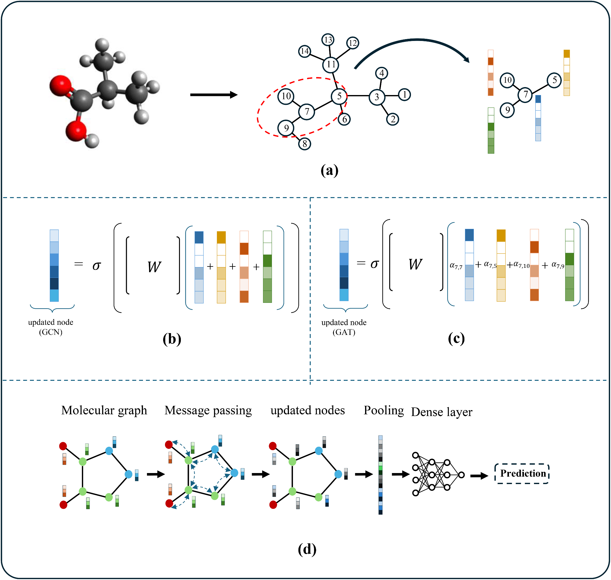
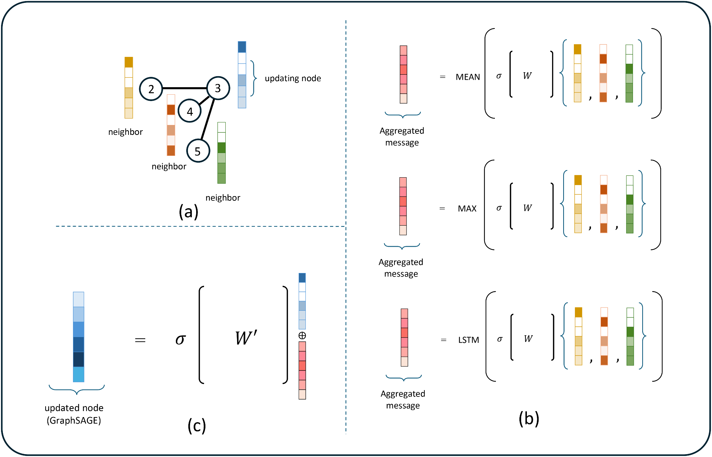
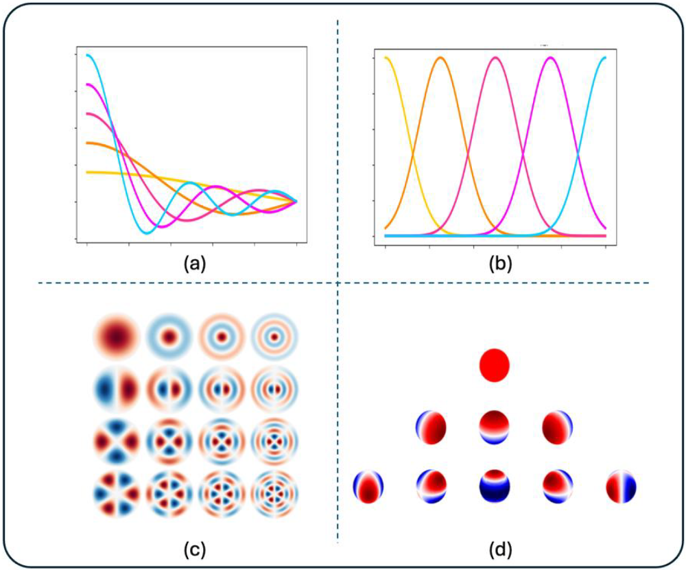
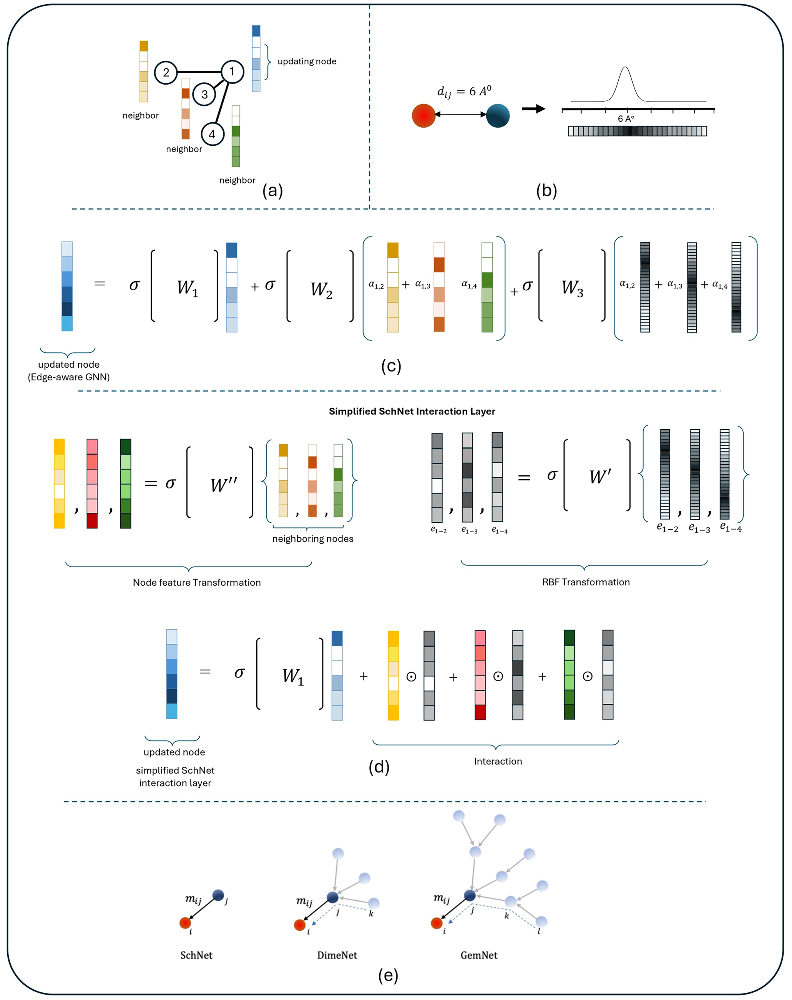
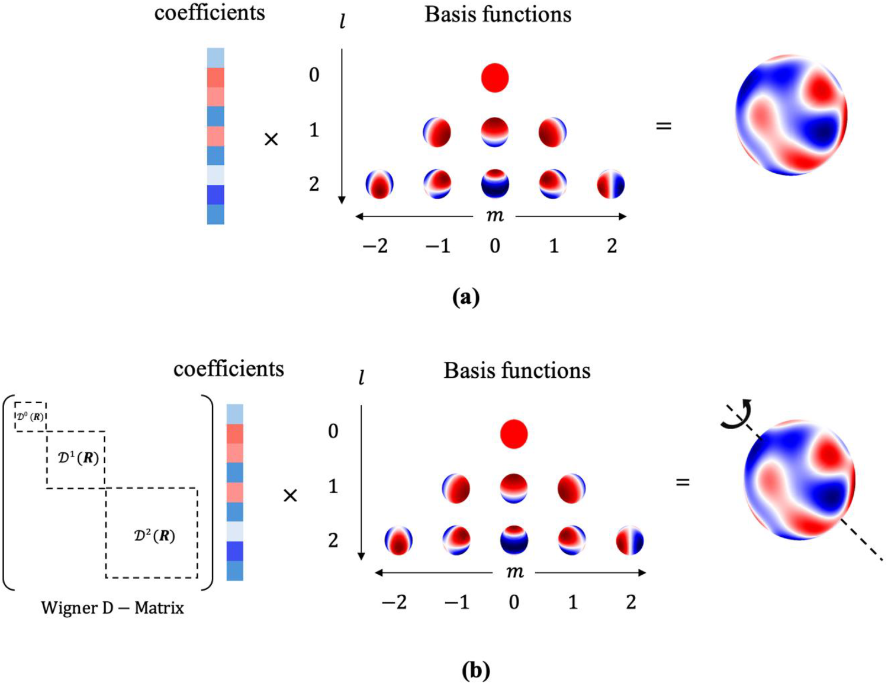
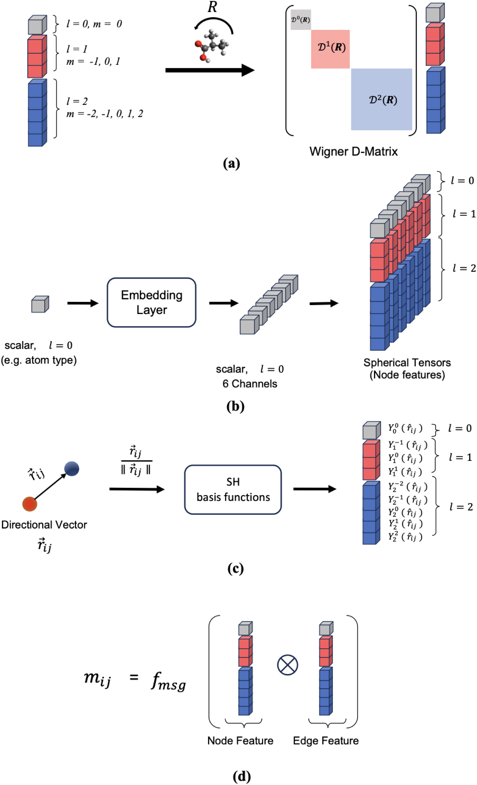
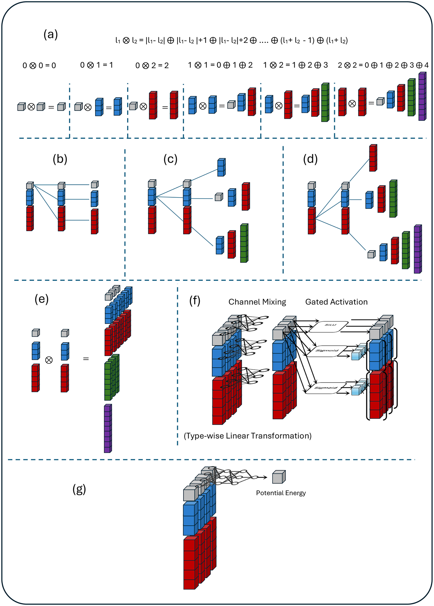
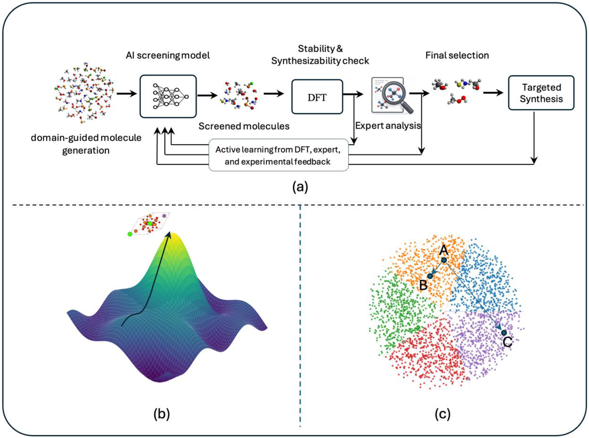
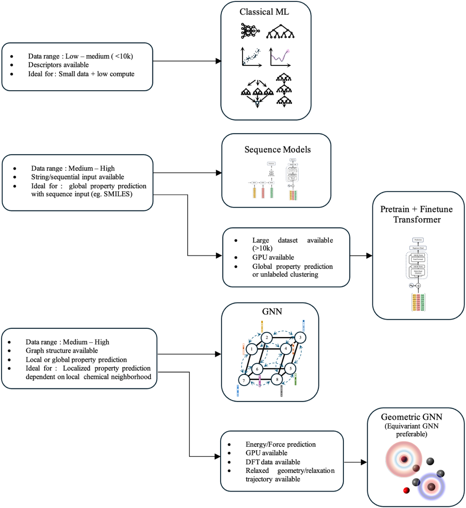

本文是《从描述符到几何图神经网络：分子性质预测的输入表示全景图》的续篇，专注于图神经网络方法的详细解析。

## 本文信息
- 标题：Molecular property prediction: Input types and information processing in machine learning models
- 作者：Muhammed Thameem, Obaid AlHmoudi, Ahmad Al Salloum, Naeema Al Darmaki, Ali Elkamel, Ali A. AlHammadi
- 发表期刊：Results in Engineering
- 发表时间：2026年1月23日在线发表（Received 2025年8月29日；Revised 2026年1月21日；Accepted 2026年1月21日）
- DOI：https://doi.org/10.1016/j.rineng.2026.109241
- 单位：Khalifa University of Science and Technology（阿联酋阿布扎比）、United Arab Emirates University（阿联酋艾因）、University of Waterloo（加拿大安大略）
- 引用格式：Thameem, M., AlHmoudi, O., Al Salloum, A., Al Darmaki, N., Elkamel, A., & AlHammadi, A. A. (2026). Molecular property prediction: Input types and information processing in machine learning models. *Results in Engineering*, 29, 109241. https://doi.org/10.1016/j.rineng.2026.109241

## 基于图的机器学习

### 图表示基础

#### 图结构

分子图$G = (V, E)$由节点集$V$（原子）和边集$E$（化学键）组成。每个节点和边可以关联**特征向量**以编码丰富的化学信息。常用的原子、键和分子级特征如下表所示：

| 级别 | 属性 | 描述 | 编码方式 |
| --- | --- | --- | --- |
| **原子级** | 原子类型 | 原子种类（C、H、O、N等） | One-hot编码 |
|  | 芳香性 | 原子是否在芳香环中 | 二值（0/1） |
|  | 杂化类型 | $\mathrm{sp}$、$\mathrm{sp}^2$、$\mathrm{sp}^3$等 | One-hot编码 |
|  | 形式电荷 | 原子的形式电荷（-1、0、+1） | 整数 |
|  | 连接氢数 | 显式连接的氢原子数 | 整数 |
|  | 原子度数 | 原子连接的其他原子数量 | 整数（0-10+） |
| **键级** | 键型 | 单键、双键、三键、芳香键 | One-hot编码 |
|  | 共轭性 | 键是否参与共轭体系 | 二值（0/1） |
|  | 环 membership | 键是否在环中 | 二值（0/1） |
|  | 立体化学 | E/Z构型或顺反异构 | One-hot编码 |
| **分子级** | 分子量 | 所有原子的质量之和 | 连续值 |
|  | 电荷 | 分子的总电荷 | 整数 |
|  | 原子数 | 分子中原子的总数 | 整数 |
|  | 键数 | 分子中化学键的总数 | 整数 |

这些特征向量是图神经网络的输入起点，每个原子的特征决定了初始信息表示的质量和丰富程度。边特征使模型能够区分不同类型的化学键，这对于预测与键长、键角和反应活性相关的性质至关重要。

**信息表示**：节点特征矩阵$X \in \mathbb{R}^{n \times d}$编码n个原子的d维特征，邻接矩阵$A \in \mathbb{R}^{n \times n}$或边列表$E$编码连接信息。

#### 信息流动的基础

图神经网络（Graph Neural Networks, GNN）的核心思想是通过**消息传递**聚合邻域信息，迭代更新节点表示。这一过程可以分为三个关键阶段：

- **初始状态**：在消息传递开始前，每个节点的表示为其手工设计的初始特征向量，这些特征包含原子类型、电荷、杂化状态等信息，构成了信息流动的起点
- **消息传递**：通过多轮迭代，每个节点聚合来自直接邻居的信息，将邻域知识融入自身表示。随着迭代轮次增加，信息可以传播到更远的邻居，使节点表示逐步融入全局结构信息
- 读出：在完成预定轮次的消息传递后，将所有节点的表示聚合为单一图级向量，常用的方法包括对所有节点表示求和、平均或使用注意力机制加权，该图级表示最终用于分子级别的性质预测

### 图神经网络架构

图10：图卷积、图注意力机制和消息传递神经网络。（a）异丁酸中节点7的邻域，（b）使用求和聚合的图卷积更新节点7，（c）使用图注意力更新节点7，（d）使用MPNN进行性质预测的示意图。

信息流动：消息从邻居流向中心节点，通过多轮迭代传播，每个节点的表示逐渐融入**多跳邻域信息**。与Transformer一层即可让所有token相互注意不同，MPNN第一层只看局部邻域，长程相互作用需要靠多层消息传递逐步累积。

#### 图卷积网络（GCN）

图卷积网络（Graph Convolutional Networks, GCN）是MPNN的一种具体实现，可视为频域图滤波器的空间域近似，通过**聚合邻居特征**更新节点表示：

- 信息处理：对每个节点，先聚合邻居节点特征，再经过线性变换和非线性激活更新节点表示。可以想象为**信息沿着化学键从邻居流向中心原子**
- **局限性**：传统图卷积往往使用**固定或均匀的聚合权重**，无法区分不同邻居的重要性

#### 图注意力网络（GAT）

图注意力网络（Graph Attention Networks, GAT）通过**注意力机制**学习邻居间的动态权重：

- 信息处理：对每对节点计算注意力分数，通过softmax归一化后作为聚合权重。这允许模型**自适应地关注重要邻居**，如关注反应中心的邻近原子而非远端基团
- 优势：注意力机制提供**可解释性**，可以通过分析注意力权重理解模型关注的原子和化学键

#### 消息传递神经网络

消息传递神经网络（Message Passing Neural Networks, MPNN）统一了大多数图神经网络架构，提供了理解图神经网络的统一框架。MPNN的消息传递过程包含**消息函数**、**聚合函数**和**更新函数**：

- **消息函数**：计算节点间传递的消息，通常包含源节点特征和边特征
- **聚合函数**：聚合接收到的多条消息，常用求和、平均或最大
- **更新函数**：结合节点当前状态和聚合消息更新节点表示

#### GraphSAGE

GraphSAGE在GCN之后提出了更灵活的邻域聚合方式。它的关键设计是使用**mean、max和LSTM三类聚合函数**，并且在更新时**保留当前节点自身特征**，再与聚合后的邻居消息拼接：

- GraphSAGE先对邻居节点特征做线性变换和非线性激活，再用mean、max或LSTM聚合邻域信息
- 聚合后的邻居消息会与当前节点特征拼接，再经过另一层线性变换和激活完成节点更新
- LSTM本来是序列模型，但GraphSAGE示例说明它也可以作为GNN中的聚合函数，这也是本文后面提到“跨范式融合”的一个例子

图11：GraphSAGE消息传递。（a）聚焦的邻域，（b）GraphSAGE中的聚合函数，（c）使用聚合消息和当前节点特征进行节点更新。

#### 边感知图神经网络

边感知GNN将**边特征**（如键型、键长）融入消息传递函数，这对于准确的分子性质预测至关重要：

- **信息处理**：在消息函数中显式包含边特征，使得节点更新时能够利用化学键信息
- **优势**：能够区分单键、双键、三键等不同键型对性质的影响，提升预测准确性

### 几何图神经网络

普通的2D图神经网络只考虑原子的连接关系，忽略了原子的空间位置。但对于**能量、力、偶极矩**等与分子几何密切相关的性质，必须把原子的3D坐标信息纳入模型，这就是**几何图神经网络**（Geometric GNNs）的核心动机。Geometric GNNs在多个分子性质预测基准上达到了当前最优性能，尤其在量子力学性质预测任务中表现突出。

#### 为什么需要3D信息？

同一连接关系可以对应不同构象，很多性质也不只由“谁和谁相连”决定。例如构象能、原子力、偶极矩、振动模式和声子相关性质，都依赖原子的3D位置以及局部几何。只看2D连接图时，模型很难知道键长是否被拉伸、键角是否弯曲、二面角是否改变；而3D坐标能够显式提供这些信息。**键长、键角、二面角**这些几何参数直接影响电子结构和能量，因此对3D敏感的模型能够做出更准确的预测。

#### 不变性与等变性

模型如何处理分子的旋转是一个关键设计选择：

- **不变性**（Invariance）：把分子旋转90度，模型预测的能量值**不变**。这适合**标量性质**（如能量、分子量、logP等只有一个数值的性质）
- **等变性**（Equivariance）：把分子旋转90度，模型预测的力矢量也会跟着旋转90度。**力是矢量**，在不同方向上大小不同，所以预测力时需要等变性

> 打个比方：不变性就像“你手里苹果的重量”，无论你转动手腕，苹果的重量不变；等变性就像“你扔出苹果的方向”，如果你转动手腕，方向会跟着变。

传统的不变模型（如SchNet、DimeNet、GemNet）通常直接预测标量能量，再通过对能量取负梯度（$F_i = -\partial E / \partial r_i$）得到原子力。这样做可以保证力的等变性和能量守恒，但力的准确性受能量预测精度限制，而且稳定分子动力学还要求势能面足够光滑。部分现代几何GNN会直接把力作为模型输出，以绕开反向传播求力的训练开销；代价是若处理不好，可能得到与能量不一致的力场。

#### 径向基函数：把距离变成向量

图12：捕捉几何信息的基函数。（a）Bessel径向基函数，（b）高斯径向基函数，（c）2D Fourier-Bessel基函数，（d）球谐函数。

几何GNN处理的是原子的3D坐标，但神经网络更适合处理向量。**径向基函数**（Radial Basis Functions, RBF）就是把一个标量距离$d$转换成一个高维向量$\phi(d) \in \mathbb{R}^K$的桥梁。

| RBF类型 | 数学形式 | 特点 | 适用场景 |
| --- | --- | --- | --- |
| **高斯RBF** | $\phi_k(d) = \exp(-\beta (d - \mu_k)^2)$ | 固定中心的高斯函数，$\mu_k$是第$k$个中心，$\beta$控制宽度 | 通用分子性质预测 |
| **Bessel函数** | $\phi_k(d) = \dfrac{\sin(\pi k d / r_\text{cut})}{d}$ | 常用于距离展开，可与包络函数配合处理截断 | DimeNet、GemNet等距离展开 |
| **球谐函数** | $Y_l^m(\theta, \phi)$ | 编码球面上的角度信息，$l$是阶数，$m$是磁量子数 | 球面卷积与角度信息编码 |

> 类比理解：把1-2-3-4-5这几个数字直接给神经网络，它不一定知道距离之间的平滑关系。但如果先用RBF转换成一组类似“距离指纹”的连续向量，神经网络就能更容易学习“这个距离接近哪个区域”。

#### 从SchNet到DimeNet再到GemNet：交互复杂度的演进

几何GNN的核心是**消息传递**——每个原子从邻居那里获取信息来更新自己的表示。但“邻居”的范围可以不同：

图13：交互块的复杂性对比。（a）节点更新函数，（b）原子间距离，（c）TransformerConv中的节点更新函数，（d）SchNet交互层中的简化节点更新函数，（e）SchNet、DimeNet和GemNet的消息传递复杂性。

- **SchNet（2017）：成对交互**——最简单的情况，每个原子$i$和邻居$j$之间主要利用距离$d_{ij}$。这类distance-only模型速度快、可扩展性好，但**无法区分只有键角或构象不同的结构**。一个具体的反例是：如果两个原子系统具有相同的原子和原子间距离，却有不同的键角，仅靠成对距离的模型就会遇到表达力限制
- **DimeNet：三元组交互**——在距离的基础上引入**键角**信息。对一个triplet $i$-$j$-$k$，消息计算会用到$i$-$j$、$j$-$k$两段距离和$\angle ijk$。这比distance-only模型能捕捉更丰富的三体几何信息，但仍然不能直接区分具有相同距离和三元组角、但二面角不同的结构
- **GemNet：四元组交互**——进一步引入**二面角**（torsion angle）。对一个quadruplet $i$-$j$-$k$-$l$，消息计算会用到$i$-$j$、$j$-$k$、$k$-$l$三段距离，$\angle ijk$、$\angle jkl$两个triplet角，以及$\angle ijkl$二面角。**图13e中展示了5个quadruplets共同参与一次消息计算**，说明GemNet表达力更强，但计算成本也明显更高

| 模型 | 交互类型 | 涉及原子数 | 几何信息 | 计算复杂度 | 典型应用 |
| --- | --- | --- | --- | --- | --- |
| **SchNet** | 成对 | 2个原子 | 距离$d_{ij}$ | 最快、可扩展性最好 | 能量、电荷预测 |
| **DimeNet** | 三元组 | 3个原子 | 距离 + triplet角 | 比SchNet更高，但可捕捉三体几何 | 键角敏感性质 |
| **GemNet** | 四元组 | 4个原子 | 距离 + triplet角 + 二面角 | 最高，每条消息需要更复杂的边和二跳信息 | 构象能、立体化学 |

#### 等变GNN：突破不变模型的限制

不变模型（SchNet、DimeNet、GemNet）的内部表示不随旋转改变，适合能量这类标量性质。等变GNN（EGNN、e3nn、SE(3)-Transformer等）则让内部表示随输入旋转而按规则变换，因此更自然地处理力、速度、偶极矩等带方向的物理量：

- **标量通道**（l=0）：旋转不变的特征，预测标量（能量、电荷）
- **向量通道**（l=1）：旋转等变的特征，预测矢量（力、偶极矩）
- **高阶张量**（l≥2）：更复杂的等变特征，用于编码更丰富的几何信息

实现等变性的数学工具是**球谐函数**和**Wigner D矩阵**。简单来说，球谐函数是定义在球面上的一组正交基函数，类似于傅里叶级数在球面版本。**当分子旋转时，l=0的球谐函数（标量）不变，l=1的球谐函数（向量）会按照Wigner D矩阵的规则旋转**。通过球谐函数构建的特征天然具有正确的等变行为。

图14：球函数与Wigner D矩阵。（a）球函数可表示为系数与球谐基函数的线性组合，（b）坐标系旋转$R$后，球函数的变换由对应阶数的Wigner D矩阵$D^l(R)$控制。不同类型的等变操作有不同特点：

| 操作类型 | 代表模型 | 表达力 | 计算效率 | 适用场景 |
| --- | --- | --- | --- | --- |
| **标量+向量** | TorchMD-NET、E(n) GNN、NewtonNet | 中等 | 高 | 常规分子动力学与力预测 |
| **高阶张量** | TensorNet、TeaNet、HotPP | 强 | 低 | 复杂几何性质、高精度需求 |

> 球谐函数+张量积的组合是实现严格等变性的重要路线。值得注意的是，**并非所有现代几何GNN都走严格的等变约束路线**——SCN这类模型通过spherical channels间接学习相关结构，并不强制执行等变性；eSCN、EquiformerV2和eSEN等则利用SO(2)卷积降低完整SO(3)卷积的计算成本，同时保留大部分等变能力。这是一条**硬约束与软约束**之间的工程权衡。

#### 几何GNN的工程挑战

虽然几何GNN在理论上很优雅，但实际部署面临几个挑战：

- **3D构象依赖**：模型性能高度依赖输入的3D坐标质量。**如果初始坐标远离平衡结构**，结构弛豫可能失败或陷入非物理构型
- **表达力与可扩展性的权衡**：完整SO(3)卷积表达力强，但全张量积成本高；SO(2)卷积通过降低复杂度，在实际中提供了较好的表达力和可扩展性平衡，但需要仔细处理局部坐标框架
- **截断与光滑性**：几何图通常按截断半径连边，若截断函数不光滑，会影响力预测和分子动力学稳定性，因此常需要包络函数或渐进截断

#### 张量积：等变消息传递的核心操作

要让节点和边的信息在等变约束下相互作用，首先需要把它们都翻译成同一套“球张量”语言：标量特征经过线性变换成低阶球张量，方向向量则通过球谐函数编成更高阶的球张量。

图15：球张量和方向编码。（a）$l = 2$球张量在旋转$R$下的变换由Wigner D矩阵控制，（b）标量原子特征被线性变换为球张量，（c）相对位置向量通过球谐函数编码为球张量，（d）节点和边的球张量通过张量积计算消息。

接下来要做的，是把这些已经编好码的球张量按规则两两相乘。**张量积**是这里的核心算子，但两个任意阶球张量相乘后，得到的张量在旋转下不再是单一的不可约表示——必须用Clebsch-Gordan系数把它重新分解成不同阶的不可约分量。

图16：等变GNN中的张量操作。（a）Clebsch-Gordan张量积分解规则，（b-d）$0 \otimes l$、$1 \otimes l$、$2 \otimes l$的分解，（e）完整张量积分解示意，（f）按irrep类型做线性变换和门控激活，（g）在标量通道上接回归头预测最终势能。

这张图解释了为什么严格等变模型贵：为了让不同阶数的球张量在旋转下保持正确变换，模型要用Clebsch-Gordan系数把张量积结果重新分解成不可约表示。全SO(3)张量积表达力强，但成本高；后续的SO(2)卷积、FlashTP、Fused Tensor Product和Gaunt Tensor Product，都是围绕这个瓶颈做加速。

### 优势与局限

| 优势 | 局限 |
| --- | --- |
| 保留拓扑结构：明确编码原子连接关系，比字符串更接近真实分子 | 计算复杂度高：消息传递迭代计算量大，难以处理超大分子 |
| 捕捉空间几何：3D几何GNN能够建模构象和立体化学 | 依赖3D构象：需要生成或实验确定分子3D结构，增加计算成本 |
| 可解释性好：注意力权重和消息路径提供原子级别的解释 | 数据需求高：几何GNN通常需要大量高质量结构数据 |
| SOTA性能：在多个基准数据集上达到最优性能 | 实现复杂：等变GNN的数学和工程实现难度较高 |

---

## 多模态方法与实际应用

### 多模态融合

单一表示往往无法捕捉分子的所有相关信息，多模态方法结合**描述符、字符串和图**的互补优势：

#### 早期融合与晚期融合

- **早期融合**：将不同表示的特征在输入层拼接，联合训练模型。这种方法允许不同表示的特征在模型的浅层就进行交互和融合，理论上能够学习到更丰富的跨模态特征。例如，可以将描述符的全局信息、图的拓扑信息和序列的模式信息在输入层就组合起来
- **晚期融合**：分别训练多个模型，在预测层集成结果。这种方法更加灵活，每个模型可以针对特定表示优化，且便于并行训练和独立更新。常见的集成策略包括投票、加权平均和stacking

**信息处理差异**：早期融合允许模型在训练过程中学习不同表示间的交互，而晚期融合更灵活但可能错过表示间的协同效应。选择哪种融合策略取决于具体任务和数据特性，早期融合适合表示间互补性强的场景，晚期融合适合需要灵活更新和部署的场景

#### 串行融合

串行融合将一个模型的输出作为另一个模型的输入，形成级联的处理流程。典型应用包括：**先使用图神经网络提取局部拓扑特征，再用Transformer处理全局序列模式**，或者**先用编码器学习压缩表示，再用解码器生成分子结构**。

优势：串行融合允许每个模型专注于自己擅长的特征类型，通过级联实现分层次的信息处理。例如，第一层模型可以捕捉局部几何结构，第二层模型可以学习全局构效关系，这种分层的处理策略在复杂任务中往往优于端到端的单一模型。

### 实际工作流中的角色

图17：AI模型在分子和材料设计工作流中的实际角色。（a）基于AI的筛选加速DFT+实验流程，（b）优化神经网络函数以导航设计空间，（c）自监督学习解码未知分子的信息。下面按图中三种角色分别说明。

#### 虚拟筛选

AI模型用于**高通量虚拟筛选**，从百万级化合物库中识别潜在候选物，大幅减少需要DFT计算或实验验证的化合物数量。

**典型工作流**：描述符或图表示 + 快速ML模型 → 初步筛选 → DFT计算 → 精确验证 → 实验测试。这种AI辅助的筛选流程可以将进入DFT计算的候选数量从数千降低到数十，显著节省计算资源和时间。虚拟筛选特别适用于药物发现的早期阶段，能够快速评估大规模化合物库的ADMET性质，及时淘汰不符合要求的候选物。

#### 逆向设计

神经网络学习**性质-结构映射**的逆函数，从目标性质生成候选分子结构。生成模型如变分自编码器（VAE）、生成对抗网络（GAN）和扩散模型在这一任务中表现出色。

**应用价值**：逆向设计改变了传统的试错范式，研究者可以指定期望的性质（如溶解度、结合亲和力、代谢稳定性），模型直接生成满足这些性质的候选分子结构。这种方法在药物设计中特别有价值，可以探索传统化学直觉难以发现的化学空间，同时保证合成可行性。

#### 自监督预训练

对于**标注数据稀缺**的领域，自监督学习从**无标注分子数据**中学习有用表示。掩码节点预测、对比学习和图增强是常用策略。

**技术优势**：自监督预训练通过设计代理任务（如掩码语言建模、对比学习）从未标注数据中提取有用知识，然后将学习到的表示迁移到下游性质预测任务。这种方法显著降低了对标注数据的需求，使得在仅有数百个标注样本的场景下也能训练高性能模型。大规模预训练已成为分子机器学习的标准范式，ChemBERTa、MolBERT等预训练模型在多个基准数据集上取得了SOTA性能。

### 模型与表示选择指南

图18：根据数据可用性、计算资源和目标特性选择分子表示和机器学习架构的高层指南。

- **小数据（<1000样本）**：描述符 + 传统ML（随机森林、GP）或迁移学习。小数据场景下，深度学习模型容易过拟合，传统机器学习方法如随机森林、支持向量机和高斯过程往往表现更好。迁移学习通过预训练模型提供的先验知识，可以在少量标注数据下取得良好性能
- **中等数据（1000-10000）**：图神经网络或预训练Transformer微调。这一数据规模足以训练中等规模的神经网络，2D图神经网络或预训练Transformer的微调通常能够取得较好的性能。可以从头训练或利用在大规模数据上预训练的模型进行迁移
- **大数据（>10000）**：从零训练大型图模型或Transformer。大规模数据允许训练具有数百万参数的深度神经网络，充分挖掘数据的潜在模式。此时可以考虑设计更复杂的架构、使用多模态融合或探索新的表示学习方法
- **计算资源约束**：资源受限时优先选择描述符 + 线性模型或浅层神经网络；中等资源适合2D图神经网络或中型Transformer；只有充足算力时才适合3D几何GNN或大规模预训练模型
- **目标性质匹配**：全局性质（如能量、溶解度）用图级预测；局部性质（如原子电荷、反应位点）用节点级预测；几何相关性质（如偶极矩、力）必须用3D几何GNN；序列相关性质（如聚合物性质）用Transformer或RNN

#### 现代分子ML的跨范式融合

现代分子机器学习的一个重要趋势是**不同表示、架构和训练方法的交叉融合**。经典ML模型可以用在序列模型或GNN生成的神经嵌入上做后处理（如随机森林+图嵌入）；Transformer编码器可以直接处理分子图（如Graphormer）；掩码语言建模（MLM）被移植到分子图上实现自监督预训练（如GROVER）；LSTM这类序列模型甚至被用作GNN的聚合函数（如GraphSAGE）。这种跨范式组合让不同表示的优势互补，在多个基准上超越了单一范式的模型。

## 小结

本文系统综述了分子性质预测中的**输入类型**和**信息处理机制**，从传统描述符方法到最前沿的几何图神经网络。通过统一框架和直观的图形表示，阐明了不同模型架构如何处理和传播分子信息。

### 核心结论

- **基于描述符的模型仍然有效**，尤其是对于**小规模或特征明确的数据集**，在有高质量描述符可用时甚至能超越深度模型。但它们的广泛适用性受限于**泛化能力差**，以及对于**全新或未充分表征的分子缺乏可靠描述符**
- **基于字符串的表示**（如SMILES）支持RNN和Transformer等序列架构建模。借助Transformer的可扩展性，简单的分子表示已经能构建出高精度的模型。然而，**Transformer的最终性能受限于紧凑字符串表示的表达力**，因为它们**无法捕捉原子在3D空间中的空间排列**
- **基于图和几何的表示**通过直接编码结构连接性克服了上述局限。消息传递神经网络（特别是3D几何GNN）通过强制执行旋转不变性和等变性等物理对称性，**在量子力学性质预测上达到了当前最优精度**
- **几何GNN虽然精度高，但计算开销大**，尤其是依赖高阶张量或昂贵等变操作的模型。这凸显了对**兼顾物理保真度与可扩展性**模型的需求
- **从建模和实际部署角度**：经典ML模型适合**数据量和算力有限**的应用；序列模型适合基于字符串/序列表示预测**全局性质**；当**有大规模数据和GPU资源**时，基于Transformer的预训练-微调流水线对**无标注数据聚类和全局性质预测特别有效**；当目标性质**强烈依赖局部邻域结构和分子几何**时，GNN通常是最佳选择
- **现代分子ML的趋势是不同表示、架构和训练方法的交叉融合**。经典ML模型可以用在序列模型或GNN生成的神经嵌入上做后处理；Transformer编码器可直接处理分子图（Graphormer）；MLM被移植到分子图实现自监督预训练（GROVER）；LSTM被用作GNN的聚合函数（GraphSAGE）；CatBERTa、LLM-Prop等用**材料文本描述**而非紧凑字符串作为Transformer输入
- **从工程视角**，分子机器学习主要用于加速分子/材料发现流程。预测式AI模型能够从**百万级候选中快速筛选**，显著缩短决策时间和成本，**优先把有潜力的体系送入下游DFT计算和实验验证**。神经网络学到的连续函数还能高效搜索大设计空间，**帮助识别最优的分子或材料候选**。对于无标注的真实世界数据，自监督学习能将分子/材料组织到高维嵌入空间，**通过与已知高性能药物/材料的近邻关系发现新候选**

对于刚进入这一领域的研究者，建议从**描述符 + 随机森林**或**2D图 + 简单GNN**开始，快速建立baseline。随着经验和资源积累，逐步尝试**预训练Transformer**和**几何GNN**。理解每种方法的信息处理机制，而非将模型视为黑箱，是成功应用和开发新方法的关键。

### 五大未来方向

从工程实践看，以下5个方向被认为是分子机器学习未来值得重点关注的方向：

- **3D原子建模不再依赖图先验**：Transformer的强可扩展性正被用于3D分子系统和机器学习原子间势（MLIP）。Kreiman等（2025）将离散化的原子位置、能量和力作为token，配合连续坐标嵌入，**让Transformer直接处理3D结构，性能与等变几何GNN相当**。这让MLIP可以利用现成的Transformer架构、潜在/稀疏注意力算法，以及现代GPU对稠密矩阵运算的优化
- **等变张量运算的加速**：等变几何GNN的主要瓶颈是Clebsch-Gordan张量积（CGTP）。**FlashTP算法**利用CG系数矩阵的稀疏性，**推理加速4.2倍，训练加速3.5倍**（已在SevenNet上验证）。Fused Tensor Product（FTP）将所有不可约表示融合为单一稠密张量；Gaunt Tensor Product（GTP）则在频域用FFT加速，但会牺牲部分表达力
- **混合模型**：graph+strings、descriptors+strings、descriptors+graphs等组合正成为单表示模型的强替代方案。在等变GNN中，**标量（l=0）通道可以与其他表示组合而不破坏等变性**，这是一个相对未被探索的方向
- **物理增强的等变GNN**：传统等变模型只依赖原子序数初始化节点特征，**在标量通道中加入领域特定的物理信息**（如局部电荷密度、电子占据数等）有望提升性能，且不破坏等变性
- **基础模型与现代原子数据集**：OMol25、OMat24、LeMat-Traj等大规模、多样化、高保真的量子化学数据集的出现，**为训练真正的预训练基础模型提供了前所未有的机会**。基于这些数据集训练Transformer、GNN或混合架构的基础模型，潜力巨大但目前仍稀缺
