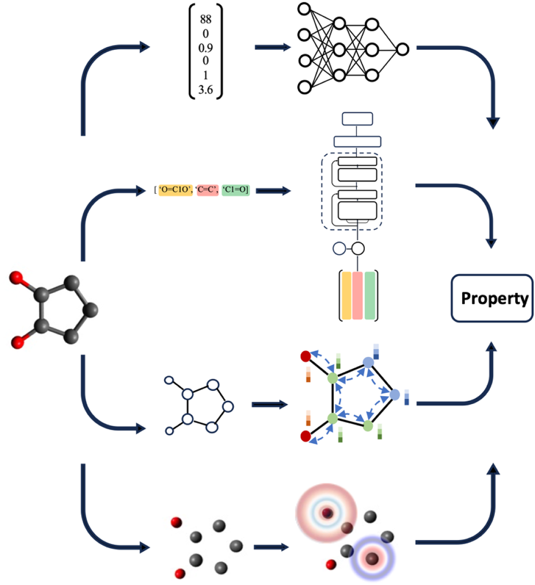
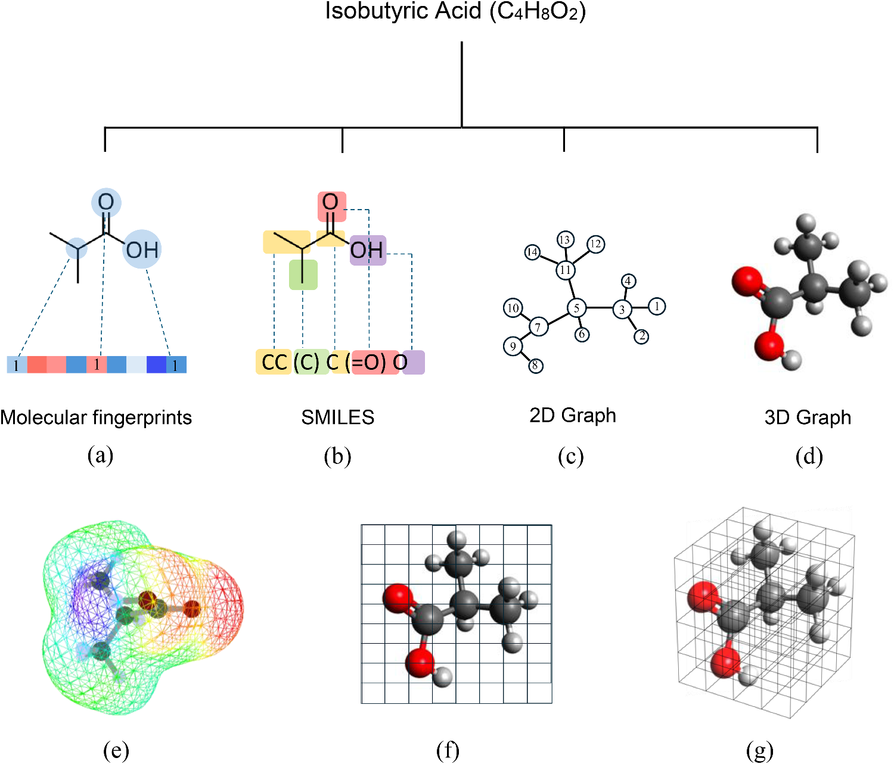
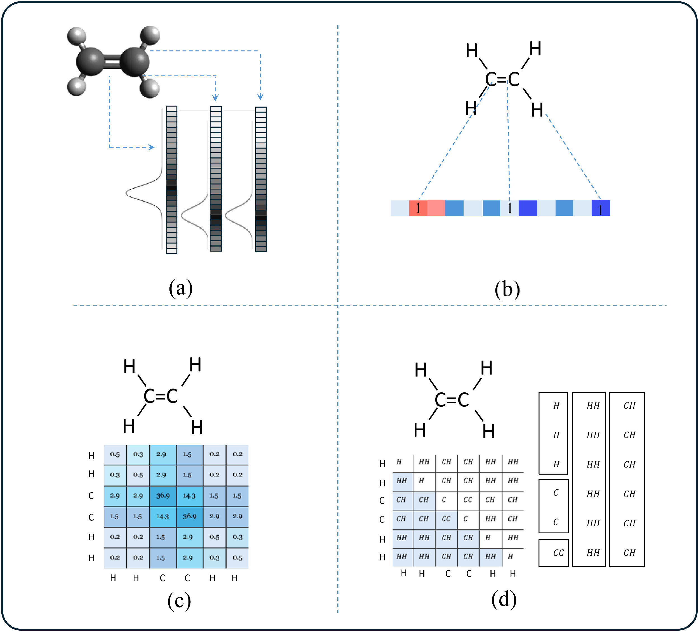
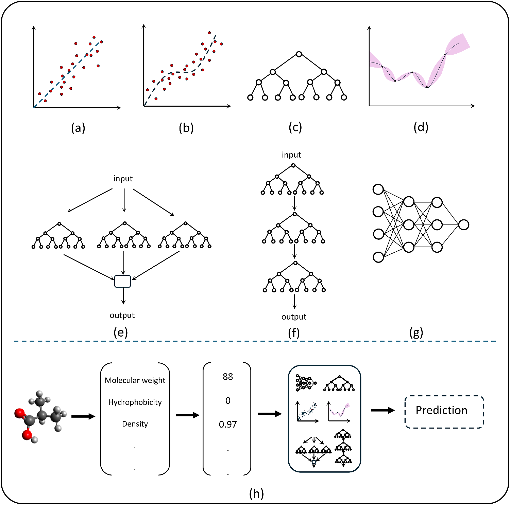
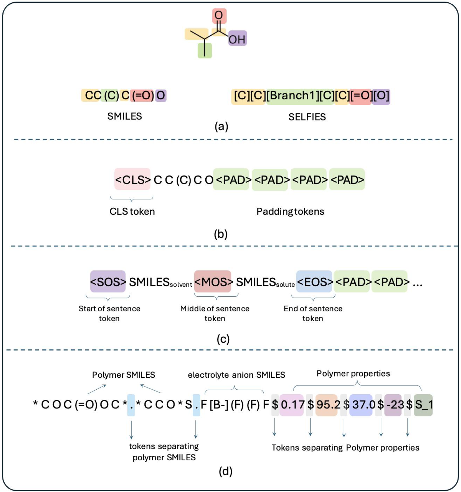
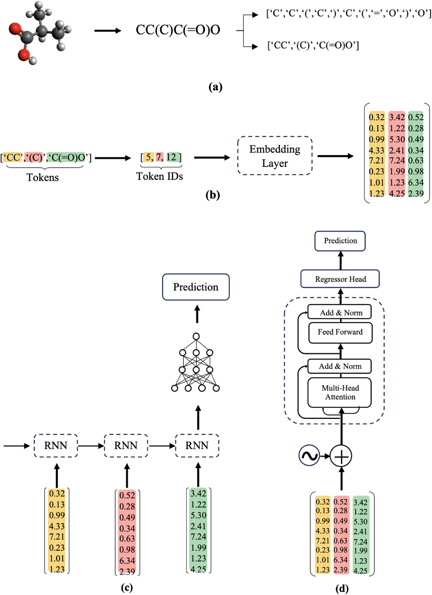
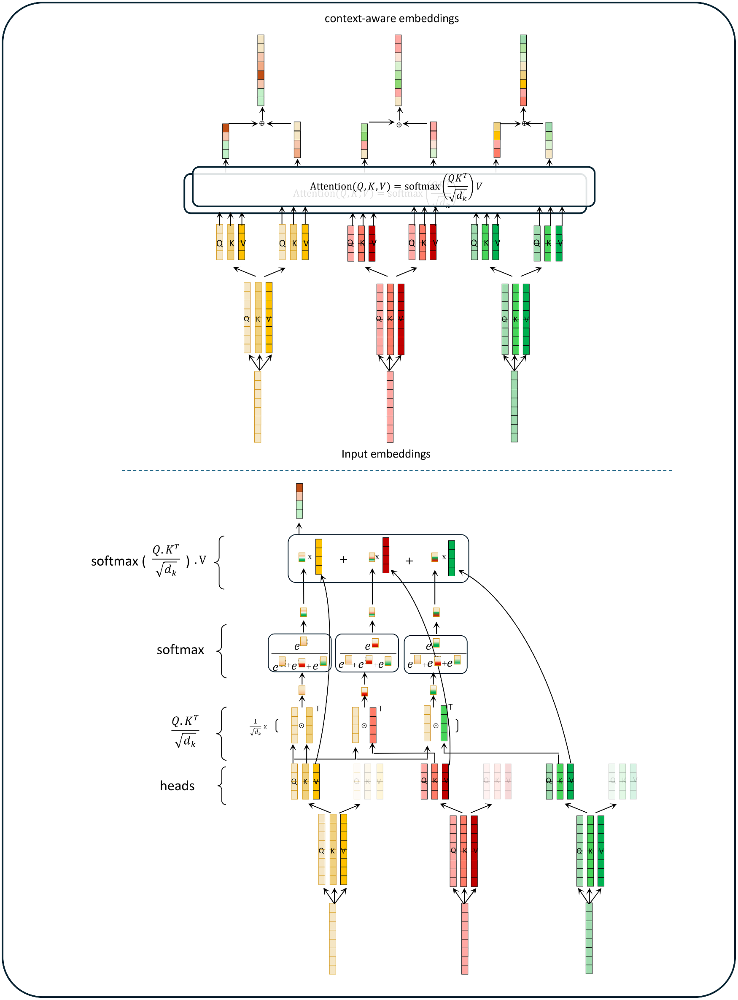
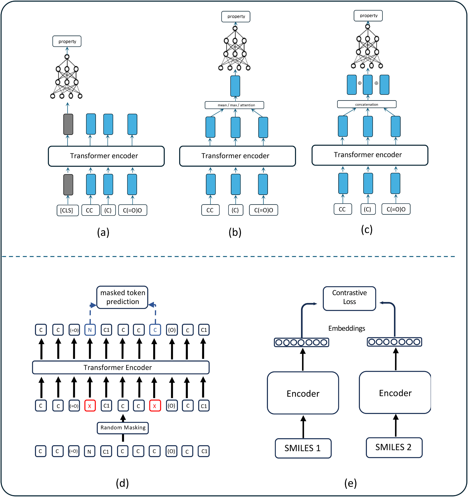

# 从描述符到几何图神经网络：分子性质预测的输入表示全景图

## 本文信息
- 标题：Molecular property prediction: Input types and information processing in machine learning models
- 作者：Muhammed Thameem, Obaid AlHmoudi, Ahmad Al Salloum, Naeema Al Darmaki, Ali Elkamel, Abdulla Al Al Hammadi
- 发表期刊：Results in Engineering
- 发表时间：2026年1月23日在线发表（Received 2025年8月29日，Accepted 2026年1月21日）
- DOI：https://doi.org/10.1016/j.rineng.2026.109241
- 单位：Khalifa University（阿联酋阿布扎比）、University of Toronto（加拿大多伦多）
- 引用格式：Thameem, M., AlHmoudi, O., Al Salloum, A., Al Darmaki, N., Elkamel, A., & Al Hammadi, A. A. (2026). Molecular property prediction: Input types and information processing in machine learning models. *Results in Engineering*, 29, 109241. https://doi.org/10.1016/j.rineng.2026.109241

## 摘要

> 分子性质预测是机器学习驱动的材料和药物发现的核心。有效导航机器学习工作流需要仔细考虑分子表示、输入准备策略和模型架构。本文综述旨在提供不同机器学习模型中信息处理和输入构建的直观理解，重点在于信息处理与分子输入表示的关联。文章通过简化的图形表示说明高级模型中的信息处理，阐明分子信息如何在向量和张量层级传播，为研究人员提供选择合适表示和模型的实用指导。

### 核心价值

本文的价值在于为分子性质预测领域提供了一个统一且实用的理解框架，填补了现有综述的空白：

- **统一视角**：首次将基于描述符的经典方法、基于语言模型的序列方法与先进的图神经网络方法统一在同一框架下。这种统一视角有助于研究者理解不同方法之间的内在联系和演进脉络，避免了将不同类型方法割裂学习的弊端
- **直观理解**：通过简化图形表示不同模型内部的信息流动，避免过于抽象的数学表述。本文重点解释「信息如何处理」而非「模型如何优化」，使化学背景的研究者能够直观理解机器学习模型的内部工作机制
- **实用指导**：提供根据数据可用性、计算资源和目标特性选择分子表示和模型架构的高层指南。这些指南基于对不同方法优势和局限的深入分析，能够帮助研究者在实际项目中做出明智的技术选型决策
- **前沿覆盖**：系统涵盖当前最先进的等变图神经网络（Geometric GNNs），这类模型在多个基准数据集上达到SOTA性能。本文详细解释了等变性、球谐函数等关键概念，使前沿技术对更广泛的受众变得可及

---

## 背景

### 机器学习在分子发现中的核心作用

开发新材料和药物涉及大量试错的实验室实验，既昂贵又耗时。计算建模通过分子或原子系统的虚拟仿真来预测潜在候选物，从而减轻这一负担。虽然密度泛函理论（DFT）等计算方法提供了相对准确的性质预测手段，但对大规模系统而言，DFT需要巨大的计算资源和时间，尤其是在探索广阔化学空间时。**机器学习模型通过从历史数据中学习，而不依赖复杂的原子系统物理，成功绕过了这一瓶颈**。

人工智能驱动的材料发现的核心是**分子性质预测**。作为数据驱动方法，它需要包含分子现有信息的输入数据和需要预测性质的输出数据。AI模型充当这些输入和输出之间的函数逼近器。选择合适的分子表示、模型和输入数据准备往往需要仔细考虑。尽管已有针对催化、药物发现、能源存储和材料设计等特定领域的分子机器学习应用综述，但缺乏从输入表示和信息处理视角统一经典、语言和先进图模型方法的全面综述。

### 关键挑战

分子性质预测面临三大核心挑战：**表示选择**、**模型架构匹配**和**计算资源约束**。现有综述多侧重于特定应用领域或模型类别，很少有工作从信息流动的角度统一不同类型模型。此外，许多讨论机器学习模型中信息处理的综述严重依赖抽象数学表述，对化学相关领域的研究者来说难以理解。本文旨在填补这一空白，提供直观的、面向化学家的理解框架。

---

## 分子表示类型

### 表示类型全景

图1：用于分子性质预测机器学习模型的不同分子表示类型。

分子表示是将化学结构转化为机器学习可处理数值或符号形式的桥梁。根据信息的丰富度和结构保留程度，主要可分为三大类：

#### 基于描述符的表示

**描述符**是描述分子定性和定量特征的**唯一向量或矩阵**。这些表示可以是手工设计的，也可以通过算法自动生成。

- **连续描述符**：如分子量、logP、极性表面积等物理化学性质，通过计算或实验获得。这些数值型描述符通常需要归一化处理以消除尺度差异，可以直接作为传统机器学习模型的输入特征
- **分子指纹**：如ECFP、MACCS等二进制向量，编码分子子结构或官能团存在与否。指纹通过哈希函数将分子结构映射到固定长度的位向量，每一位表示特定子结构模式是否存在，非常适合快速相似性搜索和分类任务
- **全局描述符**：如Coulomb矩阵、Bag of Bonds，编码原子的成对交互信息。这些描述符捕捉原子间的全局交互模式，常用于预测与电子结构相关的性质，但在大分子上计算成本较高

描述符的优势在于计算高效、易于解释，但往往**丢失分子的结构细节和空间几何信息**。

#### 基于字符串的表示

字符串表示将分子编码为字符序列，最常用的是**SMILES**（Simplified Molecular-Input Line-Entry System）和**SELFIES**（Self-Referencing Embedded Strings）。

- **SMILES**：使用ASCII字符序列表示分子结构，紧凑高效，广泛应用于化学信息学。SMILES通过一套规范化规则将分子图线性化为字符串，但同一分子可能有多种SMILES编码，这给模型学习带来挑战
- **SELFIES**：2020年提出的SMILES改进版本，保证任何字符串对应有效分子结构，更适合生成模型。SELFIES通过更严格的语法规则保证100%的有效性，避免了生成模型产生无效分子结构的问题，在分子生成任务中表现优异

字符串表示的优势在于可以利用**成熟的自然语言处理技术**，如Transformer和大型语言模型，但**忽略了分子的明确拓扑连接信息**，不同SMILES编码同一分子可能导致模型学习困难。

#### 基于图的表示

图表示将分子建模为图结构：**原子为节点，化学键为边**。这是最自然且信息最丰富的表示方式。

- **2D图**：仅包含拓扑连接信息，忽略空间几何。2D图是最常用的图表示，计算成本低，适合捕捉与拓扑相关的性质，但无法处理依赖空间构象的性质
- **3D或几何图**：包含原子的三维坐标，能够捕捉空间构象和立体化学。3D图提供了最丰富的信息，适合预测与空间几何相关的性质，但需要确定分子构象，计算成本显著增加
- **表面-电荷网格**：用于分子表面和静电势分析。这种表示将分子表面离散化为网格点，每个点携带位置和电荷信息，适合研究分子识别和结合现象，在药物设计中应用广泛
- **2D图像**：将分子渲染为图像，利用计算机视觉技术。图像表示可以直接利用成熟的CNN架构，但信息密度低且对渲染方式敏感，目前应用相对有限

图2：异丁酸的多种分子表示形式。(a) 基于描述符的指纹，(b) 基于字符串的SMILES表示，(c) 2D图表示，(d) 3D或几何图表示，(e) 表面-电荷网格，(f) 2D图像，(g) 3D网格。

图表示的优势在于**保留了完整的分子拓扑和空间信息**，是当前最先进的图神经网络方法的基础。然而，计算复杂度较高，尤其是3D几何图方法。

---

## 基于描述符的机器学习

### 描述符类型与信息处理

图3：分子描述符示例。(a) 连续描述符，(b) 分子指纹，(c) Coulomb矩阵，(d) Bag of Bonds。

#### 描述符特征工程

描述符可以分为连续型和离散型两大类：

- **连续描述符**：数值特征如分子量、电负性、亲脂性等，通常需要归一化处理以避免尺度差异影响模型
- **分子指纹**：二进制向量，每一位表示特定子结构或官能团是否存在，常用算法包括ECFP（Extended Connectivity Fingerprints）、MACCS等
- **全局描述符**：如Coulomb矩阵编码原子的成对Coulomb斥力，Bag of Bonds编码原子对信息

这些描述符形成**固定长度的特征向量**，作为传统机器学习模型的输入。

### 经典机器学习模型

图4：经典机器学习建模方法。(a) 线性回归，(b) 基于核的方法，(c) 决策树，(d) 高斯过程回归，(e) 集成树，(f) 提升树，(g) 多层感知机，(h) 手工构建的描述符向量进入经典ML模型。

#### 线性模型与核方法

- **线性回归**：最简单的模型，假设性质与描述符呈线性关系，计算快速但表达能力有限
- **核方法**：如支持向量机（SVM）和核岭回归（KRR），通过核函数将数据映射到高维特征空间，能够捕捉非线性关系

信息处理机制：核方法通过计算样本间的相似度矩阵（核矩阵）来隐式地学习特征间的复杂交互，**不直接处理描述符本身，而是处理样本间的关系**。这使得核方法在小数据集上表现出色，但计算复杂度随样本数平方增长，不适合大规模数据。

#### 决策树与集成方法

- **决策树**：通过递归分割特征空间构建树形结构，直观易懂但容易过拟合
- **随机森林**：构建多棵决策树并集成预测，降低方差，提高泛化能力
- **梯度提升**：如XGBoost、LightGBM， sequentially训练弱学习器纠正前序错误，在许多表格数据任务上达到SOTA

信息处理机制：树模型通过**选择最佳特征和分割点**递归划分样本空间，在每个叶节点存储预测值。信息流动表现为样本从根节点到叶节点的路径，集成方法通过**投票或平均**整合多棵树的预测。

#### 高斯过程回归

高斯过程是一种非参数贝叶斯方法，定义了函数的概率分布，能够提供预测的不确定性估计。信息处理通过核函数定义样本间的协方差结构，预测新样本时利用训练数据的信息加权组合。GP在小数据集上强大但计算复杂度为$O(n^3)$，难以扩展到大规模数据。

#### 神经网络

多层感知机（MLP）通过多层非线性变换学习复杂特征交互。信息流动从输入层经过多个隐藏层到输出层，每层进行线性变换和非线性激活。深度神经网络能够自动学习层次化特征，但需要大量数据和计算资源。

### 优势与局限

| 优势 | 局限 |
| --- | --- |
| 计算高效：描述符计算和模型训练快速，适合大规模虚拟筛选 | 信息损失：手工描述符难以捕捉复杂分子结构和空间几何 |
| 可解释性强：线性模型和树模型易于理解和解释特征重要性 | 特征工程依赖：性能高度依赖专家设计的描述符质量 |
| 小数据适用：传统ML在小数据集上往往优于深度学习 | 泛化能力有限：难以捕捉高维非线性特征交互 |

---

## 基于字符串的机器学习

### 字符串表示与输入准备

图5：字符串表示和特殊标记。(a) 异丁酸的SMILES和SELFIES表示，(b) CLS和填充标记，(c) Winter等人用于二元混合物的特殊标记，(d) Xu等人用于聚合物-电解质系统的特殊标记。

#### SMILES与SELFIES

- SMILES：使用ASCII字符序列表示分子，如异丁酸的SMILES为`CC(C)C(=O)O`
- SELFIES：保证任何字符串对应有效分子结构，通过更严格的语法避免无效分子生成

输入准备：将SMILES字符串分词为字符或子词单元，然后将每个token映射为`one-hot`编码向量或嵌入向量，形成序列的矩阵表示，其中每行对应一个token，每列对应词汇表中的一个位置。

#### 特殊标记

在自然语言处理中常用的特殊标记也被引入分子性质预测：

- `CLS`（Classification）：分类标记，用于序列级表示
- `SOS/EOS`（Start/End of Sequence）：序列开始和结束标记
- `UNK`（Unknown）：未知词汇标记
- `PAD`（Padding）：填充标记，用于批处理中统一序列长度

这些标记帮助模型理解序列结构和进行批量训练。

### 循环神经网络（RNN）

RNN用于检测序列数据中的模式，虽然主要用于自然语言处理和时间序列分析，也可用于基于字符串表示的分子性质预测。

#### 长短期记忆网络（LSTM）

LSTM通过**门控机制**（输入门、遗忘门、输出门）解决传统RNN的梯度消失/爆炸问题，能够有效捕捉长程依赖。

信息处理：LSTM在每个时间步处理一个token，维护隐藏状态和细胞状态。隐藏状态传递序列的短期记忆，细胞状态传递长期记忆。通过门控机制选择性地更新和遗忘信息，最终时间步的隐藏状态或其变换用于性质预测。

#### 门控循环单元（GRU）

GRU是LSTM的简化版本，只有更新门和重置门，参数更少，训练更快，性能往往与LSTM相当。

### Transformer架构

图6：Transformer架构的分子性质预测流程。

Transformer完全基于**注意力机制**，消除了RNN的顺序处理，实现了并行计算，是目前最主流的序列模型架构。

#### 自注意力机制

图7：Transformer编码器中的信息处理。(a) 对3个输入嵌入应用2头注意力层，(b) 单个注意力头中第一个输入token的信息处理。

自注意力机制通过计算**查询、键、值**三个向量的交互来建模序列中不同位置的关系：

- **查询-键相似度**：计算当前token与序列中所有token的相关性
- **注意力权重**：对相似度进行softmax归一化，得到权重分布
- 加权求和：用权重对值向量加权求和，得到当前token的上下文表示

信息流动：每个token的表示通过自注意力层聚合整个序列的信息，多头注意力允许模型在不同的表示子空间中并行捕捉不同类型的关系。

#### 前馈网络与层归一化

Transformer编码器除自注意力层外，还包含前馈网络和层归一化。前馈网络对每个位置独立应用非线性变换，层归一化稳定训练过程。残差连接将输入直接加到输出，缓解深层网络训练困难。

### 汇聚操作与预训练

图8：汇聚操作和自监督预训练方法。(a) 使用CLS标记进行下游性质预测，(b) 对上下文丰富的嵌入进行平均、最大或自注意力操作，(c) 连接所有嵌入，(d) 掩码语言建模（MLM），(e) 对比学习（CL）。

#### 汇聚策略

将序列级表示映射为单一预测向量的常用策略：

- CLS标记：使用第一个特殊`CLS` token的最终表示作为整个序列的表示
- **平均/最大汇聚**：对所有token的嵌入取平均或最大，简单有效
- **注意力汇聚**：学习一个权重分布对token嵌入加权

信息处理：汇聚操作将**可变长序列的多个token表示**压缩为**固定长度的单一向量**，该向量随后通过全连接层映射到预测输出。

#### 自监督预训练

大规模语言模型通过自监督任务从无标注文本中学习：

- **掩码语言建模（MLM）**：随机mask部分token，训练模型预测被mask的token，学习上下文表示
- **对比学习（CL）**：通过正负样本对学习鲁棒表示，增强模型对噪声和变体的鲁棒性

预训练后模型可通过**微调**适应特定分子性质预测任务，显著降低对标注数据的需求。

### 大型语言模型的应用

基于Transformer的大型语言模型如ChemBERTa、SMILES-BERT在分子性质预测中展现出强大能力：

- **大规模预训练**：在百万级分子数据上预训练，学习丰富的化学知识
- **迁移学习**：将预训练模型微调到下游任务，提高小数据集性能
- **多任务学习**：同时预测多种性质，共享表示学习

信息流动：LLM通过**深层Transformer**处理SMILES序列，每层通过自注意力聚合全局上下文，最终通过预训练头或任务特定头进行预测。

### 优势与局限

| 优势 | 局限 |
| --- | --- |
| 利用NLP技术：可以直接应用成熟的NLP架构和预训练方法 | 丢失拓扑信息：字符串表示无法明确编码原子间的连接关系 |
| 处理变长序列：RNN和Transformer天然支持变长输入 | 编码歧义性：同一分子的多个SMILES编码可能导致不一致学习 |
| 迁移学习：大规模预训练提升小数据集性能 | 计算资源密集：Transformer需要大量GPU内存和训练时间 |
| 生成能力：可以用于分子生成和逆合成分析 | 缺乏空间信息：无法处理3D构象和几何相关性质 |
