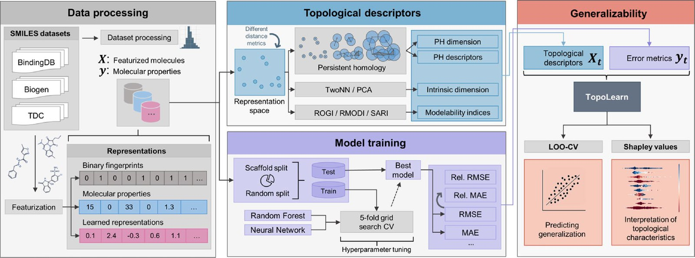
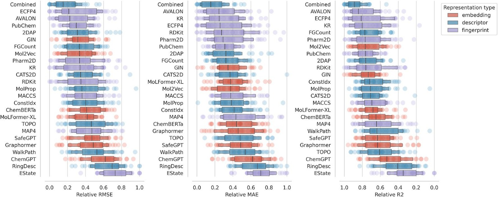
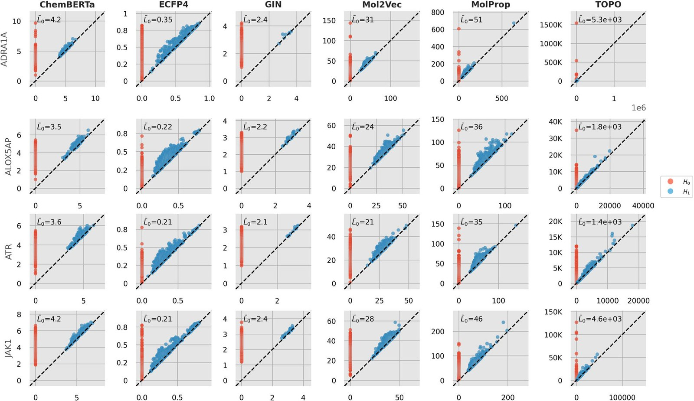
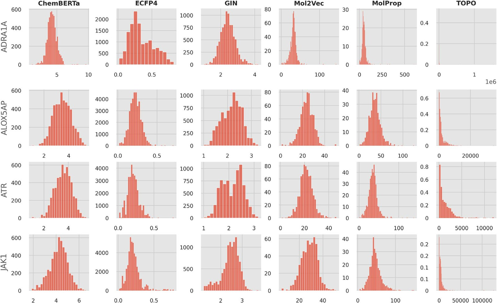
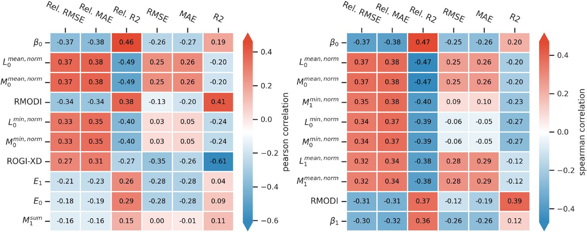
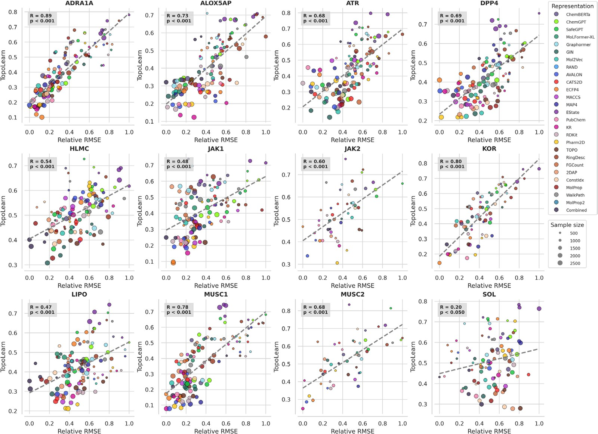
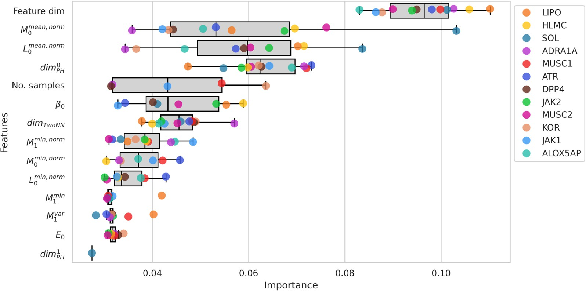
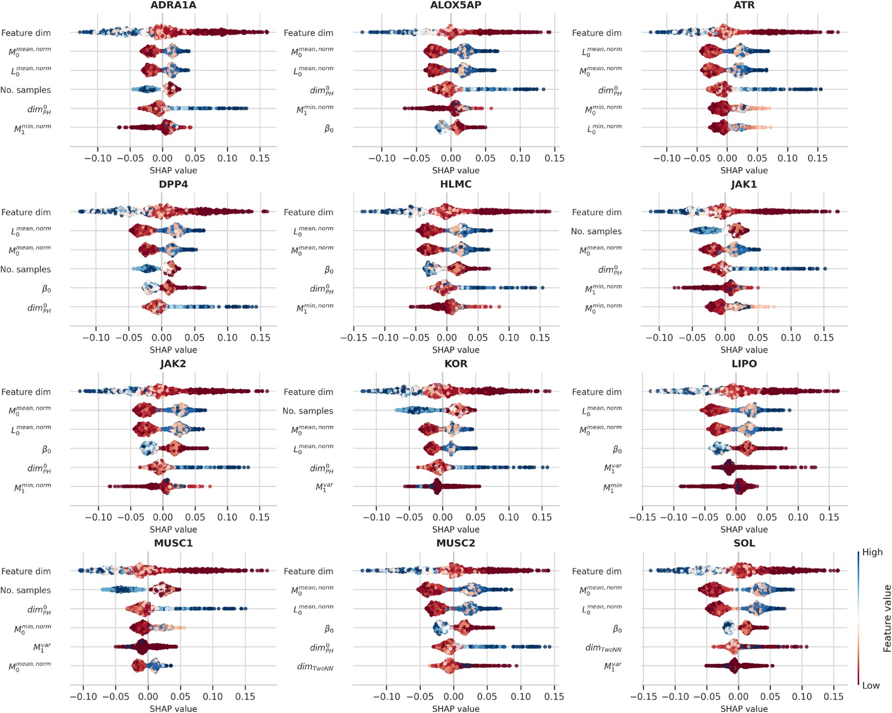

# 分子表征的拓扑结构，决定了机器学习能学多好

## 本文信息

- **标题**：分子表征的拓扑结构及其对机器学习性能的影响
- **作者**：Florian Rottach, Sebastian Schieferdecker, Carsten Eickhoff
- **发表期刊**：Journal of Cheminformatics
- **发表时间**：2025年
- **DOI**：https://doi.org/10.1186/s13321-025-01045-w
- **单位**：勃林格殷格翰中央数据科学部、德国图宾根大学等
- **引用格式**：Rottach, F., Schieferdecker, S. & Eickhoff, C. The topology of molecular representations and its influence on machine learning performance. J Cheminform 17, 109 (2025). https://doi.org/10.1186/s13321-025-01045-w
- **代码与数据**：https://github.com/Boehringer-Ingelheim/topolearn（最终版 TopoLearn (PH) 模型以 MIT 许可发布在 PyPI，可直接 `pip install topolearn`）

## 摘要

> 分子表征的选择对机器学习模型的准确性和泛化能力有显著影响。然而，设计和选择合适的表征往往缺乏系统性方法，只能依赖计算成本高昂的实证测试。此外，研究表明深度学习模型在许多任务上并未大幅超越传统方法，其原因尚不明确。本文提出 TopoLearn——一个基于特征空间拓扑特性预测表征有效性的模型。通过持续同调描述符与训练后模型误差的关联分析，研究发现**特征空间的拓扑结构是决定机器学习性能的关键因素**。在 12 个数据集、25 种表征和超过 10 万次模型训练的基础上，TopoLearn 在留一数据集交叉验证中达到 $r = 0.62$ 的相关系数，显著优于已有的可模型性指标；SHAP 可解释性分析进一步揭示，**高维度和短持续同调寿命是有效表征的共同特征**，表明致密的特征空间和较低的拓扑复杂度有利于模型泛化。

### 核心结论

- **拓扑结构能预测泛化误差**：持续同调描述符与模型测试误差之间存在显著相关性（$r$ 最高可达 $0.38$，$p < 0.001$），为表征选择提供了全新的理论依据。
- **TopoLearn超越已有指标**：在留一数据集和留一表征两种验证策略下，TopoLearn的预测相关性（$r = 0.58$–$0.62$）显著优于ROGI-XD、RMODI、SARI等传统可模型性指标（$p < 0.001$）。
- **有效表征的共同特征**：高维度特征空间和短持续同调寿命对应更低的泛化误差——维度高意味着能覆盖更多相关化学信息，而短寿命拓扑特征暗示数据分布致密、拓扑复杂度更低。
- **传统分子描述符整体最优**：在所有表征类型中，分子描述符（尤其是所有描述符的拼接）取得了最低的中位预测误差和最小方差，而深度学习的嵌入表征表现不佳。

## 背景

分子机器学习（MolML）的核心挑战之一，是如何把分子编码成计算机能理解的数字形式。从最早的QSAR建模开始，化学家就设计了各种各样的分子表征——分子指纹、分子描述符、SMILES字符串，再到近年来的图神经网络和化学语言模型。**表征的选择**直接影响模型能学到什么、学得多好。

> 但问题在于：**什么样的表征是好的**？ 这个问题远比想象中复杂。

过去几年有大量基准研究尝试回答这个问题——在多个数据集上比较不同表征的表现——结果却常常互相矛盾。一个普遍的共识是：**没有哪一种表征在所有任务上始终最优**，表征的有效性高度依赖具体的数据集和任务。更令人困惑的是，深度学习模型在很多化学数据集上并没有显著超越传统方法，即使是在预训练之后。原因是什么？目前还没有清晰的答案。

与此同时，化学信息学领域已经发展出一系列“可模型性指标”——结构-活性景观指数 SALI、结构-活性关系指数 SARI、回归可模型性指数 RMODI，以及粗糙度指数 ROGI（其改进版 ROGI-XD 消去了表征维度的影响，因此可跨表征比较）——试图从 QSAR 景观的角度量化数据集的“可学习程度”。这些指标关注的是**分子的性质景观**（property landscape）：如果结构相似的分子具有差异很大的活性（即存在活性悬崖），数据集就难以建模。但它们忽略了一个同样重要的维度——**分子在特征空间中是如何排列的**。特征空间的几何形状，会不会才是决定模型能否学好的关键？

> **本文正是从这个角度切入**：利用拓扑数据分析，**系统研究特征空间拓扑结构如何影响机器学习性能**。

### 关键科学问题

- **特征空间的拓扑结构是否与模型泛化能力相关**？ 以往的可模型性指标关注的是性质景观的粗糙度，但很少有人问：分子在特征空间中的分布形状本身，是否就暗示了模型能学得多好？本文假设：**拓扑结构本身就是泛化能力的信号**。
- **能否用拓扑描述符预测表征的有效性**？ 如果拓扑与泛化确实相关，那么能否建立一个模型，仅凭拓扑特征就能预测某种表征在某个数据集上的测试误差？**这将为表征选择提供一种无需训练模型的前瞻性方法**。
- **哪些拓扑特征最重要**？ 在所有可计算的拓扑描述符中——Betti数、持续同调寿命、持久熵、本征维度等——**哪些对泛化能力的预测贡献最大**？这些特征在化学上可解释吗？

### 创新点

- **首次建立特征空间拓扑与分子机器学习泛化能力之间的实证关联，为表征选择提供了全新的理论视角**。
- **提出TopoLearn模型**，能够基于特征空间的拓扑描述符预测表征的泛化误差，**在两种严苛的留一验证策略下均显著优于现有可模型性指标**。
- **大规模系统性评估**：涵盖12个真实世界药物数据集、25种表征（涵盖指纹、描述符和深度学习嵌入）、两种模型（随机森林与全连接神经网络）、两种数据划分策略（随机拆分和骨架拆分），**总计 104,028 次训练运行**。
- **首次将持久同调本征维度和TwoNN本征维度估计应用于分子表征分析，揭示了特征空间的本征维度与泛化能力之间的关系**。

---

## 研究内容

### 核心框架：从分子到拓扑再到泛化预测

**TopoLearn 的工作流程分为三层**：

**图2：TopoLearn框架总览**。左侧：分子数据被表征为多种特征向量；上方：计算特征空间的拓扑描述符（持续同调、本征维度等）；下方：训练机器学习模型并计算误差；右侧：用拓扑描述符训练TopoLearn预测泛化误差，并通过SHAP解释。

#### 第一层：数据与表征

研究使用了**12个药物相关回归数据集**，涵盖蛋白-配体结合亲和力（ADRA1A、ALOX5AP、ATR、DPP4、JAK1、JAK2、KOR、MUSC1、MUSC2）、理化性质（溶解度SOL、亲脂性LIPO）和ADME数据（人肝微粒体固有清除率HLMC），各数据集分子数为1110至4504不等。

**25种表征分为三类**：

- 10种二进制指纹（ECFP4、MAP4、RDKit、AVALON、MACCS、KR、PubChem、CATS2D、Pharm2D、EState）
- 7种深度学习嵌入（ChemBERTa、ChemGPT、SafeGPT、MolFormer-XL、Graphormer、GIN、Mol2Vec）
- 和8种分子描述符集（拓扑描述符、环描述符、官能团计数、2D原子对、ConstIdx、WalkPath、MolProp，以及它们的拼接 Combined）。

#### 第二层：拓扑特征计算

> 一句话理解：**持续同调**（persistent homology，中文文献也常译作「持久同调」）把分子在特征空间中看成一组点，逐渐扩大每个点的“观察半径”，记录不同尺度下有哪些连通分量合并、有哪些环状结构出现或消失。寿命短的特征通常只是噪声或紧密聚类；跨尺度稳定的长寿命特征才反映真实的几何形状。由此得到的 Betti 数、寿命统计量、持久熵等，就构成了TopoLearn的输入。

对每个表征-数据集组合，先计算分子在特征空间中的成对距离矩阵，再构建 **Vietoris-Rips 滤流**（Vietoris-Rips filtration）：把距离阈值 $\epsilon$ 由小到大逐步放宽，两两距离小于 $\epsilon$ 的点就连成边、三角形等几何对象（即**单纯复形**，simplicial complex），得到一族逐级嵌套的复形序列，再在其上计算持续同调。对于同调维度 0（连通分量）和 1（环），提取 **Betti 数**（分别记作 $\beta_0$和 $\beta_1$，计数连通分量和环的个数）、寿命统计量（最小值、最大值、均值、标准差、总和、归一化值）、持久熵等数十种拓扑描述符。

同时还估计了特征空间的**本征维度**——数据真正“铺开”所需的自由度，通常远小于表征的名义维度。这里用了两种办法：一是持续同调本征维度 $\mathrm{dim}_{\mathrm{PH}}$，从滤流过程中拓扑特征的生长规律反推维度；二是 **TwoNN**，对每个点取最近邻距离 $r_1$ 与次近邻距离 $r_2$ 的比值 $\mu = r_2 / r_1$，数据局部均匀时 $\mu$ 服从 Pareto 分布，把 $-\log(1 - F(\mu))$ 对 $\log \mu$ 作线性回归，**斜率就是本征维度**。取比值的妙处在于消掉了局部密度的干扰，只剩纯几何信息。

#### 三个核心拓扑描述符

持续同调会为每个“表征-数据集”组合产出一张**持久性图**（persistence diagram，也译「持久图」）：横轴是特征的出生尺度 $b$、纵轴是死亡尺度 $d$。

每个点到对角线的垂直距离就是它的**持久性寿命**（persistence lifetime，$\ell=d-b$）。TopoLearn 正是从这张图里提炼出以下三类数字：

- **Betti 数**（$\beta_k$）：计数特征空间里“k 维空洞”的个数。$\beta_0$ 是连通分量（簇）的个数，$\beta_1$ 是一维环路/孔洞的个数，$\beta_2$ 是空腔的个数。在分子特征空间里，$\beta_0$ 大意味着分子散成许多彼此分离的簇；$\beta_1$ 大意味着存在环状分布结构。直觉上，**更多连通分量往往对应更大的样本量**——点多了，自然更容易连不成一团。
- **寿命统计量**：每个拓扑特征都有出生尺度 $b$ 和死亡尺度 $d$，寿命 $= d - b$。**短寿命特征通常只是噪声或紧密聚类，长寿命特征才反映稳定的几何形状**。论文对寿命取了最小值、最大值、均值、标准差、总和以及归一化值等一整套统计量。
- **持久熵（persistence entropy）**：把每个特征的寿命归一化后得到分布 $p_i = \ell_i / \sum \ell$，再求香农熵 $E = -\sum p_i \log p_i$。它衡量寿命分布的“多样性”。  
  **值越高，说明长短寿命特征分布越均匀、拓扑结构越复杂**；值越低，说明少数长寿命特征主导。  
  论文发现**持久熵与嵌入表征的误差显著相关**（$r = -0.59$）。

#### 第三层：模型训练与TopoLearn构建

整个评估是一座**四维全交叉的矩阵**，没有稀疏采样：

| 维度 | 取值 | 数量 |
| :--- | :--- | :--- |
| 数据集 | 9 个结合亲和力 + 2 个理化性质 + 1 个 ADME（HLMC） | 12 |
| 分子表征 | 10 种二进制指纹 + 7 种深度学习嵌入 + 8 种描述符集（含 Combined） | 25 |
| 机器学习模型 | 随机森林、全连接神经网络 | 2 |
| 数据拆分策略 | 随机拆分、骨架（Bemis-Murcko）拆分 | 2 |

四个维度完全交叉，共 12 × 25 × 2 × 2 = **1,200 个「数据集–表征–模型–拆分」组合**；每个组合再叠上超参数网格搜索与 5 折交叉验证，最终累计 **104,028 次训练运行**。

两种拆分策略的分量完全不同。**随机拆分**下，结构相似的分子会同时落在训练集和测试集里，模型靠“记住邻居”就能拿高分，**分数偏乐观**。**骨架拆分**则按 Bemis-Murcko 骨架分组：先剥掉分子的侧链，只留下**环系和连接它们的连接子**作为分子核心，再把共享同一核心的分子整体塞进同一折。于是测试集里全是从未见过的新骨架，更贴近药物发现中“预测一个全新化学系列”的真实处境，**严格得多**。

落到训练上：每个「表征–数据集」组合都用 scikit-learn 训练**同样的两个模型**——随机森林与全连接神经网络，各自做 5 折网格搜索调超参（随机森林调 `n_estimators`、`max_depth`、`min_samples_leaf`；神经网络调 `hidden_layer_sizes`、`hidden_layers`、`learning_rate_init`、`batch_size`）。

之所以同时训练两个模型，是因为作者**不打算比较「哪个算法更好」**，而只想拿到每个组合能做到的最好结果——所以取两者中表现更优者的误差作为该组合的最终误差。神经网络偏好平滑解，在活性悬崖这类不规则数据上往往吃亏，树模型在化学数据上又常常更稳；让每个组合自己挑，就能把算法选择这个干扰因素排除掉。

误差指标为 RMSE、MAE 和 $R^2$，并归一化到 [0, 1] 以便跨数据集比较。随后把所有拓扑描述符与对应的归一化误差拼成新数据集，训练一个随机森林回归器来预测误差——**这就是 TopoLearn**。

### 25种表征，谁最强？

在随机拆分数据上聚合所有实验结果，Combined（所有分子描述符的拼接）取得了**最低的中位预测误差和最小的方差**。紧随其后的是AVALON和ECFP4指纹——它们是药物发现中最广泛使用的表征之一。但即便如此，这些表征的误差分布仍然有较大的方差，说明**它们并非普遍适用**。

值得关注的是，**所有深度学习嵌入表征都未能进入前列**。ChemBERTa、MolFormer-XL、Graphormer等预训练模型的表现普遍不如传统分子描述符。这一发现与近年来多项基准研究的结果一致，也说明**深度学习嵌入在中小型化学数据集上尚未展现出预期优势**。

骨架拆分的结果与随机拆分一致，但**所有模型在骨架拆分上的误差都显著更高**——说明**骨架拆分是更严格的泛化测试**，模型在面对全新骨架时更难做出准确预测。

**图5：25种表征在随机拆分数据上的归一化测试误差分布**（样本量≥1000）。Combined（所有描述符拼接）表现最佳，深度学习嵌入（粉色）整体排名靠后。

### 持续同调：看见特征空间的形状

**不同表征会产生截然不同的拓扑特征**。图6展示了ALOX5AP数据集上，Combined描述符、ECFP4指纹和ChemBERTa嵌入在持久同调维度1下的持久性图。

关键观察：**二进制指纹产生显著更短的持久性区间、更多高维拓扑特征**。原因是 Jaccard 距离（$1 - |A \cap B| / |A \cup B|$，衡量两个集合的差异，二进制指纹的标准度量）的取值范围被限制在 [0, 1] 内，而分子描述符的特征值范围通常更大，使得持久性区间更长。这说明**距离度量的选择会显著影响拓扑特征**，也是跨表征拓扑比较的核心挑战之一。

图7展示了不同数据集和表征的持久性寿命直方图。**每个表征-数据集组合都产生了独特的寿命分布**，且特征数量各不相同——**这为TopoLearn提供了丰富的信息来源**。

**图6：ALOX5AP数据集上三种表征的持久性图（同调维度1）**。Combined（上）、ECFP4（中）、ChemBERTa（下）。不同表征产生截然不同的拓扑特征分布。

**图7：选定数据集和表征的持久性寿命直方图**。每个组合产生独特的寿命分布，且特征数量各不相同。

### 拓扑特征与误差的关联

在深入建模之前，作者先检验了**拓扑特征与模型误差之间的直接相关性**。图8展示了与测试误差相关度最高的拓扑特征。

- **持久同调描述符表现最为突出**：同调维度 0 的 Betti 数 $\beta_0$ 与平均绝对误差显著负相关（$r = -0.37$，$p < 0.001$）。
- 归一化平均寿命与归一化平均中值寿命（midlife，指出生与死亡尺度的中点 $(b+d)/2$，衡量特征“发生在哪个尺度”；二者均 $r = 0.38$，$p < 0.001$）也均与平均绝对误差显著相关，且方向为正——持久性区间越长、误差越高，与 Betti 数的负相关互补。
- 负相关的 Betti 数意味着**更多连通分量通常对应更低的误差**——这可能是因为Betti数在某种程度上充当了样本量的代理变量。

此外，ROGI-XD与 $R^2$ 呈强负相关（$r = -0.61$，$p < 0.001$），RMODI与 $R^2$ 呈正相关（$r = 0.41$，$p < 0.001$）。但作者指出，ROGI-XD对未归一化的误差有更高的相关性——**它适合指示误差的绝对尺度，却不适合比较同一数据集内不同表征的相对表现**。

**按表征类型分拆后，相关性进一步增强**。对于二进制指纹，RMODI与 $R^2$ 的相关性达到 $r = 0.62$，ROGI-XD与 $R^2$ 的相关性达到 $r = -0.82$。对于嵌入表征，持久熵与 MAE 的相关系数为 $r = -0.59$。

这些相关性虽然不能完全解释表征的表现——毕竟特征质量本身也很关键——但足以说明**拓扑结构确实包含了与泛化能力相关的信号**，为非线性建模奠定了基础。

**图8：与测试误差最相关的拓扑特征**（Pearson和Spearman相关系数，跨所有随机拆分数据集和表征）。

### TopoLearn：预测泛化误差

作者设计了**两种严苛的验证策略**来评估TopoLearn。在此之前得先说清一件事——TopoLearn 其实有**两个变体**，表里那两行数字的差别就在这一步：

- **TopoLearn (C)**：输入是全部持续同调描述符，再叠上维度估计和一组控制变量——样本量、表征维度、超参数等。
- **TopoLearn (PH) 只用持续同调描述符**，其余一概不进模型。

拆成两个版本是为了做消融：把控制变量剔掉，才能看清**纯拓扑自身到底贡献了多少预测力**。也正因如此，**(C) 只用于分析、用完即弃**——真到推理的时候，样本量、超参数这类信息往往还没着落，能实际部署的只有 (PH)。

**留一数据集交叉验证**（LODO-CV）：在k-1个数据集上训练TopoLearn，预测第k个数据集的归一化测试误差。这测试的是模型能否泛化到**全新数据集**。结果如表6所示，TopoLearn（PH）的平均相关系数 $r = 0.62$（$p < 0.001$），显著优于ROGI-XD（$r = 0.28$）、RMODI（$r = -0.36$）和SARI。配对$t$检验显示TopoLearn**显著优于第二好的基线**（$t = 10.35$，$p < 0.001$）。

**表6：LODO-CV（随机拆分）各指标与相对 RMSE 的 Pearson 相关系数**。表中为 $r_{\mathrm{cv}}$——12 个数据集轮流留一，每折算一次相关系数，再取均值 ± 标准差，衡量的是**换到全新数据集时还稳不稳**；“相对 RMSE”即归一化后的误差。数值越高表示预测越准。SARI 及同类指标在非二进制表征上算出 NaN（很可能源于 Euclidean 距离），因此只用 Jaccard 距离的二进制指纹才有结果，其余记为“–”。

| 指标             | 全部           | 嵌入表征         | 指纹           | 描述符          |
| -------------- | ------------ | ------------ | ------------ | ------------ |
| TopoLearn (PH) | 0.62 ± 0.18  | 0.65 ± 0.18  | 0.67 ± 0.17  | 0.49 ± 0.26  |
| TopoLearn (C)  | 0.68 ± 0.16  | 0.67 ± 0.18  | 0.69 ± 0.17  | 0.67 ± 0.17  |
| ROGI-XD        | 0.28 ± 0.16  | 0.32 ± 0.36  | 0.46 ± 0.23  | 0.06 ± 0.24  |
| RMODI          | −0.36 ± 0.21 | −0.24 ± 0.26 | −0.60 ± 0.20 | −0.17 ± 0.14 |
| SARI           | –            | –            | −0.23 ± 0.16 | –            |

表里有个容易被滑过去的细节：**(C) 比 (PH) 高出 0.06，这 0.06 全来自样本量和表征维度这类控制变量**。它说明有一部分误差压根不涉及拓扑——样本多一点、维度高一点，模型自然就好一点，这部分信息不在特征空间的形状里。反过来讲，**(PH) 的 0.62 是剔掉这些捷径之后纯拓扑的真实预测力**，含金量反而更高。

**留一表征交叉验证**（LORO-CV）：在k-1种表征上训练TopoLearn，预测第k种表征的误差。这测试的是模型能否泛化到**全新表征类型**。结果如表7所示，TopoLearn（PH）的平均相关系数 $r = 0.58$（$p < 0.001$），**仍显著优于所有基线**。值得注意的是，TopoLearn在嵌入表征上表现最佳（$r = 0.65$），指纹次之（$r = 0.62$），描述符最弱（$r = 0.46$）——这可能是因为**描述符的拓扑特征受距离尺度影响更大**。

**表7：LORO-CV（随机拆分）各指标与相对 RMSE 的 Pearson 相关系数**。同表6，表中为 $r_{\mathrm{cv}}$——25 种表征轮流留一所得相关系数的均值 ± 标准差；LORO 配对 $t$ 检验 $t = 6.91$，$p < 0.001$。

| 指标             | 全部           | 嵌入表征         | 指纹           | 描述符          |
| -------------- | ------------ | ------------ | ------------ | ------------ |
| TopoLearn (PH) | 0.58 ± 0.20  | 0.65 ± 0.12  | 0.62 ± 0.24  | 0.46 ± 0.11  |
| TopoLearn (C)  | 0.61 ± 0.19  | 0.65 ± 0.10  | 0.63 ± 0.25  | 0.48 ± 0.07  |
| ROGI-XD        | 0.26 ± 0.22  | 0.14 ± 0.13  | 0.45 ± 0.12  | 0.16 ± 0.23  |
| RMODI          | −0.18 ± 0.20 | −0.01 ± 0.14 | −0.39 ± 0.10 | −0.12 ± 0.14 |
| SARI           | –            | –            | 0.36 ± 0.15  | –            |

图9的散点图显示：相关性在不同数据集间有差异（标准差约 $0.18$），**结合亲和力数据集上最强、溶解度和亲脂性数据上较弱**（$r = 0.48$–$0.89$）——这可能与数据集的化学多样性或标签分布有关。

**图9：TopoLearn留一数据集交叉验证散点图**（随机拆分数据）。横轴为实际归一化RMSE，纵轴为TopoLearn预测值；每个点代表一个表征-数据集组合。

### SHAP揭示：什么拓扑特征最有用？

为了理解TopoLearn到底学到了什么，作者用 **SHAP**（SHapley Additive exPlanations）做了归因分析。它的思路来自合作博弈论：把模型对某个样本的预测看成一笔“收益”，再按 Shapley 值把这笔收益**公平分摊到每个特征头上**，每个特征因此得到一个带正负号的贡献值。随机森林有专门的 TreeExplainer 可以精确、快速地算，本文用的正是它。有了它，既能看**特征重要性（图11）**，也能看**特征效应（图12）**——后者回答的是“这个特征把预测往哪个方向推”。

**最重要的特征是表征维度**：高维度对应更低的预测误差——直观上，更高维的特征空间能覆盖更丰富的化学信息，有利于区分不同分子。其次是样本量——**更多样本通常带来更好的模型表现**，这也是已知的关键因素。

在拓扑特征中，最重要的是：

- **持久性寿命的统计量**（尤其是最小值和均值）——**短寿命区间对应更低的误差**。这是因为短寿命特征意味着特征空间中数据点密集、聚类良好。
- **同调维度0的Betti数**（$\beta_0$）——更大的 $\beta_0$ 对应更低的误差，**可能作为样本量的代理**。
- **持久同调本征维度**（$\mathrm{dim}^0_{\mathrm{PH}}$）——**更高的本征维度对应更高的误差**，提示更复杂的拓扑结构与更难的建模任务相关。

关键结论：**有效表征的特征空间往往是高维且“致密”的**——数据点之间的连接结构简单、持久性特征寿命短，意味着**好的类内聚集和清晰的类间分离**。

**图11：留一数据集交叉验证中随机森林模型的Top 10特征重要性**。特征维度最重要，其次是多个持久同调描述符和样本量。

**图12：Top 5特征的SHAP效应汇总图**。横轴表示对预测误差的正向或负向影响。高维度和高Betti数对应更低的误差，而长寿命拓扑特征对应更高的误差。

---

## 实践启示：如何把拓扑指标用起来

TopoLearn 不只是一个方法学上的新指标，它给日常做分子机器学习的从业者提供了一份可操作的“表征体检表”——**在正式训练模型之前，就能大致判断某套表征值不值得投入算力**。

它的特别之处在于**完全不看标签、只看特征空间的形状**，因此能在没有标注成本的前提下给出前瞻性判断。

> 对标注稀缺的项目，这把尺子尤其有用：你**不必先花算力训练一堆模型，就能排除明显不合适的表征**。

- **选表征前，先看特征空间的维度与致密度**。高维、短寿命、低持久熵的表征更可能泛化得好。面对多种候选表征，与其盲目跑 benchmark 消耗算力，不如先算各自的持续同调描述符，**用 TopoLearn 做一轮粗筛**——注意它擅长的是排除明显糟糕的选项，而不是给出精确名次。
- **别盲目迷信预训练嵌入**。在本文的 12 个数据集上，ChemBERTa、MolFormer-XL、Graphormer 等深度学习嵌入普遍不如精心拼接的分子描述符；对于中小规模的专有数据集，**多类描述符的拼接仍是稳妥的默认选择**，预训练带来的提升往往被其拓扑复杂度抵消。
- **警惕距离度量带来的偏差**。二进制指纹用 Jaccard、连续向量用 Euclidean，二者产生的拓扑特征尺度完全不同，跨表征直接比较要格外谨慎；**报告任何拓扑指标时都应同时注明所用的距离定义**。
- **把它当作可模型性指标的补充，而非替代**。ROGI-XD、RMODI 关注的是“性质景观”是否平滑，TopoLearn 关注的是“特征空间”是否致密，**两者视角互补**：前者提示数据集本身难不难，后者提示所选表征好不好。把它们结合，才能更完整地判断一个建模任务是否可行。
- **小数据集尤其受益**。当标注数据稀少、没法靠大规模验证挑表征时，这种“只看特征空间、不碰标签”的前瞻性判据价值最大——**它能在不训练任何模型的前提下排除明显糟糕的表征**。
- **把拓扑正则化变成下一步方向**。既然短寿命、致密的拓扑对应更好的泛化，那么在训练表征学习模型时，可以显式约束特征空间的拓扑结构、作为改善泛化的正则化项——这正是作者列出的未来方向之一，也**最值得从业者跟进**。
- **注意计算成本**。Vietoris-Rips 复形的开销随样本量快速上升，在超大规模数据集上要**先做子采样或降维**，再算拓扑描述符——把数据规模控制住，拓扑指标才跑得动。
- **把它写进表征评估报告**。向合作者或审稿人展示多种表征对比时，附上一行拓扑描述符（维度、平均寿命、持久熵）**比单纯罗列 benchmark 数值更能说明为什么这套表征更合适**，也更容易在追问时解释清楚。

说到底，TopoLearn 给出的不是又一个排行榜，而是一把在训练之前就能用的尺子：它提醒我们，**表征好不好，很多时候写在特征空间的形状里**，而不只是写在 benchmark 的分数里。

---

## 关键结论与批判性总结

### 核心贡献

- **建立了特征空间拓扑与分子机器学习泛化之间的实证关联**，为“为什么某些表征更有效”提供了**新的理论解释**。
- **TopoLearn作为一种新的可模型性指标**，在留一数据集（$r = 0.62$）和留一表征（$r = 0.58$）两种严格验证下均显著优于现有指标，**可直接用于指导表征选择**，无需先训练ML模型。
- **揭示了有效表征的共同拓扑特征**：高维度、短持续同调寿命、低拓扑复杂度——这些特征对应着**致密、聚类良好的特征空间**与更低的拓扑复杂度。
- **为深度学习嵌入的表现不佳提供了拓扑解释**：预训练嵌入的**特征空间拓扑可能不如精心设计的分子描述符那样有利于下游建模**。

### 局限性

- **距离度量的标准化难题**：持续同调的计算严重依赖距离度量（Jaccard vs Euclidean vs Cosine），不同表征类型使用不同距离导致拓扑特征缺乏直接可比性。本文选择“自然”的距离度量（Jaccard用于二进制指纹，Euclidean用于连续向量），但**跨类型比较仍需谨慎**。
- **任务依赖性：单靠拓扑还定不了论**。这一条是作者在讨论部分自己给出的提醒，也是全文最值得记住的保留意见。表征的表现**本质是任务相关的**——同一批分子、换一个目标变量，结果就不一样，这**直接挑战了“性能可以只从拓扑推断”的初始假设**。道理不难想通：给定一种表征，分子在特征空间里的位置是钉死的，变的只有标签；**同一个特征空间配上不同的标签分布，模型的表现可以天差地别**。极端情形下，若标签是随机分配的，那么只看特征空间的形状根本推不出任何性能。作者的结论是：**表征的结构与它同标签的对齐程度，两者共同决定模型表现**，缺一不可。把标签信息纳入 TopoLearn，才是下一步最要紧的事——在此之前，它更适合用来**排除明显糟糕的表征，而不是给候选表征排出精确名次**。
- **误差归一化会损失分布信息**：本文用归一化 RMSE 实现跨数据集可比，但归一化会抹去误差分布离散程度的信息，可能使归一化后的分布被拉伸，**解读跨数据集结果时需留意这一点**。
- **覆盖范围仍有限**：本文仅涵盖 12 个分子数据集，虽已包含结合亲和力、理化性质和 ADME 等多类任务，但**更大规模、更多样的基准仍是未来方向**。

### 未来方向

- **把标签信息纳入 TopoLearn**。这是作者点名的头号方向，也是化解上面那条“任务依赖性”局限的唯一办法——**只看特征空间形状终究缺了一半信息**。
- **将TopoLearn扩展至更大规模的分子数据集和更多样化的表征类型**，以构建更通用的“基础模型”式泛化预测工具。
- **探索其他持续同调摘要方法**，如持久性景观（persistence landscape）和持久性图像（persistence image）。
- **将拓扑描述符作为学习表征的正则化项**——在训练神经网络时显式约束特征空间的拓扑结构以改善泛化。
- **研究不同数据拆分策略**（如聚类拆分）对TopoLearn有效性的影响。
