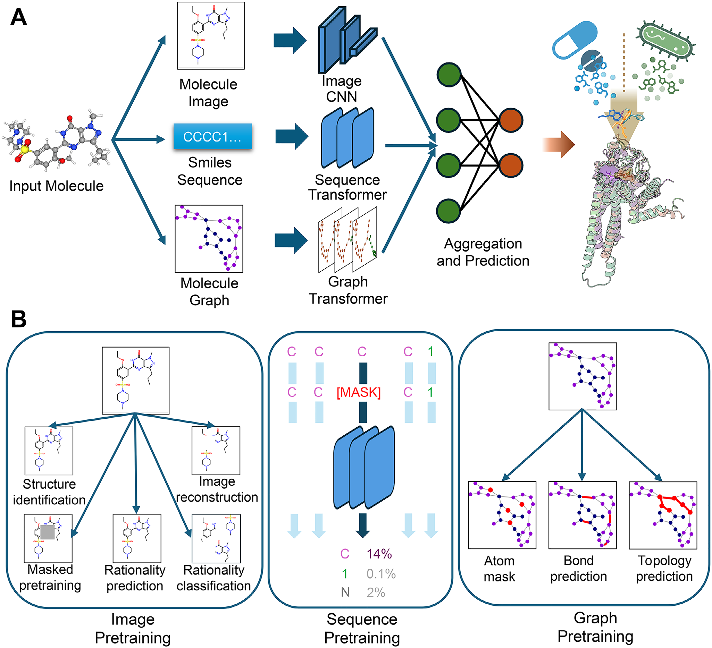
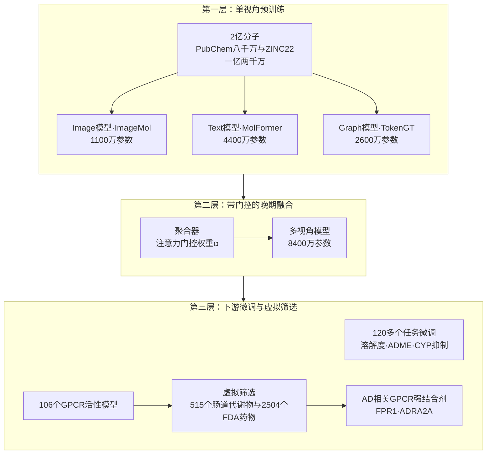
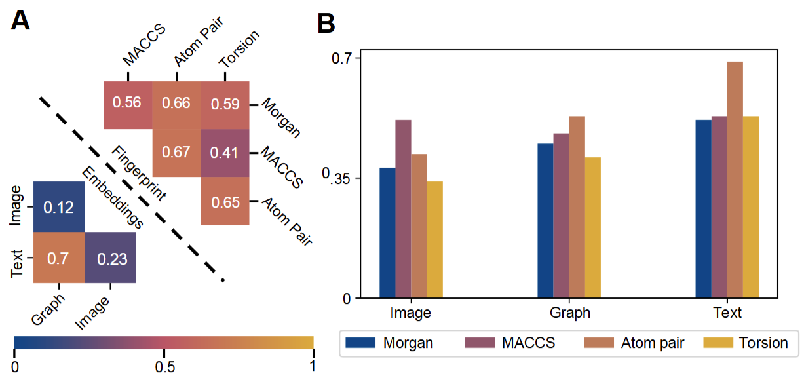
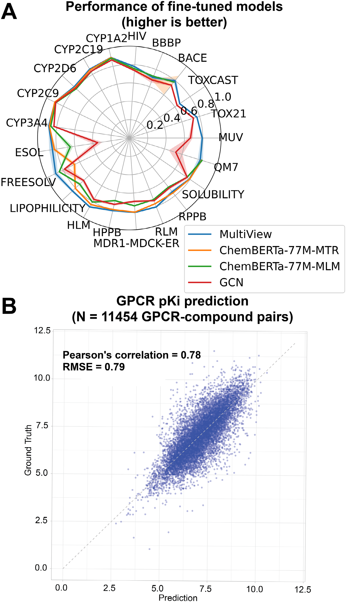
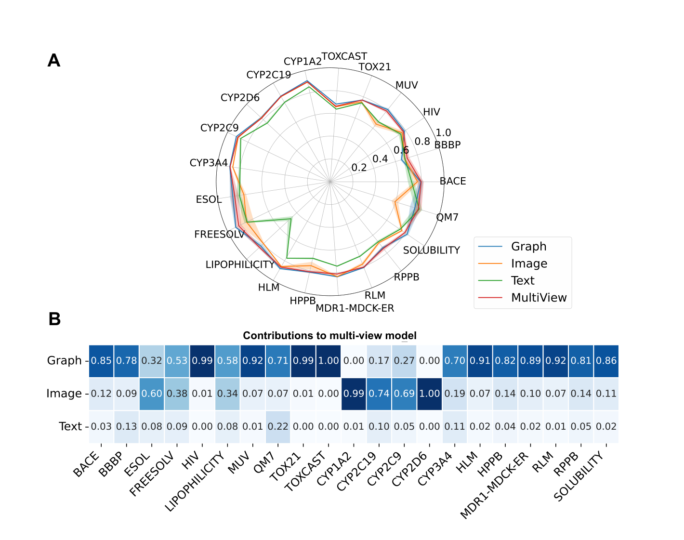
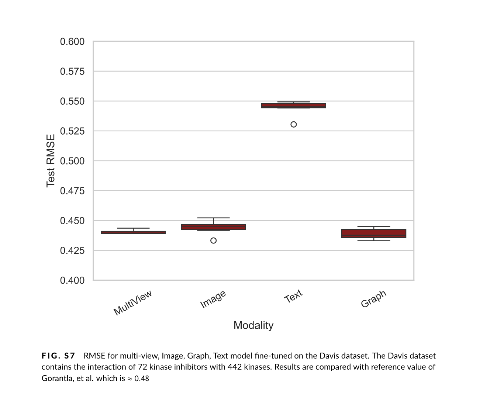
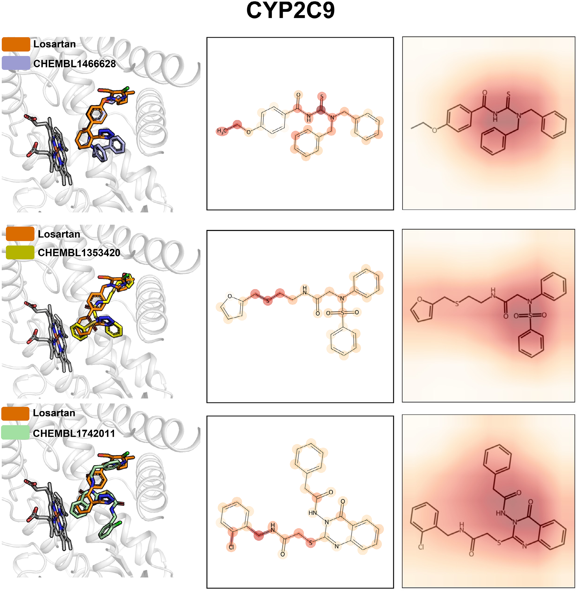
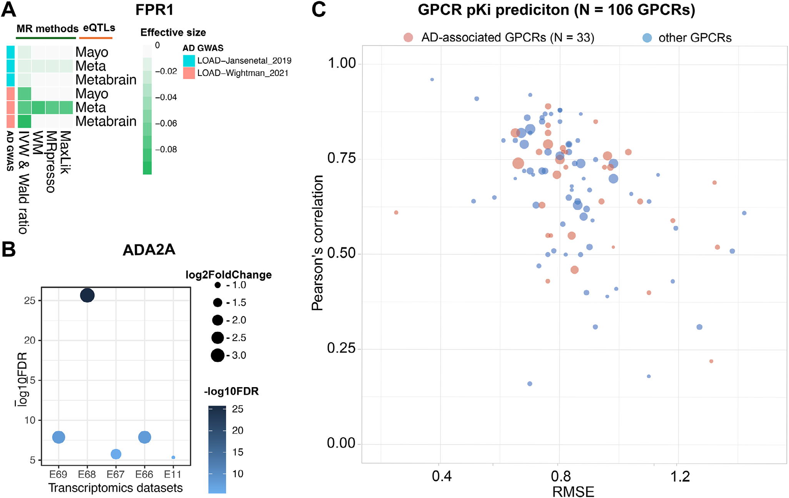
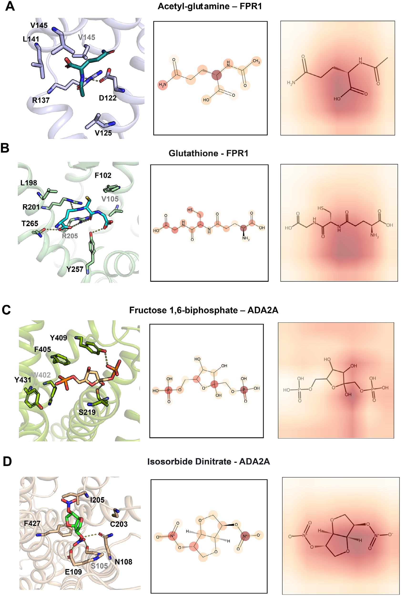

# IBM提出MMELON：图、图像、文本晚期融合的多视角分子基础模型，在120多个下游任务上稳健不掉队

## 本文信息

- **标题**：多视角生物医学基础模型用于分子-靶点及性质预测
- **作者**：Parthasarathy Suryanarayanan, Yunguang Qiu, ..., Feixiong Cheng, Jianying Hu & Joseph A. Morrone
- **发表时间**：2026年1月28日
- **单位**：IBM TJ Watson研究中心（美国）、Cleveland Clinic基因组中心（美国）等
- **引用格式**：Suryanarayanan, P., Qiu, Y., Sethi, S. et al. Multi-View Biomedical Foundation Models for Molecule-Target and Property Prediction. *Adv. Sci.* 2026, 13(14), e17840. https://doi.org/10.1002/advs.202517840
- **代码与数据**：https://github.com/BiomedSciAI/biomed-multi-view；https://huggingface.co/ibm-research/biomed.sm.mv-te-84m

## 摘要

> 分子基础模型（Molecular Foundation Models）有望为生物医学研究中大量且多样的下游任务提供准确预测。高质量的分子表征是关键，而基础模型的开发通常只聚焦于单一表征或分子视角（view），这在特定任务上可能存在优势或不足。本文提出MMELON，**一种整合预训练图、图像和文本基础模型的多视角分子嵌入晚期融合方法**，且可轻松扩展至更多视角和模型。该多视角模型**在超过120个任务上进行了稳健验证**，涵盖分子溶解度、ADME性质和针对G蛋白偶联受体（GPCR）的活性。GPCR模型阵列被用于虚拟筛选，以寻找**与阿尔茨海默病相关GPCR结合的配体**。研究识别出若干此类靶点，并利用多视角模型从化合物筛选中选出强结合剂，预测结果**用基于结构的建模和关键结合基序识别做了验证**。

### 核心结论

- **晚期融合比单项最强更重要**：在120多个下游任务上，多视角模型匹配或超越表现最好的单视角模型，**且未在任何数据集上产生明显变差的结果**。
- **图视角是整体最强单视角**，在多数任务中也是多视角模型权重最大的贡献者；**图像视角与图、文本相关性最低**，是融合增益的主要来源。
- **贝蒂数预训练**：作者称据其所知首次把拓扑不变量（贝蒂数）用于分子图基础模型的预训练，**让模型在原子级别捕捉更远的拓扑上下文**。
- **从基准走到虚拟筛选**：为106个GPCR靶点建立活性预测模型阵列，**用于阿尔茨海默病相关GPCR（FPR1、ADRA2A）的筛选**，得到乙酰谷氨酰胺、谷胱甘肽、果糖-1,6-二磷酸、硝酸异山梨酯等候选。

## 背景

分子基础模型是药物发现近年最热的方向之一。这类模型先在大规模无标注分子上做自监督预训练，学到通用表征，再针对具体下游任务微调。分子基础模型的核心假设是，**好的分子表征应当能同时服务多种下游性质预测任务**。于是问题变成了用什么形式来表征分子。

主流选择包括SMILES字符串、分子图、2D图像和分子指纹，每一种都只捕捉分子结构的一个侧面：

- **SMILES字符串**：擅长捕捉序列依赖和语法信息，但缺乏空间几何信息；
- **分子图**：天然适合表达原子连接关系和拓扑结构，但传统GNN难以扩展到基础模型规模；
- **2D图像**：保留分子的视觉布局和官能团空间排布，与化学家的直觉一致；
- **分子指纹**：固定长度向量编码局部子结构，计算高效但信息受限。

此前的多视角工作各有局限。有的只拼两种视角，有的用联合训练导致模态间干扰，有的只做小规模监督训练，没上到基础模型级别的预训练，**评测范围也往往只有6到14个MoleculeNet或ADMET端点**。几个典型例子：

- **DLF-MFF**：融合指纹、2D图、3D空间图和图像四个模态，但编码器很小，用纯监督目标训练；
- **PremuNet**：整合1D、2D、3D分子视角，同样缺少现代分子基础模型的容量与模块化；
- **CGIP与MoleSG**：用对比或重建目标预训练多模态架构，但只覆盖两个视角，且都在单个联合训练的骨干里完成，没法独立预训练、也不能即插即用。

依赖3D构象的方法（如PremuNet、DLF-MFF）在超大化合物库上构象生成成本高，还可能引入数据集相关的伪影。作者在Table S1里把代表性多视角方法在输入模态、编码器架构、融合策略和评测范围上逐项对比，这些差异正是本文想要甩开的包袱。**能否构建一个模块化、可扩展、可解释的多视角分子基础模型**，并在足够广的任务上验证其稳健性，仍未解决。

### 关键科学问题

- **单视角表征的边界在哪里**：SMILES擅长序列语法、分子图擅长拓扑连接、2D图像保留官能团的空间排布，三种表征看到的是分子的不同侧面。**哪种视角在什么任务上更关键，此前没有在同一套预训练规模和评测协议下被系统比较过**。
- **融合一定要付出联合训练的代价吗**：已有方法把多个模态放进同一个骨干联合训练，换来性能的同时也带来模态干扰，任一路升级都要重训整网。独立预训练加晚期融合能不能两头都占，是本文真正要回答的。
- **多视角的收益是普遍的，还是只在个别任务上出现**：若多视角模型只在少数任务上领先、在其余任务上掉队，它就只是一个更贵的单视角模型。**难点不在训练，而在评测的广度**，这正是本文铺开120多个任务的理由。
- **从基准走到筛选还缺哪一环**：性质预测的指标好看，不等于能对具体靶点给出可信的候选分子。要把它当成筛选工具，还需要把预测落到结合构象和关键基序这一层。

### 创新点

- **模块化多视角基础模型的晚期融合**：三个独立预训练的图、图像、文本基础模型通过带可学习门控权重的聚合器组合，**支持即插即用地升级任一单视角**。
- **迄今覆盖数据集最多的下游任务验证**：在120多个数据集上微调，覆盖溶解度、ADME、CYP抑制、GPCR活性等多种任务，**远超已有工作的评测范围**。
- **贝蒂数预训练**：作者称据其所知首次把拓扑不变量引入分子图基础模型的预训练任务，**给原子级表示补上拓扑上下文**。
- **从基准到实践**：建立106个GPCR靶点的活性预测模型，并应用于阿尔茨海默病相关GPCR的虚拟筛选，**筛出有实验证据支持的候选结合分子**。

---

## 研究内容

MMELON要回答的，就是这样一个问题：把多个独立预训练的分子视角拼起来，**能不能既比单个视角更稳，又不牺牲任何单项表现**？我们从单视角预训练与融合讲起，在120多个任务上检验其稳健性，再用CYP2C9确认模型认出了真实化学特征，并把它用于阿尔茨海默病相关GPCR的虚拟筛选。

### 三个独立预训练的单视角模型

MMELON的设计思想是**把单视角预训练与多视角融合解耦**。框架分两层，第一层是三个各自独立预训练的基础模型。

**图1：多视角架构与预训练策略**。（A）输入分子分别以分子图像、SMILES序列、分子图三种方式编码，经Image CNN、Sequence Transformer、Graph Transformer得到嵌入，再由聚合器模块组合成统一嵌入供下游任务微调。（B）三种单视角模型的预训练任务：Image侧含结构识别、图像重建、掩码预训练、合理性预测与合理性分类；Sequence侧为掩码token预测，并标注了各类token的占比（碳约14%、氮约2%）；Graph侧含原子掩码、键预测与拓扑预测。

- **Image模型**：采用ImageMol架构，ResNet-18卷积骨干，在从PubChem挑选的1000万分子上通过五种自监督任务预训练，参数量1100万，**这里直接使用ImageMol公开的checkpoint**：
  - **多粒度聚类分类**：用MACCS指纹（166位）在不同粒度上生成伪标签，**让模型区分分子**；
  - **分子合理性判别**：判断分子图像是否对应合理、有效的分子结构；
  - **拼图预测**：把打乱的分子图像重新排列，**以学习空间关系**；
  - **掩码对比学习**：要求被遮罩的图像与其未遮罩原图**在隐空间一致**；
  - **图像重建**：强制图像与其编码**相互一致**；
  - 输入图像由RDKit生成，统一到224×224像素；训练时做随机裁剪和翻转增强，验证与测试只做中心裁剪。
- **Text模型**：采用MolFormer架构，用标准Transformer堆栈处理SMILES序列，配旋转位置编码和线性注意力，把token嵌入到768维。分词器基于正则表达式切出原子、键与环等子结构，在2亿分子上以掩码语言建模预训练（随机掩码15%的token），**参数量4400万**。
- **Graph模型**：采用TokenGT架构，把化学键图当作token序列输入Transformer，用拉普拉斯特征向量作位置编码。节点特征编码原子序数、手性、度数、形式电荷与杂化状态，边特征编码键型、键方向、立体化学、共轭与是否成环，再用分类嵌入映射到512维（每个特征映射到128维空间）；位置信息直接由拉普拉斯特征向量承载，不走图结构专用的Transformer改造那条路，其余层是标准Transformer，让显式特征与自注意力结合，无需在token级重新学习易算特征。**参数量2600万**。预训练含三个任务：
  - **节点与边特征掩码预测**：以85%的掩码率遮盖原子与键属性，**让模型重建**；
  - **损坏边预测**：随机篡改15%的边，**模型需识别哪些边被改动过**；
  - **贝蒂数预测**：预测每个节点邻域子图的拓扑不变量（连通分量数与独立环数）。

三个模型的规模与预训练设定对比如下：

| 视角    | 架构                 | 参数量   | 预训练任务                          |
| ----- | ------------------ | ----- | ------------------------------ |
| Image | ImageMol，ResNet-18 | 1100万 | 多粒度聚类分类、合理性判别、拼图预测、掩码对比学习、图像重建 |
| Text  | MolFormer          | 4400万 | 掩码语言建模（15%token被掩码）            |
| Graph | TokenGT            | 2600万 | 特征掩码（85%）、损坏边预测（15%）、贝蒂数预测     |
| MultiView | 聚合器+MLP      | 8400万 | 次级预训练：嵌入重建任务初始化权重       |

预训练数据共2亿分子，构建流程分两路：

- **PubChem 8000万**：取每个分子的最大片段、去重，再按类药性规则筛选（分子量不超过600 Da、氢键供体不超过5、氢键受体不超过10、可旋转键不超过10）；
- **ZINC22 1.2亿**：从包含370亿分子、只收重原子数少于30类药分子的超大规模库中随机采样，密集覆盖类药化学空间。

一个相关的缩放经验：MolFormer仅用10% ZINC加10% PubChem训练，下游表现就几乎追平在10倍数据量上训练的版本，**提示继续扩大预训练数据可能出现边际收益递减**。Graph与Text各预训练3个epoch，且共享同一批预训练数据。

贝蒂数预测是本文的新任务。它来自单纯同调，用来描述图的拓扑性质：$\beta_0$ 是连通分量数，$\beta_1$ 是独立环数。模型对每个节点 $v_a$ 预测其邻域子图的贝蒂数，例如某节点处 $\beta_0=1$、$\beta_1=1$（一个连通分量、一个环），另一节点处 $\beta_0=2$、$\beta_1=0$（两个连通分量、没有环）。**这些数字同时提供局部与全局的结构信息，让原子级表示能捕捉更远的拓扑上下文**。

### 晚期融合：带门控权重的聚合器

第二层是融合。三个单视角嵌入经一个注意力式聚合器组合，**各视角的权重由softmax给出**：

$$
\alpha^m = \mathrm{softmax}(w^m), \quad w^m = \dfrac{1}{B}\sum_{i \in \mathcal{B}} \mathbf{q}^T \cdot \tanh\left(\mathbf{W}\dfrac{z_i^m}{\|z_i^m\|^2} + \mathbf{b}\right)
$$

其中 $z_i^m$ 是第 $m$ 个视角的嵌入，$\alpha^m$ 是该视角的权重，$B$ 是批大小。**多视角嵌入为各视角嵌入的加权和**，再过一个多层感知机：

$$
z_i^{mv} = \mathrm{MLP}\left[\sum_{m \in \mathcal{M}} \alpha^m z_i^m\right]
$$

聚合器本身也做了一次次级预训练：在1000万分子上用嵌入重建任务初始化权重，**能提升微调时的稳健性**。预训练结束时，图像、图、文本的权重依次为0.6、0.3、0.1，**这个顺序反映的是各视角从组合嵌入中被重建的难易**，与图像和另外两个视角相关性最低的观察一致。

> **公式与开源实现的差异**：论文公式(1)是简化表述——三路嵌入维度并不相同（图512、图像512、文本768），无法直接相加。当前开源实现（`coeff_mlp`）把三路先各自投影到512维、按上述softmax权重缩放后拼接成1536维，再降维到512维送入MLP，而非直接求和。

为什么用晚期融合？作者比较了四种策略，在8个微调任务上默认架构整体最好：

| 策略          | 门控网络输入       | 融合方式     |
| ----------- | ------------ | -------- |
| 默认多视角（本文采用） | 各视角嵌入，注意力式门控 | 加权拼接后降维再过MLP（论文公式简化为加权和） |
| 无投影门控       | 原始表示直接拼接     | 加权拼接     |
| 投影门控        | 各视角投影到最低维后拼接 | 加权拼接     |
| 投影门控加特征相加   | 投影后拼接再算权重    | 末级用加权和   |

解耦的好处在于，**各视角独立预训练可避免联合训练的模态干扰**，还能即插即用地替换任一单视角。这是此前联合训练的多模态模型做不到的。

上面这套架构是否真能稳住，要放到大量任务上检验；在那之前，先看三个视角本身是否互补。

### 单视角互补性分析

融合之前，作者先看三个单视角嵌入之间的关系，**在1万个分子上计算欧氏距离的相关矩阵**，图S3给出了结果。

**图S3：视角间与指纹间相关性**。（A）下三角为三个单视角嵌入之间的相关矩阵，上三角为四种指纹（Morgan、原子对、MACCS、拓扑扭转）之间的相关，颜色越暖表示相关性越高。（B）四种指纹与Image、Graph、Text三个预训练嵌入的相关性，蓝色为Morgan、紫色为MACCS、橙色为原子对、黄色为拓扑扭转。

- **图与文本高度相关**（$c=0.7$），**说明这两种表征对分子相似性的描述有较大重叠**；
- **图像最独特**，与图、文本的相关性都低，图-图像为0.12、文本-图像为0.23；
- 四种指纹之间整体只是中等相关，其中原子对指纹与其他指纹最相关，**说明它们描述分子的角度确实不同**。

与专家设计的分子指纹比较时，预训练嵌入呈中等相关，说明它们确实捕捉了化学知识。其中Text相关性最高，Graph次之，Image最低；图像与MACCS指纹相关性最高，这与ImageMol的一个预训练任务用到了MACCS指纹一致。不过指纹都由有限的手工特征构成，多视角嵌入本就为了求更丰富、更灵活的表示，不必去复刻已有描述符。所以图像视角给出了图与文本都捕捉不到的信息，**成了融合增益的主要来源**。

### Benchmark数据集和方法

作者在四类任务上**微调MMELON**，重点看它在不同任务类别上是否都能稳住：

- **MoleculeNet任务（共10个基准：4个回归、6个分类）**：回归4个：溶解度ESOL、水合自由能FREESOLV、脂溶性LIPOPHILICITY，以及量子化学QM7；分类6个：BACE、BBBP、HIV、MUV、TOX21、TOXCAST。**QM7属量子化学回归，其余三个为物化性质回归**；官方代码还支持ClinTox、SIDER、QM9等，但主文Fig.2实际只报这10个，**复现应以这10个为准**。
- **CYP抑制任务（分类）**：CYP1A2、CYP2C19、CYP2C9、CYP2D6、CYP3A4五种细胞色素P450同工酶的抑制预测，**这些酶在药物代谢中至关重要**，指标用ROC-AUC。
- **ComputationalADME任务（回归）**：人肝微粒体稳定性HLM、血浆蛋白结合HPPB与RPPB、MDR1-MDCK外排比等ADME性质，指标用RMSE或MAE。
- **GPCR活性任务（回归）**：从ChEMBL与GLASS收集106个GPCR靶点的实验结合强度数据，每个靶点作为独立回归任务微调，指标用Pearson相关系数与RMSE；**它单独就有106个靶点，在120多个任务里占了绝大多数**，下文单列“GPCR大规模建模与虚拟筛选”详述。

对比对象包括ChemBERTa-77M-MLM、ChemBERTa-77M-MTR和用PyTorch Geometric实现的GCN基线。**评测设置主要围绕四件事展开**：

- **下游预测头（同一框架、换头即换任务）**：MMELON是**同一个预训练encoder框架**，针对不同任务更换预测头、损失函数与评价指标，这与BERT类模型的常见做法一致。组合嵌入 $z_i^{mv}$ 之上接一个任务特定的轻量预测头（论文尝试过linear head与MLP head），分类与回归走两条不同的路：
  - **分类分支**：$\hat{y} = \sigma(\mathrm{Head}(z_i^{mv}))$，输出类概率，训练用交叉熵损失，评测用ROC-AUC（如BACE、HIV以0.5为阈值做二分类分析）；
  - **回归分支**：$\hat{y} = \mathrm{Head}(z_i^{mv}) \in \mathbb{R}$，输出连续值，训练用均方误差，评测用RMSE或MAE（如ESOL、QM7）。
  - **真正共享的是前面的预训练表征骨干**，最后一层与训练目标随数据集类型变化；论文明确说明Graph、Image、Text与MultiView都作为预训练encoder参与下游**端到端微调**，不像有的做法提取一次嵌入就冻结。
- **数据切分**
  - MoleculeNet用按尺寸排序的scaffold切分（ligand_scaffold）：先按Bemis-Murcko骨架把分子分组，再按每组分子数从大到小依次分到训练/验证/测试（0.8/0.1/0.1），**同一骨架绝不跨训练与测试，因此比随机分子切分更接近“预测没见过的新骨架”**；
  - CYP和GPCR用平衡scaffold切分（ligand_scaffold_balanced，0.8/0.1/0.1）：照样先按骨架分组，但把超过验证/测试集容量一半的大骨架组与其余小骨架组**分别打乱**，再按预算依次填满三个集合，避免按尺寸排序时小骨架全挤进测试集；ComputationalADME**因scaffold聚类会产生大量单例而改用随机切分**（0.7/0.1/0.2）；
- **随机种子与公平性**
  - 数据切分是固定的，**5个种子重复的是模型微调（不同随机初始化），并非重新切分**；所有结果取5次独立微调的均值与95%置信区间；
  - **两个ChemBERTa对照也用官方脚本在同一套固定切分上重新微调，没有只提取嵌入后训练随机森林**；需说明ChemBERTa微调脚本不便处理多任务数据集，故MUV、TOX21、TOXCAST未纳入ChemBERTa对照（仅MMELON一侧有这些端点）
  - 分类任务用RobertaForSequenceClassification、回归任务用RobertaForRegression（num_labels=1），默认freeze_base_model=False，整个ChemBERTa骨干随下游任务一起更新，不冻住只训最后一层；
- **超参搜索**
  - 用Ray-Tune搜索，优化器为AdamW并带权重衰减；**多视角因含多个子网络，微调时最多用到4个不同学习率**，学习率 $\eta \in [10^{-5},\,10^{-3}]$；
  - ChemBERTa对照沿用官方脚本，最多训练100个epoch、早停耐心10个epoch；模型配置按5个种子的平均验证表现择优，测试结果与其他模型一并汇总5次独立微调并报告95%置信区间。

各方法在Fig.2里的表征来源与下游预测方式对比如下：

| 方法 | 表征来源 | 下游预测方式 |
| --- | --- | --- |
| MMELON MultiView | Graph、Image、Text三视角融合嵌入 | Linear/MLP head，并端到端微调 |
| MMELON Graph | TokenGT类graph encoder | Linear/MLP head，并微调graph encoder |
| MMELON Image | ImageMol/ResNet-18 encoder | Linear/MLP head，并微调image encoder |
| MMELON Text | MolFormer类SMILES transformer | Linear/MLP head，并微调text encoder |
| ChemBERTa-77M-MLM | ChemBERTa SMILES transformer | Roberta分类/回归head，整个模型微调 |
| ChemBERTa-77M-MTR | ChemBERTa-2 MTR预训练模型 | 同样用task-specific head并微调 |
| GCN baseline | PyTorch Geometric GCN直接学graph特征 | task-specific输出层，端到端训练 |

> **Fig.2比的是整条基础模型流水线，不是单独比表征**：MMELON一侧representation、head与优化过程一起变化，ChemBERTa一侧同样representation、head与优化一起变化，因此图上的差距不能简单归因于“谁的表征更好”。

### 120多个任务上的性能

由于分类用ROC-AUC、回归用RMSE或MAE，两类指标量纲不同，作者把回归指标按 $m' = 1 - (m - m_0)/s$ 缩放到与ROC-AUC可比的量程，**各数据集的偏移与缩放因子各不相同**：ESOL为(0.7,1.0)、FREESOLV为(1.5,5.0)、LIPOPHILICITY为(0.50,1.0)、QM7为(55.0,100.0)，六个ComputationalADME数据集统一取(0.30,1.0)，这样图2A才能把两类指标画在同一张图上。

**图2：多视角模型在多种下游任务上的性能**。（A）雷达图对比多视角模型（蓝）、ChemBERTa-77M-MTR（橙）、ChemBERTa-77M-MLM（绿）与GCN（红）在多种下游任务上的表现，分类任务用ROC-AUC、回归指标经缩放到与ROC-AUC同量程，越靠外越好。（B）GPCR数据微调模型的预测值与实验`pKI`的相关性，覆盖11454个GPCR-化合物对，Pearson相关系数0.78、RMSE 0.79。

- 多视角模型**明显超过GCN，也整体优于两个ChemBERTa**，在FREESOLV、LIPOPHILICITY、RLM、HLM等回归任务上优势明显；
- **稳健性体现在不犯大错**：多视角模型匹配最佳单视角，且未在任何测试数据集上产生差结果；
- **图模型是整体最强单视角**，只在少数任务（如BBBP、QM7）略逊于其他单视角；
- CYP抑制预测的ROC-AUC在0.82到0.90之间，**与当前最优方法相当**。

作者还读取了聚合器里各视角的权重，**图模型在多数任务中权重最高**，与它是最强单视角的观察一致；对于CYP模型，图与图像几乎同等重要。文本模型除QM7外多数时候贡献较小。

**图S4：单视角与多视角模型对比及视角权重**。（A）雷达图展示Graph（蓝）、Image（橙）、Text（绿）、MultiView（红）在多种下游任务上的表现。（B）各任务下三种视角对多视角模型的贡献权重热图，颜色越深表示权重越高。

### 药物-靶点相互作用实验

MMELON还能与蛋白序列嵌入组合，处理药物-靶点相互作用（DTI）任务。蛋白侧用ESM-1b产出每残基1280维的序列嵌入，再过一个一维卷积编码器（CNN_esm：三层卷积沿残基序列滑动、全局最大池化成定长、末尾两段全连接）压成64维向量；配体侧用本文的多视角或单视角模型过一层全连接层产出64维嵌入，两者直接拼接成128维，送进一个纯全连接的预测头（两层隐藏层1024→512，输出1）回归Davis的$K_d$。蛋白与配体各取64维这个设定沿用Ref.[57]的序列框架并减半，原框架用双倍大小的128维，作者没有针对维度单独做消融。**这里检验的正是小分子嵌入本身能驱动多少性能**。

- **数据集**：Davis数据集，覆盖72个激酶抑制剂与442个激酶的结合强度；
- **训练设置**：蛋白与各视角的权重按Xavier方式逐步解冻，批大小64、学习率0.0005，Text模型用批大小128、学习率0.00001，训练2000个epoch，**取验证集最优模型预测测试集**；
- **评估方式**：六折交叉验证，每折用六分之一作验证、六分之一作测试，**结果在六折上取平均**；
- **主要结果**：多视角模型的测试RMSE**优于一个SOTA GNN实现**（图S7）；Image与Graph两个单视角同样低于参考值，文本视角约0.55，明显更高。

**图S7：Davis数据集上的测试RMSE**。四个变体（MultiView、Image、Text、Graph）微调后的测试RMSE箱线图，与Gorantla等[57]报告的SOTA GNN参考值≈0.48对比；各变体数值由图中读出。

> 这项实验说明，**多视角小分子嵌入本身的贡献就相当可观**，蛋白侧更像补充。图S7里蛋白嵌入是固定的（直接沿用[57]的ESM-1b+CNN编码），四个变体只在配体嵌入上不同：图视角与图像视角都落在参考值之下，换成文本视角则明显更差，差异全由配体嵌入决定。

### CYP2C9结合模式验证

模型的预测是否对应真实化学，需要单独验一验。作者挑了CYP2C9深入剖析，**它约占肝脏P450总量的20%**，参与S-华法林、双氯芬酸、甲苯磺丁脲、苯妥英、布洛芬、氯沙坦等一大批常用药的氧化代谢。

- **催化什么反应**：CYP2C9属于细胞色素P450单加氧酶，活性中心是血红素铁；它把氧分子的一个氧原子插进底物（羟化或环氧化），另一个氧原子还原成水，电子由NADPH经P450还原酶提供。氯沙坦正是靠这一步被氧化成活性代谢物E-3174才起降压作用。
- **模型表现**：CYP2C9抑制预测是个二分类任务，**ROC-AUC达到0.90**；
- **验证怎么做**：把分类模型排在最前的三个高活性分子（CHEMBL1466628、CHEMBL1353420、CHEMBL1742011）用AutoDock Vina对接进CYP2C9，与已报道的氯沙坦复合物晶体结构（PDB: 8VX0，2024年解析、分辨率3.05 Å，结合的是CYP2C9*14变体）逐个比对。

这个比对的看点是**参照物本身就是个底物**：8VX0里氯沙坦坐在血红素上方的催化位点，那个位置就是氧化反应发生的地方。模型挑出的分子对接后落在同一个口袋、姿态相仿，等于说它们**可能和底物抢同一个位置**，也就是竞争性抑制的样子；对在研化合物来说，占住这个位点意味着与华法林、双氯芬酸这类窄治疗窗药物同服时，**对方的代谢被压下去、血药浓度升高**，这是药物相互作用最常见的来源之一。这条证据的边界也要讲清楚：对接构象本身是预测出来的，这几个分子并没有自己的共晶结构。

> **模型没见过结构信息，却筛出了落在催化位点的候选**：CYP2C9抑制模型训练时只有“抑制/不抑制”标签，输入里没有蛋白结构、也没有对接姿态；它排出来的高活性分子经独立分子对接后，仍落在与氯沙坦相同的催化位点，两路注意力热图的高注意力区也都指向那里。

**图3：CYP2C9结合模式验证**。左列为模型预测的生物活性分子的对接构象与晶体结构（PDB: 8VX0）对比，中列为图视角注意力热图，右列为图像视角注意力热图，颜色越深表示注意力越高；血红素与催化位点分别用licorice和ribbon风格渲染，并标注了所选分子的ChEMBL ID。

### GPCR大规模建模与虚拟筛选

GPCR是最重要的药物靶点家族之一。作者从ChEMBL和GLASS收集了106个GPCR靶点的实验结合强度数据，**每个靶点作为独立的回归任务微调MMELON**。建模前做了几层过滤：

- 生物活性测量数少于100的GPCR不予考虑；
- 分子量大于600 Da的分子剔除，与筛选用代谢物和药物的性质范围相称；
- 数据点少于50的数据集整体移除；
- 每个靶点单独切成训练/验证/测试三份，沿用与CYP一致的平衡scaffold协议（0.8/0.1/0.1）。

模型阵列建好后，先在整体和AD相关子集上分别评估：

- **GPCR模型性能**：整体Pearson相关系数0.78，平均RMSE 0.79；**超过80%的模型RMSE小于1，近70%的模型相关性大于0.6**；
- **33个AD相关GPCR**的表现与整体相当，Pearson相关系数0.67、平均RMSE 0.88。

阿尔茨海默病相关GPCR的识别来自两路证据。遗传学侧用孟德尔随机化，基于408个GPCR、4套人脑皮层cis-eQTL数据和3套AD GWAS汇总统计量，评估GPCR对AD的因果效应；多组学侧基于AlzGPS数据库里88套批量与单细胞转录组或蛋白质组数据做差异表达分析，差异表达基因的阈值设为校正 $p < 0.05$、$|\log_2 \mathrm{FC}| \ge 0.25$。**两路证据（遗传学或多组学）中任一路较强的GPCR即被纳入，最终得到33个**。

**图4：AD相关GPCR的证据与模型性能**。（A）FPR1的孟德尔随机化结果，横轴为MR方法与eQTL数据集，颜色深浅表示效应量，红色为AD GWAS来源（Jansen 2019、Wightman 2021）。（B）ADRA2A（论文图4B记作ADA2A）的转录组证据，圆点大小表示 $\log_2 \mathrm{FC}$、颜色深浅表示 $-\log_{10} \mathrm{FDR}$，覆盖E69、E68、E67、E66、E11五个数据集。（C）106个GPCR靶点的Pearson相关系数与RMSE散点，红点为33个AD相关GPCR，蓝点为其他靶点。

> **这套GPCR模型阵列不只是评测产物，更是可复用的筛选面板**。训练完成后，任何新化合物都能快速得到对106个靶点的活性预测，在实验之前先把候选范围收窄。

选定靶点后，作者用MMELON筛选515个肠道代谢物和2504个FDA批准药物。**结合构象验证由分子对接完成**：FPR1和ADRA2A的3D结构取自AlphaFold2数据库，小分子与蛋白的预处理沿用作者此前的工作，对接由AutoDock Vina 1.1.2完成，取排名前十的结合模式中最佳构象，再用PyMOL 3.0.3做结合分析。

文章特意从肠道代谢物和已批准的FDA药物里找候选，也是出于实用考虑。这两类分子的人体暴露与安全性多有数据积累，比全新分子距离验证和转化更近。**从已有安全分子中筛选新的适应症，是药物重定位的经典策略，风险更低、周期更短**。

- **FPR1（甲酰肽受体1）**：遗传学证据（孟德尔随机化）显示FPR1表达升高与较低的AD风险相关（$\beta = -0.1$，$\mathrm{FDR} = 0.001$；论文图4A约定效应量为负代表表达升高降低患病可能性，正文却写作“风险增加”，疑为笔误）。从肠道代谢物中筛出乙酰谷氨酰胺（多视角评分6.8），它在*Ruminococcus gnavus*中丰度高，该菌株单定植小鼠在空间工作记忆测试中表现更好，而Aβ蛋白过表达与*R. gnavus*减少相关；对接显示其结合在FPR1的变构位点，区别于经典位点。FDA药物中筛出谷胱甘肽（GSH，多视角评分6.53），在FPR1经典位点形成强氢键；GSH耗竭已在轻度认知障碍和AD患者海马区被观察到。该任务中图像（$\alpha=0.51$）和图（$\alpha=0.39$）**是主要贡献视角**。
- **ADRA2A（α2A肾上腺素能受体；MMELON论文中简记为ADA2A）**：多组学证据显示其在AD中显著低表达（1个人类加4个小鼠转录组数据集）。筛出果糖-1,6-二磷酸（多视角评分7.37），参与糖酵解，在APP/PS1小鼠中下调，在*Mitsuokella*属中含量高，该属在Aβ阳性患者中减少，预测结合在ADRA2A经典位点。另一个候选是硝酸异山梨酯（多视角评分8.21，用于治疗冠心病心绞痛），图像**是主要贡献视角**（$\alpha=0.76$），图视角（$\alpha=0.22$）保留关键功能原子信息，例如果糖-1,6-二磷酸中的磷原子和硝酸异山梨酯硝基中的氮原子。

> **不同靶点的优势视角不同**：门控权重会随任务自行调整，哪个视角更重要由数据决定，不需要人工预设。

**图5：FPR1与ADRA2A强结合剂示例**。（A-B）与FPR1结合的乙酰谷氨酰胺与谷胱甘肽，（C-D）与ADRA2A结合的果糖-1,6-二磷酸与硝酸异山梨酯；每组的左列为对接结合构象，中列为图视角注意力热图，右列为图像视角注意力热图，颜色越深表示注意力越高。

---

## 关键结论与批判性总结

### 核心贡献

- **模块化多视角基础模型MMELON**：把单视角预训练与多视角融合解耦，**支持即插即用地升级单视角**，避免联合训练的模态干扰。
- **覆盖数据集最多的下游验证**：在120多个数据集上微调，**作者称据其所知是分子基础模型领域覆盖数据集最多的应用验证之一**。
- **贝蒂数预训练**：作者称据其所知首次把拓扑不变量用于分子图基础模型预训练，**让原子级表示捕捉更远的拓扑上下文**。
- **从基准到实践**：建立106个GPCR靶点的活性预测模型，用于AD相关GPCR虚拟筛选，**筛出多个有证据支持的候选结合分子**。
- **可读取的门控权重**：通过各视角融合权重了解不同任务中每种表征的重要性，**为后续模型设计提供参考**。

### 局限性

- **缺少3D信息**：所有视角都源自1D（SMILES）或2D（图、图像）表征，未纳入3D构象，**而构象对立体化学和结合模式判断至关重要**。
- **图像视角依赖ImageMol**：图像模型直接用ImageMol公开权重，未在本文的2亿分子上重新预训练，**可能没吃满大规模数据的红利**。
- **GPCR靶点间的选择性未评估**：106个GPCR模型**可能只学到泛GPCR结合特征，没学到靶点特异的结合**。
- **筛选结果未经湿实验验证**：候选分子的结合仅通过分子对接验证，**对接本身存在假阳性风险**。
- **基准对比比的是整条流水线，不是单独比表征**：MMELON与ChemBERTa都端到端微调（representation、head与优化一起变），Fig.2的领先未必来自表征本身；且两者超参数搜索空间不同，**仍可能影响公平性**。
