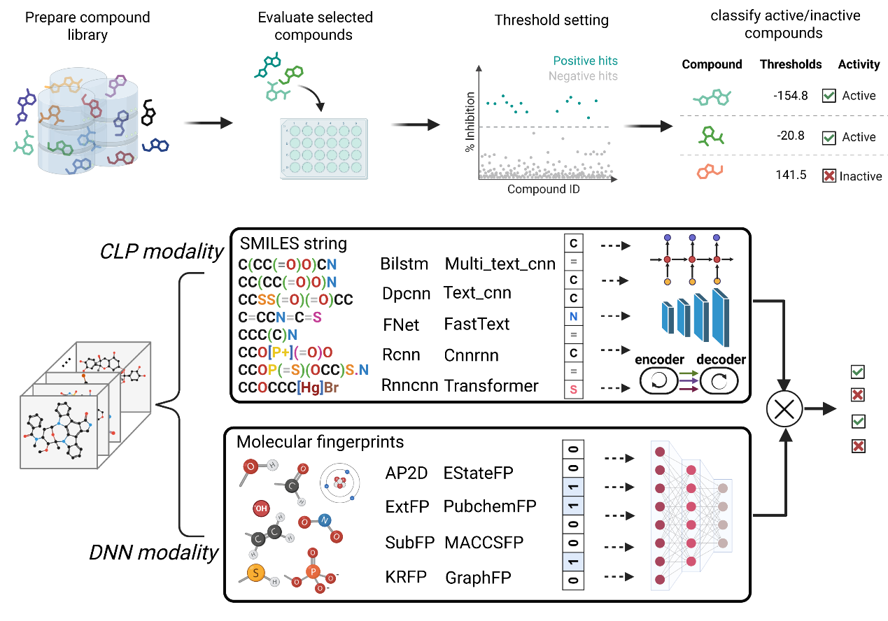
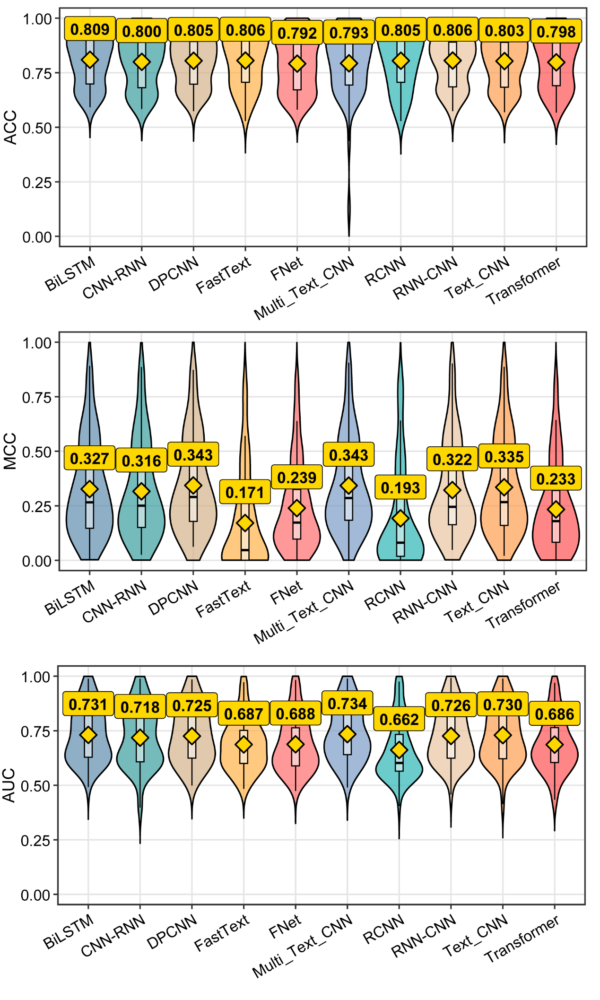
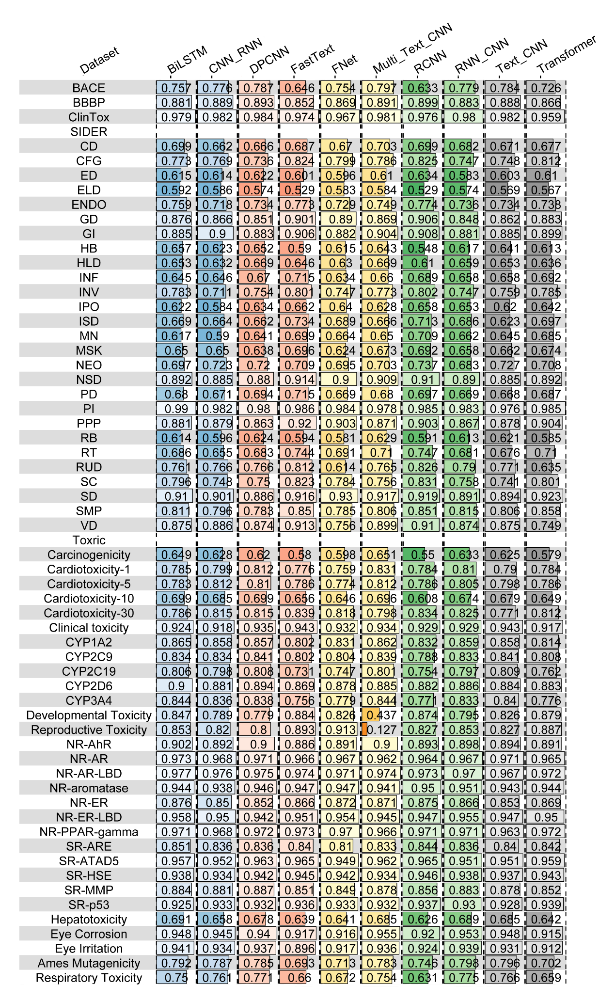
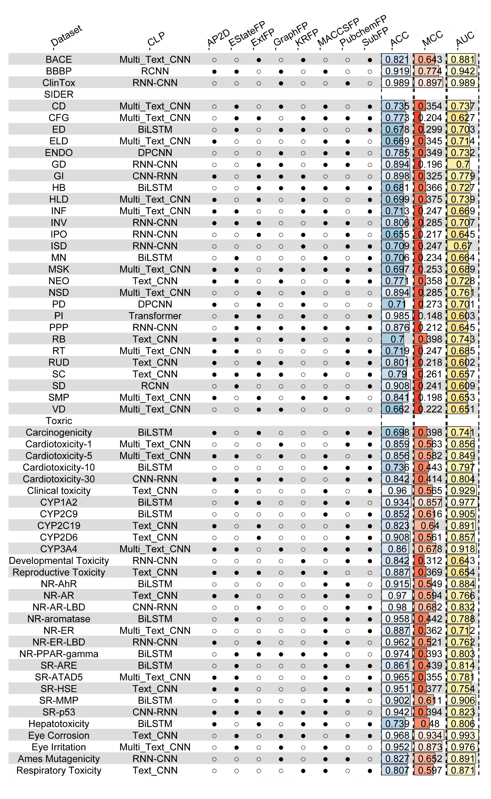
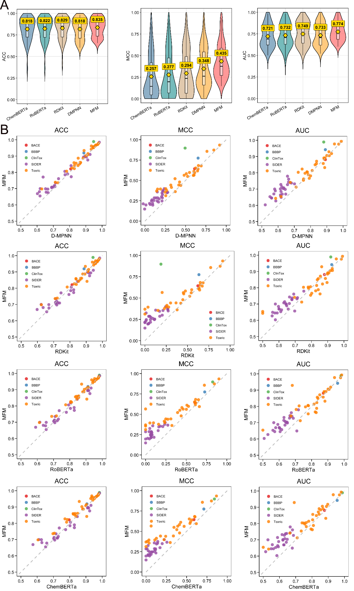
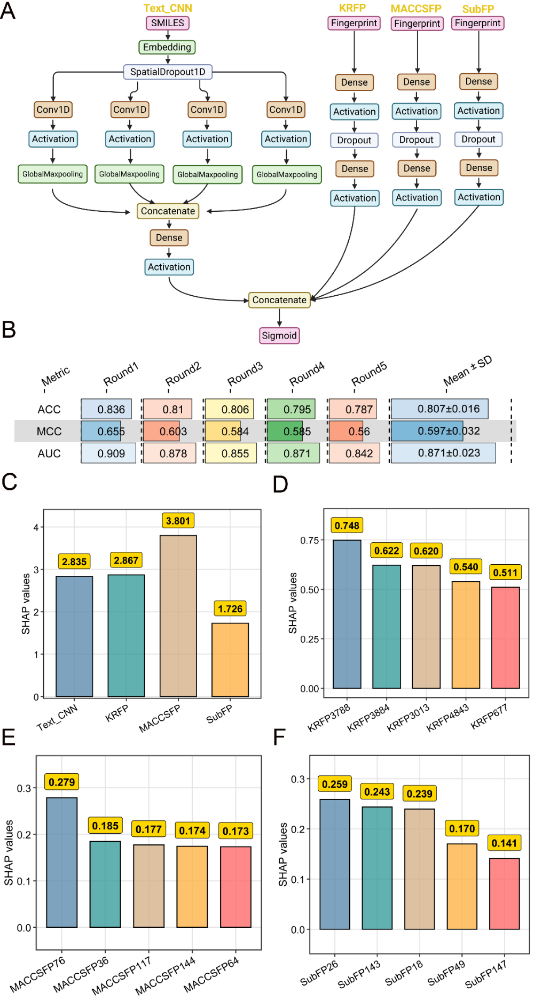
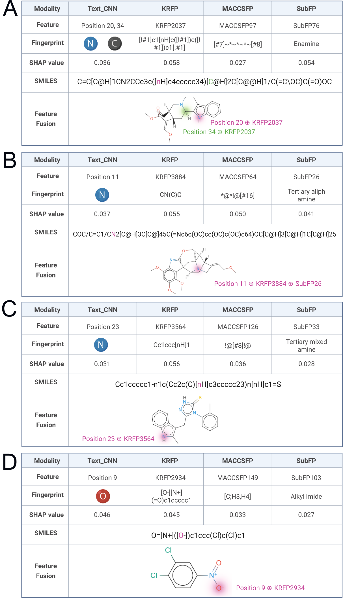

## 本文信息

- **标题**：用于分子性质分类的多模态特征融合
- **作者**：Jing Liu, Li Xue, Yin Wang, Qiaorong Wu, Wenwei Tao, Yiwei Wang, Jianming Wu & Jiesi Luo
- **发表期刊**：Journal of Cheminformatics
- **发表时间**：2026年7月3日
- **DOI**：[10.1186/s13321-026-01256-9](https://doi.org/10.1186/s13321-026-01256-9)
- **单位**：西南医科大学心血管医学研究所、公共卫生学院、基础医学院（中国四川）
- **引用格式**：Liu, J., Xue, L., Wang, Y. et al. Multimodal feature fusion for molecular property classification. J Cheminform (2026). <https://doi.org/10.1186/s13321-026-01256-9>
- **代码与数据**：<https://zenodo.org/records/17877527>

## 摘要

> 准确的分子性质预测是现代化学科学的基石，推动着药物发现、材料设计和环境研究的进展。然而，现有模型大多停留在单模态层面，而多模态方法往往只是简单拼接，未能充分利用分子信息之间的互补性。本文提出了一种多模态特征融合框架，将深度**化学语言处理**（CLP，Chemical Language Processing）模型与分子指纹相结合，系统整合了序列信息和结构信息。与以往启发式组合不同，该框架通过穷举组合搜索对10种CLP架构和8种指纹类型进行了系统评估，以识别最优的协同配置。研究发现，单纯堆叠多个模型并不一定能提升性能——成功的融合需要数据感知的设计，依赖于特征整合与互补性。在MoleculeNet和TOXRIC的60个数据集上，融合模型相比当前最优基线方法取得了一致且显著的提升。

### 核心结论

- **多模态融合有效**：在60个分类任务中，最优融合模型相比最强单模态基线平均MCC从0.348提升至0.434，相对提升24.7%。
- **并非堆砌越多越好**：最优融合配置因数据集而异——同一指纹在某个数据集上是最佳组合的核心，在另一个数据集中反而表现最差。
- **序列与结构互补**：SMILES序列特征捕捉分子语法，指纹特征编码拓扑结构，两者结合可形成更完整的分子表征。
- **可解释性验证**：通过SHAP值分析，模型识别的关键特征（如含氧基团、不饱和键、叔胺）与呼吸道毒性的化学知识一致。

## 背景

分子性质预测是药物研发的核心环节之一。**一个化合物能否成为候选药物，取决于其活性、选择性、溶解性、毒性等性质**。如果能用计算方法在合成之前就预测这些性质，就能大幅减少实验筛选的成本和时间。这正是AI在药物发现中最成熟的应用场景之一。

早期计算方法通常依赖单一分子表征：要么是手工设计的分子描述符，要么是结构指纹，要么是SMILES字符串。每种表征都只捕捉了分子结构的一个侧面：指纹擅长编码局部子结构，SMILES保留了序列依赖关系，描述符则关注整体理化性质。**单一模态的信息始终是不完整的**。

近年来多模态学习兴起，把SMILES编码与指纹、分子图或3D结构结合起来，也确实在多个任务上取得了性能提升。但问题也随之而来：大多数多模态方法只是简单拼接特征，忽略了不同模态之间如何真正协同。更关键的是，**不同数据集中各模态的重要性并不相同**，在一个任务上表现优异的融合策略，换一个数据集可能完全不适用。如何设计一种既能有效整合多模态信息、又能灵活适配不同任务的框架，是当前面临的核心挑战。

### 关键科学问题

- **简单拼接够吗？** 特征拼接是最常见的多模态融合方式，但这种方式能否充分捕捉序列信息和结构信息之间的交互？本文认为，**成功的融合需要数据感知的设计**——不同数据集的最优组合不同，固定的融合规则无法通用。
- **CLP模型间的架构差异如何影响预测？** 化学语言处理模型包含RNN、CNN、Transformer等多种架构。在分子性质预测中，哪种架构更有效？更复杂的模型是否一定更好？本文在60个数据集上系统比较了10种架构，发现**数据规模和类别平衡对预测的影响往往超过模型设计本身**。
- **指纹类型与CLP模型如何协同？** 8种指纹编码了不同层面的结构信息（原子对、电拓扑状态、子结构片段等）。哪种指纹与CLP模型搭配最优？答案是**视数据集而定**。本文通过穷举组合搜索揭示：最优配置在不同任务间差异极大，没有万能组合。

---

## 研究内容

### 核心框架：三模块多模态融合

本文提出的框架由三个互补模块组成：

**图1：多模态融合框架总览**。

- 上半部分是数据准备流程：化合物库经筛选后按抑制率阈值划分为活性和非活性，得到分类任务的标签
- 下半部分是模型框架：CLP模态从SMILES序列学习特征，FCM模态从分子图生成8种结构指纹，两者拼接后经全连接层融合，输出活性/非活性的分类结果

**CLP模块**（化学语言处理，Chemical Language Processing）：将SMILES字符串视为化学语言，用10种深度学习架构（BiLSTM、CNN-RNN、DPCNN、FastText、FNet、Multi_Text_CNN、RCNN、RNN-CNN、Text_CNN、Transformer）提取序列特征。所有模型统一使用128维嵌入和250的最大序列长度。

**FCM模块**（基于指纹的化学模型，Fingerprint-based Chemical Models）：对每个分子生成8种指纹，覆盖连通性、电拓扑态、环系和功能片段等不同侧面。其中CDK指化学开发工具包（Chemistry Development Kit），MACCS指分子访问系统（Molecular ACCess System）：

| 分子指纹                       | 缩写        | 位数   | 编码的结构信息                                  |
| :------------------------- | :-------- | :--- | :--------------------------------------- |
| Atom Pair 2D               | AP2D      | 780  | 不同拓扑距离下的原子对，反映分子的连通方式                    |
| E-State Fingerprint        | EStateFP  | 79   | 电拓扑态片段，量化原子的本征电子态及其化学环境                  |
| CDK Extended Fingerprint   | ExtFP     | 1024 | 在子结构指纹之上补充环结构与同位素质量描述符                   |
| CDK Graph-only Fingerprint | GraphFP   | 1024 | 原子图拓扑，但不包含键序信息                           |
| Klekota-Roth Fingerprint   | KRFP      | 4860 | 预定义的功能片段库，子结构覆盖最细致                       |
| MACCS Keys                 | MACCSFP   | 166  | 关键结构片段与基于重原子的子结构模式                       |
| PubChem Fingerprint        | PubChemFP | 881  | PubChem定义的子结构，含原子计数、键连接性与环系统             |
| Substructure Fingerprint   | SubFP     | 307  | 基于SMARTS的功能基团与环特征，取自Christian Laggner片段库 |

八种指纹**不合并进统一的特征空间**，而是各自接入一个两层全连接网络做特征抽象，以保留每种指纹自身的模态特性。

**MFM模块**（多模态融合模型，Multimodal Fusion Model）：将CLP模型输出的序列特征与FCM模型输出的结构特征沿特征维度拼接，再通过全连接层融合，最终用sigmoid做二分类。融合公式为：

$$
X_{fusion} = \mathrm{FC}(F_1(X_1) | F_2(X_2) | \dots | F_m(X_m))
$$

其中 $|$ 表示沿特征维度的拼接操作，$FC$ 为全连接融合层。融合后的张量通过sigmoid输出预测概率：

$$
\hat{y} = \sigma(W^T X_{fusion} + b)
$$

### 10种CLP模型，谁更强？

评测基于60个二元分类数据集（涵盖MoleculeNet和TOXRIC的多种活性和毒性终点）。每个数据集都按70:10:20的比例随机划分为**训练集、验证集和测试集**，并用5个不同的随机种子各重复一次，因此下文报告的性能都是**五次划分的平均值**。10种CLP模型的平均准确率都在0.79–0.81之间，看不出明显差异。**但准确率在类别不平衡的数据集上具有欺骗性**——MCC和AUC提供了更可靠的区分度。

按平均MCC和AUC排序，10种架构的座次如下：

| 架构                 | 类型      | 在60个数据集上的表现                             |
| :----------------- | :------ | :-------------------------------------- |
| **Multi_Text_CNN** | 多尺度卷积   | 综合最佳，平均MCC 0.343、AUC 0.734，在17个数据集上排名第一 |
| DPCNN              | 深度金字塔卷积 | 仅次于Multi_Text_CNN                       |
| RNN-CNN            | 循环+卷积混合 | 表现较好，但优势偏任务特异                           |
| BiLSTM             | 双向长短期记忆 | 单数据集排名上紧随其后                             |
| Text_CNN           | 文本卷积    | 单数据集排名上紧随其后                             |
| CNN-RNN            | 卷积+循环混合 | 中等，随任务波动                                |
| RCNN               | 循环卷积    | 较弱，层次结构可能引入冗余连接                         |
| FastText           | 浅层词袋    | 较弱，难以建模复杂分子特征                           |
| Transformer        | 自注意力    | 竞争力有限，仅在1个数据集上排名第一                      |
| FNet               | 傅里叶混合   | 增加深度与注意力头数，收益甚微                         |

**图2：10种CLP模型在60个数据集上的性能分布**。

- 三行分别为ACC、MCC、AUC的小提琴图
- Multi_Text_CNN、DPCNN、RNN-CNN、Text_CNN等卷积类架构整体更靠前
- 所有模型的ACC集中在0.79–0.81，说明类别不平衡使ACC的区分度有限

**图3：10种CLP模型在部分数据集上的ACC热图**。

- 行是数据集，列是10种架构
- 同一架构在不同任务上颜色差异明显，说明CLP模型的表现高度依赖数据集特性

排在前几名的模型有个共同点——**都是卷积架构**，善于捕捉SMILES字符串中的局部化学基序和上下文信息。**Transformer及其变体FNet并未超越传统CNN/RNN架构**，即使增加模型深度和注意力头数，收益也微乎其微。对于中小规模分子数据集，**数据规模和类别平衡对预测效果的影响往往超过模型架构本身**。

### 多模态融合：不是越多越好

直觉上，融合更多模型应该会更好。但本文发现：**最优融合配置因数据集而异，没有放之四海而皆准的组合**。

> 最优融合配置因数据集而异——同一种指纹在一个任务里是核心，在另一个任务里可能完全垫底。

以BACE和BBBP两个数据集为例，同一种指纹在不同任务里的角色可以完全反转：

| 数据集      | 最优融合组合                              | KRFP的角色                    |
| :------- | :---------------------------------- | :------------------------- |
| **BACE** | ExtFP + KRFP + SubFP                | 出现在前十组合中的9个，与ExtFP（7个）高度互补 |
| **BBBP** | AP2D + EStateFP + GraphFP + MACCSFP | 全部落入表现最差的组合中               |

同样是KRFP，在BACE里是最佳组合的核心，在BBBP里却全部垫底。

在60个数据集中，**仅有ISD和发育毒性两个数据集共享相同的最优融合配置**，其余全部不同。8种指纹在最优融合中出现的频率也有差异——SubFP出现最多，KRFP最少，说明没有任何一种指纹具有普遍优势。

**图4：60个数据集上的最优融合配置与性能**。

- 每行代表一个数据集的最佳融合组合，包括使用的CLP模型、选用的指纹类型以及对应的ACC、MCC和AUC值
- $\bigcirc$ 和 $\bullet$ 分别表示该指纹被排除或包含
- 不同数据集的最优配置差异极大：仅ISD和发育毒性共享同一组合

将最优MFM模型与最强单模态CLP模型比较，**几乎所有60个数据集上MFM都取得了显著的性能提升**。这表明SMILES序列特征与指纹结构特征的结合确实带来了信息增益。

### 与现有方法对比：全面超越

将最优MFM与四种代表性基线比较：

- **LGBM**（轻量梯度提升机，Light Gradient Boosting Machine）：以RDKit分子描述符为输入的浅层学习算法
- **D-MPNN**（有向消息传递神经网络，Directed Message Passing Neural Network）：以分子图为输入的图神经网络
- **ChemBERTa**与**RoBERTa**：利用分子嵌入做预测的预训练语言模型

**MFM将平均MCC从第二好的D-MPNN的0.348提升至0.434，相对增益24.7**%。MCC对类别不平衡比AUC或准确率更敏感，而60个数据集中普遍存在类别不平衡问题，这个提升的分量不轻。

在60个数据集中，MFM仅在10个数据集上未能超越所有基线。**这意味着即使在最差情况下，多模态融合也与最强基线相当或接近**。

**图5：MFM与四种基线的性能对比**。

- (A) 小提琴图展示ACC、MCC、AUC的分布，每个方法上方标注平均值
- (B) 逐个数据集比较MFM与各基线的胜负情况
- MFM在多数数据集上全面领先

### SHAP揭示：模型到底学到了什么？

为了理解多模态融合为何有效，本文以**呼吸道毒性**预测为案例展开了可解释性分析。

该任务的最优配置为Text_CNN（CLP）+ KRFP + MACCSFP + SubFP（三种指纹），在五次随机数据划分上的平均ACC、MCC和AUC分别为0.807、0.597和0.871。通过聚合**SHAP**（SHapley Additive exPlanations，沙普利加性解释）值计算各模态的贡献度，**MACCSFP贡献最大，Text_CNN次之，KRFP第三，SubFP最弱**，说明紧凑的片段指纹和SMILES序列特征对呼吸道毒性预测最为关键。

> 不同模态识别出的特征在化学上一致：SMILES 中的关键原子位置，恰好对应指纹中的功能片段。

**图6：呼吸道毒性预测任务上的最优MFM配置与SHAP分析**。

- (A) 最优模型架构：Text_CNN（CLP）+ KRFP、MACCSFP、SubFP（三种FCM）
- (B) 五次随机划分下的ACC、MCC、AUC，以及均值±标准差
- (C–F) 各模态及具体指纹位的SHAP值排名

进一步查看各个模态中排名最高的具体特征：

| 模态           | 排名最高的特征   | 对应的化学含义                  |
| :----------- | :-------- | :----------------------- |
| **KRFP**     | KRFP3788  | 片段`CCO`，即乙氧基             |
| **MACCSFP**  | MACCSFP76 | 片段`C=C(A)A`，即烯烃结构        |
| **SubFP**    | SubFP26   | 叔脂肪胺                     |
| **Text_CNN** | 第19位的字符   | 高影响力位置全部落在SMILES的前80个字符内 |

这些高贡献特征都对应着**可化学解释的毒性相关基序**——含氧基团、不饱和碳碳键、叔胺。更重要的是，不同模态识别出的特征在化学上是**跨模态一致的**：SMILES中某个关键氮原子位置，恰好对应KRFP指纹中某个含氮片段。说明融合模型不是简单堆砌，而是跨模态地关注同一类化学结构。

### 案例验证：四种呼吸道毒物的原子级解释

为了更精细地展示融合机制，本文进一步分析了四个代表性呼吸道毒物分子的SHAP归因：

- **Hirsuteine**：Text_CNN关注位置20（N原子）和34（C原子），KRFP2037覆盖了相同的N和C——说明SMILES子序列与指纹片段在化学空间上对应
- **第二个化合物**：位置11的N原子（C(N)CC片段）同时被Text_CNN、KRFP3884和SubFP26高权重关注
- **第三个化合物**：以`[nH]`标记的杂芳环氮原子被跨模态一致识别
- **1,2-二氯-4-硝基苯**：硝基上的氧原子（SMILES中以`[O-]`标记）主导预测，与指纹中排名最高的硝基芳香族特征完全匹配

这些案例表明，**融合模型将原子级序列信息与片段级结构信息整合为跨模态一致的化学信号**。这种对应关系为模型预测提供了可化学解释的依据。

**图7：四个毒性预测案例中多模态融合机制的可视化**。

- 每个案例展示Text_CNN、KRFP、MACCSFP、SubFP四个模态各自排名最高的特征
- 颜色高亮显示不同模态关注到同一化学结构的不同表征形式

---

## 关键结论与批判性总结

### 核心贡献

- **首次在60个数据集上系统验证了穷举组合搜索（exhaustive combinatorial search）策略**：即对每个CLP模型穷举8种指纹的“选/不选”组合（共255种），**由验证集挑出最优组合**，而非人工预设固定规则
- **多模态融合将MCC从0.348提升至0.434，相对提升24.7**%，超越了GNN、预训练语言模型等当前主流方法
- **SHAP可解释性分析揭示了跨模态特征对应关系**：SMILES序列特征与指纹片段特征关注同一类化学结构，说明融合**并非简单堆砌，而是信息互补**
- **提供了一个可直接复用的开源工具**：基于 `autoBioSeqpy` 实现，支持大规模模型筛选、超参数调优和可解释性评估

### 局限性

- **穷举组合搜索的计算成本较高**：当模态数量或候选模型增加时，组合空间急剧膨胀（本文为255种组合/数据集），未来需探索更高效的搜索策略。比算力更麻烦的是，庞大的组合空间本身可能引入**选择偏差**，让最终选中的配置在测试集上显得比实际更好
- **采用随机数据拆分**：虽然保证了一致的评估协议，但**骨架感知的结构敏感拆分**方法能提供更严格的泛化性评估
- **仅聚焦分类任务**：**回归任务**（如溶解度、结合强度）因数据集规模和多样性差异，扩展尚需更多研究
- **当前可解释性方法主要面向单模态**：将其扩展到**跨模态架构**仍需进一步探索，以提升透明度和化学洞察

### 未来方向

- 探索更高效的组合搜索策略，降低计算成本（如元启发式算法）
- 引入骨架感知的数据拆分，更严格地评估模型对结构新颖分子的泛化能力
- 将框架扩展至回归任务，处理溶解度、结合强度等连续性质预测
