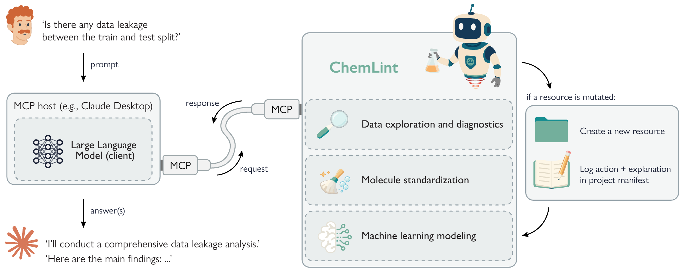
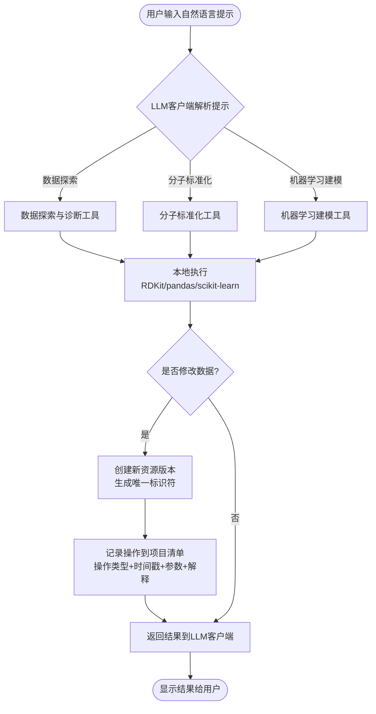
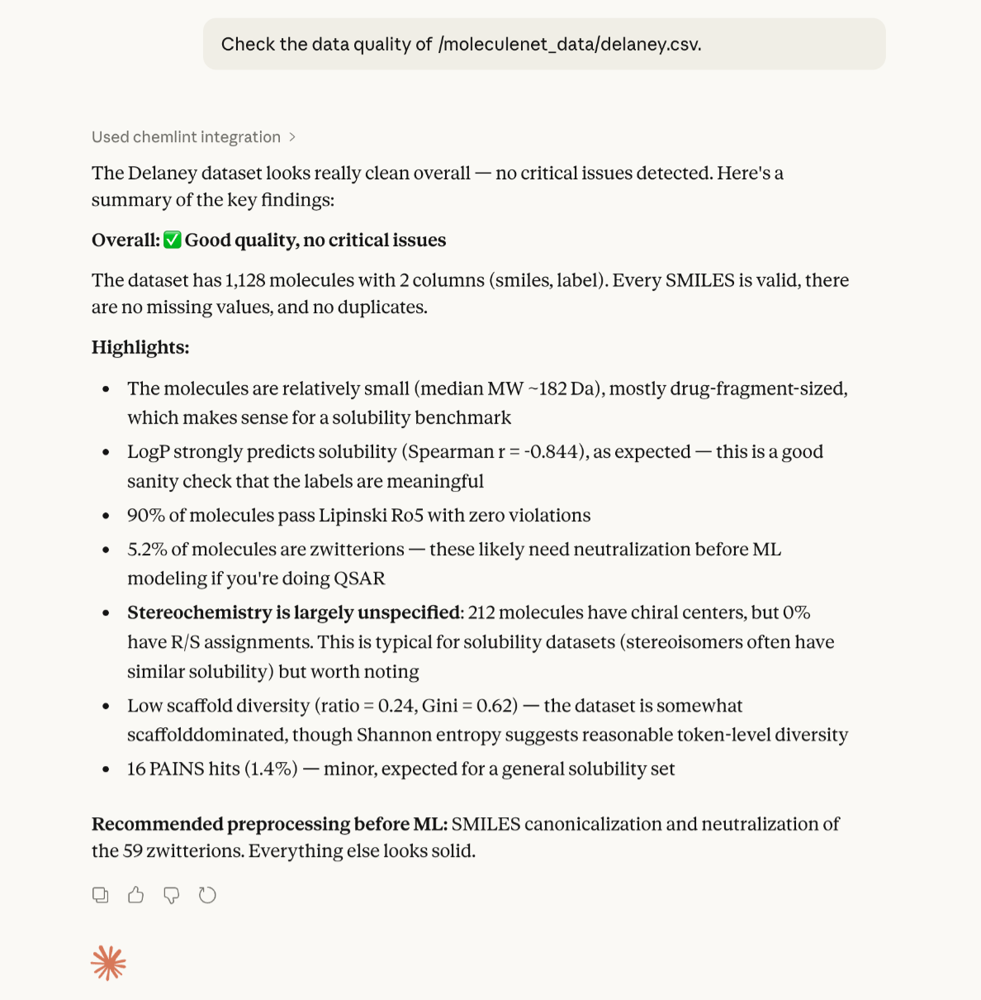
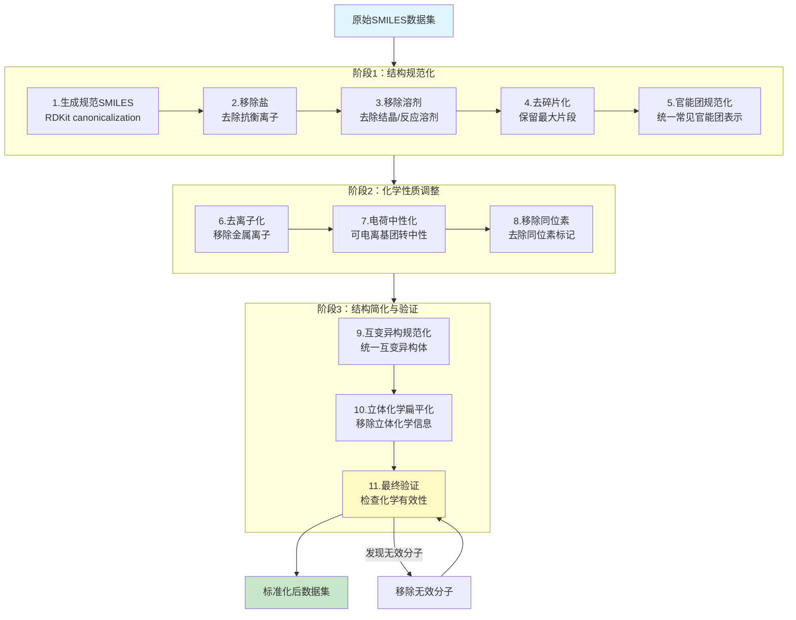
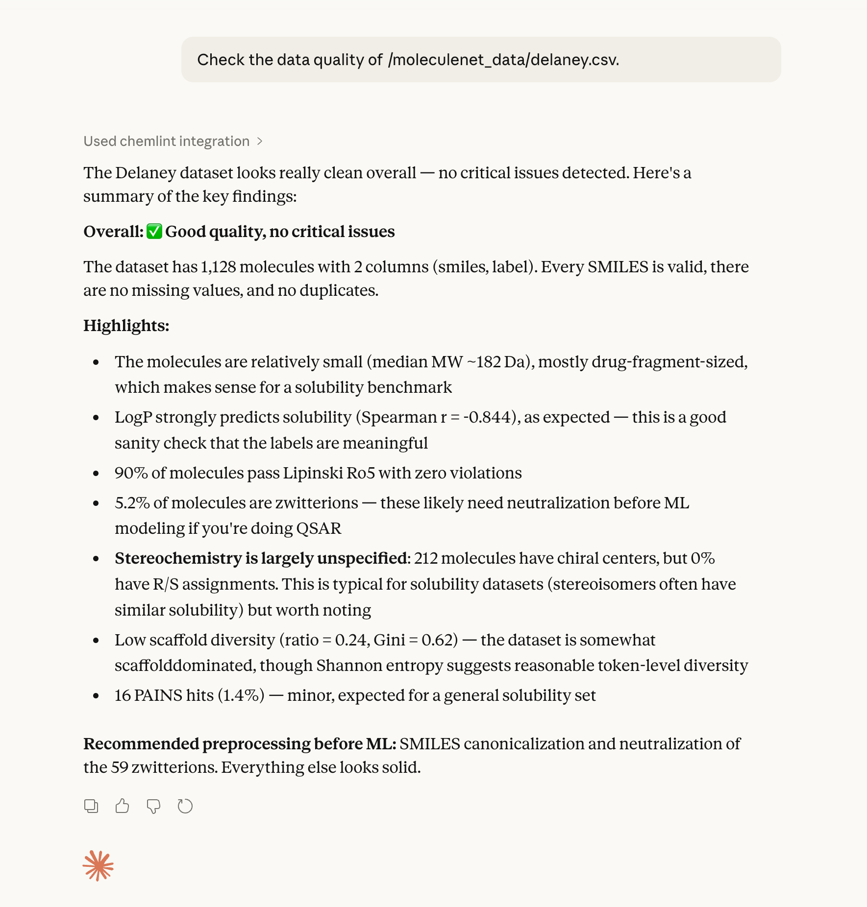
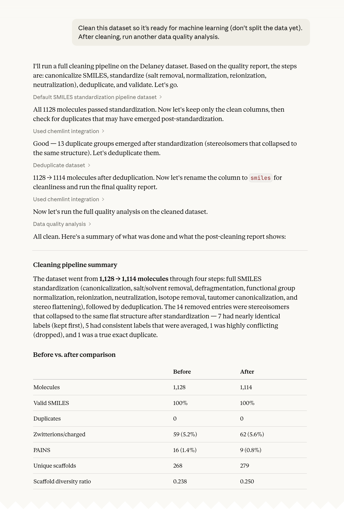
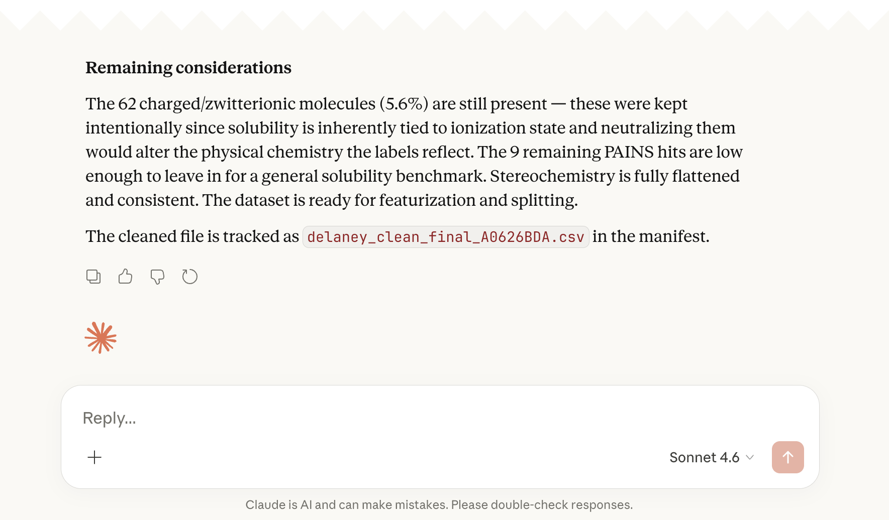

# ChemLint对话式分子机器学习平台揭开数据质量危机：63.6%测试集骨架已在训练集中出现

## 本文信息
- **标题**： ChemLint: Conversational Cheminformatics with Large Language Models
- **作者**： Derek van Tilborg, Francesca Grisoni
- 发表时间： 2026年2月24日
- **单位**： 荷兰埃因霍温理工大学，复杂分子系统研究所、生物医学工程系
- **引用格式**： van Tilborg, D., & Grisoni, F. (2026). ChemLint: Conversational Cheminformatics with Large Language Models. *ChemRxiv Preprints*. https://doi.org/10.26434/chemrxiv.15000386/v1
- **源代码**： https://github.com/derekvantilborg/ChemLint

## 摘要

> 本研究提出了**ChemLint**，这是一个开源的Model Context Protocol服务器，它将任何兼容MCP的大语言模型连接到精选的本地化学信息学和机器学习工具套件，通过对话界面实现**严格的分子数据处理**。分子机器学习研究常常受到不一致数据预处理的破坏，包括**无效SMILES**、**未解决的重复项**和**训练测试泄漏**，然而现有的基于LLM的化学工具并没有解决这些**以数据为中心的挑战**。ChemLint为**数据探索和诊断**、**分子标准化**以及**机器学习建模**提供了工具。所有操作都由既定的库确定性执行，并记录在**项目清单中**，追踪每个操作，支持可复现性并使管理选择明确。我们通过几个示例展示了ChemLint如何用于识别常见的数据质量问题、评估分割策略以及执行从原始数据到评估的完整建模流程。

### 核心结论 & 贡献

**【科学发现】分子机器学习的数据质量危机被系统性揭示**
- 本研究首次对MoleculeNet的7个主流数据集进行系统审计，揭示了**令人震惊的数据质量缺陷**，详见“被忽视的领域危机”部分
- **最致命的发现**：随机分割导致训练集和测试集之间的scaffold重叠率高达42.5%至63.6%，这意味着数千篇已发表论文的模型性能可能被严重高估

**【工具贡献】ChemLint通过MCP协议提供约150个对话式工具，重构分子机器学习工作流**

- ChemLint是一个开源的Model Context Protocol（MCP）服务器，它将任何兼容MCP的大语言模型（Claude、ChatGPT、Gemini等）连接到精选的本地化学信息学和机器学习工具套件。
- 系统性地提供**13类约150个工具**，涵盖数据管理、分子清洗、描述符、机器学习（33种算法、6种交叉验证、超参数调优）、统计检验、可视化、质量报告等领域
- 所有操作由既定的库（RDKit、scikit-learn、SciPy）确定性执行，并记录在项目清单中，支持可复现性并使管理选择明确。

## 背景

### 被忽视的领域危机

分子机器学习正在**显著影响药物发现的范式**——从虚拟筛选到性质预测，再到从头分子设计，越来越多的研究依赖于数据驱动的建模方法。然而，在这个蓬勃发展的领域背后，隐藏着一个被长期忽视的危机：**主流基准数据集存在严重的数据质量问题**，这正在**系统性地高估模型性能**，并**从根本上动摇了人们对已发表研究的信任**。

MoleculeNet自2018年发布以来，已被引用**数千次**，成为分子机器学习领域**无可争议的最广泛使用**的基准数据集。然而，本研究首次系统性地审计揭示，这些黄金标准数据集存在**令人震惊的根本性缺陷**：

- HIV数据集：7.5%的分子包含盐或溶剂片段——这些杂质根本不应该出现在药物分子数据中
- HIV数据集：**完全未指定立体化学**，比例为0%——这意味着所有手性分子的3D结构信息都丢失了
- 所有数据集：普遍存在**化学无效SMILES**、**未指定的立体化学中心**、**隐藏的结构异构体重复**
- **最致命的问题**：随机分割导致训练集和测试集之间的scaffold重叠率高达42.5%至63.6%

这意味着什么？基于这些数据集和随机分割发表的数千篇论文——包括高引用研究——其性能评估**可能严重高估模型的真实能力**。

### 现有工具的局限性

虽然分子数据预处理的最佳实践已经存在，但在实践中并不总是得到一致应用。该领域的跨学科性质意味着并非所有研究人员和审稿人都熟悉这些惯例，而常见的工具链是灵活的而非规定性的。

现有的基于LLM的化学工具（如ChemCrow、ChatInvent等agent系统）主要关注**协调端到端的分子设计和合成工作流**，但并未解决这些**以数据为中心的挑战**。这些工具在**数据质量控制**、**标准化**和**可复现性**方面存在明显的空白。

### 关键科学问题

面对这一危机，本研究提出了三个亟待解决的关键科学问题：

- **如何让数据质量控制变得普及化**？数据质量问题的检测和修复需要**深度的专业知识**，但每个研究人员都应该能够轻松地识别和解决这些问题，而**不需要成为化学信息学专家**。这需要工具的**智能化**和**自动化**。
- **如何让数据预处理的选择变得完全透明**？不同的标准化和分割策略会导致**截然不同的结果**，但这些关键选择往往在论文的方法部分被**一笔带过**，使得读者无法评估其合理性，也无法**真正复现**研究结果。这需要**标准化**和**可追溯性**。
- **如何让工作流变得完全可复现**？从原始数据到最终模型，每一个中间步骤、参数选择和数据处理决策都应该被**完整记录**和**精确追踪**，但目前缺乏**自动化**和**标准化**的解决方案。这需要**系统性的框架设计**。

### 创新点

本研究在方法论和工具设计上提出了四个关键改进：

- **首个专注于数据质量的对话式化学信息学系统**：ChemLint不同于现有的agent系统，它不盲目追求端到端的自动化，而是专注于分子数据的**质量控制**、**诊断**和**可复现评估**，通过对话界面让研究人员以自然语言的方式执行**严格的数据管理操作**。这种设计理念强调**严谨性优于便利性**的原则。
- **基于Model Context Protocol的开放模块化架构**：通过MCP协议，ChemLint可以连接**任何兼容的LLM客户端**，例如Claude、ChatGPT、Gemini等，同时保持所有计算在本地执行，使用既定的化学信息学库（RDKit、scikit-learn、SciPy等），确保结果的**确定性**和**可审计性**。这种架构设计既保证了**科学严谨性**，又提供了**前所未有的灵活性**。
- **项目清单系统实现完全可追溯性**：ChemLint引入了**项目清单**的概念，每次数据变异操作都会创建新的资源版本，并自动记录操作类型、时间戳、输入参数和用户提供的解释，形成**完整的审计轨迹**，使得从原始数据到最终模型的每一个步骤都可追溯和复现。这一设计借鉴了**实验室笔记本**的理念，但将其**自动化和系统化**了。
- **系统化的分割质量诊断**：ChemLint提供了**8项系统检查**来检测数据分割的潜在问题，包括精确重复SMILES、基于相似性的泄漏、scaffold重叠、立体异构体/互变异构体变体、物理化学性质分布差异、标签分布差异、官能团组成差异等，并给出**明确的警告和建议**。这种**全面性**和**系统性**的诊断在领域内是前所未有的。
---

## 研究内容

### ChemLint系统架构

ChemLint的核心设计理念是将**大语言模型的对话能力**与**化学信息学的严谨方法相结合**，通过**Model Context Protocol**实现两者的无缝集成。系统架构包含三个核心组件：**数据探索和诊断**、**分子标准化**、以及**机器学习建模**，并通过一个**跨层面的可复现性系统**，即**项目清单系统**，支撑所有功能。

图1：**ChemLint系统架构概览**

ChemLint通过MCP协议与LLM客户端通信，将用户的自然语言提示转换为具体的化学信息学操作，并在本地执行计算，返回结果的同时记录操作到项目清单。这种设计确保了所有操作都是**确定性的**、**可追踪的**。

#### 系统工作流程

这个工作流程确保了所有数据变异操作都被记录，形成了完整的审计轨迹。每次操作都会创建新的资源版本，而不是就地修改，这样可以回溯到任何历史状态。

#### ChemLint的核心功能全景

ChemLint向LLM客户端暴露**约150个工具**，涵盖分子机器学习工作流的各个环节，系统性地分为**13个功能类别**：

1. **数据管理**：共15个工具，覆盖数据导入、导出、合并、子集提取、检查、过滤数据集

2. **分子清洗**：共10个工具，覆盖SMILES标准化、去盐、去重、标签处理

3. **分子描述符**：共12个工具，覆盖简单性质（分子量、LogP、TPSA）、指纹（ECFP、MACCS、RDKit）、SMILES编码

4. **骨架分析**：共8个工具，覆盖Bemis-Murcko骨架提取、通用骨架、循环骨架、多样性分析

5. **相似性分析**：共6个工具，覆盖成对相似度矩阵、k-近邻、训练集相似度评估

6. **聚类分析**：共5个工具，覆盖DBSCAN、层次聚类、k-means、Butina聚类算法

7. **机器学习**：共40个工具：
- 33种算法：分类与回归（随机森林、梯度提升、SVM、线性模型、集成方法）
- 6种交叉验证策略：k-fold、分层、Monte Carlo、scaffold、cluster、leave-P-out
- 超参数调优：网格搜索、随机搜索，可自定义参数空间
- 模型评估：20+种评估指标（准确率、ROC-AUC、PR-AUC等）、混淆矩阵、ROC曲线、校准曲线

8. **统计检验**：共15个工具，覆盖t检验、方差分析（ANOVA）、相关性分析、正态性检验、Mann-Whitney U检验、Kruskal-Wallis检验、卡方检验

9. **可视化**：共8个工具，覆盖带分子提示的交互式散点图、直方图、密度图、箱线图、热图

10. **质量报告**：共5个工具：
- 数据质量分析：19个部分的全面报告（PAINS过滤器、Lipinski规则、重复检测、立体化学完整性等）
- 分割质量分析：8项数据泄漏检查（精确重复、高相似度对、scaffold重叠、立体异构体、互变异构体等）
- 骨架报告：多样性度量（Gini系数、Shannon熵）、富集分析、结构离群点检测

11. **活性悬崖检测**：共4个工具，寻找结构相似但活性差异大的分子对（分类和回归任务）

12. **异常值检测**：共6个工具，覆盖Z-score、IQR、孤立森林、局部异常因子（LOF）

13. **降维可视化**：共2个工具，PCA、t-SNE用于化学空间可视化

### 分子标准化：11步严谨流程

分子标准化是数据质量控制的核心步骤。ChemLint提供了一个11步的标准化流程，每一步都有明确的化学和统计学依据。

整理表：**ChemLint分子标准化的11步流程**

| 步骤 | 操作 | 化学原理 | 适用场景 |
| --- | --- | --- | --- |
| 1 | 生成规范SMILES | RDKit的canonicalization算法确保唯一表示 | 所有分子 |
| 2 | 移除盐 | 去除抗衡离子，保留母核结构 | 来源自多处的数据集 |
| 3 | 移除溶剂 | 去除结晶溶剂、反应溶剂片段 | 药物筛选数据集 |
| 4 | 去碎片化 | 保留最大片段，去除不相连的离子/分子 | 包多个片段的SMILES |
| 5 | 官能团规范化 | 标准化常见官能团表示（如硝基、磺酸基） | 多来源数据集 |
| 6 | 去离子化 | 移除金属离子，保留有机骨架 | 有机金属化合物数据集 |
| 7 | 电荷中性化 | 将可电离基团转为中性形式 | 非pH依赖性研究 |
| 8 | 移除同位素 | 去除同位素标记 | 放射性标记不重要时 |
| 9 | 互变异构规范化 | 统一互变异构体表示 | 需要一致性的数据集 |
| 10 | 立体化学扁平化 | 移除所有立体化学信息 | 立体化学不完全指定时 |
| 11 | 最终验证 | 检查化学有效性，移除无效分子 | 质量控制最后一步 |

这些步骤并非总是全部应用，而是应该根据数据集的具体情况和研究目标进行选择。ChemLint的优势在于它让每一步的决策都变得显式，并在项目清单中记录下来。

Supplementary Figure S1：**标准化协议的交互决策界面**

这张图展示了ChemLint在执行11步标准化协议时与用户的交互界面。当需要用户做出重要的标准化决策时（如是否保留电荷、是否扁平化立体化学等），客户端会向用户询问选择，确保每一步都符合研究需求。

#### 标准化流程的Mermaid图

### 数据探索与诊断

在开始任何建模工作之前，了解数据集的质量和特性是至关重要的。ChemLint提供了两个主要的诊断报告。

#### 数据质量报告

数据质量报告执行广泛的数据检查，涵盖基础数据集统计、分子有效性、物理化学性质、统计分布和结构特征等多个方面：

- **结构有效性检查**：识别化学无效的SMILES字符串，违反价态规则的原子，无法解析的分子结构
- **杂质检测**：检测并计数盐抗衡离子、溶剂片段、无机离子
- **立体化学完整性**：统计手性中心（四面体立体中心）的指定情况，立体双键的E/Z指定情况
- **电荷状态分析**：统计携带形式电荷的分子比例，分析电荷分布模式
- **scaffold多样性**：计算Bemis-Murcko scaffold的数量和分布，评估骨架多样性
- **官能团分布**：识别和统计常见官能团的出现频率，检查不同数据集间官能团组成的差异
- **标签分布分析**：对于分类任务，检查类别平衡；对于回归任务，检查数值分布和异常值
- **结构活性相关性**：计算分子描述符与活性标签的相关性，识别潜在的结构活性关系
- **药物相似性过滤**：Lipinski Rule of Five、Veber规则、QED阈值违规检测
- **异常值检测**：使用IQR方法进行异常值检测

这些检查最终会生成一份**优先级排序的清理建议列表**，每个问题都被分配严重程度级别（“OK”、“low”、“medium”、“high”、“critical”），帮助研究人员系统性地解决数据质量问题。

#### 分割质量报告

分割质量报告专门针对数据集的分割策略进行诊断，执行以下8项检查：

- **精确重复泄漏**：训练集和测试集中是否存在完全相同的SMILES（分子编码）
- **高相似度泄漏**：检测训练集和测试集中是否存在高度相似的分子对（相似度>90%，就像“同卵双胞胎”一样）
- **scaffold重叠**：训练集和测试集之间共享Bemis-Murcko scaffold（分子骨架）的比例
- **立体异构体泄漏**：在扁平化立体化学后，检查结构异构体是否跨越分割
- **互变异构体泄漏**：在规范化互变异构体后，检查结构异构体是否跨越分割
- **分布差异**：比较训练集和测试集的分子性质分布（分子量、logP、极性表面积等）
- **类别分布**：对于分类任务，检查类别的平衡性
- **聚类分析**：通过聚类方法识别潜在的聚集结构

### 标签质量处理

实验生物活性数据不可避免地包含测量误差、缺失值、带有异常值的技术重复，以及对相同分子的矛盾测量结果。然而，许多已发表的研究临时性地处理这些问题或完全忽略它们。

ChemLint提供了系统性的工具来识别和解决标签质量问题：

- **缺失值处理**：自动识别并移除缺失的活性值
- **异常值检测**：支持多种统计方法（Z-score、修正Z-score、IQR、Grubbs检验、广义ESD），并可配置阈值
- **重复分子处理**：对于具有矛盾标签的重复分子（例如，在分子标准化后聚合的立体异构体），ChemLint可以通过统计检验确定这些冲突代表真实的测量变异性还是系统性分歧
- **合并策略**：提供多种重复合并策略（多数投票、均值、中位数）或完全丢弃有冲突的条目

### 数据集分割策略

数据分割是将分子数据集分成训练集（用于学习，相当于“练习题”）和测试集（用于评估，相当于“考试”）。分割策略的选择会严重影响模型性能评估的可靠性。

整理表：**ChemLint支持的4种数据集分割策略**

| 分割策略 | 原理 | 适用场景 | 局限性 |
| --- | --- | --- | --- |
| 随机分割 | 完全随机分配分子到训练/测试集 | 先导化合物优化（内插性能） | 严重高估外推性能 |
| 分层分割 | 保持标签分布一致 | 类别不平衡的数据集 | 仍然存在结构泄漏 |
| scaffold-based | 相同scaffold的分子分配到同一集合 | 评估新颖scaffold的泛化能力 | 互变异构可能改变scaffold导致泄漏 |
| cluster-based | 基于分子相似性聚类，整个聚类分配到同一集合 | 评估分子簇的泛化能力 | 聚类算法和参数选择影响结果 |

对于cluster-based分割，ChemLint支持5种聚类算法（DBSCAN、层次聚类、谱聚类、k-means、Butina），可以使用所有可用的分子表示方法。

在经验上，更严格的分割策略（scaffold-based和cluster-based）往往比随机分割的准确率低10%至30%，但这**揭示了在结构新颖分子上更现实的预测性能估计**。

### 机器学习建模

ChemLint提供了33种经典机器学习算法，涵盖分类和回归任务。这些算法包括：

- **集成方法**：随机森林、AdaBoost、梯度提升
- **线性模型**：岭回归、Lasso、Elastic Net
- **支持向量机**：支持分类和回归
- **最近邻**：k-近邻算法
- **决策树**：单棵可解释树
- **朴素贝叶斯**：高斯朴素贝叶斯、多项式朴素贝叶斯
- **判别分析**：线性判别分析、二次判别分析

为确保稳健的性能估计，ChemLint支持多种交叉验证策略（交叉验证就像多次“小考”取平均，避免一次考试的偶然性）：

- k-fold交叉验证（将数据分成k份，轮流用每一份做测试）
- 分层交叉验证（保证每个分割中类别比例一致）
- scaffold-based交叉验证（确保相同骨架的分子在同一分割）
- cluster-based交叉验证（将相似分子聚簇后分配到同一分割）
- Monte Carlo交叉验证（随机重复多次分割）
- leave-p-out交叉验证（每次留出p个样本做测试）

对于不确定性量化，部分算法支持贝叶斯集成变体，通过计算预测标准差或集成熵来量化预测不确定性。

#### 超参数调优与模型评估

ChemLint不仅提供模型训练，还支持完整的模型优化和评估流程：

- **超参数调优**：支持网格搜索和随机搜索，研究者可以自定义参数空间，自动寻找最优模型配置
- **模型评估指标**：提供20+种评估指标，包括准确率、精确率、召回率、F1分数、ROC-AUC、PR-AUC等，以及混淆矩阵、ROC曲线、校准曲线等可视化
- **交互式可视化**：生成带分子提示的散点图（鼠标悬停可查看分子结构）、热图、密度图、箱线图等，帮助直观理解数据分布和模型行为
- **统计检验**：支持15+种统计检验方法（t检验、方差分析、Mann-Whitney U检验、Kruskal-Wallis检验、卡方检验、正态性检验等），用于验证结果的统计显著性
- **异常值检测**：提供4种异常值检测方法（Z-score、IQR、孤立森林、局部异常因子），识别数据中的离群点

### 应用示例1：主流基准数据集的质量审计

作为首次演示，研究团队使用ChemLint评估了MoleculeNet的7个流行单任务基准数据集的质量，仅用一个对话提示：“Check the data quality of dataset.csv”。

Supplementary Figure S2：**数据质量报告实际输出示例**

这张图展示了ChemLint生成的数据质量报告的实际界面，包括结构有效性检查、杂质检测、立体化学完整性分析等多维度诊断结果。可以看到对每个数据集的详细统计信息和改进建议。

表1：**MoleculeNet数据集的质量问题统计**

| 数据集 | 样本量 | 无效分子 | 带电荷分子 | 含盐/溶剂片段 | 手性中心指定率 | E/Z指定率 | 结构异构体组数 |
| --- | --- | --- | --- | --- | --- | --- | --- |
| BACE | 1,513 | 0 | 55.92% | 0.00% | 3,150 (25.5%) | 97 (29.9%) | 45 |
| BBBP | 2,050 | 11 | 5.74% | 5.12% | 4,425 (66.0%) | 726 (21.5%) | 92 |
| ClinTox | 1,484 | 4 | 60.20% | 0.94% | 3,731 (82.1%) | 537 (37.2%) | 80 |
| Delaney | 1,128 | 0 | 5.23% | 0.00% | 701 (0.0%) | 154 (3.9%) | 13 |
| FreeSolv | 642 | 0 | 5.92% | 0.00% | 87 (98.9%) | 36 (27.8%) | 3 |
| HIV | 41,127 | 7 | 12.78% | 7.51% | 49,613 (0.0%) | 13,481 (0.0%) | 181 |
| Lipophilicity | 4,200 | 0 | 2.36% | 0.02% | 2,530 (72.9%) | 192 (39.1%) | 82 |

结果揭示了几个令人担忧的问题：

- **化学无效SMILES普遍存在**：BBBP数据集包含11个无效SMILES，HIV有7个，ClinTox有4个
- **盐和溶剂片段污染**：许多条目包含盐抗衡离子或溶剂片段，HIV数据集高达7.5%
- **电荷状态不一致**：超过55%的BACE分子和60%的ClinTox分子携带形式电荷
- **立体化学不完全指定**：HIV数据集完全未指定立体化学（0%），其他数据集的指定率也普遍较低
- **隐藏的结构异构体重复**：在扁平化立体化学和规范化互变异构体后，发现了大量隐藏的冗余

然后，研究团队要求ChemLint清理每个数据集：“Clean this dataset so it's ready for machine learning (don't split the data yet). After cleaning, run another data quality analysis.”

Supplementary Figure S3：**数据集清洗对话界面示例**

这张图展示了LLM客户端通过对话界面调用ChemLint工具执行数据集清洗的实际过程。展示了从标准化SMILES、移除盐和溶剂、去碎片化、电荷中性化到立体化学扁平化的完整清洗流程，以及ChemLint自动记录的每一步操作和参数。

由于除了HIV之外的所有数据集都是从多个原始来源编译的，团队让客户端对所有数据集进行电荷中性化、移除片段和扁平化立体化学，因为这些分子细节不太可能反映跨原始来源的一致实验条件。

**标准化效果是显著的**：

- **BACE数据集**：带电荷分子从约56%降至约2%，丢弃了66个分子（主要包含无效结构或冲突的重复标签）
- **ClinTox数据集**：带电荷分子从约60%降至约8%，丢弃了144个分子
- **HIV数据集**：带电荷分子从约3%增至约13%（因为去除了溶剂和盐片段，暴露了更多带电分子），丢弃了238个分子
- **所有7个数据集**：在标准化后，都免于无效分子、盐和片段，残留电荷主要反映永久离子物种

表2：**标准化后的数据集质量**

| 数据集 | 样本量（丢弃数） | 无效分子 | 带电荷分子 | 含盐/溶剂片段 |
| --- | --- | --- | --- | --- |
| BACE | 1,447 (66) | 0 | 1.9% | 0.00% |
| BBBP | 1,922 (128) | 0 | 3.2% | 0.00% |
| ClinTox | 1,340 (144) | 0 | 8.1% | 0.00% |
| Delaney | 1,114 (14) | 0 | 5.6% | 0.00% |
| FreeSolv | 639 (3) | 0 | 5.9% | 0.00% |
| HIV | 40,889 (238) | 0 | 13.1% | 0.00% |
| Lipophilicity | 4,092 (108) | 0 | 2.4% | 0.00% |

### 应用示例2：数据分割质量危机的揭示

这是本研究**最震撼的发现**。作为第二个演示，研究团队使用ChemLint系统性地分析了MoleculeNet提供的预定义数据分割的质量，结果揭示了**一个被整个领域忽视的严重问题**。

对于每个数据集，ChemLint生成了一个详细的分割质量报告，解释每种分割方法的优缺点，并给出明确的警告。例如，对于Lipophilicity数据集，ChemLint得出结论：

> scaffold-based分割方法提供了最可靠的评估框架，具有完全的结构分离和良好匹配的分布。Fingerprint-based分割提供了关于模型外推的有趣见解，但受到显著的域偏移影响。**由于严重的结构泄漏，应该避免随机分割用于模型评估**。

在所有情况下，ChemLint都建议不要使用随机分割。例如，对于ClinTox，它警告说由于严重的结构泄漏，随机分割会“给出误导性的乐观结果”。

表3：**不同分割方法的泄漏指标对比**

| 分割方法 | 数据集 | 训练集（测试集） | Scaffold重叠 | 立体异构体重叠 | 互变异构体重叠 | 高相似度分子 | ROC-AUC | RMSE |
| --- | --- | --- | --- | --- | --- | --- | --- | --- |
| 随机 | BACE | 1,210（152） | 47.1% | 1 | 0 | 13 | 0.88 ± 0.01 | - |
| 随机 | BBBP | 1,631（204） | 42.5% | 13 | 11 | 16 | 0.91 ± 0.02 | - |
| 随机 | ClinTox | 1,184（148） | 46.5% | 14 | 10 | 16 | 0.66 ± 0.03 | - |
| 随机 | Delaney | 902（113） | 58.1% | 2 | 1 | 10 | - | 0.64 ± 0.00 |
| 随机 | FreeSolv | 513（65） | 63.6% | 1 | 0 | 6 | - | 0.46 ± 0.02 |
| 随机 | HIV | 32,896（4,112） | 48.0% | 0 | 4 | 173 | 0.77 ± 0.01 | - |
| 随机 | Lipophilicity | 3,360（420） | 46.5% | 18 | 3 | 31 | - | 0.70 ± 0.01 |
| Scaffold | BACE | 1,210（152） | 0.0% | 0 | 0 | 2 | 0.73 ± 0.01 | - |
| Scaffold | BBBP | 1,631（204） | 0.0% | 0 | 1 | 0 | 0.67 ± 0.01 | - |
| Scaffold | ClinTox | 1,184（148） | 0.0% | 0 | 0 | 0 | 0.66 ± 0.08 | - |
| Scaffold | Delaney | 902（113） | 0.0% | 0 | 0 | 2 | - | 0.82 ± 0.01 |
| Scaffold | FreeSolv | 513（65） | 0.0% | 0 | 0 | 1 | - | 0.86 ± 0.01 |
| Scaffold | HIV | 32,896（4,112） | 0.0% | 0 | 8 | 29 | 0.77 ± 0.01 | - |
| Scaffold | Lipophilicity | 3,360（420） | 0.0% | 0 | 0 | 21 | - | 0.77 ± 0.01 |
| Fingerprint | BACE | 1,210（152） | 3.2% | 0 | 0 | 1 | 0.73 ± 0.06 | - |
| Fingerprint | BBBP | 1,631（205） | 4.6% | 0 | 0 | 0 | 0.37 ± 0.06 | - |
| Fingerprint | ClinTox | 1,184（148） | 5.8% | 0 | 0 | 0 | 0.56 ± 0.10 | - |
| Fingerprint | Delaney | 902（114） | 28.1% | 0 | 0 | 0 | - | 1.23 ± 0.04 |
| Fingerprint | FreeSolv | 513（65） | 100.0% | 0 | 0 | 0 | - | 1.36 ± 0.02 |
| Fingerprint | HIV | 32,896（4,112） | 10.9% | 0 | 0 | 0 | 0.56 ± 0.03 | - |
| Fingerprint | Lipophilicity | 3,360（420） | 4.4% | 0 | 0 | 0 | - | 0.84 ± 0.01 |

对于随机分割，ChemLint识别出训练集和测试集之间的scaffold重叠范围从42.5%到63.6%，以及几个数据集中的立体异构体、互变异构体和近重复泄漏。对于scaffold-based分割，ChemLint确认**大多数泄漏已解决**，但指出高度相似的分子仍然可能最终出现在两个分割中，而且互变异构化偶尔会改变Bemis-Murcko scaffold，允许互变异构体对跨越集合泄漏。

#### 为什么scaffold重叠是致命的数据泄漏？

Scaffold（骨架）是药物化学中的核心概念，指分子的核心结构框架（通过移除侧链原子得到）。Bemis-Murcko scaffold是药物设计中广泛使用的分子骨架表示方法，是药物化学家的**共同语言**。

当训练集和测试集存在scaffold重叠时，这意味着：

- **模型学到的是记骨架而非真正的预测能力**：测试集中的分子骨架在训练集中已经见过，模型只需要记住“scaffold X倾向于有高活性”，而不需要真正学习分子结构-活性关系的复杂规律。这类似于学生通过记忆**题目模板**而非理解原理来考试。
- **这相当于考试前看到了部分试题**：如果考试题目和练习题有相同的解题模式，考出的高分不代表学生的真实能力。在药物发现中，**真正的挑战是预测全新scaffold的活性**——这是**最有价值的预测目标**——而随机分割根本无法评估这种能力。
- **导致虚假的最优模型选择**：研究者可能选择了在随机分割上表现最好的模型，但这种模型在面对全新骨架时可能**完全失效**，导致**资源浪费**和**错误的项目决策**。

这正是为什么scaffold重叠42.5%至63.6%是一个**领域级的严重问题**：它表明基于MoleculeNet随机分割发表的数千篇论文，其性能评估**可能严重高估了模型的实际预测能力**。在药物发现这种成本高昂的领域，这种高估可能导致**数百万美元的研发投入被错误地引导**。

### 应用示例3：从原始数据到可复现的完整工作流

作为第三个演示，研究团队使用ChemLint执行了从原始数据到评估报告的完整建模流程。使用Claude Desktop和Claude Sonnet 4.6作为客户端，提供了以下提示：

> For a drug discovery project, I want to know if the molecules I'm working with can pass the blood brain barrier. Train a robust predictive model based on this raw data set '/moleculenet_data/bbbp.csv' and evaluate it critically.

LLM客户端自动使用ChemLint的工具执行了以下步骤：

1. **数据质量分析**：生成了全面的数据质量报告，识别了无效SMILES、盐片段、电荷状态等问题
2. **分子标准化**：应用了11步标准化流程，包括规范SMILES生成、移除盐和溶剂、去碎片化、电荷中性化、立体化学扁平化等
3. **重复移除**：基于规范SMILES识别重复结构，对于精确标签重复折叠为单个条目，对于无法通过二项检验解决的冲突完全移除
4. **基于scaffold的分割**：将分子按80/20比例分割为训练集和测试集，确保没有scaffold重叠
5. **随机森林训练**：使用ECFP4指纹（一种将分子转换为数字特征的方法）进行分子特征化，训练随机森林分类器，使用5-fold交叉验证
6. **模型评估**：在保持的测试集上达到ROC-AUC为0.93±0.01（ROC-AUC是分类模型性能指标，1.0为完美，0.5为随机猜测，0.93意味着模型有很强的预测能力）

为了测试清单系统的可复现性，团队创建了一个新的客户端实例，并要求它在没有访问原始提示的情况下重现实验：

> Check this old manifest '../manifest.json' and re-do all the experimental steps exactly. You should make a new project and manifest to track everything.

**客户端以相同的顺序执行了所有步骤，使用相同的参数，并达到了相同的测试集性能**。这证明了项目清单系统的有效性：即使没有原始提示，仅凭清单中的操作记录，新的LLM客户端也能够**完全复现整个实验**。

#### LLM生成的Materials and Methods节选

研究团队还要求客户端生成适合在科学期刊发表的材料和方法部分：

> Write a Materials and Methods section suitable for publishing in a scientific journal. I am tight on words so it should be to the point.

客户端自动使用ChemLint查阅项目清单，然后生成了以下文本（经人工验证每个记录的步骤确认准确）：

> **数据集和数据管理**。
> - BBBP数据集（2050个化合物，二元BBB渗透性标签）从MoleculeNet获得。
> - SMILES使用ChemLint实现的11步流程进行标准化：规范SMILES生成、盐和溶剂移除、去碎片化（保留最大片段）、官能团规范化、去离子化、电荷中性化、同位素移除、互变异构规范化、立体化学扁平化。
> - 未能通过最终验证的结构被丢弃（保留2039个；99.5%）。
> - 基于规范SMILES识别重复结构；精确标签重复折叠为单个条目，无法通过二项检验解决的冲突被完全移除，最终得到1922个化合物的管理集。
>
> **数据集分割**。化合物使用Bemis-Murcko scaffold-based分割分为训练集（80%，n = 1557）和测试集（20%，n = 365），集合间无scaffold重叠。无环化合物（n = 96）分配到训练集。
>
> **建模**。分子被特征化为ECFP4指纹（半径 = 2，2048位），使用scikit-learn的随机森林分类器（默认超参数）通过ChemLint进行5-fold scaffold交叉验证训练。所有实验使用固定随机种子（42）。

这个例子表明，即使LLM客户端在不同提示下可能行为不同，通过清单系统建立清晰的审计轨迹使得即使在对话设置中也能实现可复现性。

### 实现细节

ChemLint向MCP兼容的LLM客户端暴露约150个工具，使用mcp-cli包。每个工具对应单个、范围明确的分子数据操作。计算工作委托给既定的库，主要是：

- **RDKit**：用于分子处理和化学信息学计算
- **pandas**：用于数据集处理
- scikit-learn：用于建模和统计程序
- **SciPy**：用于统计检验

ChemLint的功能围绕三个典型的分子机器学习工作流层次组织：（1）数据探索和诊断，（2）分子标准化，以及（3）机器学习建模。一个跨层面的可复现性系统支撑着这三个层次。

#### 资源管理

资源管理通过为每个文件分配唯一标识符来处理，该标识符附加到客户端提供的文件名上（例如，cleaned_data_A3F2B1D4.csv）。这些存储为数据集列，使得失败是透明的，包括哪些分子在哪个步骤被拒绝以及原因。这是故意冗长的，因为诊断拒绝原因往往比获得单个最终的“清理的”数据集更重要。

#### 项目清单系统

项目清单是ChemLint可复现性的核心。对于每个创建的工件，清单记录：

- **资源类型**：数据集、模型、报告等
- **时间戳**：创建时间
- **创建工具**：哪个工具创建它
- **输入参数**：使用的所有参数
- **客户端提供的解释**：为什么执行这个操作

这个清单存储在项目目录的manifest.json文件中，可以被客户端和用户访问，使得每个中间资源都可以被回溯。

#### 当前范围与局限

当前的范围专注于2D分子表示和定量构效关系（Quantitative Structure-Activity Relationship，QSAR，即通过分子结构预测其生物活性的方法）建模工作流典型的功能。3D构象体生成、量子化学和深度学习模型训练等功能在当前版本中故意排除在外，以保持ChemLint专注于数据质量、诊断和可复现评估，而不是充当通用建模环境。

---

## Q&A

- **Q1**：ChemLint与现有的化学agent系统（如ChemCrow、ChatInvent）有何区别？
- **A1**：ChemLint专注于数据质量控制、诊断和可复现评估，而ChemCrow和ChatInvent等agent系统专注于**协调端到端的分子设计和合成工作流**。主要区别包括：
  - **定位不同**：ChemLint不试图取代传统的建模环境，也不消除对专家判断的需求，而是通过降低领域准入门槛和提供结构化框架来减少数据处理决策的歧义
  - **开放性**：ChemLint基于Model Context Protocol，这是一个开放标准，使得它可以与任何MCP兼容的LLM客户端（Claude、ChatGPT、Gemini等）集成，而agent系统通常绑定到特定的模型或平台
- **Q2**：为什么scaffold-based分割会降低模型性能，这难道不是说明模型变差了吗？
- **A2**：这是一个常见的误解。scaffold-based分割降低的准确率实际上**揭示了模型在结构新颖分子上的真实泛化能力**，而随机分割的高准确率往往是虚假的，因为训练集和测试集之间存在结构泄漏。
  - **考试比喻**：如果你在考试前看到了大部分试题的答案，你的考试成绩会很高，但这并不代表你真正掌握了知识
  - **机器学习对应**：随机分割让模型在考试前“看到”了类似的结构，而scaffold-based分割确保模型在面对全新scaffold时进行真正的“开卷考试”
  - **实证数据**：研究表明，更严格的分割策略往往比随机分割的准确率低10%至30%，但这更接近模型在实际应用中的表现
- **Q3**：ChemLint的项目清单系统如何确保可复现性，它是否记录了足够的信息？
- **A3**：项目清单系统记录了每个操作的完整上下文：资源类型、时间戳、创建工具、输入参数和用户提供的解释。
  - **全面性**：这比传统的实验室笔记本更全面，因为它不仅记录了“做了什么”，还记录了“怎么做的”和“为什么做”
  - **可复现性验证**：在示例3中，一个新的LLM客户端实例仅通过读取manifest.json文件，就能够完全复现整个实验，达到相同的测试集性能。这种级别的可复现性在分子机器学习领域是前所未有的
  - **局限性**：清单系统并不完美，它依赖于LLM客户端正确解释和执行清单中的指令，而且它不能记录环境差异（如RDKit版本、Python版本等），这些可能仍需要通过容器化（如Docker）来解决
---

## 关键结论与批判性总结

### 潜在影响

- ChemLint通过将大语言模型的对话能力与化学信息学的严谨方法相结合，**显著降低了分子数据管理的准入门槛**，使得非专家研究人员也能执行严格的数据质量控制。这一贡献的意义在于：**它将需要深厚专业知识的复杂操作，转化为通过自然语言即可完成的日常任务**。
- 更重要的是，通过项目清单系统，ChemLint让数据预处理的选择变得**前所未有的透明**，使得每个决策都被记录和追踪。这有助于从根本上提高分子机器学习研究的可复现性和可信度。
- 然而，ChemLint的**最重要的贡献**在于它**系统性揭示的数据质量危机**。主流基准数据集的严重质量问题（无效SMILES、盐/溶剂片段、立体化学不完全指定、隐藏重复）以及数据分割的普遍泄漏问题（scaffold重叠高达63.6%），表明我们需要**重新审视许多已发表研究的结论**，并在未来的研究中采用**更严格的数据管理和评估标准**。

这一发现的意义远超工具本身：它**挑战了整个领域的基础假设**，并可能推动分子机器学习研究范式的再校准。

### 局限性

- **2D表示的限制**：ChemLint当前专注于2D分子表示和QSAR（定量构效关系，即通过分子结构预测生物活性）建模工作流，不支持3D构象体生成、量子化学计算和基于结构的建模方法，这些对于某些药物发现任务（如分子对接、结合自由能计算）是必不可少的
- **深度学习支持缺失**：ChemLint目前仅提供经典机器学习算法（33种），不支持深度学习模型（如图神经网络、 Transformer模型），而这些模型在分子性质预测和分子生成任务中越来越流行
- **环境依赖未隔离**：虽然清单系统记录了所有操作和参数，但它不隔离计算环境（RDKit版本、Python版本、依赖库版本等），这些环境差异可能在不同机器或时间点导致结果不一致

### 未来发展方向

ChemLint的设计理念是通过将对话界面与基于约束的API配对，支持数据集探索、系统性诊断常见数据质量问题，以及应用最佳实践策略，而无需依赖临时脚本或未记录的手动步骤。正如原文Conclusion部分所指出的，ChemLint虽然不取代传统的建模环境，也不消除对专家判断的需求，但它**降低了领域准入门槛**，提供了结构化框架来减少数据处理决策中的歧义，最终提高分子机器学习工作流的透明度和可复现性。

### 批判性思考

- **ChemLint暴露了问题**还是**真正解决了问题**？
  - ChemLint的价值**首先在于系统性揭示了数据质量危机**，这是其最重要的贡献。它提供了诊断工具和manifest系统，但这些工具的**实际影响将取决于其采用率**
  - 如果大多数研究者继续使用随机分割而不检查数据质量，问题依然存在。更重要的是，ChemLint**无法从根本上解决问题**：我们需要**从头构建高质量**、**无泄漏的基准数据集**，而不仅仅是诊断现有数据集的问题。这一挑战需要**整个社区的共同努力**
  
- **降低门槛**是否总是好事？
  - 对话式界面确实让非专家更容易使用化学信息学工具，但这可能是一把**双刃剑**
  - 如果使用者不理解数据质量的重要性**，更容易的工具可能产生更多低质量研究**——这是对领域的**双重打击**：既有问题被更广泛地传播，同时因为“专业性门槛降低”而更难被发现
  - 作者也明确指出ChemLint“不消除对专家判断的需求”，这提示我们需要在“易用性”和“必需的领域知识”之间找到**微妙但关键的平衡**
  
- **问题为何持续了7年**？
  
  MoleculeNet于2018年发布，这些质量问题一直存在，但为什么直到现在才被系统性地审计？这反映了领域的几个**深层次问题**：
  
  - 审稿人和编辑可能没有要求数据质量报告，导致**缺乏制度性压力**
  - 研究者可能倾向于选择“更容易达到高性能”的方法（随机分割），导致**存在结构性激励偏差**
  - 领域缺乏**标准化的数据质量评估流程**和**共同的最佳实践**
  
  ChemLint的出现是一个**重要的开始**，但真正解决问题需要**整个领域的文化和标准改变**。这可能需要：期刊要求提供数据质量报告、审稿人更加关注数据分割策略、以及社区共同努力构建新的高质量基准数据集。
