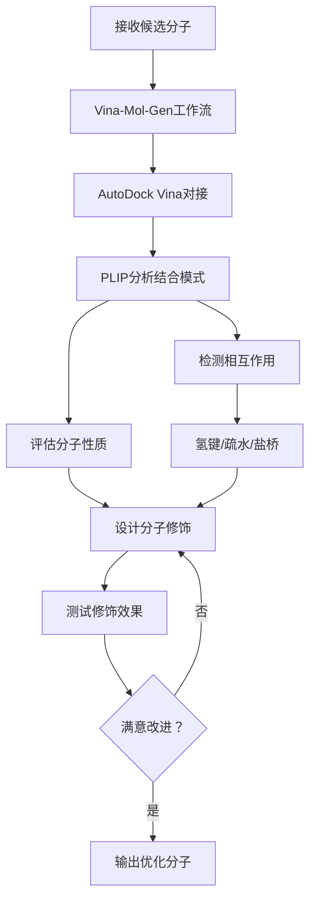
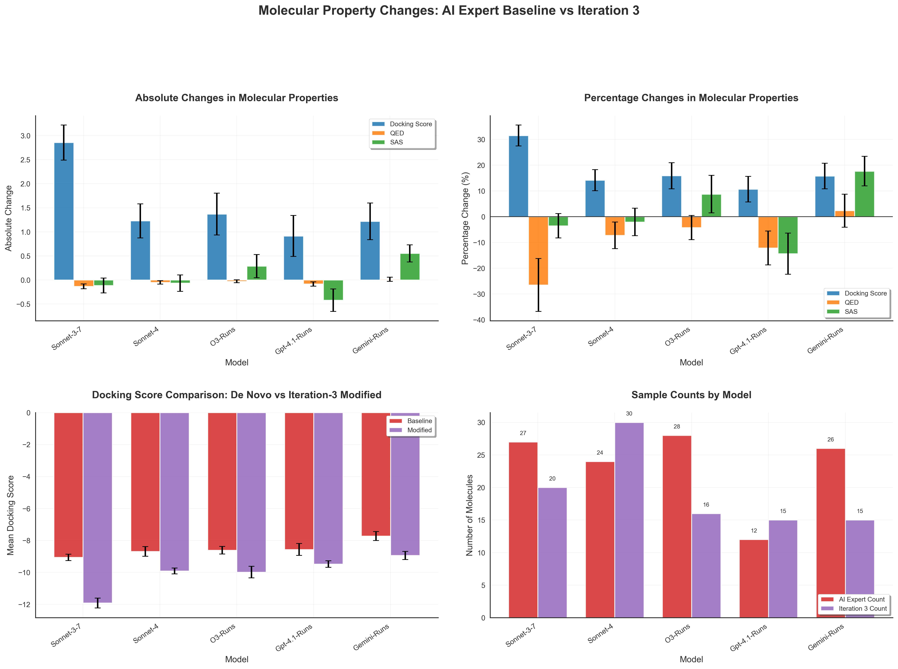
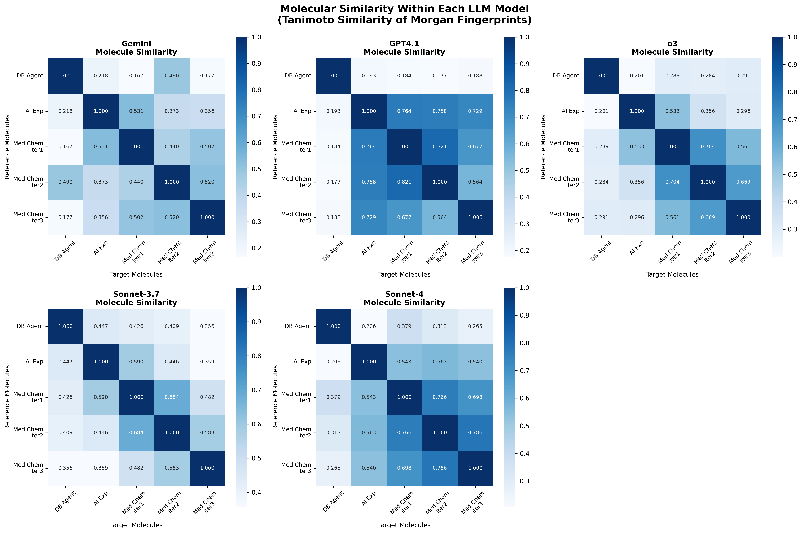
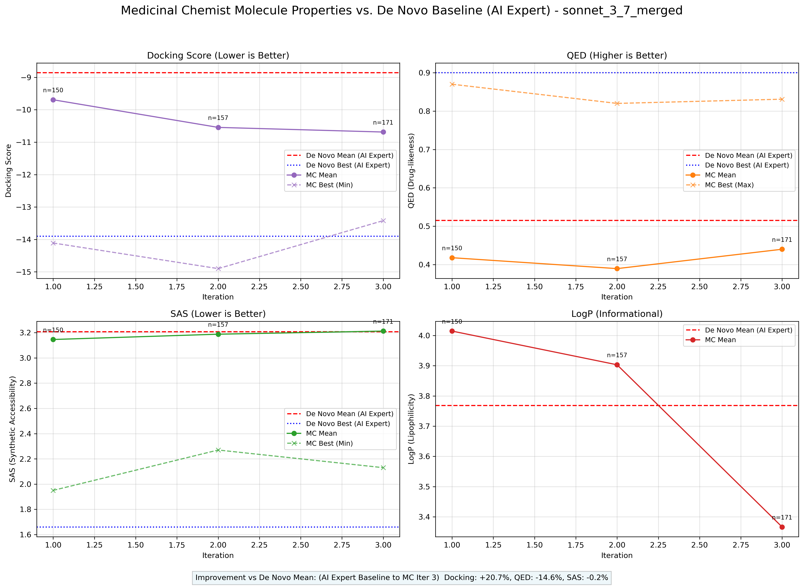
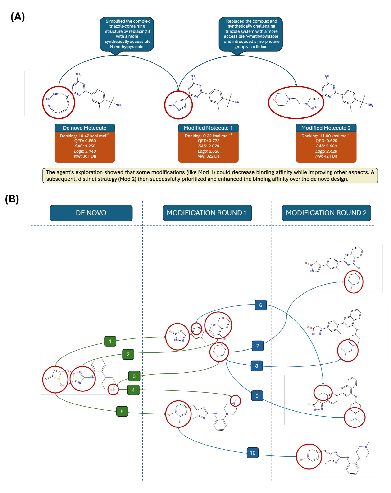

# 可审计的自动化药物分子优化多智能体平台

## 本文信息
- **标题**：An Auditable Agent Platform for Automated Molecular Optimisation
- **作者**：Atabey Ünlü, Phil Rohr, Ahmet Celebi
- **单位**：DeltaWave
- **期刊**：arXiv预印本
- **发表时间**：2025年8月5日
- **引用格式**：Ünlü, A.; Rohr, P.; Celebi, A. An Auditable Agent Platform for Automated Molecular Optimisation. *arXiv*, 2025, arXiv:2508.03444v1.

## 摘要

> 药物发现常常因数据、专业知识和工具的分散而失去动力，减缓了设计循环。为了缩短这一循环，我们构建了一个**分层的、工具使用的多智能体框架**来自动化分子优化。一个**首席研究员**定义每个目标，**数据库智能体**检索靶点信息，**AI专家**使用序列到分子深度学习模型从头生成骨架，**药物化学家**在调用对接工具的同时编辑它们，**排名智能体**对候选分子评分，**科学评审**监督逻辑的正确性。每次工具调用都被总结和存储，使得完整的推理路径保持可检查。智能体通过简洁的**溯源记录**进行通信，捕获分子谱系，构建**可审计的、以分子为中心的推理轨迹**，并通过上下文学习重用成功的转化。

### 核心结论

- **多智能体架构在专注优化时表现卓越**：在针对单一目标（如结合亲和力）的优化中，多智能体架构将平均预测结合亲和力提高了31%
- **单智能体架构生成更优的药物样性质**：单智能体运行产生的分子具有更优的药物样性质，但代价是结合亲和力得分较低
- **可审计性是关键优势**：与单一大语言模型相比，智能体框架创建了**透明的推理轨迹审计跟踪**
- **上下文学习和反馈循环至关重要**：测试时缩放、专注的反馈循环和溯源记录将通用LLM转化为分子设计的可审计系统

## 背景

药物发现常被认为是一个漫长而昂贵的过程，往往需要**10-15年**和**数十亿美元**的研发投入。在这个过程的早期阶段，计算化学家需要从头设计新的分子结构，优化它们的药物样性质，并预测它们与生物靶点的结合亲和力。这个流程传统上需要多个专业领域的紧密协作：生物信息学家检索靶点信息，计算化学家运行分子对接模拟，合成化学家评估可合成性，药物化学家平衡多个竞争目标。

然而，这种**多学科协作模式存在明显瓶颈**：专业知识分散在不同工具和数据库中，数据转移和沟通成本高昂，迭代周期长。即使有了人工智能辅助，目前的AI工具往往是孤立的“黑箱”，缺乏对整个优化流程的系统性协调。

近年来，**大语言模型**在化学推理和分子设计方面展现出惊人的能力。但如何将LLM的化学知识与专业的计算工具结合，构建一个**可解释、可审计、可复现**的自动化分子优化流程，仍然是一个开放性问题。

### 关键科学问题

本研究系统地探索了以下核心问题：

1. **多智能体架构的有效性**：相比单一LLM，分工明确的多智能体系统能否在分子优化任务中取得更好表现？
2. **架构设计的权衡**：在专注优化单一目标（如结合亲和力）和平衡多个药物性质之间，不同架构如何取舍？
3. **可审计性与透明度**：如何让AI系统的推理过程变得可检查、可理解、可复现？
4. **LLM的化学推理能力**：不同的大语言模型在执行复杂的多步骤分子优化任务时表现如何？

### 创新点

- **分层多智能体架构**：构建了包含6个智能体和5个工具的分子优化系统
- **可审计的推理轨迹**：每次工具调用和决策都被记录，构建完整的分子谱系和推理路径
- **系统性的架构对比**：在真实药物靶点（AKT1）上系统比较了单一LLM、单智能体和多智能体架构
- **五大大语言模型评测**：对GPT-4.1-turbo、Sonnet-3.7、Sonnet-4、Gemini 2.5 Pro、o3等5个模型进行了全方位评估

---

## 研究内容

### 多智能体系统架构

研究构建了一个**分层多智能体系统**，在顺序对话模型下运行，旨在自动化**从头药物发现的分子优化阶段**。该架构由**首席研究员智能体**协调，该智能体定义高层目标并协调专业下级智能体在顺序工作流中的任务。

**图1：多智能体架构**。该系统采用6个智能体和5个工具的架构，其中3个工具（UniProt、PDB、ChEMBL）通过单一API调用访问，另外2个（Vina-Mol-Gen和Vina-Report）是复合工作流，将多个工具打包到单次调用中。

系统包括以下六个智能体：

| 智能体 | 主要职责 | 关键工具 |
|--------|----------|----------|
| **首席研究员**（Principal Researcher） | 定义高层目标，协调任务顺序，启动优化循环 | 无 |
| **数据库智能体**（Database Agent） | 检索靶点的基础数据 | UniProt、PDB、ChEMBL |
| **AI专家**（AI Expert） | 从头生成分子骨架 | Prot2Mol深度学习模型 |
| **药物化学家**（Medicinal Chemist） | 编辑分子结构，调用对接工具 | Vina-Mol-Gen工作流 |
| **排名智能体**（Ranking Agent） | 综合评分和候选分子排序 | Vina-Report工作流 |
| **科学评审**（Scientific Critic） | 监督逻辑正确性，检查科学假设 | 无 |

#### 工作流程详解

每个优化循环由首席研究员启动，然后按预定顺序将控制和上下文传递给相应的智能体：

1. **首席研究员**定义目标（例如：“优化AKT1抑制剂的结合亲和力”）
2. **数据库智能体**从UniProt检索AKT1蛋白信息，从PDB获取结构数据，从ChEMBL收集已知配体
3. **AI专家智能体**使用Prot2Mol模型生成从头分子骨架
4. **药物化学家智能体**执行多轮迭代优化（详见下）
5. **排名智能体**综合所有结果，对候选分子进行排序
6. **科学评审**检查逻辑链条，识别有缺陷的科学假设

#### 工具驱动的迭代流程详解

药物化学家智能体通过**多轮迭代反馈**实现分子优化：

**核心工具与功能**：

- **AutoDock Vina**：预测结合亲和力（kcal/mol）和结合姿态
- **PLIP**：自动检测蛋白质-配体非共价相互作用，包括氢键、疏水相互作用、π-π堆积、盐桥等
- **RDKit**：计算QED、SAS、LogP等药物样性质

#### 核心设计原则

系统的核心设计原则是**将LLM驱动的推理与领域专用工具集成**。每个智能体都配备了一组计算工具，从执行单一计算的原子工具（如从特定数据库检索数据）到管理复杂、多步骤操作的复合工作流不等。

这些工具由成熟的科学软件驱动，包括：**RDKit**（化学信息学计算）、**Prot2Mol**（分子生成）、**AutoDock Vina**（分子对接）、**PLIP**（相互作用分析）。

#### 可审计与上下文管理机制

论文还补充了系统“可审计性”的具体实现方式，核心在于**上下文压缩**与**分子溯源记录**：

- **摘要解析器（Summary Parser）**：所有智能体读写同一条时间序列记录，但只把**关键摘要**写入共享历史，避免把冗长的原始日志塞进上下文
- **工具输出隔离**：详细的对接日志只对调用该工具的智能体可见，且只在当前回合有效，迫使智能体先完成“理解—提炼—总结”的认知步骤
- **跨轮次记忆压缩**：新一轮研究循环只接收上一轮的最终总结与目标，避免历史负担过重
- **溯源超图结构**：系统用**有向超图**记录分子改造路径，同时维护**时间序列链**与**直系谱系树**，每一步改造都标注具体发起的智能体，确保可追溯

#### 技术实现架构

系统的技术栈采用**模块化Python框架**，确保可扩展性和可维护性：

##### 核心框架

- **LiteLLM统一接口**：使用LiteLLM库作为标准化接口，统一调用Anthropic、OpenAI、Google等不同供应商的LLM API
- **直接构建**：不依赖LangChain等高层agent库，直接在LiteLLM上构建，以实现对上下文管理和工作流逻辑的细粒度控制
- **开源代码**：所有agent定义、提示词和实现细节已公开，可在GitHub仓库获取：https://github.com/deltawave-tech/delta

##### Agent定义策略

- **结构化提示**：每个智能体都遵循Virtual Lab风格，使用**标题、专业知识、目标、角色**四个维度定义
- **统一优化**：系统提示词在Sonnet-3.7上调优，然后不经修改应用于其他LLM（可能对不同模型的最优提示策略有影响）
- **顺序执行**：采用同步、基于轮次的多智能体架构，每个智能体按固定顺序行动

##### 并行化与可扩展性

- **并行执行策略**：同时运行N=20个独立的完整发现流程，而非单一长流程
- **Best-of-N选择**：所有并行run完成后，聚合候选分子，基于主要优化目标（如对接分数）进行最终选择
- **加速探索**：并行化策略使系统能够同时探索化学空间的不同区域，显著提升发现高质量候选分子的效率

##### 溯源服务实现

- **有向超图核心**：用有向超图建模分子关系，transformations作为hyperedges连接输入和输出分子
- **三重结构**：依赖超图（数据流）+ 时间序列链（不可变线性记录）+ 直系谱系树（快速回溯）
- **内存数据库**：实时记录所有分子候选的进化历史，支持快速查询和分析

---

### 实验设计：针对AKT1的分子优化

研究以**AKT1蛋白**为靶点进行系统性评估，AKT1是一个重要的药物靶点，参与细胞生长、增殖和存活的调节，与多种癌症密切相关。

#### 模型选择与评估

研究评估了**5个大语言模型**驱动的智能体团队：**Claude 3 Sonnet**（Sonnet-3.7，Anthropic）、**Claude 4 Sonnet**（Sonnet-4，Anthropic）、**GPT-4.1-turbo**（OpenAI）、**Gemini 2.5 Pro**（Google）和**o3**（OpenAI）。

每个模型都驱动上述多智能体系统，进行**三轮优化循环**，每个模型至少进行了三次独立重复。主要评估指标包括：

- **对接分数**（Docking Score）：预测结合亲和力，越低越好（单位：kcal/mol）
- **药物样性质**（QED）：Quantitative Estimate of Drug-likeness，越高越好（范围0-1）
- **合成可及性**（SAS）：Synthetic Accessibility Score，越低越好（范围1-10）
- **脂溶性**（LogP）：脂水分配系数，用于评估药代动力学性质
- **相似性与分布一致性**：与已知AKT1抑制剂的Tanimoto相似性，以及FCD（Frechet ChemNet Distance，越低越好）

**分子表示说明**：论文在生成与评估阶段以SMILES作为核心表示形式，SMILES有效性与唯一性由RDKit解析与规范化完成；进入对接前，SMILES会被转换为三维构象用于AutoDock Vina与PLIP分析。

#### 实验设置

研究设计了三种架构配置进行对比，并基于领先模型进行对照实验：

| 架构配置 | 描述 | 优势 | 劣势 |
|---------|------|------|------|
| **单一LLM**（LLM-only） | 不使用工具，仅依赖LLM的内在知识 | 最快，无需外部工具调用 | 推理路径不可验证，缺乏精确计算 |
| **单智能体**（Single-Agent） | 一个全能智能体访问所有工具 | 架构简单，平衡多个目标 | 可能采用保守策略，优化不够专注 |
| **多智能体**（Multi-Agent） | 6个专业智能体分工协作 | 专注优化单一目标，可审计性强 | 复杂度高，可能忽视次要目标 |

---

### 核心发现1：多智能体架构显著提升结合亲和力

研究首先比较了5个LLM驱动的多智能体系统在三轮优化后的表现。结果显示，**Sonnet-3.7**在提高预测结合亲和力方面最为有效。

**图2：各LLM驱动的智能体团队在AI专家基线分子和第3轮迭代后的分子之间，对接分数、QED和SAS的绝对变化（A）和百分比变化（B）**。误差线表示三次重复运行的标准误差均值。

#### 关键观察

所有模型在对接分数上都有显著提升：
- **Sonnet-3.7**：平均对接分数下降约**3 kcal/mol**，相对提升约30%
- **GPT-4.1-turbo**：对接分数下降幅度明显小于Sonnet-3.7
- **其他模型**：提升幅度较小

然而，这种专注的优化也带来了**权衡**：在追求更高结合亲和力的同时，药物样性质和合成可及性可能下降。这揭示了多智能体架构的一个重要特征——**通过隔离反馈循环实现专注的优化策略**。

#### 多智能体架构的优势

多智能体架构的优势在于其**分层和专业化的结构**：
- **首席研究员**确保整个团队专注于单一主要目标
- **药物化学家智能体**可以大胆地进行结构修饰，因为**排名智能体**会基于客观指标进行评估
- **科学评审**的逻辑监督避免了有缺陷的科学假设

这种架构在**专注优化结合亲和力**时表现出色，平均预测结合亲和力提高了31%。但也暴露了一个问题：过度优化单一目标可能导致其他重要性质的忽视。

---

### 核心发现2：分子相似性热图揭示不同的优化策略

为了理解不同LLM的优化行为，研究分析了**Tanimoto相似性热图**，比较起始分子（数据库智能体和AI专家智能体）与三轮药物化学家智能体优化后产生的分子之间的结构相似性。

**图3：Tanimoto相似性热图**。面板A-E分别报告了Gemini、GPT-4.1-turbo、o3、Sonnet-3.7和Sonnet-4的数据库智能体化合物、AI专家智能体从头生成物、以及三轮药物化学家智能体优化循环后产生的分子之间的相似性。较深的方块表示更高的结构重叠（标度0-1）。

#### 两种探索模式

热图揭示了两种截然不同的优化模式：

| 模式 | 模型 | Tanimoto相似性变化 | 优化策略 | 推理风格 |
|------|------|-------------------|----------|----------|
| **保守优化模式** | GPT-4.1-turbo | 0.76→0.73（几乎不变） | 局部编辑为主，变化幅度小 | “思考太快”，偏向低风险编辑 |
| | Sonnet-4 | 约0.76→0.54（小幅下降） | 相对保守但略微“放开” | 标准自回归模型 |
| **激进探索模式** | o3、Gemini、Sonnet-3.7 | 大幅下降 | 大幅度骨架转变，探索广化学空间 | 愿意承担风险，大胆结构改变 |

这反映了不同LLM的内在推理风格：**标准自回归模型“思考太快”**，优先考虑早期不确定性信号，因此偏向于保守、低风险的编辑。而其他模型更愿意进行大胆的结构改变。

#### 补充：与已知AKT1抑制剂的相似性

作者还比较了生成分子与已知AKT1抑制剂的相似性与分布一致性，结论要点如下：

- **新颖性确认**：所有模型生成的分子与已知AKT1抑制剂相比均为新结构
- **结构相似性**：Sonnet-3.7的平均最大Tanimoto相似性最高，达到0.458
- **物化分布一致性**：FCD结果显示Sonnet-4的物化分布最接近已知抑制剂，略优于Sonnet-3.7
- **药物样性质**：o3在平均QED与Lipinski合规性上领先，Gemini在SA分数上表现最好

---

### 核心发现3：迭代的分子性质优化

研究详细分析了**药物化学家智能体**的迭代优化过程，揭示了智能体如何在多目标之间权衡并调整策略。

**图4：药物化学家智能体（MC）与AI专家智能体基线（Sonnet-3.7）的迭代分子性质优化**。子图展示了：（A）对接分数（越低越好），（B）药物样性质（QED，越高越好），（C）合成可及性评分（SAS，越低越好），以及（D）LogP（脂溶性，参考信息）。实线表示MC平均性能，虚线表示最佳单个MC分子性能，蓝点线表示AI专家智能体的平均初始输出，红点线表示AI专家智能体的最佳初始输出。

#### 关键发现

在每个迭代中，智能体都成功地将**平均预测结合亲和力**推向更低：**初始**-10.05 kcal/mol → **最终**-11.91 kcal/mol，**提升31.5%**。这一改进展示了智能体**利用对接工具进行有针对性优化的强大能力**。更令人印象深刻的是，智能体并非盲目地追求更好的对接分数，而是在多个性质之间进行**复杂的权衡**。

#### 多路径权衡

论文给出的案例展示了智能体的**多路径优化与权衡能力**：

1. **起点分子**：de novo骨架对接分数约-9.73 kcal/mol，QED约0.618
2. **路径A**：引入氧二唑酮-喹唑啉核心，并将哌嗪替换为哌啶（修饰1-3），对接提升到约-10.68，但QED下降到约0.481
3. **路径B**：将噻吩换为羟基苯基，并对哌嗪进行N-甲基化（修饰4-5），对接保持在约-10.0，同时QED提升到约0.84
4. **后续迭代**：在氧二唑酮系列上引入二氟甲基与二氟乙基（修饰6与8），对接改善到约-10.71与-11.12，但QED下降到约0.300-0.442
5. **收敛策略**：同时引入二氟甲基与二氟乙基侧链（修饰9）维持较强结合并提示潜在代谢稳定性；在羟基苯基支路上去甲基（修饰10）得到更高QED（约0.863），对接仅小幅下降至约-9.33

这个案例说明智能体并非盲目追求单一指标，而是**在多目标之间持续权衡**，并通过并行策略保留可用的改造路径。

**图5：LLM驱动的多步分子改造路径示意**。  
（A）从de novo分子出发，连续两步修改得到两个分支产物，红圈标记关键结构变化。  
（B）三轮优化中的并行分支路径，展示智能体在不同支路上同步探索并保留高潜力改造。

---

### 核心发现4：架构对比——专注与平衡的权衡

研究先按平均对接分数筛选出表现最好的模型，并对排名靠前的模型进行了**20次独立放大运行**以降低随机性偏差。在此基础上，再用领先模型对比**单一LLM**、**单智能体**与**多智能体**三种架构。

#### 性能对比

| 架构配置 | 对接分数表现 | 药物样性质 | 优势 | 代价 |
| --- | --- | --- | --- | --- |
| **多智能体**（Multi-Agent） | **提升最明显**（平均结合亲和力提升31%） | 中等 | 专注优化单一目标，反馈回路清晰 | 可能牺牲部分药物样性质 |
| **单智能体**（Single-Agent） | 中等 | **更优** | 更自然地平衡多目标 | 结合亲和力提升有限 |
| **单一LLM**（LLM-only） | 变化有限 | 变化有限 | 速度最快 | 推理路径不可验证 |

#### 关键洞察

研究揭示了**架构设计的权衡**：

**多智能体架构**：
- **最适合专注优化**：通过隔离反馈循环，能够激进地追求单一主要目标
- **分层专业化**：首席研究员确保团队专注，药物化学家智能体大胆尝试，排名智能体客观评估
- **31%提升**：在预测结合亲和力上取得显著改进

**单智能体架构**：
- **自然采用平衡策略**：当面临多参数复杂性时，倾向于保守、平衡的策略
- **更优的药物样性质**：虽然结合亲和力提升较小，但生成的分子具有更好的药物样性质
- **避免瓶颈**：不需要在不同智能体间传递上下文

无论采用单智能体还是多智能体架构，相比单一LLM，都有**显著的透明度优势**：
- **显式的工具调用**记录了推理步骤
- **智能体间的通信**创建了透明的审计跟踪
- **可分析的推理过程**允许理解系统的决策逻辑

---

## Q&A

- **Q1**：多智能体架构的“可审计性”具体体现在哪里？为什么这对药物发现很重要？
- **A1**：可审计性体现在多个层面：
  - **工具调用记录**：每次对接计算、性质计算都被记录
  - **分子谱系追踪**：从起始分子到最终候选，每一步修饰都有完整记录
  - **推理轨迹透明**：药物化学家智能体的决策过程（为何进行这个修饰）被明确记录
  - **同行评审模拟**：科学评审的监督避免了有缺陷的科学假设

  这对药物发现至关重要，因为：
  - **知识积累**：成功和失败的经验可以被团队学习和重用
  - **责任追溯**：当候选分子进入后续验证阶段时，可以回溯设计依据

- **Q2**：研究提到部分模型“思考太快”，偏向保守编辑，这是什么意思？
- **A2**：这反映了LLM在处理复杂优化任务时的**推理风格差异**：
  - **“思考太快”**：标准自回归模型在生成过程中，一旦对某个方向产生信心，就会快速推进，不太愿意重新考虑
  - **早期不确定性信号**：模型过于依赖早期的微弱信号，导致风险规避
  - **保守编辑**：更倾向于进行局部的、安全的修饰，而不是大胆的结构改变

  从分子相似性热图可以看出：
  - **GPT-4.1-turbo**的结构变化最小，三轮后仍保持较高相似性
  - **Sonnet-4**比GPT-4.1-turbo更“放开”，但仍偏保守
  - **o3**、**Gemini**、**Sonnet-3.7**更愿意进行大幅度骨架跃迁
  - 这暗示了不同的**探索-利用权衡**策略

- **Q3**：智能体的多路径权衡能力是如何实现的？这是模型本身的能力还是架构设计的优势？
- **A3**：这是**架构设计**与**LLM能力**的结合：
  - **架构优势**：多智能体系统将复杂问题分解为子任务，每个智能体专注于自己的领域
  - **工具反馈**：对接分数和性质计算提供了客观反馈，智能体基于这些结果调整策略
  - **上下文积累**：每次迭代的完整记录都传递给下一轮，形成了上下文学习
  - **LLM能力**：现代LLM具备了理解失败原因、识别成功部分、组合多种策略的推理能力

  具体来说：
  - 智能体会同时维护多个支路，并用对接与性质反馈筛选“可保留的改造”
  - 这种**并行探索—择优保留**的机制，既来自于LLM的推理能力，也来自于架构提供的结构化反馈
  - 单一LLM也能尝试类似策略，但缺乏稳定的工具反馈与可追溯记录，难以系统化复用

---

## 关键结论与批判性总结

### 核心贡献

本研究构建了**可审计的多智能体平台**用于药物分子优化，并在真实药物靶点上进行了系统性评估：

1. **架构权衡的量化**：多智能体架构在专注优化时表现卓越（31%提升），单智能体在平衡目标时更优
2. **可审计性的实现**：通过溯源记录和工具调用日志，构建了完整的推理轨迹
3. **LLM化学推理的评估**：系统比较了5个SOTA大语言模型在复杂分子优化任务中的表现
4. **多路径权衡的机制**：揭示了智能体如何通过多步骤策略解耦问题并迭代改进

### 局限性与挑战

1. **靶点依赖性**：研究仅针对AKT1一个靶点，结论在其他靶点上的普适性需要验证
2. **工具覆盖范围**：目前仅包括对接和基础性质计算，尚未整合ADMET和选择性预测
3. **评估指标**：主要依赖预测的对接分数，缺乏实验验证

### 未来方向

1. **扩展工具集**：整合ADMET预测、选择性预测、合成路线规划等更多专业工具
2. **多靶点优化**：将系统应用于更多药物靶点，验证结论的普适性
3. **实验验证**：对AI设计的候选分子进行合成和实验测试，验证预测准确性
4. **人机协作模式**：探索人类专家如何与智能体团队更有效地协作

### 对实践者的建议

1. **明确优化目标**：如果你的主要目标是结合亲和力，使用多智能体架构；如果需要平衡多个性质，考虑单智能体架构
2. **投资可审计性**：即使性能略有牺牲，完整的推理轨迹记录对长期成功至关重要
3. **选择合适的LLM**：Sonnet-3.7在专注优化时表现最佳，但不同任务可能适合不同模型
4. **监控多目标平衡**：即使专注优化主要目标，也要定期检查其他关键性质，避免过度优化

---

> **最后的话**：本研究展示了多智能体系统如何将通用大语言模型转化为**可审计的、领域专用的专家团队**，并验证了分层协作与工具驱动的可行性。它更像是一种**工作流层面的升级**：把分散的工具与知识组织为可追溯的链条。对实践者而言，关键不是“是否用AI”，而是如何**定义目标、设置反馈回路、保留可审计证据**，让自动化真正服务于科学判断。
