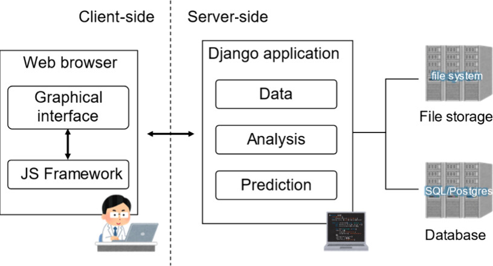
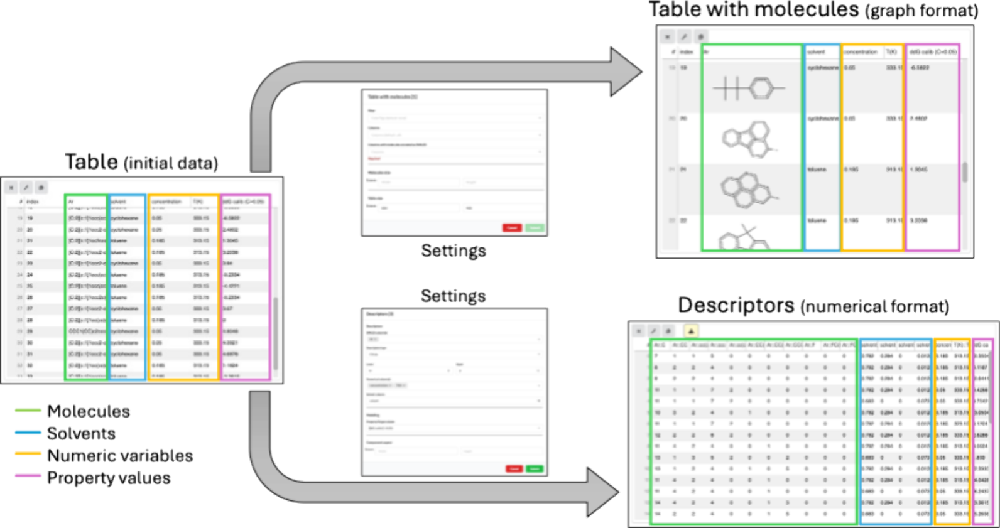
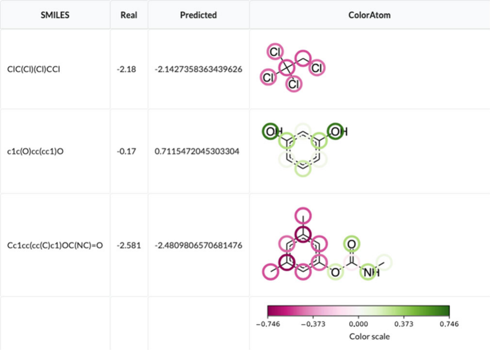
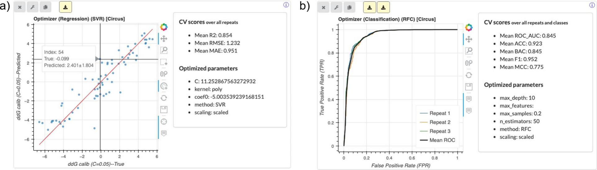
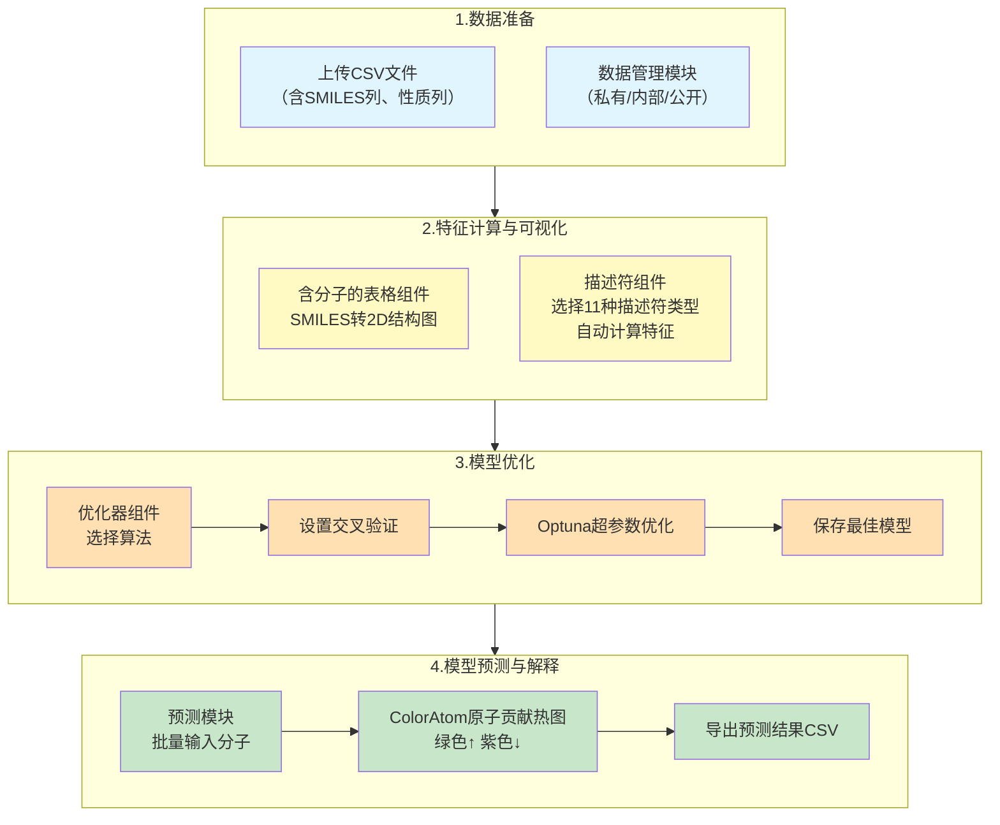

# 零代码玩转化学信息学CADS平台整合：DOPtools实现从分子结构到性质预测的全流程自动化

## 本文信息
- **标题**: 整合DOPtools与CADS的网页用户界面，用于结构描述符计算、模型优化与预测
- **作者**: Philippe Gantzer, Micke Kuwahara, Keisuke Takahashi, Pavel Sidorov
- **发表时间**: March 19, 2026
- **单位**: 日本北海道大学化学反应设计与发现研究所（ICReDD）、北海道大学化学系
- **引用格式**: Gantzer, P., Kuwahara, M., Takahashi, K., & Sidorov, P. (2025). Integration of DOPtools and CADS in a Web-Based User Interface for Structural Descriptor Calculation, Model Optimization, and Prediction. *Journal of Chemical Information and Modeling*. https://doi.org/10.1021/acs.jcim.5c03055
- **代码与平台**:
  - CADS平台在线访问：https://cads.eng.hokudai.ac.jp
  - CADS源代码：https://github.com/Material-MADS/mads-app （revision 84f74c3及以上）
  - DOPtools库：https://github.com/POSidorov/DOPtools

## 摘要
> 定量构效关系（QSPR）建模通常需要在不同工具间切换来完成描述符计算和模型构建，这对缺乏编程经验的实验科学家构成了障碍。本研究将DOPtools——一个专门用于分子描述符计算和模型构建的Python库——无缝整合到CADS（基于数据科学的催化剂获取）平台中。这一整合使得用户**无需编写代码**，即可通过网页界面完成**从分子结构（SMILES编码）到描述符计算、再到模型超参数优化和性质预测的全流程**。新增功能包括：支持分子结构的2D可视化、自动化超参数优化（基于Optuna）、批量预测能力，以及通过ColorAtom模块实现的**模型可解释性可视化**（展示每个原子对预测结果的贡献）。该平台支持私有数据部署，为化学、材料和药物研发领域提供了开放、可定制且用户友好的QSPR建模解决方案。

### 核心结论
- **无缝整合**：将DOPtools的11种描述符计算能力和机器学习模型优化功能嵌入CADS的网页界面，用户无需编程即可完成复杂建模任务。
- **自动化建模流程**：支持从SMILES字符串自动计算分子描述符、进行超参数优化（支持SVM和随机森林），并自动选择最优模型。
- **模型可解释性**：集成ColorAtom功能，可在预测结果上叠加原子级别的贡献热图（绿色表示增加性质值，紫色表示降低），帮助用户理解模型决策。
- **私有数据友好**：CADS平台开源且支持本地服务器部署，适合处理敏感或专有化学数据。
- **性能稳健**：在ddG性质预测任务中，500次优化尝试即可达到R² ≈ 0.85，且预测1000个分子仅需约45秒。

## 背景

在药物发现、催化剂设计和材料开发中，从分子结构预测其性质（如溶解度、血脑屏障穿透性、反应选择性等）是核心任务之一。传统的实验筛选方法成本高、周期长，而**定量构效关系（QSPR）建模**通过建立分子结构与性质之间的数学关系，提供了一种高效的替代方案。

然而，QSPR建模的落地面临三重障碍：**计算描述符需要编程**（如RDKit、Mordred等库需通过Python调用）、**模型优化需要机器学习专业知识**（超参数调优、交叉验证等）、**工具链碎片化**（描述符计算、模型训练、预测往往需要多个独立软件）。尽管已有像KNIME、Pipeline Pilot这样的图形化工作流平台，但它们通常需要本地安装，计算能力受限于个人电脑，且难以处理敏感数据。而网页平台如OCHEM虽然免安装，但多为闭源，无法部署在本地网络。

正是在这一背景下，**CADS平台**应运而生。它最初是为催化剂数据科学设计的开源网页平台，支持数据管理、分析和预测。但其早期版本不支持分子描述符的自动计算，也不具备模型超参数优化功能。本研究将**DOPtools**——一个同样由该团队开发的Python库——整合进CADS，填补了这一空白。

**DOPtools技术架构**：该库基于成熟的化学信息学工具链构建，包括Chython（1.78版本）用于结构解析、RDKit（2024.9.5版本）用于分子操作、scikit-learn（1.6.1版本）用于机器学习，以及Optuna（4.2.1版本）用于超参数优化。支持的算法包括支持向量机、随机森林和XGBoost（命令行版本），模型可保存为标准的scikit-learn pipeline格式，便于复用和部署。

> 这种整合实现了**优势互补**：DOPtools作为“引擎”提供强大的计算能力，CADS作为“驾驶舱”提供友好的用户界面，使得用户可以在网页上完成从分子结构输入到模型部署的全流程，**无需编写一行Python代码**。

**图1：CADS平台总体架构概览**
- 图中将平台分成两个互补部分：**服务器端**负责计算、存储和任务执行，**客户端**提供面向用户的图形界面。
- 这张图的意义在于先交代整个平台的分工，再去理解后面新增的“含分子的表格”“描述符”“优化器”和预测模块升级各自落在哪一层。
- 从工作流角度看，DOPtools主要嵌入在服务器端的数据处理与建模链条中，而CADS负责把这些能力组织成可交互、可管理、可部署的网页组件。

### 创新点

- **零代码分子描述符计算**：用户只需上传包含SMILES列的CSV文件，即可通过网页表单选择描述符类型（如Morgan指纹、RDKit指纹、Mordred 2D描述符等），后台自动调用DOPtools和RDKit完成计算。
- **一体化模型优化**：在同一个网页组件中，用户可完成“描述符计算 → 超参数优化 → 模型保存”的完整流程，无需在多个工具间切换。
- **原子水平模型解释**：预测页面集成ColorAtom，以2D分子图形式展示每个原子对预测值的贡献（绿色为正贡献，紫色为负贡献），使黑箱模型透明化。
- **灵活的数据输入**：不仅支持分子结构，还支持溶剂名称（自动匹配物化性质）和用户自定义数值特征，适配多种建模场景。
- **性能基准公开**：论文提供了详细的性能测试数据（不同尝试次数、交叉验证折数下的时间与R²），为用户评估计算资源需求提供参考。

---

## 研究内容

### 核心方法：平台架构与工作流

CADS平台采用**客户端-服务器架构**，前端基于React提供交互界面，后端使用Django框架和Python脚本执行计算任务。本次整合主要新增了三个核心组件和一个预测模块的升级。

**图2：含分子的表格组件和描述符组件的数据处理展示**

- 左侧“含分子的表格”组件将SMILES文本编码的结构转换为2D分子图，便于用户直接检查分子或反应条目是否被正确解析。
- 右侧“描述符”组件从SMILES编码的结构（包括R基团和反应）以及溶剂名称自动计算描述符值，并以表格形式展示结果。
- 初始数据来自Tsuji等人的数据集，包含分子、溶剂和相关性质，仅用于演示目的。

#### 1. 含分子的表格组件

**核心功能**：将数据表中SMILES编码的分子或反应式转换为2D结构图（SVG格式）

- **实现方式**：利用Chython库解析SMILES并生成矢量图，支持任意缩放而不失真
- **应用场景**：在建模前快速检查数据质量，或建模后查看预测效果较好的分子结构
- **数据管理**：支持三级访问权限控制

| 权限级别 | 访问范围 | 适用场景 |
|----------|----------|----------|
| 私有 | 仅上传者和指定用户可访问 | 企业专有数据、未公开研究结果 |
| 内部 | 平台所有注册用户可访问 | 实验室内部共享数据 |
| 公开 | 所有人可访问 | 公开数据集、已发表研究数据 |

这种灵活的权限管理使得平台既能处理公开数据集，也能安全地管理企业或实验室的专有数据。

#### 2. 描述符组件

**核心功能**：从SMILES自动计算分子描述符，生成特征表。**支持的11种描述符类型**：

| 类别 | 描述符名称 | 可调参数 |
|------|------------|----------|
| 指纹类 | Morgan指纹 | 位数 |
| 指纹类 | Morgan特征指纹 | 最大半径 |
| 指纹类 | RDKit指纹 | 位数 |
| 指纹类 | RDKit线性指纹 | 最大长度 |
| 指纹类 | RDKit分层指纹 | 无 |
| 指纹类 | Avalon指纹 | 位数 |
| 指纹类 | Atom Pair指纹 | 无 |
| 指纹类 | Torsion指纹 | 无 |
| 碎片类 | ChyLine碎片 | 最小/最大长度 |
| 碎片类 | Circus碎片 | 最小/最大半径 |
| 全描述符 | Mordred 2D描述符 | 计算超过1800种2D分子描述符 |

##### 输入灵活性

- 支持**SMILES字符串**作为输入格式，这是化学信息学最通用的文本表示方式
- 对于反应体系，支持**SMILES CGR**（缩合图表示）格式
- 可同时输入溶剂名称，自动匹配152种溶剂的Catalán物化性质描述符
- 支持用户自定义外部数值特征，扩展性极强

这里的“溶剂”并不是所有任务都必须提供的输入列，而是一个**可选的上下文特征**。当目标性质本身会随着实验介质变化时，平台可以把溶剂名称映射为Catalán参数，让模型同时学习分子结构与反应/测量环境对结果的共同影响；在ddG这类反应选择性任务中，这一点尤其重要。

在特征计算阶段，DOPtools会**自动跳过无法计算的分子**（如包含非标准元素的SMILES），并在日志中记录错误。平台会**自动移除方差为零的特征**（即所有分子在该特征上的值相同），因为这些特征对模型没有区分能力。用户也可以在建模前通过“描述符”组件**预览特征表**，手动检查是否存在异常条目或不合理特征。输出为一张包含所有特征和性质列的表格，用户可下载为CSV用于其他分析。

#### 3. 优化器组件（分回归和分类两个版本）

这是本次整合的核心，将DOPtools的模型优化能力以表单形式呈现给用户。

##### 配置流程（以回归任务为例）

1. **描述符设置**：与“描述符”组件相同，选择要计算的特征类型
2. **建模设置**：
   - 选择目标列（要预测的性质）
   - 选择算法：支持**支持向量回归**（SVR）和**随机森林回归**（Random Forest）
   - 设置交叉验证折数（如3、5、10折）和重复次数（如3、5、10次）
3. 可选留出一部分数据作为**外部测试集**，用于独立评估；不过论文正文只说明了平台支持这一功能，并**未展开具体的切分方式或默认设置**
4. **保存模型**：优化完成后，可将最佳模型（按交叉验证平均R²最高选择）保存到服务器，供后续预测使用

#### 优化算法详解

- DOPtools底层使用**Optuna框架**进行超参数搜索，采用k-fold交叉验证策略来评估每组参数的性能
  - **交叉验证支持多次重复**，以减少数据划分随机性带来的偏差，确保评估结果稳健
  - 对于SVR，搜索空间包括C值（1e-9到1e9）、核函数（线性、RBF、多项式、sigmoid）等
  - 对于随机森林，搜索空间包括最大深度（3–10）、树的数量（20–200）、最大特征选择方式等
- 模型选择标准：回归任务选择**交叉验证平均R²最高**的模型，分类任务选择**平衡准确率最高**的模型

> **关于XGBoost**：论文明确给出两层限制。第一，DOPtools 1.2的方法表中注明，**由于实现层面的技术困难**，XGBoost当前在网页GUI中被禁用；第二，正文又补充说，在当前CADS版本里，XGBoost仍可通过DOPtools命令行版本使用，但**不在网页优化器中开放**，因为其优化和训练耗时更长。作者同时指出，未来版本有望重新接入这一算法。

#### 4. 升级的预测模块

本次更新不仅增强了预测功能，还引入了**智能输入验证机制**，确保预测过程的鲁棒性。

| 特性 | 说明 |
|------|------|
| 输入方式 | 用户可一次性提交多个分子（每行一个），格式与训练时特征顺序一致（如“SMILES 溶剂名 数值特征”） |
| 智能验证 | 服务器端Python脚本会自动检查每行输入：验证字段数量、确认SMILES有效性和溶剂名称存在性、自动跳过无效行 |
| 输出内容 | 预测值列表，可选“预测并着色”功能生成ColorAtom热图直观显示原子贡献 |
| 批量性能 | 预测1000个分子约需45秒（在16核服务器上） |
| 数据安全 | 模型保存时引入了`input_type`元数据字段，自动识别所需的输入类型，防止用户误用模型 |

#### ColorAtom的作用

ColorAtom会把模型预测结果映射回2D分子结构，用原子级着色来展示不同原子对预测值的相对贡献，从而提供一种更直观的**模型逻辑可视化**。在平台层面，它的价值在于把原本难以阅读的数值预测转成化学家更容易理解的结构图，帮助用户快速判断哪些局部结构更可能推动性质升高或降低。

> 至于ColorAtom更底层的理论与实现，论文主要通过引用Marcou等人的原始工作加以说明，而没有在本文中展开算法推导。

**图4：使用Huuskonen等人溶解度数据集构建的模型进行预测**
- SMILES列和Real列显示用户提供的输入信息及可选的真实值。
- Predicted列给出模型预测值。
- ColorAtom列展示对应SMILES的2D分子图，其中绿色原子表示对预测性质有增加作用，紫色原子表示对预测性质有降低作用，颜色深浅反映相对贡献大小。
- 数据仅用于演示目的。

### 案例演示与结果分析

论文用三个数据集展示了平台的核心功能，我们逐一解读。

#### 案例一：ddG性质预测（回归任务）

Tsuji等人2023年发表的手性催化剂数据集包含反应条件、溶剂和产物对映选择性。这里的 **ddG** 指的是与对映选择性相关的**自由能差**，文中具体建模的目标列名为 `ddG calib (C=0.05)`，单位为 `kcal/mol`。

- 描述符选择理由：**CircuS碎片**（大小0到3）能够同时捕捉局部与全局结构特征，特别适合手性催化剂这类骨架较复杂的体系；**溶剂描述符**则量化了介质的极性、酸碱性等物化性质，对反应选择性有重要影响。
- 算法选择理由：**支持向量回归**（SVR）在中小样本量下表现稳健，且对高维特征空间不敏感。
- 交叉验证策略：采用**3次重复、每次10折**，目的是降低随机划分带来的偶然性，提高模型评估的可靠性。
- 优化尝试次数：设置为**500次**，在精度与计算时间之间取得平衡。

图3a展示了优化后的模型在**交叉验证训练集**上的预测值与真实值散点图。**点越靠近对角线，模型越准确**。从图中可见，大部分点落在对角线附近，说明模型具有较好的拟合与泛化表现。经过**500次优化尝试**后，**$R^2$ 约为0.86**，而RMSE和MAE也保持在较低水平，说明平台已经能够在网页端稳定完成一轮像样的回归建模。用户还可以通过鼠标悬停查看每个点的详细信息，点击后在其他组件中联动高亮对应结构，这使得**异常点分析**不再需要来回切换工具。

**图3：优化器组件运行后的界面展示**
- （a）回归优化器组件展示使用Tsuji等人数据预测ddG性质的最佳模型性能。散点图显示交叉验证中预测值与真实值的对应关系，右侧列出模型详细信息和验证指标。
- （b）分类优化器组件展示使用Roy等人数据集预测血脑屏障穿透性的最佳模型。左侧为ROC曲线，其中深蓝色表示平均曲线，浅蓝色表示各次重复曲线；右侧显示模型参数和验证指标（如平衡准确率、AUC），类别1被视为正类。

#### 案例二：血脑屏障穿透性预测（分类任务）

Roy等人2019年发布的数据集，分子被标记为“可穿透”或“不可穿透”。

- 算法选择理由：**随机森林分类器**（RFC）天然适合处理分类任务，且对特征缩放不敏感，能自动处理特征之间的交互作用。
- 评估指标选择理由：**平衡准确率**（Balanced Accuracy，即两类召回率的平均值）能更好地处理类别不平衡问题，避免模型偏向多数类。
- 可视化工具：**ROC曲线**和**AUC**提供了模型在不同阈值下的综合性能概览。

图3b展示了ROC曲线。**曲线越靠近左上角，模型区分正负类的能力越强**。图中同时显示了每次交叉验证重复的ROC曲线（浅蓝色）和平均曲线（深蓝色），因此读者不仅能看到平均表现，还能直观看到**重复之间的波动范围**。相比普通准确率，**平衡准确率**更适合这类潜在类别不平衡任务；论文也正是用它作为**交叉验证重复平均后的模型选择标准**。AUC则提供了另一个角度的佐证：从平均ROC曲线位置看，模型具备**较好的类别区分能力**。

#### 案例三：溶解度预测与原子贡献可视化

Huuskonen等人2000年发表的溶解度数据集，包含多种有机化合物。

- 描述符选择理由：**Mordred 2D描述符**覆盖了超过1800种分子特征，包含拓扑、电子和理化性质等多个维度，适合用来做这类通用小分子性质建模。
- 算法选择理由：**随机森林回归**对高维特征空间具有较好的适应性，同时也便于后续解释。
- ColorAtom价值：对于溶解度这类常常受**局部官能团**影响的性质，原子贡献可视化尤其直观。

用户在预测页面输入SMILES后，选择“Predict and color”，即可得到预测值和一个带颜色的分子结构图（图4）。其中，**绿色原子**表示对预测溶解度有**正向贡献**，**紫色原子**表示有**负向贡献**，颜色深浅反映相对贡献大小。这里最重要的 punchline 是平台把**预测值**和**结构解释**放到了同一个界面里：用户不只知道模型给了什么答案，还能快速看到**答案主要来自分子的哪些局部结构**。不过这种解释仍然更适合作为**启发式线索**，而不是直接替代化学机理判断。

下图展示了从数据上传到模型预测的完整工作流：

### 性能基准测试

论文附录提供了详细的性能测试数据（基于16核Intel Xeon Silver 4314服务器），帮助用户预估计算资源需求：

**表ST1：不同 Optuna 超参数尝试次数下的回归模型性能**（Tsuji 数据集中的 `ddG calib (C=0.05)` 性质）

| 尝试次数 | 平均 R² | 平均时间（秒） | 时间范围（秒） |
|----------|---------|----------------|----------------|
| 50       | 0.835±0.012 | 68±5 | 63–72 |
| 100      | 0.840±0.012 | 93±21 | 66–133 |
| 250      | 0.854±0.003 | 170±14 | 158–197 |
| 500      | 0.862±0.004 | 324±16 | 308–351 |
| 1000     | 0.861±0.003 | 623±17 | 604–653 |

**解读**：这里的“尝试次数”指的是 **Optuna 在超参数优化过程中评估了多少组参数**。当尝试次数从50增加到500时，**$R^2$ 从0.835提升到0.862**，但计算时间也从68秒增加到324秒。继续增加到1000次后，**性能几乎不再提升**，说明大约**500次尝试已经接近收益平台期**。这组结果给出的核心信息不是“越多越好”，而是网页端建模同样需要考虑**精度与时间的平衡**。

**表ST5：不同测试集规模下的批量预测耗时**（使用保存的模型）

| 测试集大小 | 10 | 100 | 1000 | 3000 |
|-----------|----|----|------|------|
| 平均时间（秒） | 0.46±0.009 | 5.22±0.06 | 44.9±0.1 | 133.6±0.1 |

**解读**：这里的“10、100、1000、3000”指的是**待预测条目数**，也就是通过**重复Tsuji数据集的外部测试集**得到的 `TEST SIZE`，并不是优化尝试次数。按这一设置，**1000条输入约需45秒**，**3000条约需133秒**，整体呈近似线性增长。这说明平台已经能支撑**中等规模的批量预测**，至少不会卡在“一次只能点一个分子”的演示级阶段。

---

## 关键结论与批判性总结

### 平台价值

- CADS与DOPtools的整合**显著降低了QSPR建模的技术门槛**，使实验科学家能够更专注于化学问题，而不是被脚本、依赖和模型封装细节绊住。
- **私有部署**这一点很关键，它让平台既保留了网页工具的便利性，又能适配敏感或专有数据场景，补上了很多公共在线平台做不到的一环。
- **ColorAtom可视化**的价值不只是“好解释”，而是把预测结果直接投回结构层面，让模型输出更接近化学家真正会使用的工作语言。

### 局限性

- 网页端算法支持仍有限：虽然DOPtools本身支持SVM、随机森林和XGBoost，但当前网页GUI中**XGBoost仍被禁用**，这会限制部分任务的性能上限。
- 平台论文更偏**功能展示**而非系统 benchmark：文中通过三个案例说明组件可用，但并没有在多数据集上系统比较不同描述符或算法组合的优劣，因此它更像“可用性证明”，而不是通用性能排名。
- **适用域仍待补齐**：作者在结尾明确提到未来希望引入Applicability Domain功能；这说明平台虽然已经能做预测和可解释性展示，但对“哪些预测值得信任”的提示仍不充分。

### 未来方向

- 引入**Applicability Domain**：作者明确点名了Fragment Control、Bounding Box以及基于距离的方法（如leverage）作为未来可接入CADS的平台能力。
- 增加**新描述符与新算法**：论文在结尾明确提到，未来DOPtools若加入新的描述符和机器学习算法，这些能力也可以继续整合进CADS。
- 扩展平台的**高级建模能力**：随着DOPtools后续演进，CADS有望持续扩展其面向化学信息学工作流与模型构建的功能边界。

> 小编锐评：
> - 看来主要还是好在训练过程有界面，没有真去弄性能，那跟我还是有差距。
> - 前面处理之类的技术细节还是可以借鉴下人家的，比如：方便地对新分子进行预测、设置交叉验证折数和重复次数等
