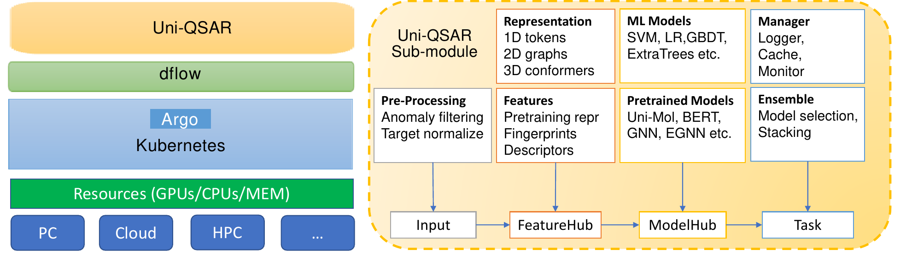
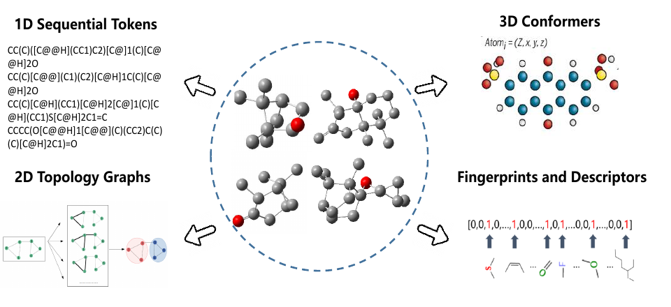
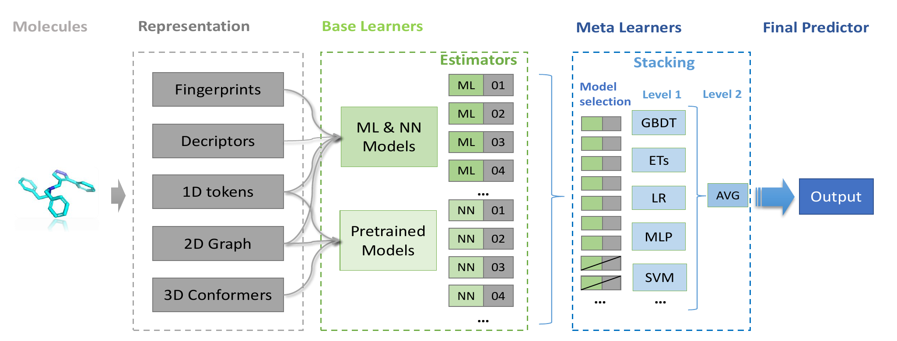
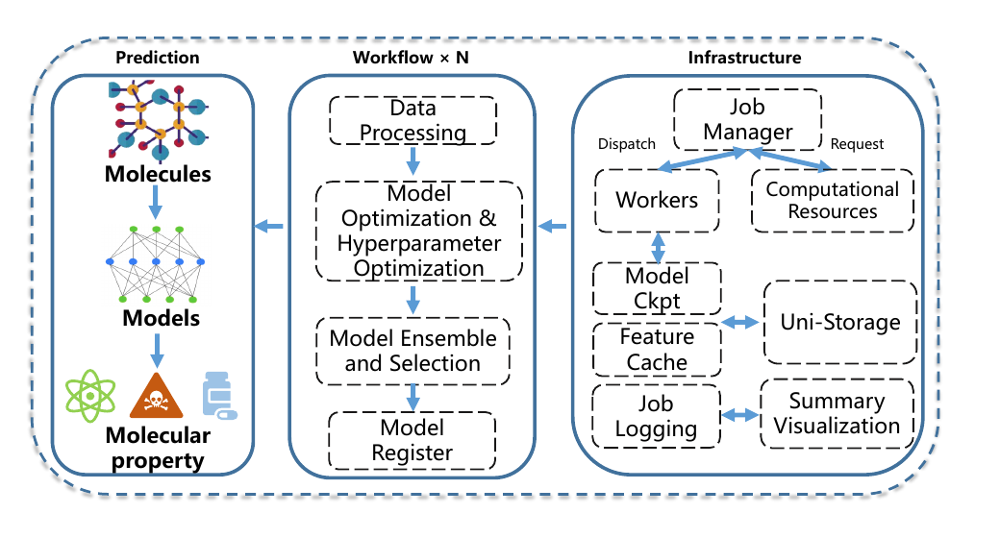
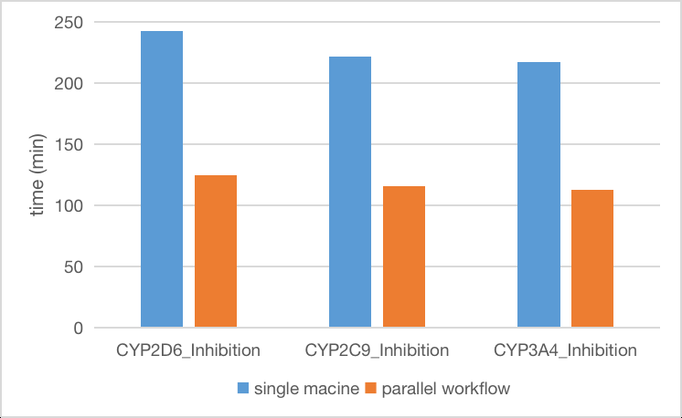
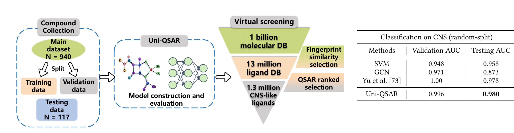

# 告别手动调参：Uni-QSAR如何让分子性质预测实现全自动化

## 本文信息
- 标题：Uni-QSAR: an Auto-ML Tool for Molecular Property Prediction
- 作者：Zhifeng Gao、Xiaohong Ji、Guojiang Zhao、Hongshuai Wang、Hang Zheng、Guolin Ke、Linfeng Zhang
- 发表时间：2023年4月24日（arXiv预印本）
- 机构：DP Technology，中国北京；Carnegie Mellon University，美国匹兹堡；Soochow University，中国苏州
- 链接：https://arxiv.org/abs/2304.12239

## 摘要

> 近年来，基于**深度学习**（DL）的定量构效关系（QSAR）模型在药物发现的性质预测任务中展现出了超越传统方法的性能。然而，大多数基于DL的QSAR模型受限于有限的标注数据，且对**模型尺度**和**超参数**非常敏感。在本文中，我们提出了**Uni-QSAR**，这是一个用于分子性质预测任务的强大**Auto-ML**框架。Uni-QSAR通过预训练模型，将**1D序列标记**、**2D拓扑图**和**3D构象**的分子表示学习与大规模无标签数据的丰富表示相结合。在所设计的并行工作流下，无需任何**人工微调**或**模型选择**，Uni-QSAR在Therapeutic Data Commons（TDC）基准的22个任务中，有**21**个达到了**SOTA**表现，平均性能提升达**6.09**%。此外，我们还展示了Uni-QSAR在真实药物研发流程中的实际应用价值。

### 核心优势

- **自动化程度高**：从数据输入到模型训练，尽量减少人工超参数调节和模型选择，降低QSAR建模的技术门槛。传统QSAR建模需要领域专家进行特征工程、模型选择和参数调优，而Uni-QSAR通过自动化工作流实现了端到端建模。
- **多表示集成**：充分利用分子的多维度信息，适应不同类型的性质预测任务。1D序列表示捕捉子结构模式，2D拓扑图编码连接关系，3D构象表示反映空间信息，三者互补协同覆盖了不同性质预测任务的需求。
- **并行高效**：通过分布式工作流实现计算资源的最优配置，避免资源浪费。动态资源分配策略确保GPU资源仅在需要时分配，CPU和GPU任务可以并行执行，在测试中实现了2倍训练加速。
- **跨任务表现稳定**：在多个基准数据集和CNS候选富集案例中保持高性能。Uni-QSAR使用单一参数集在22个ADME/T任务中的21个上达到SOTA，平均性能提升6.09%，展现了较好的跨任务鲁棒性。

### 当前应用场景

- **虚拟筛选**：论文明确提到可用于chemical libraries的virtual screening，并在CNS候选富集流程中演示了10亿级数据库到130万个CNS-like ligands的缩小过程。
- **ADME/T预测**：在早期药物发现阶段评估候选物的吸收、分布、代谢、排泄和毒性性质。本文基准覆盖22个TDC ADME/T任务，包括CYP相关任务、hERG、Ames、DILI、LD50等指标。
- **Deep Docking等流程衔接**：论文在Introduction中提到Uni-QSAR可服务Deep Docking等药物发现流程；在CNS案例中，后续流程包括lead optimization、ADMET prediction和re-docking。
- **更广泛属性预测**：作者在Future Work中计划适配更多property prediction scenarios，而不是仅限于药物发现中的单一ADME/T任务。

## 背景与挑战

传统QSAR方法面临两大核心挑战：**标注数据稀缺**和**模型选择困难**。虽然深度学习在分子性质预测中表现出色，但大多数方法受限于有限的标注数据，且对超参数敏感，需要大量专家知识和时间进行模型调优。

- **标注数据稀缺**：高质量的性质标注数据需要实验测定，成本高、周期长。如何在有限标注数据下训练高性能模型，是药物发现领域的长期难题和QSAR研究的核心挑战之一。
- **模型选择困难**：机器学习模型具有极大的多样性。传统机器学习模型如随机森林、支持向量机各有优劣，深度学习模型如卷积神经网络、图神经网络、Transformer等更是层出不穷。对于非专家用户而言，选择合适的模型和超参数组合是一项艰巨的任务。

已有QSAR工具如DeepAutoQSAR、ChemProp和DeepTox虽已用于真实应用，但不少方法仍重度依赖有限的标注数据来进行模型尺度和超参数选择。此外，模型的适用性因任务而异：某些任务与3D构象更相关，而另一些任务（例如hERG或pKa预测）可能更依赖局部官能团或化学环境。

> 如何把**1D**、**2D**、**3D表示**和**自动化模型选择**放进同一套工作流，且打破严重依赖手工微调的窘境，是本文要解决的核心问题。

## 核心方法：多表示学习与自动化工作流

### 多表示特征提取

Uni-QSAR的核心创新在于**融合三种互补的分子表示**，每种表示捕捉分子结构的不同维度信息：

#### 三种表示类型对比

| 表示类型 | 数据形式 | 预训练模型 | 捕捉信息 | 典型应用 |
| --- | --- | --- | --- | --- |
| **1D序列表示** | SMILES字符串 | K-BERT等BERT类预训练模型 | 序列模式、SMILES统计特征 | 下游性质预测 |
| **2D拓扑图表示** | 原子-键图结构 | GROVER、MolCLR、KPGT、HIGNN等 | 拓扑连接、片段和局部化学环境 | 拓扑相关性质预测 |
| **3D构象表示** | 原子3D坐标 | Uni-Mol、EGNN、Equivariant-NN-Zoo | 空间构象、几何信息 | 结构相关任务和构象敏感任务 |

#### 多表示协同机制

为了充分利用分子的多维度信息，Uni-QSAR构建了一套协同提取特征的机制，避免把所有任务都压到单一表示上：

- **1D序列表示**：挖掘SMILES字符串编码的一维序列结构。本文使用K-BERT等预训练模型，通过**原子预测**、**全分子特征预测**以及**对比学习**等预训练任务，深入学习自然语言般的分子序列分布模式。
- **2D拓扑图表示**：将分子的原子和化学键构建成图结构。利用各类图神经网络（GNN），执行**节点/边上下文预测**或**图级motif预测**，以捕捉局域和全局的拓扑特征。图结构能够建立清晰的成键连接信息，有效克服了一维字符串难以表征复杂环系的局限。
- **3D构象表示**：直接从分子原子的三维空间坐标出发。采用SE(3)等变Transformer学习其绝对几何表示，并通过**空间位置去噪**和**掩码原子预测**任务捕获精细的立体构象特征。

> **消融实验的启示**：加入Uni-Mol这类**纯3D预训练模型**能显著提升Uni-QSAR的整体平均性能。但本文也客观提醒：3D MRL并非所有QSAR任务中的“万金油”，例如hERG和pKa等任务依然可能更依赖局部的官能团或化学特征。

**图1：Uni-QSAR框架示意图**。左侧展示基于Uni-QSAR、dflow、Argo、Kubernetes和计算资源池的并行QSAR工作流框架；右侧展示Uni-QSAR关键子模块，包括Input Processing、FeatureHub、ModelHub和Task，这些模块构成工作流中的主要任务。

**图2：Uni-QSAR使用的不同分子表示类型**。1D为使用简化文本编码描述化学物种结构的SMILES字符串；2D为包含原子和键的拓扑图；3D为原子几何位置坐标；指纹向量用于量化分子环境是否存在，描述符用于提供连续数值特征。

### 自动化工作流设计

Uni-QSAR基于Dflow框架构建了**端到端自动化工作流**，彻底改变了传统QSAR建模需要大量手工调参的困境。

#### 四大核心模块

- **Input Processing**（输入处理）：自动执行**异常值过滤**、**缺失值补全**和**目标变量归一化**的流程；对于回归任务，还会预先判断数据偏度，再选择执行传统的标准化。或应用Box-Cox**、**Yeo-Johnson等**非线性变换**。
- **FeatureHub**（特征中心）：深度集成Morgan分子指纹、连续特征描述符、1D序列、2D拓扑图和3D空间构象等多种表示层，并自动适配相应的预训练网络接口。
- **ModelHub**（模型中心）：提供极其丰富的模型库。既包含SVM**、**LR**、**GBDT等**传统机器学习算法**，也纳入了Uni-Mol**、**BERT**、**GNN等**前沿深度预训练模型**。
- **Task**（任务管理）：如同中枢大脑。负责**模型选择**、**Stacking集成**、日志追踪、缓存记录与运行监控，并能与底层并行基础设施自动握手，完成海量的任务调度。

**图3：Uni-QSAR自动stacking集成概述**。Base Learners表示由不同分子表示和模型组成的estimator搜索空间；Meta Learners将estimator输出作为stacking模型输入，随后使用GBDT、ExtraTrees、LR、MLP、SVM等模型拟合，并通过模型选择、Level 1和Level 2平均得到最终预测。

#### 自动化策略

> Uni-QSAR并不是简单地把所有特征糅合塞进一个统一的“超级大模型”中，而是设计了一套**自动化集成学习**（Auto Stacking）系统。就像一个精明的“包工头”，让适应不同任务的“特征+模型”分别干活后再基于表现协同得出结论。

- **多组合并行竞争**：系统会自动构建众多**基学习器**（Base Learners），每个基学习器是一个特定的【表示方法+匹配模型】组合。
  - 例如，预测局部化学环境时采用“**2D拓扑图+GNN**”。探讨序列规律时采用“**1D SMILES+BERT**”。而在部分特定任务中则使用传统的“**分子指纹+GBDT**”。
  - 这些组合会在特征空间上**并行训练**，并通过严格的交叉验证机制，自动淘汰掉那些评估得分较低的冗余组合。
- **两级堆叠集成**：对于筛选出的优胜模型组合，工作流绝不会局限于只选其一。而是做**两级堆叠**（Stacking）：
  - **第一层**（Level 1）将所有优胜基学习器的**预测概率向量/回归结果**作为全新的输入特征，统一喂给下一层的主学习器（Meta Learners，如支持向量机、多层感知机或逻辑回归）去重新拟合。
  - **第二层**（Level 2）则基于第一层的结果进一步加入简单的**平均操作**（AVG），以显著提升系统整体的泛化能力和抗过拟合强度。
- **自适应任务纠正**：
  - 对于**类别不平衡**的任务，Uni-QSAR先利用训练集中类别比例的简单阈值规则识别不平衡现象。再分别自动尝试**Focal Loss**和**GHM Loss**进行高难度样本的惩罚矫正。
  - 在**回归任务**中，系统还能根据目标分布的偏度数据。自动决定是否应用非线性的**目标归一化**（Target Normalization）。

**图4：Uni-QSAR工作流概述**。图中包含三部分：单个任务的通用workflow、任务执行背后的infrastructure，以及使用已训练模型进行推理的prediction pipeline。用户提供SMILES后，系统自动完成数据处理、模型与超参数优化、模型集成选择和模型注册。

### 并行计算优化

传统训练方式存在**资源浪费**问题：CPU模型训练时GPU闲置。GPU模型训练时CPU利用率低。Uni-QSAR通过**动态资源分配**解决了这一问题：

#### 资源分配策略

- 按需请求计算资源，CPU任务只分配CPU核心和内存，GPU任务才分配GPU资源，避免昂贵GPU资源的闲置浪费
- 多个模型并行训练，共享预计算的特征池，减少重复计算开销，提升整体效率
- 任务管理器自动从计算资源池请求合适的机器，支持异构基础设施（Kubernetes、云平台、HPC集群）

#### 性能提升

在实际测试中，Uni-QSAR工作流实现了**2倍训练加速**，显著提升资源利用率。测试环境为8个CPU核心、32GB内存和V100 GPU，并行工作流仅在深度学习模型任务时请求V100 GPU，传统ML模型任务在CPU上运行，GPU资源得到充分利用。这种优化使得Uni-QSAR能够高效处理大规模建模任务。

**图6：Uni-QSAR工作流的时间效率对比**。选取CYP2C9 inhibition、CYP2D6 inhibition和CYP3A4 inhibition三个任务进行基准测试，所有并行工作流均在Borihum平台上按需分配资源运行。结果显示，Uni-QSAR工作流在这些真实任务中实现了约2倍加速。

---

## 实验结果与性能

### TDC基准测试

在Therapeutic Data Commons（TDC）的22个ADME/T性质预测任务中，Uni-QSAR表现出色。TDC是治疗学数据公用平台，提供了基准数据集和统一评估协议。这22个任务覆盖18个ADME任务和4个Tox任务，论文将它们作为分子性质预测工具的主要基准。

#### 整体性能表现

- **多数任务达到SOTA表现**：在22个ADME/T任务中。有**21**个上达到论文所称SOTA表现。平均性能提升**6.09**%。
- **任务覆盖全面**：包含18个ADME任务和4个Tox任务，全面覆盖药物发现的关键性质预测需求。
- **评估指标多样**：回归任务使用MAE（平均绝对误差）和Spearman相关系数，分类任务使用AUROC（受试者工作特征曲线下面积）和AUPRC（精确率-召回率曲线下面积）。

#### TDC任务分类与覆盖

| 任务类别 | 具体任务 | 任务意义 | 评估指标 |
| --- | --- | --- | --- |
| **吸收相关** | Caco2渗透性、人体肠道吸收（HIA）、Pgp、Bioavailability、BBB | 评估药物吸收、转运和屏障穿透相关性质 | 回归：MAE；分类：AUROC |
| **分布相关** | 血浆蛋白结合率（PPBR）、分布容积（VDss） | 评估药物体内分布特征 | 回归：MAE、Spearman |
| **代谢相关** | CYP3A4 substrate、CYP2C9/CYP2D6/CYP3A4 inhibition、CYP2C9/CYP2D6 substrate | 评估CYP相关代谢与抑制风险 | 分类：AUROC或AUPRC |
| **毒性相关** | hERG、Ames、DILI、LD50 | 评估心脏毒性、致突变性、肝损伤和急性毒性 | 分类：AUROC；LD50为回归MAE |
| **理化性质** | 脂溶性（Lipo）、水溶性（AqSol）、渗透率（PPPR） | 评估药物理化性质 | 回归：MAE、Spearman |

#### 与主流方法对比

| 方法 | 开发者 | 核心特点 | 自动化程度 | 适用场景 |
| --- | --- | --- | --- | --- |
| **ChemProp** | 开源QSAR工具 | 基于directed message-passing neural network，覆盖多类分子性质预测 | 作为TDC基准对比方法 | 分子性质预测 |
| **Deep-AutoQSAR** | Schrödinger工具 | 集成不同架构和超参数模型，并按fitness排序 | 作为TDC基准对比方法 | QSAR建模 |
| **DeepPurpose** | 开源深度学习库 | 统一encoder-decoder框架，可用于药物-靶点相互作用、蛋白-蛋白相互作用、化合物性质和蛋白功能预测 | 作为TDC基准对比方法 | 多类生物分子预测任务 |
| **Uni-QSAR** | 本文方法 | 多表示集成、Auto-ML策略和Dflow并行工作流 | 无需手动微调或模型选择 | 通用分子性质预测和大规模筛选 |

Uni-QSAR在多个数据集上获得TDC排行榜第一名，如Caco2（1/11）、Lipo（1/9）、AqSol（1/9）、PPBR（1/11）等。需要注意的是，结果并非所有任务都第一，例如Pgp为2/11、Bioavailability为3/11、CYP3A4 substrate为3/8、hERG为3/11；它的优势在于**同一套自动化策略在多数任务上保持竞争力**。

### 消融实验验证

通过系统的消融实验验证了多表示学习的必要性和各组件的贡献：

- **Uni-Mol贡献明确**：消融表3和表4比较了完整Uni-QSAR与`w/o unimol`，多数任务显示加入3D预训练表示后性能提升，说明3D结构信息对框架有重要贡献。
- **Auto stacking贡献明确**：`w/o stacking`在回归和分类任务中普遍低于完整模型，说明两级stacking对最终性能有帮助。
- **Target normalization主要影响回归任务**：表3显示，在VDss和Half-Life等高度偏斜的回归任务中，不使用target normalization会明显降低性能。
- **不能简单理解为单一表示胜出**：本文没有系统给出“纯1D、纯2D、纯3D”三者的完整对比，而是通过去除Uni-Mol、去除stacking、去除normalization来验证模块贡献。

三种表示的协同作用，加上自动化策略的支持，使Uni-QSAR在复杂任务上展现出优势。多表示学习的精髓在于互补性：不同表示捕捉分子结构的不同侧面，组合起来就能形成更全面的特征表示。

### 真实场景验证

在CNS药物候选富集案例中，Uni-QSAR展示了**较好的外部测试表现**和候选分子排序能力：

#### 数据集设置

- **训练数据**：940个上市药物作为主数据集，其中315个为CNS-active，625个为CNS-inactive，并划分训练集和验证集。
- **测试数据**：额外117个上市药物作为外部测试数据，用于评估模型泛化能力。
- **性能对比**：随机划分CNS分类中，Uni-QSAR的validation AUC为0.996，testing AUC为0.980；Yu等方法testing AUC为0.978，SVM为0.958，GCN为0.873。

#### 虚拟筛选流程

从10亿级化合物数据库筛选CNS候选药物采用了三级筛选策略，逐步缩小候选范围：

- **类药性过滤**：对**10亿级**可购买数据库应用Lipinski五法则和Veber规则，直接过滤不可成药分子。
- **相似性粗筛**：基于分子指纹进行相似性搜索。初步筛选出约**1300万**个候选配体。
- **QSAR精筛**：使用Uni-QSAR对剩余候选分子进行最终的概率排序选择。输出约**130万**个高潜力的中枢神经系统配体（CNS-like ligands），可无缝衔接后续的先导优化、系统级ADMET预测和反向对接（re-docking）流程。

#### 实际应用价值

论文将该流程定位为CNS药物候选分子富集和下一阶段药物发现处理的入口，包括先导优化、ADMET预测和re-docking等。这里更准确的理解是：Uni-QSAR展示了**可用于真实CNS筛选流程的模型构建与候选排序能力**。

**图5：Uni-QSAR用于CNS药物的虚拟筛选管道及在CNS药物数据集上的性能**。左侧展示CNS药物数据集构建、Uni-QSAR模型构建与评估，以及从10亿级分子数据库到130万个CNS-like ligands的富集流程；右侧表格比较随机划分CNS分类任务中SVM、GCN、Yu等方法和Uni-QSAR的validation/testing AUC。

## 价值与局限

Uni-QSAR代表了AutoML在分子性质预测领域的一项有价值尝试。通过**多表示学习**、**自动化工作流**和**并行计算优化**的组合，该框架在保持高性能的同时，降低了QSAR建模的技术门槛，为药物发现提供了自动化工具。

这项工作展示了自动化机器学习在药物发现建模中的潜力：把分子表示、模型训练、超参数优化、stacking和资源调度整合起来，使非机器学习专家也能更方便地构建QSAR模型。

- 核心价值总结：ni-QSAR的价值在于同时回应了传统QSAR建模的三个痛点：**标注数据稀缺**、**模型选择困难**和**资源利用低效**。通过多表示预训练模型利用无标签数据，通过AutoML减少手动调参，通过Dflow并行工作流优化资源配置，这三点共同支撑了论文中的性能结果。
- 对药物发现的影响：于药物发现实践而言，Uni-QSAR的意义在于让研究人员更方便地进行分子性质预测和候选分子排序，从而辅助先导化合物发现和优化。它不替代实验验证，但可以把**需要实验优先检查的候选空间**缩小到更可管理的范围。

Uni-QSAR在论文中主要展示了两个层面的应用：一是TDC ADME/T基准任务，二是CNS候选分子富集流程。作为一个Auto-ML框架，它的价值在于把多种分子表示、模型搜索、stacking和并行资源调度放进同一条工作流。

### 当前局限

- **预训练模型成本**：多表示集成会引入更复杂的特征提取步骤。尤其是使用深度学习和**3D预训练表示**时，需要更高的算力与优秀的资源调度系统支持。
- **3D信息并非万能**：本文明确指出3D MRL并不总是在各种QSAR任务中最佳。例如hERG**、**pKa等预测任务可能更依赖分子的**关键官能团**或**局部化学环境**。
- **缺乏内部可解释性**：本文重点在验证Auto-ML工作流的自动化与高性能。没有系统讨论**模型解释性**。在实际的药物化学优化时，仍然需要结合如SHAP、Attention可视化等额外工具协助人工理解。
- **适用范围仍需扩展验证**：论文当前主要验证了ADME/T基准和CNS候选富集场景；作者在展望中提到未来会扩展到**大分子RNA**、**材料**和**专用化学品**等更多属性的预测。

### 未来发展方向

- **领域扩展**：将框架扩展到小分子、大分子RNA、材料和化学品等更多属性预测场景。
- **效率优化**：优化工作流的DAG（有向无环图）并发效率，进一步提升大规模并行训练的性能和资源利用率。通过智能任务调度和资源预测，可以在保证模型质量的同时进一步缩短训练时间。
- **接口增强**：提供更灵活的超参数搜索接口，支持高级用户进行定制化配置和优化。
- **复杂任务支持**：继续优化接口，以适配更具挑战性的AI for Science任务，例如高通量虚拟筛选。

> 小编锐评：至今还是预印刊。。。没用过这个产品，只是调研下领域现状、related work吧
