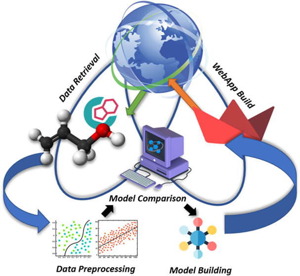
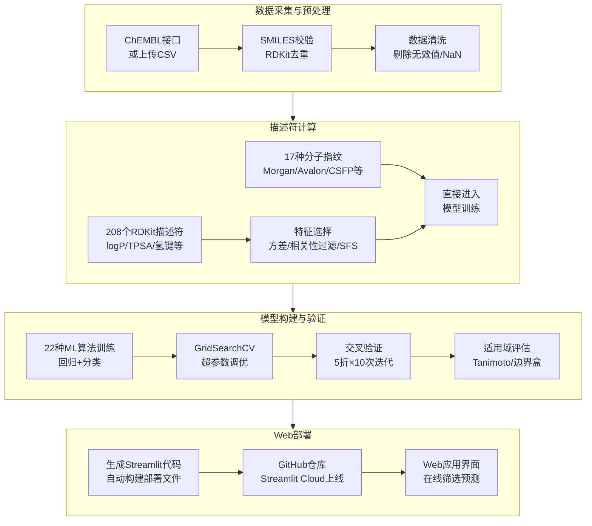
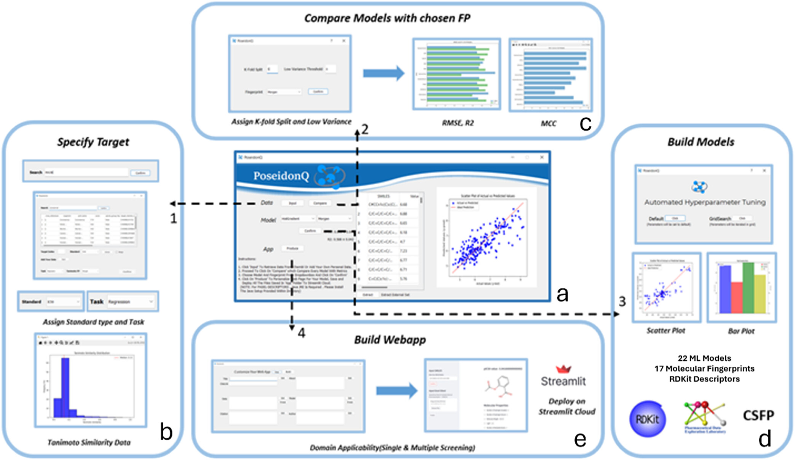
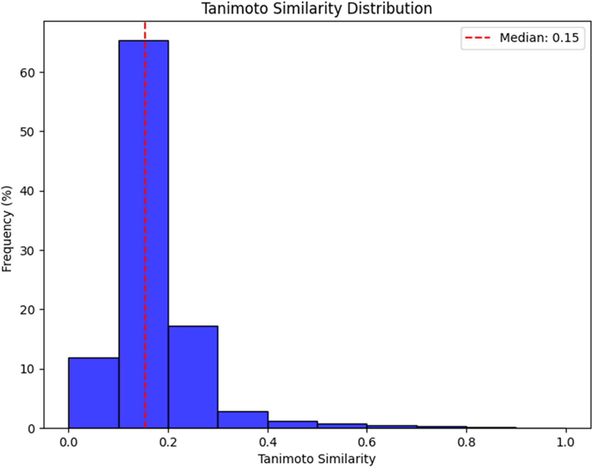
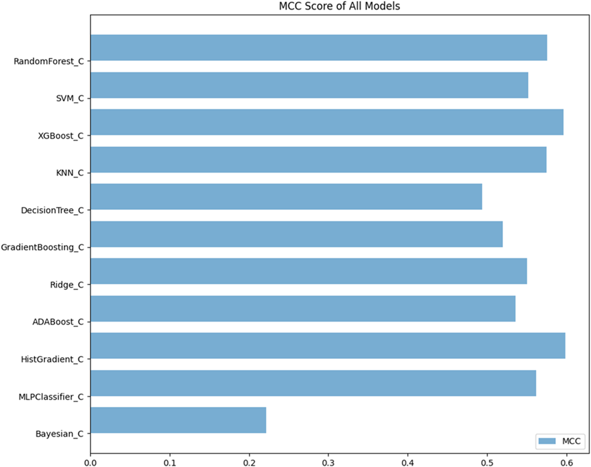
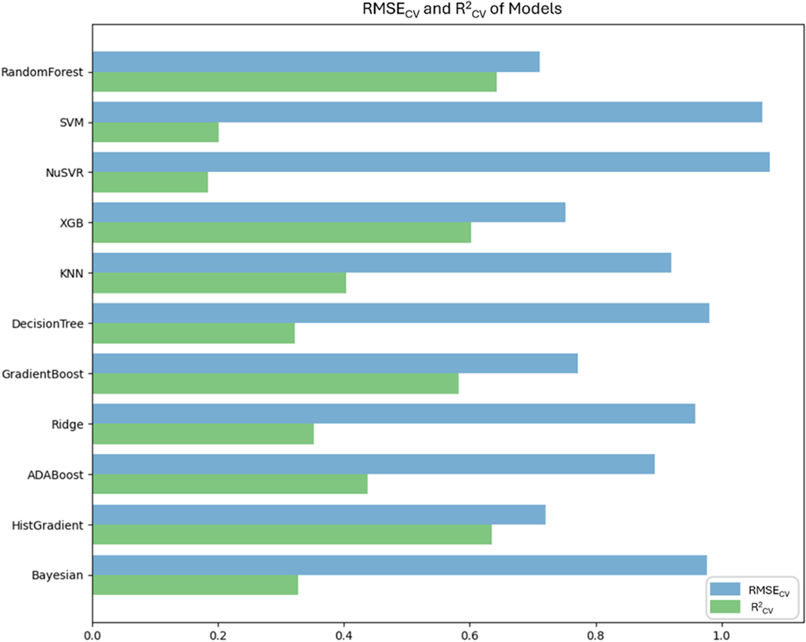
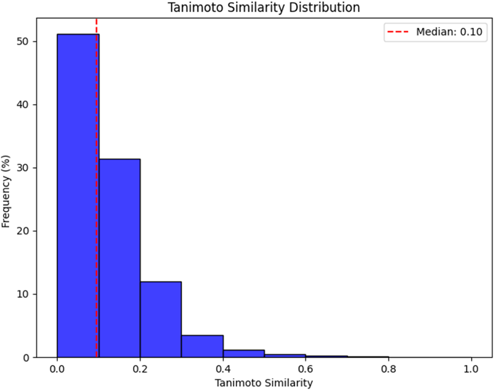
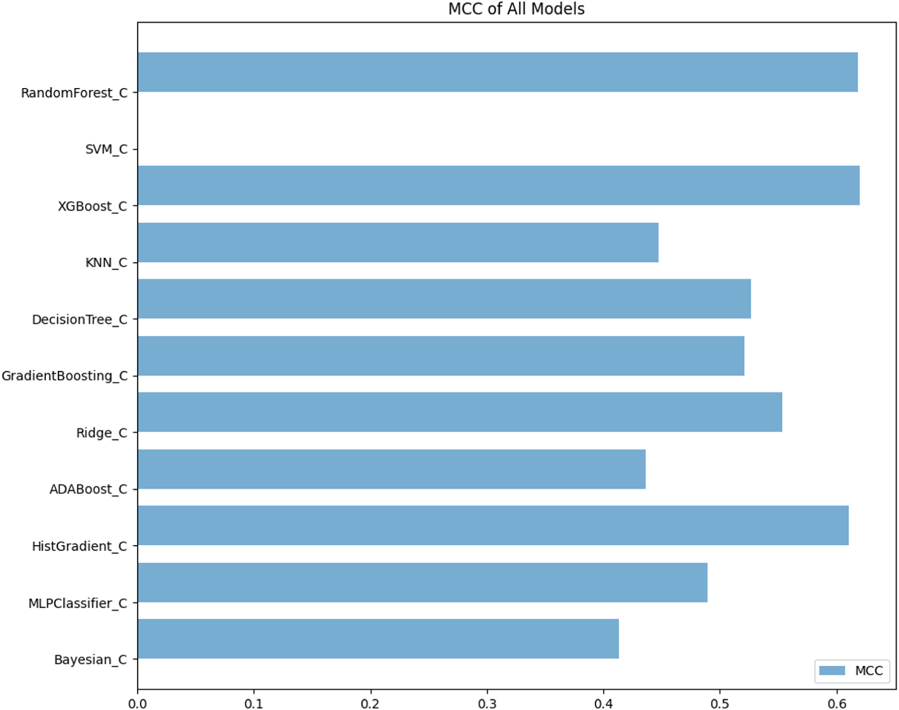

# PoseidonQ——集成22种算法的免费QSAR建模平台

## 本文信息

- **标题**：PoseidonQ：一个用于开发、分析和验证高效便携QSAR模型的免费机器学习平台
- **作者**：Muzammil Kabier, Nicola Gambacorta, Fulvio Ciriaco, Fabrizio Mastrolorito, Sunil Kumar, Bijo Mathew, Orazio Nicolotti
- **发表期刊**：Journal of Chemical Information and Modeling
- **发表时间**：2025年4月9日
- **DOI**：https://doi.org/10.1021/acs.jcim.4c02372
- **单位**：Amrita Vishwa Vidyapeetham（印度）、Università degli Studi di Bari（意大利）
- **引用格式**：Kabier, M.; Gambacorta, N.; Ciriaco, F.; Mastrolorito, F.; Kumar, S.; Mathew, B.; Nicolotti, O. PoseidonQ: A Free Machine Learning Platform for the Development, Analysis, and Validation of Efficient and Portable QSAR Models for Drug Discovery. *J. Chem. Inf. Model.* **2025**, 65, 3944-3954. https://doi.org/10.1021/acs.jcim.4c02372
- **代码与数据**：GitHub：https://github.com/Muzatheking12/PoseidonQ

## 摘要

> 强大的机器学习算法的涌现以及大量药理数据的可获取性为QSAR注入了新的动力，为推导高精度预测模型开辟了前所未有的选项，可辅助新型生物活性化合物的理性设计、大规模分子库的筛选与排序，以及药物的重新定位。在此，我们提出PoseidonQ（Personal Optimization Software for Efficient Implementation and Derivation of Online QSAR），一个用户友好的软件解决方案，旨在**简化QSAR模型的推导**。PoseidonQ集成了22种机器学习算法、17种分子指纹和208个RDKit分子描述符，支持快速推导回归和分类模型，并提供**自动计算的、易于解释的适用域（AD）**。平台自动连接最新版ChEMBL数据库，为大量经过整理的生物活性数据提供无缝访问。此外，用户可根据自定义过滤设置收集高质量实验数据。值得注意的是，PoseidonQ通过Streamlit Cloud和GitHub的无缝集成，**将训练好的QSAR模型部署为web应用**，使用户能够轻松共享、优化和整合模型。QSAR模型转化为web应用后，变得**免费可访问、可移植**，且能无限制地筛选大量新数据。通过统一数据准备、模型生成和部署为一条直观的workflow，PoseidonQ**将高级QSAR建模扩展到广泛的研究者群体**，无论其技能水平如何。PoseidonQ架起了复杂机器学习技术与药物发现实际应用之间的桥梁，提升了QSAR方法在现代药物发现项目中的效率、协作性和采纳率。PoseidonQ支持Windows和Linux操作系统，可免费下载。

---

## 背景

药物理性发现离不开计算工具的支撑，其中**定量构效关系（QSAR）**因其在预测生物活性和药代动力学性质方面的能力，在药物化学中占据核心地位。QSAR能够让研究人员通过大规模数据筛选和候选药物优先级排序，**大幅减少昂贵且耗时的实验流程**，加速药物发现进程。

构建可靠的QSAR模型涉及多个关键环节：准确的实验数据采集与整理、分子描述符的仔细选择、合适的建模算法，以及严格的验证和适用域评估。其中**最基础也是最容易被忽视的问题**是高质量实验数据的获取——从同行评议文献中手动收集数据往往需要大量人工核对才能保证质量，而数据完整性直接决定模型的可靠性。此外，虽然QSAR在监管领域同样重要，但**其应用仍远未普及**，基本局限于计算化学或数据科学领域的专家。

近年来机器学习在药物发现中的应用不断扩展，多个平台应运而生。OCHEM提供协作式建模环境，注重数据共享和研究可重复性；QSARINS支持严谨的化学计量学验证，在多变量分析方面遵循最高标准；ROBERT则实现了从SMILES到机器学习模型的自动化流程，输出为csv格式。这些平台在模型验证和监管应用方面发挥了重要作用，但**没有一个免费平台能将数据采集整理、描述符计算和机器学习建模整合为一条易用的workflow**。PoseidonQ正是为了填补这一知识空白而设计，旨在让不同技能水平的研究者都能完成预测研究，推动QSAR在现代药物发现项目中的广泛应用。

### 核心结论

- **从SMILES到web应用的全流程无需编写代码**：覆盖22种算法×17种指纹×208个RDKit描述符的组合空间，从数据上传到模型部署一站式完成
- **内置完整的自动化QA/QC步骤**：交叉验证、外部测试集评估、适用域（AD）分析等验证流程自动执行，确保模型科学严谨性
- **模型可一键部署为免费web应用**：通过Streamlit Cloud和GitHub仓库部署，无需商业许可
- **与成熟平台性能相当，外部泛化能力更强**：在PPARγ回归任务中外部$R^2$达0.60，显著优于ROBERT（0.15）、OCHEM（最高0.28）、QSARINS（0.33）
- **完全免费开源**：代码透明可定制，适合学术研究和教学

## 研究内容

### 平台架构与功能模块

PoseidonQ是一个**桌面软件**（支持Windows和Linux），整合了Python科学计算栈（RDKit、scikit-learn等），自动连接ChEMBL数据库获取活性数据。整体工作流如下：

**数据清洗模块**处理常见数据质量问题：通过RDKit校验SMILES的合法性并去除无效SMILES，对同一化合物的多条生物活性数据（如IC50、EC50、Ki）计算平均值以减少异常值影响，同时剔除NaN或Inf等无法定义的活性值，确保数据集的完整性。

**描述符计算模块**提供三个层级：
- **一维描述符**：分子量、logP、TPSA、氢键数、可旋转键数等208个RDKit描述符
- **二维指纹**：来自三个化学信息学库的17种分子指纹
  - RDKit库（Morgan FP、Avalon FP、Topological Torsion、Pattern FP）
  - PadelPy库（Substructure、SubstructureCount、AtomPairs2DCount、AtomPairs2D、Estate）
  - Compchemkit库（CDKExtended、CDK、CDKgraphonly、KlekotaRoth、KlekotaRothCount、MACCS、PubChem、CSFP）
- **三维描述符**（可选）：基于Corina的3D描述符（需额外配置）

**机器学习引擎**整合22种算法（回归11种+分类11种），具体包括：
- **树集成方法**：Random Forest、DecisionTree、GradientBoosting、HistGradientBoosting、ADABoost、XGBoost
- **支持向量机**：SVR/NuSVR（回归）、SVM（分类）
- **线性方法**：Ridge
- **近邻方法**：KNN
- **贝叶斯方法**：Bayesian
- **神经网络**：MLPClassifier（仅分类）

在三个案例研究中表现最优的算法分别是**HistGradientBoosting**（CB1R）、**Random Forest**（PPARγ）和**XGBoost**（MAO-B）。

### 建模workflow与用户界面

#### 步骤1：数据上传

用户输入靶点名称或ChEMBL ID后，平台自动从ChEMBL数据库提取对应的SMILES和生物活性数据，生成"input.xlsx"文件。用户也可手动上传内部数据集。

**图1：PoseidonQ整体工作流程**
- 面板（a）：软件首页
- 面板（b）：通过“input”按钮访问，用户可选择靶点并计算适用域
- 面板（c）：基于指定数据集的“compare”分析结果
- 面板（d）：最终模型及自动超参数调优选项
- 面板（e）：处理外部数据集的web应用界面

#### 步骤2：数据预处理

用户可设置低方差阈值剔除无效特征，并从初始数据集中随机或手动抽取20%作为外部验证集。对于同一化合物的多条活性数据，平台自动计算平均值（剔除头部和尾部百分位数以减少异常值影响）。

#### 步骤3：模型训练

用户选择一个分子指纹或描述符后，平台提供两种训练方式：**默认参数模式**适合快速探索，**优化模式**通过GridSearchCV网格搜索进行超参数调优。用户也可通过"compare"按钮一键比较所有22种算法在同一指纹上的表现。

#### 验证与可解释性功能

- 交叉验证与外部测试集：平台**默认采用5折交叉验证并重复10次迭代**以降低随机性影响，同时支持随机抽取20%数据作为外部验证集，全面评估模型泛化能力。**模型选择基于交叉验证表现最优的算法**，再在独立的外部验证集上评估泛化能力。
- 适用域分析：基于Tanimoto成对相似性（分子指纹）或边界盒分析（分子描述符），**自动评估查询化合物是否落在训练集化学空间内**。域外化合物预测标注为高风险。
- 特征重要性分析：平台提供**特征重要性排序**，帮助用户理解哪些分子描述符对预测贡献最大。

#### 步骤4：模型分析与导出

训练完成后平台提供完整的性能评估面板，包括$R^2$、RMSE、MCC等指标，以及5折交叉验证（默认可设为k-fold）和10次重复迭代的结果统计。用户可以查看特征重要性排序，一键生成Web应用部署文件和在线预测接口。

> PoseidonQ支持将训练好的QSAR模型转换为web应用，通过Streamlit Cloud和GitHub仓库直接部署。这使得**模型可以免费访问、便于移植**，并能够无限制地筛选大量新数据。

**部署流程**：训练完成后模型可一键转换为定制化的web应用，所有必要的部署文件自动生成，用户通过GitHub仓库直接部署到Streamlit Cloud即可，无需专业软件或编程技能即可交互和使用复杂模型。

web应用的输出信息包括**分类指标MCC**（马修斯相关系数）、**回归指标**$R^2$和RMSE，以及**适用域信息**——标注每个预测是否落在模型空间内。

### 案例研究：三个实际应用验证

研究通过**三个不同类型的案例**来验证PoseidonQ的实际性能：CB1R分类、PPARγ回归、MAO-B外部验证。

#### 案例一：CB1R分类模型

- **数据来源**：从ChEMBL24获取1811条人源CB1R（大麻素受体1型）的IC50数据，去重后保留1409个化合物。以IC50 < 1 μM定义为活性。
- **建模流程**：CB1R案例使用Morgan指纹计算适用域（中位数作为阈值），通过10×10交叉验证评估模型稳定性，并与ROBERT、OCHEM、QSARINS平台对比。

**图2：CB1R数据集的Tanimoto相似性分布**。蓝色柱代表整个CB1R数据集的Tanimoto相似性值分布，红色虚线标记中位数（第50百分位），该值被取作适用域定义的阈值。

**图3：CB1R案例研究中各分类算法的交叉验证MCC评分**。HistGradientBoosting（红色）在交叉验证中表现最优，平均MCC达0.64。误差棒表示10×10交叉验证的标准差。外部验证结果见表3。

#### 案例二：PPARγ回归模型

- **数据来源**：从ChEMBL获取1808条PPARγ（过氧化物酶体增殖物激活受体γ）亲和力数据，去重后1530条。
- **建模流程**：PPARγ案例从208个RDKit描述符出发，经方差过滤和相关性过滤降至125个，再通过顺序特征选择最多保留20个特征，最后进行10×10交叉验证。

**图4：PPARγ案例研究中各回归算法的性能对比**。蓝色柱为RMSECV（交叉验证均方根误差），绿色柱为$R^2_{CV}$。Random Forest在RMSE最低且$R^2$最高的区域表现最优。

#### 案例三：MAO-B外部验证

- **数据来源**：3915个MAO-B（单胺氧化酶B）化合物（1754个活性，2161个非活性），外加28个内部合成的化合物作为外部验证集。
- **建模流程**：MAO-B案例使用CSFP（Core-Substituent Fingerprint）计算Tanimoto相似性，以默认cutoff = 0.10定义适用域，采用5折交叉验证（低方差阈值设为0）。

**图5：MAO-B数据集的Tanimoto相似性分布**。蓝色柱代表整个MAO-B数据集的Tanimoto相似性值分布，红色虚线标记中位数（第50百分位），该值被取作适用域定义的阈值。

**图6：MAO-B案例研究中各分类算法的交叉验证MCC评分**。XGBoost（红色）在交叉验证中表现最优，MCC达0.61以上。外部验证结果见表3。

**表1：三个案例研究的性能对比**

| 案例 | 最优算法 | CV准确率/$R^2$ | CV MCC/RMSE | 外部准确率/$R^2$ | 外部MCC/RMSE |
| --- | --- | --- | --- | --- | --- |
| **CB1R分类** | HistGradientBoosting | 0.86 ± 0.02 | 0.61 ± 0.06 | 0.84 | 0.58 |
| **PPARγ回归** | Random Forest | 0.63 ± 0.04 | 0.72 ± 0.04 | 0.60 | 0.76 |
| **MAO-B分类** | XGBoost | 0.81 ± 0.01 | 0.61 ± 0.02 | 0.78 | 0.47 |

三个案例中PoseidonQ均表现出**与成熟平台相当的预测能力**，且工作流集成度更高——用户无需切换多个工具即可完成从数据到部署的全流程。

### 与其他平台对比

为验证PoseidonQ的竞争力，研究使用ROBERT、OCHEM、QSARINS三个平台，在**相同数据集和相同描述符条件下**构建模型进行对比（OCHEM因技术限制使用PADEL2D描述符）。

#### CB1R与MAO-B分类任务对比

| 平台 | CB1R内部准确率 | CB1R内部MCC | CB1R外部准确率 | CB1R外部MCC |
| --- | --- | --- | --- | --- |
| **ROBERT** | 0.89 | 0.69 | 0.74 | 0.30 |
| **PoseidonQ** | 0.86 | 0.61 | 0.84 | 0.58 |

| 平台 | MAO-B内部准确率 | MAO-B内部MCC | MAO-B外部准确率 | MAO-B外部MCC |
| --- | --- | --- | --- | --- |
| **ROBERT** | 0.72 | 0.43 | 0.68 | 0.36 |
| **PoseidonQ** | 0.81 | 0.61 | 0.78 | 0.47 |

**关键发现**：ROBERT在CB1R内部验证上略优（准确率0.89 vs 0.86），但PoseidonQ在**外部测试集上反超**（准确率0.84 vs 0.74，MCC 0.58 vs 0.30），说明PoseidonQ的模型泛化能力更强。MAO-B任务中PoseidonQ在内外验证上均优于ROBERT。

#### PPARγ回归任务对比

| 平台 | 内部$R^2$ | 内部RMSE | 外部$R^2$ | 外部RMSE |
| --- | --- | --- | --- | --- |
| **ROBERT** | 0.65 | 0.69 | 0.15 | 1.00 |
| **OCHEM（Transformer-CNN）** | 0.61 | 0.77 | 0.24 | 0.89 |
| **OCHEM（Random Forest）** | 0.66 | 0.72 | 0.28 | 0.86 |
| **QSARINS** | 0.34 | 0.97 | 0.33 | 0.97 |
| **PoseidonQ** | 0.63 | 0.72 | 0.60 | 0.76 |

**关键发现**：PPARγ回归任务的对比最为戏剧性。虽然各平台内部验证$R^2$相差不大（0.34–0.66），但**外部验证$R^2$差异巨大**——PoseidonQ达到0.60，而其他工具可能过拟合，除了QSARINS。这意味着PoseidonQ构建的模型在面对全新化合物时，**预测能力显著优于其他三个平台**。PoseidonQ的优势可能来自其特征选择流程（方差过滤→相关性过滤→顺序特征选择），有效降低了过拟合风险。

---

## 关键结论与批判性总结

### 潜在影响
- **降低QSAR建模门槛**：使实验药物化学家无需编程即可完成专业级建模，从数据上传到模型部署的全流程在单一平台内完成
- **促进模型共享与复用**：模型可一键转换为web应用并通过Streamlit Cloud部署，便于在不同系统和实验室间传递，也支持对外部分子库的大规模筛选
- **推动开源工具生态**：代码开源透明，学术界可自由扩展算法和描述符，为QSAR建模提供可定制的参考框架

### 主要贡献
- **填补免费工具空白**：功能完整性媲美商业软件（22种算法×17种指纹×208个描述符），完全免费开源
- **集成验证最佳实践**：将交叉验证、外部测试集评估、适用域分析、特征重要性分析等QA/QC步骤自动化并内置，确保模型科学严谨性
- **经受跨平台验证**：在三个实际案例中与ROBERT、OCHEM、QSARINS对比，PPARγ回归任务外部$R^2$显著优于其他平台

### 局限性
- **3D描述符需额外配置**：基于Corina的3D描述符无法像1D/2D描述符那样自动计算，限制了对立体化学敏感靶点的建模能力
- **数据来源限于ChEMBL**：自动数据获取仅限于ChEMBL数据库，对于未收录的靶点或非标准活性数据，用户需手动上传
- **web部署依赖外部平台**：模型部署为web应用需要Streamlit Cloud和GitHub账号，对网络环境有一定要求

