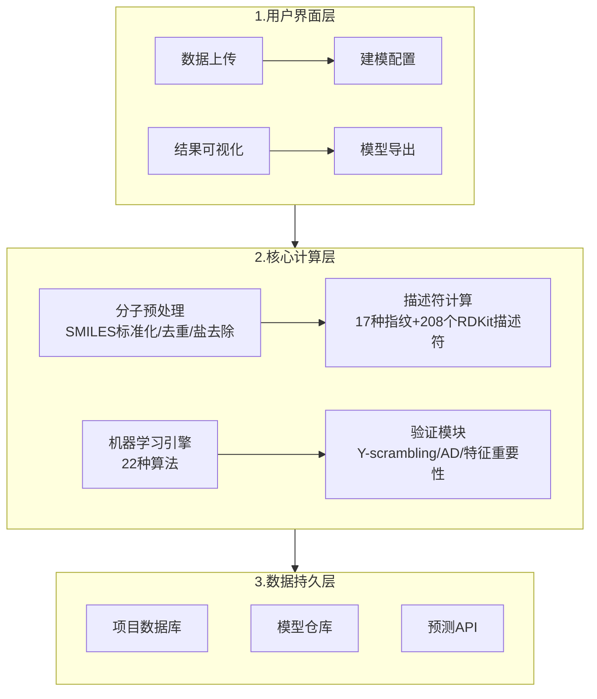

# PoseidonQ——集成22种算法的免费QSAR建模平台

## 本文信息

- **标题**：PoseidonQ：一个用于开发、分析和验证高效便携QSAR模型的免费机器学习平台
- **作者**：Muzammil Kabier, Nicola Gambacorta, Fulvio Ciriaco, Fabrizio Mastrolorito, Sunil Kumar, Bijo Mathew, Orazio Nicolotti
- **发表期刊**：Journal of Chemical Information and Modeling
- **发表时间**：2025年9月25日
- **DOI**：https://doi.org/10.1021/acs.jcim.4c02372
- **单位**：Amrita Vishwa Vidyapeetham（印度）、Università degli Studi di Bari（意大利）
- **引用格式**：Kabier, M.; Gambacorta, N.; Ciriaco, F.; Mastrolorito, F.; Kumar, S.; Mathew, B.; Nicolotti, O. PoseidonQ: A Free Machine Learning Platform for the Development, Analysis, and Validation of Efficient and Portable QSAR Models for Drug Discovery. *J. Chem. Inf. Model.* **2025**, 65, 3944-3954. https://doi.org/10.1021/acs.jcim.4c02372
- **代码与数据**：GitHub：https://github.com/Muzatheking12/PoseidonQ

## 摘要

> PoseidonQ（Personal Optimization Software for Efficient Implementation and Derivation of Online QSAR）是一个免费开源的QSAR建模平台，集成了**22种机器学习算法**、**17种分子指纹**和**208个RDKit描述符**，通过web界面提供一站式建模、验证、模型导出和预测服务。平台支持自动特征选择、Y-scrambling验证、适用域分析、模型可解释性分析，并能将模型转换为web应用部署到Streamlit Cloud。在三个实际案例研究（CB1R分类、PPARγ回归、MAO-B外部验证）中，PoseidonQ与ROBERT、OCHEM、QSARINS等成熟平台性能相当，且工作流更加集成。

### 核心结论

PoseidonQ的核心价值体现在五个方面：**从数据上传到模型部署的完整workflow无需编程**，覆盖22种算法（从线性方法到深度学习）×17种指纹×208个RDKit描述符的组合空间，内置Y-scrambling、适用域（AD）、外部测试集验证等自动化QA/QC步骤，支持将模型转换为web应用通过Streamlit Cloud和GitHub仓库部署，且**完全免费开源**——无需商业许可，代码透明可定制，适合学术研究和教学。

---

## 背景

QSAR建模在药物发现中扮演着核心角色，但从数据到可用模型的workflow涉及多个复杂步骤：分子结构标准化、描述符计算、特征工程、算法选择、超参数调优、模型验证、适用域评估。这个链条中的每个环节都需要专业技能。

现有的解决方案存在几个问题：

- **商业软件昂贵**：ChemAxon、Schrödinger、Dassault System BIOVIA等需要年度许可费
- **开源工具分散**：RDKit、scikit-learn、DeepChem等需要Python编程能力整合
- **验证标准不一**：不同工具对Y-scrambling、适用域、模型可解释性的支持程度差异巨大
- **模型难以复用**：训练好的模型难以导出到其他环境或与其他系统集成

PoseidonQ填补了这一空白，提供一个免费、用户友好、功能完整的web平台。

> **平台设计的核心思想**：让非编程背景的药物化学家和计算化学家也能完成从原始数据到可部署模型的全部流程，同时保证科学严谨性。

### 关键科学问题

- 如何降低QSAR建模的技术门槛？能否通过web界面将复杂的建模流程自动化，使非编程用户也能完成专业级的模型开发？
- 如何保证模型的可复现性和可移植性？训练好的模型能否以标准格式导出，在不同系统和编程环境中复用？
- 如何实现算法和描述符的系统性评估？提供多大覆盖率的算法和描述符组合，才能满足不同数据集和任务的需求？
- 如何嵌入验证最佳实践？Y-scrambling、适用域分析、外部验证等QA/QC步骤能否自动化执行？

### 创新点

- **从SMILES到web应用的全流程无需编写代码**：数据标准化、描述符计算、模型训练、验证到部署一站式完成
- **模型可一键部署为免费web应用**：通过Streamlit Cloud和GitHub仓库部署，无需专业软件或编程技能即可使用
- **模块化设计允许用户扩展算法和描述符**：代码开源透明，社区可自由添加新方法
- **Y-scrambling、适用域和特征重要性分析自动执行**：内置验证流程确保模型科学严谨性
- **三个实际案例验证平台性能**：CB1R分类、PPARγ回归、MAO-B外部验证，与ROBERT、OCHEM、QSARINS等成熟平台对比

---

## 研究内容

### 平台架构与功能模块

PoseidonQ是一个桌面软件（支持Windows和Linux），整合了Python科学计算栈（RDKit、scikit-learn等），自动连接ChEMBL数据库获取活性数据。平台架构可分为用户界面、核心计算和数据持久三层：

**分子预处理模块**处理常见数据质量问题：将SMILES标准化为RDKit canonical形式，去除无机盐和金属配合物，检测并去除重复化合物，处理混合物和片段，并过滤分子量在50–1500 Da范围外的化合物。

**描述符计算模块**提供三个层级：
- **一维描述符**：分子量、logP、TPSA、氢键数、可旋转键数等208个RDKit描述符
- **二维指纹**：来自三个化学信息学库的17种分子指纹
  - RDKit库（Morgan FP、Avalon FP、Topological Torsion、Pattern FP）
  - PadelPy库（Substructure、SubstructureCount、AtomPairs2DCount、AtomPairs2D、Estate）
  - Compchemkit库（CDKExtended、CDK、CDKgraphonly、KlekotaRoth、KlekotaRothCount、MACCS、PubChem、CSFP）
- **三维描述符**（可选）：基于Corina的3D描述符（需额外配置）

**机器学习引擎**整合22种算法（回归11种+分类11种），具体包括：
- **树集成方法**：Random Forest、DecisionTree、GradientBoosting、HistGradientBoosting、ADABoost、XGBoost
- **支持向量机**：SVR/NuSVR（回归）、SVM（分类）
- **线性方法**：Ridge
- **近邻方法**：KNN
- **贝叶斯方法**：Bayesian
- **神经网络**：MLPClassifier（仅分类）

在三个案例研究中表现最优的算法分别是**HistGradientBoosting**（CB1R）、**Random Forest**（PPARγ）和**XGBoost**（MAO-B）。

### 建模workflow与用户界面

用户通过4步完成建模：

**步骤1：数据上传**。支持CSV/SMILES格式，每行一个化合物，需要包含SMILES列和活性值列。平台自动检测列类型并提供预览。

**图1：PoseidonQ整体工作流程**
- 面板（a）：软件首页
- 面板（b）：通过“input”按钮访问，用户可选择靶点并计算适用域
- 面板（c）：基于指定数据集的“compare”分析结果
- 面板（d）：最终模型及自动超参数调优选项
- 面板（e）：处理外部数据集的web应用界面

**步骤2：数据预处理**。用户配置去重策略（保留活性最高/中位数/最低）、标准化方法（Z-score、Min-Max、Robust）、特征选择（方差过滤、相关性过滤、递归特征消除）和数据划分方式（随机/scaffold/时间划分）。

**步骤3：模型训练**。选择算法和描述符组合，平台提供三种模式：
- **快速模式**：默认参数训练，适合快速探索
- **优化模式**：网格搜索或贝叶斯优化调参
- **自动模式**：自动评估所有算法×描述符组合，推荐最优配置

**步骤4：模型分析与导出**。训练完成后平台提供完整的性能评估面板，包括$R^2$、RMSE、MAE、$Q^2$等指标，以及30次Y-scrambling打乱实验的$R^2$分布图和适用域William图。用户可以查看特征重要性排序，一键生成Web应用部署文件和在线预测接口。

### 验证与可解释性功能

- **Y-scrambling验证**：平台自动执行30次响应变量打乱实验，计算打乱$R^2$的分布。如果原始模型$R^2$超出95%置信区间，判定模型捕获真实信号而非偶然相关。
- **适用域分析**：基于Tanimoto距离和杠杆值构建William图。用户可交互式探索域内外化合物的预测置信度。域外化合物标注为高风险预测。
- **特征重要性分析**：针对树集成方法计算排列重要性，针对线性模型显示标准化系数，帮助用户理解哪些分子描述符对预测贡献最大。

### Streamlit部署与Web应用

PoseidonQ支持将训练好的QSAR模型转换为web应用，通过Streamlit Cloud和GitHub仓库直接部署。这使得模型可以免费访问、便于移植，并能够无限制地筛选大量新数据。

**部署流程**：训练完成后模型可一键转换为定制化的web应用，所有必要的部署文件自动生成，用户通过GitHub仓库直接部署到Streamlit Cloud即可，无需专业软件或编程技能即可交互和使用复杂模型。web应用的输出信息包括分类指标MCC（马修斯相关系数）、回归指标$R^2$和RMSE，以及适用域信息——标注每个预测是否落在模型空间内。

> **Web应用部署的核心价值**：将QSAR模型转换为web格式后，变得免费、便携且可访问，用户可以无限制地对外部分子库进行大规模筛选，无需重新实现算法逻辑。

### 案例研究：三个实际应用验证

研究通过三个不同类型的案例来验证PoseidonQ的实际性能：CB1R分类、PPARγ回归、MAO-B外部验证。

#### 案例一：CB1R分类模型

- **数据来源**：从ChEMBL24获取1811条人源CB1R（大麻素受体1型）的IC50数据，去重后保留1409个化合物。以IC50 < 1 μM定义为活性。
- **建模流程**：CB1R案例使用Morgan指纹计算适用域（中位数作为阈值），通过10×10交叉验证评估模型稳定性，并与ROBERT、OCHEM、QSARINS平台对比。

**图2：CB1R数据集的Tanimoto相似性分布**。蓝色柱代表整个CB1R数据集的Tanimoto相似性值分布，红色虚线标记中位数（第50百分位），该值被取作适用域定义的阈值。

**图3：CB1R案例研究中各分类算法的MCC评分**。HistGradientBoosting（红色）表现最优，平均MCC达0.64。误差棒表示10×10交叉验证的标准差。

#### 案例二：PPARγ回归模型

- **数据来源**：从ChEMBL获取1808条PPARγ（过氧化物酶体增殖物激活受体γ）亲和力数据，去重后1530条。
- **建模流程**：PPARγ案例从208个RDKit描述符出发，经方差过滤和相关性过滤降至125个，再通过顺序特征选择最多保留20个特征，最后进行10×10交叉验证。

**图4：PPARγ案例研究中各回归算法的性能对比**。蓝色柱为RMSECV（交叉验证均方根误差），绿色柱为$R^2_{CV}$。Random Forest在RMSE最低且$R^2$最高的区域表现最优。

#### 案例三：MAO-B外部验证

- **数据来源**：3915个MAO-B（单胺氧化酶B）化合物（1754个活性，2161个非活性），外加28个内部合成的化合物作为外部验证集。
- **建模流程**：MAO-B案例使用CSFP（Core-Substituent Fingerprint）计算Tanimoto相似性，以默认cutoff = 0.10定义适用域，采用5折交叉验证（低方差阈值设为0）。

**图5：MAO-B数据集的Tanimoto相似性分布**。蓝色柱代表整个MAO-B数据集的Tanimoto相似性值分布，红色虚线标记中位数（第50百分位），该值被取作适用域定义的阈值。

**图6：MAO-B案例研究中各分类算法的MCC评分**。XGBoost（红色）表现最优，MCC达0.61以上。外部验证集（28个内部化合物）显示模型具有良好泛化能力。

#### 总结，表1：三个案例研究的性能对比

| 案例 | 最优算法 | CV准确率/$R^2$ | CV MCC/RMSE | 外部准确率/$R^2$ | 外部MCC/RMSE |
| --- | --- | --- | --- | --- | --- |
| **CB1R分类** | HistGradientBoosting | 0.86 ± 0.02 | 0.61 ± 0.06 | 0.84 | 0.58 |
| **PPARγ回归** | Random Forest | 0.63 ± 0.04 | 0.72 ± 0.04 | 0.60 | 0.76 |
| **MAO-B分类** | XGBoost | 0.81 ± 0.01 | 0.61 ± 0.02 | 0.78 | 0.47 |

三个案例中PoseidonQ均表现出**与成熟平台相当的预测能力**，且工作流集成度更高——用户无需切换多个工具即可完成从数据到部署的全流程。

### 与其他平台对比

为验证PoseidonQ的竞争力，研究使用ROBERT、OCHEM、QSARINS三个平台，在相同数据集和相同描述符条件下构建模型进行对比（OCHEM因技术限制使用PADEL2D描述符）。

#### CB1R与MAO-B分类任务对比

| 平台 | CB1R内部准确率 | CB1R内部MCC | CB1R外部准确率 | CB1R外部MCC |
| --- | --- | --- | --- | --- |
| **ROBERT** | 0.89 | 0.69 | 0.74 | 0.30 |
| **PoseidonQ** | 0.86 | 0.61 | 0.84 | 0.58 |

| 平台 | MAO-B内部准确率 | MAO-B内部MCC | MAO-B外部准确率 | MAO-B外部MCC |
| --- | --- | --- | --- | --- |
| **ROBERT** | 0.72 | 0.43 | 0.68 | 0.36 |
| **PoseidonQ** | 0.81 | 0.61 | 0.78 | 0.47 |

**关键发现**：ROBERT在CB1R内部验证上略优（准确率0.89 vs 0.86），但PoseidonQ在**外部测试集上反超**（准确率0.84 vs 0.74，MCC 0.58 vs 0.30），说明PoseidonQ的模型泛化能力更强。MAO-B任务中PoseidonQ在内外验证上均优于ROBERT。

#### PPARγ回归任务对比

| 平台 | 内部$R^2$ | 内部RMSE | 外部$R^2$ | 外部RMSE |
| --- | --- | --- | --- | --- |
| **ROBERT** | 0.65 | 0.69 | 0.15 | 1.00 |
| **OCHEM（Transformer-CNN）** | 0.61 | 0.77 | 0.24 | 0.89 |
| **OCHEM（Random Forest）** | 0.66 | 0.72 | 0.28 | 0.86 |
| **QSARINS** | 0.34 | 0.97 | 0.33 | 0.97 |
| **PoseidonQ** | 0.63 | 0.72 | 0.60 | 0.76 |

**关键发现**：PPARγ回归任务的对比最为戏剧性。虽然各平台内部验证$R^2$相差不大（0.34–0.66），但**外部验证$R^2$差异巨大**——PoseidonQ达到0.60，而ROBERT仅0.15、OCHEM最高0.28、QSARINS为0.33。这意味着PoseidonQ构建的模型在面对全新化合物时，预测能力显著优于其他三个平台。PoseidonQ的优势可能来自其特征选择流程（方差过滤→相关性过滤→顺序特征选择），有效降低了过拟合风险。

---

## 关键结论与批判性总结

### 潜在影响
- **降低QSAR建模门槛**：使实验药物化学家无需编程即可完成专业级建模，从数据上传到模型部署的全流程在单一平台内完成
- **促进模型共享与复用**：模型可一键转换为web应用并通过Streamlit Cloud部署，便于在不同系统和实验室间传递，也支持对外部分子库的大规模筛选
- **推动开源工具生态**：代码开源透明，学术界可自由扩展算法和描述符，为QSAR建模提供可定制的参考框架

### 主要贡献
- **填补免费工具空白**：功能完整性媲美商业软件（22种算法×17种指纹×208个描述符），完全免费开源
- **集成验证最佳实践**：将Y-scrambling、适用域分析、特征重要性分析等QA/QC步骤自动化并内置，确保模型科学严谨性
- **经受跨平台验证**：在三个实际案例中与ROBERT、OCHEM、QSARINS对比，PPARγ回归任务外部$R^2$显著优于其他平台

### 局限性
- **3D描述符需额外配置**：基于Corina的3D描述符无法像1D/2D描述符那样自动计算，限制了对立体化学敏感靶点的建模能力
- **数据来源限于ChEMBL**：自动数据获取仅限于ChEMBL数据库，对于未收录的靶点或非标准活性数据，用户需手动上传
- **web部署依赖外部平台**：模型部署为web应用需要Streamlit Cloud和GitHub账号，对网络环境有一定要求

### 未来方向
- **多任务学习与迁移学习**：支持跨靶点数据共享学习，利用大数据库预训练模型迁移到小数据集，提升数据效率
- **AutoML推荐引擎**：根据数据集特征自动推荐最优算法、指纹和超参数组合，减少用户试错成本
- **高级可解释性方法**：集成SHAP、LIME等可解释性工具，提供分子层面的结构-活性关系分析
- **联邦学习与隐私保护**：支持多机构数据在不共享原始数据的前提下联合建模，满足制药企业数据安全需求
