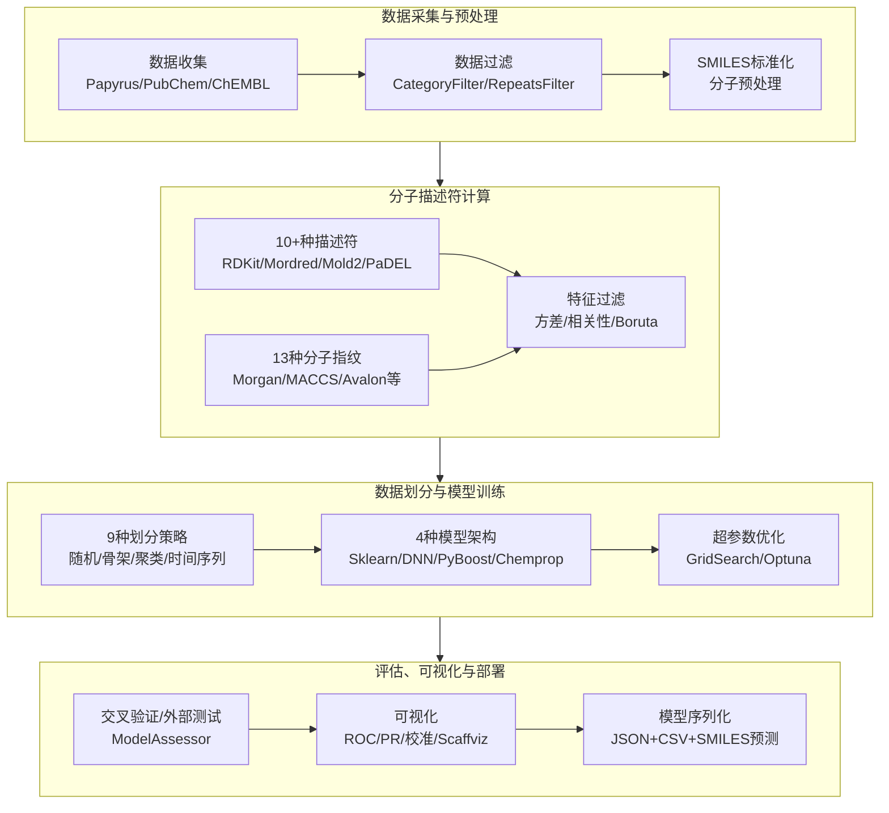

# QSPRpred——开源QSPR建模全流程工具包

## 本文信息

- **标题**：QSPRpred: a Flexible Open-Source Quantitative Structure-Property Relationship Modelling Tool
- **作者**：Helle W. van den Maagdenberg, Martin Šicho, David Alencar Arapipe,..., J. G. Coen van Hasselt, Piet. H. van der Graaf, Gerard J. P. van Westen
- **发表期刊**：Journal of Cheminformatics
- **发表时间**：2024年9月24日
- **DOI**：https://doi.org/10.1186/s13321-024-00908-y
- **单位**：莱顿大学（荷兰）、列日大学（比利时）、阿姆斯特丹大学医学中心（荷兰）、维也纳大学（奥地利）等
- **引用格式**：van den Maagdenberg, H. W., Šicho, M., Arapipe, D. A. et al. QSPRpred: a Flexible Open-Source Quantitative Structure-Property Relationship Modelling Tool. *J Cheminform* **16**, 128 (2024). https://doi.org/10.1186/s13321-024-00908-y
- **代码与数据**：GitHub：https://github.com/CDDLeiden/QSPRpred；基准测试代码：https://github.com/CDDLeiden/qsp-bench

## 摘要

> 构建可靠且稳健的定量结构-性质关系（QSPR）模型是一项极具挑战性的任务。首先，实验数据需要被获取、分析和整理。其次，可用的方法数量持续增长，评估不同算法和方法论的过程繁琐而耗时。最后，研究者面临的最大障碍是确保模型的可复现性并将其转化为实际应用。在此，我们提出QSPRpred，一套用于生物活性数据集分析和QSPR建模的工具包，旨在解决上述挑战。QSPRpred的模块化Python API使用户能够直观地描述建模工作流的不同部分，并提供大量预实现组件，同时支持"即插即用"式的自定义实现。QSPRpred的数据集和模型可直接序列化，意味着模型可被轻松复现并投入使用，连同所有必要的数据预处理步骤一并保存，仅凭SMILES字符串即可对新化合物做出预测。QSPRpred的通用化设计理念也通过多任务建模和蛋白化学计量建模（proteochemometric modelling）得到了充分展示。该工具包文档完善，并附带大量教程帮助新用户上手。本文全面介绍了QSPRpred的功能特性，并通过一个小规模的基准测试案例，展示了不同组件如何被组合使用以比较多种模型。QSPRpred完全开源，可通过https://github.com/CDDLeiden/QSPRpred获取。

---

## 背景

定量结构-性质关系（QSPR）建模，作为药物发现和材料科学的核心工具之一，其本质是寻找分子结构与待预测性质之间的数学关系。过去几十年中，QSPR和其主要分支定量构效关系（QSAR）在药物发现领域已经确立了关键地位。可靠的QSPR模型能够在化合物开发的早期阶段进行有效筛选，大幅减少对耗时长、成本高的大型实验筛选的依赖。

随着ChEMBL、PubChem等数据库不断积累海量实验数据，以及机器学习方法的快速发展，构建QSPR模型的可用手段呈指数级增长。但与此同时，研究者面临的真正瓶颈并不是"可选方法太少"，而是"可选方法太多"——如何从数十种分子描述符、数百种机器学习算法和多种数据划分策略中做出合理选择，本身就是巨大的工作量。

更为严峻的是**可复现性危机**。在QSPR建模中，一个模型从训练到部署的转换过程常常伴随着信息丢失：模型参数的序列化、数据预处理的复现、分子表示的一致性，每一步都可能出现偏差。目前市面上虽有KNIME、DeepChem、AMPL、PREFER等工具，但各自存在局限——要么缺乏模型部署的端到端支持，要么API不够灵活，要么不支持蛋白化学计量建模（PCM）或适用域分析。QSPRpred正是为了填补这一空白而设计。

### 核心结论

- **覆盖QSPR建模全流程**：从数据收集、预处理、描述符计算、特征过滤、数据划分，到模型训练、交叉验证、外部测试评估，再到可视化、序列化和部署，全部在单一Python工具包内完成
- **支持4种模型架构和10+种描述符体系**：包括scikit-learn、PyTorch全连接神经网络、PyBoost梯度提升树和Chemprop图消息传递神经网络，配合RDKit、Mordred、Mold²、PaDEL等描述符和13种分子指纹
- **9种数据划分策略，支持多任务与PCM建模**：提供随机、骨架、聚类、时间序列等多种划分方式，并支持多任务回归和多类分类，以及首个开源Python PCM建模工具
- **内置完整适用域分析**：集成MLChemAD，支持基于k近邻、局部离群因子和边界框等多种适用域定义
- **高度可复现和可部署**：模型连同数据预处理步骤一起序列化为可读JSON/CSV，仅凭SMILES即可在新化合物上预测

## 关键科学问题

- **QSPR建模中"方法太多"的问题如何解决**：当前可用的分子描述符、机器学习算法和数据划分策略数量庞大，研究者难以系统性地比较和选择，需要一套标准化、模块化的框架让用户能够即插即用式地组合和测试各种方法组合。
- **模型的可复现性和可部署性如何保障**：大量现有工具在模型训练和部署之间存在断点，数据预处理步骤无法随模型一起保存，导致同一模型在不同环境下的预测结果不一致，需要一种全局序列化方案将模型、预处理和特征化步骤一并保存。
- **蛋白化学计量建模（PCM）在Python中如何实现**：PCM是QSAR的重要扩展，将蛋白质靶标信息纳入模型，在成药性、多药活性和脱靶预测中前景广阔，但现有Python工具包普遍缺乏对PCM的支持，这是领域内一个明显的空白。

## 创新点

- **模块化即插即用架构**：QSPRpred的所有建模步骤都定义为抽象基类接口，用户可以继承实现自定义组件，也可以直接替换任何环节。这种设计既降低了新用户的使用门槛，也保留了高级用户探索新方法的空间。
- **首个支持PCM的开源Python QSPR工具包**：通过ProDEC模块计算基于多序列比对的蛋白描述符（z-scales、BLOSUM、VHSE），配合多种PCM专用数据划分策略，填补了Python生态中的空白。
- **全局序列化与可复现性保障**：几乎所有API对象均可序列化为人类可读的JSON/CSV格式，随机种子全局可配置并随模型保存，确保结果可复现、模型可迁移。
- **内置完整基准测试工作流**：提供高层次API一键比较不同描述符、算法和数据准备策略的组合，内置与Weights & Biases的集成，支持高级实验监控。

## 研究内容

### 工具包架构与工作流

QSPRpred的核心设计思想是将QSPR建模流程分解为一系列可替换的模块化组件。整体工作流如下：

**数据收集模块内置了Papyrus数据源**，可直接获取大规模整理的生物活性数据集，同时也支持从CSV/TSV/SDF等格式直接加载用户数据。SMILES字符串的标准化可由用户自行处理，也可使用内置的分子存储和注册API。

**描述符计算模块**：通过`DescriptorSet`类统一管理，集成多种描述符实现：
- **RDKit描述符**：200个二维分子描述符
- **Mordred描述符**：1826个分子描述符
- **Mold²描述符**：基于分子描述符的特征集
- **PaDEL描述符**：1909个分子描述符
- **分子指纹**：MorganFP、RDKitMACSFP、MaccsFP、AvalonFP、RDKitFP、PatternFP、LayeredFP、CDKExtendedFP、CDKGraphOnlyFP、CDKEstateFP、CDKAtomPair2DFP、CDKMACCSFP、CDKPubchemFP、CDKSubstructureFP、CDKFlexiRothFP等
- **蛋白描述符**：通过ProDEC计算基于多序列比对的蛋白描述符（z-scales、BLOSUM、VHSE），支持PCM建模

**特征过滤模块**：提供三种特征选择方法——`LowVarianceFilter`剔除方差低于阈值的特征、`HighCorrelationFilter`剔除相关性高于阈值的特征、`BorutaPy`集成进行基于随机特征对比的全相关特征选择。所有过滤均在训练集上进行，避免数据泄露。

**数据划分模块**：支持9种划分策略——
- **RandomSplit**：基于scikit-learn的`(Stratified)ShuffleSplit`
- **ClusterSplit**：基于BalanceSplit的聚类划分
- **ScaffoldSplit**：基于分子骨架的划分
- **TemporalSplit**：基于时间序列的划分，适用于有明确数据收集时间的数据集
- **ManualSplit**：用户自定义划分
- **BootstrapSplit**：包装任何划分器进行重复重采样
- **LeaveTargetOut**：移除特定靶标的所有数据点，评估PCM模型对新靶标的泛化能力
- **TemporalPerTarget**：针对PCM的多靶标时间划分，按分子在数据集中的首次出现顺序划分

### 支持的模型架构

QSPRpred内置4种主要模型架构，均封装为`QSPRModel`子类：

- **SklearnModel**：scikit-learn所有估计器的统一包装器，覆盖从线性模型、树模型到集成模型的广泛算法
- **DNNModel**：基于PyTorch的全连接神经网络，需要GPU加速训练
- **PyBoostModel**：基于Py-Boost的梯度提升决策树包装器
- **ChempropMoleculeModel**：基于Chemprop的消息传递神经网络，直接接受SMILES字符串作为输入

此外，还提供**PCMModel**类，用于蛋白化学计量建模，是`QSPRModel`的变体，需要额外传入蛋白质标识符进行预测。

QSPRpred支持**多任务回归**和**多类分类**。多任务模型可同时预测多个终点，单任务模型也可自动推导。所有模型任务通过枚举类（`REGRESSION`、`MULTITASK_MULTICLASS`等）指定。

### 超参数优化与模型评估

超参数优化支持两种默认实现：**GridSearch**（穷举搜索，评估所有指定参数的组合）和**OptunaOptimization**（基于Optuna的贝叶斯优化，通过Tree-structured Parzen Estimator算法迭代搜索最优超参数组合，无需穷举）。

模型评估通过`ModelAssessor`基类完成，提供`TestSetAssessor`（外部测试集评估）和`CrossValAssessor`（交叉验证，同时也支持通过BootstrapSplit进行Bootstrap抽样）两种评估方式。内置的评分函数包括所有scikit-learn指标和平衡分类指标（如平衡准确率、BRC等）。

### 适用域分析

QSPRpred集成**MLChemAD**，提供基于k近邻、局部离群因子和边界框等多种适用域定义。适用域对象可在训练集上拟合，用于识别或移除测试集中的离群点；也可附加到模型上，在生产模式下预测新化合物时返回该化合物是否落在训练模型的适用域内。

### 可视化与可复现性

QSPRpred内置`ModelPlot`类，支持ROC曲线、精确率-召回率曲线、校准图、分类指标柱状图等。对于多类分类模型，指标按类别计算（one-vs-rest）并支持不同平均方式。与Scaffviz包的集成提供了交互式化学信息学可视化，包括分子降维散点图和预测误差热力图。

序列化方面，几乎所有API对象均可保存为人类可读的JSON文件，数据框可保存为CSV。对于深度学习模型等无法直接序列化的情况，会保存足够的元数据以供尽可能精确地重建。全局随机种子可配置并随模型保存，确保结果完全可复现。

### 基准测试案例研究

QSPRpred通过两个基准测试案例展示其能力，代码均开放于https://github.com/CDDLeiden/qsp-bench。

#### 案例一：多任务回归模型对比

研究使用4个腺苷受体（A1、A2A、A2B、A3）的生物活性数据集，比较单任务和多任务回归模型在不同数据划分策略下的性能。腺苷受体是高度保守的受体家族，选择性调节剂的研究前景广阔。

结果发现：XGBoost回归器与K近邻回归器在多任务情况下性能相当，多任务模型的OOt策略与MOT策略表现相当或略差。与Janela等人的先前研究不同，中值分布基线算法在此数据集上并未表现出优势。**对于该数据集，使用多个单任务模型可能是更好的选择**，但深度学习模型可能更适合多任务建模，且数据稀疏性的影响需要考虑。

#### 案例二：不同架构回归模型的比较

研究使用4个MoleculeNet数据集（脂溶性、清除率、溶解度、自由溶剂化能），比较XGBRegressor（基于CPU、接受指纹输入）和ChempropMoleculeModel（基于GPU、接受SMILES输入）两种架构。

结果发现：**清除率是所有数据集中最难预测的性质**，XGBRegressor在聚类划分场景下甚至没有超过中值基线。值得注意的是，XGBRegressor在所有场景中都表现较差，但作者强调这些模型未进行超参数优化，仅使用默认参数。ChempropMoleculeModel的预测方差更小，可能表明其预测性能更稳定和一致。

### 与其他工具的对比

QSPRpred在功能覆盖面上相比现有工具有明显优势：

| 特性 | QSPRpred | QSARtuna | AMPL | PREFER | Uni-QSAR | Scikit-Mol |
| --- | --- | --- | --- | --- | --- | --- |
| 描述符数量 | 10+ | 8 | 4 | 4 | 5+ | 9 |
| 复合描述符 | ✓ | ✓ | ✗ | ✗ | ✗ | ✗ |
| 自定义描述符 | ✓ | ✗ | ✗ | ✗ | ✗ | ✓ |
| 浅层模型 | ✓ | ✓ | ✓ | ✓ | ✓ | ✓ |
| 神经网络模型 | ✓ | ✓ | ✓ | ✓ | ✓ | ✗ |
| 模型可转移性 | ✓ | ✗ | ✓ | ✓ | ✗ | ✓ |
| 蛋白化学计量 | ✓ | ✗ | ✗ | ✗ | ✗ | ✗ |
| 适用域 | ✓ | ✗ | ✗ | ✗ | ✗ | ✗ |
| 不确定性估计 | ✓ | ✓ | ✓ | ✗ | ✗ | ✗ |
| 概率变换 | ✗ | ✓ | ✗ | ✗ | ✗ | ✗ |
| 多参数优化 | ✓ | ✗ | ✗ | ✗ | ✗ | ✓ |

> 上表根据原文Table 1整理。QSPRpred在模型可转移性和蛋白化学计量两个维度上是唯一同时支持的工具。

---

## 关键结论与批判性总结

### 潜在影响

- **降低QSPR建模门槛**：模块化API和高阶基准测试接口使初学者也能完成端到端建模，同时保留高级用户自定义的空间
- **推动PCM建模的普及**：作为首个支持PCM的开源Python工具包，填补了生态空白，为多药活性和脱靶预测等场景提供工具支撑
- **促进结果复现和模型共享**：全局序列化机制使模型连同预处理步骤可一并分享，仅凭SMILES即可在新化合物上预测，解决了领域内长期存在的可部署性难题

### 主要贡献

- **统一的建模框架**：将QSPR建模中数据准备到模型部署的全流程整合为单一工具包，支持4种模型架构、10+种描述符体系和9种数据划分策略
- **即插即用的扩展性**：所有组件均通过抽象基类定义接口，用户可轻松实现自定义描述符、数据划分器和模型
- **完整的验证工具链**：内置交叉验证、外部测试评估、适用域分析、超参数优化和多种可视化手段

### 局限性

- **神经网络架构有限**：目前仅支持全连接神经网络（DNNModel）和Chemprop消息传递网络，缺少Transformer、GNN等更现代架构
- **依赖较多外部包**：PCM建模依赖Clustal Omega或MAFFT（Windows上需手动安装），部分功能需要额外安装ProDEC等配套包
- **基准测试案例规模有限**：论文中仅展示了4个腺苷受体和4个MoleculeNet数据集的基准，更大规模、更多方法的系统对比有待后续工作
- **模型超参数默认使用**：案例研究中XGBRegressor和ChempropMoleculeModel均未优化超参数，实际性能可能显著优于报告结果
