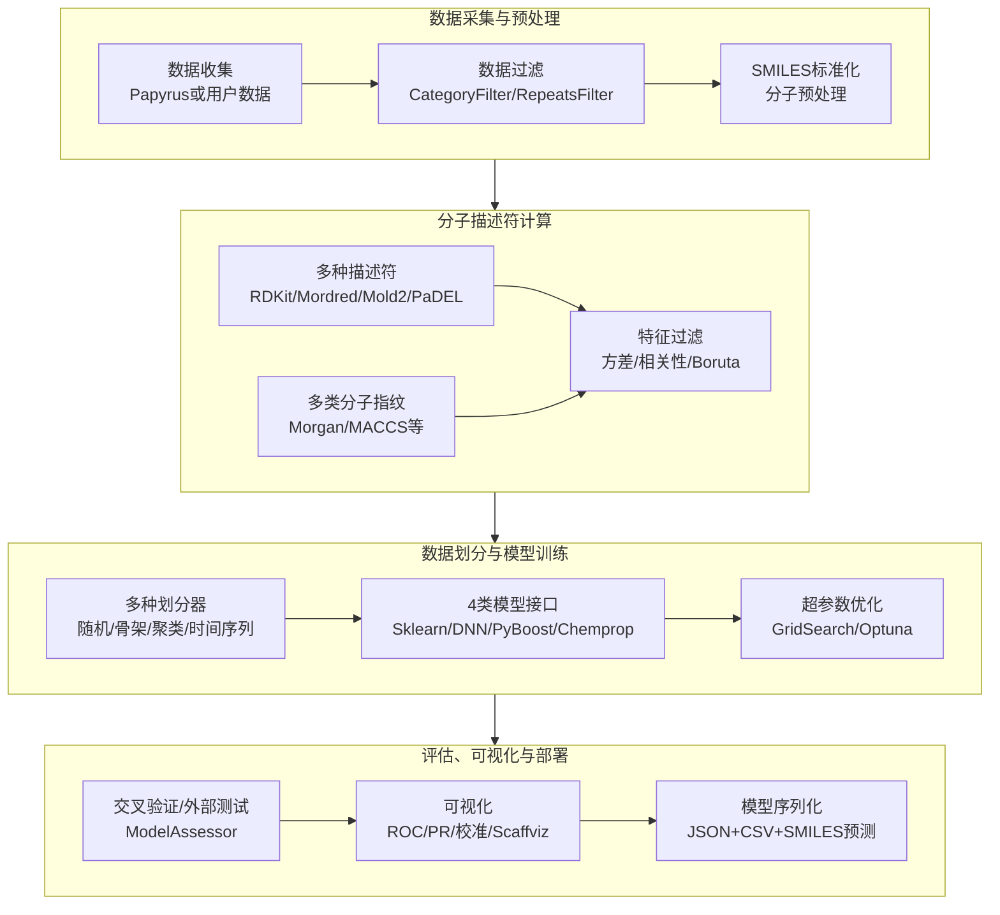
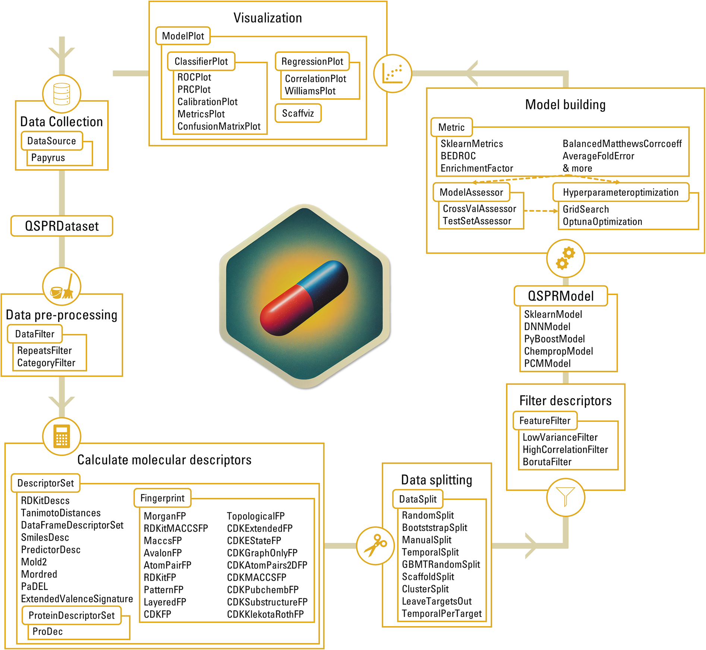
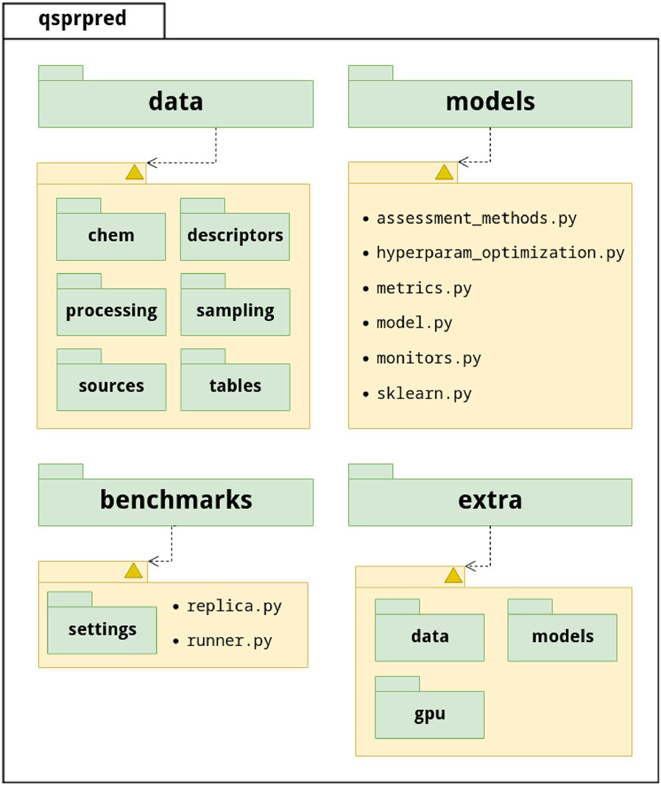
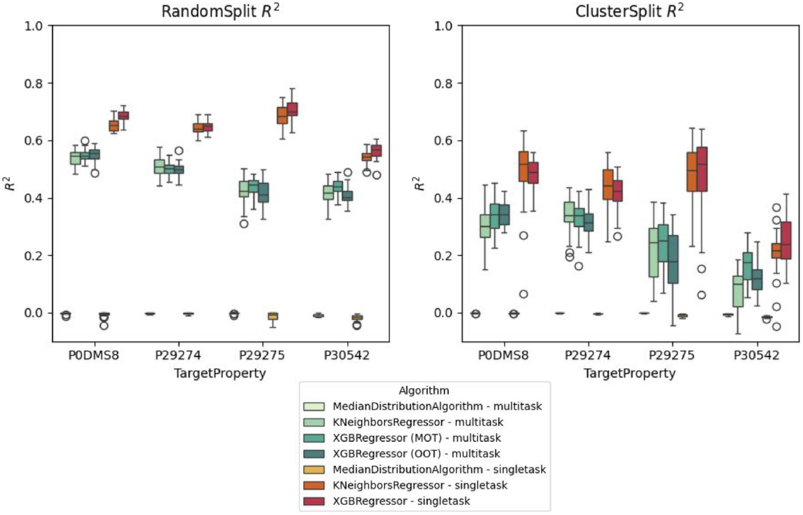
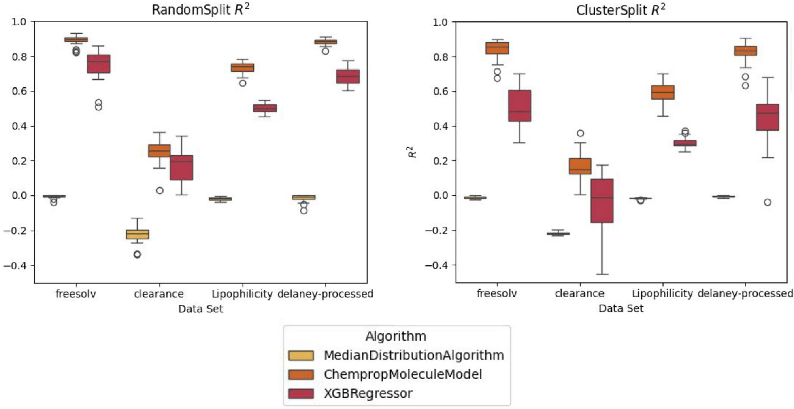

# QSPRpred——解决QSPR建模可复现与部署难题的开源全流程工具包

## 本文信息

- **标题**：QSPRpred: a Flexible Open-Source Quantitative Structure-Property Relationship Modelling Tool
- **作者**：Helle W. van den Maagdenberg, Martin Šícho, David Alencar Araripe,..., J. G. Coen van Hasselt, Piet H. van der Graaf, Gerard J. P. van Westen
- **发表期刊**：Journal of Cheminformatics
- **发表时间**：2024年9月24日
- **DOI**：https://doi.org/10.1186/s13321-024-00908-y
- **单位**：莱顿大学（荷兰）、布拉格化学技术大学（捷克）、阿姆斯特丹大学医学中心（荷兰）、林茨约翰·开普勒大学（奥地利）等
- **引用格式**：van den Maagdenberg, H. W., Šícho, M., Araripe, D. A. et al. QSPRpred: a Flexible Open-Source Quantitative Structure-Property Relationship Modelling Tool. *J Cheminform* 16, 128 (2024). https://doi.org/10.1186/s13321-024-00908-y
- 代码GitHub：https://github.com/CDDLeiden/QSPRpred；
- 基准测试代码：https://github.com/CDDLeiden/qsp-bench

## 摘要

> 构建可靠且稳健的定量结构-性质关系（QSPR）模型是一项极具挑战性的任务。首先，实验数据需要被获取、分析和整理。其次，可用的方法数量持续增长，评估不同算法和方法论的过程繁琐而耗时。最后，研究者面临的最大障碍是**确保模型的可复现性并将其转化为实际应用**。在此，我们提出QSPRpred，一套用于生物活性数据集分析和QSPR建模的工具包，旨在解决上述挑战。QSPRpred的**模块化Python API**使用户能够直观地描述建模工作流的不同部分，并提供大量预实现组件，同时支持“即插即用”式的自定义实现。QSPRpred的数据集和模型**可直接序列化**，意味着模型可被轻松复现并投入使用，连同所有必要的数据预处理步骤一并保存，仅凭SMILES字符串即可对新化合物做出预测。QSPRpred的通用化设计理念也通过多任务建模和蛋白化学计量建模（proteochemometric modelling）得到了充分展示。该工具包文档完善，并附带大量教程帮助新用户上手。本文全面介绍了QSPRpred的功能特性，并通过一个小规模的基准测试案例，展示了不同组件如何被组合使用以比较多种模型。QSPRpred完全开源，可通过https://github.com/CDDLeiden/QSPRpred获取。

### 核心结论

- **覆盖QSPR建模全流程**：从数据收集、预处理、描述符计算、特征过滤、数据划分，到模型训练、交叉验证、外部测试评估，再到可视化、序列化和部署，全部在单一Python工具包内完成
- **支持4类模型接口与多种描述符体系**：包括scikit-learn、PyTorch全连接神经网络、PyBoost梯度提升树和Chemprop消息传递神经网络，配合RDKit、Mordred、Mold2、PaDEL等描述符和多类分子指纹
- **提供多种数据划分器，支持多任务与PCM建模**：支持随机、骨架、聚类、时间序列等划分，并覆盖单任务和多任务的回归、单类别及多类别分类；PCM还配有蛋白靶标感知的划分器
- **内置完整适用域分析**：集成MLChemAD，支持基于k近邻、局部离群因子和边界框等多种适用域定义
- **高度可复现和可部署**：模型连同数据预处理步骤一起序列化为可读JSON/CSV，仅凭SMILES即可在新化合物上预测
- **模块化即插即用架构**：所有建模步骤都定义为抽象基类接口，用户可直接替换任何环节，既降低了使用门槛，也保留了高级用户探索新方法的空间
- **较完整的PCM建模接口**：通过ProDEC模块计算基于多序列比对的蛋白描述符（z-scales、BLOSUM、VHSE），并配合PCM专用数据划分策略，将蛋白表征、模型训练和外推评估置于同一工作流
- **全局序列化与可复现性支持**：几乎所有API对象均可序列化为人类可读的JSON/CSV格式，随机种子全局可配置并随模型保存
- **内置完整基准测试工作流**：提供高层次API比较不同描述符、算法和数据准备策略的组合；配套教程还演示了使用Weights & Biases进行高级实验监控

QSPRpred的核心设计思想是将QSPR建模流程分解为一系列可替换的模块化组件。整体工作流如下：

## 背景

定量结构-性质关系（QSPR）建模，作为药物发现和材料科学的核心工具之一，其本质是寻找分子结构与待预测性质之间的数学关系。过去几十年中，QSPR和其主要分支定量构效关系（QSAR）在药物发现领域已经确立了关键地位。**可靠的QSPR模型能够在化合物开发的早期阶段进行有效筛选**，大幅减少对耗时长、成本高的大型实验筛选的依赖。

随着ChEMBL、PubChem等数据库不断积累海量实验数据，以及机器学习方法的快速发展，构建QSPR模型的可用手段呈指数级增长。但与此同时，研究者面临的真正瓶颈并不是“可选方法太少”，而是“可选方法太多”——**如何从数十种分子描述符、数百种机器学习算法和多种数据划分策略中做出合理选择，本身就是巨大的工作量**。

更为严峻的是**可复现性危机**。目前市面上虽有KNIME、DeepChem、AMPL、PREFER等工具，但各自存在局限——要么缺乏模型部署的端到端支持，要么API不够灵活，要么不支持蛋白化学计量建模（PCM）或适用域分析。

> **QSPRpred的核心价值**：一个模型从训练到部署，中间每一步都可能丢失信息——参数序列化、预处理复现、分子表示一致性，任何一个环节出问题，同一模型在不同环境下的预测结果就不一样。QSPRpred把模型、预处理和特征化步骤一起序列化，把这条“断链”接上。

### 关键科学问题

- **QSPR建模中“方法太多”的问题如何解决**：当前可用的分子描述符、机器学习算法和数据划分策略数量庞大，研究者难以系统性地比较和选择，需要一套标准化、模块化的框架让用户能够即插即用式地组合和测试各种方法组合。
- **模型的可复现性和可部署性如何保障**：大量现有工具在模型训练和部署之间存在断点，数据预处理步骤无法随模型一起保存，导致同一模型在不同环境下的预测结果不一致，需要一种全局序列化方案将模型、预处理和特征化步骤一并保存。
- **蛋白化学计量建模（PCM）在Python中如何实现**：PCM是QSAR的重要扩展，将蛋白质靶标信息纳入模型，在成药性、多药活性和脱靶预测中前景广阔。当时通用Python工具中只有少数提供相关功能，例如QSARtuna仅支持简单的z-scale蛋白描述符；PCM仍缺少统一的数据、描述符和验证接口。

## 研究内容

### 工具包架构与工作流

QSPRpred的核心设计理念是**每一步都可替换、可复现**。用户只需通过Python API按顺序拼接各个组件，即可构建完整的建模流程。下面是工具包的完整架构图：

**图1：QSPRpred工具包架构**。展示了从数据采集、描述符计算到模型训练、评估部署的完整模块化工作流。

> QSPRpred还提供了一个命令行接口（CLI），分为`data_CLI`、`model_CLI`和`predict_CLI`三个脚本，覆盖从数据准备、模型训练到新化合物预测的全流程。想不写代码直接训练模型的用户可以用CLI完成超参数优化、交叉验证和测试集预测。

#### 数据收集模块

**内置了Papyrus数据源**，可直接获取大规模整理的生物活性数据集，同时也支持从CSV/TSV/SDF等格式直接加载用户数据。SMILES字符串的标准化可由用户自行处理，也可使用内置的分子存储和注册API。

#### 描述符计算模块

通过**QSPRpred内置的DescriptorSet类统一管理**，集成多种描述符实现：

- **RDKit描述符**：基于RDKit计算的分子描述符
- **Mordred描述符**：由Mordred计算的分子描述符
- **Mold2描述符**：基于分子描述符的特征集
- **PaDEL描述符**：由PaDEL计算的分子描述符
- 分子指纹：MorganFP、RDKitMACSFP、MaccsFP、AvalonFP、RDKitFP、PatternFP、LayeredFP、CDKExtendedFP、CDKGraphOnlyFP、CDKEstateFP、CDKAtomPair2DFP、CDKMACCSFP、CDKPubchemFP、CDKSubstructureFP、CDKFlexiRothFP等
- 其他
  - **Tanimoto距离**：计算分子与数据集中其他分子的Tanimoto距离，作为结构相似性描述符
  - **DataFrameDescriptorSet**：实验测得或其他工具计算好的描述符可直接以DataFrame传入，无需重新计算
  - **已训练模型作为描述符**：QSPRpred自身训练好的模型可作为描述符用于stacked modelling（模型堆叠）

- 蛋白描述符：通过ProDEC计算基于多序列比对的蛋白描述符（z-scales、BLOSUM、VHSE），支持PCM建模

#### 特征过滤模块

提供三种特征选择方法——**LowVarianceFilter**剔除方差低于阈值的特征、**HighCorrelationFilter**剔除相关性高于阈值的特征、**BorutaPy**集成进行基于随机特征对比的全相关特征选择。所有过滤均在训练集上进行，避免数据泄露。

#### 数据划分模块

接受任何实现`split(X, y)`接口的scikit-learn风格划分器，并集成了以下常用方案：

- **SklearnRandomSplit**包装scikit-learn的（Stratified）ShuffleSplit；**RandomSplit、ClusterSplit和ScaffoldSplit**则使用BalanceSplit，为稀疏多任务数据构建平衡划分，并避免任务间泄漏。
- **ManualSplit、TemporalSplit和BootstrapSplit**分别用于采用既定划分、按时间构建测试集或交叉验证折，以及对任意划分器作重复重采样。所有这些划分器都可通过**PCMSplit**用于PCM，并按蛋白靶标维持平衡。
- **LeaveTargetOut**移除某一靶标的全部数据，用于检验PCM向新靶标的外推能力；**TemporalPerTarget**按照分子在整个数据集中的首次出现时间进行多靶标时间划分，从而避免同一分子跨靶标造成时间泄漏。

#### 支持的模型架构

QSPRpred内置4种主要模型架构，均封装为**QSPRModel**子类。`QSPRModel`是抽象基类，用户只需实现fit、predict和serialization三个方法即可集成自定义模型：

- **SklearnModel**：scikit-learn所有估计器的统一包装器，覆盖从线性模型、树模型到集成模型的广泛算法
- **DNNModel**：基于PyTorch的全连接神经网络
- **PyBoostModel**：基于Py-Boost的梯度提升决策树（Gradient Boosted Decision Tree）包装器
- **ChempropMoleculeModel**：基于Chemprop的消息传递神经网络（MPNN），直接接受SMILES字符串作为输入，但仅封装了基础Chemprop，不支持Chemprop的全部功能
- 此外，还提供**PCMModel**类，用于蛋白化学计量建模，是**QSPRModel**的变体，需要额外传入蛋白质标识符进行预测

> **蛋白化学计量（Proteochemometrics, PCM）**：传统QSPR只建模“小分子结构—性质”的关系；PCM在方程中加入了蛋白靶标信息，对每个化合物-蛋白组合分别做表征（compound + protein descriptors），然后预测该组合的生物活性（如pChEMBL、IC50等）。**它预测的不是蛋白本身的性质，而是化合物-靶标对的活性**——这是QSPR向多药活性和脱靶预测方向的自然延伸。
>
> 蛋白描述符通过ProDEC模块计算：先用Clustal Omega或MAFFT做多序列比对，再从比对结果中提取z-scales、BLOSUM和VHSE三种基于氨基酸性质的描述符。PCM建模时需用PCMModel替代QSPRModel，配合PCM专用划分器（如LeaveTargetOut、TemporalPerTarget）来评估模型向新靶标的外推能力。

QSPRpred支持单任务和多任务回归，以及单类别和多类别分类；多个目标属性会自动确定相应的模型任务。所有模型任务通过枚举类（REGRESSION、SINGLECLASS、MULTITASK_MULTICLASS等）指定。

#### 超参数优化与模型评估

超参数优化支持两种默认实现：**GridSearch**（穷举搜索，评估所有指定参数的组合）和**OptunaOptimization**（基于Optuna的贝叶斯优化，通过Tree-structured Parzen Estimator算法迭代搜索最优超参数组合，无需穷举）。

模型评估通过**ModelAssessor**基类完成，提供**TestSetAssessor**（外部测试集评估）和**CrossValAssessor**（交叉验证，同时也支持通过BootstrapSplit进行Bootstrap抽样）两种评估方式。内置的评分函数包括所有scikit-learn指标和平衡分类指标（如平衡准确率、BRC等）。

**图2：QSPRpred的软件包结构**。顶层`qsprpred`分为四个模块：左上`data`包含化学处理、描述符、预处理、数据划分、数据源和表格；右上`models`包含模型、评估方法、超参数优化、指标、监控与scikit-learn兼容层；左下`benchmarks`提供设置、重复实验和运行器；右下`extra`收纳可选的数据、模型和GPU依赖。虚线表示子包归属关系，黄色三角形标示可选组件。

#### 适用域分析

QSPRpred集成**MLChemAD适用域分析工具**，提供多种适用域定义方法，用于判断新化合物是否落在训练模型的有效预测范围内。核心方法包括：

- **k近邻**：计算新样本到训练集中k个最近邻的距离，超出距离阈值则判定为离群点
- **局部离群因子（LOF）**：比较样本与其邻域之间的密度偏差，密度显著低于邻居的判定为离群
- **边界框**：对每个特征维度取训练集的最小-最大值范围，超出任一维度的判定为离群；也可先用PCA降维再做边界框

此外，MLChemAD还支持凸包、核密度估计、孤立森林、Hotelling T2和杠杆值等方法，用户也可自定义实现。适用域对象可在训练集上拟合，用于识别或移除测试集中的离群点；也可附加到模型上，在生产模式下预测新化合物时返回该化合物是否落在训练模型的适用域内。

#### 可视化与可复现性

QSPRpred内置**ModelPlot可视化类**，支持ROC曲线、精确率-召回率曲线、校准图、分类指标柱状图等。对于多类分类模型，指标按类别计算（one-vs-rest）并支持不同平均方式。与Scaffviz包的集成提供了交互式化学信息学可视化，包括分子降维散点图，以及以颜色叠加显示的预测误差。

序列化方面，几乎所有API对象均可保存为人类可读的JSON文件，数据框可保存为CSV。对于深度学习模型等无法直接序列化的情况，会保存足够的元数据以供尽可能精确地重建。

> **序列化不只是保存模型参数**：QSPRpred同时保存数据预处理和特征化步骤，因此在新化合物上做预测时，仅凭一条SMILES字符串即可完成全流程。全局随机种子也随模型一起保存，复现实验中的随机操作。

### 基准测试案例研究

#### 案例一：多任务回归模型对比

研究使用4个腺苷受体（A1、A2A、A2B、A3）的生物活性数据集，比较**单任务和多任务回归模型在不同数据划分策略下的性能**。腺苷受体是高度保守的受体家族，选择性调节剂的研究前景广阔。**单任务为每个靶标单独建一个模型**，4个受体建4个独立模型；**多任务用一个模型同时预测多个靶标**，底层表征共享，理论上能在相似靶标间互相借力。该研究还比较了xgboost的两种多任务策略：

- **MOT（Multi Output Tree）**——每个叶子存一个长度等于靶标数的向量，所有任务共享同一套节点分裂结构，一个样本落入某个叶子后一次性读出所有靶标的更新值；
- **OOT（One Output Per Tree）**——每个靶标各建一套独立的标量树ensemble，树结构完全不共享，但在同一boosting轮内同步推进。

**图3：多任务回归基准测试结果**。左、右面板分别为RandomSplit和ClusterSplit下30次重复的决定系数$R^2$箱线图，横轴以UniProt编号标注4个腺苷受体。浅绿、绿色、青绿色和深青绿色依次表示多任务的MedianDistributionAlgorithm、KNeighborsRegressor、XGBRegressor的MOT和OOT；黄色、橙色和红色依次表示对应的单任务基线、KNeighborsRegressor和XGBRegressor。箱体呈现重复实验的分布，圆点为离群值。

> **多任务模型在两种划分和全部任务上整体较弱**，而OOT通常略差于或接近MOT。与Janela等人的先前研究不同，中值分布基线算法在此数据集上并未表现出优势。**对于该数据集，使用多个单任务模型可能是更好的选择**，但深度学习模型可能更适合多任务建模，且数据稀疏性的影响需要考虑。

#### 案例二：不同架构回归模型的比较

研究使用4个MoleculeNet数据集（脂溶性、清除率、溶解度、自由溶剂化能），比较**XGBRegressor（基于CPU、接受指纹输入）和ChempropMoleculeModel（基于GPU、接受SMILES输入）两种架构**。

**图4：两种模型架构的回归基准测试**。左、右面板分别为RandomSplit和ClusterSplit下30次重复的$R^2$箱线图；横轴依次为FreeSolv、Clearance、Lipophilicity和Delaney处理后的溶解度数据集。黄色为仅预测训练集性质中位数的MedianDistributionAlgorithm，橙色为接受标准化SMILES的ChempropMoleculeModel，红色为接受分子指纹的XGBRegressor。箱体展示重复实验分布，圆点为离群值。

> XGBRegressor在所有场景中表现较差，仅用默认参数未做超参数优化；**ChempropMoleculeModel预测方差更小**，性能更稳定。
>
> 其中**清除率是所有数据集中最难预测的性质**，XGBRegressor在聚类划分场景下甚至没有超过中值基线。

### 与其他工具的对比

QSPRpred在功能覆盖面上相比现有工具有明显优势。表根据原文Table 1整理，术语说明如下：

- **复合描述符**：能否把多种分子表示（如RDKit + Morgan指纹）组合成统一特征矩阵输入同一个模型
- **自定义描述符**：能否接入自己实现的描述符或直接用DataFrame传入实验数据
- **浅层模型**：随机森林、SVM、KNN、XGB等传统机器学习方法
- **模型可转移性**：保存的不只是模型权重，而是把**模型+预处理+特征计算**全部序列化，新环境下直接从SMILES预测
- **蛋白化学计量（PCM）**：把蛋白信息也加入模型，预测的是化合物-靶标对的生物活性（如pChEMBL），而非单独预测蛋白性质
- **多参数优化**：对模型的多个超参数做搜索优化（如GridSearch、Optuna），而非同时优化多个分子性质的MPO

| 特性 | QSPRpred | QSARtuna | AMPL | PREFER | Uni-QSAR | Scikit-Mol |
| --- | --- | --- | --- | --- | --- | --- |
| 描述符数量 | 10+ | 8 | 4 | 4 | 5+ | 9 |
| 复合描述符 | ✓ | ✓ | ✗ | ✗ | ✗ | ✗ |
| 自定义描述符 | ✓ | ✗ | ✗ | ✗ | ✗ | ✓ |
| 浅层模型 | ✓ | ✓ | ✓ | ✓ | ✓ | ✓ |
| 神经网络模型 | ✓ | ✓ | ✓ | ✓ | ✓ | ✗ |
| 模型可转移性 | ✓ | ✗ | ✓ | ✓ | ✗ | ✓ |
| 蛋白化学计量 | ✓ | ✓ | ✗ | ✗ | ✗ | ✗ |
| 适用域 | ✓ | ✗ | ✗ | ✗ | ✗ | ✗ |
| 不确定性估计 | ✗ | ✓ | ✓ | ✗ | ✗ | ✗ |
| 概率变换 | ✗ | ✓ | ✗ | ✗ | ✗ | ✗ |
| 多参数优化 | ✓ | ✓ | ✗ | ✗ | ✗ | ✓ |

> QSPRpred是表中唯一同时提供**PCM、适用域分析和模型可转移性**的工具；QSARtuna同样列为支持PCM，但其蛋白表征仅限简单z-scale描述符。
>

---

## 关键结论与批判性总结

### 主要贡献

- **统一的建模框架**：将QSPR建模中数据准备到模型部署的全流程整合为单一工具包，支持4类模型接口、多种描述符体系和多种数据划分器
- **即插即用的扩展性**：所有组件均通过抽象基类定义接口，用户可轻松实现自定义描述符、数据划分器和模型
- **可复现与可转移的序列化方案**：模型和数据以人类可读格式序列化，预处理和特征化步骤随模型一并保存，仅凭SMILES即可对新化合物预测，这是工具最核心的差异化卖点
- **完整的验证工具链**：内置交叉验证、外部测试评估、适用域分析、超参数优化和多种可视化手段
- **降低QSPR建模门槛**：模块化API和高阶基准测试接口使初学者也能完成端到端建模，同时保留高级用户自定义的空间
- **推动PCM建模的普及**：将蛋白描述符、PCM专用划分和部署接口整合进同一Python工作流，为多药活性和脱靶预测等场景提供工具支撑

### 局限性

- **基准测试案例规模有限**：论文中仅展示了4个腺苷受体和4个MoleculeNet数据集的基准，作者在Conclusions中坦诚“这些案例研究并非完整或详尽”。Experiment 1只用Morgan指纹在4个腺苷受体上做多任务回归，Experiment 2只用MoleculeNet数据集比较XGBRegressor和ChempropMoleculeModel
  - **两个案例都没有体现PCM建模和多种分子表示的使用**——而这两者正是QSPRpred最核心的差异化功能。本质上是演示工具如何把不同组件串起来，而非系统的方法学比较
- **神经网络架构仍有限**：目前包含全连接网络（DNNModel）和Chemprop消息传递神经网络；后者已属于GNN，但只是对基础Chemprop MPNN的封装，尚未覆盖Chemprop的全部功能，也未覆盖Transformer等更广泛的架构
- **依赖较多外部包**：PCM建模依赖Clustal Omega或MAFFT（Windows上需手动安装），部分功能需要额外安装ProDEC等配套包
- **模型超参数默认使用**：案例研究中XGBRegressor和ChempropMoleculeModel均未优化超参数，实际性能可能显著优于报告结果
- **缺少不确定性估计**：对比表显示QSPRpred不支持不确定性估计和归纳模型校准，而QSARtuna和AMPL已经提供相关功能。论文Conclusions中明确将conformal prediction集成列为未来改进方向
