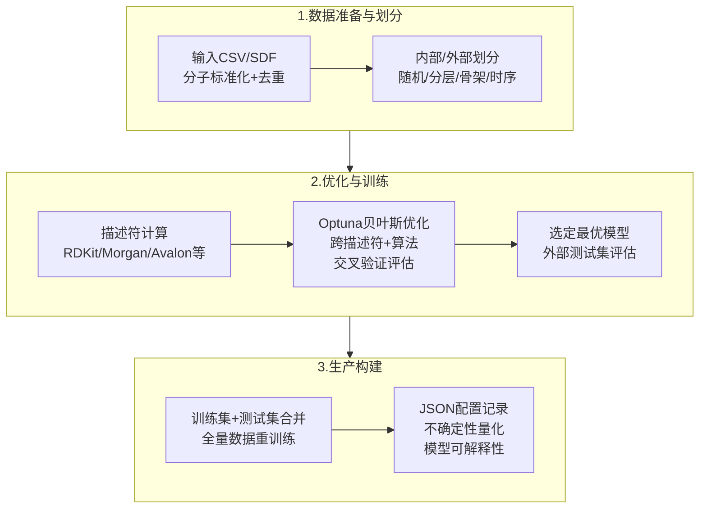
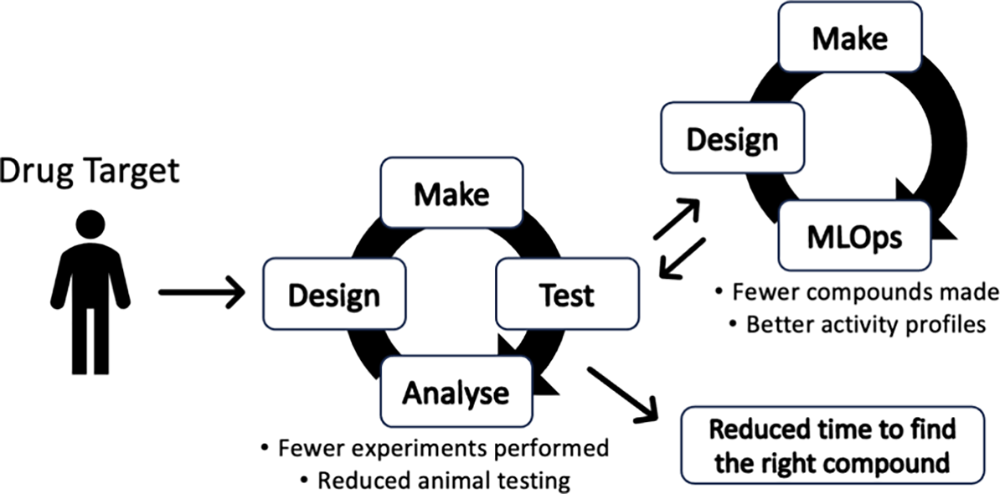
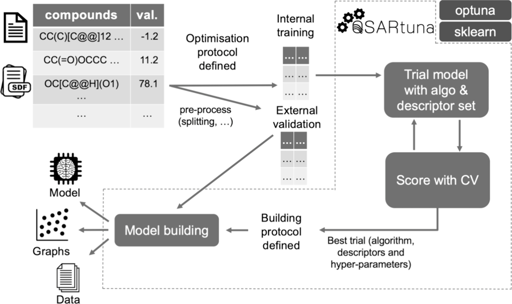

# QSARtuna——支持不确定性量化与模型解释的QSAR建模平台

## 本文信息

- **标题**：QSARtuna: An Automated QSAR Modeling Platform for Molecular Property Prediction in Drug Design
- **作者**：Lewis Mervin, Alexey Voronov, Mikhail Kabeshov, Ola Engkvist
- **发表期刊**：Journal of Chemical Information and Modeling
- **发表时间**：2024年7月1日
- **单位**：阿斯利康（英国剑桥、瑞典哥德堡）；哥德堡大学计算机科学与工程系（瑞典）
- **DOI**：https://doi.org/10.1021/acs.jcim.4c00457
- **引用格式**：Mervin, L., Voronov, A., Kabeshov, M. et al. QSARtuna: An Automated QSAR Modeling Platform for Molecular Property Prediction in Drug Design. *J. Chem. Inf. Model.* 2024, *64*, 5365–5374. https://doi.org/10.1021/acs.jcim.4c00457
- **代码与数据**：GitHub https://github.com/MolecularAI/QSARtuna；文档 https://molecularai.github.io/QSARtuna/；Apache-2.0开源

## 摘要

> 机器学习和深度学习方法正越来越多地部署在药物设计的“设计-合成-测试-分析”（DMTA）循环中，用于预测小分子的性质。然而，支持不确定性量化、模型可解释性及其他关键模型使用方面的自动化软件包仍然稀缺。大量可用的分子表示和算法（及其参数）使得模型的鲁棒优化、评估、复现和部署成为非平凡的任务。本文提出QSARtuna，一个基于Python的分子性质预测建模流水线，集成了Optuna、Scikit-learn、RDKit和ChemProp等包，支持不同分子表示与机器学习模型的高效自动化比较。**该平台在设计时就考虑了不确定性量化和模型可解释性**。文章通过三个案例——简单分子性质、反应活性预测和DNA编码库富集分类——展示了平台的能力。

### 核心结论

- **覆盖QSAR建模全流程**：从数据输入、分子标准化、去重、数据划分、超参数优化到模型部署，三步式框架一键完成
- **内置不确定性量化与模型解释**：支持VennABERS离散度、集成不确定性、Dropout不确定性、MAPIE（回归）四种不确定性估计方法；支持SHAP和ChemProp interpret两种可解释性方法
- **概率建模变换**：将实验活性值转换为概率分布函数，同时保留分类和回归的优势，是当前其他开源AutoML平台不具备的独特功能
- **归纳式概率校准**：提供Sigmoid、等渗回归和VennABERS三种校准方法，使预测概率更贴近真实分布，改善决策可靠性
- **多参数优化**：支持在交叉验证折间最小化性能标准差，自动筛选跨分裂更具泛化性的描述符-算法组合

## 背景

### QSAR建模的“可选方法太多”困境

QSAR模型在药物发现的DMTA循环中扮演着越来越重要的角色，用计算预测代替部分实验筛选，可以加速周期、降低成本，还能减少动物实验等伦理争议。QSAR已不仅用于活性预测，还广泛结合到分子从头设计（指导生成算法的目标函数）、主动学习（优化自由能计算）和反应产率预测等多个前沿方向。ChEMBL、PubChem等数据库的规模持续扩大，算法也在不断进步，但**方法太多恰恰成了问题**：几十种分子描述符、数百种机器学习算法和多种数据划分策略，如何系统比较和选择本身就是巨大的工作量。

更关键的瓶颈在于**模型的可靠评估**。现有工具往往只关注“训练一个模型”，而忽略了交叉验证方案的严谨性、数据划分的合理性、以及模型校准等对生产环境至关重要的环节。这使得即使训练出性能优异的QSAR模型，也难以在实际应用中做出可信的决策。因此，真正有实用价值的工具不仅要“能训练”，还要“能评估”，这正是QSARtuna在设计时着重解决的问题。

此外，AutoML（自动化机器学习）的概念虽然已经提出多年，但将其系统性地应用于分子性质预测领域仍然面临诸多挑战。QSARtuna正是在这一交叉点上诞生的，它将AutoML的自动化能力与QSAR领域的最佳实践相结合，试图为药物化学家提供一个既强大又易用的建模工具。

### 现有工具的局限

市面上虽有AutoQSAR、eTOXlab、AMPL、PREFER、Uni-QSAR等开源工具，但各自存在明显短板。AMPL仅有4种算法和4组描述符（其中MOE还需商业授权），且无GUI；PREFER依赖笔记本且安装步骤繁琐；Uni-QSAR需要合并1D、2D、3D多种表示，使用门槛较高；eTOXlab已停止维护；OCHEM基于云端不适合私有数据。更重要的是，**多数工具在设计时未将不确定性量化和模型可解释性纳入考量**，而在生产环境中做出可靠决策时，这两点至关重要。

> **QSARtuna的核心定位**：在自动化框架内**从一开始就内置**了不确定性量化、模型校准和可解释性——这三者是在生产环境中使用QSAR模型时最容易被忽略、却最具实际价值的环节。

### 关键科学问题

- **如何系统比较大量分子表示和算法组合**：几十种描述符与数百种算法之间的最优组合选择，需要自动化且可复现的比较框架，而非手动试错
- **如何将实验不确定性纳入模型**：传统回归模型将实验误差视为需要消除的噪声，实际上这些误差包含了关于活性变化的有用信息，需要概率建模框架来捕捉
- **如何保证模型在实际生产中的可靠性**：仅有预测分数不够，需要不确定性量化和概率校准来支撑实际的药物筛选决策

### 创新点

- **概率建模变换**：将实验活性值从确定性值转换为基于正态分布CDF的概率分布函数，使“小于”或“大于”等带限值的实验数据也能直接用于建模，这一功能在同类开源AutoML平台中独一无二
- **归纳式概率校准**：集成Sigmoid、等渗回归和VennABERS三种校准方法，改善预测概率的真实性，使模型输出更可信
- **多参数优化**（Multi-parameter Optimization）：在交叉验证折间最小化性能标准差，自动筛选跨分裂更具泛化性的描述符-算法组合，该功能在开源AutoML平台中尚无先例
- **模块化可解释性**：集成SHAP（适用于所有模型）和ChemProp interpret，确保用户能够理解模型决策依据
- **三步式工作流**：将优化、评估和生产构建明确分离，遵循QSAR最佳实践，避免数据泄露，这是多数现有工具未充分考虑的

#### 表1：QSARtuna与其他开源工具的对比

| 功能特性 | QSARtuna | AMPL | PREFER | Uni-QSAR |
| --- | --- | --- | --- | --- |
| 自定义数据划分 | ✓ | ✗ | ✗ | ✗ |
| 描述符数量 | 8 | 4 | 4 | 5+ |
| 复合描述符 | ✓ | ✗ | ✗ | ✗ |
| 自定义描述符 | ✓ | ✗ | ✗ | ✗ |
| 浅层模型 | ✓ | ✓ | ✓ | ✓ |
| 神经网络 | ✓ | ✓ | ✓ | ✗ |
| 归纳式模型校准 | ✓ | ✗ | ✗ | ✗ |
| 不确定性估计 | ✓ | ✓ | ✗ | ✗ |
| 模型可解释性 | ✓ | ✗ | ✗ | ✗ |
| 多参数优化 | ✓ | ✗ | ✗ | ✗ |
| 概率变换 | ✓ | ✗ | ✗ | ✗ |

QSARtuna在功能覆盖面上相比其他工具有明显优势，是表中唯一同时提供**模型校准、不确定性估计、模型可解释性和概率变换**的工具。

## 研究内容

### 三步式建模框架

QSARtuna将建模过程分解为三个清晰的步骤：

每一步都遵循QSAR领域的最佳实践：初始划分避免数据泄露，内部划分用于交叉验证和超参数优化，外部划分仅在最终评估时使用，且从未参与任何特征选择或模型训练。这一步的“生产构建”阶段虽然意味着最终模型没有数据可用于评估，但**所有可用数据都进入了最终模型**，在实际生产部署中是必须的。

平台还支持利用辅助领域信息（如Proteochemometric建模、剂量、时间点等）进行模型扩展，为更复杂的多任务学习场景提供了接口。

该三步框架的设计哲学在于：**优化阶段只用训练集**（通过交叉验证避免泄露），**评估阶段用外部测试集**，而**生产阶段用全部数据重训**以确保最终模型覆盖所有可用信息。这种分离是QSAR最佳实践的核心要求，也是多数现有工具未充分考虑的。此外，平台支持自动化的JSON配置文件格式，使得每次运行的完整参数设置都能被记录和复现，确保了模型生命周期内的一致性和可追踪性。

### 数据准备与描述符

**数据预处理**包括分子标准化、去重（默认采用KeepMedian策略，兼顾所有实验数据且对离群值稳健）、缺失值检测，以及响应值的对数变换等。去重策略支持7种选项（KeepFirst/KeepLast、KeepRandom、KeepMin/KeepMax、KeepAverage、KeepMedian、KeepAll），用户可根据实验性质灵活选择。平台期望输入为CSV或SDF格式，并支持从项目团队持续拉取数据更新的自动化流程。

**描述符计算**方面，内置9种描述符类型：RDKit圆形指纹（Morgan类）、RDKit圆形指纹含计数量版本、RDKit理化描述符、Avalon、MACCS、Jazzy、复合描述符（任意组合拼接）、预定义描述符和Scaled descriptors。所有描述符计算均经过并行化和缓存优化，用户也可提交预计算的描述符，从而避免重复计算。

### 数据划分与模型选择

提供五种划分策略：随机、分层（针对分类和回归分别处理，回归采用分箱策略确保训练/测试分布一致）、时序、骨架（模拟骨架跳跃场景）和预定义划分。其中分层划分对分类数据保证类别分布一致，对回归数据则按Xu等人的分箱方案确保响应值分布一致，是默认的稳健基线。

支持的算法包括神经网络（ChemProp）、支持向量机、随机森林，以及**概率随机森林（PRF）**，专门与概率数据变换配合使用，已被证明能改善不确定性较大的生物活性预测。每个试验通过主指标（默认ROC-AUC或负MSE）评估，同时计算BEDROC等额外指标供用户参考，但仅主指标作为Optuna的目标函数。

### 核心功能：概率建模、校准与不确定性

**概率建模变换**是QSARtuna最具差异化的功能。实验活性值存在固有的可重复性限制，QSARtuna允许将响应标签从确定性值转换为基于正态分布累积分布函数（CDF）的概率分布。以Buchwald-Hartwig反应产率预测为例，产率5对应50%似然，2.5或7.5对应约10.6%和89.4%，低于或高于标准差范围则收敛到0%或100%。这使得“小于”或“大于”等带限值也能直接用于建模。这种设置本质上结合了分类和回归架构的特点：相比纯分类，能更好地表示活性增加/减少的因素；相比纯回归，在决策边界附近考虑了实验数据的粒度。

**概率校准**提供Sigmoid、等渗回归和VennABERS三种方法，均基于Scikit-learn的归纳式交叉验证框架。校准后的模型预测概率更接近真实分布，对于在实际生产中基于预测值做出决策至关重要，特别是在高度不均衡的DEL筛选场景中。

**不确定性估计**提供四种方法：VennABERS离散度（基于多点概率）、ChemProp集成不确定性（随机初始化训练多个模型）、Dropout不确定性（推理时启用Dropout），以及MAPIE（适用于回归任务的分布无关不确定性估计）。不同方法适用于不同的算法选择和任务类型。

**模型可解释性**支持SHAP（Shapley Additive exPlanations，适用于所有模型）和ChemProp interpret（仅适用于ChemProp模型，基于原始包的interpret函数），帮助用户理解模型为何做出特定预测，增强模型在生产环境中的可信度。在实际药物发现决策中，“为什么模型预测这个化合物有活性”往往比“预测分数是多少”更重要，这正是可解释性功能的核心价值所在。

### 三个案例验证

QSARtuna在三个反映当前QSAR任务趋势的数据集上进行了验证：

#### 案例一：ESOL水溶性回归

| 方法 | 划分 | Pearson相关系数 |
| --- | --- | --- |
| RF+ECFP（无优化） | 骨架 | 0.264 |
| RF+ECFP（网格优化） | 骨架 | 0.297 |
| QSARtuna（标准） | 骨架 | 0.506 |
| QSARtuna（多参数优化） | 骨架 | 0.636 |
| RF+ECFP（无优化） | 分层 | 0.725 |
| QSARtuna（标准） | 分层 | 0.907 |

骨架划分下，从最简单的RF基线到完整QSARtuna运行（150次启动试验+300次正式试验，优化跨折标准差），Pearson相关系数从0.264提升至0.636，**提升幅度0.372**。分层划分下，从0.725提升至0.907。这清晰地说明了超参数优化的价值。在多参数优化方案中（最小化跨折标准差），骨架划分下性能提升了0.130，表明该方法确实能更好地选择跨分裂更具泛化性的超参数组合，这种自动化的多参数优化在同类开源平台中尚属首次。

需要特别指出的是，这一性能提升是以计算时间为代价的：完整的QSARtuna运行耗时约9.6小时（含优化和构建），而简单的RF+ECFP基线仅需29秒。但这种时间投入在实际药物发现项目中是合理的，一次性投入时间训练出更可靠的模型，远比反复使用低质量模型导致错误决策更有价值。

#### 案例二：Buchwald-Hartwig反应活性预测

| 方法 | Pearson相关系数 |
| --- | --- |
| RF+ECFP（无优化、无概率建模） | 0.880 |
| RF网格搜索（无概率建模） | 0.905 |
| QSARtuna（无概率建模） | 0.953 |
| QSARtuna（概率建模+PRF） | 0.967 |

概率建模使得Pearson相关系数从0.880提升至0.967，**提升了0.087**。该功能是其他软件不具备的独特选项。这一结果的实际意义在于：反应产率预测中的实验误差是固有的、不可消除的，传统回归模型往往将其视为“需要消除的噪声”，而概率建模框架则将其转化为**可利用的信息**，在决策边界附近提供更细粒度的预测，同时保持对整体趋势的把握。

#### 案例三：DNA编码库富集分类

DEL筛选数据产生海量的结合数据，用于训练能够在实验未覆盖的化合物空间中发现潜在结合分子的亲和模型，是近年来QSAR领域的重要应用方向。该任务的特点是**高度不均衡**和响应值范围大。使用VennABERS校准的QSARtuna模型，在DEL分类任务上实现了**ROC AUC 0.906**和**负Brier分数-0.003**，是校准性能最优的方案。可靠性曲线显示，经过VennABERS校准的模型将更多化合物的预测值分配到接近理想对角线的位置，而未经校准的基线模型存在系统性偏差。这说明**模型校准在DEL筛选这类高不均衡场景中尤其重要**，糟糕的校准输出可能导致不可行的筛选决策。

**图1：在药物设计流程中整合训练良好模型的重要性**。展示了需要成熟的模型托管（MLOps）和重新训练基础设施才能有效部署模型，以及在设计阶段将最新模型提供给所有科学家是模型影响循环的主要途径。

**图2：标准化QSARtuna建模平台概览**。数据质量验证、整理和描述符计算在设计时已纳入考量；采用三步式优化、交叉验证评分和生产构建工作流。

### 平台定位与实际价值

QSARtuna试图在“易用性”和“生产可用性”之间找到平衡点。平台通过JSON配置文件驱动整个建模流程，用户无需编写大量代码即可启动优化、评估和生产构建，降低了准入门槛。Apache-2.0开源协议确保了学术和商业场景的广泛适用性。对于希望将QSAR模型从实验室推向生产环境的团队，平台内置的不确定性量化和模型校准提供了此前需要手动拼凑的工具链。作者来自阿斯利康Molecular AI团队，工业界背景使平台的设计天然贴近实际应用需求——在药物发现的实际决策中，“模型是否可信”往往比“模型分数有多高”更重要。

## 关键结论与批判性总结

### 主要贡献

- **全流程自动化**：三步式框架将QSAR建模的各个环节自动化，无需ML或编程专业背景即可使用，显著降低了QSAR建模的准入门槛
- **不确定性量化与可解释性内建**：将生产环境中最重要的两个环节纳入设计，而非事后补充，确保模型输出更可靠、更可信
- **概率建模变换**：当前开源AutoML平台中独有的功能，让实验不确定性在建模中得以体现，使“小于”或“大于”等带限值的实验数据也能直接用于建模
- **模块化透明设计**：相比其他黑箱方案，QSARtuna高度可定制，支持模型全生命周期管理，确保新数据到来时模型更新采用相同协议，提升可复现性

### 局限性

- **优化耗时**：完整的QSARtuna运行（含150-300次试验）在单机上需要数小时甚至更久（案例三耗时长达100小时以上），计算成本较高。虽然性能提升明显，但对于资源有限的团队可能构成障碍
- **功能仍在发展中**：适用域（Applicability Domain）分析、活性悬崖和非加和性评估等关键功能尚未实现，列为未来方向。对于需要适用域分析的使用者，QSARtuna暂时无法满足
- **案例集有限**：三个案例（溶解度、反应活性、DEL富集）覆盖了主要任务类型，但这些案例并非完整或详尽的系统性基准。在大规模基准测试上的全面对比尚不充分
- **依赖较多外部包**：依赖Optuna、Scikit-learn、RDKit、ChemProp等多个包，环境配置需要一定经验。ChemProp的GPU依赖也限制了其在无GPU环境中的使用

### 未来方向

QSARtuna定位为”活项目”（living project），将持续更新和新功能。已明确的未来方向包括：适用域（AD）分析，用于定义模型可靠预测的化学空间范围；活性悬崖和非加和性评估，用于处理高度不连续的结构活性景观。此外，平台还计划支持更多模型架构和分子表示方法。

与QSPRpred等同类工具相比，QSARtuna在**不确定性量化和概率建模**方面具有独特优势，而QSPRpred则在**模型序列化与部署**方面更为完善。两者在设计理念上形成互补，前者关注“模型输出是否可信”，后者关注“模型如何从训练到生产”。对于需要同时关注这两方面的用户，QSARtuna提供了从数据准备到模型部署的完整工作流，而QSPRpred则提供了更细粒度的模型定制能力。

平台的设计理念源于阿斯利康在工业界药物发现中的实际需求，当大量候选化合物需要快速评估时，模型不仅需要“预测准确”，还需要“预测可信”。这正是QSARtuna将不确定性量化和模型校准作为核心功能而非附加功能的原因。

对于希望快速上手QSAR建模的研究人员，QSARtuna提供了从数据导入到模型部署的完整自动化流程，无需深度理解每个算法的细节即可得到生产级别的预测模型；而对于希望深入了解模型内部机制的高级用户，平台的模块化设计和可解释性功能则提供了充分的透明度和定制空间。

这种“低门槛+高深度”的设计理念，使得QSARtuna既适合初学者快速入门，也适合有经验的研究者进行深度探索，是其区别于同类工具的重要特征之一。
