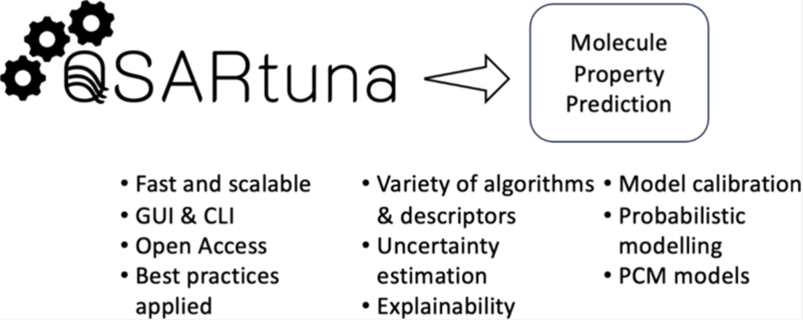
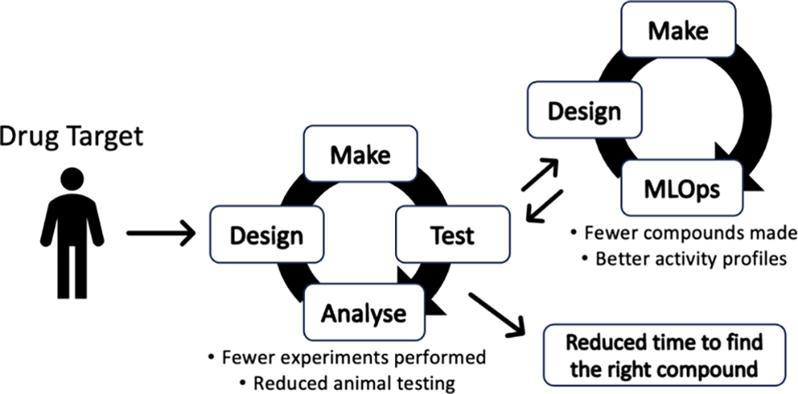
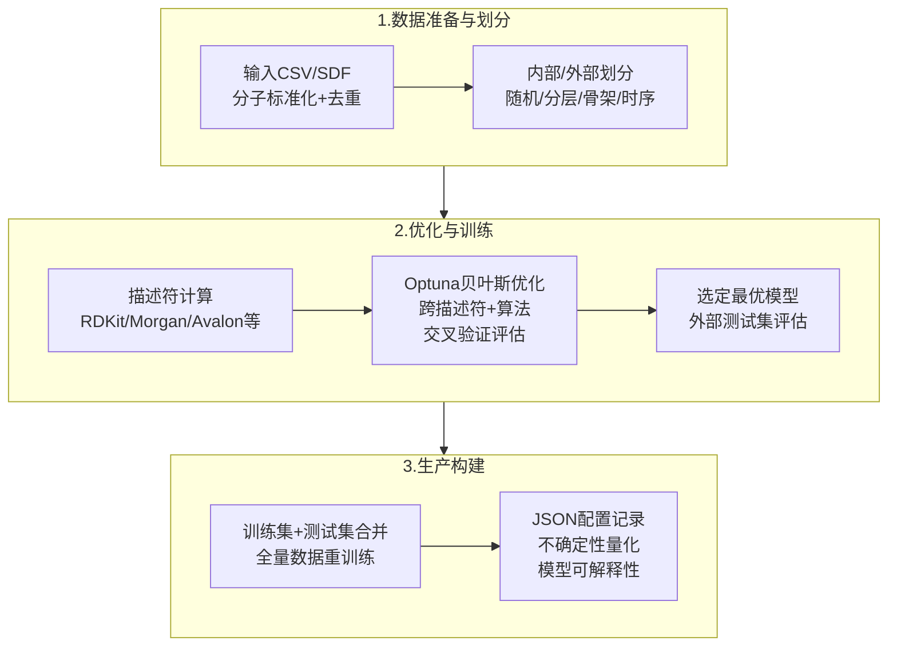
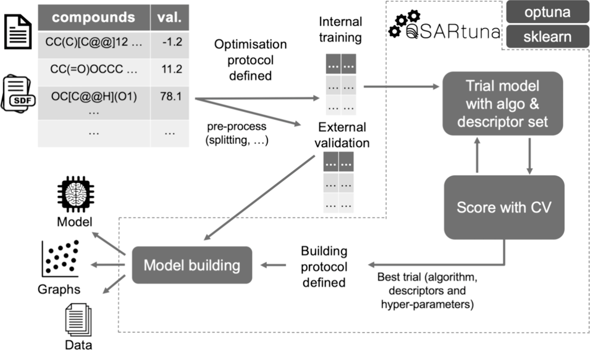

# QSARtuna——支持不确定性量化与模型解释的QSAR建模平台

## 本文信息

- **标题**：QSARtuna: An Automated QSAR Modeling Platform for Molecular Property Prediction in Drug Design
- **作者**：Lewis Mervin, Alexey Voronov, Mikhail Kabeshov, Ola Engkvist
- **发表期刊**：Journal of Chemical Information and Modeling
- **发表时间**：2024年7月1日
- **单位**：阿斯利康（英国剑桥、瑞典哥德堡）；哥德堡大学计算机科学与工程系（瑞典）
- **DOI**：https://doi.org/10.1021/acs.jcim.4c00457
- **引用格式**：Mervin, L., Voronov, A., Kabeshov, M. et al. QSARtuna: An Automated QSAR Modeling Platform for Molecular Property Prediction in Drug Design. *J. Chem. Inf. Model.* 2024, *64*, 5365–5374. https://doi.org/10.1021/acs.jcim.4c00457
- **代码与数据**：GitHub https://github.com/MolecularAI/QSARtuna；文档 https://molecularai.github.io/QSARtuna/；Apache-2.0开源

## 摘要

> 机器学习和深度学习方法正越来越多地部署在药物设计的“设计-合成-测试-分析”（DMTA）循环中，用于预测小分子的性质。然而，支持不确定性量化、模型可解释性及其他关键模型使用方面的自动化软件包仍然稀缺。大量可用的分子表示和算法（及其参数）使得模型的鲁棒优化、评估、复现和部署成为非平凡的任务。本文提出QSARtuna，一个基于Python的分子性质预测建模流水线，**集成了Optuna、Scikit-learn、RDKit和ChemProp等包**，支持不同分子表示与机器学习模型的高效自动化比较。**该平台在设计时就考虑了不确定性量化和模型可解释性**。文章通过三个案例——简单分子性质、反应活性预测和DNA编码库富集分类——展示了平台的能力。

### 核心结论

- **覆盖QSAR建模全流程**：从数据输入、分子标准化、去重、数据划分、超参数优化到模型部署，采用三步式框架完成
- **内置不确定性量化与模型解释**：支持VennABERS离散度、集成不确定性、Dropout不确定性、MAPIE（回归）四种不确定性估计方法；**支持SHAP和ChemProp interpret两种可解释性方法**
- **概率建模变换**：将实验活性值转换为概率分布函数，**同时保留分类和回归的优势**，是当前其他开源AutoML平台不具备的独特功能
- **归纳式概率校准**：提供Sigmoid、等渗回归和VennABERS三种校准方法，**使预测概率更贴近真实分布，改善决策可靠性**
- **多参数优化**：支持在交叉验证折间最小化性能标准差，**自动筛选跨数据划分更具泛化性的描述符-算法组合**

## 背景

### QSAR建模的“可选方法太多”困境

QSAR模型在药物发现的DMTA循环中扮演着越来越重要的角色，用计算预测代替部分实验筛选，可以加速周期、降低成本，还能减少动物实验等伦理争议。QSAR已不仅用于活性预测，还广泛结合到分子从头设计（指导生成算法的目标函数）、主动学习（优化自由能计算）和反应产率预测等多个方向。ChEMBL、PubChem等数据库的规模持续扩大，算法也在不断进步，但**方法选择过多增加了系统比较的难度**。

更关键的瓶颈在于**模型的可靠评估**。现有工具往往只关注“训练一个模型”，而忽略交叉验证方案、数据划分和模型校准。即使模型在内部测试中表现优异，也可能难以支持生产环境中的可靠决策。QSARtuna将训练、评估和校准纳入同一套流程。

此外，AutoML（自动化机器学习）的概念虽然已经提出多年，但将其系统性地应用于分子性质预测领域仍然面临诸多挑战。QSARtuna正是在这一交叉点上诞生的，它**将AutoML的自动化能力与QSAR领域的最佳实践相结合**，试图为药物化学家提供一个既强大又易用的建模工具。

### 现有工具的局限

市面上虽有AutoQSAR、eTOXlab、AMPL、PREFER、Uni-QSAR等开源工具，但各自存在明显短板。AMPL仅有4种算法和4组描述符（其中MOE还需商业授权），且无GUI；PREFER依赖Jupyter Notebook环境并需要较复杂的四步安装流程；Uni-QSAR需要合并1D、2D、3D多种表示，使用门槛较高；eTOXlab已停止维护；OCHEM基于云端，不适合私有数据。更重要的是，**多数工具在设计时未将不确定性量化和模型可解释性纳入考量**。

> **QSARtuna的核心定位**：在自动化框架内**从一开始就内置**了不确定性量化、模型校准和可解释性——这三者是在生产环境中使用QSAR模型时最容易被忽略、却最具实际价值的环节。

### 创新点

- **概率建模变换**：将实验活性值从确定性值转换为基于正态分布CDF的概率分布函数，**使“小于”或“大于”等带限值的实验数据也能直接用于建模**。同类开源软件中少见此功能
- **归纳式概率校准**：集成Sigmoid、等渗回归和VennABERS三种校准方法，**改善预测概率的真实性，使模型输出更可信**
- **多参数优化**（Multi-parameter Optimization）：在交叉验证折间最小化性能标准差，自动筛选跨数据划分更具泛化性的描述符-算法组合。作者称同类开源AutoML平台中没有同样的实现
- **模块化可解释性**：集成SHAP（适用于所有模型）和ChemProp interpret，**确保用户能够理解模型决策依据**
- **三步式工作流**：将优化、评估和生产构建明确分离，遵循QSAR最佳实践，**避免数据泄露**，这是多数现有工具未充分考虑的

**图1：在药物设计流程中整合训练良好模型的重要性**。展示了需要成熟的模型托管（MLOps）和重新训练基础设施才能有效部署模型，以及在设计阶段将最新模型提供给所有科学家是模型影响循环的主要途径。

#### 表1：QSARtuna与其他开源工具的对比

| 功能特性 | QSARtuna | AMPL | PREFER | Uni-QSAR |
| --- | --- | --- | --- | --- |
| 自定义数据划分 | ✓ | ✗ | ✗ | ✗ |
| 描述符数量 | 8 | 4 | 4 | 5+ |
| 复合描述符 | ✓ | ✗ | ✗ | ✗ |
| 自定义描述符 | ✓ | ✗ | ✗ | ✗ |
| 浅层模型 | ✓ | ✓ | ✓ | ✓ |
| 神经网络 | ✓ | ✓ | ✓ | ✗ |
| 归纳式模型校准 | ✓ | ✗ | ✗ | ✗ |
| 不确定性估计 | ✓ | ✓ | ✗ | ✗ |
| 模型可解释性 | ✓ | ✗ | ✗ | ✗ |
| 多参数优化 | ✓ | ✗ | ✗ | ✗ |
| 概率变换 | ✓ | ✗ | ✗ | ✗ |

QSARtuna在功能覆盖面上相比其他工具有明显优势，是表中唯一同时提供**模型校准、不确定性估计、模型可解释性和概率变换**的工具。

## 研究方法

### 三步式建模框架

QSARtuna将建模过程分解为三个清晰的步骤：

```mermaid
graph TB
    subgraph S1["1.数据准备与划分"]
        direction LR
        D1["输入CSV/SDF<br/>分子标准化+去重"] --> D2["内部/外部划分<br/>随机/分层/骨架/时序"]
    end

    subgraph S2["2.优化与训练"]
        direction LR
        D3["描述符计算<br/>RDKit/Morgan/Avalon等"] --> D4["Optuna贝叶斯优化<br/>跨描述符+算法<br/>交叉验证评估"]
        D4 --> D5["选定最优模型<br/>外部测试集评估"]
    end

    subgraph S3["3.生产构建"]
        direction LR
        D6["训练集+测试集合并<br/>全量数据重训练"] --> D7["JSON配置记录<br/>不确定性量化<br/>模型可解释性"]
    end

    S1 --> S2 --> S3
```

> 每一步都遵循QSAR领域的最佳实践：初始划分避免数据泄露，内部划分用于交叉验证和超参数优化，外部划分仅在最终评估时使用，且从未参与任何特征选择或模型训练。

“生产构建”阶段不再保留独立测试集，**最终模型会用全部可用数据重训**，因此不能用这一步评估性能。平台还支持加入辅助领域信息，如Proteochemometric建模、剂量和时间点，并用JSON配置记录运行参数，便于复现。

### 数据准备与描述符

**数据预处理**包括分子标准化、去重（默认采用KeepMedian策略，**兼顾所有实验数据且对离群值稳健**）、缺失值检测，以及响应值的对数变换等。去重策略支持7种选项（KeepFirst/KeepLast、KeepRandom、KeepMin/KeepMax、KeepAverage、KeepMedian、KeepAll），用户可根据实验性质灵活选择。平台期望输入为CSV或SDF格式，并**支持从项目团队持续拉取数据更新的自动化流程**。

描述符计算方面，**内置9种描述符类型**：RDKit圆形指纹（Morgan类）、RDKit圆形指纹含计数量版本、RDKit理化描述符、Avalon、MACCS、Jazzy、复合描述符（任意组合拼接）、预定义描述符和Scaled descriptors（确保自定义描述符经过标准化）。所有描述符计算均经过**并行化和缓存优化**以缩短试验运行时间，用户也可直接提交预计算的描述符，完全跳过计算步骤。

### 数据划分与模型选择

提供五种划分策略：随机、分层（针对分类和回归分别处理，回归采用分箱策略确保训练/测试分布一致）、时序、骨架（模拟骨架跳跃场景）和预定义划分。其中**分层划分对分类数据保证类别分布一致，对回归数据则按Xu等人的分箱方案确保响应值分布一致**，是默认的稳健基线。

- 支持的算法包括神经网络（ChemProp）、支持向量机、随机森林，以及**概率随机森林**（PRF），专门与概率数据变换配合使用，**已被证明能改善不确定性较大的生物活性预测**。得益于模块化设计，其他算法也能轻松集成。
- 每个试验通过主指标（默认ROC-AUC或负MSE，可自定义）评估，同时计算BEDROC（早期识别评估）等额外指标供用户参考，但**仅主指标作为Optuna的目标函数**。
- 此外，用户可选择启用多参数优化，同时考虑交叉验证的主指标和各折分数的波动，从而**筛选出跨数据划分更稳定的描述符-算法组合**。最终选定的模型将在外部测试集上进行性能验证。

**图2：标准化QSARtuna建模平台概览**。数据质量验证、整理和描述符计算在设计时已纳入考量；采用三步式优化、交叉验证评分和生产构建工作流。

### 多参数优化

多参数优化并不是再增加一组分子特征，而是**改变Optuna比较候选模型的方式**。一次试验会固定一组描述符、算法和超参数，在内部训练集上进行K折交叉验证，并得到每一折的主指标分数，例如Pearson相关系数、ROC-AUC或负MSE。设这些分数为$m_1,m_2,\ldots,m_K$，折间波动可以用标准差表示：

$$
s_m=\sqrt{\dfrac{1}{K}\sum_{i=1}^{K}(m_i-\bar{m})^2},\qquad \bar{m}=\dfrac{1}{K}\sum_{i=1}^{K}m_i
$$

其中，$\bar{m}$是交叉验证平均分数，$s_m$是不同折之间的标准差。标准优化主要关注平均性能；启用多参数优化后，还会偏向选择$s_m$较小的配置。这样可以避免某个模型只在少数划分上得分很高，却在其他划分上明显失效，从而**在保持预测性能的同时降低交叉验证折间波动**，寻找更可能适用于新数据划分的模型。

### 概率建模变换

概率建模变换是**QSARtuna最具差异化的功能**。实验活性值存在固有的可重复性限制，QSARtuna允许将响应标签从确定性值转换为基于正态分布累积分布函数（CDF）的概率分布。

具体做法是以反应产率为例，设定阈值5为“成功/失败”边界、标准差2反映实验不确定性，将产率值通过正态分布CDF映射成“似然分数”。例如**产率5恰为阈值，映射为50%**；产率2.5或7.5是阈值±1.25倍标准差，映射为约10.6%和89.4%。低于或高于标准差范围的值收敛到0%或100%。

通过这种CDF映射，**小于或大于等带限值的数据也能纳入建模**：将限值点（如“<5”或“>10”）转换成相应的累积概率后，模型的标签就从限值符号变成了0到100%之间的数值，概率随机森林（PRF）可以像处理普通数值一样训练这些概率标签，同时将实验误差纳入概率框架。

> 这种设置本质上结合了分类和回归架构的特点：相比纯分类，能更好地表示活性增加/减少的因素；相比纯回归，在决策边界附近考虑了实验数据的粒度。

### 概率校准

概率校准提供Sigmoid、等渗回归和VennABERS三种方法，使用Scikit-learn的归纳式交叉验证校准流程。校准器根据模型输出的分数或概率，**学习一个从模型输出到真实阳性率的映射**，使某个概率区间中的平均预测概率更接近该区间的实际阳性比例。

**Sigmoid校准**用参数化的S形函数调整模型输出；**等渗回归**用单调函数拟合输出与真实标签之间的关系；**VennABERS**通过Venn-Abers预测器生成校准概率。三者都是可选方法，实际选择需要结合数据和模型表现判断。案例三的DEL富集分类采用了VennABERS，见下节。

### 不确定性估计

不确定性估计提供四种方法：**VennABERS离散度**基于Venn-Abers预测器的多点概率，适用于有校准步骤的分类模型；**ChemProp集成不确定性**通过对同一网络随机初始化训练多个模型来估计；**Dropout不确定性**在推理时启用Dropout采样，也仅适用于ChemProp模型；**MAPIE**（Model Agnostic Prediction Interval Estimator）用于回归任务的分布无关预测区间估计。**这些方法的适用范围与所选算法直接相关**，并非所有方法都能搭配所有模型。

### 模型可解释性

模型可解释性支持SHAP（Shapley Additive exPlanations，适用于所有模型）和ChemProp interpret（仅适用于ChemProp模型，基于原始包的interpret函数），帮助用户理解模型为何做出特定预测，增强模型在生产环境中的可信度。在实际药物发现决策中，**“为什么模型预测这个化合物有活性”往往比“预测分数是多少”更重要**，这正是可解释性功能的核心价值所在。

## 结果：三个案例验证

QSARtuna在三个反映当前QSAR任务趋势的数据集上进行了验证：

### 案例一：ESOL水溶性回归

| 方法 | 划分 | Pearson相关系数 |
| --- | --- | --- |
| RF+ECFP（无优化） | 骨架 | 0.264 |
| RF+ECFP（网格优化） | 骨架 | 0.297 |
| QSARtuna（标准） | 骨架 | 0.506 |
| QSARtuna（多参数优化） | 骨架 | 0.636 |
| RF+ECFP（无优化） | 分层 | 0.725 |
| QSARtuna（标准） | 分层 | 0.907 |

骨架划分下，从最简单的RF基线到完整QSARtuna运行（150次启动试验+300次正式试验，优化交叉验证折标准差），Pearson相关系数从0.264提升至0.636，**提升幅度0.372**。分层划分下，从0.725提升至0.907。

> 多参数优化方案（最小化交叉验证折标准差）在骨架划分下额外带来0.130的性能提升，能选到跨数据划分更具泛化性的超参数组合——**同类开源AutoML平台中尚未见此实现**。

**这一性能提升是以计算时间为代价的**：完整的QSARtuna运行耗时约9.6小时（含优化和构建），而简单的RF+ECFP基线仅需29秒。性能提升的幅度足以弥补优化带来的额外耗时。

### 案例二：Buchwald-Hartwig反应活性预测

| 方法 | Pearson相关系数 |
| --- | --- |
| RF+ECFP（无优化、无概率建模） | 0.880 |
| RF网格搜索（无概率建模） | 0.905 |
| QSARtuna（无概率建模） | 0.953 |
| QSARtuna（概率建模+PRF） | 0.967 |

概率建模使得Pearson相关系数从0.880提升至0.967，**提升了0.087**。这种将实验变异性纳入反应产率建模的设置，把原本不可避免的误差转化为可利用的信号，是同类软件中少见的选项。

> 这里的关键在于：反应产率预测中的实验误差是固有且不可消除的，传统回归模型将其视为“需要消除的噪声”，而概率建模框架将其转化为**可利用的信息**，在决策边界附近提供更细粒度的预测，同时保持对整体趋势的把握。

### 案例三：DNA编码库富集分类

| 方法 | ROC AUC | 负Brier loss | AUCPR | F1 |
| --- | --- | --- | --- | --- |
| RF+ECFP（无优化、无校准） | 0.801 | −0.08 | 0.367 | 0.341 |
| RF+ECFP（VennABERS校准） | 0.802 | −0.003 | 0.331 | 0.295 |
| RF网格搜索（无校准） | 0.906 | −0.08 | 0.508 | 0.424 |
| QSARtuna（无校准） | 0.874 | −0.122 | 0.486 | 0.467 |
| QSARtuna（VennABERS校准） | 0.906 | −0.003 | 0.499 | 0.437 |

DEL筛选数据规模大，可用于训练模型在实验未覆盖的化合物空间中发现潜在结合分子。该任务**类别高度不均衡**，响应值范围也大，校准质量直接影响后续筛选决策。使用VennABERS校准的QSARtuna模型实现了**ROC AUC 0.906**和**负Brier loss -0.003**。

Brier loss衡量预测概率与真实标签的平方误差：

$$
\mathrm{Brier\ loss}=\dfrac{1}{N}\sum_{i=1}^{N}(p_i-y_i)^2
$$

其中，$p_i$是预测为阳性的概率，$y_i$是实际标签。表格报告的是负Brier loss，**数值越高说明校准表现越好**，$-0.003$对应的Brier loss仅为$0.003$。

VennABERS校准在不损失ROC AUC的前提下**显著改善了Brier loss**（负Brier loss从−0.08升至−0.003，即Brier loss从0.08降到0.003），相比未校准的RF网格搜索（同样ROC AUC 0.906但Brier loss 0.08），**校准后的概率更贴近真实分布**。在包含3800个测试化合物的分层子集上，可靠性图按概率区间比较预测概率与真实阳性率：**校准模型的点更接近理想对角线**，优于未校准基线。

> **模型校准在DEL筛选这类高不均衡场景中尤其重要**：糟糕的校准输出可能导致不可行的筛选决策。

## 关键结论与批判性总结

QSARtuna通过JSON配置驱动数据处理、模型优化、评估和生产构建，**用户无需编写大量代码即可完成建模流程**。Apache-2.0许可证允许其用于学术和商业场景。平台把不确定性量化、概率校准和模型解释放在同一套工作流中，适合需要记录参数并重复训练的药物发现项目。

### 主要贡献

- **全流程自动化**：三步式框架将QSAR建模的各个环节自动化，**无需ML或编程专业背景即可使用**，显著降低了QSAR建模的准入门槛
- **不确定性量化与可解释性内建**：将生产环境中最重要的两个环节**纳入设计而非事后补充**，确保模型输出更可靠、更可信
- **概率建模变换**：让实验不确定性在建模中得以体现，**使“小于”或“大于”等带限值的实验数据也能直接用于建模**
- **模块化透明设计**：相比其他黑箱方案，QSARtuna高度可定制，支持模型全生命周期管理，**确保新数据到来时模型更新采用相同协议，提升可复现性**

### 局限性

- **优化耗时**：完整的QSARtuna运行（含150-300次试验）在单机上需要数小时甚至更久（**案例三耗时长达100小时以上**），计算成本较高。虽然性能提升明显，但对于资源有限的团队可能构成障碍
- **案例集有限**：三个案例（溶解度、反应活性、DEL富集）覆盖了主要任务类型，但**这些案例并非完整或详尽的系统性基准**，在大规模基准测试上的全面对比尚不充分
- **依赖较多外部包**：依赖Optuna、Scikit-learn、RDKit、ChemProp等多个包，环境配置需要一定经验

### 未来方向

QSARtuna定位为“活项目”（living project），将持续更新和新功能。已明确的未来方向包括：**适用域（AD）分析**，用于定义模型可靠预测的化学空间范围；**活性悬崖和非加和性评估**，用于处理高度不连续的结构活性景观。

它降低了数据导入、描述符选择和模型比较的操作门槛，但**并不能替代对数据划分、适用域和预测不确定性的专业判断**。平台的模块化设计允许有经验的用户继续定制模型和工作流。

> 小编锐评：更严谨是好事，可以学习各种机制，但results太少，没咋体现。对representations的支持太少了。
