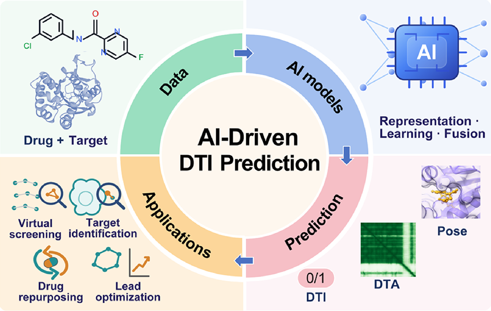
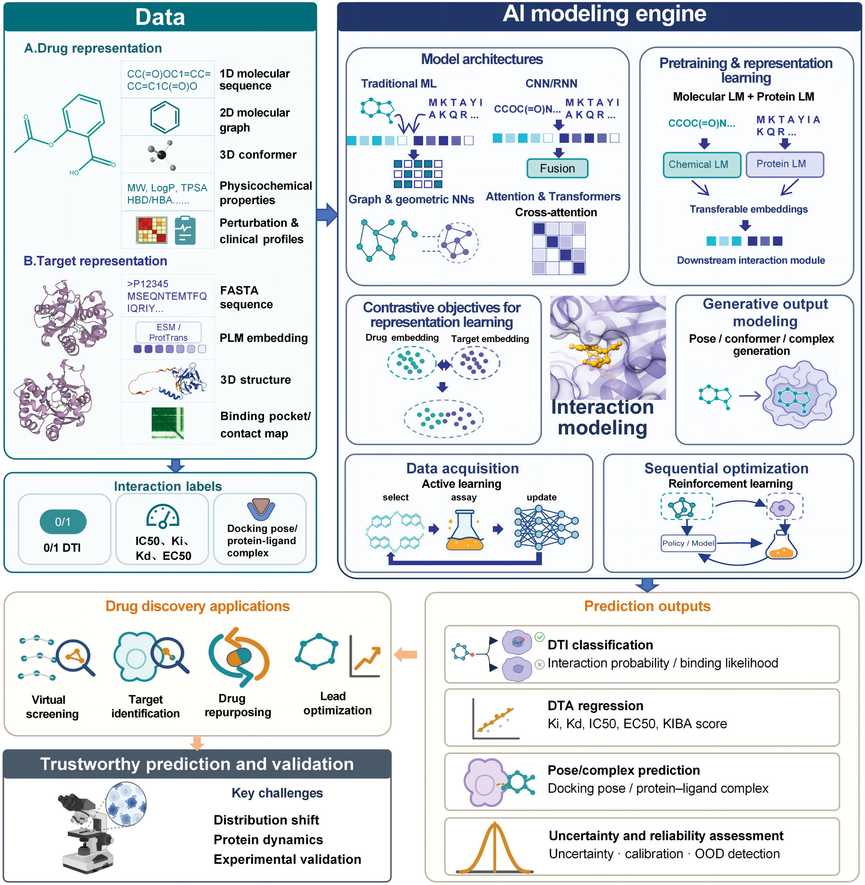
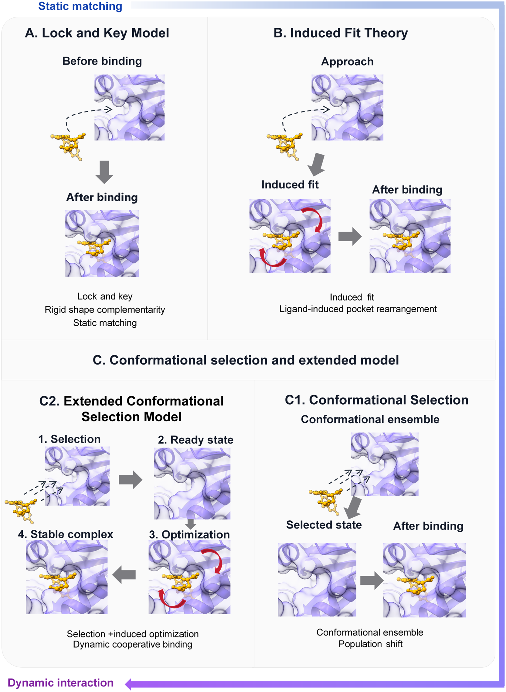
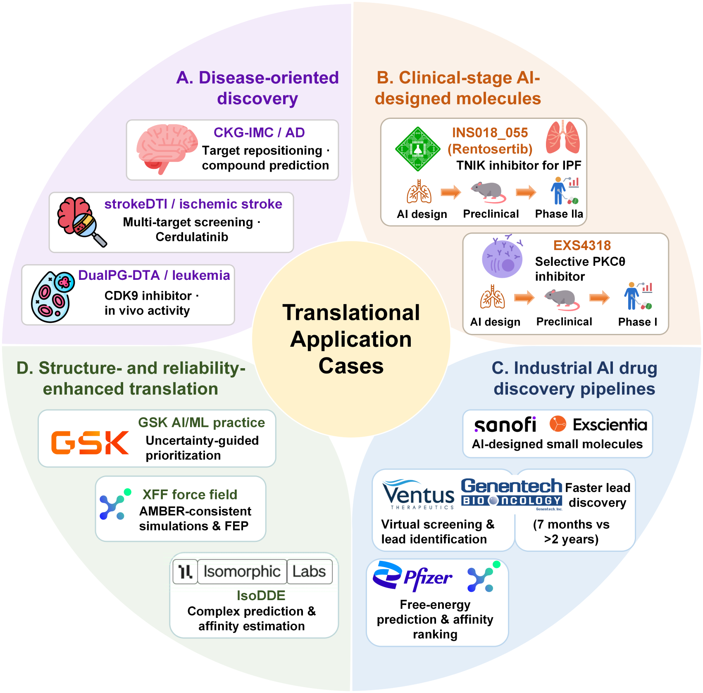

# AI如何预测药物与靶点的相互作用：从结合理论、数据表征到模型设计与落地挑战

## 本文信息

- **标题**：AI驱动的药物—靶点相互作用预测：从数据表征到模型设计
- **作者**：Jiaxuan Hu, Lianlian Wu, Song He, Xiaochen Bo, Jiang Lu（通讯作者Lianlian Wu、Song He、Xiaochen Bo、Jiang Lu，均标注 *）
- **发表期刊**：Journal of Chemical Information and Modeling
- **发表时间**：2026年8月21日
- **DOI**：<https://doi.org/10.1021/acs.jcim.6c01920>
- **单位**：中南林业科技大学（计算机与数学学院，长沙）、西安交通大学（前沿科学技术研究院）、天津大学（医学工程与转化医学研究院）、军事医学研究院（北京），均为中国
- **引用格式**：Hu, J.; Wu, L.; He, S.; Bo, X.; Lu, J. (2026). AI-Driven Drug–Target Interaction Prediction: From Data Representation to Model Design. *Journal of Chemical Information and Modeling*. <https://doi.org/10.1021/acs.jcim.6c01920>
- **检索范围**：Web of Science与Google Scholar，2020年1月至2026年7月（最终检索2026-07-22），辅以2020年前奠基性工作的回溯引用

## 摘要

> 药物—靶点相互作用（DTI）预测是药物发现、靶点识别与老药新用的核心环节。随着生物医学数据快速增长与人工智能（AI）进步，DTI预测已从对接、基于相似性的推断和人工特征，转向**数据驱动的表示学习与相互作用建模**。本综述考察AI驱动的DTI预测方法，覆盖结合理论、任务设定、数据表征、模型设计、转化应用与未解挑战。综述首先介绍经典分子结合理论（锁钥模型、诱导契合、构象选择），强调**从静态匹配到动态相互作用的转变**；其次总结主要DTI任务设定，包括二分类、亲和力回归与带不确定性评估的多任务预测；接着讨论药物、靶点蛋白、相互作用标签与辅助生物医学数据的资源与多模态表征；再将代表性方法沿**5个正交维度**（输入表征、相互作用建模、学习范式、预测输出与泛化设定）进行比较；最后梳理DTI在疾病靶点挖掘、化合物虚拟筛选、亲和力与选择性优化、复合物结构预测及工业药物发现流程中的应用，并指出**数据分布偏移、蛋白动态构象可变性与实验验证不足**等关键挑战。

## 本综述的定位

作者用 **5个正交维度**（表1）把它与近期3篇代表性综述区分开来，目标是让读者既能看清方法分类，也能理解结合理论、任务设定、验证证据与落地场景之间的衔接。

**表1：本综述与近期代表性综述的覆盖范围对比**

| 维度  | Wang et al., 2026 | Liao et al., 2025| Wang et al., 2025| 本综述|
| ------------------ | -------------------------------- | ---------------------------------- | ------------------------ | --------------------------------------------- |
| **方法学组织**| 按相似性、特征、因子分解、网络、序列、结构、预训练模型等类别并列 | 主要按数据类型与AI技术发展脉络组织| 围绕网络药理学、分子建模、关联预测、药物联用展开 | 沿**输入表征、相互作用建模、学习范式、预测输出、泛化设定**等相互关联但不互斥的维度组织 |
| **结合理论与蛋白动态** | 覆盖结构表示与部分动态表示方法| 讨论3D结构与AlphaFold，但未以结合理论作为主分析框架 | 讨论分子对接与分子动力学在DTI预测中的应用 | 把**锁钥模型、诱导契合、构象选择**三种理论与静态、柔性、基于集合的建模方式串联|
| **不确定性、可解释性与机制验证** | 讨论冷启动评估、案例研究与模型可解释性 | 一般性地讨论可解释性与数据相关挑战| 讨论可解释性、作用机制与临床适用性| 把**不确定性、分布外泛化、可解释性**整合，并区分模型解释与实验支持的机制|
| **转化证据** | 聚焦有生物学意义的案例研究与实用模型评估| 讨论AI预测与湿实验药物发现的整合 | 强调药物开发、网络药理学、联合疗法与临床应用| 区分**计算预测、结构支持、实验验证、前瞻性验证与临床证据**|
| **模型选择指引** | 比较表征与模型族，讨论评估指标与冷启动设定  | 按数据类型与AI技术推荐适用方法  | 按药物开发任务呈现算法应用  | 按**输入数据、预测任务、相互作用机制、泛化需求、验证目标**提供任务导向的指引 |

> **这张表的关键信息是：本综述不仅讲“有哪些模型”，更讲“为什么这样建模、怎么验证、能不能落地”**。它把结合理论、数据表征、学习范式、泛化设定和验证证据串成一条可读的分析主线，而不是把方法当成孤立的模块堆砌。

本综述在这5个维度上的具体做法可以概括为：
- **方法学组织**：把方法拆成5个正交维度（输入表征、相互作用建模、学习范式、预测输出、泛化设定），**而非按模型类别并列**。
- **结合理论与蛋白动态**：锁钥→静态匹配、诱导契合→柔性重排、构象选择→基于集合的采样，**作为理解表征与模型假设的透镜**。
- **不确定性、可解释性与机制验证**：三者并置讨论，明确把模型可靠性与实验验证证据纳入统一分析框架。
- **转化证据**：按"纯计算→结构支持→实验验证→前瞻性验证→临床证据"**分五级强度，让证据可信度可辨**。
- **模型选择指引**：按输入数据、预测任务、相互作用机制、泛化需求与验证目标**据此给出任务导向的模型选择建议**。

**图1：AI驱动的药物—靶点相互作用（DTI）预测整体框架**。从药物与靶点的多模态数据输入，经过AI建模得到预测输出，再走向药物发现应用与可信验证。

### 为什么要读这篇综述

药物发现中的关键问题之一，是确认一个分子结合哪个靶点以及结合强度。这关系到靶点发现、老药新用和先导化合物优化。

早期做法依赖经典计算化学：AutoDock Vina、Glide等对接工具在构象空间中搜索结合模式，再以经验打分函数估计结合。**经验打分函数通常将复杂非共价相互作用简化为线性组合**，难以充分刻画蛋白—配体的动态协同性与诱导契合，虚拟筛选中可能产生假阳性；同时，这类方法依赖高分辨率的受体静态结构，构象采样成本较高。在动辄数百亿化合物的虚拟化学空间中，传统物理方法难以同时满足筛选规模、构象采样与预测精度的要求。

后来出现了两条路。一条是基于复杂网络分析的推断（网络邻近、网络扩散、随机游走），通过建模药物靶点、疾病基因之间的生物互作网络，给缺药的罕见病做精准老药新用，不少预测还得到了临床适应症的支撑。另一条是机器学习：传统ML（SVM、XGBoost、随机森林）比网络方法提升了些性能，但依赖人工特征，难以捕捉DTI背后复杂的非线性关系。

> **深度学习的优势在于自动学习多模态表示**。它能够端到端整合药物与靶点的一维序列、二维拓扑图和三维空间结构，用于亲和力定量预测、药理机制区分，以及生物大分子相互作用结构与结合模式预测。

本文指出，既有综述对**结合理论、模型设计假设与验证需求的衔接不足**，而模型架构、预训练、学习目标和数据获取策略也常被误作互不重叠的类别。本文据此提出一套**从结合理论到数据与模型的组织框架**，按输入表征、相互作用建模、学习范式、预测输出与泛化设定重新梳理方法，并强调动态蛋白构象、不确定性、机制验证与转化证据。

## 背景基础：结合理论、任务设定与数据表征

### 基础之一：三种经典结合理论

理解DTI预测，需要先回答分子如何结合这一基本问题。综述梳理了三种经典理论，展示了从静态匹配到动态结合的认识演进。

**图2：药物—靶点结合的经典理论**。(A) 锁钥模型假设配体与预先成型的结合口袋之间刚性形状互补、静态匹配；(B) 诱导契合模型描述配体诱导结合口袋重排后再形成复合物；(C) 构象选择模型，包括 (C1) 配体从预先存在的构象集合中挑选兼容状态引起种群位移，以及 (C2) 扩展构象选择模型——先构象选择、再诱导优化形成稳定复合物。三者共同呈现从静态形状匹配到动态构象选择与诱导优化的演进。

#### 锁钥模型

1894年Emil Fischer提出锁钥模型，这是最早解释配体—受体结合的理论之一。它把受体比作“锁”、药物比作“钥匙”，假设两者在结合前已具备严格的几何与化学特征互补，强调结合过程的**刚性与静态匹配**。

但结构生物学后来发现，酶和受体在配体结合时往往会发生显著的构象变化。锁钥模型解释不了非竞争性抑制这类现象，在描述蛋白与配体柔性上的局限也逐渐暴露。

#### 诱导契合理论

1958年Koshland提出诱导契合理论，以补充锁钥模型的局限。它认为靶点蛋白本身有内在柔性：没有配体时，结合口袋不一定处于完全互补的形状；配体靠近时，可诱导受体发生三维构象变化，例如残基侧链或主链移动，使催化或结合基团处于适宜的空间位置。柔性配体在结合时也可能发生明显几何形变以适配靶点。

> **诱导契合早已写进现代计算药物设计**。经典诱导契合对接（IFD）算法把刚性对接与蛋白结构预测结合起来，允许侧链和主链柔性被更充分地模拟；近年的深度学习也开始整合这一概念，比如ColdstartCPI模型就以诱导契合理论为指导做DTI预测。

#### 构象选择模型

构象选择强调蛋白本身存在一个**预先存在的构象集合**，配体从中选择结合兼容状态并引起种群位移（population shift）。扩展构象选择模型则在初始选择后进一步发生诱导优化，形成稳定复合物。

> **这三种理论对建模的启示很直接**：如果只把蛋白当成单一静态结构，就默认了锁钥式的刚性匹配，会漏掉诱导契合和构象选择里的动态过程。这也是后面讲数据与模型时反复出现的一个主题——**动态构象**是当下方法的短板，也是挑战之一。

### 基础之二：DTI的任务设定

不同任务对应不同的数据标签、模型输出与评估指标。综述把常见任务归纳成四类（加上不确定性设定共五类），并用一张表做了横向对比。

**表2：DTI预测的常见任务建模策略**

| 任务类型| 标签/输出格式 | 代表数据源| 常用评估指标  | 适用场景 | 主要局限  |
| ------------- | -------------------- | ----------------------------- | -------------------------------- | -------------- | -------------------- |
| 二分类DTI预测 | 相互作用/非相互作用，0/1二值标签  | DrugBank、TTD、STITCH、KEGG、DRKG | AUROC、AUPR、Accuracy、F1 | 大规模虚拟筛选；候选靶点初筛 | 负样本构造会显著影响模型表现  |
| 亲和力回归 / DTA| $K_i$、$K_d$、$\mathrm{IC}_{50}$、$\mathrm{EC}_{50}$等连续值 | BindingDB、ChEMBL、Davis、KIBA| MSE、RMSE、MAE、Pearson、Spearman、CI | 先导化合物优化；活性排序| 不同实验体系测得的亲和力不能直接混比|
| 多任务预测 | 相互作用、亲和力、作用机制、构象等多输出 | 复合数据集或自建集成数据集  | 集成多任务指标 | 同时预测结合强度与作用机制  | 任务权重设计会影响模型表现|
| 结合姿态/复合物结构预测  | 三维构象、对接姿态或复合物结构 | PDBbind、BindingMOAD、DUD-E| RMSD、对接成功率、Top-k成功率| 结构辅助药物设计  | 对蛋白柔性与诱导契合的处理仍有限|
| 不确定性/OOD预测 | 预测值 + 置信度或不确定性估计| 跨数据集划分、冷启动划分或自建OOD数据| 校准误差、NLL、OOD表现| 降低湿实验假阳性风险| 置信度不一定代表真实可靠性，仍需实验验证 |

> **任务设定决定模型输出与验证方式**：二分类回答是否相互作用，回归估计结合强度，多任务模型可联合预测结合强度、作用机制或构象；不确定性感知模型则在未见或分布外场景中同时估计预测值与可靠性。回归任务通常直接输出$K_i$、$K_d$、$\mathrm{IC}_{50}$等连续生化测量值。

### 基础之三：多模态数据表征

AI驱动的药物发现里，高质量、大规模的数据输入是模型稳健表现的基石。随着高通量技术和表示学习的发展，现代模型要的不再只是单一原始测量，而是**融合物理先验与数据驱动信息的多维特征系统**。

表征策略大体分两类：**固定表征**（基于专家知识手工构建，如ECFP、MACCS指纹）与**学习表征**（用深度学习从大规模数据自动提取隐式模式，如ChemBERTa、ESM）。综述用一张大表（Table 3）系统列出了药物、靶点、相互作用与辅助数据的资源与表征类型，下面分对象来讲。

**表3（节选）：DTI预测的常用数据资源与表征类型**

| 表征对象 | 数据类别| 代表数据库  | 主要内容|
| ---- | ----------- | ------------------------------------ | --------------------------------- |
| 药物| 结构数据、理化性质| PubChem / PubChem 3D  | SMILES、InChIKey、化学结构、理化参数、3D构象坐标 |
| 药物| 结构/临床属性| DrugCentral、DrugBank  | SMILES、适应症、靶点互作、副作用、ATC分类|
| 药物| 拓扑/亲和力 | ChEMBL、ZINC15/20 | 分子拓扑信息、$\mathrm{IC}_{50}$/$K_i$/$K_d$/$\mathrm{EC}_{50}$等生物活性 |
| 药物| 扰动表型| CMap、LINCS L1000、sci-Plex  | 给药后基因表达变化、药物特征签名|
| 靶点| 序列/结构  | UniProt、RCSB PDB、AlphaFold DB| 氨基酸序列、实验解析结构、预测结构  |
| 相互作用 | 二分类/定量/3D| DrugBank、BindingDB、PDBbind、DUD-E| 有无结合、亲和力、共晶3D坐标  |
| 辅助数据 | 中药/系统药理、RNA | BATMAN-TCM、TCMSP、multiMiR、RNAcentral | 复方—成分—靶点异质网络、miRNA/非编码RNA互作|

#### 药物表征：四个维度

药物相关数据可分成四类：**结构数据**、**理化性质数据**、**扰动表型数据**和**临床属性数据**。

- **结构数据**描述分子的组成、拓扑与空间构象，**是DTI表征中最基础、最不可或缺的维度**。按信息维度可分成三个层次：
  - **一维序列**：PubChem、DrugCentral、DrugBank提供SMILES、InChIKey这类线性序列；固定表征常用RDKit、Mordred提取ECFP、MACCS指纹，**学习表征则靠ChemBERTa、SMILES-BERT直接从序列学表示**。
  - **二维拓扑**：ChEMBL、ZINC提供拓扑信息，固定表征建成分子图、药效团或图论描述符，**学习表征用GCN/GAT、ImageMol直接编码**。
  - **三维构象**：ZINC15、PubChem3D、SuperDRUG2提供坐标与构象，可用RDKit、OpenBabel生成候选构象；固定表征算几何描述符和能量项，**学习表征用MolCLR、SphereNet进一步学到空间特征（位阻、电荷分布、构象约束）**。
- **理化性质数据**不直接描述结构
  - 而是分子量、XlogP、氢键供受体数、拓扑极性表面积、溶解度等参数，来自PubChem、DrugBank、ChEMBL、SwissADME、ChemSpider，或RDKit/Mordred计算。
  - 固定表征里常作显式数值特征直接喂入模型；学习表征里先过MLP或投影层，再**映射到能和序列、图、表型特征联合建模的低维表示**。这些特征维度低、可解释性强，常作为结构表征的补充。
- **扰动表型数据**是药物作用于细胞后诱发的功能响应，以基因表达变化反映作用机制。按观测模态可分成两类：
  - **基因表达谱**：常用CMap、LINCS L1000，以及sci-Plex、Tahoe-100M这类单细胞尺度数据。固定表征处理成差异表达基因集或聚合表达向量；**学习表征用自编码器、Transformer或单细胞基础模型直接学低维表示**。
  - **高内涵细胞影像**：以Cell Painting为代表（公开集JUMP-Cell Painting）。它用多种荧光染料标记细胞核、线粒体、内质网等不同细胞器，再用自动化显微镜拍照，从图像里提取**细胞形态谱**来刻画给药后的表型响应。固定表征先提形态谱，学习表征用CNN、视觉Transformer或多模态模型直接从图学。这类数据不关心药物自身结构，而**强调给药后的细胞响应，常用于作用机制分析、表型补全和老药新用**。
- **临床属性数据**是药物研发和临床使用期积累的信息，DrugBank、DrugCentral、SIDER包含适应症、ATC分类、禁忌、副作用和药品标签。固定表征常组织成one-hot、multi-hot或基于词表的统计特征；学习表征通过知识图谱嵌入、文本编码器或多模态融合模块学更紧凑的语义表示。**它们虽不是分子层面的直接测量，却给模型提供了应用场景和安全相关的上下文线索**。

#### 靶点表征：序列与结构两条线

靶点主要是蛋白，它的表征好坏直接决定模型能否准确刻画相互作用机制。

- **一维氨基酸序列**：UniProt提供海量原始FASTA，是蛋白表征最基本的输入。按表征方式分两条线：
  - **固定表征**：用生信工具手工提取氨基酸组成、理化特征等显式描述符，作为模型输入。
  - **学习表征（蛋白质语言模型）**：通过自监督学习从大规模序列提取长程进化模式与上下文语义，**比手工特征更能编码结构功能先验**。代表方法沿“序列预训练→结构预测”演进：
    - UniRep最早证明**序列预训练能编码结构和功能相关信息**；
    - ProtTrans、ESM-1b把Transformer扩展到大规模蛋白语料；
    - MSA Transformer融入**多序列比对的共进化信号**；
    - ESM-2/ESMFold用单序列PLM即可快速预测结构，**给缺实验结构的靶点提供序列衍生的先验**。
- **三维结构**：RCSB PDB提供高精度的实验解析结构，传统工具靠专家知识算结合口袋体积、疏水性等物理特征作为固定表征；**近来AlphaFold DB提供了覆盖蛋白质组的优质预测结构**，配合端到端AI结构生成工具，让结构感知网络（即学习表征模型）能把大分子3D坐标映射成高维图或体素，**实现结合位点的精准三维对齐**。

> **靶点表征可结合序列与结构信息**：缺少实验结构时，蛋白质语言模型可从序列提供先验；具备可靠结构时，结构感知网络可进一步编码结合位点的空间信息。这构成“序列语义加空间先验”多模态框架的基础。

#### 相互作用数据与辅助数据

- **相互作用数据**按信息量分三类：
  - **二分类数据**：只记录有无结合（1/0）。DrugBank、TTD提供已批准药物的基础互作网络，STITCH、KEGG、DRKG知识图谱整合更广的关联，**可用于训练二分类DTI模型**。
  - **定量亲和力数据**：进一步量化结合强度（$\mathrm{IC}_{50}$、$K_i$、$K_d$、$\mathrm{EC}_{50}$），主要来自ChEMBL、BindingDB和激酶专用的KIBA、Davis，**是训练DTA模型的核心来源**。
  - **3D复合物结构数据**：直接给出蛋白—配体共晶坐标，PDBbind、BindingMOAD配合DUD-E等含诱饵分子的基准集，**为预测结合姿态和训练结构感知3D模型提供结构参照**。
- **辅助数据**随着DTI边界扩展而越来越重要。中药与系统药理里，BATMAN-TCM、TCMSP把复方活性成分和潜在靶点连成大规模异质网络；新兴靶点方向，multiMiR、RNAcentral提供miRNA、非编码RNA的多层互作数据。**它们有效突破了传统蛋白靶点的局限，把DTI的应用边界进一步推开**。

#### 小结：从输入侧到模型侧

前面讨论了DTI预测的输入侧：**结合理论**说明静态蛋白表示的局限；**任务设定**决定模型输出与评估；**多模态数据表征**组织药物、靶点、相互作用与辅助数据的资源和表征策略。

接下来转向模型侧，讨论传统ML、CNN/RNN、图与几何神经网络、注意力与Transformer架构，及预训练、对比学习、生成式建模、主动学习、强化学习等方法在DTI中的作用，并分析不确定性量化、可解释性、转化案例与开放挑战。

## 方法论框架：把模型拆成可组合的组件

综述提出，DTI/DTA模型由多个**功能互补**的组件组成，这些组件并非互斥的方法类别。

- **表征**（representations）定义可用的药物与蛋白信息
- **相互作用模块**（interaction modules）把这些特征整合起来
- **学习范式**（learning paradigms）决定模型怎么训练
- **输出与评估设定**指定任务和泛化要求

因为这些组件可以在同一个模型里共存，综述下面按**主要功能**来组织方法——模型架构及其相互作用机制、预训练框架、学习目标、生成范式、数据获取策略、序列优化——而不是把它们当成互不重叠的方法类别。这个视角是全文的骨架，后面所有方法都能挂到这几根骨头上。

### 模型架构：四条技术路线

#### 传统机器学习模型

深度学习普及前，传统ML是DTI预测的主力。它们把问题形式化成经典的二分类或回归，工作流程高度依赖人工特征工程：先用ECFP、MACCS这类分子指纹和氨基酸组成、CTD描述符这类靶点序列特征，拼接后喂给模型。

- **逻辑回归**常用于基于配体相似性的靶点预测，比如SwissTargetPrediction平台用2D+3D特征构建逻辑回归做靶点匹配；SuperPred 3.0基于Morgan指纹建多类逻辑回归，并引入非结合分子作负样本，**在保持轻量的同时有效降假阳性**。
- **SVM**适合高维稀疏特征和小样本，Yamanishi等人用SVM构建二分图映射核，把DTI预测转成核空间里的距离度量；**但大规模数据下核函数计算复杂度高**。
- **集成学习**（随机森林、XGBoost）靠多棵决策树提升鲁棒性，Chen等人用XGBoost筛选对亲和力预测贡献大的核心分子描述子子集，**提高精度**。

> **传统ML受限于人工特征表示**：它较难充分捕捉DTI背后的复杂非线性关系，因此需要通过深度学习学习更丰富的表示。

#### 基于CNN和RNN的序列与图像模型

CNN和RNN从一维序列或二维栅格里自动提特征，减少对手工特征的依赖。

- **一维序列建模**：
  - 1D-CNN用滑动卷积核从药物SMILES和蛋白序列里提局部特征（化学子结构、二级结构模式）。DeepDTA直接用1D-CNN处理药物与靶点序列，端到端预测亲和力；但CNN偏局部、难抓远距离残基或片段依赖，于是引入RNN及其门控变体（LSTM、BiLSTM）。
  - DeepAffinity把CNN和RNN（Seq2Seq）结合并加注意力定位关键片段；DeepCDA在卷积后加LSTM和双向注意力；FusionDTA用两层BiLSTM加多头线性注意力聚合信息。**这条线体现了早期序列模型从局部卷积到长程上下文建模的演进**。
- **二维栅格图像**：DEEPScreen将药物二维分子图渲染为像素级图像栅格，直接以2D-CNN提取芳香环等化学子结构的空间特征。**这种分子图像表示无需显式三维建模，可用于大规模虚拟筛选**。

#### 图与几何神经网络

分子、生物数据常是不规则的拓扑或几何结构，GNN比序列、规则图像栅格更合适。按输入表征和相互作用机制，可分四类。

- **二维分子图**：原子为节点、化学键为边，是GNN里最常见的输入，**比序列表示更直接地保留局部化学环境与拓扑连接，适合学官能团、芳香环、局部子结构**。代表方法：
  - MGraphDTA用密集连接的多尺度图网络加Grad-AAM，**可做可视解释**；
  - IMAEN用分子增强机制，**解决少邻居节点聚合不足**；
  - CT-GINDTI用图同构网络（GIN）配合循环训练，**缓解正负样本不平衡**；
  - TDGraphDTA、PSF-DTI引入多尺度交互、远邻图与自适应图；
  - MML-DTI用双曲GNN抓药物分子图的层次拓扑，再与指纹和预训练嵌入在欧氏与双曲空间融合；
  - PSICHIC从序列衍生信息构建受物理化学约束的配体/蛋白图，**推断相互作用**。
- **三维几何图**：在二维图基础上引入坐标和构象，刻画空间几何。**这类模型能学到位阻、电荷分布、构象约束等空间特征，是结构感知DTI的关键**。
- **局部结合位点或接触图**：把结合口袋、原子—残基接触建成图，**聚焦真正发生相互作用的局部区域，降低全蛋白噪声**。
- **异质关系网络**：把药物、靶点、疾病、通路等多类实体建成异质图。DTI-HETA在异质图上用GCN+GAT做邻居聚合与注意力；MRHomER把中药—靶点关系建模成多尺度异质图上的归纳预测，**凸显了知识图谱式异质网络在复方、多靶点等复杂DTI场景的扩展价值**。

> **GNN适合编码不规则的拓扑与几何结构**：分子和蛋白口袋都可表示为图，图模型能够保留原子、残基及其连接关系的化学语义。

#### 基于注意力与Transformer的相互作用建模

注意力和Transformer是当下最有代表性的交互建模路线。

- **注意力作为相互作用模块**：给原子、残基、子结构或模态分配不同权重。AttentionSiteDTI把药物和结合口袋表示成关系结构单元，用自注意力定位更可能参与结合的口袋区域；DrugBAN用双线性注意力直接建模药物与靶点的成对局部对应，GraphBAN进一步加入归纳学习**提升对未见药物/靶点的泛化**。
- **跨模态融合**：DACMF-DTI用双重注意力协调不同模态的信息流，HADLGL-DTI用层次注意力连接局部细节与全局上下文，**避免细粒度信号在融合时被淹没**。3DICE用预训练的Uni-Mol和ESM-IF1结构嵌入做双向共注意力，把跨模态交互建模扩展到三维药物与蛋白表示，**并支持原子/残基级归因**。
- **Transformer建模长程依赖**：IGT用专门的分子间注意力显式表示配体—蛋白的跨分子拓扑交互；Interformer把它扩展到三维空间做结合姿态与亲和力预测；AttentionMGT-DTA把图Transformer与多模态注意力结合，MotifGT-DTI进一步引入关键基序与口袋子图**刻画更细的结构模式**。

> **模型解释不等于机制证据**：注意力权重、归因分数、接触图和预测姿态描述的是模型行为，可形成待检验的假设，但不独立证明真实的物理结合机制。

### 预训练与表示学习策略

分子与蛋白质语言模型是**表示学习与预训练框架**，不是独立的相互作用建模架构。它们从大规模无标签序列里学到可迁移的表示，再和任务特定的交互模块结合，用于下游DTI/DTA预测。

- **统一表示空间**：ConPLex用预训练蛋白质语言模型提特征，把药物和靶点直接映射到同一隐空间做基于距离的匹配，**显著提升对未见靶点的适应性**。
- **全局语义 + 局部结构**：LDM-DTI用语言模型提取药物与蛋白的语义特征，再和几何图网络学的空间信息结合；ChemGLaM用化学、蛋白双语言模型，**通过交叉注意力在二者特征间建立局部关联**。
- **序列语义 + 显式空间先验**：随着三维结构预测技术成熟，语言模型表示开始和显式空间先验联合建模。GenSPARC把AlphaFold2预测构象和Foldseek结构字母表融入蛋白编码，再结合化合物语言模型与图表示，**实现序列语义、分子性质和三维结构信息的统一表示**。

### 学习目标：对比学习

多数DTI/DTA模型用和任务对齐的有监督分类或回归目标训练，多任务模型则联合优化多个相关输出。除此之外，对比学习通过定义药物、靶点、药物—靶点表示**之间的正负关系**来组织表示空间，提升一致性和判别性。它本质上**独立于底层编码器**，可以塞进序列模型、GNN、异质网络、Transformer或预训练框架里。

- **图与序列上的对比**：ContraDTI在分子图和蛋白序列上联合优化对比损失，**从无标签数据学更稳的表示**。
- **异质图上的对比**：RSGCL-DTI、SHGCL-DTI分别在多视图、异质图框架内加对比约束，保留药物、靶点和邻居关系的拓扑与语义一致性，**在冷启动或连接稀疏场景下尤其有用**。
- **结构增强的对比**：CompBind通过复合物结构预训练，把一维输入和隐式三维相互作用模式对齐，**用于亲和力预测**。
- **蛋白质组尺度检索**：DrugCLIP把蛋白结合口袋和小分子编码到**共享隐空间**，以对比学习区分强结合与非结合候选，**将药物—靶点预测转化为稠密检索**。该方法可使用脱辅基（apo）结构或AlphaFold2预测结构，并通过GenPack改善口袋识别。研究进行了超过10万亿次打分，覆盖约1万个人类蛋白和5亿化合物，**随后在5HT2AR、NET和TRIP12等靶点上实验验证候选配体**。

### 输出范式与数据获取策略

这几类方法属于输出建模范式或数据获取策略，可与不同编码器组合使用。

#### 生成式建模

判别式模型主要预测相互作用标签或亲和力值；**生成式模型**则直接产出结合姿态、配体构象或蛋白—配体复合物结构。

- Umol只用蛋白序列和配体表示就直接预测复合物结构，**让DTI建模不再完全依赖已知结合态结构**。
- SurfDock把结合姿态预测做成基于扩散的生成过程，**在生成配体构象的同时提升对接与筛选精度**。
- NeuralPLexer除生成复合物外，还建模配体结合诱导的构象变化，**可同时描述是否结合以及结合方式**。

相比只输出概率或亲和力的模型，生成式方法提供了描述结合姿态和构象状态的**结构级输出**。

#### 主动学习

主动学习按不确定性、多样性、利用/探索等准则，迭代挑信息量大的药物—靶点对去标注或实验评估，是一种数据获取策略。

- BE-DTI用主动学习更新训练样本、**缓解DTI分类的类不平衡**；GAL-DTA用不确定性采样获取信息量大的对做亲和力预测；ASCENT把主动采样和迁移学习结合，**用少量目标域样本适配模型**。
- Van Tilborg等人在低数据条件下对给定靶点迭代筛选活性分子，比较基于相似性、利用、探索的获取策略，**表明主动学习能在有限实验预算下更快找到候选hits**。

#### 强化学习

强化学习是序列决策与优化策略，通过状态转移和奖励反馈学策略，在DTI/DTA里应用还相对有限，主要面向冷启动和分布偏移。

- MuRL-DTI把药物与靶点的多模态特征组织成强化学习环境，通过策略探索和奖励反馈，**给缺互作记录的新药/新靶点做知识迁移**。
- MoleProLink-RL把几何最优传输和轻量策略优化结合，**提升在化学类型、蛋白家族或实验条件变化下的预测稳定性**。

### 输出与泛化：怎么选模型

上述组件支持不同的预测输出：二分类、DTA回归、结合位点/原子—残基接触预测、结合姿态或复合物生成、不确定性估计。它们的实用价值要在**与应用意图一致的泛化设定**下评估。

- **划分方式决定难度**：随机划分主要评估在已观测化学/靶点空间内的插值；cold-drug、cold-target、cold-pair、scaffold、跨数据集、时间、分布外(OOD)划分则评估越来越难的泛化。有意义的模型比较应当把输入表征、相互作用机制、学习策略、预测输出**和泛化设定放在一起看**。
- **按数据可用性选模型**：只有序列就用序列编码器或预训练语言模型；要保二维化学拓扑就用分子GNN；有可靠三维结构就用几何/口袋模型；标签少或需跨模态对齐就用对比学习；能迭代获取新标注/实验就用主动学习；**要生成姿态或复合物就得用生成式模型**。

**表4：代表性DTI/DTA方法的正交方法学维度（节选）**

| 方法与代表模型 | 主要方法学角色 | 输入表征 | 相互作用机制 | 预测输出 |
| --- | --- | --- | --- | --- |
| 传统ML：SwissTargetPrediction、SuperPred 3.0、Yamanishi | 预测模型 | 分子指纹、描述符、2D/3D相似性；蛋白序列描述符 | 特征拼接、相似性匹配、核映射或树模型 | DTI分类、靶点预测或亲和力回归 |
| CNN/RNN：DeepDTA、DeepAffinity、DeepCDA、FusionDTA | 模型架构 | 药物SMILES、分子图像、蛋白氨基酸序列 | 卷积提局部、循环建模上下文、可选注意力融合 | DTI分类、DTA回归、靶点筛选 |
| 分子GNN（含3D几何）：MGraphDTA、PSICHIC、KDBNet、PBCNet | 模型架构 | 二维/三维分子图、蛋白序列、口袋图与原子坐标 | 图消息传递、邻居聚合、几何约束聚合 | DTI分类、DTA回归、结合自由能 |
| 注意力/Transformer与语言模型：DrugBAN、ConPLex、ChemGLaM | 模型架构与表示学习 | 序列、分子图、结合口袋、预训练嵌入 | 自注意力、双线性/交叉注意力、隐空间匹配 | DTI/DTA预测、结合姿态预测、未见靶点检索 |
| 异质网络与知识图谱：DTI-HETA、MHADTI、MccDTI | 相互作用建模机制 | 药物与靶点节点、相似性、知识图谱三元组 | 邻域聚合、元路径建模、链接预测 | DTI链接预测、冷启动推断、多组分预测 |
| 对比学习/生成式/主动学习：DrugCLIP、SurfDock、ASCENT | 学习目标与输出范式 | 分子图、口袋、复合物、候选药物—靶点对 | 共享隐空间对齐、扩散生成、采集函数优先排序 | DTI/DTA预测、结合姿态、候选命中识别 |

## 不确定性、可解释性与机制验证

可靠的DTI/DTA预测除准确性外，还需要**明确预测何时可能不可靠**。

### 不确定性量化

预测不确定性分两类：

- **偶然不确定性**（aleatoric）来自实验测量、assay条件或模糊标签固有的不可约变异；
- **认知不确定性**（epistemic）反映训练数据有限、化学/蛋白空间覆盖不全或模型参数不确定，对未见药物、靶点、靶点家族尤其相关，可通过补充代表性数据降低。

还要把不确定性和**校准**（calibration）、**分布外检测**（OOD）区分开：校准看预测概率/区间是否与观测频率一致；OOD检测旨在识别明显偏离训练分布的样本。一个模型在分布内测试集上校准得很好，在化学、靶点家族或assay偏移下仍可能过度自信。

- Rayka和Naghavi系统比较了Deep Ensemble、Monte Carlo Dropout、Laplace近似、Bayes by Backprop、证据神经网络在蛋白—配体亲和力预测上的表现，**发现相对优劣取决于评估准则和测试分布**：Deep Ensemble区间较锐利但可能过度自信，Bayes by Backprop在外部数据集上校准更一致。
- Monte Carlo Dropout被纳入GS-DTI，在非冷启动、药物冷、靶点冷、药物—靶点对冷多种设定下估计认知不确定性；EviDTI用证据学习在单次前向传播里同时给出相互作用概率和不确定性，**计算更高效**。
- **保形预测**（conformal prediction）是另一条路径：它不改动原模型，而是另留一小批样本当"标尺"，量出模型误差的可信范围，给每个预测配上一个**带可信度承诺的区间**（如"有90%把握真值落在此范围内"，且这一保证不依赖数据分布假设）。ENS-Score将蛋白—配体亲和力预测集成与保形校准结合，在CASF-2016上量化置信度；
- **选择性预测**将不确定性估计与决策相连，允许模型拒绝不可靠的预测。TrustDTI结合证据不确定性与选择性头，在跨域和冷启动设定下表明，**排除不确定性最高的预测可提高保留药物—靶点对的性能**。

> **关键结论**：不确定性估计要在真实的化学与靶点分布偏移下评估，而不只是随机划分下。相关指标包括校准误差、负对数似然、区间覆盖与锐利度（回归），以及选择性分类的风险—覆盖关系。

### 可解释性

DTI/DTA的可解释性在不同层次提供互补解释：**注意力可视化**（DrugBAN）高亮药物片段与蛋白区域的模型加权关联；**原子/残基级归因**（3DICE）估计具体原子、官能团、口袋残基的贡献；**接触图预测**（DeepRelations）给出原子—残基相互作用的空间假设；**子结构识别**高亮与亲和力预测相关的官能团或分子基序；**反事实解释**考察对药物或靶点作最小改动是否改变预测结果，从而揭示驱动决策的特征。

但解释可靠性要用保真度、稳定性、化学有效性和与结构知识的一致性来评估；反事实改动应保持化学与生物合理。前面说过，解释刻画的是模型行为、只能形成待检验的假设，这里补上判断标准：**只有当计算解释与实验解析或可靠建模的复合物结构、已知构效关系、结合位点突变或生物物理靶点结合实验一致时，机制层面的置信度才真正提升**。

> **四个维度要分开报**：预测性能、不确定性可靠性、解释稳定性、机制证据，它们是互补而非可以相互替代的。

## 转化应用案例

本文用图3概括了AI驱动DTI/DTA从疾病导向发现到工业药物发现流程的多场景应用。

**图3：AI驱动DTI/DTA预测的代表性转化应用案例**。按落地场景分成四类：
- **(A) 疾病导向发现**：CKG-IMC做阿尔茨海默病的靶点重定位与化合物预测，strokeDTI做缺血性脑卒中的多靶点筛选，DualPG-DTA发现抗白血病CDK9抑制剂；
- **(B) 临床阶段AI设计分子**：INS018_055（rentosertib，特发性肺纤维化的TNIK抑制剂）与EXS4318（选择性PKCθ抑制剂）；
- **(C) 工业AI药物发现流程**：sanofi—Exscientia、Ventus—Genentech、辉瑞的自由能预测与亲和力排序合作；
- **(D) 结构与可靠性增强的转化**：GSK的不确定性引导化合物优先排序、XFF力场、Isomorphic Labs的IsoDDE。

### 疾病导向发现

- **CKG-IMC**：Yuan等人构建协作知识图框架，**成功预测阿尔茨海默病核心靶点的潜在化合物，以及已有药物的新靶点**。
- **strokeDTI**：Peng等人针对缺血性脑卒中多通路串扰，**整合转录组数据筛选到多靶点神经保护候选药Cerdulatinib**。
- **DualPG-DTA**：Chen等人用双大语言模型驱动的图神经网络，**发现具有体内抗白血病活性的新型CDK9抑制剂**。

### 临床阶段AI设计分子

- **INS018_055（rentosertib）**：Insilico Medicine在Pharma.AI平台里用PandaOmics和Chemistry42识别TNIK为特发性肺纤维化相关靶点，并设计优化小分子TNIK抑制剂。临床前显示**对TNIK有纳摩尔级结合与抑制活性**，并剂量依赖性地抑制TGF-β诱导的MRC-5肺成纤维细胞α-SMA表达；**后续随机双盲安慰剂对照IIa期试验已发表（NCT05938920）**。
- **EXS4318**：Exscientia与BMS合作设计的选择性PKCθ抑制剂，**已进入I期临床**，IND赋能研究里显示出强on-target活性、选择性和良好治疗指数。

### 工业药物发现流程

- **Sanofi—Exscientia**：用端到端AI平台开发最多15个小分子候选，**把患者来源样本、靶点选择和候选分子设计整合进统一发现工作流**（肿瘤与免疫方向）。
- **Genentech**：公开材料显示，在一个免疫疾病靶点项目里，**AI帮它在7个月内找到结构不同的小分子替代物，而原先无AI的先导发现花了两年多**。Genentech与Ventus用ReSOLVE平台做多靶点虚拟筛选与先导识别。
- **辉瑞与XtalPi**：扩展合作，用XFEP平台做参数定制和自由能微扰计算，**支撑结合自由能预测、亲和力排序和先导优化**。
- **GSK**：聚焦结合亲和力、靶点选择性、敲低效率等生物分子性质预测，**并探索不确定性引导的模型选择来提升候选优先排序可靠性**。
- **XFF力场**（XtalPi参与共建）：通过AMBER兼容的参化系统、对量子力学能量和构象基准的验证、以及自由能微扰计算，**提升小分子模拟与结合自由能计算性能**。
- **IsoDDE**（Isomorphic Labs）：提出统一的蛋白—配体复合物结构预测、亲和力估计和可成药口袋识别计算系统，**在挑战性蛋白—配体泛化基准上报告了比AlphaFold 3更高的精度**。

## 结论与三大开放挑战

整体看，AI正把DTI预测从依赖人工特征和相似性规则的传统范式，推向更充分利用药物结构、靶点序列和空间构象信息的建模范式。这一转变不仅提升了预测精度，也大幅扩展了模型在复杂药物发现场景里的适用性。以多源数据整合、药物与靶点表示学习、相互作用关系建模和结合模式分析为核心的AI研究框架正在成形，DTI预测已不再局限于基础二分类，而是延伸到困难疾病的靶点筛选、先导发现和整套工业药物发现流程。

> 但当前方法在鲁棒性、可解释性和精确支撑实验决策上仍有局限。**DTI预测仍受三类核心限制约束**：静态结构假设、数据分布偏移和实验验证不足。它们分别影响模型对构象变化的描述、对新化学与靶点空间的泛化，以及预测结果能否转化为可信的机制与候选分子。

### 挑战一：数据偏移下的泛化偏差

DTI数据常集中在少数药物、靶点家族和实验系统里。随机划分下表现好，不等于真能识别真实相互作用——测到新药、新靶点或跨数据集时，模型可能依赖化学相似性、靶点家族分布这类捷径。

- MMDG-DTI用药物与靶点的多模态特征做域泛化，**降低对单一数据域的依赖**。
- TAPB引入干预式去偏，**削弱某些靶点正标签更频繁带来的虚假相关**。
- 冷启动/少样本场景里，BioBridge构建归纳—关联元学习管线处理未见药物—靶点对；Wan等人用任务自适应元学习**让模型更快适配新任务**。

### 挑战二：动态构象造成的预测偏差

生成式结构模型已开始从亲和力打分走向复合物结构和结合姿态预测。但多数DTI任务里，蛋白仍被简化成单一静态结构，**难以捕捉口袋柔性和诱导契合这类变化，影响结合分类和亲和力估计**。Çınaroğlu等人显示结合位点附近的环动力学能影响配体—蛋白结合热力学；DiffBindFR通过柔性蛋白—配体对接引入局部受体柔性，提示未来模型应更好地利用构象集合，而非只依赖单一静态构象。

### 挑战三：计算结果的实验验证

DTI模型能快速筛候选对，但预测分数不一定代表真实结合。数据偏差、结构简化、实验条件差异都可能带来假阳性。

- 计算侧：PIGNet把范德华力、氢键等能量项作为物理先验融入蛋白—配体相互作用预测，**减少纯数据驱动拟合的不稳定**。
- 实验侧：仍要确认候选分子是否真结合靶点。TEMA能在阵列式和原位条件下检测药物—靶点结合，**给DTI预测结果提供更直接的靶点结合验证**。
