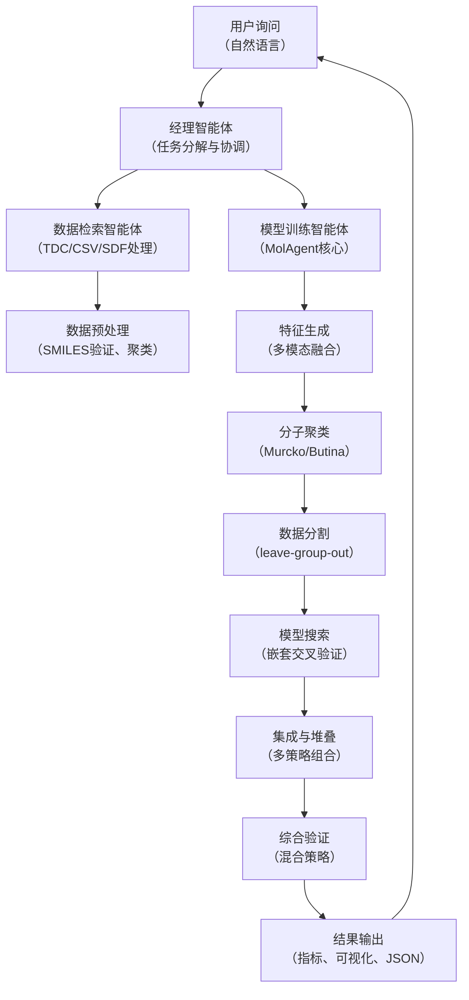

# MolAgent：智能体时代下的自动化分子性质预测系统

## 本文信息
- **标题**: MolAgent：Biomolecular Property Estimation in the Agentic Era
- **作者**: Jose Carlos Gómez-Tamayo, Joris Tavernier, Roy Aerts, Natalia Dyubankova, Dries Van Rompaey, 等
- **发表时间**: 2025年10月16日
- **单位**: Johnson & Johnson（比利时、新泽西州）、Open Analytics、比利时安特卫普大学、美国
- **引用格式**: Gómez-Tamayo, J. C., Tavernier, J., Aerts, R., Dyubankova, N., Van Rompaey, D., Menon, S., Steijaert, M., Wegner, J. K., Ceulemans, H., Tresadern, G., De Winter, H., & Ahmad, M. (2025). MolAgent: Biomolecular property estimation in the agentic era. *Journal of Chemical Information and Modeling*, *65*(10), 10808–10818. https://doi.org/10.1021/acs.jcim.5c01938

参考资源：

- **GitHub仓库**：https://github.com/openanalytics/MolAgent
- **Therapeutics Data Commons**：https://tdcommons.ai/
- **Model Context Protocol文档**：https://docs.anthropic.com/en/docs/agents-and-tools/mcp
- **FLAME框架**（对比参考）：https://github.com/Open-Source-Systems-Lab/flame_public

## 摘要

> Agentic AI系统的出现正在推动科学与技术领域的深刻变革。大语言模型（LLM）、推理能力与外部工具集成的进步，催生了一个全新时代——AI智能体能够**自主执行**传统上由人类完成的计算任务。计算机辅助药物设计（CADD）作为一个包含复杂、相互依赖任务的多面过程，从这些进步中获益最大。然而，**关键挑战在于构建与人类专家开发的模型相当的分子性质估计模型**。MolAgent正是为了解决这一瓶颈而设计的——一个系统无关的agentic AI框架，专注于**端到端自动化分子性质建模**，支持2D/3D结构、传统描述符与深度学习特征的融合，并完全遵循Model Context Protocol（MCP）以实现与多样化agentic基础设施的无缝互操作。

### 核心结论

- **Agentic AI转变**：从被动的单步完成模型演进到具备自主多步规划、环境适应性与多工具协调能力的智能体架构
- **MCP标准化集成**：MolAgent完全遵循Anthropic的Model Context Protocol，使其能够灵活接入各类agentic AI框架，包括Smolagents和其他LLM系统
- **自动化模型构建能力**：框架实现**完全自动化**的特征工程、模型选择、超参数优化与验证，无需人工专家干预
- **多模态特征融合**：整合RDKit描述符、Morgan指纹、深度学习嵌入（BottleneckTransformer）与基于3D结构的特征（AffinityGraph、ProLIF），在ADMET基准上**达到与人类微调模型相当的性能**
- **实证验证**：在TDC基准的23项ADMET任务上，MolAgent在“廉价”计算预算下展现出竞争力表现；在脂溶性（logP）预测中R²达0.89，在binding affinity建模中R²达0.72

---

## 背景

### 大背景：Agentic AI的蓬勃发展

2024-2025年标志着人工智能的**范式转变**。LLM不再是被动的查询-响应工具，而是演变为**具备动态推理、持久内存与函数调用能力的智能体**。Gartner报告预测，到本十年末，数字智能体将**独立管理高达80%的常规服务任务**。

这一转变对科学计算意义重大。最近的工作（van Weesep等，2025）展示了**模块化LLM智能体系统**如何协调化学信息学工具、进行文献驱动推理，并动态选择分子模拟、性质预测与假设生成模块——所有这些**无需人工微观管理**。

### 药物发现中的关键瓶颈

早期药物研发面临复杂、资源密集的挑战：
- **多学科整合困难**：传统管道依赖**分区化专业知识**（结构化学、药物化学、ADMET预测）
- **数据碎片化**：实验数据、文献、公开数据库之间**缺乏无缝协调**
- **人工主导的高成本**：模型开发、特征工程、超参数优化**严重依赖专家人工操作**，周期长、成本高
- **可复现性困难**：QSAR模型性能波动大，往往因**特征选择、模型架构选择的武断性**而难以再现

### 当前的技术瓶颈

尽管LLM在化学领域展现出潜力（ChemLLM在分子命名、分子生成等任务上超越GPT-3.5/GPT-4），**agentic系统在分子性质建模中仍缺乏高保真工具**：

- 现有QSAR框架（FLAME、AutoML解决方案）往往面向**通用ML应用**，不能充分利用分子数据的特殊结构
- **模型质量与自动化程度的权衡**：自动化程度越高，通常意味着性能下降
- **MCP标准缺失**：现有工具与agentic基础设施的**互操作性不足**，难以在复杂multi-agent工作流中无缝使用

MolAgent正是为了**弥合这一鸿沟**而设计的。

## 关键科学问题

### 1. 能否实现“专家级”的自动化QSAR建模？

**问题核心**：自动化系统是否能在**无人工干预**的前提下，构建与人类专家微调模型**相当或更优**的性质预测模型？

这不仅涉及算法的先进性，更涉及对分子数据特殊性的深入理解——例如，化学系列内的相似性、活性悬崖等。

### 2. 如何在多种特征表示间实现高效的融合与选择？

传统QSAR依赖**手工选择**的描述符集；深度学习方法提供自动学习但缺乏解释性。**如何统一这两类信息**？

### 3. 3D结构信息能否显著提升binding affinity预测？

Structure-based descriptors（如蛋白质-配体相互作用）在虚拟筛选中被广泛使用，但**如何系统地整合**到端到端自动模型中？

### 4. Agentic系统中的模型自主选择机制如何工作？

LLM何时、如何决定采用“廉价”vs “昂贵”的计算配置？**自主决策的质量如何保证**？

## 创新点

- **系统级创新**：首个**完全MCP-ready**的分子性质建模框架，设计为agentic AI系统的一流公民
- **特征工程自动化**：集成**五类特征生成器**（RDKit、Morgan指纹、BottleneckTransformer、AffinityGraph、ProLIF），并实现**自适应特征选择**，无需专家指导
- **嵌套交叉验证框架**：采用**leave-group-out策略**，确保模型验证反映真实的**新化学序列泛化能力**，而非仅在相似化合物上的性能
- **3D感知的binding affinity建模**：利用**图神经网络**（GRAPHGPS架构）整合原子与残基级别编码、蛋白质-配体相互作用指纹，在ABL1激酶案例中展示**显著改进**（R²从0.60提升至0.72）

---

## 研究内容

### 核心架构：端到端的agentic工作流



### MolAgent核心组件

#### 1. MCP层（Model Context Protocol集成）

MCP是Anthropic定义的**标准化智能体-工具通信协议**。MolAgent实现Python包装器，使得LLM能够通过简单的JSON RPC调用触发模型训练：

```
LLM → automol_classification_model(data, target, features=“bottleneck", budget=“cheap")
```

这一设计确保了**框架与任意MCP兼容的agentic基础设施的互操作性**——无论是Claude API、Anthropic的agents还是第三方系统（如Hugging Face的Smolagents）。

#### 2. 特征生成（Feature Generation）

MolAgent支持**五大类特征**，形成一个**渐进式丰富**的特征生成管道：

**第一层**：传统描述符（RDKITGenerator）
- 物化学性质：分子量、logP、TPSA、HBA/HBD
- 拓扑描述符：连接性指数（Chi0-Chi4v/n）、Kier形状指数
- 电子性质：部分电荷、Electrotopological State指数
- 官能团计数（75+个）：醛基频率、酯基频率等

**第二层**：指纹（ECFPGenerator）
- Morgan/ECFP指纹（可调半径与位长）
- MACCS keys（166维）
- Topological torsion指纹
- Atom pair指纹

**优势**：快速、可解释、基于化学结构的物理意义

**第三层**：深度学习嵌入（BottleneckTransformer）

加载在ChEMBL上预训练的transformer模型，通过**自注意机制**学习原子间的上下文关系，从“瓶颈层”提取**512维的密集嵌入**。

> 我没查到这个东西？

**优势**：无需再训练，捕捉全局分子特征，通常性能优于传统描述符

**第四、五层：3D结构特征**

**AffinityGraph**：基于GRAPHGPS架构，采用**消息传递神经网络与全局自注意**，处理：
- **原子级编码**：配体原子特征的图表示
- **残基级编码**：蛋白质残基信息的聚合
- **相互作用编码**：配体原子与蛋白质残基间的Prolif相互作用（氢键、π-stacking、疏水作用等）
- **位置编码**：基于随机游走与指数衰减注意（GradFormer思想）

在PDBbind与BindingNet上预训练，**自动捕捉3D识别关键**。

**ProLIF交互指纹**：
- 氢键（供体/受体）、π-stacking、π-cation、离子相互作用、van der Waals接触
- 提供**药效团层面的解释性**，有助于虚拟筛选

#### 3. 数据聚类与分割（Clustering & Data Splitting）

**关键洞察**：分子数据中的**相似性偏差**会导致过度乐观的验证结果。MolAgent实现三种聚类策略：

| 策略 | 原理 | 使用场景 |
|------|------|--------|
| **Murcko Scaffold** | 按Bemis-Murcko支架分组 | 药物化学项目，注重**支架多样性** |
| **Butina** | 基于指纹的层次聚类 | 通用分子池，保留**拓扑相似性** |
| **K-Means++** | 在嵌入空间中聚类 | 深度学习特征，**自适应聚类数** |

**leave-group-out验证**：整个聚类作为一个单元从训练集中移除，评估模型对**新化学序列的真实泛化能力**。

#### 4. 嵌套交叉验证（Nested Cross-Validation）

**外层循环**（k折）：
- 将数据分为k个fold，每个fold依次作为验证集
- 最终性能报告为k个fold的**未偏差估计**

**内层循环**（k折，在每个外层训练fold内）：
- 进行超参数搜索与模型选择
- **防止选择偏差**（避免在验证集上过度优化）

**三种超参数搜索策略**：
- **GridSearch**：穷举预定义的参数网格，适合小参数空间
- **RandomizedSearch**：随机采样，计算效率高，100次迭代
- **HyperoptSearch**（Bayesian优化）：使用Tree-structured Parzen Estimator (TPE)，**高效定位高维参数空间中的有前景区域**

#### 5. 模型集成（Model Stacking & Ensembling）

MolAgent实现**六层级的集成策略**，从简到复：

1. **Inner Methods**：基础模型输出简单平均（回归）或投票（分类）
2. **Inner Stacking**：多个stacking模型（每个外fold一个），输出再次聚合
3. **Single Stack**：单个meta-model在整个外折优化
4. **Top Method**：独立训练基础模型，单个meta-model学习组合权重
5. **Top Stacking**：基础模型在内fold训练，meta-model使用交叉验证输出
6. **Stacking on Stacking**（仅分类）：层级堆叠，形成meta-meta-model

**示例**：假设基础模型为[SVR, LightGBM, LogisticRegression]，meta-model为LightGBM，则最终预测为：
$$\hat{y} = \text{LightGBM}([SVR(\mathbf{X}), LightGBM(\mathbf{X}), LogReg(\mathbf{X})])$$

#### 6. 验证程序（Validation Procedures）

**分层验证**：确保训练集与验证集中**活性类别的比例一致**（对不平衡数据集至关重要）

**混合验证**：同时应用：
- 活性悬崖识别（Activity cliff）
- 基于group的分割
- 分层采样

创造**多维度的挑战**，更**接近真实部署情景**。

### 计算预算与模型配置

MolAgent通过三个**预设计算预算级别**来适应不同场景，每个级别对应不同的特征选择、超参优化策略和模型复杂度：

#### 回归任务（Regression）

| 配置项 | **Cheap**<br/>（快速执行） | **Moderate**<br/>（平衡速度与精度） | **Expensive**<br/>（最高精度） |
|-------|------------------------|---------------------------|----------------------|
| **特征层级** | RDKit + Morgan<br/>（第1-2层） | RDKit + Morgan +<br/>BottleneckTransformer<br/>（第1-3层） | 全部五层特征<br/>（含AffinityGraph、ProLIF） |
| **最终模型** | 单一模型或简单集成 | 单一模型或混合器 | **Stacking回归器** |
| **候选/基础模型** | **候选**：SVR、Lasso、Kernel Ridge<br/>**基础**：SVR、Lasso、PLS、Kernel Ridge | **候选**：SVR、Lasso、KernelRidge、LightGBM<br/>**基础**：SVR、Lasso、PLS、KernelRidge、<br/>SGD、Decision Trees、LightGBM | **基础**：SVR、Lasso、PLS、KernelRidge、SGD、<br/>Decision Trees、4个LightGBM（不同超参）<br/>**Meta-learner**：SVR、Lasso、KernelRidge或LightGBM |
| **超参优化** | GridSearch（穷举） | RandomizedSearch<br/>（100次迭代） | Bayesian优化<br/>（HyperOpt，100次） |
| **集成策略** | 简单平均 (averaging) | 加权集成 (weighted) | Stacking-on-stacking |

#### 分类任务（Classification）

| 配置项 | **Cheap**<br/>（快速执行） | **Moderate**<br/>（平衡速度与精度） | **Expensive**<br/>（最高精度） |
|-------|------------------------|---------------------------|----------------------|
| **特征层级** | RDKit + Morgan | RDKit + Morgan +<br/>BottleneckTransformer | 全部五层特征 |
| **最终模型** | 单一模型或简单集成 | 单一模型或混合器 | **Stacking分类器** |
| **候选/基础模型** | **候选**：Logistic Regression<br/>**基础**：LogReg、SVM、k-NN | **候选**：LogReg或LightGBM<br/>**基础**：LogReg、SVM、k-NN、SGD、LightGBM | **基础**：LogReg、SVM、k-NN、SGD、<br/>Decision Trees、4个LightGBM<br/>**Meta-learner**：LogReg、Lasso、KernelRidge或LightGBM |
| **超参优化** | GridSearch | RandomizedSearch（100次） | Bayesian优化<br/>（HyperOpt，100次） |
| **集成策略** | 投票分类器 (voting) | 加权集成 (weighted) | Stacking-on-stacking |

**术语解释**：

- **单一模型**（Single Model）：从候选模型中选择性能最优的一个模型作为最终预测器
- **简单集成**（Simple Blender）：使用基础模型的简单组合策略
  - 回归任务：对所有基础模型的预测值进行简单平均（averaging）
  - 分类任务：使用投票分类器（voting classifier），按多数投票决定最终类别
- **混合器**（Blender）：更复杂的集成策略，对基础模型的输出进行加权组合（weighted ensemble），权重通过交叉验证优化
- **Stacking**：两层集成架构
  - 第一层：多个基础模型（base estimators）独立训练并产生预测
  - 第二层：元学习器（meta-learner）学习如何最优地组合第一层的预测结果
  - Stacking-on-stacking：在stacking基础上进一步叠加，形成更深的集成层次

**关键设计**：三个预算级别通过**特征深度**（从传统描述符到3D结构特征）、**超参优化策略**（从穷举到贝叶斯）和**集成复杂度**（从简单平均到stacking-on-stacking）形成递进式的性能-成本权衡。

### 相对与绝对建模（Relative vs Absolute Modeling）

对于**数据稀缺**的情景，MolAgent支持**成对delta建模**：

不直接预测绝对性质，而是学习两个化合物间的**相对差异**：
$$\Delta_{\text{delta}} = f(X_i) - f(X_j)$$

**优势**：
- **有效数据点数量翻倍**（N个化合物可产生$N(N-1)/2$个成对比较）
- 尤其适合**lead优化**场景（往往关注相对改进，而非绝对值）

### 研究结果与验证

#### 结果1：ADMET基准性能（Table 1）

在Therapeutics Data Commons的23项ADMET任务上，MolAgent采用**cheap计算预算**（GridSearch超参数优化）评估：

| 任务 | MolAgent | 最佳已发布 | 排名 | 指标 |
|------|----------|----------|------|------|
| Caco2_Wang | 0.303±0.002 | 0.276±0.005 | 6/排行榜 | MAE |
| Lipophilicity_astrazeneca | **0.309±0.001** | **0.467±0.006** | **1/排行榜** | MAE |
| Solubility_aqsoldb | 0.889±0.001 | 0.761±0.024 | 8/排行榜 | MAE |
| herg | 0.624±0.02 | 0.880±0.002 | 17/排行榜 | AUROC |
| ames | 0.793±0.005 | 0.871±0.002 | 13/排行榜 | AUROC |

**关键观察**：
- **脂溶性（logP）预测中排名第一**，且仅用单次自动运行（无多次参数调整）
- 在18/23任务中**进入排行榜前20%**
- **计算成本远低于人类微调**（“廉价”预算 vs 多轮手工优化）

#### 结果2：脂溶性案例（Use Case II）

**用户指令**：*“使用最快的可用模型和bottleneck特征，训练脂溶性回归模型”*

**系统自主决策**（多智能体协调）：
1. 数据检索智能体从TDC获取脂溶性数据集（4,200分子）
2. 计算分子描述符（LogP、TPSA等）
3. **管理员智能体注意到LogP与脂溶性的强正相关**（Pearson r ≈ 0.8）
4. **自主决策**：将RDKit LogP添加为额外特征，尽管用户未明确提及
5. 模型训练智能体构建blender模型（bottleneck + LogP）

**最终性能**：
- R² = 0.8692
- Pearson r = 0.9327
- MAE = 0.3235

**原理**：bottleneck特征捕捉全局分子性质，而LogP提供**显式的关键驱动因子**，两者的组合产生**协同效应**。

> **⚠ 小编锐评**：**脂溶性本身在化学中常用LogP量化**。技术上不算作弊，但确实降低了科学价值：
>
> | 角度            | 评价                                                    |
> | --------------- | ------------------------------------------------------- |
> | 实用性          | ✅ 如果目标是"快速得到好性能"，这完全合理                |
> | 科学性          | ⚠️ 缺乏新洞察：我们早就知道LogP算法与实验LogP高度相关    |
> | 模型泛化        | ⚠️ 对其他ADMET性质（如溶解度、渗透性），这种"捷径"不存在 |
> | Agentic能力展示 | ✅ 证明了LLM能发现特征-目标相关性并自主利用              |


**图1：多智能体框架在脂溶性任务中的工作流程**

原文中的Figure 1展示了以下步骤：
- **用户层**：提出“使用最快的可用模型和bottleneck特征训练脂溶性回归模型”的自然语言指令
- **数据检索智能体**：从Therapeutics Data Commons（TDC）自动定位并获取脂溶性数据集
- **管理员智能体的智能决策**：系统被提示使用bottleneck特征进行快速执行，但框架**自主发现了关键洞察**——RDKit LogP与脂溶性具有显著的正相关性（Pearson相关系数 ≈ 0.8），因此**主动决定将RDKit LogP添加为建模管道中的额外特征**，尽管用户未明确要求
- **模型训练智能体**：基于扩充的特征集（bottleneck + LogP）构建最终的回归模型
- **性能输出**：包含预测与真实值的散点图以及模型性能指标

这个案例充分体现了**agentic系统的自主推理能力**——框架不是被动地执行指令，而是能够**发现数据中的关键相关性并主动整合到建模流程中**。

#### 结果3：ABL1激酶Binding Affinity（Use Case III）

**背景**：ABL1（tyrosine-protein kinase ABL1）是**关键的药物靶点**（例如，伊马替尼靶向ABL1的癌症治疗）。准确的binding affinity预测对lead optimization至关重要。

**数据**：
- 1,078个化合物的3D结构、SDF与PDB文件
- 目标：pKi（结合亲和力）

**系统采用的特征**：
- BottleneckTransformer（2D）
- RDKit描述符
- **AffinityGraph**（3D）：整合原子-配体图、残基-蛋白质图、相互作用编码
- fps_1024_2（另一Morgan指纹变体）

**性能**：
- **R² = 0.72**
- Pearson r = 0.87
- MAE = 0.75 kcal/mol
- **RMSE = 0.91 kcal/mol**

**RMSE解读**：±0.91 kcal/mol的平均误差在药物设计中**可接受**（药物discovery通常目标精度为±1 kcal/mol）。

**关键发现**：AffinityGraph的加入相比仅用2D特征，**R²提升约0.12**，充分展示了**3D信息的显著价值**。


**图2：智能体框架在ABL1激酶binding affinity任务中的工作流程**

原文中的Figure 2概览了框架在binding affinity预测任务中的工作流程：
- **数据获取层**：系统根据用户指令获取ABL1激酶复合物的3D结构数据（SDF与PDB文件），这些数据来自之前发表的研究
- **3D特征感知能力**：框架能够整合和处理结构化学信息，充分利用3D结构数据的优势
- **特征生成管道**：同时提取多类特征——BottleneckTransformer（2D学习）、RDKit描述符、**AffinityGraph**（3D图神经网络）与ProLIF相互作用指纹
- **智能体协调**：各个智能体协同工作，将3D结构信息无缝集成到建模流程中
- **结果输出**：最终的binding affinity预测模型，附带性能指标与可视化

**案例的科学意义**：这个案例演示了**3D结构信息对binding affinity预测的关键作用**，也展示了agentic框架在**处理复杂、多模态数据时的灵活性**——即使仅有2D分子结构，系统也能运行（如脂溶性案例）；一旦有3D结构可用，框架又能自动利用这些信息以大幅提升性能。

---

## Q&A

- **Q1：为什么需要三个不同的计算预算级别？**
- **A1**：反映现实中的**资源约束与精度权衡**。在早期筛选中，速度优先（Cheap预算，数秒内得到结果）；在lead优化中，精度优先（Expensive，可接受数分钟计算）。LLM可根据任务的关键性**自主选择**。
- **Q2：AffinityGraph为何在binding affinity预测中效果显著？**
- **A2**：Binding affinity是**3D特异性**的强函数。AffinityGraph通过图神经网络捕捉：
  1. **原子级细节**：配体原子的类型、形式电荷
  2. **蛋白质环境**：靶点残基的类型、位置、rotamer状态
  3. **相互作用指纹**：特定的氢键、疏水接触等

  这些信息**无法仅从2D分子结构中获得**。
- **Q3：MCP为什么对agentic系统至关重要？**
- **A3**：MCP定义了**标准化的JSON-RPC通信协议**，使得：
  - 任何LLM（Claude、GPT-4、开源模型）都能**无缝调用** MolAgent
  - 不同的agentic框架（Smolagents、LangChain、自定义系统）都能**互操作**
  - 避免**vendor lock-in**，提升系统的**可组合性与可维护性**
- **Q4：Leave-group-out验证相比stratified validation的优势是什么？**
- **A4**：
  - **Stratified validation**：确保类别平衡，但可能让**化学相似的化合物**同时出现在训练与验证集中——导致**过度乐观的性能估计**（这在药物设计中很常见，称为**activity cliff问题**）
  - **Leave-group-out**：整个化学系列（共享支架的化合物组）被保留，**强制模型泛化到新颖的化学空间**——更接近实际应用
- **Q5：为什么要进行嵌套交叉验证而不是简单的CV + 单独测试集？**
- **A5**：
  - **简单CV**：在同一数据上进行模型选择和评估，产生**选择偏差**（选择的模型在特定CV分割上过度优化）
  - **嵌套CV**：内层用于选择，外层用于**无偏评估**，两者解耦，产生**可靠的性能估计**。学术标准实践。

---

## 关键结论与批判性总结

### 潜在影响

- **Agentic drug discovery的可行性验证**：MolAgent证明了**高保真的分子建模可以完全自动化**，为autonomous discovery pipelines铺平道路
- **生成式AI在CADD中的实际应用**：不再是“LLM可以生成分子”的宽泛声明，而是**具体的、可部署的工具**
- **学术-产业交汇**：来自J&J等大制药公司的投入，表明**业界对agentic方法的认真态度**
- **开源生态**：源代码开放（GitHub），降低**采用门槛**，可能激发后续的创新与改进

### 存在的局限性

- **数据集规模与多样性**：TDC基准多为**公开可用的数据**（ChEMBL衍生），未必代表**真实的药物discovery项目**的数据分布（往往涉及专有数据、更复杂的化学空间）
- **模型可解释性**：BottleneckTransformer与AffinityGraph均为**黑箱模型**。虽然ProLIF提供相互作用指纹的解释，但整体模型输出的解释性仍**不如传统QSAR描述符**
- **3D结构依赖**：AffinityGraph需要**高质量的3D复合物结构**（PDB或MD快照）。在高通量筛选或早期发现阶段（仅有2D结构），这一优势**无法充分利用**
- **计算成本**：虽然“廉价”预算已相对便宜，但**Expensive预算**（Bayesian优化+复杂集成）的计算成本**未充分讨论**。对大规模、数百万化合物的虚拟筛选，仍可能**昂贵**
- **agentic决策的可靠性**：MolAgent展示了LLM能**自主添加特征**（脂溶性案例），但**何时这种自主决策会失败**（e.g., 添加无关特征导致过拟合）**尚未系统研究**

### 未来研究方向

- **跨领域迁移学习**：预训练的BottleneckTransformer基于ChEMBL，对**专有化学空间**（例如蛋白降解剂、ADC）的适应性有待探索
- **多任务与多目标建模**：现有框架主要针对**单一性质**。多约束优化（ADMET + 合成可行性 + 知识产权风险）的**agentic协调**仍是开放问题
- **动态特征选择**：目前特征集相对固定。**数据驱动的特征选择**（在模型训练过程中动态移除低信息特征）可能进一步提升效率
- **不确定性量化**：模型输出的**置信度估计**对drug discovery至关重要。集成方法提供某种形式的不确定性，但**贝叶斯方法**可能更鲁棒

> 小编锐评：
> - 工具还是很容易被抢发，“要抓紧时间实施”。
> - 这篇做得比较简单，但还是占坑了。
