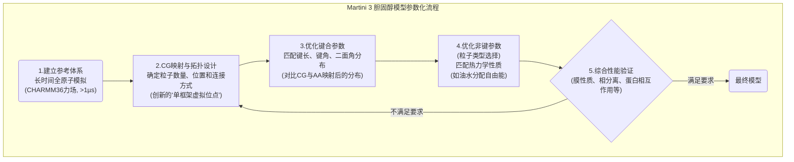

# 重塑细胞膜的关键角色：Martini 3粗粒化力场下的新一代胆固醇模型

## 本文信息

  - **标题**: 用于胆固醇的Martini 3粗粒化力场
  - **作者**: Luís Borges-Araújo, Ana C. Borges-Araújo, Tugba Nur Ozturk, Daniel P. Ramirez-Echemendia, Balázs Fábián, Timothy S. Carpenter, Sebastian Thallmair, Jonathan Barnoud, Helgi I. Ingólsson, Gerhard Hummer, D. Peter Tieleman, Siewert J. Marrink, Paulo C. T. Souza, and Manuel N. Melo
  - **发表时间**: 2023年10月5日
  - **单位**: 里斯本新大学（葡萄牙），里昂大学（法国），劳伦斯利弗莫尔国家实验室（美国），卡尔加里大学（加拿大），马克斯·普朗克生物物理研究所（德国）等多个机构
  - **引用格式**: Borges-Araújo, L., Borges-Araújo, A. C., Ozturk, T. N., Ramirez-Echemendia, D. P., Fábián, B., Carpenter, T. S., Thallmair, S., Barnoud, J., Ingólfsson, H. I., Hummer, G., Tieleman, D. P., Marrink, S. J., Souza, P. C. T., & Melo, M. N. (2023). Martini 3 Coarse-Grained Force Field for Cholesterol. *Journal of Chemical Theory and Computation*, *19*(21), 7387–7404. [https://doi.org/10.1021/acs.jctc.3c00547](https://doi.org/10.1021/acs.jctc.3c00547)

## 摘要

> 胆固醇通过调节脂质双层的流动性、刚性、通透性和组织结构，在生物膜中扮演着至关重要的角色。最新版本的Martini模型，即Martini 3，在相互作用平衡、分子堆积以及引入新型粒子类型和尺寸方面取得了显著改进。然而，新模型的发布也带来了对许多核心分子（包括胆固醇）进行重新参数化的需求。本文中，我们描述了**一个Martini 3胆固醇模型的开发和验证过程**，解决了与其键合设置、形状、体积和疏水性相关的问题。我们提出的新模型**缓解了其Martini 2前身的一些局限性**，同时保持或改善了其整体行为。

### 核心结论

  - **成功开发并验证了一款新的Martini 3胆固醇粗粒化模型**。该模型在形状、疏水性和动力学稳定性方面均有显著提升。

  - **通过创新的“单框架虚拟位点”拓扑结构，彻底解决了Martini 2模型中存在的、由LINCS约束算法导致的“人工温度梯度”artifact**。

  - **新模型更准确地再现了胆固醇的物理化学性质**。它修正了旧模型过于“粘稠”（过度亲脂）的问题，其形状也更逼真，从而在模拟中实现了更准确的分子堆积。

  - **新模型在多种复杂生物场景中表现优异**。它能正确再现胆固醇对膜的“增稠”和“致密”效应、在三元脂质体系中诱导相分离，并能准确识别其在多个重要膜蛋白上的结合位点。

## 背景

胆固醇是动物细胞膜中不可或缺的“万能调解员”。它像楔子一样插入磷脂分子之间，灵巧地调节着细胞膜的流动性、刚性和通透性。同时，它还是形成“脂筏”——一种富含特定脂质和蛋白质的微观区域——的关键驱动力，深刻影响着细胞信号转导等多种生命过程。此外，胆固醇还能直接与膜蛋白相互作用，调控其功能，并且是合成类固醇激素的前体。近年来，随着mRNA疫苗等基因疗法的发展，胆固醇作为脂质纳米颗粒递送系统的关键组分，其重要性愈发凸显。

为了在原子尺度下理解这些复杂的生物物理过程，分子动力学 (MD) 模拟已成为不可或缺的研究工具。然而，全原子模拟的计算成本极高，难以企及细胞膜重塑、相分离等发生在大尺度（微米级）和长时程（毫秒级）上的现象。为此，**粗粒化 (Coarse-Grained, CG)** 模型应运而生。其中，**Martini力场**将约4个重原子简化为一个CG粒子（bead），极大地提升了模拟效率，已成为生物膜模拟领域最流行的CG力场之一。

然而，广泛使用的Martini 2版本存在一些固有缺陷。特别是对于蛋白质和胆固醇这类环状刚性分子，模型会表现出**过度的疏水性和自相互作用**，即过于“粘稠”。此外，Martini 2的胆固醇模型在使用GROMACS中的LINCS约束算法时，会产生**人工的温度梯度**，即不同分子（如胆固醇和磷脂）在模拟中会表现出不同的温度，这是一个严重的物理artifact。2021年发布的全新**Martini 3**框架通过引入更多样的粒子类型和尺寸，并优化相互作用平衡，系统性地解决了这些问题。但这也意味着，包括胆固醇在内的几乎所有分子都需要重新进行参数化。

## 关键科学问题

本研究的核心科学问题是：**如何构建一个全新的、与Martini 3框架兼容的胆固醇粗粒化模型，该模型不仅能解决Martini 2版本中存在的数值不稳定（温度artifact）和物理不准确（过度疏水）等关键问题，还能在更广泛的生物物理场景中准确地再现胆固醇的结构、热力学和动力学行为**？

具体来说，研究团队需要攻克以下几个技术难点：

1.  **拓扑结构设计**：如何设计一个既能精确描述胆固醇刚性环状结构，又能在数值上保持稳定、与常用约束算法（如LINCS和CCMA）良好兼容的键合网络？
2.  **化学性质校准**：如何通过精细地选择CG粒子类型，来修正胆固醇的疏水性，使其在水/油两相中的分配行为与实验值相符？
3.  **形状与堆积**：如何让简化的CG模型能够再现胆固醇独特的、带有“粗糙”面（有甲基伸出）和“光滑”面的三维形状，从而实现其在脂质膜中正确的堆积和组织行为？
4.  **综合性能验证**：新模型能否在多种复杂的膜环境中（不同饱和度的脂质、三元混合物相分离、与蛋白质相互作用等）都表现出优于或至少不逊于旧模型的性能？

## 创新点

  - **创新的单框架虚拟位点拓扑**：设计了一种新颖的“单框架虚拟位点 (single-frame virtual site)”拓扑结构。这一设计巧妙地解决了Martini 2模型中因“双框架”结构与LINCS约束算法不兼容而产生的人工温度梯度artifact，同时保证了模型在长时程模拟中的稳定性。

  - **更逼真的分子形状与化学性质**：通过引入新的“微小 (tiny)”尺寸粒子来显式地表示胆固醇环上的两个轴向甲基，并精心组合不同类型的CG粒子，新模型在三维形状（如溶剂可及表面积）和疏水性（如油水分配自由能）上都**更接近全原子参考和实验值**。

  - **跨平台兼容性**：新的拓扑结构不仅解决了GROMACS中的LINCS问题，还**天然兼容OpenMM模拟引擎中的CCMA约束算法**，而后者无法稳定模拟Martini 2的胆固醇模型。这极大地增强了新模型在不同计算化学社区中的通用性。

  - **全面而严苛的验证**：新模型经历了一场“全能大考”，系统性地验证了其在再现胆固醇诱导的膜增厚、面积压缩、脂质排序、在复杂三元体系中的相分离行为，以及与三种不同类型膜蛋白（GPCRs和离子通道）的相互作用等多种关键生物物理现象中的表现，证明了其广泛的适用性和可靠性。

-----

## 研究内容

### 核心方法论：构建新一代Martini 3胆固醇模型

构建一个优秀的粗粒化模型，如同创作一幅神似的写意画，既要抓住精髓，又要舍弃繁琐。作者采用了一套自下而上、反复迭代的参数化流程，每一步都以高精度的全原子模拟数据为“金标准”。

#### 1. 模拟设置与分析工具

  - **参考标准**：所有粗粒化模型的开发都以**CHARMM36全原子 (AA) 力场**的模拟结果为基准。AA模拟的时长至少为1微秒，以确保充分的采样。
  - **粗粒化模拟**：CG模拟使用**GROMACS**或**OpenMM**进行，时长通常在10微秒以上，以检验模型的长期稳定性和物理行为。
  - **分析软件**：整个流程广泛使用了多种Python科学计算库，如`MDAnalysis`用于轨迹分析，`Voro++`用于计算单位脂质面积，`pymbar`用于自由能计算，`LiPyphilic`和`PyLipID`分别用于分析胆固醇翻转和停留时间。

#### 2. 更逼真的映射与形状

**图1：Martini 3胆固醇模型的参数化。(a) 化学结构与粗粒化映射。(b) 新模型的Connolly表面与全原子参考对比。(c) Martini 2（双框架）与Martini 3（单框架）虚拟位点拓扑示意图。(d) 溶剂可及表面积(SASA)对比。(e) 均方根偏差(RMSD)对比。(f, g) 辛醇/水和十六烷/水分配自由能对比。**

  - **映射方案**：新模型将胆固醇分子简化为9个CG粒子。例如，根据附录中的Table S4，代表柔性尾链末端的`C2`粒子，实际上对应着全原子模型中的C23, C24, C25, C26, C27共5个碳原子。
  - **形状优化**：为了更准确地描述胆固醇独特的、带有“粗糙”面（有甲基伸出）和“光滑”面的三维形状，作者创新地使用了两个\*\*“微小 (tiny)”\*\*尺寸的粒子 (R5, R6) 来显式地表示从甾环平面伸出的两个轴向甲基。这使得新模型的溶剂可及表面积 (SASA) 和整体形状都与全原子参考更为接近。

#### 3. 解决数值稳定性的“单框架”拓扑

  - **Martini 2的问题**：旧模型使用“**双框架虚拟位点**”拓扑来维持刚性。它由两个共享一条边的三角形约束框架构成，像一个可以折叠的铰链。这种设计在GROMACS的LINCS约束算法下容易出现收敛问题，导致能量无法在分子内正确传递，从而产生胆固醇分子“过冷”的人工温度梯度artifact。

  - **Martini 3的解决方案**：新模型采用更简洁的“**单框架虚拟位点**”拓扑。它仅使用R1, R2, C1三个粒子构成一个**单一的刚性三角形约束框架**，其余的甾环粒子（R3, R4, R5, R6）则作为无质量的虚拟位点，其位置由这个框架的三个顶点唯一几何确定。为了保持质心不变，这些虚拟位点的质量被重新分配到了三个框架粒子上。

    **图S2：Martini 3胆固醇模型的温度差异。** 附录中的这张图是关键证据，它显示了在一个包含DLIPC、DPPC和胆固醇的混合体系中，使用新模型模拟时，三种分子的平均温度（柱状图a）和瞬时温度（曲线图b）都稳定在设定的300K附近，**完全消除了Martini 2模型中存在的温度梯度artifact**。

#### 4. 更平衡的化学性质

  - **修正过度疏水性**：Martini 2胆固醇模型过于“粘稠”，其油水分配自由能远高于实验值。Martini 3模型通过精心组合不同化学性质的粒子类型来解决此问题：
      - 甾环核心 (R2, R3, R4) 使用**SC3**类型粒子，这类粒子被设计用于环烷烃，疏水性适中。
      - 伸出的甲基和烷基尾链 (R5, R6, C1, C2) 使用**TC2**和**C2**类型粒子，它们被设计用于支链烷烃，与饱和脂质尾链（C1类型）有良好的相互作用。
  - **验证结果**：通过自由能微扰方法计算，新模型的辛醇/水和十六烷/水分配自由能与实验或理论参考值的吻合度都得到了显著提升。

### 结果与分析：新模型的全面性能验证

新模型在一系列严苛的测试中展现了其优越的性能，证明了其在多种生物物理场景下的可靠性。

#### 1. 在脂质膜中的基本行为

**图2：胆固醇在不同脂质双层中的插入行为。(a) 胆固醇羟基(ROH)的密度分布图。(b) 胆固醇在不同饱和度脂质膜中的跨膜翻转（flip-flop）速率。**

  - **正确的膜内定位与翻转**：在饱和脂质膜（如DPPC）中，新模型能像真实胆固醇一样，以经典的“直立”姿态插入膜中，羟基锚定在磷酸头基区域。随着膜不饱和度的增加，模型也开始出现少量平行于膜中心排列的非标准构象，并表现出翻转速率随不饱和度增加而加快的趋势，这与实验观察和物理预期一致。

#### 2. 对膜物理性质的调控作用

**图4：胆固醇对DPPC和POPC双层膜的影响。(a, d) 膜厚度变化。(b, e) 单位脂质面积(APL)变化。(c, f) 脂质尾链平均有序度(S-order)变化。**

  - **经典的“增稠”与“致密”效应**：与实验和全原子模拟一致，随着胆固醇浓度的增加，新模型能够正确地使DPPC（饱和）和POPC（不饱和）膜**增厚**，同时**压缩脂质分子，使其平均占据的面积(APL)减小**。
  - **强大的“排序”能力**：胆固醇的加入显著增加了脂质尾链的有序度（S-order），即让原本杂乱的尾链变得更加挺直有序。S-order的计算公式为：
    $$
    S = \frac{1}{2}(3\langle(\cos\theta)^2\rangle - 1)
    $$
    其中θ是CG粒子对之间的连线与膜法线（z轴）的夹角。新模型能很好地再现这一排序效应。
  - **跨平台一致性**：附录中的**图S8**显示，使用GROMACS和OpenMM两种不同的模拟软件，新模型在预测膜厚度、APL和有序度等性质时，**给出了几乎完全一致的结果**，这强有力地证明了新模型的跨平台兼容性和稳健性。

#### 3. 诱导相分离的能力

**图5：胆固醇对三元脂质体系相分离的影响。** 比较了Martini 2 (a-d) 和Martini 3 (e-h) 模型在不同温度下诱导相分离的能力。(i, j) 定量分析了DPPC-DPPC和CHOL-DPPC的接触分数，分数越高表示分离越明显。

  - **再现液有序相**：在由饱和脂质(DPPC)、不饱和脂质(DLIPC)和胆固醇构成的三元体系中，新模型成功地再现了**相分离**现象：胆固醇倾向于与DPPC聚集，形成致密的**液有序(Lo)相**，而DLIPC则形成**液无序(Ld)相**。
  - **优于旧模型**：定量分析显示，在不依赖温度artifact的情况下，新模型诱导相分离的能力与Martini 2相当甚至略有改善。虽然对于更难分离的DPPC/DOPC/CHOL体系，新旧模型都表现不佳（这被归因于脂质模型本身的问题），但新模型至少为研究复杂的细胞膜组织行为提供了一个更可靠的出发点。

#### 4. 与膜蛋白的相互作用

研究者进一步测试了新模型与三种重要的膜蛋白（β2肾上腺素受体、SMO受体和VDAC1离子通道）的相互作用。

**图6：胆固醇与β2AR的识别和结合。** (a) 胆固醇的占据密度图。(b) 蛋白表面按胆固醇停留时间着色。(c) 实验晶体结构中发现的胆固醇。(d) 模拟快照显示胆固醇结合在已知位点。

**图7：胆固醇与SMO的识别和结合。**

  - **精准识别结合位点**：在长时间的模拟中，新模型能够**准确地识别并稳定结合**到这些蛋白上已知的、由实验（如X射线晶体学）或全原子模拟确定的胆固醇结合位点上。
  - **更真实的动力学**：相比Martini 2模型由于过度粘稠而导致的微秒级停留时间，新模型的胆固醇与蛋白的相互作用更加**动态**，停留时间在纳秒级，虽然可能略有低估，但通过快速的交换，依然能维持在高占据率的结合位点上。这为研究胆固醇对膜蛋白功能的动态调控提供了更真实的视角。

-----

## Q\&A

  - **Q1**: Martini 2的胆固醇模型有什么具体问题？Martini 3是如何从根本上解决的？

  - **A1**: Martini 2模型主要有两个核心问题：

      - **1. 数值不稳定性（温度artifact）**：它采用的“双框架虚拟位点”拓扑结构，在GROMACS的LINCS约束算法下容易出现收敛失败。这导致动能无法在分子内部正确分配，使得胆固醇分子自身的温度会显著低于体系的设定温度，这是一个严重的物理artifact，会影响相分离等性质。Martini 3通过设计更简洁、更稳固的\*\*“单框架虚拟位点”拓扑\*\*，从根本上解决了这个问题。
      - **2. 物理不准确性（过度疏水）**：Martini 2的粒子类型和相互作用定义使得胆固醇分子过于“粘稠”，即它与疏水环境（如脂质尾链）的相互作用过强，而与水相的排斥也过强。这导致其油水分配自由能与实验值偏差很大。Martini 3通过引入**更多样化的粒子类型**（如SC3, TC2, C2）并重新优化它们的组合，更精细地刻画了胆固醇不同部分的化学性质，使其整体疏水性回归到更合理的水平。

  - **Q2**: 什么是“虚拟位点 (Virtual Site)”，为什么在胆固醇这类刚性分子的粗粒化模型中要使用它？

  - **A2**: “虚拟位点”是一个在模拟中没有质量的粒子，它的坐标不是通过积分运动方程得到的，而是根据体系中其他“真实”粒子的位置**实时计算**出来的。在粗粒化胆固醇模型中使用虚拟位点主要有两个目的：

      - **1. 维持刚性结构**：胆固醇的甾环是一个非常刚性的结构。如果用大量的键和角来维持这个形状，会导致模型中出现高频振动，迫使模拟使用很小的时间步长，从而失去粗粒化的速度优势。通过定义一个由少数真实粒子构成的刚性框架（如“单框架”中的三角形），然后将其他粒子定义为基于这个框架计算出的虚拟位点，就可以在保持整体刚性的同时，避免引入过多的键合相互作用。
      - **2. 提高数值稳定性**：如前所述，一个设计良好的虚拟位点拓扑结构可以避免与约束算法的冲突，提高模拟的稳定性和准确性。

  - **Q3**: 新模型在膜相分离的模拟中表现如何？有什么改进和仍然存在的挑战？

  - **A3**: 新模型在相分离方面的表现可以说是**有显著进步，但仍有提升空间**。

      - **进步之处**：它成功地再现了DPPC/DLIPC/CHOL三元体系的相分离。更重要的是，它是在**没有温度artifact**的情况下实现这一点的。而Martini 2模型之所以能看到相分离，部分原因是由于胆固醇“过冷”这一artifact增强了其与DPPC的聚集。因此，Martini 3的成功是基于更正确的物理基础。
      - **挑战之处**：对于更难分离的DPPC/DOPC/CHOL体系，新模型未能观察到预期的相分离。但作者指出，这很可能不是胆固醇模型本身的问题，而是因为当前Martini 3的DPPC/DOPC脂质对模型本身就难以相分离。这说明，一个体系的准确模拟依赖于力场中所有组分的共同努力，对胆固醇的改进还需要未来对脂质模型的进一步优化来相辅相成。

  - **Q4**: 论文提到新模型在OpenMM中也能稳定运行，这有什么重要意义？

  - **A4**: 这一点具有非常重要的实践意义。不同的MD模拟引擎使用不同的算法来处理键合约束。例如，GROMACS主要使用LINCS算法，而OpenMM则常用CCMA算法。Martini 2胆固醇模型的“双框架”拓扑与CCMA算法不兼容，导致其在OpenMM中无法稳定运行。而Martini 3胆固醇模型采用的“单框架”设计，既解决了GROMACS中的LINCS问题，又天然兼容OpenMM的CCMA算法，如附录图S8所示，两种软件给出的结果几乎完全一致。这**极大地增强了模型的可用性和在不同科研社区间的通用性**。

-----

## 关键结论与批判性总结

### 潜在影响

  - **提升模拟可靠性**：通过解决关键的技术artifact并提高物理准确性，这款新的Martini 3胆固醇模型为整个生物膜模拟领域提供了一个更可靠、更稳健的基础工具，将提升大量依赖于该模型的下游研究（如脂筏、病毒包膜、脂质纳米颗粒等）的质量。
  - **促进多平台协作**：解决了跨主流MD引擎的兼容性问题，有助于统一不同实验室和研究社区的模拟标准，促进结果的可重复性和比较。
  - **加速药物研发**：一个更准确的胆固醇模型对于模拟其与GPCRs等药物靶点的相互作用至关重要，有助于更精确地理解药物的变构调节机制和设计靶向特定脂质环境的药物。

### 研究局限性

  - **部分性质仍有偏差**：尽管取得了巨大进步，新模型在某些定量性质上仍非完美。例如，它仍然略微低估了胆固醇对膜的增厚效应，并且在高度不饱和的膜中，其跨膜翻转速率可能被高估。
  - **依赖于其他模型**：胆固醇在膜中的行为（如相分离）强烈依赖于与之相互作用的脂质模型。当前模型在某些三元体系中的表现不佳，凸显了其性能受限于整个Martini 3脂质力场的整体发展水平。
  - **动力学校准的挑战**：粗粒化模型由于表面光滑，动力学过程通常会比全原子模拟快4倍左右。虽然这是一个已知的特征，但对于需要精确动力学信息的场景（如计算解离速率），仍需谨慎使用或进行额外校准。

### 未来方向

  - **力场的协同进化**：未来的工作将集中于对Martini 3的磷脂模型进行迭代改进，以解决与胆固醇相互作用时表现出的剩余偏差（如相分离问题），实现整个脂质力场的协同优化。
  - **拓展到其他甾醇**：利用本次参数化建立的成功经验和拓扑设计，可以将其推广到其他重要的甾醇分子，如植物甾醇、麦角固醇（真菌）和hopanoids（细菌），构建一个完整的Martini 3甾醇家族。
  - **更复杂的应用验证**：将新模型应用于更具挑战性的生物系统中，例如模拟真实细胞器（如内质网）膜的复杂脂质组成、病毒与宿主细胞膜的融合过程，或包含多种膜蛋白和脂筏的拥挤细胞膜环境。