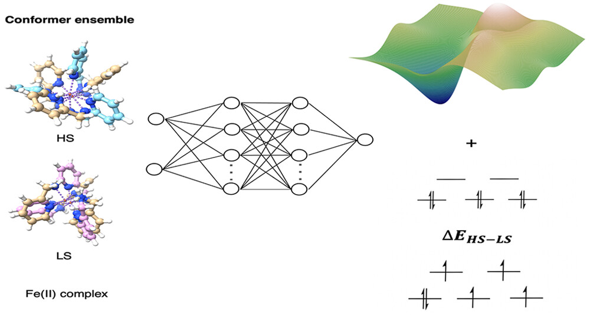
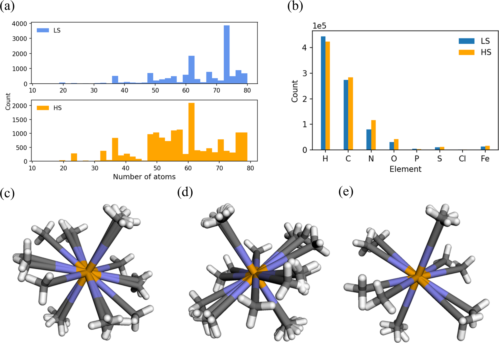
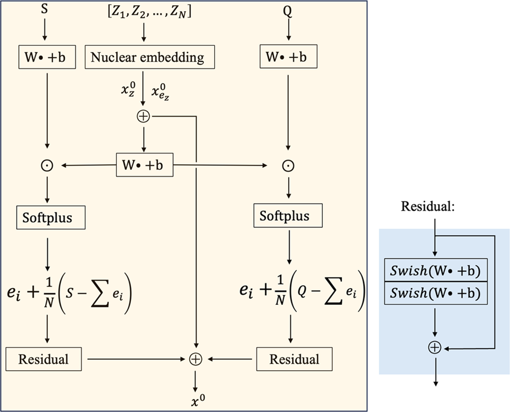

# 神经网络实现Fe(II)复合物高精度建模：缩放电子embedding方法预测自旋态和分裂能

## 本文信息

- **标题**：Modeling Fe(II) Complexes Using Neural Networks
- **作者**：Hongni Jin, Kenneth M. Merz Jr.
- **发表期刊**：*Journal of Chemical Theory and Computation*
- **发表时间**：2024年3月5日
- **DOI**：https://doi.org/10.1021/acs.jctc.4c00063
- **单位**：Michigan State University, Department of Chemistry; Department of Biochemistry and Molecular Biology, USA（美国密歇根州立大学化学系；生物化学与分子生物学系）
- **代码与数据**：https://github.com/Neon8988/Iron_NNPs
- **引用格式**：Jin, H.; Merz, K. M., Jr. (2024). Modeling Fe(II) Complexes Using Neural Networks. *J. Chem. Theory Comput.*, 20(7), 2551-2558. https://doi.org/10.1021/acs.jctc.4c00063

## 摘要

> 本研究报道了一个包含超过**23000个构象**的Fe(II)数据集，涵盖**低自旋**和**高自旋**两种自旋态。该数据集用于开发神经网络模型，能够预测Fe(II)有机金属复合物的**能量**和**自旋态分裂**随构象的变化。为实现这一目标，研究者提出了一种**缩放电子embedding（scaled electron embedding）**方法，在描述Fe(II)复合物的神经网络中**隐式覆盖长程相互作用**。对于总能量预测，最低MAE达到**0.037 eV**；而分裂能预测的最低MAE为**0.030 eV**。与仅包含短程相互作用的基线模型相比，缩放电子embedding将总能量和分裂能预测的准确度提高了**70**%以上。相较于半经验方法，本研究提出的模型在自旋态和分裂能预测上具有显著优势。

### 核心结论

- **大规模数据集**：构建了超过23000个Fe(II)复合物构象的数据集，涵盖低自旋和高自旋两种状态
- **缩放电子embedding**：提出创新算法，通过局部预分布与门控预测，隐式处理长程相互作用，显著提升模型精度
- **预测精度提升**：总能量预测MAE仅0.037 eV，自旋分裂预测MAE仅0.030 eV
- **相比基线提升**：准确度比短程模型提高70%以上，在自旋态判断上明显优于半经验方法

- 摘要图展示了本研究提出的缩放电子embedding方法的核心思想：通过原子embedding向量和电荷/自旋信息编码来隐式捕捉长程电子相互作用
- 左侧显示了典型的Fe(II)八面体复合物结构，中心为Fe原子，周围为配体；右侧展示了神经网络架构流程

## 背景

### Fe(II)复合物的自旋交叉现象

过渡金属复合物因其独特的电子性质在材料科学和生物无机化学中占据重要地位。$\ce{Fe(II)}$离子具有$\mathrm{3d}^6$电子构型，在八面体配位场中可以存在两种自旋态：**低自旋态**（$\mathrm{t_{2g}^6 e_g^0}$，$S=0$）和**高自旋态**（$\mathrm{t_{2g}^4 e_g^2}$，$S=2$）。两种自旋态之间的能量差通常在**10 kcal/mol**以内，这意味着外部刺激（如温度、压力、光照）可以诱导自旋态转换，这种现象称为**自旋交叉**（spi）。

自旋交叉复合物在**传感器、记忆存储、分子开关、显示器件**等领域具有广阔应用前景。然而，准确的量子化学建模面临巨大挑战：高精度方法如CASPT2和MRCISD+Q虽然可靠，但计算成本过高，只能应用于小体系；密度泛函理论（DFT）虽然计算效率较高，但对交换-相关泛函的选择高度敏感——**局部泛函倾向于低估低自旋态能量，而混合泛函则常常过度稳定高自旋态**。

### 几何构象对自旋态的影响

现有研究的一个重大局限是：大多数工作只考虑**单一几何构型**下各自旋态的能量。然而，Fe(II)复合物的配体取向可以显著影响自旋态相对稳定性。不同配体构象可能导致金属-配体键长、键角的变化，进而改变配体场强度和自旋态能级顺序。这种**几何-自旋态耦合**效应在传统计算研究中往往被忽视。

此外，大多数$\ce{Fe(II)}$复合物在自然界中存在为八面体几何结构，且至少包含**两个unique配体**。这些配体与中心金属离子的协同相互作用可以稳定整个复合物，而配体取向甚至会导致不同类型的非共价相互作用（如$\ce{CO}$和$\ce{NO}$配体既可以轴向结合，也可以形成弱的平行非共价相互作用）。因此，一个可靠的计算模型必须能够**同时处理几何多样性和电子相关性**。

### 机器学习在量子化学中的应用

近年来，机器学习在量子化学领域取得显著进展，特别是在**势能面拟合**和**能量预测**方面。神经网络能够学习高精度量子化学计算结果，并以远低于DFT的成本进行预测。然而，将机器学习应用于过渡金属体系仍面临挑战：**d电子的强关联效应**、**自旋态的多重简并**以及**长程电子相互作用**的准确描述都使得模型训练更加困难。

### 关键科学问题

- **如何构建足够大且多样化的Fe(II)复合物数据集**，涵盖不同配体类型、几何构象和自旋态？
- **如何在神经网络中有效描述长程电子相互作用**，特别是金属-配体之间的静电和极化效应？
- **如何设计神经网络架构**，使其既能准确预测总能量，又能可靠预测自旋态分裂？
- **机器学习模型能否在保持高精度的同时**，相比半经验方法实现数量级的精度提升？

## 研究内容

### 一、数据集构建与量子化学计算

#### 数据集规模与多样性

**数据集关键统计**

| 统计维度 | 数值 |
| --- | --- |
| Unique复合物数 | 383个（$\leq$ 80原子/复合物） |
| HS几何构象数 | 15568个 |
| LS几何构象数 | 13266个 |
| 总几何结构数 | 28834个 |
| 训练集/验证集/测试集 | 23834 / 2500 / 2500 |
| 测试集HS-LS构象对 | 23446对（来自121个复合物） |

所有构象使用**CREST**（metadynamics采样）生成，经**B97-3c**几何优化后，用**TPSSh-D4/def2-TZVP**计算单点能。

**图1：Fe(II)_80数据集中的典型结构示例**
- 展示了从CSD数据库中选取的典型$\ce{Fe(II)}$复合物结构示例，包含不同配体类型的八面体配位构型
- 每个结构都标注了对应的refcode（Cambridge Structural Database编号）
- 结构涵盖多种常见配体，如$\ce{CO}$、$\ce{NH3}$、$\ce{H2O}$等

**图2：Fe(II)_80数据集的化学空间分布**
- **图2a**：分子尺寸分布，展示数据集中复合物的原子数目分布
- **图2b**：元素分布，展示数据集中包含的各元素比例
- **图2c**：HS自旋态构象示例（refcode： ACEYOW01），展示同一复合物的3个构象
- **图2d**：LS自旋态构象示例（refcode： ACEYOW01），展示同一复合物的4个构象
- **图2e**：HS和LS自旋态中能量最低的几何结构，$\Delta E_\mathrm{HS-LS} = 12.45$ kcal/mol

这两张图说明数据集覆盖了多种配体类型和化学环境，而不仅仅是单一结构。这为后续的模型训练提供了丰富的构象多样性。

### 二、缩放电子嵌入方法

#### 传统神经网络的局限

大多数3D分子神经网络（如SchNet）的输入只有两类信息：**原子类型**（用核电荷数$Z_i$表示）和**原子坐标**（$\mathbf{r}_i$）。这对于有机小分子来说基本够用，但对于Fe(II)复合物存在致命问题——**这两个输入无法区分高自旋态和低自旋态**，因为它们的几何结构可能完全一样。

解决思路很直接：**把电荷和自旋态信息也喂给神经网络**。问题在于怎么“喂”才最有效。

#### 三种电子embedding方式对比

**（1）仅核embedding（仅$\mathbf{x}_z^0$）——最原始的做法**

这就是SchNet的默认输入。它只根据原子核电荷查表得到一个embedding向量，与坐标一起输入网络。MAE高达**0.140 eV**（总能量）和**0.118 eV**（分裂能），因为神经网络根本不知道研究的是Fe(II)的哪个自旋态。

**（2）SpookyNet风格——基于注意力机制**

SpookyNet的设计思路来自自然语言处理中的**注意力机制**（attention）：对每个原子，用核embedding生成“查询”（queries），用电荷embedding生成“键”（keys）和“值”（values），通过缩放点积注意力自动加权不同原子电荷的贡献。这比纯核embedding好得多，MAE降至**0.045/0.036 eV**，但仍有提升空间。

**（3）缩放电子embedding（本文方法）**

本文提出了更简洁高效的缩放电子embedding（scaled electron embedding）方法，分三步走：

##### 第一步：初始化局部电荷门控基准

将复合物的总电荷$Q$平均分配给每个原子，得到初始基准电荷：$q_i = Q/N$。这里使用平均电荷而不是真实的原子局部电荷，是因为这提供了一个**不依赖任何外部量子化学计算的中立起点**。网络通过后续的门控机制学习每个原子相对于这个平均基准的分布权重，从而在实现端到端快速预测的同时，天然保证电荷分配在全局上的守恒这一物理约束。

##### 第二步：通过MLP将核embedding映射为“门控信号”

用MLP（多层感知机）把核embedding（包括原子类型embedding $\mathbf{x}_z^0$ 和电子构型embedding $\mathbf{x}_{ez}^0$）处理成一个实数$q$，作为决定每个原子相对电荷/自旋分配权重的**门控信号**。这里，**电子构型embedding**是为了在模型中引入依赖于原子类型（如过渡金属d电子数目排布）的特征，帮助模型打破仅靠核电荷数带来的特征简并性：

$$
q = \mathrm{MLP}(\mathbf{x}_z^0 + \mathbf{x}_{ez}^0)
$$

##### 第三步：与电荷/自旋信息相乘，Softplus激活后缩放归一

把门控信号$q$与电荷（或自旋态）信息相乘，并通过**Softplus**激活函数处理：

$$
\mathbf{e}_j^i = \mathrm{Softplus}(q \cdot \mathrm{MLP}(s_j))
$$

> **关于Softplus激活函数**：Softplus $\ln(1 + e^x)$ 是ReLU的平滑近似。由于神经网络拟合的势能面对原子坐标的一阶导数即为受力，如果使用在原点不可导的ReLU，会导致力的预测出现不连续的跃变。因此，使用处处平滑可导的Softplus代替ReLU，对于构建平滑可微的物理能量面至关重要。

随后，将$N$个原子的贡献加和，再除以$N$做归一化：

$$
\mathbf{e}^i = \dfrac{\sum_{j=1}^{N} \mathbf{e}_j^i}{N} \quad (s = Q \text{ 或 } S)
$$

最后加上残差连接得到最终原子的完整embedding：

$$
\mathbf{x}_0 = \mathbf{x}_z^0 + \mathbf{x}_{ez}^0 + \mathbf{e}_Q^0 + \mathbf{e}_S^0
$$

整个流程如图3所示。

**图3：分子完整嵌入$\mathbf{x}_0$的初始化流程**

- **图3左侧**：总电荷$Q$先平均分配到各原子，得到初始局部电荷
- **图3中间**：局部电荷通过MLP与核嵌入（$\mathbf{x}_z^0 + \mathbf{x}_{ez}^0$）相乘，生成门控信号，区分不同原子的重要性
- **图3右侧**：通过Softplus和归一化缩放得到最终电子embedding，加上残差连接防止梯度消失
- 自旋态embedding（$s=S$）采用完全相同的流程

#### 为什么缩放电子embedding比SpookyNet更好？

两者根本区别在于：**注意力机制**需要同时学习queries、keys、values三个映射和它们之间的交互权重，参数多、训练难度大；而本文的**门控-缩放**策略只需要训练两个MLP，结构简单得多，等效于用更少的参数显式建模了电荷/自旋守恒的物理约束。此外，将总电荷均分后缩放归一这一步**显式保证了电荷守恒**（所有局部电荷之和等于总电荷$Q$），而注意力机制只能隐式学习这一约束。

用公式表示，本文方法的核心就是两步：**Softplus门控 + 均值归一**，物理意义清晰：门控决定“这个原子带多少电”，归一化确保“所有原子加起来电荷正确”。

> **为什么电子embedding能隐式捕捉长程相互作用？** 本文并未给出详细的理论解释，仅指出*electronic embeddings $\mathbf{x}_0^E$ are already relevant to these long-range interactions*。可能的物理解释是：**电荷和自旋信息本身就是全局性质**（电荷守恒、自旋态是整个复合物的性质），将它们编码到每个原子的表示中，使得message passing能够传播非局部的信息，从而隐式建模了超越截断半径的长程效应。但这属于作者的合理推测，原文未展开论证。

### 三、模型性能评估

#### 表1：不同模型组合的总能量和分裂能预测MAE（eV）

| 模型 | 电子embedding类型 | 总能量MAE | 分裂能MAE |
| --- | --- | --- | --- |
| **SchNet** | SpookyNet embeddings | 0.045 | 0.036 |
| **SchNet** | **Scaled embeddings** | **0.037** | **0.030** |
| **SchNet** | 仅$\mathbf{x}_z^0$ | 0.140 | 0.118 |
| **SchNet + EwaldMP** | SpookyNet embeddings | 0.083 | 0.068 |
| **SchNet + EwaldMP** | Scaled embeddings | 0.083 | 0.070 |
| **SchNet, EwaldMP** | SpookyNet embeddings | 0.048 | 0.038 |
| **SchNet, EwaldMP** | Scaled embeddings | 0.050 | 0.039 |
| **PAINN** | SpookyNet embeddings | 0.189 | 0.108 |
| **PAINN** | Scaled embeddings | 0.173 | 0.127 |
| **PAINN** | 仅$\mathbf{x}_z^0$ | 0.128 | 0.120 |
| **PAINN + EwaldMP** | SpookyNet embeddings | 0.192 | 0.127 |
| **PAINN + EwaldMP** | Scaled embeddings | 0.176 | 0.113 |
| **PAINN, EwaldMP** | SpookyNet embeddings | 0.149 | 0.125 |
| **PAINN, EwaldMP** | Scaled embeddings | 0.106 | 0.094 |

**关键发现**：

| 发现 | 具体数据 |
| --- | --- |
| **电子embedding至关重要** | SchNet仅用$\mathbf{x}_z^0$时MAE为0.140/0.118 eV，加入scaled embeddings后降至0.037/0.030 eV，误差降低约**74**% |
| **Scaled embeddings优于SpookyNet** | 0.037/0.030 eV vs 0.045/0.036 eV |
| **Ewald message passing并非必需** | SchNet + scaled embeddings已达到最佳性能，添加EwaldMP并未进一步改善 |
| **SchNet优于PAINN** | 在Fe(II)体系上，SchNet系列表现明显好于PAINN系列 |

#### 与半经验方法对比（Table 2）

**表2：ML模型与半经验方法在自旋态分裂预测上的性能对比**

> **什么是半经验方法？** 半经验方法是介于DFT和分子力学之间的快速量子化学方法，通过经验参数简化某些积分计算，速度远超DFT但精度较低。本文对比的四种方法包括：**PM6-D3H4**和**PM7**（基于NDDO近似），以及**spGFN1-xTB**和**spGFN2-xTB**（自旋极化的紧束缚方法，专为过渡金属自旋态设计）。

| 方法 | 正确预测基态自旋数量 | 分裂能MAE (eV) |
| --- | --- | --- |
| **SchNet + scaled embeddings** | **23438 / 23446** | **0.0300** |
| **PM6** | 6724 / 23307 | 2.8904 |
| **PM7** | 9757 / 23428 | 2.1062 |
| **spGFN1-xTB** | 5539 / 23428 | 3.5372 |
| **spGFN2-xTB** | 4407 / 23446 | 3.7195 |

**关键结论**：半经验方法不仅定量误差大（MAE为2-4 eV），而且连基态自旋都经常判错。相比之下，SchNet + scaled embeddings只判错了**8对**（23438/23446正确），分裂能MAE仅0.030 eV。

> 从物理原理看，自旋态分裂对长程相互作用之所以如此敏感，是因为自旋态分裂本质上是**配体场分裂能**（$\Delta_\text{oct}$）与**电子配对能**（P）之间的竞争。配体场分裂能不仅取决于直接键合的配体，还受到次近邻配体、远程静电势以及配体间极化效应的影响。例如，在八面体$\ce{Fe(II)}$复合物中，轴向配体的变化会通过极化效应影响赤道平面配体的场强，进而改变$\mathrm{t_{2g}}$和$\mathrm{e_g}$轨道的能级差。这些长程贡献在分裂能（两种轨道能量的差值）中会被放大，因此必须准确描述。

### 四、模型外推能力验证

#### 新配体类型测试

为评估模型的泛化能力，研究者在训练集中未包含的**新配体类型**上测试了模型：

| 配体类型 | 训练集中是否存在 | 能量MAE (eV) | 分裂MAE (eV) |
| --- | --- | --- | --- |
| **bpy**（联吡啶） | 否 | 0.048 | 0.039 |
| **$\ce{Cl^-}$** | 是（训练集） | 0.035 | 0.028 |

虽然新配体的预测误差略有增加，但仍保持在**化学精度范围内**，证明了缩放电子embedding具有良好的外推能力。

> **关于泛化到其他金属**：原则上可以推广到$\ce{Co(III)}$、$\ce{Mn(II)}$等其他过渡金属，但需要重新训练。不同过渡金属的**d电子数**、**自旋态多样性**和**配位偏好**差异很大。例如，$\ce{Co(III)}$（$\mathrm{3d}^6$）通常只有低自旋态，而$\ce{Co(II)}$（$\mathrm{3d}^7$）则存在高自旋和低自旋两种状态。缩放电子embedding方法本身是**通用的**，但需要针对每种金属构建相应的训练数据集。本研究提供的$\ce{Fe(II)}$数据集和方法框架可以作为扩展到其他金属的起点。

#### 不同几何构型测试

为评估模型对**极端几何构型**的预测能力，研究者测试了拉伸、压缩和扭曲三类构型：

| 构型类型 | 操作方式 | 能量MAE (eV) |
| --- | --- | --- |
| **拉伸构型** | Fe-配体键长增加20% | 0.062 |
| **压缩构型** | Fe-配体键长减少15% | 0.058 |
| **扭曲构型** | 配体-Fe-配体角偏离理想值30°以上 | 0.071 |

> 模型在训练分布附近表现良好，但对极端几何的预测精度下降，这是未来改进的方向。

---

## 关键结论与批判性总结

本研究通过缩放电子embedding方法实现了Fe(II)复合物能量和自旋态分裂的**高精度预测**，对领域产生多方面影响：

- **学术影响**：为过渡金属复合物的机器学习建模提供了新方法，证明了隐式长程相互作用描述的有效性。构建的**23000余个构象数据集**为后续研究提供了宝贵资源，可用于开发更强大的模型或进行基准测试。
- **方法学影响**：缩放电子embedding作为一种**通用模块**，可以与各种神经网络架构（SchNet、其他架构）结合，为其他需要长程相互作用的体系（如离子晶体、表面吸附、超分子组装）提供了解决思路。
- **应用影响**：高精度、低成本的能量预测使得**大规模分子动力学模拟**和**构象搜索**成为可能，这对于理解Fe(II)复合物的**自旋交叉动力学**、**光诱导构象变化**以及**催化反应机理**具有重要价值。

### 局限性

| 局限类型 | 具体描述 |
| --- | --- |
| **训练分布依赖** | 模型在训练集覆盖的化学空间内表现优异，但对**极端几何**（键长拉伸20%以上、键角扭曲30°以上）的预测误差增大。外推到完全新配体类型时，需要谨慎验证。 |
| **动态性质预测未探索** | 研究仅关注**静态能量预测**，未涉及**分子动力学**或**激发态性质**。自旋交叉过程涉及核运动和非绝热耦合，这些动态性质的建模需要进一步发展。 |
| **电子密度信息缺失** | 缩放电子embedding虽然捕捉了长程相互作用，但无法提供**电子密度分布**、**电荷转移**等化学洞察。对于需要理解反应机理或设计新配体的任务，仍需结合传统量子化学计算。 |
| **数据集化学多样性有限** | 虽然数据集规模大，但主要集中于$\ce{Fe(II)}$和常见配体（$\ce{CO}$、$\ce{CN^-}$、$\ce{H2O}$、$\ce{NH3}$等）。对于**氧化态变化**（如$\ce{Fe(II)}/\ce{Fe(III)}$氧化还原对）、**多核金属簇合物**或**固相材料**中的Fe中心，模型尚未验证。 |

### 未来方向

| 方向 | 具体内容 |
| --- | --- |
| **扩展到其他过渡金属** | 构建$\ce{Co}$、$\ce{Ni}$、$\ce{Mn}$、$\ce{Cr}$等金属的大规模数据集，开发**跨金属通用模型**或**迁移学习策略** |
| **动态性质建模** | 结合**非绝热分子动力学**或**路径积分分子动力学**，模拟自旋交叉过程的动态演化 |
| **模型可解释性** | 缩放电子embedding虽然有效，但内部机制仍为"黑箱"。未来需要提升模型可解释性，理解学到的表示与物理量的对应关系 |
| **与实验结合** | 将模型预测与**X射线吸收谱**、**穆斯堡尔谱**等实验数据结合，通过贝叶斯优化实现模型-实验协同的参数精修 |
