# 12-6-4模型如何解决金属离子模拟难题？通过调节螯合原子极化率适配化学环境

## 本文信息

### 论文一：金属-咪唑相互作用

- **标题**：Accurate Metal−Imidazole Interactions
- **作者**：Li, Z.; Song, L.F.; Sharma, G.; Koca Fındık, B.; Merz, K.M., Jr.
- **发表期刊**：*Journal of Chemical Theory and Computation*
- **发表时间**：2022年12月30日
- **DOI**：https://doi.org/10.1021/acs.jctc.2c01081
- **单位**：Michigan State University, Department of Chemistry and Biochemistry
- **引用格式**：Li, Z.; Song, L.F.; Sharma, G.; Koca Fındık, B.; Merz, K.M., Jr. (2023). Accurate Metal−Imidazole Interactions. *J. Chem. Theory Comput.*, 19(2), 619-625.

> 建模金属离子与有机小分子之间的相互作用，可以弥合两类模拟之间的差距：**水中金属离子**和**金属蛋白中的金属离子**。如先前研究所确立的，**12-6-4 Lennard-Jones（LJ）型非键模型**因其能够考虑**诱导偶极效应**，在模拟金属离子系统中取得了巨大成功。本研究使用**势能面平均（PMF）方法**，针对11种金属离子（$\ce{Ag(I)}$、$\ce{Ca(II)}$、$\ce{Cd(II)}$、$\ce{Co(II)}$、$\ce{Cu(I)}$、$\ce{Cu(II)}$、$\ce{Fe(II)}$、$\ce{Mg(II)}$、$\ce{Mn(II)}$、$\ce{Ni(II)}$和$\ce{Zn(II)}$），结合三种常用水模型（TIP3P、SPC/E和OPC），对两种质子化状态（HID和HIE）的**咪唑分子**中**螯合氮原子的极化率**进行了参数化。研究表明，标准12-6和未修改的12-6-4模型无法准确建模这些相互作用。**通过调节螯合氮原子的极化率**，12-6-4 LJ型非键模型能够正确描述**金属、配体和溶剂之间的三组分相互作用**。

### 论文二：金属-醋酸盐相互作用

- **标题**：Thermodynamics of Metal−Acetate Interactions
- **作者**：Jafari, M.; Li, Z.; Song, L.F.; Sagresti, L.; Brancato, G.; Merz, K.M., Jr.
- **发表期刊**：*Journal of Physical Chemistry B*
- **发表时间**：2024年1月16日
- **DOI**：https://doi.org/10.1021/acs.jpcb.3c06567
- **单位**：Michigan State University, Department of Chemistry and Biochemistry
- **引用格式**：Jafari, M.; Li, Z.; Song, L.F.; Sagresti, L.; Brancato, G.; Merz, K.M., Jr. (2024). Thermodynamics of Metal−Acetate Interactions. *J. Phys. Chem. B*, 128, 684-697.

> 金属离子在蛋白质介导的相互作用中扮演着重要角色，既可作为**催化剂**促进生物过程，也可作为重要的**蛋白质结构元件**。在计算研究中**准确预测金属离子相互作用**一直是挑战。使用复现**金属离子水合自由能**的12-6-4参数会导致**金属离子-醋酸盐相互作用的高估**，因此需要**微调模型**来专门处理**羧基**。研究表明，**标准12-6 LJ模型**在复现11种金属离子与**醋酸根**之间**实验结合自由能**方面存在显著不足。本研究描述了**优化的C4参数**，用于12-6-4 LJ非键模型，可与三种广泛使用的水模型（TIP3P、SPC/E和OPC）配合使用。这些参数能够**准确匹配**11种金属离子与醋酸根之间的实验结合自由能。

### 核心结论

- 标准12-6 LJ模型**无法同时复现**金属离子的水合自由能和离子-氧距离
- 12-6-4模型通过添加**离子诱导偶极相互作用**（$C_4/r^4$项）显著改善了这一问题
- 螯合原子（氮或氧）的**极化率**是决定模型准确性的关键参数
- 极化率与**水模型几何性质**和**离子电子构型**密切相关
- OPC水模型由于具有更强的偶极和四极矩，需要**更低**的极化率值

---

## 背景

### 金属离子的生物学角色与模拟的重要性

金属离子在生物系统中扮演着不可或缺的角色。据估计，**超过25%的蛋白质**含有金属离子，它们以结构元件或催化辅因子的形式参与众多生物过程。金属离子在生物体内承担多重角色：**催化作用**方面，它们作为辅因子参与核糖核苷酸还原酶、光系统II等酶促反应，促进电子转移；**结构作用**方面，锌指蛋白等需要金属离子稳定其三维结构；**信号传导**方面，钙离子等作为第二信使调控细胞信号通路。此外，金属离子还参与金属离子通道和转运蛋白的跨膜运输过程，或直接参与或与螯合剂（如铁载体）形成复合物后参与运输。

在金属蛋白和金属酶中，金属离子主要与水分子及氨基酸侧链上的**氧、氮、硫原子**配位。PDB数据库中有大量含金属离子的结构，其中含有组氨酸配位的金属离子结构尤其丰富。**羧酸类残基**（天冬氨酸Asp和谷氨酸Glu）同样在金属蛋白功能中扮演重要角色，其侧链的羧基（$\ce{COO^-}$）能够与金属离子形成稳定配位。

准确模拟金属离子与氨基酸侧链的相互作用，对于理解金属蛋白的功能机制、设计金属蛋白药物、以及预测金属离子在生物系统中的行为至关重要。然而，在原子水平上准确描述金属离子与蛋白质之间的相互作用，对实验和计算方法都构成了挑战。

### 现有建模方法的局限性与技术挑战

在力场模拟中准确描述金属离子相互作用面临巨大挑战。经典的**12-6 Lennard-Jones（LJ）非键模型**形式简单、参数化方便，但存在根本性缺陷：它**无法同时复现**金属离子的水合自由能（HFE）和离子-氧距离（IOD）——这两个关键热力学和结构性质常常互相矛盾。这是因为12-6模型**未考虑离子诱导偶极相互作用**，在高极化系统中这一效应不可忽略。

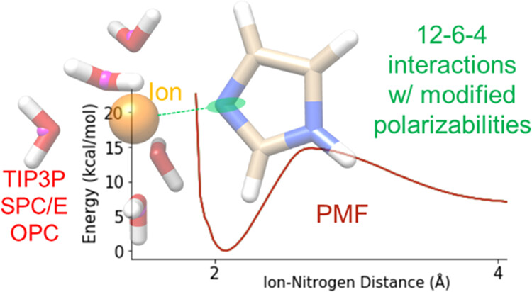

为解决这一问题，学术界发展了多种金属离子建模方法：

| 方法 | 原理 | 优点 | 局限性 |
| --- | --- | --- | --- |
| **12-6 LJ非键模型** | 传统范德华势 | 简单、计算高效 | 无法同时复现HFE和IOD |
| **键合模型（Bonded Model）** | 金属与配体形成共价键 | 结构准确 | 不能模拟配位数变化 |
| **Drude振子模型** | 显式极化 | 物理严格 | 参数化复杂、计算成本高 |
| **AMOEBA极化力场** | 原子多极矩+极化 | 高精度 | 高估金属-配体结合强度 |
| **阳离子占位原子模型（CDA）** | 虚拟位点模拟配位 | 避免直接金属-配体相互作用 | 转移性有限 |
| **12-6-4 LJ非键模型** | 添加离子诱导偶极项 | 兼顾效率和精度 | 仍需针对特定配体调参 |

- **键合模型**虽然在复现实验结构方面表现良好，但由于金属离子与配体之间形成了固定的共价连接，它**无法模拟配位数变化或配体交换**——这在模拟催化金属中心（需要频繁的配体进出）和金属离子转运（需要穿越细胞膜的离子通道）时是致命缺陷。
- **显式极化力场**（如Drude振子、AMOEBA）虽然物理上更严格，能够自然地捕捉离子诱导偶极效应，但参数化过程复杂。研究表明，AMOEBA力场在预测金属离子-醋酸盐结合常数方面有潜力，但倾向于**高估金属离子的结合强度**，导致结果与实验数据存在定量偏差。这可能与极化力场参数化困难有关。相比之下，12-6-4模型虽然需要针对特定配体调参，但能够在保持计算效率的同时实现足够的精度。

### 12-6-4模型的改进与研究动机

Li和Merz等人发展的**12-6-4 LJ非键模型**通过在传统12-6势能函数中加入诱导偶极吸引项来描述金属离子的极化效应。在AMBER力场中，其形式为：

$$
U_{ij}(r) = \dfrac{C_{12}^{ij}}{r^{12}} - \dfrac{C_6^{ij}}{r^6} - \dfrac{C_4^{ij}}{r^4} + \dfrac{eQ_iQ_j}{\varepsilon_r r}
$$

其中$C_4$项（又称极化项）与金属离子和螯合原子的极化率直接相关。该模型在AMBER中使用各向同性的pairwise $C_4$参数，不显式包含角度依赖项。

- **核心思想**：不直接调节金属离子-水的$C_4$参数（该参数已在水合自由能参数化中确定），而是通过调节螯合原子的极化率来适应不同的化学环境，从而复现金属-配体结合自由能。
- **研究动机**：虽然12-6-4模型最初针对金属-水体系开发并取得成功，但将其直接应用于金属-蛋白配体体系时仍存在不足。**论文一**表明，针对组氨酸侧链（咪唑氮）调优极化率是必要的；**论文二**进一步发现，使用复现水合自由能的参数会导致金属-醋酸盐相互作用的**高估**，需要针对羧基氧进行专门的参数优化。两篇研究共同构成了金属离子与生物配体相互作用的完整参数体系。

---

## 研究内容

### 一、12-6-4模型参数化方法论

两篇研究采用相同的参数化框架，核心步骤如下：

#### 1. 力能学计算：PMF与伞形采样

研究使用**势能面平均（PMF）方法**结合**伞形采样（Umbrella Sampling, US）**来计算金属离子-配体结合自由能。PMF通过沿反应坐标（通常是金属离子与螯合原子之间的距离）构建自由能剖面，能够准确描述结合过程中的能量变化。该方法结合**加权直方图分析算法（WHAM）**，已广泛用于计算金属离子在不同环境中的PMF能量。

**表1：两篇论文的参数化流程对比**

| 流程环节 | 论文一（咪唑） | 论文二（醋酸根） |
| --- | --- | --- |
| **初始参数** | 默认极化率值（如$\alpha_0 = 1.09~\mathrm{Å^3}$ for N） | 继承金属离子水合参数的$C_4$项 |
| **采样策略** | 迭代式：us1（粗算）→ us2（精算） | 系统式：收敛性测试 → 正式计算 |
| **参数调整方式** | 未明确说明（推测为手动试错调整$\alpha_0$值） | 未明确说明（推测为手动试错调整$\alpha_0$值） |
| **us1（粗算）** | 1 ns/窗口伞形采样 | 2 ns/窗口（收敛性测试） |
| **us2（精算）** | 3 ns/窗口伞形采样 | 2-10 ns/窗口（逐步增加） |
| **收敛判断** | 结合自由能落在实验值±0.25 kcal/mol内 | 三次独立计算误差< 0.35 kcal/mol |
| **正式采样时长** | 3 ns/窗口 | TIP3P/OPC: 6 ns；SPC/E: 4 ns |
| **反应坐标** | 金属离子与螯合氮之间的距离 | 醋酸根羧基碳原子与金属离子之间的距离 |

**注**：两篇论文均未详细描述$\alpha_0$的具体调整算法（如每次调整多少、是否使用某种优化方法）。仅说明"迭代调整极化率值，直到结合自由能落在目标范围内"。具体调整策略可能是手动试错，也可能是参考了作者之前的相关参数化协议，但均未在论文中公开。

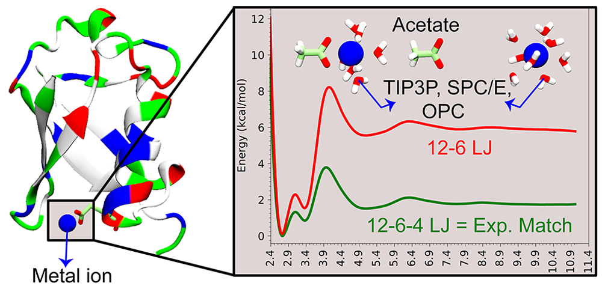

#### 2. C4项的物理基础

$C_4$项描述的是**离子诱导偶极相互作用**，其物理图像是：带电金属离子产生的电场会使邻近配体原子极化，形成诱导偶极矩。这一效应与距离的**四次方成反比**（比静电相互作用衰减更快），但在短程相互作用中贡献显著。

理论上，$C_4$可由螯合原子极化率$\alpha_0$导出：

$$
C_4 = \dfrac{q_i^2 \alpha_0}{2(4\pi\varepsilon_0)^2} \dfrac{1}{\cos\theta_0 - 1}
$$

其中$\alpha_0$是**螯合原子的极化率**。需要强调：该公式描述的是理论上的角度依赖图像，而AMBER实现中使用的是各向同性的有效pairwise $C_4$参数。参数化过程中，研究者通过调节$\alpha_0$来改变有效$C_4$值，从而拟合实验结合自由能。

#### 3. 三种水模型的几何差异

| 水模型 | 类型 | O-H键长 (Å) | H-O-H角 (°) | 氧原子电荷 |
| --- | --- | --- | --- | --- |
| **TIP3P** | 3点 | 0.9572 | 104.72 | -0.8340 |
| **SPC/E** | 3点 | 1.0000 | 109.47 | -0.8476 |
| **OPC** | 4点 | 0.8724 | 103.6 | -1.3582 |

OPC水模型通过引入**额外的电荷位点**实现了更强的偶极和四极矩，使其更准确地模拟液态水的极化行为。这也解释了为何OPC模型需要**更低的极化率**来复现相同的实验结合自由能。

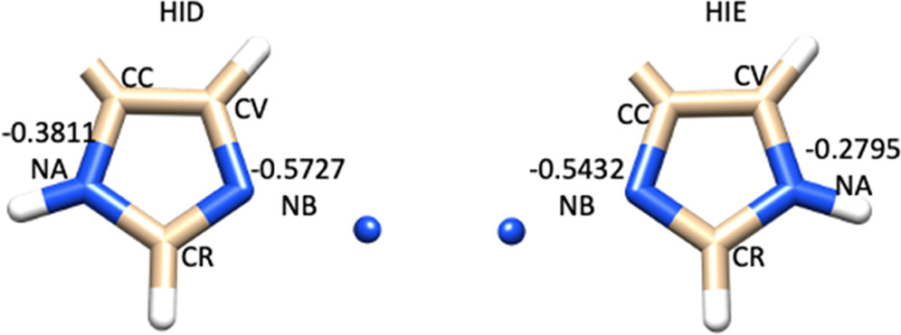

**咪唑论文图1：HID和HIE咪唑分子的电荷分布对比**
- 展示了两种质子化状态咪唑的原子电荷差异，不同颜色代表不同原子的电荷分布
- HID（δ氮质子化）和HIE（ε氮质子化）的电荷分布不同，影响与金属离子的相互作用强度

### 二、金属-咪唑相互作用的参数化

#### 研究体系

论文一使用**咪唑分子**模拟组氨酸侧链，针对11种金属离子进行参数化：$\ce{Ag(I)}$、$\ce{Ca(II)}$、$\ce{Cd(II)}$、$\ce{Co(II)}$、$\ce{Cu(I)}$、$\ce{Cu(II)}$、$\ce{Fe(II)}$、$\ce{Mg(II)}$、$\ce{Mn(II)}$、$\ce{Ni(II)}$和$\ce{Zn(II)}$。

研究同时考虑了**HID**（δ氮质子化）和**HIE**（ε氮质子化）两种组氨酸质子化状态，并测试了TIP3P、SPC/E和OPC三种水模型。

#### 关键发现：极化率与水模型的关联

研究揭示了一个重要规律：**极化率与水模型几何性质存在强相关性**。

- **TIP3P ≈ SPC/E > OPC**：OPC水模型的极化率需求最低
- 原因：OPC独特的几何结构（更短的O-H键、更小的H-O-H角）使金属离子在第一水合壳层被较大咪唑分子替换时经历的**空间位阻更小**
- 因此，OPC水模型中金属-咪唑结合在热力学上更受青睐，不需要那么高的极化率来补偿

**但这一规律背后存在物理合理性质疑**：研究通过调节$\alpha_0$来匹配实验数据，主要依赖热力学拟合，未进一步用独立量子化学计算交叉验证。$\alpha_0$本应由电子结构的第一性原理决定，而非完全通过热力学数据反推。这种参数化方法虽然能复现现有实验值，但其**泛化能力存疑**——当应用于新的金属-配体组合时，是否仍需重新调参？

#### 电子构型的影响

研究发现金属离子的**d轨道电子构型**显著影响其与咪唑氮的相互作用：

- **单价离子**（$\ce{Ag(I)}$、$\ce{Cu(I)}$）：需要更高的氮极化率，因为它们对配体的诱导偶极效应更强
- **d轨道对称性**（半满或全满的d轨道）会增强屏蔽效应，降低离子对氮的诱导能力
- 同族元素中，**单价离子**半径越大极化率需求越低；**二价离子**则相反

**但这些“趋势”的解释较为模糊**。论文声称d轨道对称性影响诱导能力，但**未提供定量证据**——没有量子化学计算来验证d轨道电子密度分布与极化率需求之间的直接关联。这些趋势解释更多来自参数化结果归纳，而非从物理原理出发的预测。

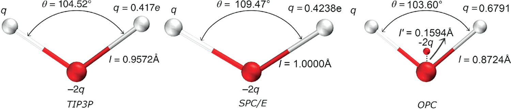

**咪唑论文图2：三种水模型的结构对比**
- TIP3P和SPC/E为三点模型，OPC为四点模型（带额外电荷位点，图中用绿色球体标示）
- OPC的独特几何结构（更短的O-H键长、更小的H-O-H角）使其在金属离子溶剂化中表现不同
- 注：本图仅为水分子几何结构示意图，不涉及电荷分布比较（电荷分布见图1）

### 三、金属-醋酸盐相互作用的参数化

#### 研究体系与测试集偏差

论文二使用**醋酸根离子**（$\ce{CH3COO^-}$）模拟天冬氨酸和谷氨酸的羧基侧链，同样针对11种金属离子进行参数化。

**但测试集设计存在系统性偏差**：6个金属-醋酸盐复合物晶体结构中，**5个是$\ce{Zn^{2+}}$体系**（$\ce{Zn^{2+}}$-醋酸根、两个$\ce{Zn^{2+}}$-碳酸酐酶II复合物等）。这种**过度依赖单一金属离子**的设计导致模型验证偏向$\ce{Zn^{2+}}$体系——虽然论文声称参数可迁移至其他二价离子（$\ce{Ca^{2+}}$、$\ce{Mg^{2+}}$等），但缺乏对这些重要生物学离子的独立验证。$\ce{Ca^{2+}}$和$\ce{Mg^{2+}}$在信号传导和酶催化中扮演关键角色，它们的参数准确性直接影响模型在真实金属蛋白中的应用可靠性。

#### 单齿配位与双齿配位

醋酸根与金属离子的结合存在两种模式：

- **单齿配位（Monodentate）**：仅一个氧原子与金属配位
- **双齿配位（Bidentate）**：两个氧原子同时参与配位

这一结合模式的选择受多种因素影响，包括金属离子的**电荷、离子半径、电子构型**以及**结合位点的配位环境**。

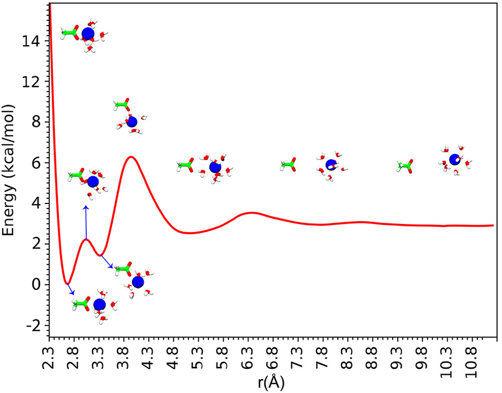

**醋酸盐论文图1：$\ce{Cd(II)}$-醋酸根复合物的PMF能量剖面**
- 展示了沿金属-羧基碳原子距离的结合自由能变化曲线，横轴为距离，纵轴为自由能
- 双齿配位（约2.8 Å，能量最低点）比单齿配位（约3-3.5 Å）能量更低，偏好约1.5 kcal/mol，说明双齿配位更稳定

#### 水模型对结合模式的影响

研究揭示了水模型对醋酸根结合模式的显著影响：

| 金属离子 | TIP3P/SPC/E偏好 | OPC偏好 |
| --- | --- | --- |
| $\ce{Ni(II)}$, $\ce{Mg(II)}$, $\ce{Zn(II)}$, $\ce{Co(II)}$, $\ce{Fe(II)}$, $\ce{Mn(II)}$ | 单齿 | 单齿 |
| $\ce{Cu(II)}$ | 双齿 | **单齿**（显著偏好） |
| $\ce{Cd(II)}$, $\ce{Ca(II)}$, $\ce{Ag(I)}$ | 双齿 | 双齿 |

**$\ce{Cu(II)}$的特殊行为**：在三点水模型（TIP3P、SPC/E）中$\ce{Cu(II)}$偏好双齿配位，但在OPC中转变为**强偏好单齿配位**（约1-1.5 kcal/mol差异）。这与OPC更精确的偶极矩描述导致金属-水相互作用更强有关。

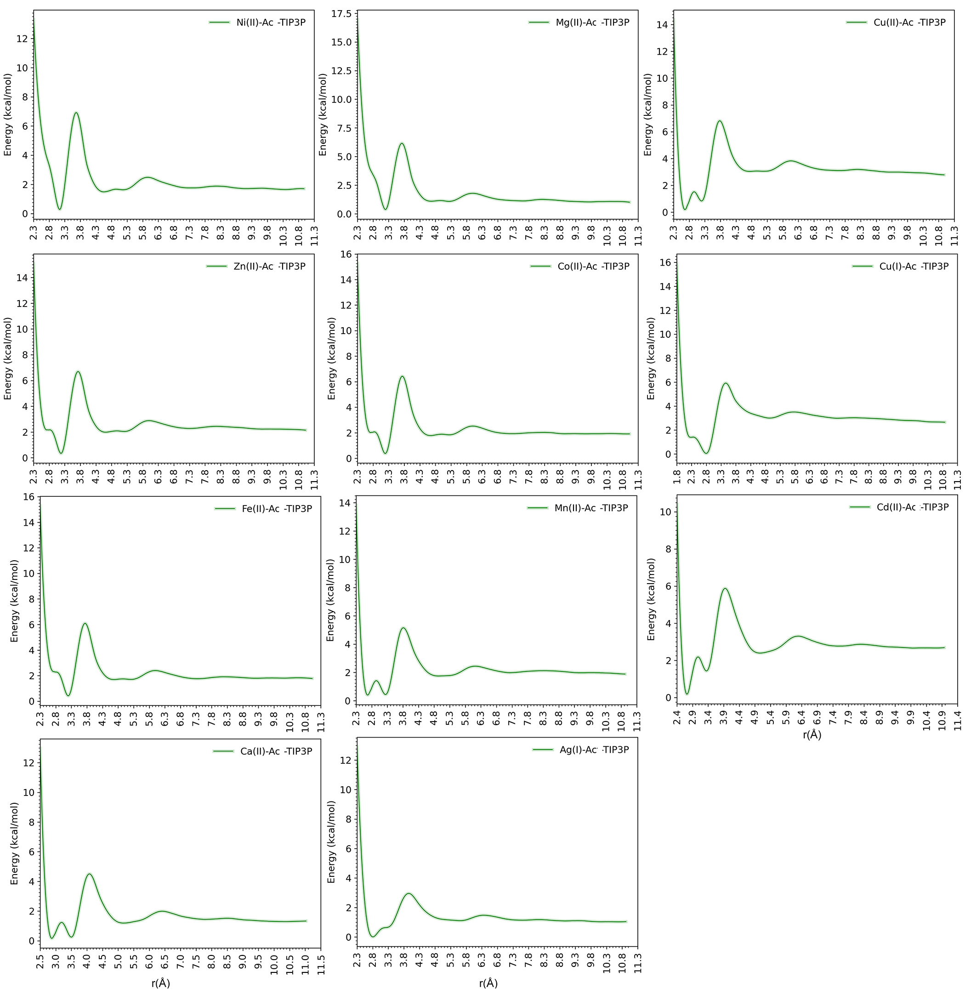

**醋酸盐论文图2：TIP3P水模型中金属离子-醋酸根结合的PMF自由能剖面**
- 展示11种金属离子的自由能曲线，其中$\ce{Cu(II)}$（红色曲线）显示清晰的双齿配位最小值

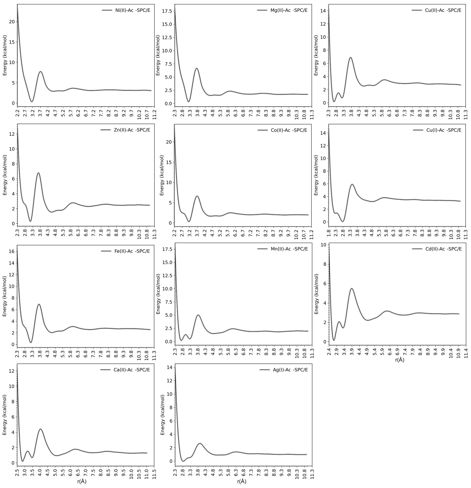

**醋酸盐论文图3：SPC/E水模型中金属离子-醋酸根结合的PMF自由能剖面**
- 整体行为与TIP3P相似，$\ce{Cu(II)}$仍偏好双齿配位

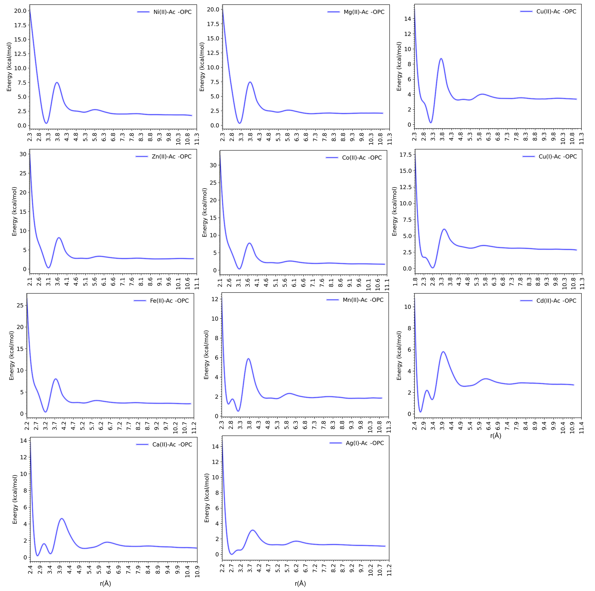

**醋酸盐论文图4：OPC水模型中金属离子-醋酸根结合的PMF自由能剖面**
- $\ce{Cu(II)}$的双齿配位峰消失，转变为强单齿配位偏好（约1-1.5 kcal/mol差异），说明水模型选择显著影响结合模式

#### 醋酸盐氧的极化率趋势

与论文一类似，论文二也发现极化率与多个因素相关：

- **同族元素**：半径越大的离子，其螯合氧原子需要的极化率越高
- **结合模式**：双齿配位的$\ce{Ca(II)}$和$\ce{Mg(II)}$需要**更高**的极化率
- **负极化率的奇异性**：对于$\ce{Ni(II)}$和$\ce{Mg(II)}$在OPC模型中，研究发现需要**负极化率**才能复现实验值——这可能是对12-6 LJ和标准12-6-4模型高估的补偿

### 四、模型性能对比

#### 参数化前后对比

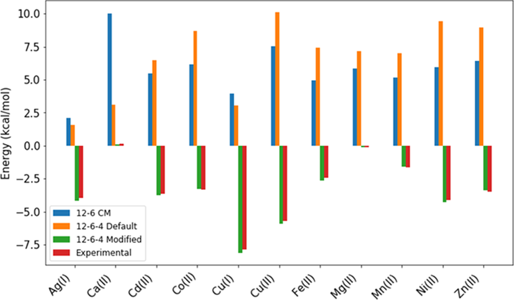
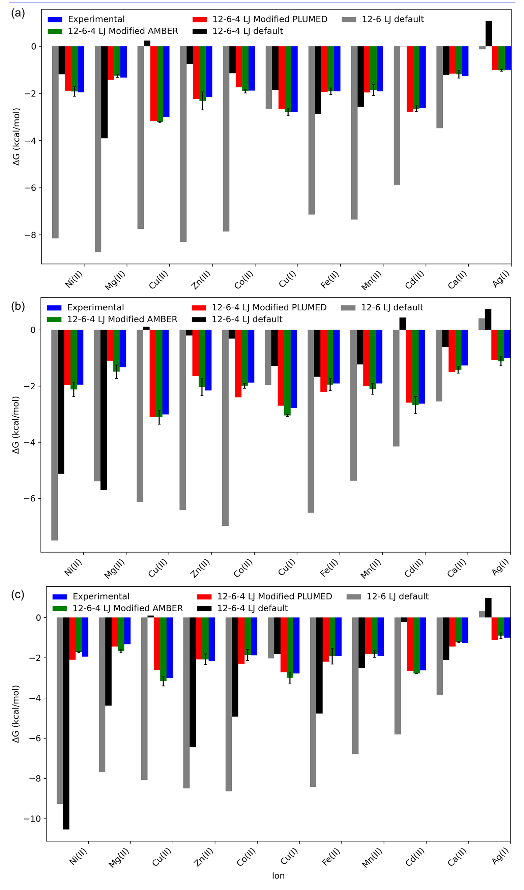

**11种金属离子的实验与计算结合自由能对比（上图 咪唑论文图3；下图 醋酸盐论文图5）**
- 上图展示优化后的12-6-4模型（绿色柱）能准确复现实验值（黑色柱），标准12-6模型（红色柱）大幅高估，默认12-6-4模型（蓝色柱）在三点水模型中低估
- 下图同样展示优化参数（绿色）与实验值（黑色）的高度一致性，验证了参数化策略的有效性

| 模型 | 平均误差 | 问题 |
| --- | --- | --- |
| **12-6 LJ** | 较大 | 大幅**高估**结合强度（除$\ce{Ag(I)}$外） |
| **12-6-4 默认** | 中等 | 在三点水模型中**低估**结合自由能；在OPC中**高估** |
| **12-6-4 优化** | **约0.35 kcal/mol** | 成功复现实验值 |

#### 跨软件验证与系统基准缺失

论文二使用**PLUMED**软件独立计算PMF进行外部验证，结果与AMBER原生实现高度一致（误差约0.5 kcal/mol），证实了参数化的**稳健性**。

**但研究缺乏与显式极化力场的系统对比**。论文声称12-6-4模型“计算效率高”，但**未量化这一优势**——没有与AMOEBA、Drude等极化力场的计算时间对比，也未在相同测试集上比较精度。读者无法判断12-6-4模型在**精度-效率权衡**中的真实位置。AMOEBA虽然可能“高估”结合强度，但其物理严格性可能对某些体系（如电荷转移显著的金属中心）更重要——这一点论文未深入讨论。

### 五、实际应用：Glyoxalase I金属蛋白

论文二将优化后的参数应用于**大肠杆菌乙二醛酶I（Glx I）金属蛋白**（PDB ID: 1F9Z）的MD模拟验证。

该蛋白每个金属结合位点包含His5、His74、Glu122和Glu56，协调一个$\ce{Ni(II)}$离子和两个水分子。

**关键结果**：使用优化后的12-6-4参数（包括组氨酸氮和羧基氧的参数），经过**200 ns MD模拟**后：

- 两个组氨酸残基在两个金属结合位点中**均维持了与金属离子的相互作用**
- 负电荷残基（GLU56和GLU122）以**单齿模式**与金属配位，与晶体结构一致
- 两个水分子保持在金属结合位点中

这证明了优化参数在**真实金属蛋白系统**中的可转移性。

**但验证仅限于静态结构保持**，未测试**动力学性质**。论文未报告金属-配体键的振动频率、配体交换速率或构象转换速率等动力学指标。12-6-4模型可能对静态性质准确，但对预测金属-配体键的**解离/重组动力学**表现如何？这在催化金属中心（频繁的配体进出）和金属转运蛋白（离子通道）中是关键性质——这一点研究未涉及。

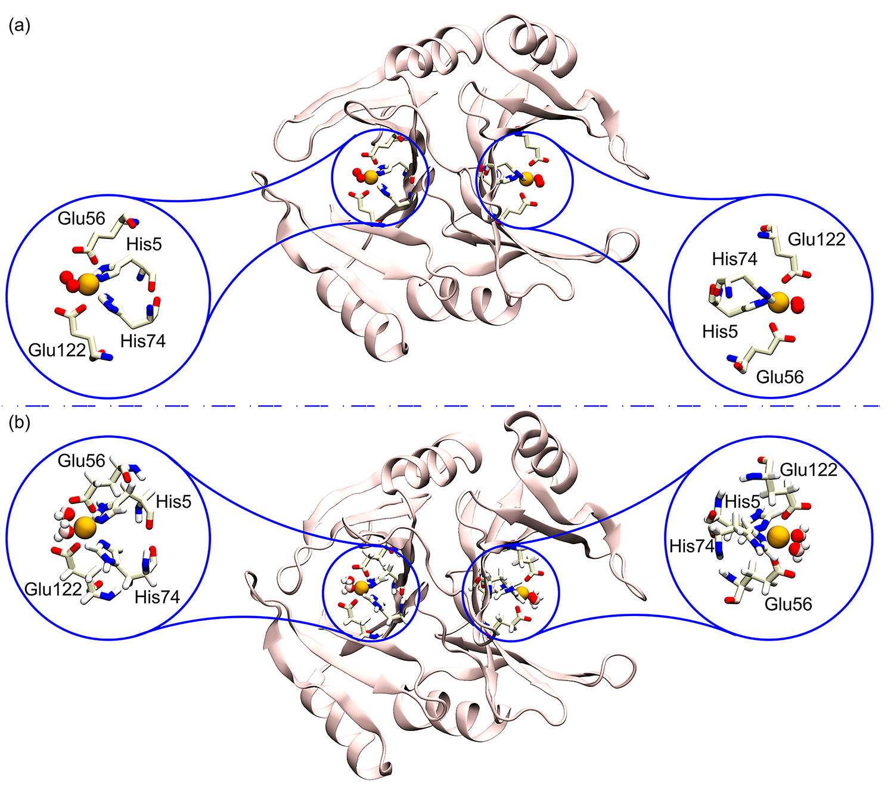

**醋酸盐论文图6：Glx I金属蛋白MD模拟验证**
- **左侧**：Glx I的晶体结构（PDB ID: 1F9Z），展示二聚体的两个金属结合位点，每个位点包含His5、His74、Glu122、Glu56和$\ce{Ni(II)}$离子（绿色球）
- **右侧**：200 ns MD模拟结束时的构象，优化参数下两个组氨酸（His5、His74）保持与金属配位，两个谷氨酸（Glu56、Glu122）以单齿模式配位，两个水分子（红色球）保持在结合位点中
- 验证了优化参数在真实金属蛋白中的可靠性

---

## 两篇研究的内在联系与整合价值

### 方法论的一致性

两篇研究遵循完全相同的方法论框架：

1. **相同的力能学方法**：PMF结合伞形采样
2. **相同的参数化策略**：调节螯合原子极化率
3. **相同的水模型测试集**：TIP3P、SPC/E、OPC
4. **相同的验证金属集合**：11种从单价到二价的金属离子

### 参数体系的完整性

将两篇研究整合，构成了**完整的金属离子-氨基酸侧链相互作用参数体系**：

- **组氨酸侧链**：咪唑氮的极化率参数（已有）
- **天冬氨酸/谷氨酸侧链**：羧基氧的极化率参数（已有）

这使得研究者能够在MD模拟中**同时准确描述**金属离子与带正电（组氨酸）和带负电（天冬氨酸/谷氨酸）氨基酸侧链的相互作用。

### 核心物理图像

两篇研究共同揭示的核心物理图像是：**金属离子与螯合原子的相互作用是三组分系统（金属-配体-溶剂）综合作用的结果**。通过简单地调节螯合原子的极化率，12-6-4模型能够适应不同的化学环境，这正是其强大之处。

---

## 关键结论与批判性总结

### 优势与价值

尽管存在上述局限性，两篇研究的核心价值不应被否定：

- **在固定电荷框架内的显著改进**：12-6-4模型通过添加$C_4/r^4$项描述离子诱导偶极相互作用，能够**同时复现**金属离子的结构性质（IOD）和热力学性质（HFE），而这是标准12-6模型无法做到的
- **参数化流程清晰可复现**：研究提供了完整的PMF计算流程和$\alpha_0$参数表，便于其他研究者直接使用或验证
- **对$\ce{Zn^{2+}}$体系有实用价值**：虽然泛化能力有限，但对于锌蛋白（生物学中极其重要）的静态结构优化和结合自由能计算，提供了可靠的工具
- **揭示了水模型选择的重要性**：OPC水模型由于其更精确的偶极/四极矩描述，在金属离子溶剂化模拟中表现更佳——这一发现对领域有普遍指导意义
- **结合模式的敏感性发现**：醋酸根的结合模式（单齿vs双齿）对水模型选择**高度敏感**，提醒研究者在模拟金属蛋白时必须谨慎选择水模型

### 核心物理效应的缺失

12-6-4模型虽然通过诱导偶极项改善了固定电荷模型的不足，但仍**忽略关键物理效应**：

- **电荷转移**：金属-配体键中普遍存在电子云重排，部分电荷从配体转移到金属（或反之）
- **多体协同效应**：一个配体的极化会影响邻近配体的电子分布，这在螯合位点（多个配体围绕一个金属）中尤为重要

这些效应在显式极化力场（如AMOEBA、Drude）中能自然描述，但12-6-4模型只能通过“有效极化率”隐式近似——当配体环境与参数化条件差异较大时，这种近似可能失效。

### 实验数据的单一来源

论文二的实验数据**仅来自一组实验**（Li等人早期的结合自由能测量），未验证其他实验组的数据。如果原始实验存在系统误差（如pH控制、离子强度、金属浓度测定等），模型会继承甚至放大这些偏差。相比之下，论文一整合了多个实验源的数据，可靠性更高。

### 参数可迁移性的有限验证

金属-咪唑论文声称螯合原子的极化率参数具有“可迁移性”，但验证范围狭窄：
- 只在“组氨酸-金属”体系测试
- 未测试“半胱氨酸-金属”、“甲硫氨酸-金属”、“天冬酰胺-金属”等其他常见配体

**醋酸盐氧的极化率并不是直接照搬咪唑氮的参数**，而是针对金属-醋酸根相互作用重新优化得到。两篇论文共享的是同一套12-6-4参数化思路，而不是同一组螯合原子参数。

**论文声称的适用范围**：根据原文，这些参数“可应用于金属蛋白和过渡金属离子通道与转运蛋白的研究”，因为醋酸根“代表天冬氨酸和谷氨酸等带负电氨基酸侧链”。但实际验证仅限于Glx I这一个蛋白体系，**缺乏在其他金属蛋白中的广泛测试**。

### 适用场景与使用建议

基于以上批判性分析，12-6-4模型的适用场景需**谨慎界定**：

**推荐使用**：
- **$\ce{Zn^{2+}}$蛋白的静态结构优化**：参数化数据最丰富，验证最充分
- **结合自由能计算**：对于已参数化的金属-配体组合，热力学性质预测可靠
- **固定电荷力场的扩展**：当需要考虑极化效应但无法承担AMOEBA计算成本时

**谨慎使用**：
- **其他金属离子**：$\ce{Ca^{2+}}$、$\ce{Mg^{2+}}$、$\ce{Fe^{2+}}/\ce{Fe^{3+}}$等参数验证不充分，建议先做小规模测试
- **动力学性质预测**：金属-配体键振动频率、配体交换速率等未验证
- **非常规配体**：半胱氨酸（硫配位）、甲硫氨酸等需独立参数化

**不推荐**：
- **作为通用金属参数化策略**：每个新体系都可能需要重新优化$\alpha_0$，缺乏真正的“可迁移性”
- **电荷转移显著的体系**：如金属-硫簇合物、氧化还原活性中心等

### 未来方向

- 将参数扩展至更多金属离子和配体类型
- 开发自动化参数化流程，降低使用门槛
- 结合量子化学计算，从第一性原理确定$\alpha_0$，减少经验拟合
- 系统对比显式极化力场，明确12-6-4模型的精度-效率边界
