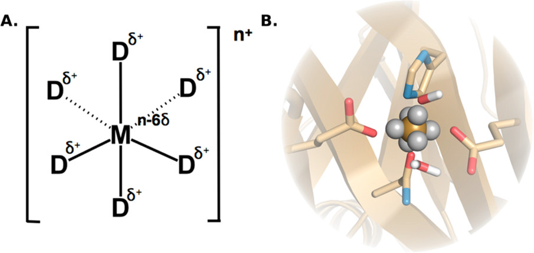
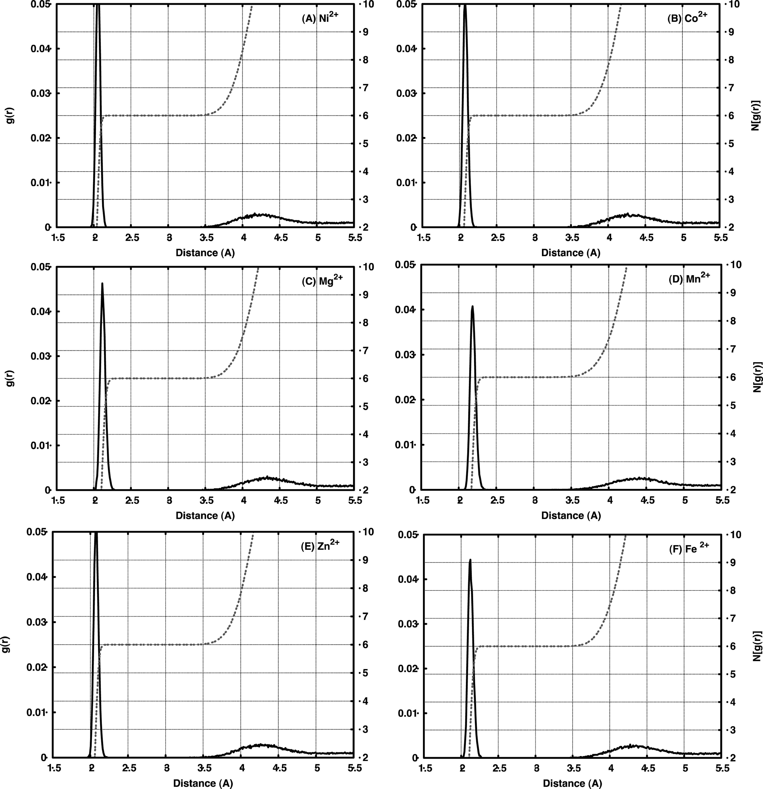
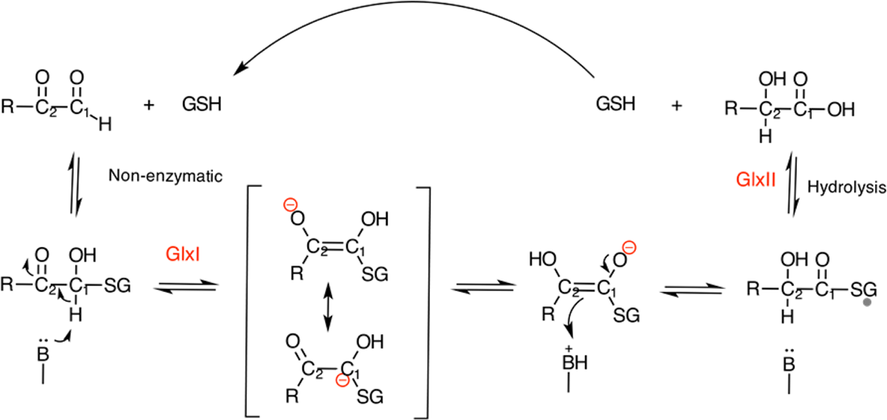
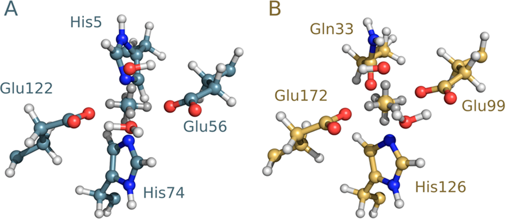
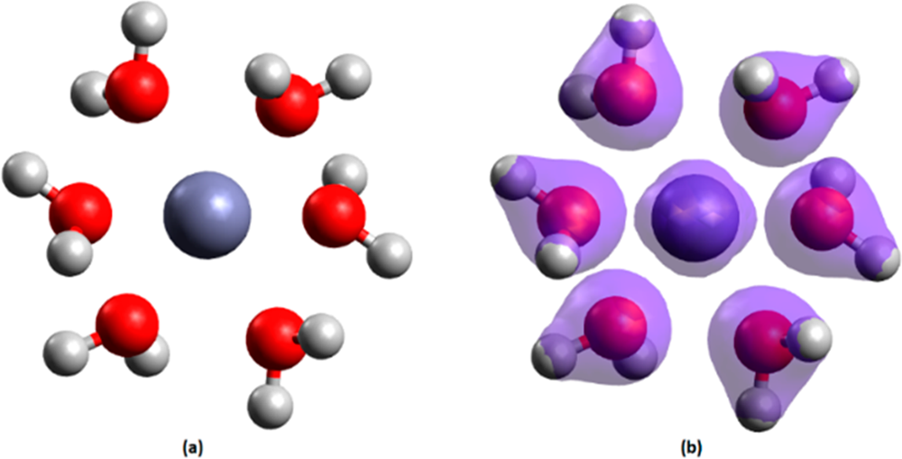
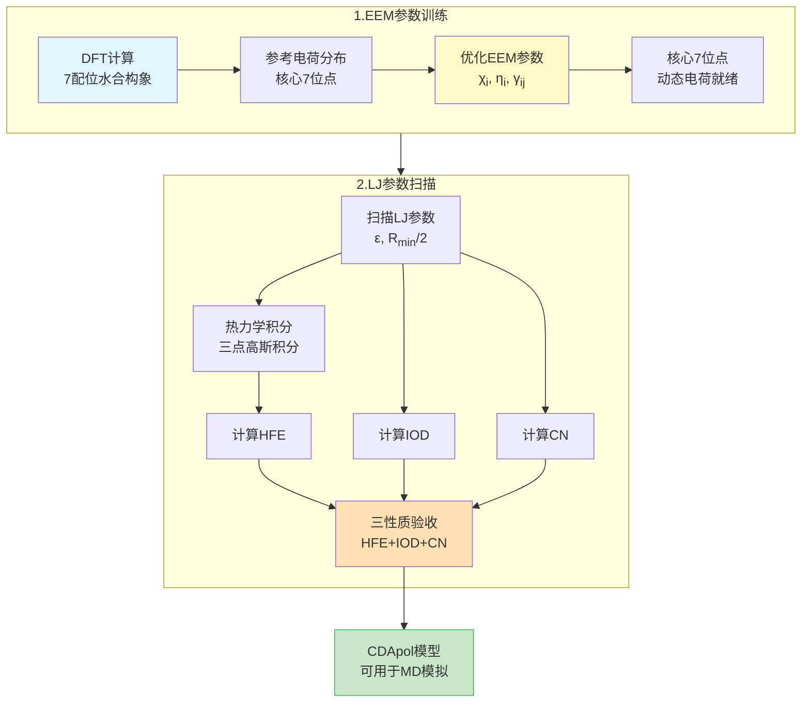
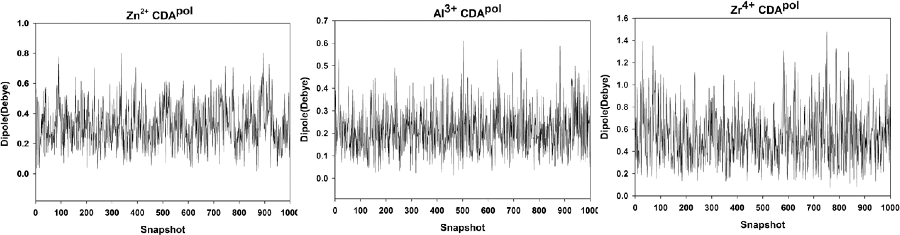
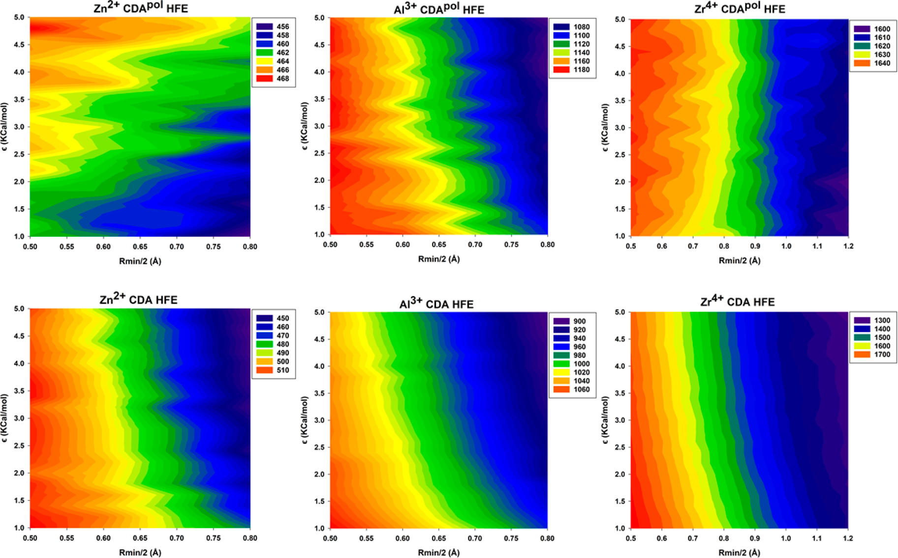
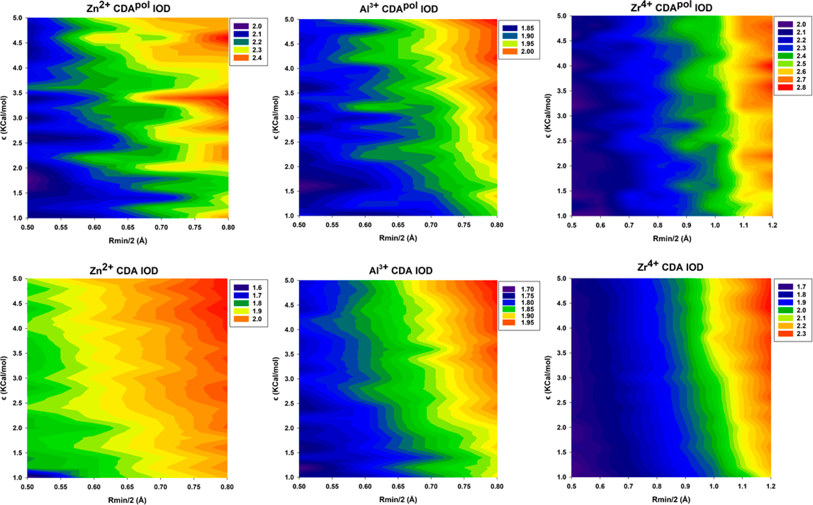
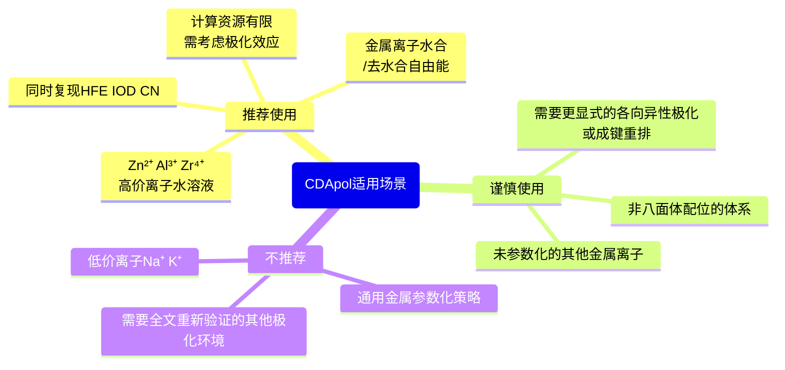

---

title: "固定电荷模型为何难以模拟高价金属离子？关键在于引入动态极化效应"
date: "2026-05-06"
last_modified_at: "2026-05-06"
tags: [metal-ions, force-field, molecular-dynamics, polarization, cationic-dummy-atom, EEM, AMBER, high-valent-ions]
description: "解读CDApol模型：通过电负性均衡方法（Electronegativity Equalization Method，EEM）在阳离子虚拟原子模型中引入动态极化，解决固定电荷模型无法适应局部溶剂结构的难题"
image: "/assets/img/thumbnail_mine/wh-g83qpe.jpg"
thumbnail: "/assets/img/thumbnail_mine/wh-g83qpe.jpg"
author: Xufan Gao
lang: zh-CN
---
# 固定电荷模型为何难以模拟高价金属离子？关键在于引入动态极化效应

## 本文信息

- **标题**：A Polarizable Cationic Dummy Metal Ion Model
- **作者**：Ali Rahnamoun, Kurt A. O'Hearn, Mehmet Cagri Kaymak, Zhen Li, Kenneth M. Merz, Jr., Hasan Metin Aktulga
- **发表期刊**：*The Journal of Physical Chemistry Letters*
- **发表时间**：2022年6月8日
- **DOI**：https://doi.org/10.1021/acs.jpclett.2c01279
- **单位**：Michigan State University, USA
- **引用格式**：Rahnamoun, A.; O'Hearn, K. A.; Kaymak, M. C.; Li, Z.; Merz, K. M., Jr.; Aktulga, H. M. (2022). A Polarizable Cationic Dummy Metal Ion Model. *J. Phys. Chem. Lett.*, 13, 5334-5340.

### 全局参考（机制来源）

- Rahnamoun, A.; Kaymak, M. C.; Manathunga, M.; Götz, A. W.; Duin, A. C. T.; Merz, K. M., Jr.; Aktulga, H. M. (2020). ReaxFF/AMBER—A Framework for Hybrid Reactive/Nonreactive Force Field Molecular Dynamics Simulations. *J. Chem. Theory Comput.*, 16, 7645-7654. https://doi.org/10.1021/acs.jctc.0c00874

## 摘要

> 本研究提出了一种基于原始**阳离子虚拟原子**（Cationic Dummy Atom，CDA）模型的**局部极化多位点模型**，用于凝聚相中离子的分子动力学模拟。极化效应通过**电负性均衡方法**（Electronegativity Equalization Method，EEM）引入，使金属离子及其虚拟原子上的电荷能够随环境变化重新分配。该模型加入了**显式极化和离子诱导相互作用**，并且可以与非极化水模型配合；从方法设计上，它也可以扩展到更一般的极化环境。它是在原始固定电荷CDA模型上的扩展，目标是让电荷分布跟着局部溶剂结构变化。本文以$\ce{Zn^{2+}}$、$\ce{Al^{3+}}$和$\ce{Zr^{4+}}$为例，优化了**八面体配位**CDA的Lennard-Jones和极化参数，用来复现实验中的**水合自由能、离子-氧距离和配位数**。这个框架尤其适合处理**局部极化响应很强**的高价金属离子体系。

### 核心结论

- **固定电荷模型的局限性**：传统CDA模型无法适应局部溶剂结构，电荷分布固定不变
- **动态极化机制**：CDApol通过EEM方法实现电荷动态平衡，中心离子和6个虚拟原子上的电荷可响应环境变化
- **计算成本可控**：相比非极化CDA模型，CDApol仅增加35%计算时间，但显著提升准确性
- **同时兼顾三性质**：CDApol在本文测试的标准12-6 LJ框架下，同时把HFE、IOD和CN拉回到接近实验的范围
- **适用高电荷离子**：对$\ce{Zn^{2+}}$、$\ce{Al^{3+}}$、$\ce{Zr^{4+}}$等高价离子效果显著，最终结果整体接近实验值

---

### 关键科学问题

本研究旨在解决以下核心问题：

1. **固定电荷CDA模型的根本缺陷**：电荷分布无法适应局部溶剂结构，导致高价离子的水合自由能（HFE）、离子-氧距离（IOD）和配位数（CN）无法同时准确复现
2. **极化效应的引入方式**：如何在保持计算效率的前提下，将动态极化效应引入CDA框架？
3. **参数化策略**：如何针对不同价态的金属离子（+2、+3、+4）优化EEM和LJ参数，实现高准确性？

### 创新点

本研究的主要创新包括：

1. **局部极化多位点模型**：在CDA框架中引入EEM动态极化，实现电荷分布的实时响应
2. **双步参数化策略**：先优化EEM参数复现DFT电荷分布，再扫描LJ参数复现实验HFE/IOD/CN
3. **同时兼顾三性质**：在标准12-6 LJ模型框架下，同时把HFE、IOD和CN调到接近实验的范围
4. **计算效率优化**：通过AMBER-PuReMD接口实现极化效应，计算成本仅增加35%

## 背景

### 金属离子模拟的挑战

金属离子在生物化学和材料科学中扮演重要角色。约三分之一的蛋白质含有金属离子，它们通过与周围氨基酸形成复合物，在生物系统中发挥结构、电子转移和催化等关键功能。使用标准经典模拟对包含过渡金属的体系进行建模，是**最具挑战性的任务之一**。

过渡金属的电荷不是恒定的，而是受氧化态、配体类型、配位几何等多种因素影响。当金属离子溶解在水中时，周围水分子会改变它的电荷分布，形成**离子诱导偶极效应**。这种效应在高价离子（如$\ce{Al^{3+}}$、$\ce{Zr^{4+}}$）中更明显，因为它们带着更多正电荷，对周围溶剂的极化更强。

| 方法    | 优点  | 局限性     |
| ------------------- | ------------------------------------------- | ---------------------------------------------- |
| **12-6 LJ非键模型** | 简单、计算高效| 固定电荷无法响应环境变化，无法同时复现HFE和IOD |
| **12-6-4 LJ模型**   | 添加$C_4/r^4$诱导偶极项 | 需针对特定配体调参，可迁移性有限      |
| **Drude振子模型**   | 显式极化，物理严格     | 参数化复杂、计算成本高|
| **固定电荷CDA模型** | 虚拟位点模拟配位，避免直接金属-配体相互作用 | 电荷分布固定，无法适应局部溶剂结构    |
| **AMOEBA极化力场**  | 原子多极矩+极化，高精度| 计算成本极高，倾向于高估结合强度      |

**固定电荷CDA模型**虽然在避免直接金属-配体相互作用方面有优势，但其根本缺陷在于**电荷分布无法适应局部溶剂结构**。当高价离子从真空进入水溶液时，周围水分子会重新排列，产生强极化场，但固定电荷模型无法捕捉这一动态过程。

### CDA模型的发展历程：从固定电荷到动态极化

阳离子虚拟原子（CDA）模型由Åqvist和Warshel于1990年首次提出，其核心思想是通过电荷离域化减弱金属中心的过度排斥。该模型在金属中心周围放置6个带部分正电荷的虚拟原子（八面体几何），每个虚拟原子电荷为+δ，中心离子电荷为n-6δ，总电荷保持为n+。这种设计巧妙地**弱化了过于集中的金属正电荷**，使模型能够在不额外引入金属-配体键和角约束的情况下维持稳定的配位几何。

经过二十余年的发展，CDA模型已成功应用于多种金属体系。Duarte等人（*J. Phys. Chem. B* 2014, 118, 4351-4362）针对八面体配位的7种二价离子（$\ce{Mn^{2+}}$、$\ce{Zn^{2+}}$、$\ce{Mg^{2+}}$、$\ce{Ca^{2+}}$、$\ce{Ni^{2+}}$、$\ce{Co^{2+}}$、$\ce{Fe^{2+}}$）开发了**力场无关的CDA参数**，这是该领域的重要里程碑。

图1：Duarte et al. 2014的CDA模型示意图。（A）虚拟原子模型：中心金属离子周围放置6个虚拟位点，总电荷保持为$n+$，整体采用八面体拓扑。（B）人类乙二醛酶 I 活性位点结构，显示$\ce{Zn^{2+}}$被dummy模型替代后的局部配位环境。原文图注写明中心原子与dummy原子分别以灰色与白色表示。

#### 模型设计的物理原理

Duarte等人的CDA模型遵循**电荷离域化**思想，将金属离子的正电荷分散到7个位点（1个中心离子+6个虚拟原子）。每个虚拟原子携带部分正电荷δ，中心离子电荷为$Q_\text{metal} - 6\delta$，总电荷保持为金属离子的形式电荷（+2）。这种设计带来两个关键优势：
- **避免过度排斥**：电荷分散使金属-配体相互作用不会因距离过近而产生非物理的强排斥
- **约束边界清晰**：dummy复合体内部使用较大的键/角力常数维持几何骨架，但金属与外部配体之间不加成键约束，因此配位环境仍可通过非键相互作用自发重排
- 小编锐评：也是一种权衡吧，真实配位肯定是配体和金属有电荷重分配的

#### 同时复现M-O距离和溶剂化自由能

图2：7种二价金属离子的径向分布函数和配位数（Duarte et al. 2014）。彩色实线表示金属-氧径向分布函数$g_{\ce{M^{2+}}-\ce{O}}(r)$，黑色虚线表示配位数$n(r)$。7种离子都显示出清晰的**第一溶剂化峰**，峰位在2.0-2.5 Å范围，对应直接与金属离子配位的水分子氧原子。

通过**优化Lennard-Jones参数**（$\epsilon$和$\sigma$）和**虚拟原子电荷δ**，Duarte等人把HFE、M-O距离和CN都压到了实验值附近。流程可以压成四步：

- **先定骨架**：沿用并微调已有的八面体dummy几何，文中给出了代表性的内部参数（如$M-D$键$K_b=800.0$、$r_0=0.900$ Å；$D_i-M-D_i$角$K_\theta=250.0$、$\theta_0=180.0^\circ$），先把配位框架稳定下来。
- **再调少数关键参量**：主要改金属中心的 $A_i/B_i$ 和中心/虚拟原子之间的电荷分配，dummy 间的键和角保持很大力常数。
- **每轮都拿实验量验收**：重点看 **HFE**、**M-O 距离** 和 **CN**，参数不是一次拍定，而是逐轮往实验值靠。
- **自由能用 FEP 算**：从 $Q=0$ 到 $n+$ 分成 $n$ 个中间态逐步推进，再加截断和标准态修正；同时在 **SPC** 和 **TIP3P** 两种水模型里检查可迁移性。

这条路线的顺序很固定：**先固定几何，再按实验量逐步调整**。

| 金属离子 | $\Delta G_\text{hyd}^\text{calc}$ (kcal/mol) | $\Delta G_\text{hyd}^\text{exp}$ (kcal/mol) | 误差 | $r_\text{M-O}^\text{calc}$ (Å) | $r_\text{M-O}^\text{exp}$ (Å) | CN |
| --- | --- | --- | --- | --- | --- | --- |
| $\ce{Mg^{2+}}$ | -445.4 | -445.5 | 0.1% | 2.09 | 2.09-2.11 | 6.0 |
| $\ce{Ca^{2+}}$ | -380.0 | -379.8 | -0.1% | 2.42 | 2.39-2.46 | 7.0 |
| $\ce{Mn^{2+}}$ | -436.0 | -435.5 | -0.1% | 2.19 | 2.18-2.20 | 6.0 |
| $\ce{Fe^{2+}}$ | -438.0 | -439.0 | 0.2% | 2.14 | 2.10-2.16 | 6.0 |
| $\ce{Co^{2+}}$ | -456.0 | -456.5 | 0.1% | 2.10 | 2.07-2.12 | 6.0 |
| $\ce{Ni^{2+}}$ | -465.0 | -465.0 | 0.0% | 2.07 | 2.04-2.10 | 6.0 |
| $\ce{Zn^{2+}}$ | -453.0 | -453.5 | 0.1% | 2.08 | 2.00-2.10 | 6.0 |

- **HFE精度**：所有7种离子的水合自由能计算值与实验值误差**小于0.2**%，平均误差仅0.1%（小编锐评：拟合目标能达到是必须的。。）
- **IOD精度**：金属-氧距离误差**小于0.05 Å**，完美复现实验晶体学数据
- **配位数预测**：除$\ce{Ca^{2+}}$为7配位外，其他6种离子均为6配位，与实验一致
- **首峰高度**：RDF第一峰高度在5-12之间，表明**稳定的八面体配位几何**

#### 力场无关性和酶体系验证

Duarte等人特别强调了参数的**力场无关性**。CDA参数仅依赖Coulomb势和Lennard-Jones势，**不涉及特定的力场函数形式**。因此，同一套参数可以无缝迁移到AMBER、CHARMM、OPLS等不同力场中，无需重新参数化。

在人类乙二醛酶I（glyoxalase I）的实际应用中，$\ce{Zn^{2+}}$-CDA模型在20 ns MD模拟中**保持了完美的八面体配位**，与两个谷氨酸（Glu99和Glu172）、两个组氨酸（His126和His195）以及一个水分子形成稳定复合物。这证明了CDA参数在真实蛋白环境中的可迁移性和稳定性。

**图4**：E. coli $\ce{Ni^{2+}}$-GlxI与人类$\ce{Zn^{2+}}$-GlxI的结构叠加对比。蓝色为E. coli $\ce{Ni^{2+}}$-GlxI，黄色为人类$\ce{Zn^{2+}}$-GlxI。尽管金属中心不同（$\ce{Ni^{2+}}$ vs $\ce{Zn^{2+}}$），两者整体折叠和活性位点结构高度保守。

**图5**：催化金属中心的配位球结构。（A）E. coli $\ce{Ni^{2+}}$-GlxI的活性位点，（B）人类$\ce{Zn^{2+}}$-GlxI的活性位点。图中中心原子与dummy原子分别以蓝/黄与银色表示；周围配体被高亮，用于展示20 ns MD后金属配位球的稳定性。

然而，传统CDA模型的**根本局限**在于电荷分布固定不变，无法适应局部溶剂结构。这一缺陷在处理高价离子（如$\ce{Al^{3+}}$、$\ce{Zr^{4+}}$）时尤为突出，因为：
- **强极化场**：高价离子携带多个正电荷，对周围溶剂产生更强的极化效应
- **动态响应缺失**：固定电荷无法捕捉水分子重新排列时的电荷重分布
- **三性质矛盾**：优化水合自由能（HFE）时往往牺牲离子-氧距离（IOD）和配位数（CN）的准确性

CDApol模型（Rahnamoun et al., *J. Phys. Chem. Lett.* 2022）正是为了解决这一根本缺陷而诞生的——通过EEM方法引入动态极化，使电荷分布能够实时响应环境变化。

### 极化效应的物理图像

> **离子诱导偶极**：带电金属离子产生的电场使邻近水分子极化，形成诱导偶极矩。这种效应与$r^{-4}$成反比，短程贡献显著。

在CDApol模型中，极化效应被引入到**金属离子及其虚拟原子本身**。中心离子和6个虚拟原子上的电荷可以在总电荷约束下动态调整，形成瞬时偶极矩。这种设计使模型能够：
- **响应环境变化**：电荷分布随溶剂结构动态调整
- **捕捉局部极化**：无需显式极化水模型即可描述离子-溶剂相互作用
- **保持计算效率**：相比Drude等全极化模型，计算成本增加有限

---

## 一、CDApol模型的设计原理

### 1. 原始CDA模型的结构

**图1：极化模型与固定电荷模型的概念对比**
- **图1a**：经典固定电荷描述中，中心离子与6个水分子配位，但电荷分布不随环境变化。
- **图1b**：极化模型中，电子密度随局部溶剂环境重新分布。

这张图要表达的不是几何骨架在MD中自由变形，而是**电荷分布是否能响应环境**。CDApol仍然保留CDA的八面体dummy框架，但核心7个位点的电荷会每步更新，这才是本文所说的极化来源。

- **中心离子**：真实的金属离子（如$\ce{Zn^{2+}}$、$\ce{Al^{3+}}$、$\ce{Zr^{4+}}$）
- **虚拟原子**：6个带部分正电荷的虚拟原子，以八面体几何构型连接到中心离子
- **几何约束**：**虚拟原子与中心离子的距离固定为0.9 Å**，并保持八面体拓扑。本文对外层配位位点主要讨论的是固定距离构型，没有展开独立的角度/二面角参数细节
- **总电荷约束**：中心离子和虚拟原子的电荷之和等于金属离子的形式电荷（+2、+3或+4）

在原始CDA模型中，所有电荷都是**固定的**，无法响应环境变化。而CDApol模型中，虽然**几何骨架近似刚性**，但**电荷分布是柔性的**（每步MD都重新计算），这就是极化的含义。

### 2. 引入动态极化：CDApol

CDApol的核心思想是：**每一步MD中，7个核心位点（中心金属离子+6个虚拟原子）上的电荷会在总电荷守恒约束下自动重新分配**。

这个重新分配由**电负性均衡方法（EEM）**驱动，本质上是一个带约束的能量最小化问题。它的主公式可以简写为：

$$
E_{\text{EEM}} = \sum_i \chi_i q_i + \dfrac{1}{2} \sum_i \sum_j q_i J_{ij} q_j, \quad \sum_i q_i = Q_{\text{total}}
$$

前一项描述电荷往哪里流，后一项描述电荷重分布要付出什么代价。在总电荷约束下，通过拉格朗日乘子求解，最终等价于求解一个 $7 \times 7$ 的增广线性方程组，每步MD仅需一次线性代数计算。

> 之所以说它是**局部**动态极化，是因为只有核心7位点是动态电荷未知量——周围的水分子和配体提供瞬时外场，但不作为独立的动态电荷一起优化。

整个参数化流程分为两步，下图展示了从DFT参考数据到最终可用CDApol模型的完整管线：

两步串联进行：**第一步**定电荷分布（EEM参数），**第二步**调非键参数（LJ扫描）。这样设计的优势是电荷分布先被约束在合理范围，后续LJ参数只需关注热力学和结构性质的匹配。

> 这套机制的技术细节（含完整公式推导、EEM物理图像、mEEM约束求解、双层筛选机制、两步参数化流程与TI实现）已整理为独立文章：[CDApol极化模型方法论详解](./2026-05-06-polarizable-CDA-methods)，明天发。

### 模型实现与软件集成

CDApol模型通过**AMBER-PuReMD接口**实现：

- **AMBER 20**：执行MD模拟和12-6 LJ非键相互作用
- **PuReMD**：执行EEM电荷平衡计算
- **接口设计**：每步MD后调用PuReMD更新电荷，实现极化效应

PuReMD 是一个高性能的 ReaxFF 实现（用 C 语言编写），支持共享/分布式内存与 GPU 并行，能够高效执行电荷平衡（EEM）和反应性力场计算，因此常被用作每步 MD 中电荷更新的后端。

> **计算成本**：CDApol相比固定电荷CDA模型增加约35%计算时间（单Intel Xeon E5-2680v4核心，50 ps NPT平衡），但显著提升准确性。

因此，CDApol既能和**非极化水模型**（如TIP3P、OPC）搭配，让极化主要发生在金属离子一侧；从方法设计上，它也可以与更一般的极化环境耦合。它仍然沿用标准的**12-6 LJ势**，不用改动现有力场框架。

## 二、模拟结果与性能评估

### 1. 电荷动态波动

表1总结了CDApol在50 ps NPT平衡过程中的电荷波动：

| 离子 | 中心离子电荷平均值 | 虚拟原子电荷平均值 | 电荷标准差 | 偶极矩标准差 (D) |
| --- | --- | --- | --- | --- |
| $\ce{Zn^{2+}}$ CDApol | +0.66 | +0.22 | 0.05 | 0.32 |
| $\ce{Al^{3+}}$ CDApol | -0.33 | +0.55 | 0.08 | 0.22 |
| $\ce{Zr^{4+}}$ CDApol | +1.09 | +0.48 | 0.10 | 0.53 |

- $\ce{Al^{3+}}$ CDApol的中心离子电荷为**负值**，虚拟原子电荷更正。原因：$\ce{Al^{3+}}$的目标IOD（1.88 Å）小于$\ce{Zn^{2+}}$（2.1 Å）和$\ce{Zr^{4+}}$（2.2 Å）
- 电荷重分布使虚拟原子一侧更能响应局部水合环境，从而有助于把IOD调回目标范围。$\ce{Al^{3+}}$的EEM优化里，中心离子会出现**负电荷**（-0.33），虚拟原子则更正（+0.55）。这是EEM按目标IOD重新分配电荷的结果。目标IOD越短，电荷分布就越倾向于把虚拟原子推到更靠近水分子氧原子的位置。

**图3：CDApol分子在溶液模拟中的瞬时偶极矩**
- **左图**：$\ce{Zn^{2+}}$ CDApol在1000个快照中的瞬时偶极矩，平均波动约0.32 D。
- **中图**：$\ce{Al^{3+}}$ CDApol的瞬时偶极矩，平均波动约0.22 D。
- **右图**：$\ce{Zr^{4+}}$ CDApol的瞬时偶极矩，平均波动约0.53 D。
- **颜色说明**：三幅子图均使用灰色曲线表示随快照变化的瞬时偶极矩。

偶极矩曲线说明，CDApol不是给金属离子套上一组固定部分电荷，而是在总电荷守恒下让7个核心位点的电荷重新分配。$\ce{Zr^{4+}}$的偶极波动最大，说明高价离子周围的局部电场更容易诱导电荷重排。

### 2. 水合自由能（HFE）准确性

**图4：扫描LJ参数得到的水合自由能结果**
- **上排**：$\ce{Zn^{2+}}$、$\ce{Al^{3+}}$和$\ce{Zr^{4+}}$的CDApol模型HFE扫描结果。**下排**：相同三种离子的固定电荷CDA模型HFE扫描结果。
- **坐标说明**：横轴是$R_{\min}/2$，纵轴是$\varepsilon$，每个点对应一组12-6 LJ参数。
- **颜色说明**：颜色表示该组LJ参数下计算得到的HFE绝对值，单位为kcal/mol，具体数值以每个子图右侧图例为准；颜色跨度越大，说明HFE对LJ参数越敏感。

这张图回答的是LJ参数还能不能被稳定地调出来。固定电荷CDA的颜色变化更剧烈，说明HFE很依赖具体LJ参数；CDApol上排的颜色范围更窄，表示**动态电荷分担了一部分溶剂化响应**，参数扫描不再完全靠LJ项硬拟合。

### 3. 结构性质：IOD和CN

图5展示了IOD值的LJ参数扫描结果：

**图5：扫描LJ参数得到的离子-氧距离结果**
- **上排**：$\ce{Zn^{2+}}$、$\ce{Al^{3+}}$和$\ce{Zr^{4+}}$的CDApol模型IOD扫描结果。**下排**：相同三种离子的固定电荷CDA模型IOD扫描结果。
- **坐标说明**：横轴是$R_{\min}/2$，纵轴是$\varepsilon$，每个点对应一组12-6 LJ参数。
- **颜色说明**：颜色表示该组LJ参数下得到的IOD，具体Å数值以每个子图右侧图例为准；蓝色通常对应较短IOD，红橙色对应较长IOD。

> 小编锐评：好烦啊，不用同一个scale

IOD扫描展示了结构性质对LJ参数的响应。CDApol可以在合理参数区域同时接近目标M-O距离，而固定电荷CDA更容易出现距离偏短或偏长的问题。所以HFE、IOD和CN需要一起验收。

**图6：经典AMBER、固定电荷CDA和CDApol的最终误差对比**

- 三个小图分别对应$\ce{Zn^{2+}}$、$\ce{Al^{3+}}$和$\ce{Zr^{4+}}$。**颜色说明**：蓝色柱表示HFE误差，橙色柱表示IOD误差，灰色柱表示CN误差。
- **横轴说明**：每个子图内比较经典AMBER、固定电荷CDA和CDApol三种模型。**纵轴说明**：百分比误差，相对于目标实验值计算。

图6把热力学和结构指标放在同一张图里比较。CDApol的关键优势不是只把某一个数值调好，而是在HFE、IOD和CN三个指标上同时降低误差；这正好对应高价金属离子固定电荷模型最难处理的地方。

| 方法 | HFE准确性| IOD准确性  | CN准确性   | 计算成本| 可迁移性  |
| ----------- | -------------------------- | ------------------- | ------------------- | ---------------- | ------------------ |
| AMBER单原子 | 接近实验，但IOD和CN偏差大  | 差（严重低估）      | 差（严重低估）      | 低      | 差 |
| 固定电荷CDA | 接近实验，但高度依赖LJ参数 | 偏差较小   | 较准确     | 低      | 中等      |
| CDApol      | **优秀（偏差<1%）** | **优秀（偏差<3%）** | **良好（偏差<8%）** | **中等（+35%）** | **有待更广泛验证** |

数据来源：Table 2中$\ce{Zn^{2+}}$、$\ce{Al^{3+}}$、$\ce{Zr^{4+}}$三个离子的实验值与CDApol计算值对比。HFE偏差最大的$\ce{Zn^{2+}}$为0.98%，最小$\ce{Al^{3+}}$为0.17%。IOD偏差均<3%。CN略有高估（$\ce{Zn^{2+}}$ 6.5 vs 6.0，$\ce{Al^{3+}}$ 6.1 vs 6.0，$\ce{Zr^{4+}}$ 8.3 vs 8.0）。

> **CDApol的优势**：在本文测试的标准12-6 LJ模型框架下，同时把实验HFE、IOD和CN都拉回到较合理的范围，而固定电荷CDA模型在IOD和CN上偏离目标值较大。对 $\ce{Zn^{2+}}$ 来说，文中提到的唯一小缺点是 CN 有一点点升高，但作者把这看作 CDApol 更灵活的表现。

## 方法优势与局限性

#### 优势

- **物理图像更完整**：显式引入离子诱导偶极，比固定电荷模型更符合高价金属离子的溶剂化过程。
- **效率还算可控**：相比Drude振子模型，CDApol只增加约35%的计算成本。
- **兼容性较好**：既能和TIP3P这类非极化水模型耦合，也能和OPC这类非极化四点水模型一起用。
- **结果更均衡**：在HFE、IOD和CN三个指标上都能接近实验，而不是只顾住一个量。

#### 局限性

- **参数化工作量大**：EEM参数和LJ参数都要调，流程不算轻松。
- **适用范围还窄**：目前只针对3种离子验证，换到别的金属或复杂环境还要重新测试。
- **几何类型有限**：当前主要支持八面体配位，其他配位模式还需要扩展。
- **EEM本身是点电荷近似**：能描述动态电荷重分布，但还不擅长各向异性分布。

CDApol的核心点是把动态极化引入CDA框架，并保持和标准12-6 LJ力场兼容。这样既保留了CDA避免直接金属-配体强相互作用的优点，又让电荷随环境变化。

### 局限性与未来方向

1. **扩展离子种类**：目前只验证了3种高价金属离子，后面还要扩到更多生物相关离子。
2. **扩展配位几何**：现在主要是八面体，其他几何也值得做。
3. **进入真实体系**：纯水里表现不错，但进到蛋白、通道、复杂配体环境里还要再验。
4. **进一步提升EEM表达能力**：如果要更细致描述各向异性极化，可能还得引入更高阶的电荷表示。

### 适用场景建议

