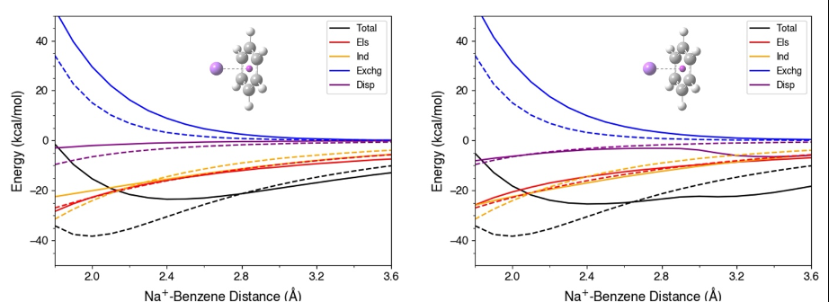
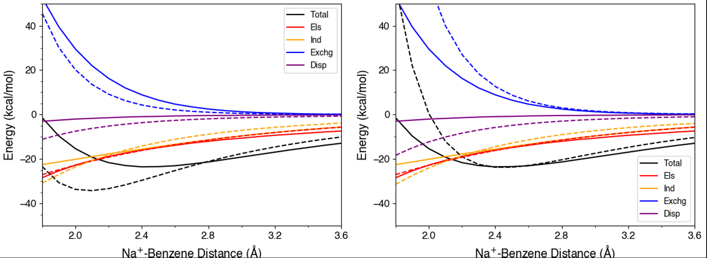
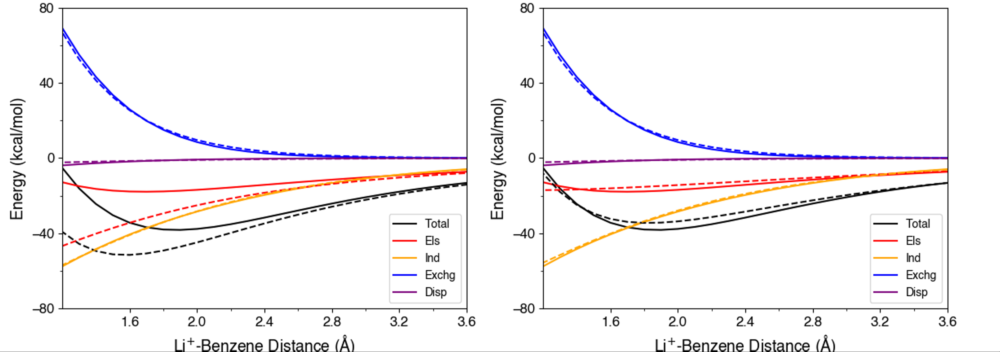
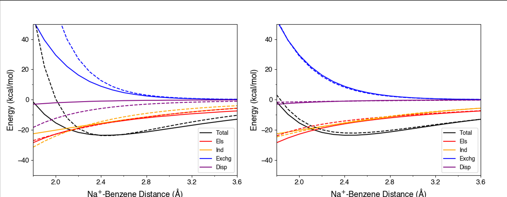
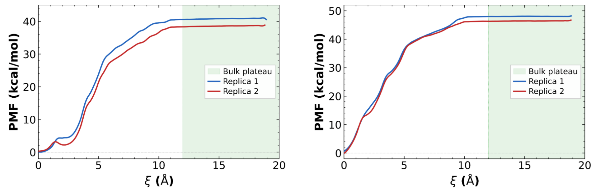

# （下篇）如何准确模拟阳离子-π相互作用？新型力场模型补齐关键短板

## 本文信息

- 标题：Advancing Cation–π Interaction Modeling: Development of Novel Force Field Models
- 作者：Richa Khatiwada, Sunil Kumar, Pengfei Li
- 发表时间：2026年6月4日（ChemRxiv预印本）
- DOI：https://doi.org/10.26434/chemrxiv.15004290/v1
- 单位：Loyola University Chicago, USA
- 引用格式：Khatiwada, R.; Kumar, S.; Li, P. (2026). Advancing Cation–π Interaction Modeling: Development of Novel Force Field Models. *ChemRxiv*.

本文承接上篇：[如何准确模拟阳离子-π相互作用？新型力场模型补齐关键短板](2026-06-16-cation-pi-interaction-modeling.md)

### SAPT vs sobEDA：能量分解方法的选择

**理论基础**：SAPT（**Symmetry-Adapted Perturbation Theory**）基于微扰理论，将两个分子间的相互作用能量分解为**四个物理分量**：

$$
E_{\text{int}} = E_{\text{elst}} + E_{\text{exch}} + E_{\text{ind}} + E_{\text{disp}}
$$

- $E_{\text{elst}}$（静电能）：**经典库仑相互作用**，反映永久电荷分布间的吸引/排斥
- $E_{\text{exch}}$（交换排斥）：源于**泡利原理**，当电子云开始重叠时产生的量子效应
- $E_{\text{ind}}$（诱导能）：一个分子的电荷使另一个分子产生**诱导偶极**，包含电荷诱导偶极和偶极诱导偶极
- $E_{\text{disp}}$（色散能）：**瞬时偶极-瞬时偶极相互作用**，即伦敦色散力

**计算方法**：本文使用**SAPT2+(3)δMP2/aug-cc-pVTZ**作为“金标准”：
- 对轻离子（$\ce{Li+}$、$\ce{Na+}$、$\ce{Mg^{2+}}$）使用**aug-cc-pVTZ基组**
- 对重离子（$\ce{K+}$、$\ce{Ca^{2+}}$、$\ce{Rb+}$、$\ce{Cs+}$）使用**def2-TZVPP基组**

**优势**：**物理意义明确**（每个分量对应明确的物理机制，可直接映射到力场各项）、**BSSE更可控**（SAPT不依赖超分子能量差直接相减，基组叠加误差（BSSE）问题更可控）和**数值稳定性**（在全扫描范围内保持平滑，**无非物理振荡**）

#### sobEDA：基于轨道的能量分解分析

**理论基础**：sobEDA（**Simplified Orbital-based Energy Decomposition Analysis**）基于**DFT波函数**进行能量分解：

$$
E_{\text{int}} = E_{\text{elst}} + E_{\text{exch}} + E_{\text{orb}} + E_{\text{disp}}
$$

- $E_{\text{orb}}$（轨道能）：包含**电荷转移和极化效应**，对应SAPT中的$E_{\text{ind}}$但定义不同

**计算方法**：使用**B3LYP泛函 + D3色散校正 + BJ阻尼**，统一使用**Def2-QZVP基组**，通过**Multiwfn程序**进行分解

| 特性 | 描述 |
|------|------|
| **计算效率高** | DFT计算比高级别微扰理论更快 |
| **易于实现** | Multiwfn等工具成熟，便于批量处理 |
| **非物理振荡** | 色散能曲线在2.4-3.2 Å区间出现明显的“抖动” |
| **阻尼依赖性** | 结果对阻尼参数敏感，不同距离区间的行为不一致 |

#### 为什么选择SAPT？

本文的benchmark结果明确表明：

| 对比维度 | SAPT | sobEDA |
|----------|------|--------|
| **色散能曲线** | 全程平滑 | 2.4-3.2 Å区间振荡 |
| **物理一致性** | 各分量物理意义清晰 | 分量间可能串扰 |
| **数值稳定性** | 微扰理论保证 | 依赖阻尼方案 |
| **计算成本** | 高（但值得） | 低（但不可靠） |

图1清晰地展示了这一差异：**SAPT曲线平滑自然**，而**sobEDA在关键区域出现非物理的“波浪”**。

> **参数化的核心原则**：对于力场参数化这种要求**高精度的任务**，**数值稳定性比计算速度更重要**——参数化一次，使用千万次，**基础参考数据的准确性不容妥协**。

**图1：SobEDA与SAPT能量分解对比**（左）SAPT2+(3)δMP2/aug-cc-pVTZ与12-6-4-NBFIX初始参数的对比，（右）SobEDA与12-6-4-NBFIX初始参数的对比。不同颜色的线表示总相互作用能和各能量分量，**实线表示SAPT/SobEDA结果**。SobEDA的色散能曲线在2.4-3.2 Å区间出现非物理振荡，而SAPT结果平滑且物理合理。

### Benchmark结果：参数化策略的重要性

在确定使用SAPT作为参数化基准后，本文进一步研究了参数优化策略，对比两种策略：

- **仅优化$C_4$参数**：固定$R_{\min}$，只优化诱导偶极项
- **同时优化$R_{\min}$和$C_4$参数**：**联合优化平衡距离和诱导偶极项**，提供更好的拟合灵活性

**图2：参数化策略对比**（左）仅优化$C_4$参数的结果，（右）同时优化$R_{\min}$和$C_4$参数的结果。不同颜色的线表示总相互作用能和各能量分量，**实线表示SAPT参考结果，虚线表示12-6-4-NBFIX模型结果**。同时优化两个参数能更准确地复现SAPT的总相互作用能和各能量分量。

关键发现：同时优化$R_{\min}$和$C_4$**不仅更准确地拟合总能量和各能量分量，还显著提升了参数的可迁移性**。对于单价金属离子（$\ce{Li+}$、$\ce{Na+}$、$\ce{K+}$、$\ce{Rb+}$、$\ce{Cs+}$），联合优化得到的离子-碳$C_4$值集中在**127-136 （kcal/mol）·Å$^4$的窄范围**内，而仅优化$C_4$的结果则分散在**85.5-180.5 （kcal/mol）·Å$^4$的宽范围**内。这说明**固定$R_{\min}$会迫使$C_4$吸收物理上无关的贡献**，导致参数失去可迁移性。

需要注意，原文没有给出一个可概括所有体系的“平均百分比误差”。它采用的证据更具体：12-6-4-NBFIX在多数体系中能较好复现SAPT的平衡距离$R_{\mathrm{eq}}$和相互作用能极小值$E_{\min}$，而ASPECT进一步改善全扫描范围内的能量分量；具体数值汇总在补充材料的Table S4中。

| 模型 | 主要优点 | 主要短板 | 更适合的用途 |
|------|----------|----------|--------------|
| 12-6 LJ | 简单、兼容性好 | 缺少$C_4/r^4$诱导项，短程分量偏差明显 | 普通有机体系的基线模型 |
| 12-6-4-NBFIX | 平衡距离和井深附近表现好，参数更易嵌入AMBER | 短程能量分量仍有系统偏差 | 大规模MD和自由能模拟 |
| ASPECT | 全扫描范围内更好复现SAPT能量分量 | 参数更多，过拟合风险更高 | 小体系机制分析和高精度参数开发 |

### 在生物体系中的验证

ASPECT模型还专门针对**蛋白质环境中的芳香氨基酸**进行了参数化；而CusF金属蛋白验证使用的是12-6-4-NBFIX模型。为了真实模拟阳离子-π相互作用在蛋白质中的发生方式，本文参数化了金属离子与三种芳香氨基酸（**Phe、Trp、Tyr**）的相互作用，使用**侧链类似物**将Cβ原子替换为甲基以保持π体系的完整性，电荷来源采用**AMBER ff19SB力场的原子电荷**并重新分布甲基氢原子电荷以确保等价性和电中性。虽然**His也是芳香氨基酸**，但它主要通过**咪唑氮配位**而非π电子，因此未纳入参数化。

> **参数化的几何约束**：并非所有包含芳香环的氨基酸都遵循阳离子-π相互作用机制。例如，$\ce{Rb+}$/$\ce{Cs+}$-Tyr体系在QM优化时**阳离子会结合在酚氧而非芳香环上**，这不符合阳离子-π相互作用的定义，强行参数化反而引入误差。类似地，CusF蛋白中的$\ce{Cu+}$-Trp相互作用涉及**整个π环的重原子参与配位**，这种情况下需要特殊处理：**所有芳香环重原子都被视为配位原子并保留$C_4$项**。

**图3：ASPECT模型的电荷穿透效应**（左）无电荷穿透修正的ASPECT模型与SAPT对比，（右）包含电荷穿透修正的ASPECT模型与SAPT对比。不同颜色的线表示总相互作用能和各能量分量，**实线表示SAPT结果**。引入电荷穿透项显著改善了短程静电相互作用的一致性，特别是对高价小离子如$\ce{Li+}$。

> 图2和图3相当于**消融实验（ablation study）**：图2展示了参数化策略的重要性——同时优化$R_{\min}$和$C_4$参数显著提升拟合精度和参数可迁移性；图3展示了电荷穿透修正的必要性——无穿透修正时ASPECT在短程静电相互作用上偏离SAPT标准，修正后在全范围与SAPT高度一致。

为了更直观地比较两种模型的性能，图4直接展示了12-6-4-NBFIX和ASPECT模型在$\ce{Na+}$-苯体系上的表现。$\ce{Na+}$-苯是一个**代表性的阳离子-π体系**：$\ce{Na+}$是单价离子，苯是最简单的芳香π体系，这个组合既**足够简单便于分析物理机制**，又**足够复杂代表阳离子-π相互作用的核心特征**。

**图4：12-6-4-NBFIX与ASPECT模型的直接对比**（左）12-6-4-NBFIX模型与SAPT对比，（右）ASPECT模型与SAPT对比。不同颜色的线表示总相互作用能和各能量分量，**实线表示SAPT结果**。虽然12-6-4-NBFIX在平衡距离和能量极小值附近准确，但ASPECT模型在全扫描范围内更好地复现了SAPT的各能量分量，特别是短程区域。

对比结果显示：12-6-4-NBFIX在平衡距离（**约2.5 Å**）和井深度附近的误差很小，但在短程区域（**<2.2 Å**）对静电能和诱导能的描述偏离SAPT参考。ASPECT模型通过**电荷穿透修正和Tang-Toennies阻尼**，在全扫描范围内与SAPT各能量分量保持高度一致，特别是在**短程区域表现出更高的保真度**。这说明ASPECT更适合**需要精确描述短程相互作用的场景**，而12-6-4-NBFIX则在**平衡性质预测上足够准确且计算效率更高**。

完成了小分子体系的验证后，本文进一步在**真实生物体系**中检验模型的预测能力。CusF金属蛋白提供了一个测试案例：它包含多种$\ce{Cu+}$配位模式（Trp44的阳离子-π相互作用、Met49的硫配位、His117的咪唑氮配位）。

**表1：CusF金属蛋白$\ce{Cu+}$结合自由能计算与实验对比**

| 体系 | Replica 1 势能差（kcal/mol） | Replica 2 势能差（kcal/mol） | 标准结合自由能（kcal/mol） | 实验值（kcal/mol） |
|------|---------------------|---------------------|---------------------|-------------------|
| **WT CusF** | -41.06 | -38.91 | -35.6 ± 1.2 | -11.1 ($K_1$) 或 -15.6 ($\beta_2$) |
| **W44M CusF** | -48.22 | -46.82 | -42.8 ± 1.0 | -13.7 ($K_1$) 或 -19.7 ($\beta_2$) |
| **差异** | -7.16 | -7.91 | **-7.2** | -2.6或-4.1 |

> **表格说明**：势能差（ΔWR）是通过伞状采样从PMF曲线计算得到的$\ce{Cu+}$从体相到结合位点的自由能变化。两次独立的replica用于评估采样收敛性，标准结合自由能是基于两次replica的平均值并包含统计误差。实验值来自两种不同的测量条件（$K_1$：单结合位点常数；$\beta_2$：双结合位点常数）。

图5：CusF金属蛋白中$\ce{Cu+}$结合的势能面（左）野生型CusF的PMF曲线，（右）W44M突变体的PMF曲线。两条独立的replica显示出良好的一致性。绿色阴影区域表示PMF曲线已收敛的体相平台区。

PMF曲线展示了两组独立模拟的收敛性：**replica之间的重合度高**，体相区域（绿色阴影）的**平台稳定**，表明采样充分。关键的发现是：虽然**绝对结合自由能与实验存在差异**（这是绝对自由能计算的固有挑战），但两组replica都**一致预测W44M突变体的结合更强**，差异为**7.2 kcal/mol**。

这一预测与实验观察**定性一致**：实验也表明W44M结合亲和力更高，相对差异为-2.6到-4.1 kcal/mol，可能是W44M突变用Met替代Trp44显著改变了配位环境，从而直接检验新模型对结合亲和力变化的预测能力。

> 小编锐评：一个糟糕的Benchmark。。建议别整构象变化。

计算值比实验更负，原文只谨慎指出绝对蛋白-离子结合自由能本身很难精确预测；更稳妥的解读是，**模型捕捉到了突变效应的方向**，即W44M相对WT结合更强。

> **12-6-4-NBFIX vs ASPECT的权衡**：本文强调**ASPECT模型在全扫描范围的能量分量上更准确**，但不一定在平衡距离和井深度上优于12-6-4-NBFIX。这是因为**12-6-4-NBFIX专门针对平衡几何优化**，而**ASPECT的损失函数包含全范围势能面**。用户需要根据具体需求选择：**关注平衡性质选12-6-4-NBFIX**，**关注全范围动力学选ASPECT**。

---

## 关键结论与批判性总结

### 优势：从物理本质到工程实现的完整解决方案

#### 1. 物理完整性：抓住$r^{-4}$项的本质
12-6-4-NBFIX的核心优势在于**正确分离不同距离依赖的物理机制**：诱导偶极（$r^{-4}$）和色散（$r^{-6}$）是两种截然不同的过程，强行塞进同一项必然导致拟合妥协。**显式的$C_4/r^4$项**让力场有了正确的物理骨架。ASPECT进一步通过**三重短程修正**（Buckingham排斥+Tang-Toennies阻尼+电荷穿透）解决系统性偏差。

> **物理完整性关键**：参数化只能调参数，不能改函数形式。函数形式的物理前提错误，再多的参数优化也只是“错误道路上狂奔”。

#### 2. 参数化策略：从经验调优到理性设计
传统力场参数化常陷入“调参”陷阱：为匹配数据不断修改参数，物理意义逐渐模糊。本文的NBFIX协议和联合优化避免了这一陷阱：

- **NBFIX协议**：$R_{\min,ij}$与组合规则解耦，每个离子-π配对有独立平衡距离参数
- **联合优化**：$R_{\min}$和$C_4$各司其职，而非让$C_4$吸收$R_{\min}$错误导致的偏差
- **SAPT基准**：量子力学能量分解提供物理意义明确的参考数据

#### 3. 可迁移性：从“拟合数据”到“预测体系”
参数化的终极目标是**预测新体系**，而非复现训练集。CusF蛋白验证是**严格的独立性测试**——$\ce{Cu+}$在CusF中与多个配位残基相互作用。但模型正确预测了这一反直觉趋势（计算：7.2 kcal/mol差异），说明参数确实捕捉了**离子-配体相互作用的复杂物理规律**，而非简单地“拟合了阳离子-π数据”。

#### 4. 计算效率：物理准确性的“性价比”

相比于其他改进路径，本文方案的优势在于**可嵌入性和兼容性**：

| 方法 | 物理完整性 | 计算成本 | 参数化难度 | 与现有力场兼容 |
|------|-----------|----------|-----------|----------------|
| **12-6-4-NBFIX** | 高（$r^{-4}$项显式） | 低 | 中（需SAPT参考和成对参数） | 高（主要添加NBFIX参数） |
| **显式极化力场** | 最高（动态响应） | 高 | 高（需极化参数） | 低（需重写力场） |
| **QM/MM** | 最高（全量子） | 很高 | N/A（无通用力场） | 低（需定义QM区域） |
| **ASPECT** | **高-最高（两模型可选）** | **低到中** | **中** | **高** |

### 局限性与未来方向

1. **蛋白体系验证仍有限**：除CusF/W44M案例外，还需要更多真实金属蛋白和配体体系验证可迁移性
2. **参数空间更大**：ASPECT能量分量更准确，但参数更多，原文明确提醒需要独立数据验证以避免过拟合
3. **扩展离子和π体系**：当前重点覆盖碱金属、Mg/Ca以及CusF中的Cu，更多过渡金属和非典型π体系仍需单独参数化
4. **环境效应仍需检验**：小分子参数主要基于气相QM-EDA，进入显式溶剂和复杂蛋白口袋后仍可能需要体系级验证

> 小编锐评：
>
> - 最终只是Benchmark了阳离子-π相互作用，而不是针对其设计，略显标题党，当然最终也还是要把所有的都算准。基础扎实才能设计出好模型。
> - 长程想要算准还是有难度。长程算准很有助于随机撒离子和蛋白接触的MD模拟，虽然这篇主要说的是改善近程。
> - 应尽早建立金属和蛋白在各个距离和环境下互作的Benchmark（高精度QM计算）。
