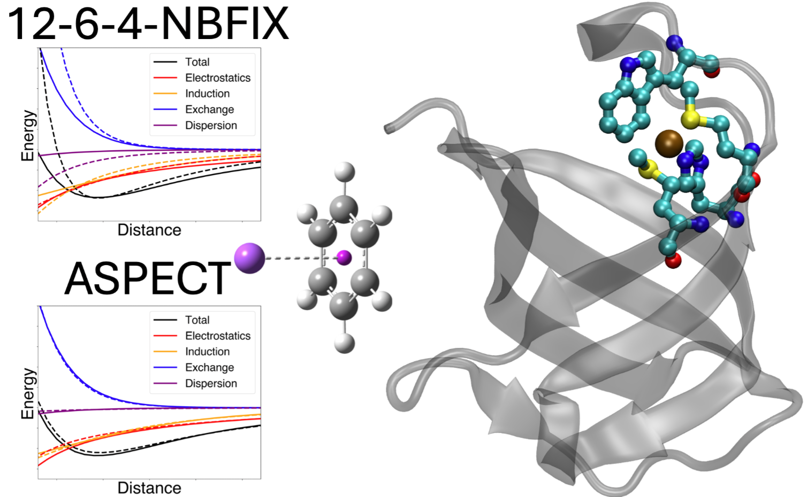

# （上篇）如何准确模拟阳离子-π相互作用？新型力场模型补齐关键短板

## 本文信息

- 标题：Advancing Cation–π Interaction Modeling: Development of Novel Force Field Models
- 作者：Richa Khatiwada, Sunil Kumar, Pengfei Li
- 发表时间：2026年6月4日（ChemRxiv预印本）
- DOI：https://doi.org/10.26434/chemrxiv.15004290/v1
- 单位：Loyola University Chicago, USA
- 引用格式：Khatiwada, R.; Kumar, S.; Li, P. (2026). Advancing Cation–π Interaction Modeling: Development of Novel Force Field Models. *ChemRxiv*.

> 阳离子-π相互作用是阳离子与富电子π体系之间的非共价吸引力，在生物分子识别、蛋白质折叠、酶催化和超分子组装中扮演关键角色。尽管分子动力学模拟广泛用于研究此类体系，准确建模阳离子-π相互作用仍然具有挑战性。经典的Lennard-Jones（12-6）势能不足，因为它忽略了电荷诱导偶极效应。本文开发了两种新型力场模型：12-6-4-NBFIX模型（在标准12-6势基础上添加诱导偶极项）和ASPECT模型（引入Buckingham排斥、Tang-Toennies阻尼和电荷穿透修正），旨在系统性地解决这一缺陷。

### 核心结论

- **支持离子范围**：完整参数化碱金属全系列（$\ce{Li+}$、$\ce{Na+}$、$\ce{K+}$、$\ce{Rb+}$、$\ce{Cs+}$）和碱土金属（$\ce{Mg^{2+}}$、$\ce{Ca^{2+}}$），并在CusF金属蛋白中验证$\ce{Cu+}$，覆盖生物体系常见阳离子
- 12-6-4-NBFIX模型：在12-6 LJ势基础上添加诱导偶极项，显著提升阳离子-π结合能准确性
- ASPECT模型：引入Buckingham排斥、Tang-Toennies阻尼和电荷穿透修正，更适合需要短程能量分量准确性的场景
- SAPT vs sobEDA：系统比较表明SAPT（对称匹配微扰理论）能量分解更适合用于参数化，sobEDA在特定区间出现非物理振荡
- Benchmark验证：新模型在多种阳离子-π复合物中显著优于传统12-6 LJ模型

---

### 关键科学问题

本研究旨在解决以下核心问题：

1. **12-6 LJ势能的根本缺陷**：传统Lennard-Jones势能忽略了电荷诱导偶极效应，导致阳离子-π结合能和结合常数预测可能出现系统偏差
2. **能量分解方法的选择**：SAPT和sobEDA两种QM-EDA方法哪种更适合用于力场参数化？如何避免非物理振荡？
3. **参数化策略**：如何在保持计算效率的前提下，将诱导偶极效应整合到现有力场框架中？

## 背景

### 阳离子-π相互作用的重要性与广泛性

阳离子-π相互作用是自然界中普遍存在的一类非共价相互作用，其结合能跨度极大：从$\ce{Cs+}$-苯的-8.7 kcal/mol到$\ce{Be^{2+}}$-苯的-223.1 kcal/mol。这种强烈的敏感性取决于离子的电荷、尺寸以及π体系的极化率，使得该相互作用在化学和生物环境中具有独特的调控功能。

#### 典型实例

阳离子-π相互作用在蛋白质结构和功能中扮演关键角色，以下是几个代表性例子：

| 体系 | 离子类型 | 芳香残基 | 功能描述 |
|------|---------|----------|----------|
| **乙酰胆碱酯酶** | 乙酰胆碱（季铵盐） | Trp84、Phe330 | 神经信号传导：乙酰胆碱通过阳离子-π相互作用与活性位点芳香残基结合，水解神经递质 |
| **CheY蛋白** | $\ce{Mg^{2+}}$ | Phe | 细菌趋化反应：$\ce{Mg^{2+}}$与Phe残基的阳离子-π相互作用稳定CheY的活性构象，调控磷酸化反应 |
| **CusF金属伴侣蛋白** | $\ce{Cu+}$ | Trp44 | 铜转运：$\ce{Cu+}$与Trp44形成阳离子-π motif，W44M突变导致结合亲和力变化**7.2** kcal/mol |
| **神经受体** | Lys、Arg（侧链） | Phe、Tyr、Trp | 蛋白质结构稳定：带正电的氨基酸侧链与芳香残基形成阳离子-π网络，维持蛋白质三级结构 |

在材料科学领域，阳离子-π相互作用同样发挥重要作用：

- **分子吸附**：用于气体分离和纯化
- **环境修复**：重金属离子捕获和污染治理
- **纳米工程**：自组装材料和传感器设计

由于其结合强度通常超过氢键，阳离子-π相互作用被认为是超分子组装和主客体化学中的“强力胶水”。

#### 经典力场在阳离子-π建模中的根本缺陷

尽管分子动力学模拟已成为研究此类体系不可或缺的工具，但其准确性严重依赖底层力场。传统的12-6 Lennard-Jones势能仅包含两个物理项：

$$
V_{12-6}(r) = \dfrac{A}{r^{12}} - \dfrac{B}{r^6}
$$

这一简化假设在处理阳离子-π体系时遇到三个致命问题：

1. **物理项缺失导致的能量低估**：
   - **诱导偶极效应**占总相互作用能的**20-40**%，这在高价离子（如$\ce{Mg^{2+}}$、$\ce{Ca^{2+}}$）与大π体系（如多环芳烃）的相互作用中尤为显著
   - 12-6势能将诱导偶极项（$r^{-4}$依赖）强行塞进色散项（$r^{-6}$依赖）中，导致无法分别拟合两种不同距离依赖的物理机制
   - 结果就是：平衡距离和结合能可能同时出现系统偏差，尤其在高电荷密度离子附近更明显；原文引用的OPLS-AA阳离子-π研究指出，省略$C_4$项可使蛋白-配体结合或抑制常数误差达到**1-3个数量级**

2. **短程物理的集体失效**：
   - 当阳离子与π体系距离**小于3.5 Å**时，**三个量子效应同时显现**
     - **电荷穿透**：点电荷模型高估静电吸引，因为电子云开始重叠
     - **交换排斥过陡**：$r^{-12}$项上升太快，无法真实描述泡利排斥
     - **色散/诱导无阻尼**：$r^{-6}$和$r^{-4}$项在短程产生非物理的过强吸引
   - 这些缺陷在**蛋白质-金属离子界面尤为致命**，因为金属结合位点通常涉及多个配体的紧密协同，**短程误差会被放大**

3. **短程方向性与电子云分布被过度简化**：
   - π体系的电子云并非球形分布，不同区域的电子密度差异显著
   - 经典12-6势能依赖简单的原子对距离项，难以直接表达短程电子云重叠、电荷穿透和阻尼效应
   - 对需要精确描述结合位点几何的生物模拟，这种简化可能带来结构和能量偏差

### 现有改进方法的局限性

针对12-6模型的缺陷，已有多种改进方案被提出，但各有利弊：

| 方法类型 | 代表案例 | 优势 | 局限性 |
|---------|----------|------|--------|
| **12-6-4模型** | OPLS-AA阳离子-π参数 | 添加诱导偶极项，计算高效 | 参数化策略不一致，短程仍有偏差 |
| **显式极化力场** | Drude振子、AMOEBA | 物理描述完整，动态响应 | 计算成本高3-5倍，参数化复杂 |
| **QM/MM混合方法** | ONIOM、QMregion | 高精度，灵活 | 效率低，不适用于大规模MD |
| **高阶多极展开** | AMOEBA多极子 | 包含四极子等高阶项 | 参数爆炸，收敛困难 |

关键gap在于：**缺乏一种既保持计算效率又能准确描述短程物理的力场框架**。现有的12-6-4模型虽然方向正确，但在参数化策略和短程修正上仍有系统性偏差需要解决。

本文提出的12-6-4-NBFIX和ASPECT模型正是为了填补这一gap：前者通过NBFIX协议和联合优化提升可迁移性，后者通过三重物理修正实现全范围的能量分量准确。

---

## 研究内容

### 为什么12-6-4模型对阳离子-π相互作用特别有效？

> **核心物理机制**：12-6-4模型并非专门为阳离子-π相互作用设计，而是针对**高电荷系统（highly charged systems）**的通用改进方案。阳离子-π相互作用之所以特别受益于此模型，是因为它完美符合高电荷系统的两个特征：**阳离子的高电荷密度**和**π体系的高极化率**。

传统12-6 Lennard-Jones势能**忽略charge-induced dipole（电荷诱导偶极/极化）效应**。当高电荷阳离子接近芳香π体系时，会发生**强烈的ion-induced dipole相互作用**：阳离子的电场诱导π体系产生偶极矩，这个诱导偶极又与阳离子相互作用，产生额外的吸引力。这种诱导偶极能与距离的$r^{-4}$**成比例**，在12-6模型中被强行塞进$r^{-6}$**色散项**中，无法准确描述。

12-6-4模型通过显式添加$C_4/r^4$诱导偶极项，专门解决了这一问题。**四次方反比距离依赖的正确描述**是模型成功的关键——它让诱导偶极效应有了自己的物理项，不再与色散项混淆。这也解释了为什么模型对高价小离子（如$\ce{Li+}$、$\ce{Mg^{2+}}$）特别有效：它们电荷密度高，诱导偶极效应强，$r^{-4}$项的贡献尤为显著。

> **推广到其他离子-配体体系**：虽然本文聚焦于阳离子-π相互作用，但12-6-4模型对其他高电荷系统同样适用。任何包含高电荷离子（如金属离子）和高极化率配体（如卤素、硫、富电子基团）的体系都会受益于$r^{-4}$诱导偶极项的显式描述。这解释了为什么原文提到模型适用于“ion–ligand interactions”而非仅限于阳离子-π体系。

### 两种新模型的设计理念

本文提出两种互补的力场改进策略：

- **12-6-4-NBFIX模型**：在标准12-6 LJ势基础上添加$C_4/r^4$诱导偶极项，通过NBFIX协议和联合优化提升参数可迁移性
- **ASPECT模型**：在12-6-4基础上进行三重物理修正（Buckingham排斥+Tang-Toennies阻尼+电荷穿透），实现全范围的能量分量准确

| 特性 | 12-6-4-NBFIX | ASPECT |
|------|--------------|--------|
| **核心改进** | 添加$C_4/r^4$诱导偶极项 | 三重修正：Buckingham排斥+Tang-Toennies阻尼+电荷穿透 |
| **适用范围** | 平衡距离附近的高精度 | 全扫描范围的能量分量准确 |
| **参数数量** | 3个（$R_{\min}, \epsilon, C_4$） | 更多（含阻尼参数和屏蔽参数） |
| **过拟合风险** | 较低 | 需要验证独立数据 |
| **实现复杂度** | 较低，主要增加成对非键参数 | 较高，需要更多阻尼和屏蔽参数 |
| **推荐场景** | 大规模MD模拟、高通量筛选 | 高精度要求的小体系、机制研究 |

#### 12-6-4-NBFIX模型：添加物理诱导偶极项

在标准12-6 LJ势基础上添加$C_4/r^4$项：

$$
U_{ij}(r_{ij}) = \epsilon_{ij}\left[\left(\frac{R_{\min,ij}}{r_{ij}}\right)^{12} - 2\left(\frac{R_{\min,ij}}{r_{ij}}\right)^6\right] - \frac{C_4^{ij}}{r_{ij}^4} + \frac{e^2 Q_i Q_j}{r_{ij}}
$$

其中$r_{ij}$是原子间距，$Q_i$和$Q_j$是原子局部电荷，$R_{\min,ij}$和$\epsilon_{ij}$分别是Lennard-Jones势能的平衡距离和井深度。按照NBFIX协议，$R_{\min,ij}$作为自由可调的成对参数，与组合规则解耦。由于$\epsilon_{ij}$对势能面的影响相对较小，除CusF体系外固定为**0.1 kcal/mol**。

> 该模型的优势在于**最小化改动**：仅需在现有力场框架下添加一项，无需引入复杂的极化算法。

#### ASPECT模型：三重物理修正的精密版本

ASPECT（*Ab initio* Screened Pauli-repulsion, Electrostatics and Classical Tang-Toennies）模型在12-6-4基础上进行了**三重物理修正**，专门解决短程区域的系统性偏差：

$$
U_{ij}(r_{ij}) = \frac{C_{12}^{ij}}{r_{ij}^{12}} + C_{e,ij} e^{-C_{e,ij}' r_{ij}} - f_6(r_{ij}) \frac{C_6^{ij}}{r_{ij}^6} - f_4(r_{ij}) \frac{C_4^{ij}}{r_{ij}^4} + E_{\text{elec}}^{\text{CP}}
$$

##### 修正1：Buckingham指数排斥项

用指数排斥项替代$r^{-12}$排斥项，更真实地描述交换排斥作用。ASPECT模型在Buckingham指数项基础上，添加一个固定的$C_{12}$项来防止极短距离下的势能翻转：

- $C_{12}^{ij}$固定为**100** kcal/mol·Å$^{12}$
- $C_{e,ij}$固定为$10^5$ kcal/mol
- $C_{e,ij}'$作为唯一的可调排斥参数

这种设计既保留了Buckingham势能的优势，又避免了Exp-6势能在极短距离下非物理塌陷的问题。

##### 修正2：Tang–Toennies阻尼函数

对色散项（$C_6/r^6$）和诱导偶极项（$C_4/r^4$）分别施加阻尼：

$$
f_n(r_{ij}) = 1 - e^{-b_{ij} r_{ij}} \sum_{k=0}^{n} \frac{(b_{ij} r_{ij})^k}{k!}
$$

其中$n=6$时用于色散项，$n=4$时用于诱导偶极项，参数$b_{ij}$控制电子云重叠的范围。

> **物理图像**：当两个原子距离很远时（$r_{ij}$很大），阻尼函数$f_n(r_{ij}) \approx 1$，色散和诱导项按正常的$r^{-6}$和$r^{-4}$衰减。但当它们靠近（$r_{ij}$减小）到电子云开始重叠的程度时，阻尼函数$f_n(r_{ij})$逐渐趋向于0，让色散和诱导项逐渐衰减到0，避免非物理的过强吸引。这就是原文提到的“**spurious over-attraction as atoms approach**”问题的解决方案。

##### 修正3：电荷穿透修正

经典点电荷模型在短程会高估静电吸引。ASPECT的核心思想是**把一个原子的点电荷$Q_i$拆分为正电荷核（$Z_i$）和负电荷电子云（$-N_i$）**，其中$N_i = Z_i - Q_i$是电子数。这样两个原子间的相互作用就从经典的一项：

$$
\frac{Q_i Q_j}{r_{ij}} = \frac{(Z_i - N_i)(Z_j - N_j)}{r_{ij}}
$$

变成$2 \times 2 = 4$项的经典库伦相互作用：

$$
E_{\text{elec}}^{\text{CP}} = \underbrace{\sum_{i,j>i} \frac{Z_i Z_j}{r_{ij}}}_{\text{核-核排斥}} - \underbrace{\sum_{i,j>i} \frac{Z_i N_j}{r_{ij}} f_{\text{damp},j}(r_{ij})}_{\text{核-电子吸引}} - \underbrace{\sum_{i,j>i} \frac{N_i Z_j}{r_{ij}} f_{\text{damp},i}(r_{ij})}_{\text{电子-核吸引}} + \underbrace{\sum_{i,j>i} \frac{N_i N_j}{r_{ij}} f_{\text{damp},ij}^{\text{overlap}}(r_{ij})}_{\text{电子-电子排斥}}
$$

> **各项的物理意义**：把每个原子的点电荷拆成**核**和**电子云**两部分，两两相互作用产生四项。每项都是经典的$\frac{\text{电荷}_1 \times \text{电荷}_2}{r}$库伦形式，但吸引项（核-电子、电子-核）加了阻尼函数，而排斥项（核-核、电子-电子）不加或加不同的阻尼。这样在短程时，吸引项被阻尼削弱，排斥项相对保持，从而“软化”总静电吸引。

**数学等价性验证**：忽略阻尼时，ASPECT与点电荷模型完全等价：$Z_i Z_j - Z_i N_j - N_i Z_j + N_i N_j = (Z_i-N_i)(Z_j-N_j) = Q_i Q_j$。这证明了分解的正确性。**阻尼函数的非对称作用**（削弱吸引>削弱排斥）确保了与SAPT量子计算的一致性，**图3验证了这一点**。

> **为什么核-核排斥不加阻尼？**因为原子核是极小的点状物体（~$10^{-15}$ m），在分子相互作用距离（~Å = $10^{-10}$ m）下**永远不会重叠**，始终遵循经典$1/r$库伦排斥。**只有电子云**（大小~Å）才会在短程重叠，所以核-电子、电子-核和电子-电子相互作用需要阻尼修正。阻尼函数形式：$f_{\text{damp}}(r) = 1 - e^{-\alpha r}$，$r$很大时$f_{\text{damp}} \approx 1$（无阻尼），$r$很小时$f_{\text{damp}} \rightarrow 0$（完全阻尼）。

**参数化策略**：ASPECT采用混合损失函数，同时优化总能量和各能量分量：

$$
L = (1-\gamma) \text{MSE}(E_{\text{total}}) + \gamma \sum_{C \in \{\text{exchange, induction, dispersion}\}} \text{MSE}(E_C)
$$

其中$\gamma = 0.4$，确保模型既能复现总能量，又能正确描述各物理分量的贡献。

### 参数化策略：从初始参数到优化

#### 初始参数获取

本文采用系统的参数化策略，首先从基本物理量推导初始参数：

- **苯分子体系**：苯分子几何在B3LYP-D3/6-31G\*水平优化。原子局部电荷通过RESP算法在HF/6-31G\*水平获得，与标准AMBER12和GAFF协议一致。每个碳原子电荷为-0.129444e，每个氢原子电荷为+0.129444e
- **芳香氨基酸建模**：将Phe、Trp、Tyr的侧链Cβ原子替换为甲基，保持π体系完整性。原子电荷来自AMBER ff19SB力场，重新分布甲基氢原子电荷以确保等价性和电中性
- **初始参数公式**：基于我们先前研究的框架，从原子电荷和极化率推导初始$R_{\min}$和$C_4$参数

$$
R_{\min,ij} = 2 \cdot 2.54 \left(\frac{\alpha_i + \alpha_j}{2}\right)^{1/7}
$$

$$
C_4^{ij} = \frac{1}{2}\alpha_j\left(\frac{q_i}{4\pi\epsilon_0\epsilon_r}\right)^2
$$

其中$\epsilon_0$为**真空介电常数**，$\epsilon_r$为**相对介电常数**（设为1），金属离子的极化率来自我们先前的研究。

#### CusF W44M突变体验证方法

**具体方法流程**：

- **体系构建**：WT CusF结构取自**PDB 2VB2**，W44M结构通过QM/MM优化获得。基于AMBER ff19SB蛋白力场，使用$\ce{Cu+}$的12-6-4参数集和**TIP3P水模型**
- **金属位点处理**：从金属蛋白中截取金属位点，用甲基capped配位残基的侧链末端。在**B3LYP-D3BJ/6-31G\*水平**进行QM几何优化，然后刚性扫描所有$\ce{Cu}$-配体距离（-0.4至+1.0 Å，步长0.1 Å）
- **能量分解分析**：在**B3LYP-D3BJ/Def2-QZVP水平**进行sobEDA能量分解分析，将$\ce{Cu+}$和每个配位残基视为独立片段（共5个片段）评估片段间相互作用能
- **参数优化**：优化$\ce{Cu+}$与配位原子间的$R_{\min,ij}$和$C_4$参数以复现计算相互作用能，**特别关注匹配平衡距离、井深和平衡点附近的势能面形状**
- **MD模拟**：优化的参数先在真空中短时间MD验证，然后用于**TIP3P水溶液**中的CusF和W44M突变体模拟。准备协议包括能量最小化、NVT加热、NPT平衡和进一步NVT平衡
- **伞状采样**：使用steered MD生成伞状采样窗口的初始结构。**以$\ce{Cu+}$相对配位残基的集体变量（collective variable）为反应坐标**，每个系统模拟**62个窗口**，每个窗口**0.2 ns平衡和5 ns生产**，WT和W44M各**310 ns采样**。**弱骨架约束应用于整个过程以防止蛋白被金属离子拖走**

更多内容请期待明天的下篇。
