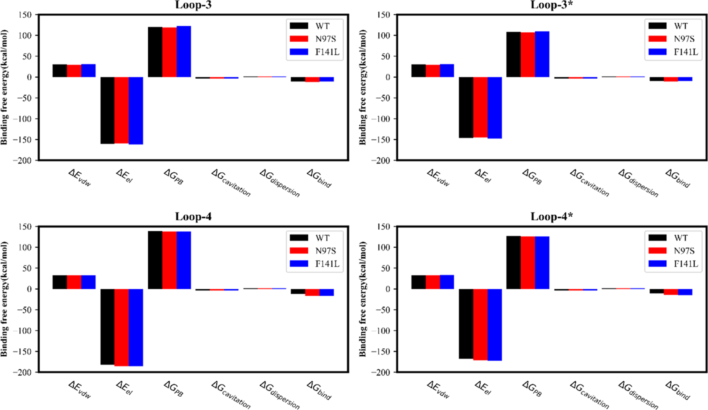

# ECCR电荷缩放与MM-PBSA钙调蛋白结合自由能计算细节

## 方法概括

> Basit等（2022）的目标不是用严格的 ABFE 直接计算 $\ce{Ca^{2+}}$ 结合自由能，而是建立**低成本的 CaM 突变体亲和力预测模型**。

体系为人源calmodulin，初始结构采用 $\ce{Ca^{2+}}$ 饱和的晶体结构PDB 1CLL（1.70 Å）；研究重点是C-lobe的两个EF-hand，即loop-3和loop-4。所有17个突变体直接由1CLL对应残基突变得到，质子化状态由PDB2PQR在中性pH下确定。

### 1. 基础MD体系参数

以下参数来自正文Section 2（离子电荷与补偿见SI Table S1/S2），已核对完整：

| 参数项 | 具体设置|
| -------------------- | ------------------------------------- |
| 软件  | AMBER 16  |
| 蛋白力场| ff14SB |
| 水模型 | TIP3P  |
| 水盒边界| 10 Å|
| 盐浓度 | 0.15 M $\ce{KCl}$|
| $\ce{K^+}$/$\ce{Cl^-}$ 参数| Joung–Cheatham |
| $\ce{Ca^{2+}}$ LJ参数 | Li–Merz 2013（12-6 LJ，正文引用48）  |
| 温度  | 298 K，Langevin thermostat，碰撞频率 $2~\mathrm{ps}^{-1}$ |
| 压力  | Berendsen barostat，1 bar|
| 长程静电| PME |
| 约束  | SHAKE约束含H键，时间步长2 fs |

采样策略比较：作者最初对WT、N97S、F141L跑了200 ns轨迹并分析后100 ns，随后发现10条20 ns与10条2 ns轨迹的平均MM-PBSA结果接近，因此最终17个突变体主要采用**10条独立2 ns轨迹**。这个设计本质是multiple short replicas，目的是**降低平均值的标准误**，而非充分探索CaM的慢构象变化。作者自己也承认**2 ns不能充分描述CaM构象涨落**。

---

## 2. ECCR电荷修改规则

这篇并没有重新拟合新的 $\ce{Ca^{2+}}$ LJ参数。它以Li–Merz 12-6 $\ce{Ca^{2+}}$ 参数为基础，**只修改静电部分**：

**Table 1：ECCR电荷缩放规则（SI Table S2）**

| 离子 |  标准电荷 |  ECCR |
| -------------- | ----: | ----: |
| $\ce{Ca^{2+}}$ | +2.00 | +1.50 |
| $\ce{K^{+}}$| +1.00 | +0.75 |
| $\ce{Cl^{-}}$  | −1.00 | −0.75 |

> 电荷规则的全部物理内容就是**统一乘0.75，用平均场方式近似电子极化**，缩放因子来自 $1/\sqrt{\varepsilon_\text{el}} \approx 0.75$（水的电子介电常数约1.78）。

### 蛋白如何补偿少掉的 +0.5e？

这里SI给得很具体。一个 $\ce{Ca^{2+}}$ 由 +2.0变成 +1.5，相当于体系少了 +0.5e。因此作者把每个EF-hand中Ca附近的一组O原子**统一调得稍微不那么负**，总共补回 +0.5e。完整逐原子数值在SI Table S1，以下为核心规律：

- **Loop-3**：选8个氧原子，**每个O增加 +0.0625e**
- **Loop-4**：选9个氧原子，**每个O增加 +0.0556e**

Asp/Glu的**两个羧酸O都修改**，**并不只修改晶体结构中直接朝向钙离子的那个O**。例如loop-3选了Asp93、Asp95（两个羧酸O均修改）、Asn97（侧链O）、Tyr99（O）、Glu104（两个羧酸O均修改），一共8个O。Loop-4选了Asp129、Asp131、Asp133（三个Asp共6个羧酸O）、Gln135（O）、Glu140（两个羧酸O），一共9个O。

**图5：loop-3与loop-4结合位点残基排布与电荷补偿氧原子**。左图为loop-3，右图为loop-4，单字母缩写加残基编号标注各配位残基，W代表结合位点中的水分子。图中显示直接配位 $\ce{Ca^{2+}}$ 的氧原子包括Asp/Glu的羧酸氧、Asn/Gln的酰胺氧、Tyr的酚羟基氧。ECCR电荷补偿即对这些预先指定的氧原子统一施加 +0.0556e到 +0.0625e的小增量，使蛋白总电荷保持整数。

这点对你的体系很重要：

> ECCR 的电荷补偿**不是「看到 Ca 附近几个 O 就自动重新拟合」的算法**，而是人为指定一组 EF-hand 邻近 O 再做总电荷补偿——迁移时补偿组要自己重新定义。

---

## 3. MM-PBSA计算协议

使用AMBER的MMPBSA.py，**采用single-trajectory protocol**：receptor和 $\ce{Ca^{2+}}$ 轨迹都从同一条CaM–$\ce{Ca^{2+}}$ 复合物轨迹中提取。

基本形式是：

$$
\Delta G_\text{bind} \approx \Delta E_\text{MM} + \Delta G_\text{solv} - T\Delta S
$$

但这篇**直接忽略** $T\Delta S$。能量分解为：

$$
\Delta E_\text{MM} = \Delta E_\text{vdW} + \Delta E_\text{el}
$$

$$
\Delta G_\text{solv} = \Delta G_\text{PB} + \Delta G_\text{cavitation} + \Delta G_\text{dispersion}
$$

PB计算参数如下：

| 参数  | 数值  |
| ------------------------------- | ------ |
| 离子强度| 0.15 M |
| 溶剂介电常数| 78.35  |
| 溶质内介电常数 $\varepsilon_\text{in}$ | 8|

其中 $\varepsilon_\text{in} = 8$ 不是无先验选择：作者在之前的CaM工作中比较后发现8效果最好，本论文沿用8。

> 这意味着整套MM-PBSA protocol**自带一项针对CaM体系的经验校准**——换体系复用时，$\varepsilon_\text{in}$ 需要重新权衡。

---

## 4. 两个EF-hand的协同性处理

实验给的是CaM C-lobe两个位点的宏观结合亲和力。作者**分别计算四种site-specific过程**：

| 符号 | 含义  |
| ---------------- | --------------------------------------------------- |
| $\Delta G_3$  | loop-4为空时，$\ce{Ca^{2+}}$ 结合loop-3|
| $\Delta G_{4,3}$ | loop-3已有 $\ce{Ca^{2+}}$ 时，$\ce{Ca^{2+}}$ 结合loop-4 |
| $\Delta G_4$  | loop-3为空时，$\ce{Ca^{2+}}$ 结合loop-4|
| $\Delta G_{3,4}$ | loop-4已有 $\ce{Ca^{2+}}$ 时，$\ce{Ca^{2+}}$ 结合loop-3 |

最终按以下公式平均：

$$
\Delta G_\text{bind} = \dfrac{\Delta G_3 + \Delta G_{4,3} + \Delta G_4 + \Delta G_{3,4}}{4}
$$

得到每个位点平均的宏观结合自由能（即论文里的 $\Delta G_\text{bind}/2$，**与实验报告的每位点平均值 −7.64 kcal/mol直接可比**；论文的 $\Delta G_\text{bind}$ 全量是它的两倍）。SI Figure S1给出了完整的计算流程。

> 这样处理的理由：每个site-specific过程都依赖另一位点的占据状态，**四种过程平均之后，才对应实验测到的那一个数**。

**图2：钙调蛋白C-lobe两个EF-hand的两步钙离子结合自由能定义**。白色圆圈为空位点（左为loop-3），红色圆圈为已结合 $\ce{Ca^{2+}}$ 的位点；$\Delta G_{x,y}$ 表示当位点y已被占据时 $\ce{Ca^{2+}}$ 结合位点x的自由能变化。

**图S1（论文Supporting Information Figure S1）**：从复合物轨迹提取受体与配体、四种site-specific过程到宏观结合自由能的完整流程。

---

## 结果到底有多好？

> 先立一个分界：**原始 MM-PBSA 结果**和**后面的回归拟合结果**是两回事，评价要分开，别被 0.3 kcal/mol 的表面精度带偏。

### 1. ECCR确实明显改善了普通ff14SB

以10 × 2 ns结果为例：

| 系统 | STD ff14SB |ECCR | 实验 |
| ----- | ---------: | --------: | ----: |
| WT |  −11.04 | **−8.10** | −7.64 |
| N97S  |−9.90 | **−8.46** | −6.81 |
| F141L |  −11.61 | **−8.19** | −6.62 |

单位均为kcal/mol。对这几个体系，**标准 +2e 钙离子明显过强结合**；简单的电荷缩放把结果大幅拉向实验值。
> −11.04/−9.90/−11.61 kcal/mol 是正文 Table 5 报告的 STD（标准 ff14SB，正文字脚注注明括号里是 SEM）下的 10 条 2 ns 轨迹均值；ECCR 的 −8.10/−8.46/−8.19 是等价的 ECCR 计算值，实验值为 −7.64/−6.81/−6.62。

**图4（论文Figure 4）**：标准ff14SB力场下WT、N97S、F141L在loop-3 / loop-3\* / loop-4 / loop-4\* 四个位点的结合自由能分解柱状图。$\Delta E_\text{vdW}$（范德华）、$\Delta E_\text{el}$（气相静电）、$\Delta G_\text{PB}$（极化溶剂化）、$\Delta G_\text{cavitation}$（空腔）和 $\Delta G_\text{dispersion}$（色散）。与ECCR下的图6对照可见，STD力场下 $\Delta E_\text{el}$ 的量级显著更大（绝对值），且突变引起的 $\Delta E_\text{el}$ 变化方向与ECCR下相反。这种方向相反，正是ECCR能改善相对亲和力预测的核心机制之一。

SI Table S7给出了全部体系的ECCR结果。我直接根据Table S7重新统计全部WT与17个突变体，**在任何后续回归拟合之前**：

| 统计量  | 数值|
| ------------------------ | ------------------ |
| absolute $\Delta G$ MAE  | **1.20 kcal/mol**  |
| absolute $\Delta G$ RMSE | **1.42 kcal/mol**  |
| 平均bias | **−1.09 kcal/mol** |

也就是说，ECCR + MM-PBSA本身的绝对 $\Delta G$ **约1.2 kcal/mol MAE、1.4 kcal/mol RMSE**，整体仍偏过强结合约1 kcal/mol，而D131E、Q135P、D131V等还有2–3 kcal/mol的大误差。

### 2. 真正比较突变效应时，原始结果没有图上那么漂亮

论文真正关心的是：

$$
\Delta\Delta G = \Delta G_\text{mutant} - \Delta G_\text{WT}
$$

因为实验主要研究突变导致的亲和力改变。**拟合之前**，Figure 9的原始ECCR + MM-PBSA结果是：

| 指标 | 数值  |
| ---------------- | ----------------- |
| RMSE | **1.15 kcal/mol** |
| Pearson $r$| **0.51** |
| Spearman $r$  | **0.55** |
| 17个突变中符号预测错误的数量 | **4个**  |

作者自己也明确称此时相关性只是moderate。

> 后面出现的 RMSE ≈ 0.3 kcal/mol、$r \approx 0.8$，**对应的是回归校准后的结果，不是原始 MM-PBSA**——两套数字不能混用。

### 3. 之后确实做了拟合，而且效果显著

作者把MM-PBSA分解得到的五个能量组分拿去对实验 $\Delta\Delta G$ 做**多元线性回归**：

| 描述符 | 含义|
| ---------------------------------- | ---------- |
| $\Delta\Delta E_\text{vdW}$  | 范德华能量变化 |
| $\Delta\Delta E_\text{el}$| 气相静电能量变化|
| $\Delta\Delta G_\text{PB}$| 极化溶剂化自由能变化 |
| $\Delta\Delta G_\text{cavitation}$ | 空腔自由能变化 |
| $\Delta\Delta G_\text{dispersion}$ | 色散自由能变化 |

五描述符模型的相关性提高到Spearman $r = 0.82$、Pearson $r = 0.84$，但作者自己检查后发现，除了截距外，五个描述符的系数都不显著（$p > 0.05$），因此明确说这个模型**不能作为predictive model**。

之后逐步删描述符。最后得到的「最佳模型」甚至只剩一个量：

$$
\Delta\Delta G_\text{model} = 0.9863 - 0.3083 \times \Delta\Delta E_\text{vdW}
$$

也就是说，最后那个很漂亮的模型，**本质上已经不是MM-PBSA自由能**，而是：

> 用MD得到的vdW能量变化作为描述符，再对实验亲和力重新拟合一个线性模型。

它得到RMSE ≈ **0.34 kcal/mol**、Spearman $r \approx$ **0.80**、Pearson $r \approx$ **0.80**；多描述符模型的误差与它接近（主文称各模型RMSE与相关性都很接近），其R²为0.698（SI Table S10）。

作者也做了leave-3/4/5-out cross-validation：

| CV方案 | 训练RMSE | 测试RMSE | 测试Spearman | 测试Pearson |
| ----------- | ------: | ------: | ----------: | ---------: |
| leave-5-out | 0.33 | 0.33 |  0.75 | 0.75 |
| leave-4-out | 0.34 | 0.32 |  0.73 | 0.72 |
| leave-3-out | 0.34 | 0.32 |  0.70 | 0.69 |

所以不是完全裸拟合，但仍然是在**同一批CaM点突变数据**内部做cross-validation，没有真正独立的外部蛋白或另一批CaM突变测试集。

---

## 方法的严谨性与局限

作为「CaM突变体快速预测模型」，这篇做得比较认真；作为「证明ECCR + MM-PBSA能准确计算钙离子物理结合自由能」的证据，远没有摘要看起来那么强。

### 做得好的地方

1. **没有只跑一条轨迹**，最终采用10条独立轨迹，并**专门比较2、20和200 ns方案**。
2. **STD和ECCR正面对照**，可以清楚看到 +2e固定电荷模型**确实严重过强结合**，而ECCR明显改善。
3. **charge modification完全公开**，SI给到逐原子partial charge，复现性很好。
4. **考虑了两个EF-hand的occupancy/cooperativity**，不是简单把一个 $\ce{Ca^{2+}}$ 删除然后算一次PBSA。
5. **作者没有掩盖原始结果**，Figure 9明确告诉你原始ECCR只有 $r \approx 0.5$、RMSE ≈ 1.15，而且**有4个突变连正负号都预测错了**。
6. **回归部分至少做了显著性检验和cross-validation**，他们甚至**主动否掉了看起来相关性更高、但统计上不显著的五参数模型**。

这些都算比较规范。

---

## 但有几个明显限制

### 1. 「RMSE 0.3 kcal/mol」不能拿来证明MM-PBSA准

这是最重要的一点。**未经实验拟合的真实能力**：RMSE 1.15 kcal/mol、$r \approx 0.5$。

0.3 kcal/mol那个结果来自**用实验数据训练后的回归模型**（输入为 $\Delta\Delta G$）。因此不能写：

> ECCR-MM/PBSA predicts Ca binding affinity with an RMSE of 0.3 kcal/mol.

更准确应该写：

> Raw ECCR/MM-PBSA achieved an RMSE of about 1.15 kcal/mol for relative binding free energies; subsequent empirical regression against experimental data reduced the cross-validated error to approximately 0.3 kcal/mol.

两件事不是一个概念。

### 2. $\varepsilon_\text{in} = 8$ 本身已经经过CaM体系校准

他们没有盲目套用标准PB参数。因此**原始MM-PBSA本身也不是完全无经验调整的ab initio预测**，前面那层“便宜”不是免费的。

> **经验校准的痕迹**：标准PB的 $\varepsilon_\text{in}$ 默认通常是1或2，这里取8，是作者在CaM体系上调出来的，不是从文献里抄的通用值。

### 3. 最终模型只剩vdW描述符，有点反常

最后最成功的预测式是：

$$
\Delta\Delta G_\text{model} = 0.9863 - 0.3083 \times \Delta\Delta E_\text{vdW}
$$

$\ce{Ca^{2+}}$ 结合明明是高度静电的问题，最后统计模型却只保留了vdW变化。所以它更像**QSAR式校准模型**，不能直接赋予强物理解释。

> 只留vdW不代表「**钙离子结合由vdW主导**」——只是在这一小组高度相似的CaM突变体中，$\Delta E_\text{vdW}$ 恰好是最稳定的经验描述符。

### 4. 2 ns轨迹很短

10 × 2 ns确实能让标准误变小，但**很多条短轨迹 ≠ 已经采样到慢构象转换**。

对这些从同一个holo晶体结构出发的点突变，可能还能工作；换成一个磷酸化可能改变EF-hand构象ensemble的体系，风险明显更大。

> **采样短不等于采样充分**：均值稳不稳和构象全不全没关系；你的体系一旦涉及构象重排（磷酸化、变构），先怀疑轨迹长度。

### 5. single-trajectory MM-PBSA没有真正模拟结合过程

蛋白、$\ce{Ca^{2+}}$ 和复合物都从同一条bound轨迹提取，因此大量构象重组代价被假定相消。它实际上问的是：

> 在已有holo-like构象附近，这个 $\ce{Ca^{2+}}$ 的endpoint interaction energetics怎样？

不是严格意义上的：

> $\ce{Ca^{2+}}$ 从bulk water进入EF-hand的标准结合自由能是多少？

**这是endpoint法的固有局限**，与轨迹长短无关；换umbrella sampling或double-decoupling ABFE才是严格意义上从unbound到bound的自由能路径。

### 6. 没算构象熵

作者认为WT和突变体的涨落相近，因此希望熵项相消，对普通点突变有一定合理性。

> 一旦磷酸化真正改变EF-hand开合、两臂运动或apo/holo构象平衡，**「熵相消」这个前提就不成立了**。

---

## 收尾：本文档聚焦复现，高层评价见姊妹篇

本文档把方法参数、电荷修改规则、MM-PBSA协议、协同性数学，以及原始MM-PBSA与回归校准两套结果都摊开了，目的是**让你能照着复现**。对这篇论文的高层批判性总结（潜在影响、局限性、未来方向）和适用定位，请见姊妹篇《用ECCR电荷缩放驯服钙离子过强静电并快速预测钙调蛋白结合自由能》。

对你自己的体系，这篇真正能拿走的一点：如果pSer/pThr离 $\ce{Ca^{2+}}$ 第一配位层较远，你大概率不需要照这篇去改磷酸基；真正要决定的是，是否像他们一样在每个EF-hand第一配位环境附近的O上统一分摊 +0.5e。

> 这个补偿细节比「把 $\ce{Ca^{2+}}$ 设成 +1.5」本身更值得在迁移时仔细设计。
