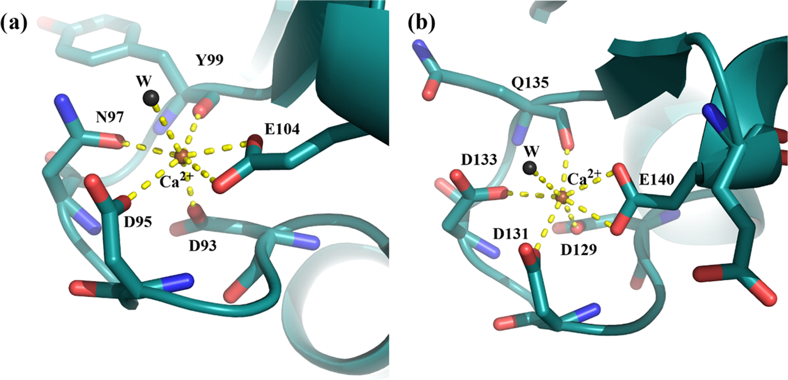
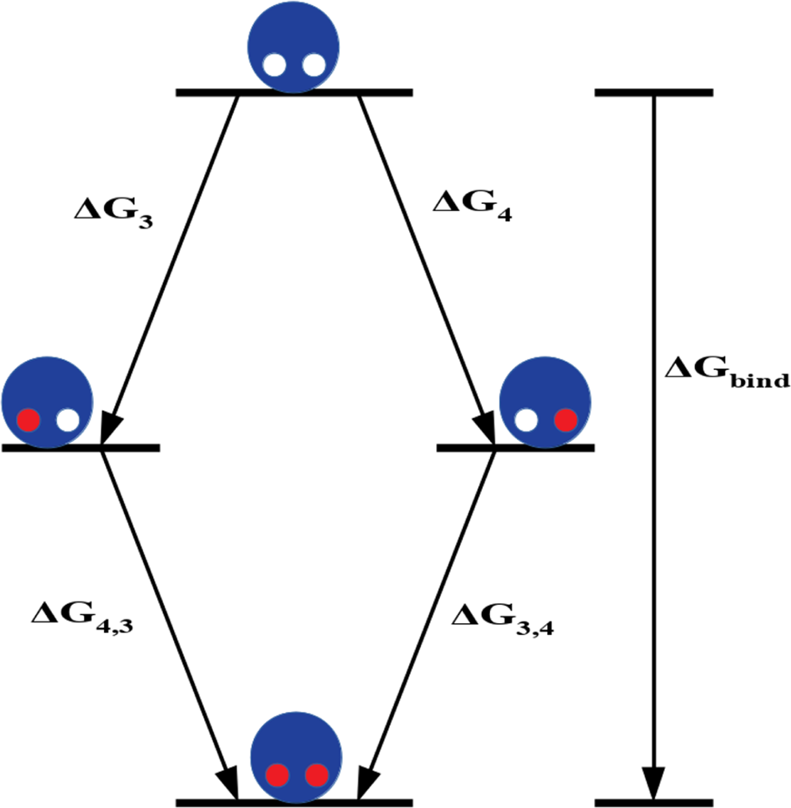
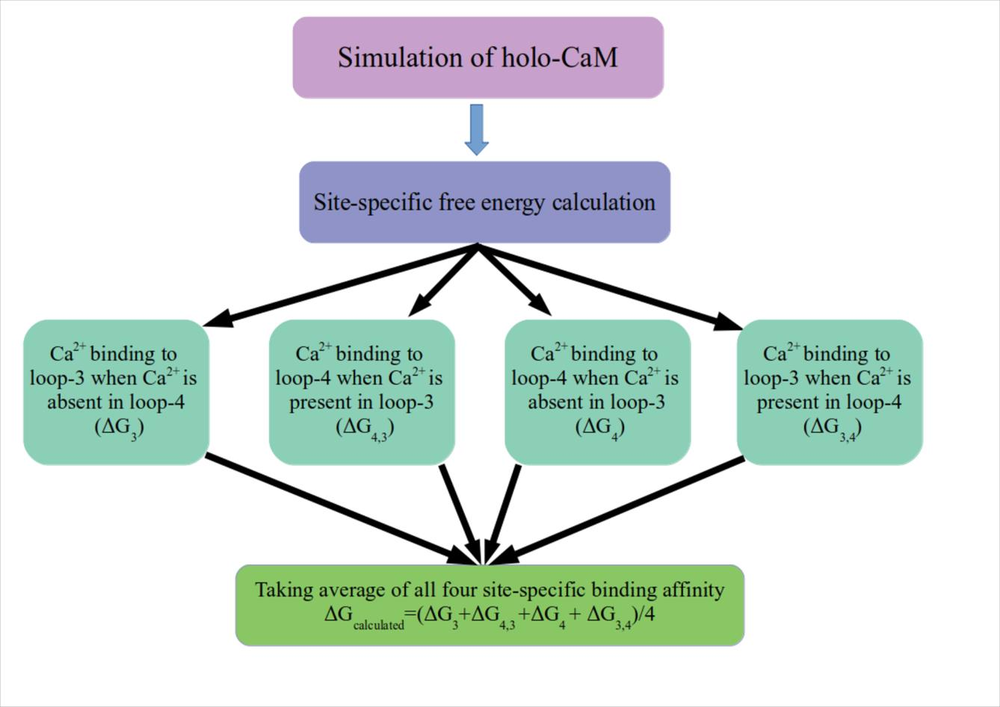

# Basit 2022：ECCR 电荷缩放 + MM-PBSA 计算钙调蛋白 Ca²⁺ 结合亲和力（技术细节）

## 方法概括

Basit 等 2022 年的目标不是用严格的 ABFE 直接计算 $\ce{Ca^{2+}}$ 结合自由能，而是建立一个**低成本的 CaM 突变体亲和力预测模型**。体系为人源 calmodulin，初始结构采用 $\ce{Ca^{2+}}$ 饱和的晶体结构 PDB 1CLL（1.70 Å）；研究重点是 C-lobe 的两个 EF-hand，即 loop-3 和 loop-4。所有 17 个突变体直接由 1CLL 对应残基突变得到，质子化状态由 PDB2PQR 在中性 pH 下确定。

### 1. 基础 MD 体系参数

以下参数来自正文 Section 2 和 SI Table S2，已核对完整：

| 参数项 | 具体设置 |
|---|---|
| 软件 | AMBER 16 |
| 蛋白力场 | ff14SB |
| 水模型 | TIP3P |
| 水盒边界 | 10 Å |
| 盐浓度 | 0.15 M KCl |
| K⁺/Cl⁻ 参数 | Joung–Cheatham |
| $\ce{Ca^{2+}}$ LJ 参数 | Li–Merz 2013（Table S2） |
| 温度 | 298 K，Langevin thermostat，碰撞频率 2 ps⁻¹ |
| 压力 | Berendsen barostat，1 bar |
| 长程静电 | PME |
| 约束 | SHAKE 约束含 H 键，时间步长 2 fs |

采样策略比较：作者最初对 WT、N97S、F141L 跑了 200 ns 轨迹并分析后 100 ns，随后发现 10 条 20 ns 与 10 条 2 ns 轨迹的平均 MM-PBSA 结果接近，因此最终 17 个突变体主要采用**10 条独立 2 ns 轨迹**。这个设计本质是 multiple short replicas，目的是降低平均值的 standard error，而非充分探索 CaM 的慢构象变化。作者自己也承认 2 ns 不能充分描述 CaM 构象涨落。

---

## 2. ECCR 电荷修改规则

这篇并没有重新拟合新的 $\ce{Ca^{2+}}$ LJ 参数。它以 Li–Merz $\ce{Ca^{2+}}$ 参数为基础，只修改静电部分，离子电荷统一乘 0.75：

**Table 1：ECCR 电荷缩放规则（SI Table S2）**

| 离子 | 标准电荷 | ECCR |
|---|---:|---:|
| $\ce{Ca^{2+}}$ | +2.00 | +1.50 |
| $\ce{K^{+}}$ | +1.00 | +0.75 |
| $\ce{Cl^{-}}$ | −1.00 | −0.75 |

即统一乘 0.75，用平均场方式近似电子极化，缩放因子来自 $\sqrt{\varepsilon_\text{el}} \approx 0.75$。

### 蛋白如何补偿少掉的 +0.5e？

这里 SI 给得很具体。一个 $\ce{Ca^{2+}}$ 由 +2.0 变成 +1.5，相当于体系少了 +0.5e。因此作者把每个 EF-hand 中 Ca 附近的一组 O 原子**统一调得稍微不那么负**，总共补回 +0.5e。完整逐原子数值在 SI Table S1，以下为核心规律：

- **Loop-3 和 loop-2**：各选 8 个氧原子，每个 O 增加 +0.0625e
- **Loop-1 和 loop-4**：各选 9 个氧原子，每个 O 增加 +0.0556e

Asp/Glu 的**两个羧酸 O 都修改**，并不只修改晶体结构中直接朝向 $\ce{Ca^{2+}}$ 的那个 O。例如 loop-3 选了 Asp93、Asp95（两个羧酸 O 均修改）、Asn97（侧链 O）、Tyr99（O）、Glu104（两个羧酸 O 均修改），一共 8 个 O。Loop-4 选了 Asp129、Asp131、Asp133（三个 Asp 共 6 个羧酸 O）、Gln135（O）、Glu140（两个羧酸 O），一共 9 个 O。

**表 5：loop-3 与 loop-4 结合位点残基排布与电荷补偿氧原子**。左图为 loop-3，右图为 loop-4，单字母缩写加残基编号标注各配位残基。图中显示直接配位 $\ce{Ca^{2+}}$ 的氧原子包括 Asp/Glu 的羧酸氧、Asn/Gln 的酰胺氧、Tyr/Thr 的酚羟基或醇羟基氧。ECCR 电荷补偿即对这些预先指定的氧原子统一施加 +0.0556e 到 +0.0625e 的小增量，使蛋白总电荷保持整数不变。

这点对你的体系很重要：它不是一个通用「看到 Ca 附近多少个 O 就自动重新拟合」的算法，而是人为定义一组 EF-hand 邻近 O，然后做总电荷补偿。

---

## 3. MM-PBSA 计算协议

使用 AMBER 的 MMPBSA.py，采用 single-trajectory protocol：receptor 和 $\ce{Ca^{2+}}$ 轨迹都从同一条 CaM–$\ce{Ca^{2+}}$ 复合物轨迹中提取。

基本形式是：

$$
\Delta G_\text{bind} \approx \Delta E_\text{MM} + \Delta G_\text{solv} - T\Delta S
$$

但这篇**直接忽略 $T\Delta S$**。能量分解为：

$$
\Delta E_\text{MM} = \Delta E_\text{vdW} + \Delta E_\text{el}
$$

$$
\Delta G_\text{solv} = \Delta G_\text{PB} + \Delta G_\text{cavitation} + \Delta G_\text{dispersion}
$$

PB 计算参数如下：

| 参数 | 数值 |
|---|---|
| 离子强度 | 0.15 M |
| 溶剂介电常数 | 78.35 |
| 溶质内介电常数 $\varepsilon_\text{in}$ | 8 |

其中 $\varepsilon_\text{in} = 8$ 不是无先验选择。作者明确说，他们在之前的 CaM 工作中比较后发现 8 效果最好，所以本论文沿用 8。因此这套 protocol 已经包含了一项针对 CaM 体系的经验校准。

---

## 4. 两个 EF-hand 的协同性处理

实验给的是 CaM C-lobe 两个位点的 macroscopic binding affinity。作者分别计算四种 site-specific 过程：

| 符号 | 含义 |
|---|---|
| $\Delta G_3$ | loop-4 为空时，$\ce{Ca^{2+}}$ 结合 loop-3 |
| $\Delta G_{4,3}$ | loop-3 已有 $\ce{Ca^{2+}}$ 时，$\ce{Ca^{2+}}$ 结合 loop-4 |
| $\Delta G_4$ | loop-3 为空时，$\ce{Ca^{2+}}$ 结合 loop-4 |
| $\Delta G_{3,4}$ | loop-4 已有 $\ce{Ca^{2+}}$ 时，$\ce{Ca^{2+}}$ 结合 loop-3 |

最终按以下公式平均：

$$
\Delta G_\text{bind} = \dfrac{\Delta G_3 + \Delta G_{4,3} + \Delta G_4 + \Delta G_{3,4}}{4}
$$

得到每个位点平均的宏观结合自由能（即论文里的 $\Delta G_\text{bind}/2$，与实验报告的每位点平均值 −7.64 kcal/mol 直接可比；论文的 $\Delta G_\text{bind}$ 全量是它的两倍）。SI Figure S1 给出了完整的计算流程。

**图 2：钙调蛋白 C-lobe 两个 EF-hand 的两步 $\ce{Ca^{2+}}$ 结合自由能定义**。白色圆圈为空位点（左为 loop-3），红色圆圈为已结合 $\ce{Ca^{2+}}$ 的位点；$\Delta G_{x,y}$ 表示当位点 y 已被占据时 $\ce{Ca^{2+}}$ 结合位点 x 的自由能变化。

**图 S1（论文 Supporting Information Figure S1）**：从复合物轨迹提取受体与配体、四种 site-specific 过程到宏观结合自由能的完整流程。

---

## 结果到底有多好？

这里必须把**原始 MM-PBSA 结果**和**后面的回归拟合结果**分开。

### 1. ECCR 确实明显改善了普通 ff14SB

以 10 × 2 ns 结果为例：

| 系统 | STD ff14SB | ECCR | 实验 |
|---|---:|---:|---:|
| WT | −11.04 | **−8.10** | −7.64 |
| N97S | −9.90 | **−8.46** | −6.81 |
| F141L | −11.61 | **−8.19** | −6.62 |

单位均为 kcal/mol。所以对这几个体系，标准 +2e $\ce{Ca^{2+}}$ 明显 overbind；简单 charge scaling 确实把结果往实验方向拉了很多。

SI Table S7 给出了全部体系的 ECCR 结果。我直接根据 Table S7 重新统计全部 WT + 17 mutants，**在任何后续回归拟合之前**：

| 统计量 | 数值 |
|---|---|
| absolute $\Delta G$ MAE | **1.20 kcal/mol** |
| absolute $\Delta G$ RMSE | **1.42 kcal/mol** |
| 平均 bias | **−1.09 kcal/mol** |

也就是说，ECCR + MM-PBSA 本身其实已经不算差，但整体仍有约 1 kcal/mol 的 overbind，而且 D131E、Q135P、D131V 等有 2–3 kcal/mol 的大误差。

### 2. 真正比较突变效应时，原始结果没有图上那么漂亮

论文真正关心的是：

$$
\Delta\Delta G = \Delta G_\text{mutant} - \Delta G_\text{WT}
$$

因为实验主要研究突变导致的亲和力改变。**拟合之前**，Figure 9 的原始 ECCR + MM-PBSA 结果是：

| 指标 | 数值 |
|---|---|
| RMSE | **1.15 kcal/mol** |
| Pearson $r$ | **0.51** |
| Spearman $r$ | **0.55** |
| 17 个突变中符号预测错误的数量 | **4 个** |

作者自己也明确称此时相关性只是 moderate。所以如果你看到后面的 RMSE ≈ 0.3 kcal/mol、$r \approx 0.8$，那已经不是原始 MM-PBSA 结果。

### 3. 后面确实拟合了，而且拟合得相当明显

作者把 MM-PBSA 分解得到的五个能量组分拿去对实验 $\Delta\Delta G$ 做**多元线性回归**：

| 描述符 | 含义 |
|---|---|
| $\Delta\Delta E_\text{vdW}$ | 范德华能量变化 |
| $\Delta\Delta E_\text{el}$ | 气相静电能量变化 |
| $\Delta\Delta G_\text{PB}$ | 极化溶剂化自由能变化 |
| $\Delta\Delta G_\text{cavitation}$ | 空腔自由能变化 |
| $\Delta\Delta G_\text{dispersion}$ | 色散自由能变化 |

五描述符模型的相关性一下提高到 Spearman $r = 0.82$、Pearson $r = 0.84$，但作者自己检查后发现，除了截距外，五个 descriptor 的系数都不显著（$p > 0.05$），因此明确说这个模型**不能作为 predictive model**。

之后逐步删 descriptor。最后得到的「最佳模型」甚至只剩一个量：

$$
\Delta\Delta G_\text{model} = 0.9863 - 0.3083 \times \Delta\Delta E_\text{vdW}
$$

也就是说，最后那个很漂亮的模型，本质上已经不是 MM-PBSA 自由能，而是：

> 用 MD 得到的 vdW 能量变化作为 descriptor，再对实验亲和力重新拟合一个线性模型。

它得到 RMSE ≈ **0.34 kcal/mol**、Spearman $r \approx$ **0.80**、Pearson $r \approx$ **0.80**；SI 多描述符版本甚至有 RMSE ≈ 0.31 kcal/mol。

作者也做了 leave-3/4/5-out cross-validation：

| CV 方案 | 训练 RMSE | 测试 RMSE | 测试 Spearman | 测试 Pearson |
|---|---:|---:|---:|---:|
| leave-5-out | 0.33 | 0.33 | 0.75 | 0.75 |
| leave-4-out | 0.34 | 0.32 | 0.73 | 0.72 |
| leave-3-out | 0.34 | 0.32 | 0.70 | 0.69 |

所以不是完全裸拟合，但仍然是在**同一批 CaM 点突变数据**内部做 cross-validation，没有真正独立的外部蛋白或另一批 CaM 突变测试集。

---

## 我怎么评价这篇的严谨性？

我的评价是：**作为「CaM 突变体快速预测模型」，做得比较认真；作为「证明 ECCR + MM-PBSA 能准确计算 $\ce{Ca^{2+}}$ 物理结合自由能」，证据远没有摘要看起来那么强**。

### 做得好的地方

1. **没有只跑一条轨迹**，最终采用 10 条独立 trajectory，并专门比较 2、20 和 200 ns 方案。
2. **STD 和 ECCR 正面对照**，可以清楚看到 +2e 固定电荷模型确实严重 overbind，而 ECCR 明显改善。
3. **charge modification 完全公开**，SI 给到逐原子 partial charge，复现性很好。
4. **考虑了两个 EF-hand 的 occupancy/cooperativity**，不是简单把一个 $\ce{Ca^{2+}}$ 删除然后算一次 PBSA。
5. **作者没有掩盖原始结果**，Figure 9 明确告诉你原始 ECCR 只有 $r \approx 0.5$、RMSE ≈ 1.15，而且有 4 个 sign error。
6. **回归部分至少做了显著性检验和 cross-validation**，他们甚至主动否掉了看起来相关性更高、但统计上不显著的五参数模型。

这些都算比较规范。

---

## 但有几个明显限制

### 1. 「RMSE 0.3 kcal/mol」不能拿来证明 MM-PBSA 准

这是最重要的一点。真正未经实验拟合的 ECCR + MM-PBSA 是：

**RMSE 1.15 kcal/mol，$r \approx 0.5$**。

0.3 kcal/mol 那个结果来自**用实验 $\Delta\Delta G$ 训练后的回归模型**。因此不能写：

> ECCR-MM/PBSA predicts Ca binding affinity with an RMSE of 0.3 kcal/mol.

更准确应该写：

> Raw ECCR/MM-PBSA achieved an RMSE of about 1.15 kcal/mol for relative binding free energies; subsequent empirical regression against experimental data reduced the cross-validated error to approximately 0.3 kcal/mol.

两件事不是一个概念。

### 2. $\varepsilon_\text{in} = 8$ 本身已经经过 CaM 体系校准

他们没有 blindly 采用一个标准 PB 参数。论文明确说 $\varepsilon_\text{in} = 8$ 是之前在类似 CaM 体系比较后得到的最佳值。因此「原始 MM-PBSA」其实也不是完全无经验调整的 ab initio prediction。

### 3. 最终模型只剩 vdW descriptor，有点反常

最后最成功的预测式是：

$$
\Delta\Delta G_\text{model} = 0.9863 - 0.3083 \times \Delta\Delta E_\text{vdW}
$$

$\ce{Ca^{2+}}$ 结合明明是高度 electrostatic 的问题，最后统计模型却只保留了 vdW 变化。这不代表「$\ce{Ca^{2+}}$ 结合由 vdW 主导」，只是说明在这一小组高度相似的 CaM mutants 中，$\Delta E_\text{vdW}$ 恰好是最稳定的经验 descriptor。所以它更像**QSAR 式校准模型**，不能直接赋予强物理解释。

### 4. 2 ns 轨迹很短

10 × 2 ns 确实能让 standard error 变小，但：

**很多短 trajectory ≠ 已经采样到慢构象转换**。

作者自己也承认 2 ns 不能充分描述 CaM 结构涨落。对这些从同一个 holo 晶体结构出发的点突变，可能还能工作；换成一个磷酸化可能改变 EF-hand 构象 ensemble 的体系，风险明显更大。

### 5. single-trajectory MM-PBSA 没有真正模拟结合过程

蛋白、$\ce{Ca^{2+}}$ 和 complex 都从同一个 bound trajectory 提取，因此大量构象重组代价被假定相消。它实际上问的是：

> 在已有 holo-like 构象附近，这个 $\ce{Ca^{2+}}$ 的 endpoint interaction energetics 怎样？

不是严格意义上的：

> $\ce{Ca^{2+}}$ 从 bulk water 进入 EF-hand 的标准结合自由能是多少？

所以不能和 umbrella sampling、double-decoupling ABFE 等严格自由能方法等价。

### 6. 没算构象熵

作者认为 WT 和 mutants 相近，因此希望熵项相消。对于普通 point mutants 可能有一定合理性。但如果你的磷酸化真正改变 EF-hand opening、两臂运动或 apo/holo 构象平衡，这个假设就更危险。

---

## 对这篇论文最合适的定位

我觉得它真正证明的是：

> **把 $\ce{Ca^{2+}}$ 从 +2e 缩到 +1.5e，同时对 EF-hand 附近 O 做局部 charge compensation，确实能显著缓解 ff14SB/TIP3P 中 $\ce{Ca^{2+}}$ 的过强静电结合，并改善 CaM 突变体之间的相对亲和力预测**。

它没有证明：

> **ECCR + MM-PBSA 已经可以无参数、定量预测任意 EF-hand 的绝对 $\ce{Ca^{2+}}$ 结合自由能**。

未经实验回归时，它的表现其实是一个很现实的水平：absolute $\Delta G$ 大约**1.2 kcal/mol MAE**，relative $\Delta\Delta G$ **1.15 kcal/mol RMSE、$r \approx 0.5$**。这已经值得作为你的一个 benchmark 方法，但我不会把最终 0.3 kcal/mol 那个数字拿来给 ECCR 力场本身背书。

对你的体系反而有个好消息：如果 pSer/pThr 确实离 $\ce{Ca^{2+}}$ 第一配位层较远，你不需要照这篇去改磷酸基。真正需要决定的是，是否像他们一样把**每个 EF-hand 第一配位环境附近的 O 统一分摊 +0.5e**。这个细节比「$\ce{Ca^{2+}}$ 设成 +1.5」本身更值得谨慎复现。
