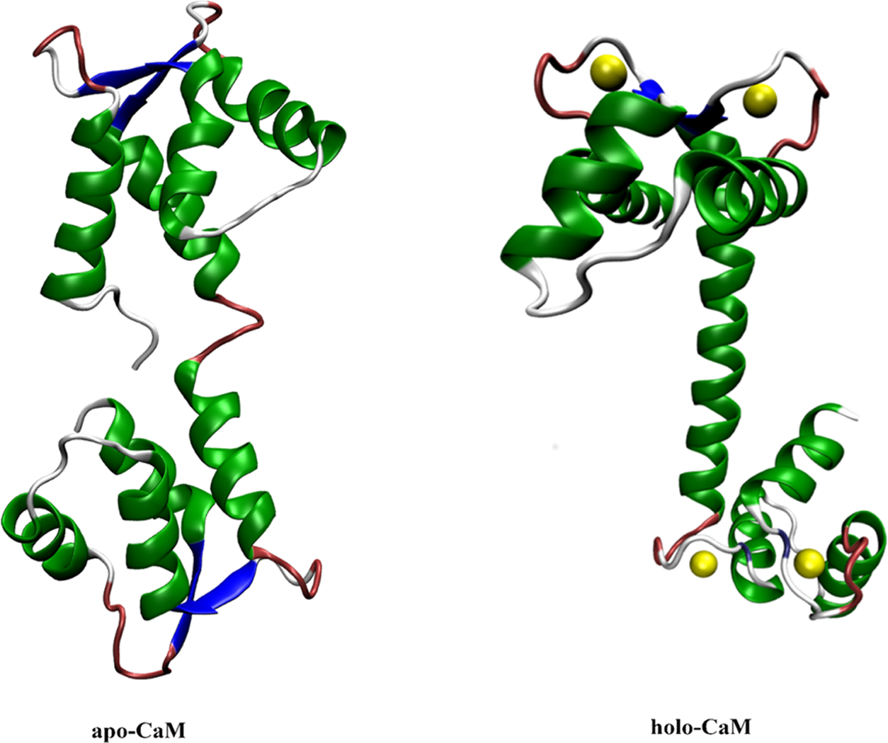
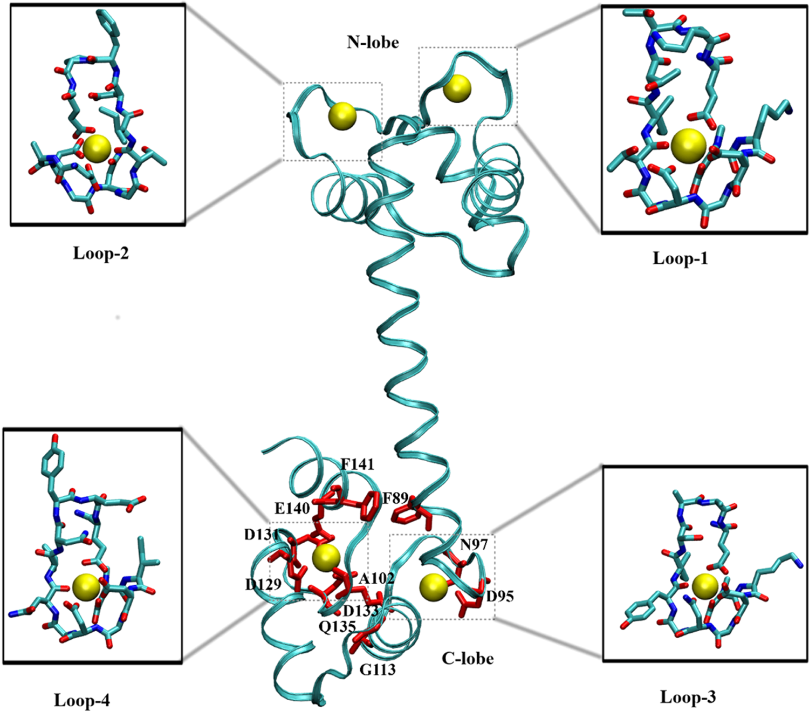
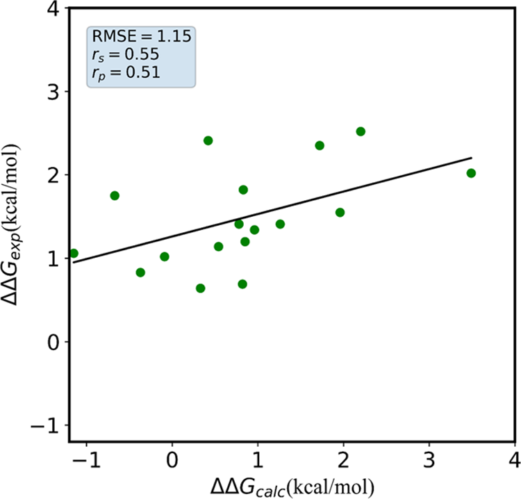
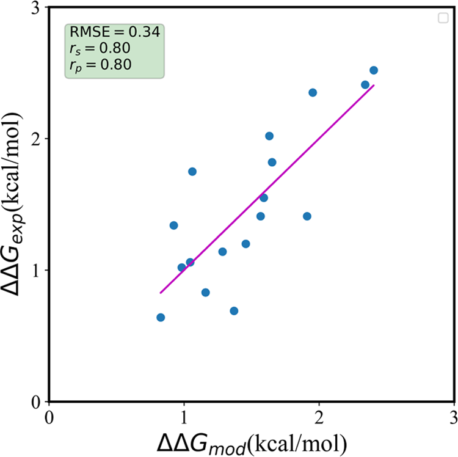
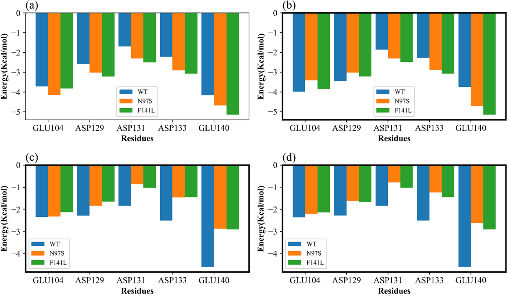
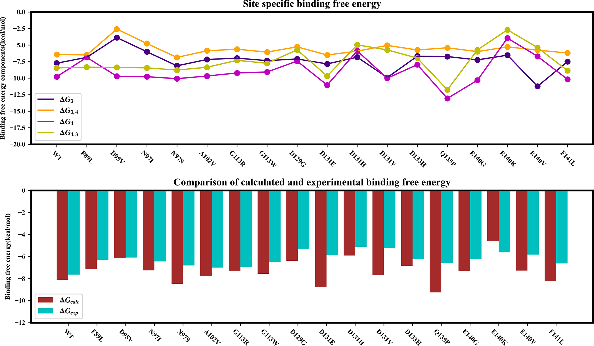

# 用电荷缩放把钙离子过强静电降下来钙调蛋白结合自由能怎么快速算

## 本文信息

- **标题**：Calcium Ion Binding to the Mutants of Calmodulin：A Structure-Based Computational Predictive Model of Binding Affinity Using a Charge Scaling Approach in Molecular Dynamics Simulation
- **作者**：Abdul Basit、Ajeet Kumar Yadav、Pradipta Bandyopadhyay
- **发表期刊**：Journal of Chemical Information and Modeling
- **发表时间**：2022 年 5 月 24 日（62 卷，2821–2834 页）
- **DOI**：<https://doi.org/10.1021/acs.jcim.2c00428>
- **单位**：Jawaharlal Nehru University，新德里
- **引用格式**：Basit, A.；Yadav, A. K.；Bandyopadhyay, P. Calcium Ion Binding to the Mutants of Calmodulin：A Structure-Based Computational Predictive Model of Binding Affinity Using a Charge Scaling Approach in Molecular Dynamics Simulation. *J. Chem. Inf. Model.* **2022**, *62*, 2821–2834. <https://doi.org/10.1021/acs.jcim.2c00428>

## 摘要

钙调蛋白的钙离子结合亲和力难以用经典力场准确计算，因为钙离子电荷密度高、极化性强，非极化力场 ff14SB 搭配 TIP3P 水模型会严重高估钙离子与蛋白之间的静电作用，导致结合自由能系统性 overbind。本文不追求严格的炼金自由能，而是建立一个低成本的钙调蛋白突变体亲和力预测模型。核心思路是用电荷缩放 ECCR 在平均场意义下引入极化：把钙离子、钾离子、氯离子的电荷统一乘 0.75，再对钙离子邻近的若干氧原子做局部电荷补偿，使蛋白总电荷保持整数，随后用 MM-PBSA 单轨迹协议配合多重短轨迹估算结合自由能，并通过与实验比对再做线性回归来校正。

**图 1：钙调蛋白 apo 态与钙饱和 holo 态的整体结构示意**。左图为无钙离子结合的 apo 态（PDB ID 1CFD），右图为钙饱和的 holo 态（PDB ID 1CLL）。钙调蛋白含有四个 EF-hand 钙结合模体，分别位于 N-lobe 的 loop-1 和 loop-2、C-lobe 的 loop-3 和 loop-4。文章聚焦于 C-lobe 的两个 EF-hand，即 loop-3 和 loop-4，这两个位点在钙饱和晶体结构中可以清晰看到钙离子被多个羧酸氧和酰胺氧紧密配位，loop-3 总电荷为 −2e、loop-4 总电荷为 −5e。

## 背景：钙离子结合自由能为什么难算

- 经典非极化力场 ff14SB 搭配 TIP3P 水模型把钙离子处理为一个固定的 +2e 点电荷加上 Lennard-Jones 球，完全忽略它的电子极化和电荷转移效应。真实环境里钙离子电荷密度极高，周围水分子和蛋白氧原子会被显著极化，等效于有效电荷比 +2e 小，因此固定电荷模型会系统性高估静电吸引。
- 直接后果是钙离子与配位氧之间的静电吸引被严重高估，结合自由能系统性 overbind。这对 EF-hand 这种靠多个羧酸氧抓钙离子的位点尤其致命，因为每个 EF-hand 大约要协调 7 到 8 个氧原子，每个氧原子的静电误差都会叠加，最终导致结合自由能偏差超过 3 kcal/mol。
- 严格做法是在力场里显式引入极化，比如 Drude 振荡子模型、可极化电荷平衡 QEq、12-6-4 LJ 参数化、multisite dummy 模型等。但这些方法的计算成本显著高于标准力场，对大规模突变体筛选不太现实，而且重新拟合 LJ 参数的工作量也不小。
- ECCR 走的是最便宜的路线：不增加任何额外项，只把离子电荷按溶剂电子介电常数的平方根倒数统一缩放，用平均场方式近似极化效应。缩放因子 √(ε_el) 约 0.75 来自水溶液的物理图像，于是钙离子、钾离子、氯离子都乘 0.75，再对邻近氧做局部补偿即可。这种方法的关键好处是**完全兼容现有力场和模拟软件**，不需要修改代码。

## 关键科学问题

- 非极化力场中钙离子的过强静电结合是否可以通过简单的平均场电荷缩放得到系统性改善，而不需要引入额外的极化项或重新拟合 LJ 参数？这是本文要验证的核心假设，也是许多计算金属蛋白研究者面临的实际问题。
- 在计算成本允许的范围内，能否建立一个可用于突变体亲和力排序的快速预测模型？严格自由能方法如 TI 或 FEP 成本高、周期长，不适合大规模筛选，而 MM-PBSA 终点法的精度和效率如何平衡一直是个开放问题。
- MM-PBSA 终点法在忽略构象熵和 single-trajectory 假设下的误差有多大？对于从同一 holo 晶体出发的点突变，这些近似是否合理？如果突变会改变 EF-hand 的构象集合（如磷酸化修饰），这些近似还成立吗？
- 经验回归能否在统计意义上弥补 MM-PBSA 的方法偏置？如果回归后的模型本质上是 QSAR 式的经验校准，那它的预测能力边界在哪里，能否外推到其他体系？

## 创新点

- 提出了一种极简的极化近似方案 ECCR，仅通过统一缩放离子电荷并做局部氧原子补偿，在不修改力场功能形式的前提下显著改善了钙离子结合自由能的预测，计算成本几乎不增加，可以无缝嵌入现有 AMBER 模拟流程。
- 系统性地比较了标准力场与 ECCR 在 17 个钙调蛋白突变体上的表现，明确量化了固定电荷模型的 overbind 程度和 ECCR 的改善幅度，并公开了所有逐原子电荷修改细节，复现性很好。
- 引入了 multiple short replicas 采样策略，用 10 条独立 2 ns 轨迹代替单条长轨迹，有效降低了平均值的 standard error，同时保持了计算效率，作者还比较了 2 ns、20 ns、200 ns 三种方案验证了策略的合理性。
- 对两个 EF-hand 的协同结合做了细致的 site-specific 自由能分解，给出了四种 occupancy 组合下的结合自由能，并与宏观结合常数做了对照，澄清了协同效应的计算处理方式。

**图 3：钙调蛋白整体结构与四个 EF-hand loop 的示意**。PDB ID 1CLL，分辨率 1.70 Å。钙调蛋白呈典型的哑铃形结构，N-lobe 和 C-lobe 各含两个 EF-hand 模体。文章聚焦于 C-lobe 的 loop-3 和 loop-4，这两个 loop 的氨基酸序列分别为 D-K-D-G-N-G-Y-I-S-A-A-E（loop-3，总电荷 −2e）和 D-I-D-G-D-G-Q-V-N-Y-E-E（loop-4，总电荷 −5e）。每个 loop 都含有一个钙离子结合位点，配位氧原子主要来自 Asp 和 Glu 的羧酸氧、Asn 和 Gln 的酰胺氧，以及 Tyr 和 Thr 的羟基氧。

## 核心结论

- 标准 +2e 的钙离子明显 overbind，WT 用 ff14SB 直接算约为 −11.0 kcal/mol，而实验值约为 −7.64 kcal/mol，偏差超过 3 kcal/mol，说明固定电荷模型对钙离子的处理存在系统性误差，这个误差主要来自静电部分。
- ECCR 把结果大幅拉回实验方向，同一 WT 用 ECCR 约为 −8.10 kcal/mol，更接近实验值；对 N97S、F141L 等代表性突变体也一致地改善，证明电荷缩放确实能缓解钙离子的过强静电，且改善幅度与实验趋势一致。
- 但原始 ECCR 加 MM-PBSA 并没有摘要看起来那么准，对 17 个突变体的相对亲和力 ΔΔG 而言，原始结果的 RMSE 约 1.15 kcal/mol、Pearson r 约 0.51、Spearman r 约 0.55，而且 17 个里有 4 个连 ΔΔG 正负号都预测错了，作者自己也称此时相关性只是 moderate。
- 绝对结合自由能本身也还有约 1 kcal/mol 的系统偏差，直接对 SI Table S7 统计，绝对 ΔG 的 MAE 约 1.20 kcal/mol、RMSE 约 1.42 kcal/mol、平均 bias 约 −1.09 kcal/mol，整体仍偏 overbind。
- 论文里那个很漂亮的 0.3 kcal/mol 来自回归拟合而非力场本身，把 MM-PBSA 的各能量组分对实验 ΔΔG 做线性回归后，最终单描述符模型只剩范德华项，形式为 ΔΔG_model = 0.9863 − 0.3083 × ΔΔE_vdW，交叉验证 RMSE 约 0.34 kcal/mol、相关系数约 0.80，但这本质是经验校准而非力场本身准确。

## 方法要点

- **体系与起始结构**：人源钙调蛋白钙饱和晶体结构 PDB 1CLL，分辨率 1.70 Å；所有 17 个突变体由同一结构直接点突变得来；质子化状态由 PDB2PQR 在中性 pH 下确定；蛋白带 −2e 净电荷，与实验体系一致。
- **基础 MD 设置**：AMBER 16 软件包、蛋白 ff14SB、水 TIP3P、水盒边界距离 10 Å、0.15 M KCl 浓度、钾离子和氯离子用 Joung–Cheatham 参数、钙离子用 Li–Merz 2013 参数、298 K Langevin 恒温器碰撞频率 2 ps⁻¹、Berendsen 1 bar 恒压、PME 处理长程静电、SHAKE 约束含氢键、时间步长 2 fs。
- **ECCR 电荷修改**：钙离子 +2.0 改为 +1.5、钾离子 +1.0 改为 +0.75、氯离子 −1.0 改为 −0.75，统一乘 0.75；为保持蛋白总电荷整数，把每个 EF-hand 邻近的一组氧原子统一调得「不那么负」，每个 EF-hand 补回被缩掉的 +0.5e，loop-3 和 loop-4 各选 8 到 9 个氧原子具体数值见 SI Table S1。
- **MM-PBSA 协议**：MMPBSA.py 单轨迹协议，受体与钙离子轨迹都从同一条钙调蛋白–钙离子复合物轨迹提取；溶剂化用线性化 Poisson–Boltzmann 方程、溶质内介电常数 ε_in = 8、离子强度 0.15 M、直接忽略构象熵项 TΔS；ε_in = 8 并非无先验选择，作者在既往钙调蛋白工作中比较后选定。
- **采样策略**：比较了 2 ns、20 ns、200 ns 三种轨迹长度，发现 10 条 20 ns 与 10 条 2 ns 轨迹的平均 MM-PBSA 结果接近，因此 17 个突变体主要用 10 条独立 2 ns 轨迹，本质是 multiple short replicas 降低均值标准误，而非充分采样钙调蛋白慢构象转换。
- **协同性处理**：C-lobe 的两个 EF-hand 分别计算四种 site-specific 过程 ΔG₃、ΔG₄,₃、ΔG₄、ΔG₃,₄，再取平均得到每个位点的宏观结合自由能，SI Figure S1 给出了完整计算流程图。

**图 2：钙调蛋白 C-lobe 两个 EF-hand 的两步钙离子结合自由能定义**。白色圆圈代表空位点，红色圆圈代表已被钙离子占据的位点。ΔG₃ 表示 loop-4 为空时钙离子结合 loop-3 的自由能变化，ΔG₄,₃ 表示 loop-3 已被占据时钙离子结合 loop-4 的自由能变化，ΔG₄ 和 ΔG₃,₄ 分别对应相反顺序。这四个 site-specific 过程的平均值即为每个位点的宏观结合自由能，与实验报告的每位点平均值 −7.64 kcal/mol 直接可比。SI Figure S1 给出了完整计算流程图。

**图 6：ECCR 力场下四种 site-specific 过程的结合自由能分解**。柱状图展示了 WT 和突变体 N97S、F141L 在 loop-3、loop-&#x33;*、loop-4、loop-4* 四个位点的自由能分解，包括 ΔE_vdW（范德华）、ΔE_el（气相静电）、ΔG_PB（极化溶剂化）、ΔG_cavitation（空腔）和 ΔG_dispersion（色散）。可以看到 loop-4 的静电贡献 ΔE_el 在突变时变化更显著，而 loop-3 的变化相对平缓。这与实验观察到的 loop-4 对突变更敏感的结论一致，也说明 ECCR 对 loop-4 的改善更明显。

## 研究结果与分析

### 标准力场 vs ECCR 的直接对照

以 10 条 2 ns 轨迹结果为例，几个代表体系的绝对结合自由能如下表所示，单位 kcal/mol，越负表示结合越强：

| 系统    | STD ff14SB |  ECCR |    实验 |
| ----- | ---------: | ----: | ----: |
| WT    |     −11.04 | −8.10 | −7.64 |
| N97S  |      −9.90 | −8.46 | −6.81 |
| F141L |     −11.61 | −8.19 | −6.62 |
| D95V  |      −8.52 | −6.14 | −6.09 |
| G113R |      −8.15 | −7.28 | −6.95 |
| D131E |     −12.03 | −8.77 | −5.89 |
| Q135P |     −11.80 | −9.25 | −6.58 |
| E140K |      −7.10 | −4.61 | −5.62 |

- 标准 +2e 模型系统性 overbind，ECCR 把结合自由能显著拉向实验值，说明钙离子的过强静电确实是 ff14SB 搭配 TIP3P 水模型的主要误差来源，而平均场电荷缩放能有效缓解这一问题，改善幅度在 2 到 4 kcal/mol 之间。
- 但真正关心的是突变导致的亲和力改变 ΔΔG = ΔG_mutant − ΔG_WT。图 9 原始 ECCR 加 MM-PBSA 结果只有 RMSE 1.15 kcal/mol、r 约 0.5，且 17 个突变中有 4 个连 ΔΔG 正负号都预测错了，作者自己也称此时相关性只是 moderate。

> **核心发现**：ECCR 把绝对 ΔG 从系统性 overbind 拉回实验方向，但对突变体相对亲和力的预测仍有较大 scatter——RMSE 1.15、r 约 0.5，远不够直接用于定量预测。

**图 5：钙调蛋白 C-lobe 两个 EF-hand 结合位点的残基排布示意**。左图为 loop-3，右图为 loop-4，单字母缩写加残基编号标注各配位残基。图中显示直接配位钙离子的氧原子包括 Asp 和 Glu 的羧酸氧、Asn 和 Gln 的酰胺氧、Tyr 和 Thr 的酚羟基或醇羟基氧。ECCR 电荷补偿即对这些预先指定的氧原子统一施加 +0.0556e 到 +0.0625e 的小增量，使蛋白总电荷保持整数不变。Asp/Glu 的两个羧酸氧都修改，并不只修改晶体结构中直接朝向钙离子的那个氧。

### 从原始结果到回归模型的跃升

- 五描述符多元回归把相关性提到 Spearman 0.82、Pearson 0.84，但除截距外所有描述符系数都不显著，作者明确说这不能作为 predictive model。逐步削减描述符后最终只剩范德华变化 ΔΔE_vdW，得到单描述符模型 ΔΔG_model = 0.9863 − 0.3083 × ΔΔE_vdW，RMSE 约 0.34 kcal/mol、r 约 0.80；SI 多描述符版本甚至到 0.31 kcal/mol。
- 交叉验证 leave-3/4/5-out 结果如下表所示，测试集 RMSE 稳定在 0.32 到 0.33 kcal/mol，Spearman 和 Pearson 相关系数在 0.69 到 0.75 之间，说明回归模型在训练集内部有一定泛化能力，但测试集仍较小且均来自同一批钙调蛋白点突变。

| CV 方案       | 训练 RMSE | 测试 RMSE | 测试 Spearman | 测试 Pearson |
| ----------- | ------: | ------: | ----------: | ---------: |
| leave-5-out |    0.33 |    0.33 |        0.75 |       0.75 |
| leave-4-out |    0.34 |    0.32 |        0.73 |       0.72 |
| leave-3-out |    0.34 |    0.32 |        0.70 |       0.69 |

**图 9：原始 ECCR MM-PBSA 计算结果与实验结合自由能的散点对比**。横轴为实验 ΔΔG（单位 kcal/mol），纵轴为计算 ΔΔG。实线为最佳线性拟合线，图中标注了 RMSE 约 1.15 kcal/mol、Pearson r 约 0.51。四个偏离拟合线较远且符号相反的数据点即为预测错误的突变体，分别是 D131E、Q135P、E140K 和另一个。这个图清楚地表明原始 ECCR + MM-PBSA 的预测能力有限，不能直接用于定量预测。

**图 11：回归校准后的单描述符模型预测结果与实验结合自由能的散点对比**。横轴为实验 ΔΔG，纵轴为模型预测值。实线为最佳线性拟合线，图中标注了 RMSE 约 0.34 kcal/mol、Pearson r 约 0.80。与图 9 对比可以清晰看到，经过实验数据回归校准后模型的预测精度显著提升，但这个提升来自经验拟合而非力场本身精度的改善。

> **跃升的本质**：五个能量组分里挑出一个最稳的（ΔΔE_vdW），再拿实验数据线性校准——这本质是 QSAR，不是力场变准了。

### 残基层面的自由能分解

**图 7：重要残基对结合自由能的贡献分解示意**。上方面板为标准 ff14SB 力场，下方面板为 ECCR 力场。每个子图分为左右两部分：左侧为 loop-3 或 loop-4 另一位点为空时的残基贡献，右侧为另一位点已被钙离子占据时的残基贡献。选取了贡献绝对值超过 1.5 kcal/mol 的残基，横轴表示该残基对结合自由能的贡献值（正值表示不利于结合，负值表示有利于结合）。STD 和 ECCR 两种力场下，GLU140 的贡献呈现出有趣的趋势反转：STD 力场下突变体的 GLU140 贡献比 WT 更大，而 ECCR 力场下恰恰相反。ASP133 和 ASP131 也呈现类似趋势。这说明 ECCR 电荷缩放不仅改变了整体静电强度，还改变了不同残基之间静电相互作用的相对权重，使得突变导致的静电变化方向与标准力场相反。这是 ECCR 能够改善相对亲和力预测的一个重要机制。

> **核心机制**：ECCR 不只是整体压低静电——它改变了 GLU140、ASP133、ASP131 等关键残基的贡献方向，使得突变导致的静电变化在 STD 和 ECCR 下符号相反，这才是改善相对亲和力预测的根本原因。

**图 8：所有 18 个体系（WT + 17 个突变体）的 ECCR 计算值与实验值柱状对比**。蓝色柱为计算值，红色柱为实验值（单位 kcal/mol），横轴按突变体排列。整体可见 ECCR 把大多数体系的绝对结合自由能往实验方向拉，但 D131E、Q135P、E140K 等少数几个偏差仍然显著，说明单一电荷缩放对某些特殊突变无能为力。

- 图 6 展示了四种 site-specific 过程的自由能分解，可以看到 loop-4 的静电贡献 ΔE_el 在突变时变化更显著，而 loop-3 的变化相对平缓。这与实验观察到的 loop-4 对突变更敏感的结论一致，也说明 ECCR 对 loop-4 的改善更明显。
- 图 8 汇总了所有 18 个体系（WT 加 17 个突变体）的 ECCR 计算结果与实验值的对比柱状图。蓝色柱为计算值，红色柱为实验值。可以看到 ECCR 整体向实验方向移动，但 D131E、Q135P、E140K 等少数突变体的偏差仍然较大。

### 几个具体突变体的表现

从 SI Table S7 看个体误差能更清楚 ECCR 到底帮了什么没帮什么：

- **D131E 是 overbind 最严重的例子**，ECCR 算出 −8.77 kcal/mol 而实验只有 −5.89，差约 2.9 kcal/mol。这类带负电残基的替换使得突变位点周围静电环境变化很大，单一电荷缩放难以精确补偿局部静电重排。
- **Q135P 同样偏差约 2.7 kcal/mol**，ECCR 算 −9.25 实验 −6.58，说明 Pro 引入的构象限制不是简单的静电能所能捕捉，刚性环状侧链会改变 loop 的柔性分布。
- **E140K 反而走向另一极端**，ECCR 算 −4.61 实验 −5.62，即预测得「太弱」而非「太强」，这提示 ECCR 不是对所有人一刀切地降结合强度，个别突变仍会失准。
- **D131H 和 D131V 也是偏差较大的突变体**，D131H 算 −5.90 实验 −5.12、D131V 算 −7.68 实验 −5.23，两者都涉及 131 位 Asp 的替换，说明 131 位附近的静电环境对突变非常敏感。
- 把这些个体误差摊平后绝对 ΔG 的 MAE 约 1.2 kcal/mol、RMSE 约 1.4 kcal/mol，意味着平均可用个别危险，这正是后面需要拿实验数据做回归来「修」的原因。

> **易错点**：D131E 偏差最大（2.9 kcal/mol）是因为引入了额外负电荷，单一电荷缩放无法精确补偿局部静电重排；Q135P 偏差约 2.7 kcal/mol 则是 Pro 的构象刚性超出了静电模型的捕捉范围。

### 复现这篇时最该盯住的点

如果你想把 ECCR 思路用到自己的体系下面这些细节决定成败：

- **电荷补偿是人为指定加总电荷守恒不是自动算法**，作者对每个 EF-hand 预先挑好一组邻近氧 loop-3 和 loop-4 各 8 到 9 个把 +0.5e 平摊进去，不是看到多少配位氧就自动重拟合，你的体系要先决定哪些氧进补偿组。
- **ε_in = 8 是钙调蛋白专用校准值**不是通用 PB 默认，换到其他蛋白别直接复用，这个值来自作者既往钙调蛋白工作比较后的最佳选择。
- **采样长度 2 ns 仍不捕捉慢构象**，他们用 10 条 2 ns 是因为比较过 20 ns 和 200 ns 均值接近，但 2 ns 仍不能充分描述钙调蛋白的构象涨落，换构象敏感的体系要小心。
- **single-trajectory 假设只适用于从同一 holo 起始结构出发比较相近突变的场景**，apo-holo 平衡差异大的体系会踩坑，因为受体和复合物的构象分布可能完全不同。

> **复现时最该盯住的细节**：电荷补偿方案（哪些氧进补偿组、每个补多少）比把钙设成 +1.5 本身更关键，而且 ε_in = 8 是钙调蛋白专用校准值，换到其他蛋白别直接复用。

## 值得注意的限制

- **「RMSE 0.3 kcal/mol」不能拿来证明 MM-PBSA 准**。那是用实验 ΔΔG 训练后的回归模型误差，未经实验拟合的 ECCR 加 MM-PBSA 实际是 RMSE 1.15 kcal/mol、r 约 0.5。两件事不是一回事，写结论时务必区分。
- **ε_in = 8 本身已经过钙调蛋白体系校准**，不是盲目套用的标准 PB 参数，所以原始 MM-PBSA 也并非完全无经验调整的 ab initio 预测。换到其他蛋白别直接复用。
- **最终模型只剩 vdW 描述符有点反常**，钙离子结合明明是高度静电的问题最后统计模型却只保留范德华变化，这更像是「在一小组高度相似的钙调蛋白突变体里 ΔE_vdW 恰好是最稳定的经验描述符」，不能直接赋予强物理解释，本质接近 QSAR 式校准。
- **2 ns 轨迹太短**，多条短轨迹能压低均值标准误但作者自己也承认 2 ns 不能充分描述钙调蛋白构象涨落，对从同一 holo 晶体出发的点突变可能还行，换成会改变 EF-hand 构象集合的修饰如磷酸化风险更大。
- **single-trajectory MM-PBSA 没有真正模拟结合过程**，蛋白、钙、复合物都从同一条 bound 轨迹提取，大量构象重组代价被假定相消，不能和 umbrella sampling、double-decoupling ABFE 等严格自由能方法等价。
- **交叉验证仍在同一批钙调蛋白点突变内**，没有真正独立的外部蛋白或另一批钙调蛋白突变测试集，所以 predictive 的程度有限。

## 对这篇最合适的定位

它真正证明的是把钙离子从 +2e 缩到 +1.5e 同时对 EF-hand 邻近氧做局部电荷补偿确实能显著缓解 ff14SB 搭配 TIP3P 中钙离子的过强静电结合并改善钙调蛋白突变体之间的相对亲和力预测。

它没有证明的是 ECCR 加 MM-PBSA 已经可以无参数定量预测任意 EF-hand 的绝对钙离子结合自由能。

对你而言这篇最值得借鉴的是 ECCR 的电荷补偿思路——钙离子乘 0.75 加邻近氧补偿——但真正需要谨慎复现的细节是每个 EF-hand 第一配位环境附近氧原子的补偿方式，这比把钙设成 +1.5 本身更关键。若你的磷酸丝氨酸或磷酸苏氨酸离钙第一配位层较远未必需要照这篇去改磷酸基。

## 小结

- 这篇的价值在于用极低成本的电荷缩放 ECCR 加标准 MM-PBSA 加多重短轨迹把钙调蛋白突变体的钙离子相对亲和力预测到了可用水平，并诚实公开了所有电荷与统计细节，复现性很好。
- 但它没有证明 ECCR 加 MM-PBSA 能无参数定量预测任意 EF-hand 的绝对钙离子结合自由能，原始方法 RMSE 约 1.15 kcal/mol、r 约 0.5，那个 0.3 kcal/mol 来自实验数据回归，本质是 QSAR 式校准。
- 对你真正要用这个力场而言最该拿走的不是结论数字而是 ECCR 的电荷补偿思路，尤其每个 EF-hand 第一配位层氧原子的具体补偿方式比把钙设成 +1.5 本身更值得谨慎复现。
