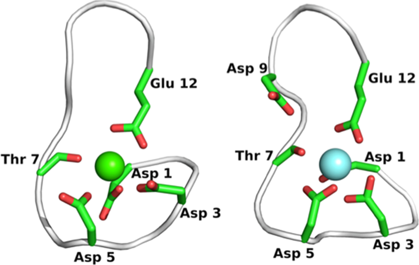
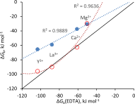
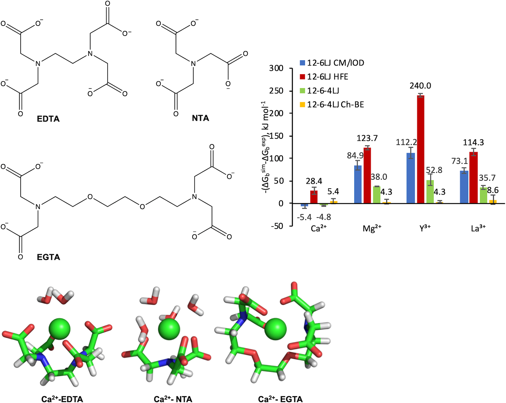
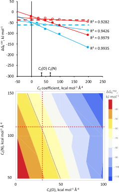
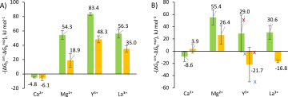
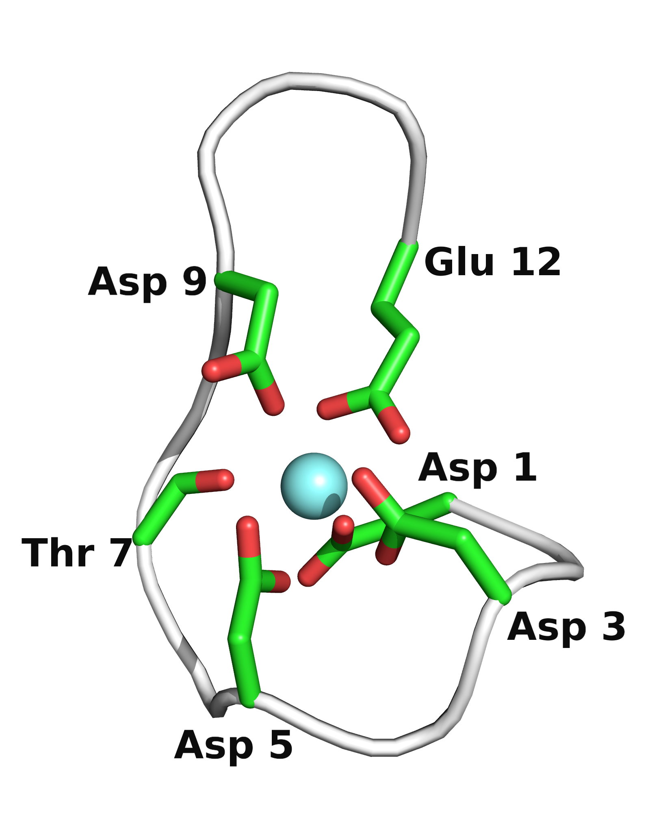
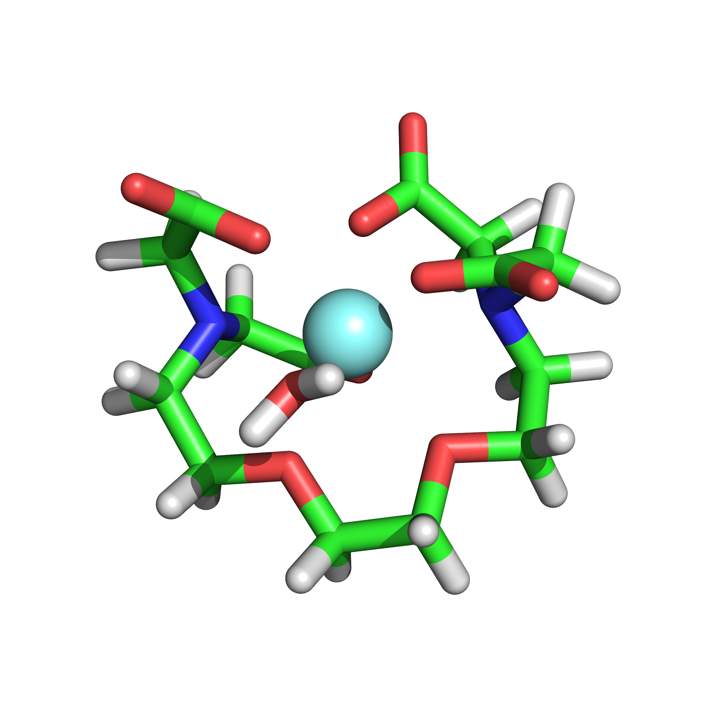

# 用螯合剂校准金属离子力场：12-6-4 LJ非键势的参数化新策略

## 本文信息

- **标题**：Chelator-Based Parameterization of the 12-6-4 Lennard-Jones Molecular Mechanics Potential for More Realistic Metal Ion-Protein Interactions
- **作者**：Paulius Kantakevicius, Calvin Mathiah, Linus O. Johannissen, Sam Hay
- **发表期刊**：Journal of Chemical Theory and Computation
- **发表时间**：2022年3月23日
- **DOI**：https://doi.org/10.1021/acs.jctc.1c00898
- **单位**：英国曼彻斯特大学生物技术研究所与化学系
- **引用格式**：Kantakevicius, P.; Mathiah, C.; Johannissen, L. O.; Hay, S. Chelator-Based Parameterization of the 12-6-4 Lennard-Jones Molecular Mechanics Potential for More Realistic Metal Ion-Protein Interactions. *J. Chem. Theory Comput.* **2022**, *18*, 2367–2374. https://doi.org/10.1021/acs.jctc.1c00898

---

## 摘要

> 金属离子与大量蛋白质相关，在广泛的生化过程中发挥关键作用。研究蛋白质-金属离子相互作用有多种方法，包括分子动力学模拟。最近，AMBER分子力学力场被修改为包含**12-6-4 Lennard-Jones势**，通过额外的成对$C_{ij}$系数更好地描述非键项。本文展示了一种生成$C_{ij}$参数的方法，允许对特定金属离子-配位基团进行参数化，从而通过**热力学积分（TI）**调节计算得到的结合能。新的$C_{ij}$系数在**EDTA、NTA、EGTA**以及来自lanmodulin和calmodulin蛋白的**EF1环肽**上进行了测试。新参数在计算结合能方面相对于现有力场有**显著改进**，并且产生的**配位数**和**离子-氧距离**与实验值吻合良好。该参数化方法应可扩展到其他系统，并可方便地用于调节除结合能之外的其他性质。

### 核心结论

- **12-6LJ势无法同时准确描述水合自由能和离子-氧距离**：一个参数集只能优化其中一个性质，另一个必然偏差。这是开发12-6-4LJ势的根本动机——新增的$C_{ij}$/$r^{4}$项用于描述离子诱导偶极相互作用，为力场提供了额外自由度。
- **默认的12-6-4LJ参数对蛋白质配位基团效果不佳**：尽管该势能准确描述金属-水相互作用，但用于EDTA等螯合剂时，结合能计算误差高达约-50 kJ/mol，说明针对水参数化的$C_{ij}$系数不适用于羧酸根等蛋白配体。
- **作者提出了一个基于线性方程系统的参数化策略**：用EDTA和NTA作为参比分子，通过线性拟合结合能对$C_{ij}$（氧）和$C_{ij}$（氮）的依赖关系，解耦不同配位原子类型的贡献，得到新的“Ch-BE”（Chelator-Based Binding Energy）参数。
- **新参数大幅提高了结合能计算精度**：在EDTA上平均绝对误差从32.8降至5.6 kJ/mol；在NTA和EGTA上精度提升约1.8倍；在EF-hand肽上虽然仍有高估，但平均误差从63.1降至29.0 kJ/mol，且正确再现了LanM EF1对La³⁺ > Y³⁺ > Ca²⁺的亲和力顺序。
- **新参数保持了合理的离子-氧距离和配位数**：与默认12-6-4LJ结果基本一致，说明在优化结合能的同时没有牺牲结构准确性。

---

## 背景

### 金属离子力场：一个老大难问题

金属离子存在于约50%的蛋白质中，参与酶催化、信号转导等关键生命过程。在分子动力学模拟中，金属离子的处理一直是个难点，核心困难在于三个方面。**高极化性**：金属离子容易发生电荷转移和配体交换。**配位数的可变性**：同一离子在不同蛋白质中配位数可能不同，如Ca²⁺常见6-8配位。**配位模式的动态性**：配体可以在单齿和双齿之间切换，水分子可以进入或离开第一配位层。

### 现有的解决方案及其局限

处理金属离子主要有两类方法：

**（1）键合模型（bonded model）**：将金属-配体键视为固定的共价键。这种方法的优点是计算稳定，但缺点也很明显——不能模拟配位数的变化和配体交换，需要针对不同的配位构型分别设置参数。

**（2）非键模型（nonbonded model）**：将金属-配体相互作用完全通过Lennard-Jones（LJ）势和库仑势来描述。这种方法的优点是允许金属离子自由切换配位模式和配位数，计算效率高，且不需要先验地指定配体。但缺点是忽略了电荷转移和极化效应。

### 12-6-4LJ势的诞生

在标准的12-6LJ势中，金属离子的参数化面临一个两难困境：
- 优化水合自由能（HFE）的参数，会导致离子-氧距离（IOD）偏短。
- 优化IOD的参数，会导致HFE偏差。

Li和Merz在2014年提出了12-6-4LJ势，在原有的12-6项基础上增加了$C_{ij}/r^{4}$项，用于描述离子诱导偶极和偶极-诱导偶极相互作用。这一项给力场多了一个可调参数，使得HFE和IOD可以同时被准确拟合。然而，最初的12-6-4LJ参数只针对金属离子与**水中的氧原子**进行了参数化，对于其他原子类型（如羧酸氧、胺氮）的$C_{ij}$系数则是从分子极化率张量计算中推算出来的。

### 问题的暴露

后续的研究发现，这些“推算”出来的$C_{ij}$系数在模拟金属离子与核苷酸相互作用时，结合能高估了高达20 kJ/mol。这说明，针对水参数化的$C_{ij}$系数不能直接用于蛋白质配位基团。那么，能否为氨基酸中的配位原子（如天冬氨酸/谷氨酸的羧酸氧）重新参数化$C_{ij}$系数呢？

本文正是要解决这个问题——用简单的小分子螯合剂作为模型系统，通过热力学积分计算结合能，反推得到针对羧酸氧和叔胺氮的$C_{ij}$参数。

**图1：EF1环中Ca²⁺（左）和Y³⁺（右）在LanM中的金属配位结构。** Ca²⁺结合于CaM（PDB 1CLL），Y³⁺结合于LanM EF1（PDB 6MIS的NMR构象1）。配位原子主要来自天冬氨酸和谷氨酸的羧酸氧，与EDTA/NTA的配位环境类似，这正是选择后者作为参数化参比分子的结构依据。

**图2：NTA（蓝色）和EGTA（红色）与EDTA的实验金属结合能散点图。** 黑色对角线为y=x。NTA数据用斜率为0.68、截距为+3 kJ·mol⁻¹的线性函数拟合，EGTA数据用二次多项式拟合（仅作图示）。这一实验关系是后续用EDTA和NTA解耦$C_{ij}$参数的关键。

### 关键科学问题

- **现有的12-6-4LJ默认$C_{ij}$参数在模拟金属离子与螯合剂结合时误差有多大？** 与12-6LJ的CM/IOD/HFE参数相比表现如何？
- **如何解耦不同配位原子类型（氧与氮）对结合能的贡献？** EDTA和NTA同时含有羧酸氧和叔胺氮，如何从它们的结合能数据中分离出各自的影响？
- **用EDTA和NTA训练出来的$C_{ij}$参数能否泛化到EGTA这样的陌生螯合剂？** 能否进一步用于EF-hand肽这样的蛋白片段？
- **优化结合能的同时，是否会牺牲离子-氧距离和配位数等结构性质的准确性？**
- **新的参数能否正确再现LanM EF1对不同金属离子的选择性顺序？**

### 创新点

- **首次针对蛋白质配位基团（羧酸氧、叔胺氮）重新参数化12-6-4LJ的$C_{ij}$系数**，打破了之前“针对水的参数直接用于蛋白”的假设。
- **提出了一套基于线性方程系统的参数化策略**：利用EDTA和NTA两个螯合剂的结合能数据，通过线性拟合得到$C_{ij}$（氧）和$C_{ij}$（氮）的唯一解。
- **验证了方法的泛化能力**：从EDTA/NTA训练的参数，在EGTA、LanM EF1和CaM EF1上都表现出显著改进。
- **为金属离子力场的“按需定制”提供了通用框架**：这套方法可以扩展到其他金属离子、其他配位原子类型，甚至可以用来调节除结合能之外的其他性质。

---

## 研究内容

### 方法概览：如何从螯合剂结合能反推$C_{ij}$参数？

整个参数化策略的核心思路是：用EDTA和NTA这两个结构相似但结合能不同的螯合剂作为“标尺”，通过线性方程系统解出羧酸氧和叔胺氮对结合能的贡献。

#### 为什么选EDTA和NTA？

EDTA（乙二胺四乙酸）和NTA（次氮基三乙酸）都含有羧酸基团（与天冬氨酸/谷氨酸侧链类似）和叔胺氮原子（图3）。它们与金属离子的结合亲和力已知且差异明显（表1），配位化学环境相似，适合作为参数化的模型系统。

#### 热力学积分（TI）计算

作者使用AMBER18和ff14SB力场，通过热力学积分计算金属离子与螯合剂的结合能。标准热力学循环如图S2所示，核心是计算两个过程：
1. 金属离子在水中的“去溶剂化”（将电荷和LJ参数逐步关闭）。
2. 金属离子与螯合剂在气相中的结合（再逐步打开电荷和LJ参数）。

结合能的计算分为两部分：
- $\Delta G_{\text{vdW}}$：LJ项的贡献（用9个λ步长）。
- $\Delta G_{\text{ele+pol}}$：静电和极化项的贡献（用12个λ步长，三重复）。

#### 线性方程系统的建立

作者计算了在不同$C_{ij}$（氧）和$C_{ij}$（氮）值下的EDTA和NTA结合能（图4、S4-S6），发现结合能与$C_{ij}$值呈**线性关系**：

\[
\Delta G_{\text{b}}^{\text{sim}}(C_{ij}) = \Delta G_{\text{b}}^{\text{sim}}(C_{ij}=0,0) + m(\text{O}) \cdot C_{ij}(\text{O}) + m(\text{N}) \cdot C_{ij}(\text{N})
\]

其中m(O)和m(N)是从线性拟合得到的斜率（表1），代表$C_{ij}$每变化1个单位对结合能的影响。

然后，利用EDTA和NTA的实验结合能，建立方程组：

\[
\begin{cases}
\Delta G_{\text{b}}^{\text{sim}}(\text{EDTA},0,0) + m_{\text{EDTA}}(\text{O})C_{ij}(\text{O}) + m_{\text{EDTA}}(\text{N})C_{ij}(\text{N}) = \Delta G_{\text{b}}^{\text{exp}}(\text{EDTA}) \\
\Delta G_{\text{b}}^{\text{sim}}(\text{NTA},0,0) + \frac{3}{4}m_{\text{EDTA}}(\text{O})C_{ij}(\text{O}) + \frac{1}{2}m_{\text{EDTA}}(\text{N})C_{ij}(\text{N}) = \Delta G_{\text{b}}^{\text{exp}}(\text{NTA})
\end{cases}
\]

其中3/4和1/2是NTA相对于EDTA的配位原子比例（EDTA最多可提供4个O和2个N，NTA最多3个O和1个N）。注意这里的m(O)和m(N)用的是EDTA的值，NTA的系数用比例缩放。

> 这个方程组的巧妙之处在于：它用EDTA的实验结合能确定$C_{ij}$(O)和$C_{ij}$(N)的线性组合，再用NTA的配位原子比例差异来解耦两个参数。如果只用EDTA，会有无穷多组($C_{ij}$(O), $C_{ij}$(N))满足方程；加上NTA后，就能得到唯一解。

#### 关于$\Delta G_b^{\text{sim}}(C_{ij}=0,0)$的处理

一个关键的技术细节：直接计算得到的$\Delta G_b^{\text{sim}}(C_{ij}=0,0)$（即把所有$C_{ij}$设为零时的结合能）对于NTA来说，在某些金属离子上竟然**大于实验值**（表1），这意味着为了匹配实验值，$C_{ij}$必须为负——这在物理上不合理（$C_{ij}$描述吸引力，应为正）。

为解决这个问题，作者采用外推法：从默认$C_{ij}$下的结合能反推$C_{ij}$=0,0时的“等效”结合能（式5），然后用EDTA和NTA实验结合能的比值来校准NTA的该值（式6）。这个处理确保了$C_{ij}$系数保持正值且物理合理。

**图3：左图，EDTA、NTA和EGTA的结构，下方为用默认12-6-4LJ参数进行的Ca²⁺-螯合剂MD模拟快照。右图，四种参数集下EDTA-金属离子结合能的计算值与实验值的偏差。** 12-6LJ CM用于Ca²⁺和Mg²⁺，12-6LJ IOD用于Y³⁺和La³⁺。“12-6-4LJ Ch-BE”为本研究生成的参数。

**图4：上图，EDTA和NTA与Ca²⁺的结合能随配位氧和氮$C_{ij}$值的变化。** 实心符号为氧，空心为氮。实线为线性拟合，水平虚线为实验值。默认$C_{ij}$已标出。**下图，EDTA-Ca²⁺结合能的二维等高线图**，等高线对应实验值（黑色），新Ch-BE值（红色虚线）。

**表1：EDTA和NTA的金属结合能（kJ/mol）及斜率m值（kJ/mol·$C_{ij}$⁻¹）**
| 金属离子 | $\Delta G_b^{\text{exp}}$ (EDTA) | $\Delta G_b^{\text{exp}}$ (NTA) | m(O) EDTA | m(N) EDTA | m(O) NTA | m(N) NTA |
| --- | --- | --- | --- | --- | --- | --- |
| Ca²⁺ | -60.8 | -37.5 | -0.593 | -0.177 | -0.442 | -0.081 |
| Mg²⁺ | -50.1 | -30.6 | -1.028 | -0.124 | -0.842 | +0.077 |
| Y³⁺ | -103.2 | -65.5 | -0.752 | -0.058 | -0.691 | +0.008 |
| La³⁺ | -87.6 | -59.1 | -0.632 | -0.056 | -0.491 | -0.028 |

**表2：默认和新的“Ch-BE”12-6-4LJ氧和氮$C_{ij}$系数（kcal/mol·Å⁻⁴）**
| 金属离子 | 默认 O | 默认 N | Ch-BE O | Ch-BE N |
| --- | --- | --- | --- | --- |
| Ca²⁺ | 34.4 | 65.9 | **29.2** | **110.6** |
| Mg²⁺ | 52.4 | 100.3 | **12.3** | **126.1** |
| Y³⁺ | 85.1 | 163.0 | **14.9** | **161.9** |
| La³⁺ | 59.9 | 114.7 | **9.5** | **46.3** |

### 结果一：EDTA上大幅改进

图3右图展示了四种参数集在EDTA-金属离子结合能上的表现：
- **12-6LJ HFE**：误差最大，对Y³⁺高达-240 kJ/mol，对La³⁺也有-114 kJ/mol。
- **12-6LJ CM/IOD**：表现居中，但对Mg²⁺误差约-85 kJ/mol。
- **12-6-4LJ默认**：最佳基准，但对Y³⁺误差约-53 kJ/mol。
- **12-6-4LJ Ch-BE（新）**：所有金属离子的误差均在±9 kJ/mol以内，平均绝对误差从32.8降至**5.6** kJ/mol。

### 结果二：泛化到NTA和EGTA——精度提升约1.8倍

为了检验新参数是否“过拟合”到EDTA，作者在NTA和EGTA上进行了验证（图5）。EGTA含有醚氧原子（未重新参数化，仍用默认值），这给测试增加了额外难度。

**表：NTA和EGTA上两种参数集的平均绝对误差（kJ/mol）**
| 螯合剂 | 默认12-6-4LJ | Ch-BE | 精度提升倍数 |
| --- | --- | --- | --- |
| NTA | 49.7 | 27.1 | 1.8 |
| EGTA | 30.9 | 17.2 | 1.8 |

Y³⁺-EGTA体系出现了两种不同构象（图S8），一种“正常”配位，一种“EGTA-溶剂氢键”构象，导致结合能计算存在较大差异（图中红蓝叉号标记）。这源于EGTA的柔性导致的不同配位模式，而非力场本身的问题。

**图5：NTA（A）和EGTA（B）的计算结合能与实验值的偏差。** 绿色为默认12-6-4LJ，黄色为Ch-BE。红蓝叉号标记EGTA-Y³⁺在两种不同构象下的近似能量。

### 结果三：EF-hand肽——选择性顺序被正确再现，但结合能仍有高估

最严格的测试来自蛋白质EF-hand肽段。作者测试了LanM（lanmodulin，一种镧系元素选择性蛋白）和CaM（calmodulin，钙调蛋白）的EF1环肽（12个残基）。

**关键结果**（表3）：

**（1）结合能精度提升**：
- 12-6LJ CM/IOD平均误差：84.6 kJ/mol。
- 默认12-6-4LJ平均误差：63.1 kJ/mol。
- Ch-BE平均误差：**29.0** kJ/mol，比默认参数精度提升2.2倍。

**（2）LanM EF1的选择性顺序被正确再现**：
- 实验顺序：La³⁺ > Y³⁺ > Ca²⁺（Mg²⁺无数据）。
- Ch-BE预测：La³⁺（-95.8）> Y³⁺（-73.2）> Ca²⁺（-55.5）> Mg²⁺（-39.9）——**完全正确**。
- 其他参数集均未能正确预测这一顺序。

**（3）CaM EF1的选择性未能正确再现**：
- 实验顺序：La³⁺ > Ca²⁺ > Mg²⁺。
- 所有三种参数集均预测：La³⁺ > Mg²⁺ > Ca²⁺（Mg²⁺强于Ca²⁺）。
- 但Ch-BE的定量误差显著减小（Ca²⁺：-54.1 vs -33.9，Mg²⁺：-57.8 vs -22.8）。

**表3：LanM和CaM EF1环肽的金属结合能（kJ/mol）**
|  | Ca²⁺ | Mg²⁺ | Y³⁺ | La³⁺ |
| --- | --- | --- | --- | --- |
| **LanM EF1 实验** | -18.0 | N/A | -61.4 | -64.3 |
| 12-6LJ CM/IOD | -67.4 | -119.2 | -205.6 | -159.6 |
| 12-6-4LJ默认 | -52.3 | -84.3 | -151.7 | -127.9 |
| **Ch-BE** | **-55.5** | **-39.9** | **-73.2** | **-95.8** |
| **CaM EF1 实验** | -33.9 | -22.8 | N/A | -45.3 |
| 12-6LJ CM/IOD | -53.6 | -121.1 | -189.5 | -152.3 |
| 12-6-4LJ默认 | -71.5 | -100.3 | -148.3 | -126.7 |
| **Ch-BE** | **-54.1** | **-57.8** | **-74.7** | **-89.1** |

> 为什么EF-hand的结合能仍然被高估（尽管比之前好很多）？可能的原因：实验值是全长蛋白4个EF-loop的平均亲和力，而模拟只模拟了一个EF-loop（结合位点可能有差异）；肽段的末端没有被完整蛋白的折叠环境所约束，可能产生过度稳定的构象。

### 结果四：离子-氧距离和配位数——结构性质得以保持

新参数是否破坏了原有的结构准确性？表4给出了答案。

**图S11：全长LanM蛋白中Y³⁺配位构象的对比。** 图中结构取自全长LanM与Y³⁺离子的MD模拟轨迹。三种参数集（12-6LJ IOD、12-6-4LJ默认、12-6-4LJ Ch-BE）下Y³⁺与配位残基的配位框架基本一致。值得注意的是，在Ch-BE和默认12-6-4LJ参数中，**Asp 9直接与Y³⁺配位**；而在12-6LJ IOD参数中，Asp 9通过氢键与水分子相连，再由水分子配位Y³⁺。这两种Asp 9的配位模式在实验结构中均有出现——12个实验构象中有3个使用Asp 9直接配位，9个不使用。Ch-BE模拟中还观察到**Asp 3氢键连接到配位水分子**，这在实验构象中未见。

**关键发现**：
- **12-6-4LJ Ch-BE与默认12-6-4LJ的IOD几乎相同**（差异不超过0.02 Å），说明在优化结合能的同时没有牺牲结构精度。
- 12-6LJ CM/IOD的Mg²⁺、Y³⁺、La³⁺的IOD偏短（如Mg²⁺仅1.94 Å vs 2.05 Å），这与该参数集的已知缺陷一致。
- Ca²⁺的配位数在7.7-8.7之间波动，反映了单齿和双齿配位模式的动态切换。这一现象在CaM晶体结构PDB 1CFF中也能观察到，可能反映了真实的物理行为。
- Y³⁺和La³⁺的配位数稳定在9和10，与实验一致。

**表4：LanM和CaM EF1中金属离子的IOD（Å）和配位数（CN）**
|  | 12-6LJ CM/IOD | 12-6-4LJ默认 | 12-6-4LJ Ch-BE |
| --- | --- | --- | --- |
| **LanM EF1 Ca²⁺** | CN 8.3-8.7, IOD 2.43 | CN 8.0, IOD 2.39 | CN 8.0-8.5, IOD 2.40 |
| **LanM EF1 Mg²⁺** | CN 6.0, IOD 1.94 | CN 7.0, IOD 2.08 | CN 6.0-6.7, IOD 2.07 |
| **LanM EF1 Y³⁺** | CN 9.0, IOD 2.28 | CN 9.0, IOD 2.30 | CN 9.0-9.3, IOD 2.31 |
| **LanM EF1 La³⁺** | CN 10.0, IOD 2.45 | CN 10.0, IOD 2.50 | CN 10.0, IOD 2.49 |

---

## 讨论

### “泛化性”的限度：为什么EGTA的Y³⁺这么难算？

EGTA的Y³⁺体系是本文中最具挑战性的案例。MD轨迹显示，EGTA-Y³⁺在不同模拟中会出现两种截然不同的配位模式（图S8）：
- **正常模式**：Y³⁺主要由EGTA的配位基团配位。
- **EGTA-溶剂氢键模式**：一个水分子在EGTA的醚氧和羧酸根之间形成氢键网络，稳定了一个不同的构象，导致结合能高估约50 kJ/mol。

**图S8：EGTA-Y³⁺在12-6-4LJ Ch-BE参数下的MD模拟快照。** 上行为正常配位模式，下行为存在EGTA-溶剂氢键的稳定构象。两种构象的能量差异导致EGTA-Y³⁺结合能计算出现约50 kJ/mol的偏差（图5B中的红蓝叉号）。

对于具有高度柔性的配体（如EGTA），单凭力场参数的改进可能不足以解决所有问题，配体本身的构象采样和溶剂效应同样重要。未来的工作可以结合CDAM（阳离子哑铃模型）或双退耦方法来进一步改善这类体系的模拟。

### 为什么EF-hand肽的结合能仍然高估？

尽管Ch-BE在EF-hand肽上取得了显著改进（平均误差从63降至29 kJ/mol），但结合能仍然被系统性高估。可能的原因包括：
1. **实验值是全长蛋白多个EF-loop的平均值**，而模拟只模拟了EF1一个loop，不同loop的亲和力可能有差异。
2. **肽段缺少完整蛋白的折叠约束**，可能采样到过度稳定的构象。
3. **TI计算中vDW项的贡献被简化处理**（固定为-9 kJ/mol），忽略了对不同金属离子的变化。
4. **配体原子类型的覆盖面有限**：EF-hand中除了羧酸氧，还有主链羰基氧（酰胺）参与配位，后者未被重新参数化。

### 方法的可扩展性

这套参数化策略具有较强的可扩展性：
- **调节其他性质**：除了结合能，还可以针对离子-氧距离、配位数等性质进行参数化（只需改变目标函数）。
- **扩展到其他原子类型**：可以用类似的策略为咪唑氮（组氨酸）、硫（半胱氨酸/甲硫氨酸）等配位原子生成$C_{ij}$参数。
- **扩展到其他金属离子**：只要存在合适的参比螯合剂及其结合能数据，就可以套用这套方法。

---

## 关键结论与批判性总结

### 主要贡献

- **首次为蛋白质配位基团专门参数化12-6-4LJ的$C_{ij}$系数**，打破了“水参数通用”的假设，使结合能计算误差从数十kJ/mol降至个位数（在螯合剂上）或显著改善（在蛋白肽段上）。
- **建立了基于线性方程系统的参数化框架**，利用EDTA和NTA的结构差异解耦不同配位原子类型的贡献，方法简洁且物理意义清晰。
- **验证了参数的泛化能力**：从EDTA/NTA训练的参数在EGTA、LanM EF1和CaM EF1上均表现出改进，证明策略有效。
- **成功再现了LanM EF1的金属选择性顺序**（La³⁺ > Y³⁺ > Ca²⁺），这是其他参数集无法做到的，对镧系元素结合蛋白的研究有直接意义。

### 局限性

- **参数化基于小分子螯合剂**：EDTA和NTA虽然是好的模型系统，但蛋白质中的配位环境更复杂（主链羰基、水分子、不同氨基酸侧链的协同配位），从螯合剂外推至蛋白仍有一定差距。
- **EF-hand肽的结合能仍然系统高估**：即使有了Ch-BE参数，计算值仍比实验值高约1.2-3倍（如LanM EF1 Ca²⁺的-55.5 vs -18.0 kJ/mol），说明还有尚未解决的物理因素（如蛋白环境、构象熵等）。
- **EGTA的Y³⁺体系表现不稳定**：配体柔性导致的构象多态性问题，单纯靠力场参数无法完全解决，可能需要结合增强采样方法。
- **未测试过渡金属离子**：研究仅限于Ca²⁺、Mg²⁺、Y³⁺、La³⁺，对于更复杂的过渡金属离子（如Zn²⁺、Fe³⁺、Cu²⁺），配位几何更丰富、极化效应更强，参数化难度更大。

### 未来方向

- **扩展配位原子类型**：为组氨酸的咪唑氮、半胱氨酸的硫、主链酰胺氧等生成$C_{ij}$参数。
- **测试更多蛋白体系**：不仅仅是EF-hand，还包括金属蛋白酶、金属转录因子等。
- **结合CDAM方法**：阳离子哑铃模型可以在保持配位几何的同时允许配体交换，与12-6-4LJ结合可能同时改善结合能和配位数。
- **发展自动化的参数化流程**：将本文的线性方程系统策略自动化，让用户可以为任意金属离子-配体组合快速生成参数。

---

> 本文的代码和参数已随文章公开（见SI），读者可直接在AMBER中使用新参数。对于从事金属蛋白MD模拟的研究者，**在计算金属离子与蛋白的结合能时，使用“12-6-4LJ Ch-BE”参数代替默认值是一个立即可行的改进**，特别是在涉及天冬氨酸/谷氨酸配位的体系中。如果后续研究能进一步补充其他配位原子类型的$C_{ij}$参数，这套方法有望成为金属离子力场参数化的标准流程。