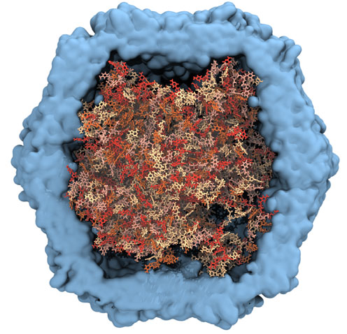
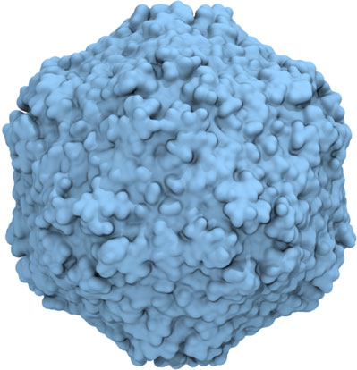

> 本文是《Polyply：图匹配算法驱动的聚合物模拟参数生成与结构构建》的附录，包含详细的算法实现、参数推导和扩展验证案例。

## 算法实现细节

### 图嵌入与几何优化

Polyply使用两步图嵌入策略生成残基的初始坐标：

**步骤1：Kamada-Kawai嵌入**

Kamada-Kawai算法将图嵌入问题转化为能量最小化：

$$
E = \sum_{i<j} k_{ij} (d_{ij} - l_{ij})^2
$$

其中：
- $d_{ij}$是节点i和j之间的欧几里得距离
- $l_{ij}$是图中i和j之间的最短路径长度
- $k_{ij} = K / l_{ij}^2$是弹簧常数

该算法能生成反映图拓扑的初始坐标，但不考虑分子几何约束。

**步骤2：L-BFGS几何优化**

基于残基内键合相互作用进行几何优化，目标函数：

$$
F = \sum_{\text{bonds}} k_b (r - r_0)^2 + \sum_{\text{angles}} k_\theta (\theta - \theta_0)^2 + \sum_{\text{dihedrals}} k_\phi [1 + \cos(n\phi - \delta)]
$$

使用L-BFGS算法最小化，确保生成的残基几何满足力场约束。

### Super CG模型参数推导

#### 回转半径计算

对于单个残基，回转半径定义为：

$$
R_g = \sqrt{\frac{1}{N} \sum_{i=1}^{N} (\mathbf{r}_i - \mathbf{r}_{\text{COM}})^2}
$$

其中$\mathbf{r}_{\text{COM}}$是质心坐标。

#### LJ σ参数推导

super CG模型的σ参数基于回转半径：

$$
\sigma = 2 R_g \times f_{\text{scale}}
$$

缩放因子$f_{\text{scale}}$根据力场调整：
- GROMOS全原子：$f_{\text{scale}} = 1.0$
- Martini粗粒化：$f_{\text{scale}} = 0.85$

这一差异反映了不同力场中残基天然堆积密度的不同。

### 自排除随机游走算法

伪代码如下：

```
对于每个分子：
    将第一个残基随机放置在盒子中

    对于后续每个残基：
        max_attempts = 1000
        for attempt in range(max_attempts):
            # 随机采样方向
            direction = random_unit_vector()

            # 根据键长确定距离
            distance = bond_length(previous_residue, current_residue)

            # 计算候选位置
            candidate_position = previous_position + distance * direction

            # 检查与所有已放置残基的重叠
            overlap = False
            for placed_residue in placed_residues:
                LJ_energy = calculate_LJ(candidate_position, placed_residue)
                if LJ_energy > threshold:  # 默认10 kJ/mol
                    overlap = True
                    break

            if not overlap:
                accept_position(candidate_position)
                break

        if overlap:  # 所有尝试都失败
            return FAILURE
```

关键参数：
- 重叠阈值：10 kJ/mol（对应约0.7σ的距离）
- 最大尝试次数：1000次/残基

## 扩展验证案例

### 聚合物熔体详细数据

作者测试了多种聚合物熔体，详细数据见下表：

| 聚合物 | 力场 | 温度(K) | 实验密度(g/cm³) | 模拟密度(g/cm³) | 误差(%) |
|--------|------|---------|-----------------|-----------------|---------|
| PP | GROMOS | 513 | 0.76 | 0.74 ± 0.01 | 2.6 |
| PE | GROMOS | 413 | 0.78 | 0.77 ± 0.01 | 1.3 |
| PS | GROMOS | 513 | 0.97 | 0.95 ± 0.02 | 2.1 |
| PMMA | GROMOS | 513 | 1.10 | 1.08 ± 0.02 | 1.8 |
| PEO | Martini | 413 | 1.06 | 1.05 ± 0.01 | 0.9 |
| PMA | Martini | 413 | 1.10 | 1.09 ± 0.01 | 0.9 |

所有体系在5-10 ns内达到平衡密度，表明Polyply生成的初始结构质量高。

### DNA末端距离分布



**SI图1：DNA回转半径和末端距离分布**

- **左图**：回转半径分布
- **右图**：末端距离分布
- **红色**：全原子MD模拟参考
- **蓝色**：Polyply生成的200个初始结构

关键观察：
- Polyply生成的分布较宽，但与全原子分布有良好重叠
- 证明Polyply构象是良好的起始点
- 注意：全原子力场预测的$R_g = 2.8 \pm 0.5$ nm低于实验值$3.8 \pm 0.1$ nm

### 环状DNA在病毒衣壳内的构建



**SI图2：猪病毒环状ssDNA生成工作流程**

**案例亮点**：
- 从数据库获取病毒基因组序列和衣壳晶体结构
- 使用ParmSC1力场为DNA生成参数
- 衣壳蛋白使用Amber14力场
- DNA使用球形几何约束+衣壳边界限制
- 每个核苷酸位点放置一个$\ce{Na+}$离子（使用ligation功能）
- 使用cycle选项生成环状DNA

**关键技术**：
- 球形约束加速算法（避免与每个衣壳原子检查重叠）
- 高盐浓度（~2 mol/L）使DNA采用柔性无规卷曲构象
- 三步平衡：0.1 fs柔性键 → 1 fs约束键 → 2 fs生产运行

**结果**：60 ns生产运行中体系稳定，观察到衣壳内外的离子交换，暗示衣壳内存在最优盐浓度。

### 聚合物锂离子电池


**SI图3：PS-b-PEO LiTFSI掺杂电池生成工作流程**

**体系组成**：
- 聚苯乙烯-聚乙二醇二嵌段共聚物（PS-b-PEO）
- 锂双三氟甲烷磺酰亚胺盐（LiTFSI）掺杂
- Martini 2粗粒化力场

**验证结果**：
- **层间距**：模拟值~21 nm，实验值20 nm（优异吻合）
- **盐分布**：$\ce{Li+}$富集在PEO畴内，与实验报道的盐通道形成一致
- **相分离**：清晰的PS和PEO交替层状结构，界面有一定混合

这一案例展示了Polyply在功能材料模拟中的应用潜力。

### 脂质囊泡内液-液相分离详细工作流程


**SI图4：葡聚糖-PEO液-液相分离囊泡工作流程**

**葡聚糖分子量分布建模**：

作者使用线性缩聚反应动力学模型：

$$
\text{prob}(N, p) = N \times p^{N-1} (1-p)^2
$$

其中$p$是反应程度。通过调整$p$使数均分子量$\bar{M}_n \approx 65$（与实验一致），得到多分散指数PDI $\approx 1.5$（文献值1.8）。

**支化度**：5%的1,3-糖苷键（文献值，分子量<100,000 g/mol）

**结果**：
- 成功生成包含500个不同链长葡聚糖分子的多分散体系
- 展示了Polyply处理统计共聚和多分散性的能力

## 性能优化策略

### 参数生成优化

- **子图同构匹配**：在残基图层级执行而非原子层级，复杂度从$O(N_{\text{atoms}}!)$降至$O(N_{\text{residues}}!)$
- **缓存机制**：相同残基类型的block只需加载一次
- **并行化**：独立分子的参数生成可并行执行

### 坐标生成优化

- **Early termination**：检测到不可能完成的构象立即终止（如体积分数过高）
- **分层放置**：优先放置大分子，小分子填充空隙
- **网格加速**：使用空间分区网格加速重叠检测，复杂度从$O(N^2)$降至$O(N \log N)$

### 成功率与体积分数

作者系统测试了不同体积分数下的成功率：

| 体积分数φ | 成功率 | 平均尝试次数/残基 |
|-----------|--------|-------------------|
| 0.1 | 100% | <10 |
| 0.3 | 99% | <50 |
| 0.5 | 95% | <200 |
| 0.7 | 90% | <500 |
| 0.9 | <50% | >1000 |

**建议**：
- φ < 0.7：直接使用Polyply
- 0.7 < φ < 0.9：增加max_attempts或使用更小的初始盒子尺寸
- φ > 0.9：考虑先在较低密度生成，再通过NPT压缩

## 力场库扩展

### 当前支持的力场

- **全原子**：GROMOS 54A7, GROMOS 2016H66, Amber14, CHARMM36
- **粗粒化**：Martini 2, Martini 3, SDK（软球模型）

### 添加新残基示例

创建一个PEO单元的block文件（JSON格式）：

```json
{
  "name": "PEO",
  "atoms": [
    {"name": "C1", "type": "CH2", "charge": 0.0},
    {"name": "O", "type": "O", "charge": -0.4},
    {"name": "C2", "type": "CH2", "charge": 0.0}
  ],
  "bonds": [
    {"atoms": ["C1", "O"], "length": 0.143, "force_constant": 8000},
    {"atoms": ["O", "C2"], "length": 0.143, "force_constant": 8000}
  ],
  "angles": [
    {"atoms": ["C1", "O", "C2"], "angle": 109.5, "force_constant": 450}
  ]
}
```

创建对应的link文件定义C2-C1'连接：

```json
{
  "name": "PEO-PEO",
  "atoms": ["C2", "+C1"],
  "bond": {"length": 0.153, "force_constant": 7500}
}
```

## 常见问题与解决方案

### 问题1：坐标生成失败

**症状**：生成过程卡住或报错“Maximum attempts reached”

**可能原因**：
- 体积分数过高
- 残基间存在不兼容的几何约束
- LJ参数设置不合理

**解决方案**：
- 降低目标密度，稍后通过NPT压缩
- 检查残基模板坐标的合理性
- 调整$f_{\text{scale}}$参数

### 问题2：生成结构需要长时间平衡

**症状**：能量最小化或MD平衡耗时过长

**可能原因**：
- 存在严重的原子重叠
- 键长/键角与力场参数偏差大

**解决方案**：
- 降低重叠阈值（更严格的重叠检测）
- 使用更精细的几何优化（增加优化步数）
- 分阶段平衡（逐步增加时间步长）

### 问题3：环状聚合物闭环失败

**症状**：环不闭合或闭环处应力过大

**可能原因**：
- 链长与持久长度不匹配
- 随机游走未考虑闭环约束

**解决方案**：
- 使用更灵活的链（降低持久长度）
- 先生成开链，后通过约束MD逐步闭合
- 增加Monte Carlo尝试次数

## 与其他工具的比较

| 特性 | Polyply | CHARMM-GUI | Packmol | Moltemplate |
|------|---------|------------|---------|-------------|
| 参数生成 | ✓ | ✓ | ✗ | ✓ |
| 坐标生成 | ✓ | ✓ | ✓ | ✗ |
| 力场无关 | ✓ | ✗ | ✓ | ✓ |
| 任意拓扑 | ✓ | 部分 | ✗ | ✓ |
| 高通量友好 | ✓ | ✗ | ✓ | 部分 |
| 图形界面 | ✗ | ✓ | ✗ | ✗ |

**Polyply的独特优势**：
- 唯一同时支持参数和坐标生成、且力场无关的工具
- 图算法框架提供最大的灵活性和可扩展性
- 命令行界面最适合高通量脚本化工作流

## 未来技术路线图

- **机器学习增强**：使用ML预测最优super CG参数和重叠阈值
- **GPU加速**：将重叠检测和能量计算移至GPU
- **云服务**：提供Web界面和REST API，降低使用门槛
- **与自动化力场开发工具集成**：如GAFF、CGenFF自动参数化工具
- **晶格结构模板**：为聚合物晶体提供专门的构建算法

## 相关资源

- [主文档](2025-11-16-polyply-macromolecule-simulation-builder.md)：Polyply核心原理和主要应用
- [Polyply官方教程](https://polyply.readthedocs.io/en/latest/tutorials.html)
- [GitHub Issues](https://github.com/marrink-lab/polyply_1.0/issues)：问题反馈和讨论
