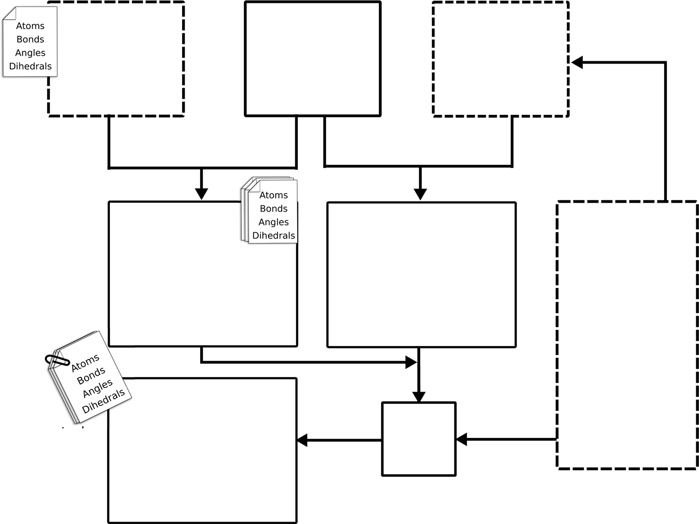
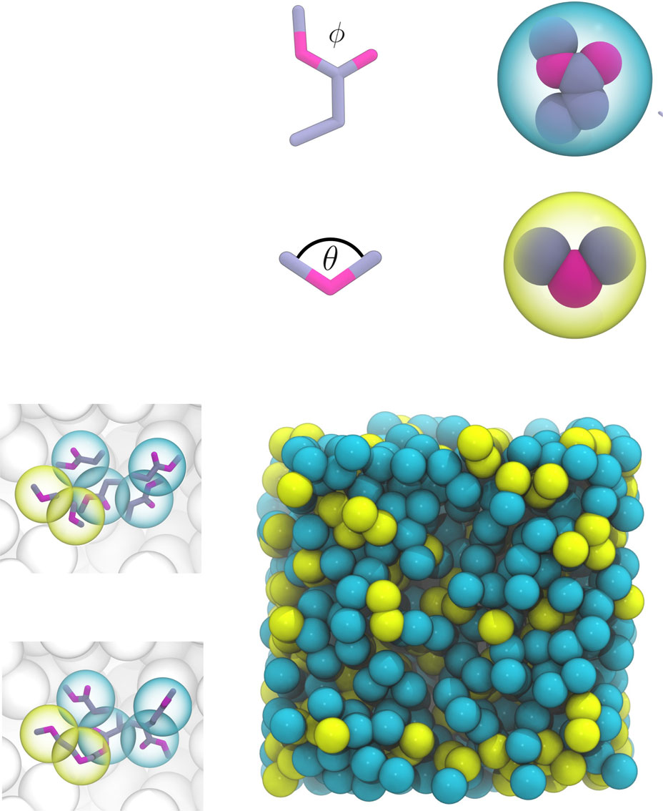
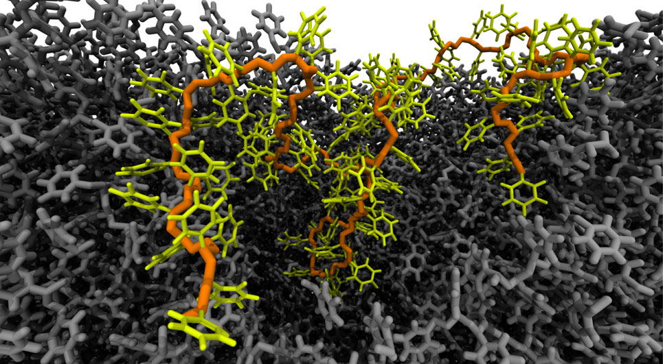
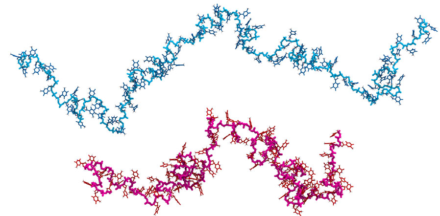
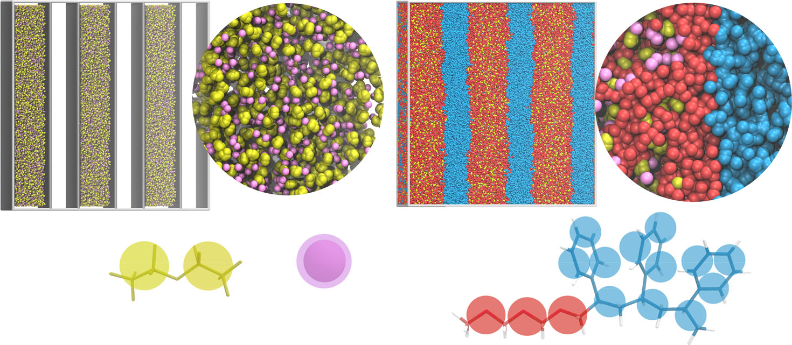

# Polyply：图匹配算法驱动的聚合物模拟参数生成与结构构建

## 本文信息

- **标题**: Polyply; a python suite for facilitating simulations of macromolecules and nanomaterials
- **作者**: Fabian Grünewald, Riccardo Alessandri, Peter C. Kroon, Luca Monticelli, Paulo C. T. Souza, Siewert J. Marrink
- **发表时间**: 2022年1月
- **单位**:
  - University of Groningen (荷兰格罗宁根大学)
  - University of Chicago (美国芝加哥大学)
  - CNRS and University of Lyon (法国里昂大学)
- **引用格式**: Grünewald, F., Alessandri, R., Kroon, P. C., Monticelli, L., Souza, P. C. T., & Marrink, S. J. (2022). Polyply; a python suite for facilitating simulations of macromolecules and nanomaterials. *Nature Communications*, *13*(1), 68. https://doi.org/10.1038/s41467-021-27627-4
- **GitHub代码**: https://github.com/marrink-lab/polyply_1.0
- **文档**: https://polyply.readthedocs.io

- [Polyply官方文档](https://polyply.readthedocs.io)
- [GitHub代码库](https://github.com/marrink-lab/polyply_1.0)
- [Martini力场官网](http://cgmartini.nl)

## 摘要

> 分子动力学模拟在（纳米）材料理性设计和生物大分子研究中扮演着日益重要的角色。然而，为这些模拟生成输入文件和真实的初始坐标是一个主要瓶颈，特别是对于**高通量筛选协议**和**复杂多组分体系**。为解决这一瓶颈，本文提出了Polyply软件套件，它提供：1）一个多尺度**图匹配算法**，能够快速生成任意复杂聚合物拓扑的参数；2）一个通用的多尺度**随机游走协议**，能够高效地设置复杂体系，且独立于目标力场或模型分辨率。作者通过创建聚合物熔体、单链及环状单链DNA的真实坐标来评估该方法的质量和性能，并通过设置微相分离嵌段共聚物体系和脂质囊泡内液-液相分离体系展示了该方法的强大功能。

### 核心结论

- Polyply基于**图转换算法**，将残基图（residue graph）映射为高分辨率参数文件，支持任意复杂的聚合物拓扑结构
- 采用**多尺度随机游走**生成初始坐标，先构建超粗粒化（super CG）模型，再反向转换到目标分辨率
- **力场无关设计**，同时支持全原子和粗粒化模型，极大提升了高通量筛选的可行性
- 在聚合物熔体、DNA单链、嵌段共聚物、相分离体系等多个复杂案例中验证了方法的准确性和效率

## 背景

分子动力学（MD）模拟已成为补充实验研究的强大工具。近年来，研究趋势从单一聚合物熔体或混合物转向更复杂的多组分体系，包括纯合成材料和生物-合成杂化大分子。这些体系的应用范围广泛，从聚电解质复合凝聚体到下一代聚合物电池，再到抗菌聚合物和可生物降解聚合物。

随着材料基因组计划的推进，基于MD的**虚拟高通量筛选**正成为研究热点。MD高通量筛选相比实验方法成本更低，且能提供实验难以获取的性质信息，使研究者能够更高效地探索组合空间并筛选候选材料。然而，这一前景的实现需要程序能够**快速、可靠、一致地**构建拓扑和模拟盒子。

当前的主要挑战在于：现有工具主要针对蛋白质、脂质膜、DNA等生物分子，对合成聚合物和生物-合成杂化大分子的支持严重不足。虽然存在一些特定解决方案，但它们通常只支持单一力场，仅限于开发者实现的特定（主要是线性）聚合物，且网站实现方案依赖服务器负载并需要人工交互。更复杂体系（如微相分离聚合物、杂化纳米颗粒共混物）的坐标生成往往依赖多尺度自组装或定制脚本。

## 关键科学问题

本文旨在解决聚合物和生物大分子MD模拟中的五个核心挑战：

1. **参数与坐标生成的通用性**：程序需要同时生成坐标和参数，且与分辨率和力场无关。准确的粗粒化模型通常基于全原子聚合物，因此支持两者是高通量模型开发的关键
2. **输入文件生成的易用性**：需要一个简单的流程，基于体系组成生成输入文件，支持任意复杂的聚合物序列，包括不同分支度和统计分布
3. **参数与坐标的组合能力**：程序需要能够组合不同分辨率的聚合物输入，例如在相同模拟中混合全原子和粗粒化模型
4. **边界条件与几何的灵活性**：需要支持三维周期性边界条件、球形、柱状等多种几何形状
5. **高通量筛选的性能要求**：坐标和参数文件生成必须足够快，以支持高通量协议

## 创新点

- **图转换算法**：首次将聚合物参数化问题完全转化为图同构匹配问题，实现了对任意复杂拓扑结构的自动参数生成
- **多尺度随机游走**：创新性地采用“超粗粒化→目标分辨率”的反向构建策略，避免了传统方法依赖坐标片段库的局限
- **力场无关框架**：通过分离算法核心与力场参数库，实现了对Martini、GROMOS、CHARMM、OPLS等多种力场的统一支持
- **自动化工作流**：从残基序列到完整模拟输入的全流程自动化，大幅降低了使用门槛

---

## 研究内容

### Polyply软件架构

Polyply由两个核心模块组成：

1. **polyply gen_params**：基于图匹配算法的参数文件生成器
2. **polyply gen_coords**：基于多尺度随机游走的坐标生成器

两个模块共享统一的图表示基础架构，均基于NetworkX和vermouth Python库实现图相关计算。

**图1：参数文件生成工作流程**

以聚乙二醇（PEO）接枝甲基丙烯酸酯（MA）为例，展示了三步图转换过程：
- **输入**：残基图（residue graph）和力场库中的building blocks
- **步骤1**：生成目标分辨率的断开残基图
- **步骤2**：在残基图层级匹配links
- **步骤3**：将通用links匹配到具体残基，生成完整参数文件

### 核心算法一：图匹配驱动的参数生成

Polyply将参数文件生成问题转化为**图转换**（graph transformation）问题。其核心思想是：将残基图映射为高分辨率的分子图，该图与目标分辨率无关。

#### 基本概念

- **图表示**：分子的连接性转化为图的边，原子特征（名称、残基名等）存储为节点属性
- **Block（构建块）**：对应单个残基的所有相互作用和原子的图
- **Link（连接）**：描述两个或多个残基连接时引入的相互作用（如键、角度）

#### 三步图转换算法

**步骤1：生成断开的残基图**

遍历输入残基图的所有残基，为每个残基从库中匹配对应的block，添加到空图中，形成目标分辨率的断开图。此时已包含目标分子的所有原子和残基内相互作用，但缺少跨残基的连接。

**步骤2：在残基层级查找所有links**

为生成跨越多个残基的相互作用，需要在残基之间应用links。Polyply将其转化为**残基图层级的子图同构问题**：查找link在残基图上的所有可能匹配方式，受节点属性等约束限制。在残基图层级执行大幅降低了问题规模。

**步骤3：将通用links匹配到具体残基**

根据步骤2建立的link与残基的对应关系，程序将link中的原子与步骤1生成的断开图中的原子建立对应关系。匹配不仅基于原子名称和残基索引，还可扩展到其他原子特征，从而考虑残基图连接性未编码的信息（如手性、端基异构体）。当link被添加时，其边也被添加到断开图中，逐步将断开图转变为目标分辨率的连通图。

#### 算法优势

- **通用性**：适用于任意复杂的聚合物拓扑，包括分支、环状、统计共聚等结构
- **可扩展性**：通过匹配节点属性，可处理手性、端基异构等精细化学信息
- **效率**：在残基图层级解决子图同构问题，显著降低计算复杂度

### 核心算法二：多尺度随机游走坐标生成

Polyply采用**通用多尺度方法**构建起始坐标：首先生成超粗粒化（super CG）分辨率表示，然后反向转换到目标分辨率。这一策略类似于CHARMM-GUI polymer builder，但有三个关键改进：

1. **动态参数推导**：super CG模型参数基于目标力场动态推导，而非预定义
2. **自排除随机游走**：采用随机游走而非全尺度动力学模拟
3. **自动反向转换**：不依赖坐标片段库的自动化反变换

**图2：坐标生成的五步工作流程**

#### 五步坐标生成算法

**步骤1：将所有分子映射为每残基一个珠子**

分析拓扑文件，检测所有分子类型。对每个分子，识别所有唯一残基并转换为blocks。创建通用的每残基一个珠子的super CG模型，以图形式存储。残基图的连接性从分子的键合图中提取。

**步骤2：为残基生成坐标**

每个block是单个残基的图，使用**图嵌入**（graph embedding）生成坐标。由于分子几何的特殊要求，采用两步图嵌入：
- 首先使用Kamada-Kawai嵌入生成初始坐标
- 随后基于残基内键合相互作用进行几何优化，使用L-BFGS优化器

**步骤3：推导通用CG模型参数**

自排除随机游走使用每残基一个珠子的近似CG模型，基于Lennard-Jones（LJ）势。关键参数推导：
- **ε参数**（LJ势阱深度）：固定为1 kJ/mol（因不执行动力学，吸引部分不重要）
- **σ参数**（决定堆积密度）：从残基模板坐标计算，反映残基体积。基于回转半径推导（将聚合物物理中的链回转半径概念移植到单个残基的分子几何）

此外，算法还考虑了残基在全原子模型中的天然堆积密度，通过缩放因子调整不同力场间的差异。

**步骤4：通过随机游走生成super CG坐标**

对体系中每个分子执行随机游走。算法依次添加残基：
- 第一个残基随机放置
- 后续残基通过以下方式添加：
  1. 在前一个残基周围随机采样方向
  2. 根据键合相互作用确定距离
  3. 检查与已放置残基的重叠（使用LJ势）
  4. 若无冲突则接受，否则重新采样

这一过程确保了生成的构象满足键合约束，同时避免了原子重叠。

**步骤5：反向映射到目标分辨率**

将super CG坐标反向映射到目标分辨率。关键步骤：
- 每个残基的质心固定在super CG珠子位置
- 残基内部坐标从步骤2的模板继承
- 应用适当的旋转和平移，确保跨残基键合几何正确
- 对生成的结构进行能量最小化，消除局部应力

#### 坐标生成的关键技术

- **多尺度策略**：先在粗粒度生成全局构象，再细化局部结构，极大提升了效率
- **自排除机制**：随机游走过程中实时检测并避免原子重叠，确保生成结构的物理合理性
- **自动反向映射**：基于几何约束的自动化反变换，无需人工设计坐标片段库

###  验证案例

#### 案例1：聚合物熔体

作者测试了聚丙烯（PP）、聚乙烯（PE）、聚苯乙烯（PS）和聚甲基丙烯酸甲酯（PMMA）四种聚合物熔体的密度预测。

**结果**：
- 所有体系在5-10 ns内达到平衡
- 密度误差<2%，与实验值高度一致
- PP熔体（最苛刻测试）的Flory特征比与实验数据完美吻合

这验证了Polyply生成的初始结构具有良好的物理性质，能快速弛豫到平衡态。

#### 案例2：单链DNA和环状DNA

作者使用Martini 3力场生成了单链DNA（ssDNA）和环状单链DNA（cssDNA）的坐标。

**图3：DNA结构生成与验证**

- **a-c**：ssDNA序列、生成的初始结构和平衡后的结构
- **d**：ssDNA的末端距离分布与Martini 3全原子模拟高度一致
- **e-f**：cssDNA的初始和平衡结构，展示了环状拓扑的正确处理

**关键发现**：
- 生成的ssDNA结构经短时间平衡后，末端距离分布与基准全原子模拟结果一致
- cssDNA的环状拓扑约束得到正确处理，无需手动调整

#### 案例3：微相分离嵌段共聚物

作者构建了聚苯乙烯-聚甲基丙烯酸甲酯（PS-PMMA）二嵌段共聚物的微相分离结构。

**图4：嵌段共聚物微相分离**

展示了PS-PMMA嵌段共聚物自组装形成的层状（lamellar）微相分离结构。图中不同颜色代表PS和PMMA嵌段，清晰显示了周期性层状相结构。

**结果**：
- Polyply能够直接生成预组装的微相分离结构
- 避免了耗时的自组装模拟过程
- 生成的结构稳定，与已知相图一致

#### 案例4：脂质囊泡内的液-液相分离

作者构建了一个复杂体系：脂质囊泡内包裹的液-液相分离（LLPS）体系。

**图5：脂质囊泡内的液-液相分离体系**

- **a**：体系组成示意图（脂质囊泡+LLPS液滴）
- **b**：生成的完整结构，展示了囊泡内两相分离的液滴

**技术亮点**：
- 演示了Polyply处理**多组分、多尺度、复杂几何**体系的能力
- 组合了脂质（Martini粗粒化）、聚合物（LLPS相）、溶剂等多种组分
- 支持球形约束等非周期边界条件

### 性能评估

**图6：性能基准测试**

- **a**：参数生成时间随聚合物长度的缩放关系（线性缩放）
- **b**：坐标生成时间随聚合物长度的缩放关系
- **c**：坐标生成成功率随体积分数的变化

**关键结论**：
- 参数生成对数千个残基的聚合物仅需秒级时间
- 坐标生成时间随链长近似线性增长
- 在高体积分数（φ > 0.5）下仍能保持>90%的成功率

---

## Q&A

- **Q1**：Polyply的图匹配算法与传统参数生成方法相比有何优势？
- **A1**：传统方法通常针对特定聚合物类型编写专门代码，扩展性差。Polyply的图匹配算法将问题抽象为通用的子图同构匹配，只需定义building blocks和links即可支持新聚合物类型，无需修改核心代码。此外，在残基图层级执行匹配大幅降低了计算复杂度。
- **Q2**：多尺度随机游走为什么不直接在目标分辨率生成坐标？
- **A2**：直接在目标分辨率（特别是全原子）执行随机游走面临巨大的构象空间采样问题，且容易产生原子重叠。先在super CG层级生成全局构象可以：1）大幅减少自由度，提升采样效率；2）更容易满足键合约束；3）通过LJ势简单有效地避免大尺度重叠。反向映射步骤则利用局部几何优化解决精细尺度的冲突。
- **Q3**：Polyply如何确保生成的聚合物链长分布符合实验？
- **A3**：Polyply允许用户指定任意的链长分布（单分散、多分散、特定分子量分布等）。用户可以通过输入文件定义每条链的确切序列，或使用统计分布函数（如高斯分布、指数分布）来模拟真实的分子量分布。这为模拟真实聚合物样品提供了灵活性。
- **Q4**：对于高度分支的聚合物（如树枝状大分子），Polyply是否适用？
- **A4**：是的。Polyply的图表示天然支持任意拓扑结构，包括高度分支、星形、树枝状等。只需在残基图中正确定义分支点的连接关系，算法会自动处理所有跨残基的相互作用。作者在文中已演示了接枝共聚物（PEO-g-MA）的参数生成。
- **Q5**：Polyply生成的初始结构质量如何？是否需要长时间平衡？
- **A5**：从基准测试来看，Polyply生成的结构质量很高。聚合物熔体案例中，体系在5-10 ns内即达到平衡密度；DNA案例中，末端距离分布经短时间平衡后与全原子基准一致。这表明生成的结构已接近物理合理的构象，大大缩短了后续模拟的平衡时间。

---

## 关键结论与批判性总结

### 主要贡献

- Polyply通过**图转换算法**实现了聚合物参数化的完全自动化，支持任意复杂拓扑结构
- **多尺度随机游走**策略在保证坐标质量的同时显著提升了生成效率
- **力场无关的软件架构**使其能广泛应用于不同力场和模型分辨率
- 在聚合物熔体、DNA、嵌段共聚物、LLPS等多个复杂体系的成功应用验证了方法的鲁棒性

### 局限性

- **高体积分数限制**：虽然在φ > 0.5时仍有>90%成功率，但对于极高密度体系（如晶体），随机游走方法可能需要过多尝试
- **力场库依赖**：虽然用户可自定义blocks和links，但对于全新化学体系，仍需手动构建参数库
- **环状聚合物的闭环约束**：对于大环聚合物，反向映射后闭环可能引入较大应力，需要更仔细的能量最小化
- **动力学性质**：论文主要验证了结构和热力学性质，对于依赖精确动力学的性质（如扩散系数、粘度）的适用性需进一步验证

### 未来展望

- **参数库扩展**：建立涵盖更多化学单元的社区参数库，提升开箱即用性
- **机器学习集成**：利用ML预测最优super CG参数，进一步提升坐标生成效率
- **晶体结构支持**：开发针对晶格结构的专门算法，扩展到聚合物晶体模拟
- **与实验数据整合**：结合散射实验数据（SAXS、SANS）优化生成结构，提升与实验的一致性

### 总体评价

Polyply代表了聚合物模拟工作流自动化的**重大进步**。其通用的图算法框架和力场无关设计，使其能够成为连接不同力场、不同分辨率、不同聚合物类型的**统一平台**。特别是对于高通量虚拟筛选这一新兴应用，Polyply提供的快速、自动化工作流具有**不可替代的价值**。虽然仍存在一些局限性，但软件的开源性和模块化设计为社区贡献和持续改进提供了良好基础。

