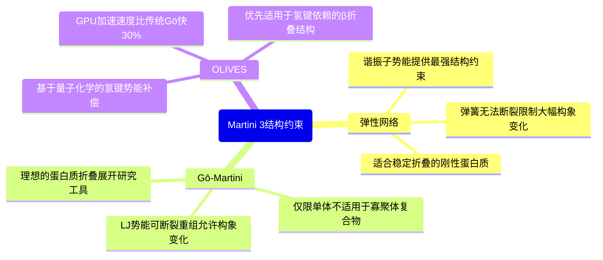
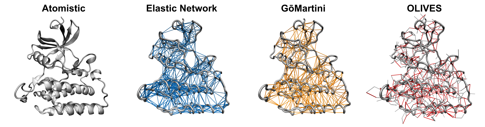

# Martini 3蛋白质建模tips之结构约束方法

## 前言：为什么你的蛋白质会“散架”

在使用 Martini 3 力场进行粗粒化分子动力学模拟时，很多新手会遇到一个令人沮丧的问题：**精心准备的蛋白质结构在模拟几纳秒后就开始解体**，原本紧凑的折叠状态变成了一团乱麻。这并不是你的操作失误，而是 Martini 粗粒化力场的固有特性所致。

### 问题的根源

Martini 力场通过将 4 个重原子合并为 1 个珠子（bead）来实现粗粒化，这种简化在大幅提升模拟效率的同时，也**削弱了维持蛋白质结构的关键相互作用**：

1. **氢键信息丢失**：将多个原子合并后，精确的氢键几何信息被抹平
2. **二级结构势能减弱**：α螺旋和β折叠的稳定性主要依赖氢键
3. **范德华力简化**：原子级的精细接触被粗粒化珠子间的平均作用替代

因此，**单纯依靠 Martini 非键相互作用无法维持蛋白质的折叠状态**。这不是 bug，而是需要通过额外的结构约束来解决的设计权衡。

## 解决方案概览

Martini 社区发展出了三种主流的结构约束方法，各有优劣：



接下来我们将详细讲解每种方法的原理、使用场景和具体操作。



## 第一部分：弹性网络（Elastic Network）

### 基本原理

**弹性网络**（也称为 ElNeDyn）的核心思想非常直观：**在蛋白质的主链珠子之间添加橡皮筋**，通过谐振子势能函数将它们约束在初始结构附近。

弹性网络使用简谐势来约束珠子间距离：

$$
V(r) = \frac{1}{2} k (r - r_0)^2
$$

其中：
- $k$ = 700 kJ·mol$^{-1}$·nm$^{-2}$（力常数，通过 `-ef` 参数设置）
- $r_0$ = 初始结构中的平衡距离
- $r$ = 当前模拟中的实际距离

### 参数设置

#### 关键截断参数

弹性网络并非连接所有珠子，而是通过距离截断来筛选：

| 参数 | 含义 | 推荐值 | 说明 |
|------|------|--------|------|
| `-el` | 下截断（lower cutoff） | 0.5 nm | 距离 < 0.5 nm 时弹簧失效 |
| `-eu` | 上截断（upper cutoff） | 0.9 nm | 距离 > 0.9 nm 时弹簧失效 |
| `-ef` | 力常数（force constant） | 700 kJ·mol$^{-1}$·nm$^{-2}$ | 最好不要低于此值！ |

**设计意图**：

- **下截断**：避免过度惩罚已经很近的珠子（如同一个残基的 BB 和 SC）
- **上截断**：只约束初始结构中的真实接触，而非偶然靠近的远距离对
- **中间区间**（0.5–0.9 nm）：弹簧正常工作，提供恢复力

#### ITP 文件中的体现

在生成的 `protein_only.itp` 文件中，弹性网络作为特殊的键（bonds）存储：

```
; Rubber band (Elastic Network)
  1   7 1 0.60982 700.0   ; 原子1和7，平衡距离0.61 nm，力常数700
  1   8 1 0.78709 700.0
  3   8 1 0.82910 700.0
  ...
```

每行的含义：
- 第 1-2 列：被连接的珠子编号（通常是主链 BB 珠子）
- 第 3 列：势能函数类型（`1` 表示谐振子）
- 第 4 列：平衡距离 $r_0$（单位：nm）
- 第 5 列：力常数 $k$（单位：kJ·mol$^{-1}$·nm$^{-2}$）

### 实际操作

#### 使用 martinize2 生成带弹性网络的拓扑

```bash
martinize2 -f protein.pdb \
  -ff martini3001 \            # 使用 Martini 3 力场
  -x protein_cg.pdb \          # 输出粗粒化结构
  -o protein.top \             # 输出拓扑文件
  -elastic \                   # 启用弹性网络
  -ef 700 \                    # 力常数 700 kJ/(mol·nm²)
  -el 0.5 \                    # 下截断 0.5 nm
  -eu 0.9 \                    # 上截断 0.9 nm
  -eunit chain \               # 按链施加（多链蛋白需要）
  -from amber \                # 输入结构的力场类型
  -dssp \                      # 自动检测二级结构
  -cys auto                    # 自动检测二硫键
```

**重要提示**：

- 不要使用 `-maxwarn 50`，这会掩盖重要警告
- 确保输入的 PDB 文件是**折叠良好的实验结构**或 **AlphaFold 高置信度模型**

#### 检查生成的文件

运行成功后，检查 `protein_only.itp` 是否包含弹性网络：

```bash
grep "Rubber band" protein_only.itp
```

应该看到类似输出：
```
; Rubber band
```

后面跟着数百到数千行键约束（取决于蛋白质大小）。

#### MDP 参数设置

在模拟参数文件（`.mdp`）中，需要注意：

```mdp
; 没必要使用 h-bonds 约束（CG 模型没有氢原子）
constraints = none

; Martini 3 推荐的介电常数
epsilon_r = 15          ; 隐式溶剂模型
; epsilon_r = 2.5       ; 显式水模型（如使用 W 珠子）

; 如果需要初始平衡，可以临时启用位置限制
; define = -DPOSRES
```

### 优势与局限

优势：弹性网络提供**最强的结构约束**，适合长时间模拟。设置非常简单，只需在 martinize2 命令中添加几个参数即可。谐振子势能计算快速，对多域蛋白、膜蛋白等复杂体系都有良好效果。这种方法已经过十多年的验证，是目前最成熟稳定的结构约束方案。

局限：弹簧无法断裂，因此**不适合研究大幅度的构象改变**（如蛋白质折叠/展开过程）。文献表明，弹性网络可能导致蛋白质粘性增加，形成非物理的聚集现象。如果配体结合伴随显著的结构调整，弹性网络会阻碍这种变化，影响结合动力学的准确性。

### 适用场景

使用弹性网络的理想情况：

- ✅ 稳定折叠的蛋白质，结构已知
- ✅ 膜蛋白-脂质相互作用（蛋白质结构相对固定）
- ✅ 高通量筛选（需要快速且稳定的模拟）
- ✅ 研究蛋白质周围环境（如溶剂、离子分布），而非蛋白质自身构象
- ✅ 需要最大稳定性的场景（如验证参数设置）

## 第二部分：Gō-Martini

### 基本原理

**Gō-Martini** 采用了一种更灵活的策略：不是用固定的弹簧，而是根据**初始结构中的原生接触**（native contacts）添加 Lennard-Jones 势能。这些接触**可以断裂和重新形成**，因此允许蛋白质进行较大幅度的构象变化。

#### 核心思想

Gō 模型源于蛋白质折叠理论中的能量漏斗概念：**原生接触比非原生接触更稳定**。Gō-Martini 将这一思想引入粗粒化模拟，从实验结构或 AlphaFold 模型中提取**接触图**（contact map），**为每对原生接触添加吸引性的 LJ 势**，势能深度 $\varepsilon$ 设置为固定值（约 9.4–12 kJ/mol）。

#### 虚拟位点技术

**Gō-Martini 3** 的最新版本使用**虚拟位点**（virtual sites）来实现接触势能。每个主链 BB 珠子复制出一个虚拟位点，虚拟位点之间通过 LJ 势能相互作用，虚拟位点的位置与 BB 珠子完全重合但有独立的相互作用参数。

这种设计的**优势**在于：LJ 势能走标准的非键力计算路径，可以利用 GROMACS 的**邻区列表和 GPU 加速**，避免了旧版 Gō-Martini 将接触势当作键处理的并行瓶颈。

### 实际操作

#### 安装 Gō-Martini 工具

```bash
# 克隆 Gō-Martini GitHub 仓库
git clone https://github.com/Martini-Force-Field-Initiative/GoMartini.git
cd GoMartini

# 添加到 PATH（或直接使用绝对路径）
export PATH=$PATH:$(pwd)/bin
```

#### 生成 Gō 拓扑

```bash
# 第一步：使用 martinize2 生成基础拓扑（不添加弹性网络）
martinize2 -f protein.pdb \
  -ff martini3001 \
  -x protein_cg.pdb \
  -o protein.top \
  -from amber \
  -dssp \
  -cys auto

# 第二步：运行 Gō-Martini 脚本生成虚拟位点和接触
create_goVirt -f protein_cg.pdb \
  -i protein_only.itp \
  -o protein_go.itp \
  -epsilon 9.414        # 接触势能深度（kJ/mol）
```

#### 关键参数

| 参数 | 含义 | 推荐值 |
|------|------|--------|
| `-epsilon` | 原生接触的 LJ 势深度 | 9.4–12 kJ/mol |
| `--contact-cutoff` | 接触距离截断 | 0.6 nm |
| `--bias_helices` | α螺旋的水偏置 | -1.0 kJ/mol（稳定跨膜螺旋） |
| `--bias_idp` | 无序区域的水偏置 | +0.5 kJ/mol（防止过度塌缩） |

#### 水偏置（Water Bias）

Gō-Martini 3 引入了**水偏置**机制，用于修正 Martini 3 对某些体系的系统性偏差：

```bash
# 示例：跨膜蛋白 + 无序尾区
create_goVirt -f protein_cg.pdb \
  -i protein_only.itp \
  -o protein_go.itp \
  --bias_helices -1.0 \      # α螺旋与水排斥，稳定膜内构型
  --bias_idp +0.5            # 无序区与水亲和，防止塌缩
```

**原理**：调节虚拟位点与 Martini 水珠子（W）之间的 LJ 势能深度，从而间接影响蛋白质的溶剂化行为。

## 第三部分：OLIVES（氢键原生接触网络）

### 研究背景

**OLIVES**（2024 年发表于 *J. Chem. Theory Comput.*）是最新的结构约束方法，它针对 Martini 3 的一个核心问题：**缺乏显式氢键能量**。

传统的弹性网络或 Gō 模型对**所有接触一视同仁**，而 OLIVES 专门识别**具有氢键潜力的接触对，只为这些氢键接触添加势能**（势深来自量子化学计算，约 2–5 kcal/mol）。

这种设计的**优势**显而易见：**氢键能量来自 ab initio 计算，物理基础更强**。只有 10–30% 的接触被标记为氢键，**偏置项更少**。减少的偏置项使 GPU 模拟**速度提升约 30**%，计算效率显著提高。

OLIVES 扫描所有可能的氢键 donor/acceptor 对，通过**几何判据**（距离、角度是否符合氢键形成条件）、**溶剂可及性**（埋藏的氢键优先级更高）和**势能分配**（根据氢键类型分配不同的势深）来筛选和标记氢键接触。输出的 `.itp` 文件中会新增类似这样的条目：

```
; OLIVES hydrogen-bond contacts
BB1  BB7  1  0.35  500.0   ; 氢键接触，较强约束
BB3  BB9  1  0.42  300.0   ; 另一个氢键
```

### 实际操作

#### 安装 OLIVES

```bash
# 克隆 OLIVES 仓库
git clone https://github.com/Martini-Force-Field-Initiative/OLIVES.git
cd OLIVES
```

#### 使用流程

```bash
# 第一步：常规 martinize2（不添加 EN 或 Gō）
martinize2 -f protein.pdb \
  -ff martini3001 \
  -x protein_cg.pdb \
  -o protein.top \
  -from amber \
  -dssp \
  -cys auto

# 第二步：运行 OLIVES 脚本识别氢键接触
python OLIVES_v2.0_M3.0.0.py \
  -c protein_cg.pdb \      # 粗粒化结构
  -i protein_only.itp \    # martinize2 生成的拓扑
  -o protein_olives.itp    # 输出带氢键偏置的拓扑
```

## 第四部分：三种方法全面对比与选择指南

### 三种方法全面对比

| 对比维度                  | 弹性网络（EN） | Gō-Martini     | OLIVES             |
| ------------------------- | -------------- | -------------- | ------------------ |
| **稳定性**                | ⭐⭐⭐⭐⭐ 最强     | ⭐⭐⭐⭐ 较强      | ⭐⭐⭐⭐ 较强          |
| **灵活性**                | ⭐⭐ 受限        | ⭐⭐⭐⭐ 高        | ⭐⭐⭐ 中等           |
| **构象变化**              | ❌ 不允许       | ✅ 允许         | ⚠️ 部分允许         |
| **设置难度**              | ✅ 简单         | ⚠️ 需要调参     | ⚠️ 需要额外脚本     |
| **计算效率**              | ✅ 高效         | ✅ GPU 加速     | ✅ GPU 加速（最快） |
| **物理准确性**            | ⚠️ 经验性强     | ⚠️ 依赖参考结构 | ✅ 基于量子化学     |
| **蛋白质-蛋白质相互作用** | ⚠️ 可能过度粘性 | ✅ 更真实       | ✅ 真实             |
| **配体结合研究**          | ❌ 限制结构变化 | ✅ 捕捉结构调整 | ✅ 适用             |
| **多域/寡聚体**           | ✅ 适用         | ⚠️ 仅限单体     | ✅ 适用             |
| **折叠/展开研究**         | ❌ 不适合       | ✅ 理想         | ⚠️ 有限             |
| **高通量筛选**            | ✅ 最适合       | ⚠️ 一般         | ✅ 适合             |
| **成熟度**                | ✅ 十年验证     | ✅ 活跃发展     | ⚠️ 最新方法         |

### 应用场景推荐

| 研究目标                   | 首选方法        | 备选方案    | 决策要点                   |
| -------------------------- | --------------- | ----------- | -------------------------- |
| **膜蛋白-脂质相互作用**    | 弹性网络        | Gō + 水偏置 | 蛋白结构固定，重点研究环境 |
| **配体结合（小构象变化）** | OLIVES          | 弹性网络    | 结合位点局部调整           |
| **配体结合（大构象变化）** | Gō-Martini      | OLIVES      | 诱导契合机制               |
| **蛋白质折叠/展开**        | Gō-Martini      | -           | 需要接触断裂重组           |
| **高通量筛选**             | 弹性网络        | OLIVES      | 追求速度和稳定性           |
| **无序蛋白（IDP）**        | Gō + IDP 水偏置 | OLIVES      | 防止过度塌缩               |
| **多域蛋白**               | 弹性网络        | OLIVES      | 处理复杂结构               |
| **蛋白质-蛋白质对接**      | Gō-Martini      | OLIVES      | 避免假阳性聚集             |
| **跨膜螺旋稳定性**         | Gō + 螺旋水偏置 | 弹性网络    | 修正膜环境偏差             |
| **信号转导构象转换**       | Gō-Martini      | -           | 需要可逆结构变化           |

### 快速选择指南

**优先选择弹性网络**，如果满足以下条件：

- 蛋白质结构已知且稳定（不涉及大幅构象变化）
- 研究重点在蛋白质周围环境（脂质、溶剂、离子）而非蛋白质自身
- 需要最高的稳定性和最简单的设置
- 处理多链复合物或多域蛋白

**优先选择 Gō-Martini**，如果满足以下条件：

- 研究蛋白质折叠/展开或大幅度构象转换
- 配体结合伴随显著的诱导契合效应
- 需要更真实的蛋白质-蛋白质相互作用（避免过度聚集）
- 只处理单个单体蛋白（不适用于寡聚体）

**优先选择 OLIVES**，如果满足以下条件：

- 蛋白质稳定性主要由氢键网络维持（如 β 折叠丰富的结构）
- 需要在稳定性和灵活性之间取得平衡
- 追求最佳计算性能（GPU 加速，比传统 Gō 快 30%）
- 可与弹性网络或 Gō 混合使用

---

## 第五部分：实战案例与调试技巧

### 案例：KLK5 蛋白酶的模拟

以人角蛋白酶 5（Kallikrein 5, KLK5）为例，展示完整的 Martini 3 建模流程。

#### 问题诊断

用户遇到的典型问题：蛋白质在 5 ns 内完全散架。检查 `.itp` 文件后发现：❌ 只有 6 个二硫键约束，❌ 没有弹性网络或 Gō 接触，❌ 位置限制被注释掉（`; define = -DPOSRES`）。

#### 解决步骤

##### 1. 重新生成拓扑文件

```bash
martinize2 -f klk5_chainA.pdb \
  -ff martini3001 \
  -x protein_cg.pdb \
  -o protein.top \
  -name PROA \
  -elastic \
  -ef 700 \
  -el 0.5 \
  -eu 0.9 \
  -eunit chain \
  -from amber \
  -dssp \
  -cys auto \
  -scfix
```

**关键改进**：添加了 `-elastic` 及相关参数，移除了 `-maxwarn 50`（避免掩盖警告）。

##### 2. 验证生成的弹性网络

```bash
# 检查弹性网络键的数量
grep -c "^[[:space:]]*[0-9]" protein_only.itp | tail -1
```

对于 KLK5（约 230 个残基），应该看到**约 1400–1600 个弹性网络键**。

## 参考资源

### 官方教程

- [Martini 3 Protein Tutorial Part I](https://cgmartini.nl/docs/tutorials/Martini3/ProteinsI/)：https://cgmartini.nl/docs/tutorials/Martini3/ProteinsI/
- [Martini 3 Protein Tutorial Part II](https://cgmartini.nl/docs/tutorials/Martini3/ProteinsI/Tut2.html)：https://cgmartini.nl/docs/tutorials/Martini3/ProteinsI/Tut2.html
- [Proteins - Part I: Basics and Martinize 2](https://cgmartini.nl/docs/tutorials/Legacy/martini3/ProteinsI/)：https://cgmartini.nl/docs/tutorials/Legacy/martini3/ProteinsI/

### 文献

- Souza et al. (2021). *Martini 3: a general purpose force field for coarse-grained molecular dynamics*. Nature Methods, 18, 382-388.
- Kroon et al. (2024). *GōMartini 3: From large conformational changes in proteins to environmental bias corrections*. Nature Communications, 16, 684.
- Thomasen et al. (2024). *OLIVES: Optimized LIgand-based VErtual Screening for Martini 3*. J. Chem. Theory Comput., 20, 7890-7902.

### 软件工具

- martinize2 项目主页：[GitHub](https://github.com/marrink-lab/vermouth-martinize)：https://github.com/marrink-lab/vermouth-martinize
- Gō-Martini 工具箱：[GitHub](https://github.com/Martini-Force-Field-Initiative/GoMartini)：https://github.com/Martini-Force-Field-Initiative/GoMartini
- OLIVES 氢键脚本：[GitHub](https://github.com/Martini-Force-Field-Initiative/OLIVES)：https://github.com/Martini-Force-Field-Initiative/OLIVES

### 在线资源

- [Martini Force Field 官网](http://cgmartini.nl/)：http://cgmartini.nl/
- [Martini 3 文档](https://cgmartini.nl/docs/force-field-parameters/martini3/)：https://cgmartini.nl/docs/force-field-parameters/martini3/
- [Martini 论坛](https://www.cgmartini.nl/index.php/forum)：https://www.cgmartini.nl/index.php/forum

**声明**：本文基于 Martini 3（2021 年发布）及其 2024–2025 年的最新进展撰写。Martini 力场仍在持续发展中，建议在实际使用前查阅官方文档的最新版本。
