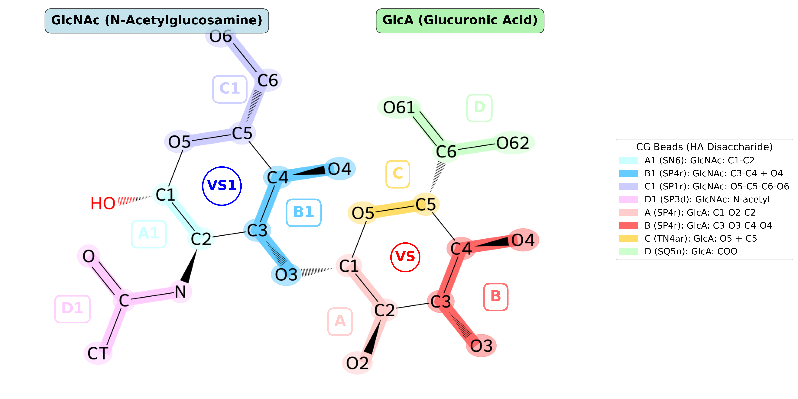
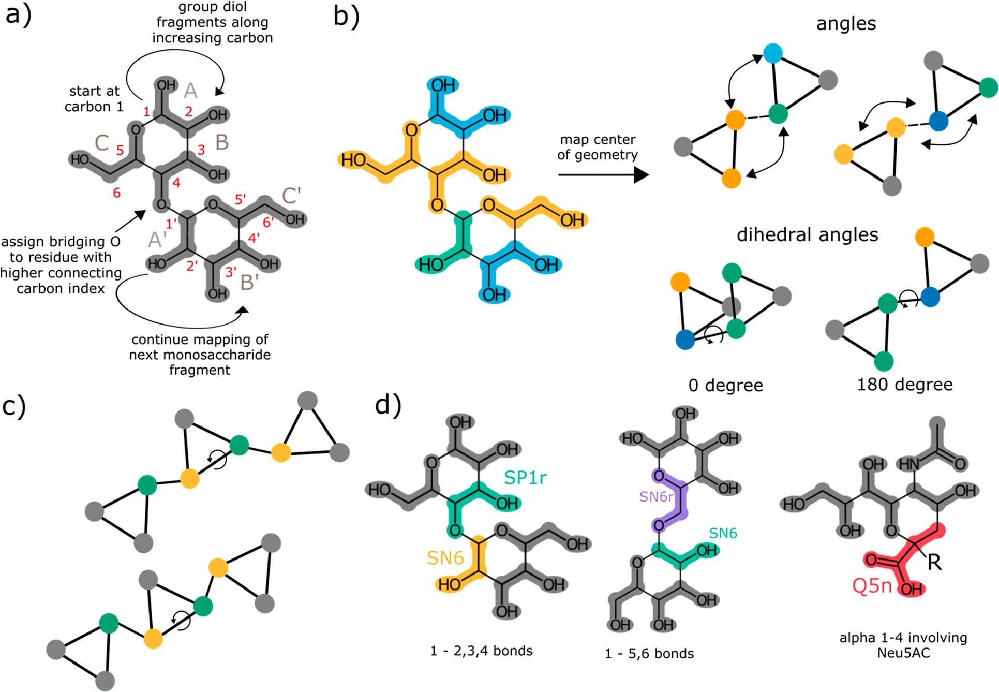
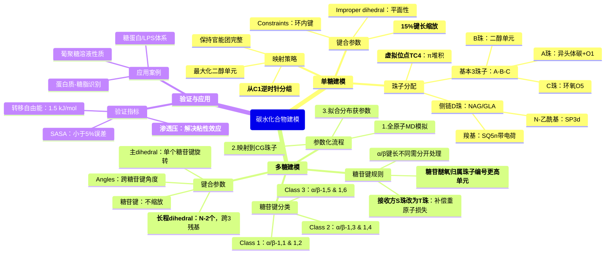

# Martini 3粗粒化力场下的碳水化合物建模

## 本文信息

- **标题**: Martini 3 Coarse-Grained Force Field for Carbohydrates
- **作者**: Fabian Grünewald, Mats H. Punt, Elizabeth E. Jefferys, Petteri A. Vainikka, Valtteri Virtanen, Melanie König, Weria Pezeshkian, Maarit Karonen, Mark S. P. Sansom, Paulo C. T. Souza†, Siewert J. Marrink† (*共同第一作者，†通讯作者)
- **发表时间**: 2022年
- **单位**:
  - University of Groningen (荷兰格罗宁根大学)
  - University of Oxford (英国牛津大学)
  - University of Turku (芬兰图尔库大学)
  - University of Lyon (法国里昂大学)
  - University of Copenhagen (丹麦哥本哈根大学)
- **引用格式**: Grünewald, F., Punt, M. H., Jefferys, E. E., Vainikka, P. A., Virtanen, V., König, M., Pezeshkian, W., Karonen, M., Sansom, M. S. P., Souza, P. C. T., & Marrink, S. J. (2022). Martini 3 Coarse-Grained Force Field for Carbohydrates. *Journal of Chemical Theory and Computation*. https://doi.org/10.1021/acs.jctc.2c00757
- **GitHub代码**: https://github.com/marrink-lab/martini-forcefields

其他参考资源

1. **Punt, M.** (2021). “Sweet” Martini 3 – Guidelines for a Transferable Sugar Model in Martini 3. *Master's Thesis*, University of Groningen.
2. **Martini官方文档**：https://www.cgmartini.nl/

## 概述

Martini 3是Martini力场的第三代版本，对碳水化合物的参数化进行了完全的重新优化。相比Martini 2存在的**粘性效应**（overaggregation），Martini 3通过改进相互作用平衡，能够更准确地描述碳水化合物体系，特别是复杂的多糖体系。

透明质酸（Hyaluronic Acid，HA，又称玻尿酸）是由N-乙酰葡萄糖胺（NAG）和葡萄糖醛酸（GlcA）通过β-1,3-glycosidic链接形成的线性多糖，是重要的生物大分子。

## 参数化策略

### 总体设计原则

Martini 3碳水化合物建模遵循**三条核心映射规则**：

1. **最大化二醇基团**：在单个珠子中包含尽可能多的二醇单元，从而最大化4:1映射（四个重原子映射到一个珠子）
2. **保持官能团完整性**：将官能团尽可能保持在一起，特别是当存在取代基时
3. **规范化命名方向：从异头体碳（C1）开始，逆时针进行分组**，确保不同糖类的等效片段生成规范命名

### 珠子类型（Bead Types）

| 珠子类型 | 大小 | 重原子映射比例 | 应用 |
|---------|------|---------------|------|
| **R珠子** | 常规 (σ=0.47 nm) | 4:1 | 线性、无分支结构 |
| **S珠子** | 小 (σ=0.41 nm) | 3:1或4:1 | 环结构、分支结构（推荐用于单糖） |
| **T珠子** | 极小 (σ=0.34 nm) | 2:1 | 芳香环堆积、紧凑结构 |
| **TC4珠子** | 虚拟位点 | 无质量 | 放置在单糖环中心，增强芳香相互作用 |

### 参数文件说明

官方提供的 `martini_v3.0.0_sugars_v2.itp` 参数文件包含：

- **单糖**（13种）：只有 `[constraints]` 参数，不一定有angles/dihedrals（有侧链才有？）
  - 包括：GLC, MAN, GAL, FRUF, LFUC, LRHA, RIBF, XYL, INO, GLA, GYN, NMC
- **二糖**（3种）：完整的bonds, constraints, angles, dihedrals参数
  - LAC（乳糖）, SUCR（蔗糖）, TREH（海藻糖）
- **多糖/寡糖**：**未提供现成参数**，需要用户按照下述参数化流程自行开发

### 参数化方法

为获得键合参数和分子体积，使用**三种流行的原子力场**：

| 糖类                         | 使用的力场 |
| ---------------------------- | ---------- |
| D-葡萄糖, D-甘露糖           | GLYCAM06h  |
| D-核糖, D-核糖呋喃糖, D-木糖 | CHARMM36   |
| D-果糖呋喃糖                 | CHARMM36   |
| N-乙酰葡萄糖胺（NAG）        | GLYCAM06h  |
| 葡萄糖醛酸（GlcA）           | CHARMM36   |
| 肌醇                         | GROMOS54a7 |

**关键设置**:

- 所有模拟在水中，周期边界条件
- 充分采样以获得准确的键合分布
- 从原子级轨迹映射到中心-几何（COG）位置提取珠子坐标
- 用简谐势拟合原子级分布

## 单糖建模

### 单糖映射方案

在Martini 3中，**所有单糖都由三个珠子建模**，分别命名为A、B、C：

- **A珠子**：包含异头体碳（anomeric carbon, 通常是C1），异头体氧（O1，连接到C1的羟基氧）属于A珠子
- **B珠子**：包含第二个二醇单元
- **C珠子**：包含醚氧原子（ring ether oxygen，通常是O5）


**图1：单糖参数化策略**

- **a)** 系统映射方案示例，以葡萄糖醛酸为例，展示从原子级到粗粒化的映射过程及从异头体碳C1逆时针分组的规则
- **b)** 单糖中所有片段的珠子类型分配，包括各功能团对应的Martini 3珠子类型及其ΔG(Oct→W)值
- **c)** 键合相互作用设计原则，单糖表现为刚性三角形，所有内部环约束统一缩放15%以改善SASA

### N-乙酰葡萄糖胺（N-Acetylglucosamine，GlcNAc或NAG）

**化学结构**：$\ce{C8H15NO6}$

**映射原理**：原子级结构：C1-O1-C2($\ce{NHAC}$)-C3($\ce{OH}$)-C4($\ce{OH}$)-C5-O5-C6($\ce{CH2OH}$)，其中O1为异头体氧，O5为环氧（ether oxygen）

**粗粒化映射**（四个珠子+虚拟位点）：

| 珠子 | 包含原子 | 说明 |
|------|---------|------|
| **A珠** | C1-O1-C2 | 包含异头体碳C1和异头体氧O1 |
| **B珠** | C3-C4 | 二醇单元 |
| **C珠** | C5-O5-C6 | 包含环氧O5和羟甲基 |
| **D珠** | N-乙酰基($\ce{NHAC}$) | N-乙酰官能团，连接到A珠（C2位置）|
| **VS** | 虚拟位点 | TC4类型，放置在环中心 |

**珠子类型选择依据**：

珠子类型的选择基于匹配全原子的**分子体积**和**辛醇-水转移自由能**。下表总结了各碎片的珠子类型分配：

| 珠子 | 碎片类型 | Martini珠子类型 | 选择依据 |
|------|---------|-----------------|---------|
| A | 异头体 | SN6 | 异头体碳+O1，极性碎片 |
| B | 二醇 | SP4r | 含两个羟基的二醇单元 |
| C | 半缩醛+醚 | SP1r | 中等极性，环氧和羟甲基组合 |
| D | N-乙酰基 | SP3d | 酰胺官能团，极性 |
| VS | 虚拟位点 | TC4 | 疏水珠子，无质量，增强π堆积相互作用 |



### 葡萄糖醛酸（D-Glucuronic Acid，GlcA或GLA）

**化学结构**：$\ce{C6H10O7}$（末端葡萄糖变为羧酸）

**映射原理**：与葡萄糖类似，但C6($\ce{-CH2OH}$)被替换为羧基($\ce{-COOH}$)

原子级结构：C1-O1-C2($\ce{OH}$)-C3($\ce{OH}$)-C4($\ce{OH}$)-C5-O5-C6($\ce{COOH}$)，其中O1为异头体氧，O5为环氧（ether oxygen）

**粗粒化映射**（四个珠子+虚拟位点）：

| 珠子 | 包含原子 | 说明 |
|------|---------|------|
| **A珠** | C1-O1-C2 | 包含异头体碳C1和异头体氧O1 |
| **B珠** | C3-C4 | 二醇单元 |
| **C珠** | C5-O5 | 包含环氧O5 |
| **D珠** | C6($\ce{COOH}$) | 羧酸官能团，生理pH下去质子化 |
| **VS** | 虚拟位点 | TC4类型，放置在环中心 |

**珠子类型选择依据**：

| 珠子 | 碎片类型 | Martini珠子类型 | 选择依据 |
|------|---------|-----------------|---------|
| A | 异头体 | SP4r | 异头体碳+O1，极性碎片 |
| B | 二醇 | SP4r | 标准二醇单元，含两个羟基 |
| C | 环氧醚 | TN4ar | 环氧和邻近碳 |
| D | 羧酸根 | SQ5n（带电-1） | 生理pH下去质子化，强极性 |
| VS | 虚拟位点 | TC4 | 增强π堆积相互作用 |

**实验分配系数验证**（Table S2）：

| 单糖 | 实验Log P | Martini 3预测（kJ/mol） | 误差（kJ/mol） | 精度评价 |
|------|----------|------------------------|---------------|---------|
| **NAG** | -3.03 ± 0.34 | -16.02 ± 0.33 | 1.27 | 优秀 |
| **GLA** | -3.26 ± 0.11 | -18.17 ± 0.31 | 0.44 | 最优 |

两种单糖的辛醇-水分配系数预测均达到高精度，验证了珠子类型选择和非键参数的准确性。

#### 内部环约束的15%缩放

见正文Figure 1c，2（附录）。为了准确再现碳水化合物的分子体积和溶剂可及表面积（SASA），Martini 3对单糖环内的所有键长进行了统一的15%放大处理：

- **环内键长**：A-B、A-C、B-C（形成糖环的三个珠子之间的键）统一放大15%
- **糖苷键**：连接两个单糖单元的键（如NAG的A珠到GlcA的B珠）**不缩放**，保持原始距离
- **物理意义**：直接从几何中心（COG）映射会低估分子体积约8%，15%的键长放大可使CG模型的Connolly表面与全原子参考高度一致
- **适用性**：这个缩放因子对所有单糖都适用，保证了模型的可迁移性

#### 单糖内部键合

- **键合类型**：使用**约束**（constraints）而非简谐键，因为单糖在CG层级表现为刚性三角形
- **无angles/dihedrals**：单糖环内三个珠子（A-B-C）之间不需要角度或二面角参数

### 原始力场文件

```
[ moleculetype ]
; molname    nrexcl
  GLA         1

[ atoms ]
; nr type resnr residue atom cgnr charge mass 
  1   SP4r   1     GLA    A    1     0    54     
  2   SP4r   1     GLA    B    2     0    54   
  3   TN4ar  1     GLA    C    3     0    36 
;  4   SP3   1     GLA    D    4     0    54
  4   SQ5n   1     GLA    D    4    -1.0  54 ;deprotonated at physiological pH
  5   TC4    1     GLA    VS   5     0     0

[constraints]
; i  j  funct length
  1  2    1    0.376 ;15% COG scaled
  1  3    1    0.335
  2  3    1    0.311
  3  4    1    0.222 ;unscaled, constraint because Fk > 80000

[angles]
; i  j  k funct angle fk
  1  3  4  10   180   290

[dihedrals]
; i  j  k  l  funct  angle  fc
  4  1  2  3    2     55    140

[ exclusions ]
5 1 2 3 4
4 2

[ virtual_sitesn ]
5 1 1 2 3

[ moleculetype ]
; molname    nrexcl
  GYN         1

[ atoms ]
; nr type resnr residue atom cgnr charge mass
  1   SN6   1     GYN    A    1     0     54
  2   SP4r  1     GYN    B    2     0     54
  3   SP1r  1     GYN    C    3     0     54
  4   SP3d  1     GYN    D    4     0     54
  5   TC4   1     GYN   VS    5     0     0

[bonds]
; i  j  funct length  fk
  1  4    1   0.339   4700 ;unscaled

[constraints]
; i  j  funct length
  1  2    1   0.392 ;15% COG scaled
  1  3    1   0.427
  2  3    1   0.397

[ angles ]
; i  j  k funct angle fk
  3  1  4   10   147   100

[dihedrals]
; i  j  k  l  funct  angle  fc
  4  3  2  1    2     0    160

[ exclusions ]
5 1 2 3 4
4 2

[ virtual_sitesn ]
5 1 1 2 3
```

## 多糖建模



**图4：寡糖和多糖的参数化策略**（详细讲解见下）

- **a)** 复杂碳水化合物的系统化映射策略
- **b)** 两个连接的单糖片段之间引入的角度和二面角
- **c)** 三个连续单糖片段之间引入的二面角
- **d)** 糖苷键形成时新产生片段的珠子分配

> - **第一组（1-1、1-2、1-3、1-4链接）**：使用**SP1r**珠子
>   - 这个珠子类型直接来自单糖中的半缩醛片段
>   - 已通过海藻糖和蔗糖的转移自由能验证（误差<3 kJ/mol）
> - **第二组（1-5、1-6链接）**：使用**SN6r**珠子
>   - 与半缩醛片段类似，但一个OH被醚键取代
>   - SN6r的自相互作用比SP1r弱一级，反映了化学结构变化
> - **特殊情况（N-乙酰神经氨酸的1-4链接）**：
>   - 将羧酸与剩余碳片段组合，避免产生键长过短的2:1映射片段
>   - 使用标准羧基珠子类型

### 糖苷键参数化

**透明质酸（HA）的组成**：由NAG（GlcNAc）和GlcA通过**β-1,3糖苷键**交替连接而成。

#### 糖苷键的分类

Martini 3将糖苷键分为**六组**，根据α/β异构体和链接碳位置：

| 糖苷键类型 | 例子 | 映射方向 | 接收方珠子类型 |
|-----------|------|---------|-----------------|
| **Class 1** | α/β-1,1 & 1,2 | 异头体相连 | T珠子 |
| **Class 2** | α/β-1,3 & 1,4 | 最常见的β-1,4 | T珠子 |
| **Class 3** | α/β-1,5 & 1,6 | 包括6-脱氧 | SN6r珠子（减弱相互作用） |

**透明质酸中的β-1,3链接属于Class 2**：这是该力场中最常见的链接类型之一。

#### 如何确定“接收单糖单元”？

在糖苷键连接中，需要明确哪个单糖是“供体”（donor），哪个是“接收者”（acceptor）：

- **规则**：采用CHARMM-GUI约定，**连接原子归属于CG层级中珠子编号更高的单糖单元**
- **例子**：乳糖（α-1,4连接的葡萄糖-半乳糖）
  - 原子级连接：葡萄糖的C1连接到半乳糖的C4
  - CG级连接：葡萄糖的A珠连接到半乳糖的B珠
  - **糖苷醚氧原子归属于B珠**（即半乳糖一侧，珠子编号更高的单元）

#### β-1,3糖苷键的具体连接方式

对于透明质酸的NAG-GlcA重复单元：
- **原子级**：NAG的C1（异头体碳）连接到GlcA的C3
- **CG级**：NAG的A珠连接到GlcA的B珠
- **糖苷醚氧归属**：包含在GlcA的B珠中（接收方单糖）

#### 体积损失补偿

糖苷缩合反应使总重原子数减少1（损失一个氧原子）：$$\ce{C6H12O6 + C6H10O7 - H2O -> C12H20O11}$$

**Martini 3的解决方案**：

- **供体单糖**（提供异头体碳C1的一侧）：保持原有珠子类型
- **接收单糖**（通过其他碳如C3/C4接收连接的一侧）：将接收糖苷键的珠子从S珠改为T珠（更小），以补偿重原子损失

具体到透明质酸：
- **NAG单元**（供体）：A(SP1r) - B(SP1r) - C(SP1r)
- **GlcA单元**（接收方）：A'(TP1) - B'(SP1r，包含糖苷醚氧) - C'(SQ4)
  - 注意：GlcA的A'珠从SP1r改为TP1（T珠），补偿糖苷缩合的重原子损失

### 键合相互作用

#### 多糖键合参数

- **糖苷键键长**：从全原子参考映射获得，α和β异构体的键长明显不同，需**分开处理**
- **Angles（键角）**：定义**所有跨越两个单糖单元之间糖苷键的角度**
  - 例如：A-糖苷键-B'，B-糖苷键-A'，A-糖苷键-C'等
  - 具体数值需从全原子MD模拟的分布拟合调和势获得
- **Dihedrals（二面角）**：
  - **单糖内部**：使用**improper dihedral**（funct=2，调和势）维持环平面性
    - 例如：GLA的4-1-2-3，用于保持糖环的平面构象
  - **主二面角**（两个单糖连接）：使用**proper dihedral**（funct=1，周期性势函数）控制绕糖苷键的旋转（见Figure 4b）
    - 对于每个糖苷键，定义**一个主二面角**来控制绕该键的旋转
    - 二面角的具体原子选择**取决于糖苷键连接类型**（不同连接方式有不同的原子组合）
    - 例如：LAC (β-1,4链接，糖苷键为B-A'): 主二面角为A-B-A'-B'
    - 例如：SUCR/TREH (α-1,1链接，糖苷键为A-A'): 主二面角为B-A-A'-C'
  - **长程二面角**（三个或更多单糖连接）：当连接超过两个单糖单元时，引入跨越三个连续单糖单元（n, n+1, n+2）的长程二面角，定义n和n+2残基相对于n+1残基平面的取向（见Figure 4c）
    - 对于含有N个单糖的多糖链，需要定义**N-2个**这样的长程二面角（每个连续三联体一个）
    - 例如：透明质酸（HA）的NAG₁-GlcA₂-NAG₃片段，长程二面角为B₁-A₂-B₂-A₃（从第1个残基选B珠，从第2个残基选A和B珠定义平面，从第3个残基选A珠），B₂-A₃-B₃-A₄，……
    - 这类二面角**对多糖刚度至关重要**，尤其是在较长的碳水化合物链中
  - 所有二面角参数通过匹配全原子参考模拟的构象分布获得
- **受限弯曲势**：对于被二面角势覆盖的角度，使用Bulacu等人的受限弯曲势，防止角度变为共线导致数值不稳定

#### 特殊处理

- 葡聚糖（dextran）使用**3-bonded neighbor exclusions**以改善稳定性
- 其他模型仅排除1-bonded neighbors（Martini脂质标准）
- 虚拟位点的包含显著影响聚集行为和化学性质

## 建模流程总览



## 验证方法与应用案例

Martini 3碳水化合物力场经过验证，在多个物理化学性质和实际应用中表现优异。详细内容请参见：

**[附录：验证方法与应用案例](martini3_carbohydrate_appendix.md)**

### 验证指标概览

力场验证基于三个核心物理化学性质：

1. **溶剂可及表面积（SASA）**
   - 15%键长缩放后，偏差 <5%（Martini 2为~8%）
   - Connolly表面与全原子高度一致

2. **辛醇-水转移自由能**
   - 平均绝对误差：**1.5 kJ/mol**
   - 达到小分子Martini参数的精度水平

3. **渗透压**
   - 0-1.5 molal浓度：与实验优异吻合
   - **解决了Martini 2的"粘性效应"问题**

### 应用案例概览

1. **葡聚糖溶液性质**：准确预测黏度、回转半径、扩散系数
2. **蛋白质-糖脂识别**：成功模拟LecA与GM1的特异性结合
3. **糖蛋白、LPS、糖脂筏**等复杂体系

