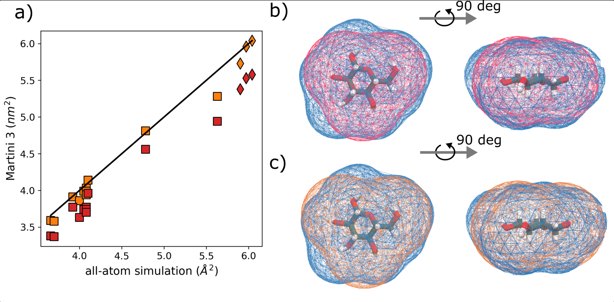
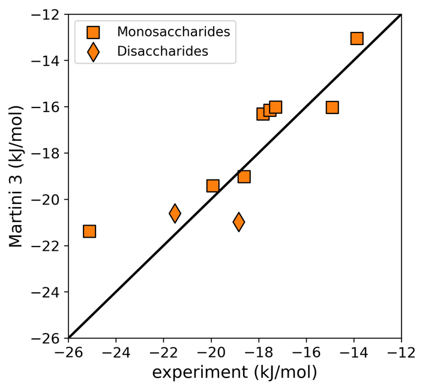
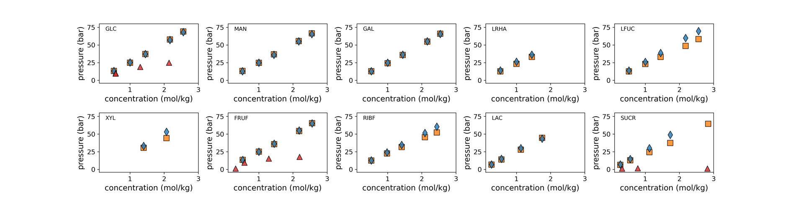
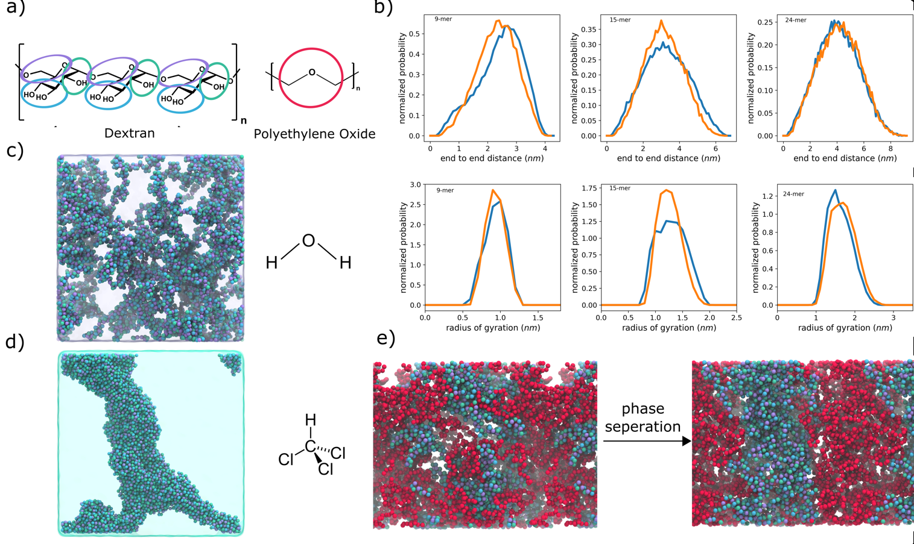
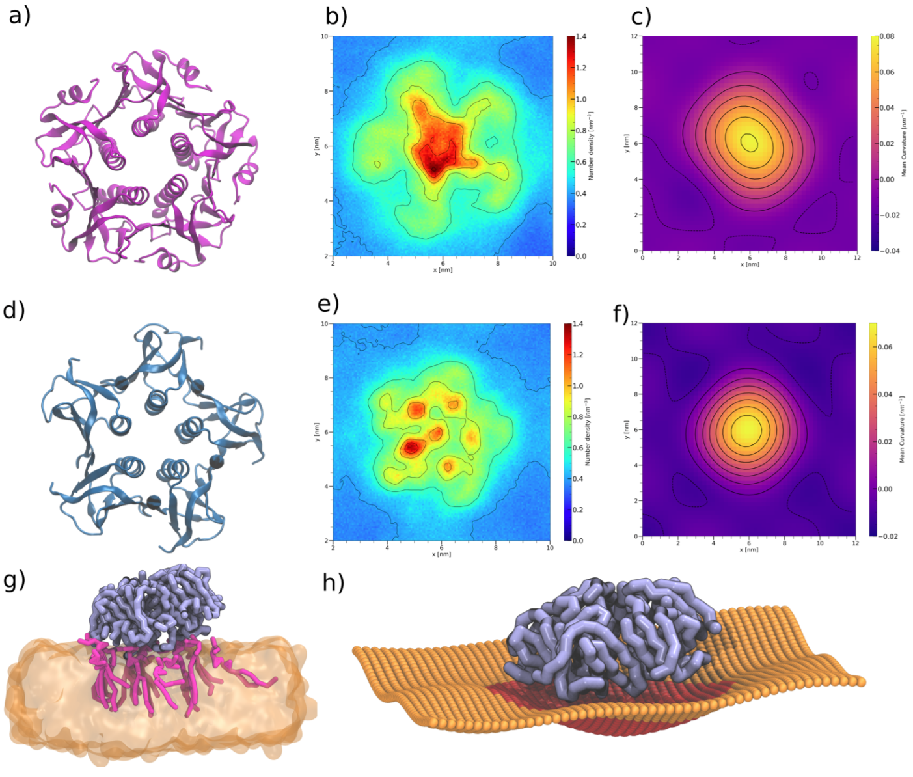

> 本文是《Martini 3粗粒化力场下的碳水化合物建模》的附录，包含详细的验证方法和应用案例。

## 验证方法

Martini 3碳水化合物的验证基于**三个主要物理化学性质**：

### 溶剂可及表面积

Martini 2中心-几何（COG）未缩放映射导致体积严重低估（约8%偏差）

**解决方案**: 均匀缩放15%的COG键长

**结果**:

- 缩放前: 平均偏差 ~8%
- 缩放后：偏差 <5%（可接受）
- Connolly表面对齐显著改善

**图2：分子形状优化 - SASA验证**

- **a)** 溶剂可及表面积（SASA）对比：全原子模拟 vs Martini 3（未缩放键长）vs Martini 3（15%缩放键长）。缩放后的SASA与全原子结果高度一致。
- **b-e)** 葡萄糖分子的Connolly表面可视化对比，展示15%键长缩放前后的分子体积改善。缩放后的粗粒化表面（绿色）与全原子表面（灰色）高度重合，解决了Martini 2中系统性低估分子体积（~8%偏差）的问题。

### 自由能转移

**方法**：计算正辛醇-水相间的转移自由能 ΔG(Oct→W)

**结果**（所有单糖）：

- **平均绝对误差（MAE）** = **1.5 kJ/mol**（优秀）
- 与小分子参考值相当（2.0 kJ/mol）
- NAG误差 = 1.27 kJ/mol
- GlcA误差 = 0.44 kJ/mol

**图3：转移自由能验证**

10种单糖的辛醇-水转移自由能对比：
- **蓝色条**：实验值（或高精度计算值）
- **橙色条**：Martini 3预测值

Martini 3在所有单糖上的预测均与参考值高度吻合，平均绝对误差仅1.5 kJ/mol，达到了与小分子Martini参数相当的精度水平。这验证了：
1. 珠子类型选择的准确性
2. 非键相互作用参数的合理性
3. 虚拟位点（TC4）的正确引入

### 渗透压

渗透压过低表明有过度的聚集倾向（"粘性效应"）

**Martini 2的问题**：严重高估聚集倾向，导致不真实的自聚集。**Martini 3的改进**：

- **关键改进**：采用新的S和T珠子类型（相互作用更弱），显著降低了糖类之间的过度吸引
- **0-1.5 molal浓度**：与实验数据优异吻合
- **高浓度（>1.5 molal）**：仍有轻微低估，但比Martini 2大幅改善

molal浓度单位说明：molal = mol溶质 / kg溶剂（与molar不同，molar = mol/L溶液）

**图5：渗透压验证 - Martini 2 vs Martini 3**

10种碳水化合物的渗透压对比。**蓝色曲线**：实验测量值；**橙色曲线**：Martini 3预测值；**红色曲线**：Martini 2预测值。图中清晰展示了Martini 3在0-1.5 molal浓度范围内与实验数据的优异吻合，而Martini 2严重低估渗透压（表明过度聚集的"粘性效应"）。这是Martini 3相对于Martini 2最重要的改进之一，解决了碳水化合物力场长期存在的聚集问题。

## 应用案例

通过一系列实际应用，Martini 3碳水化合物力场展示了其在描述复杂生物体系中的强大能力。

### 葡聚糖（Dextran）的溶液性质

**体系**：100 kDa葡聚糖（α-1,6主链）在不同浓度溶液中的性质

**验证指标**：
- 溶液黏度
- 回转半径（Radius of Gyration, Rg）
- 扩散系数
- 形状因子（Shape Factor）

**结果**：Martini 3准确再现实验观测，包括浓度依赖性

**图6：葡聚糖溶液性质多维度验证**

- **a)** 回转半径Rg随浓度的变化
- **b)** 扩散系数随浓度的变化
- **c)** 形状因子随浓度的变化
- **d)** 溶液黏度随浓度的变化

所有四个性质的模拟结果（橙色点）与实验数据（蓝色点）均高度一致，验证了Martini 3在描述多糖溶液性质方面的准确性。特别是黏度的正确预测，表明力场能够捕捉到聚合物链间相互作用和构象动力学的本质特征。

### 蛋白质-糖脂识别

**体系**：外周膜蛋白LecA（来自铜绿假单胞菌）与糖脂GM1的特异性结合

**验证**：
- **结合位点**：与实验晶体结构一致
- **特异性**：LecA选择性识别GM1（含半乳糖）而非其他糖脂
- **结合模式**：糖链伸入蛋白结合口袋

**生物学意义**：
- LecA是铜绿假单胞菌的毒力因子
- 通过识别宿主细胞表面糖脂介导细菌黏附
- 这一案例验证了Martini 3在蛋白质-糖相互作用研究中的适用性

**图8：外周膜蛋白与糖脂的特异性结合**

- **a)** 霍乱毒素B亚基（CTxB）蛋白结构渲染图（PDB 3CHB）
- **b)** CTxB周围GM3糖脂的2D脂质密度图，显示糖脂富集在蛋白中心及外围的特定结合位点
- **c)** CTxB周围膜的2D曲率图，展示蛋白结合引起的膜弯曲
- **d)** 志贺毒素B亚基（STxB）蛋白结构渲染图（PDB 2C5C）
- **e)** STxB周围Gb3糖脂的2D脂质密度图，**标注了3个等效结合位点（1-3）**
- **f)** STxB周围膜的2D曲率图
- **g-h)** （如果有）膜曲率的侧视图或其他补充信息

**关键发现**：
1. **CTxB**：主要结合位点位于蛋白中心，外围有较弱的结合位点
2. **STxB**：清晰显示3个等效的Gb3结合位点，Martini 3能够**自发识别**这些位点
3. **膜曲率**：两种毒素蛋白都能诱导膜弯曲，这是内吞作用的关键步骤
   - STxB诱导的曲率：CG模拟值 = 0.0260 ± 0.0001 nm⁻¹
   - 全原子模拟值 = 0.034 ± 0.004 nm⁻¹（数量级一致）

**重大突破**：Martini 3能够自发识别STxB的3个Gb3结合位点，而Martini 2由于过度聚集问题无法实现。这展示了Martini 3在研究蛋白质-碳水化合物识别方面的重大进步，对理解病原体-宿主细胞相互作用具有重要生物学意义。

### 其他成功应用

1. **糖蛋白折叠与糖基化**：成功模拟糖链对蛋白质折叠稳定性的影响
2. **细菌外膜脂多糖**：描述LPS在革兰氏阴性菌外膜中的组装和屏障功能
3. **糖脂筏（Lipid Rafts）**：研究糖脂在膜微区（rafts）形成中的作用
4. **多糖材料**：纤维素、几丁质等多糖材料的力学性质模拟

## 关键结论与批判性总结

### Martini 2与3对比总结

| 方面           | Martini 2                      | Martini 3                            |
| -------------- | ------------------------------ | ------------------------------------ |
| **珠子类型**   | 3个R珠（单糖），6个R珠（二糖） | 3个S珠（所有单糖），混合S和T（二糖） |
| **粘性效应**   | 严重的过度聚集                 | 基本解决，仅在高浓度保留痕迹         |
| **糖苷键**     | 通用参数（1,6键有问题）        | **分离α和β**，处理1,1到1,6所有链接   |
| **体积匹配**   | 系统性低估（~8%）              | **15%缩放后** <5%误差                |
| **虚拟位点**   | 未系统使用                     | **TC4中心位点**用于π堆积             |
| **验证数据**   | 仅3种糖类的渗透压              | **10种单糖+多糖**完整验证            |
| **自由能误差** | 更大                           | **平均1.5 kJ/mol**（最优）           |

本文建立了一套**系统化、可迁移的碳水化合物粗粒化建模方案**，成功解决了Martini 2力场长期存在的过度聚集问题：

1. **规范映射策略**：提出了将任意复杂碳水化合物分解为有限片段的标准化映射方案，确保了不同糖类间的参数可迁移性
2. **准确的物理化学性质**：
   - 辛醇-水转移自由能平均绝对误差仅**1.5 kJ/mol**，与实验高度吻合
   - 渗透压在生理相关浓度范围（<1.5 molal）内与实验数据优异一致
   - 通过15%键长缩放准确再现分子体积和SASA（误差<5%）
3. **构象准确性提升**：区分α和β糖苷键，引入TC4虚拟位点增强芳香相互作用，显著改善了碳水化合物构象描述
4. **广泛的适用性验证**：
   - 正确预测葡聚糖（水溶）与纤维素（水不溶）的溶解性差异
   - 成功模拟糖脂在膜中的组织和蛋白质-糖脂特异性识别
   - 准确描述水性两相体系中的相分离行为

### 局限性与改进方向

尽管取得了显著进步，本模型仍存在以下局限：

1. **高浓度聚集问题**：
   - 在高浓度范围（>1.5 molal）下，部分单糖（核糖、蔗糖、岩藻糖）仍表现出轻微的过度自相互作用
   - **建议**：涉及高浓度碳水化合物溶液的模拟需要仔细验证
2. **芳香相互作用不足**：
   - 尽管引入了TC4虚拟位点，与芳香基团的相互作用强度仍低于全原子模型
   - 对于强制性堆积构象（如某些蛋白质结合口袋）可能低估结合亲和力
   - **改进方向**：需要进一步优化蛋白质模型或Martini 3相互作用矩阵
3. **模型适用范围**：
   - 当前参数主要在寡糖和中等长度聚合物（<50个重复单元）上验证
   - 极长链（>100单元）的灵活性和动力学行为需要额外检验
4. **粗粒化固有限制**：
   - 自由度的减少不可避免地损失了部分原子级细节
   - 某些依赖精细原子相互作用的性质（如氢键网络、手性识别）可能无法完全准确描述

### 未来展望

1. **扩展参数库**：将参数化方案推广到更多类型的碳水化合物（如氨基糖、脱氧糖、修饰糖类）
2. **多尺度模拟集成**：结合全原子和粗粒化模型，在关键区域使用精细描述
3. **蛋白质-碳水化合物界面优化**：改进蛋白质力场与碳水化合物力场的兼容性，提高蛋白质-糖识别的准确性
4. **动力学性质验证**：扩展验证范围至扩散系数、粘度等动力学性质

### 总体评价

Martini 3碳水化合物力场代表了粗粒化生物分子模拟领域的**重要进步**。通过系统的参数化策略和全面的验证，本模型在保持计算效率的同时，显著提升了对碳水化合物体系的描述准确性。虽然仍存在改进空间，但已为研究复杂的糖生物学过程（如糖蛋白折叠、多糖自组装、糖脂膜域形成）提供了**可靠且高效的工具**。

本研究的方法学贡献在于建立了一套**标准化、可复制的参数化流程**，为未来开发其他类型生物分子的粗粒化模型提供了范例。

## 相关文章

- [主文档](martini3_carbohydrate.md)：Martini 3粗粒化力场下的碳水化合物建模
