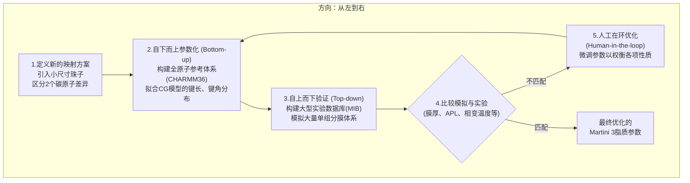

# Martini 3 脂质组学：更精细的参数如何重塑膜模拟的未来

## 本文信息

  - **标题**: Martini 3 脂质组学：扩展和精炼的参数改善脂质相行为
  - **作者**: Kasper B. Pedersen, Helgi I. Ingólfsson, Siewert J. Marrink, Paulo C. T. Souza 等 (多国合作团队)
  - **发表时间**: 2025年7月31日
  - **单位**: 奥胡斯大学 (丹麦)，劳伦斯利弗莫尔国家实验室 (美国)，卡尔加里大学 (加拿大)，格罗宁根大学 (荷兰) 等
  - **引用格式**: Pedersen, K. B., Ingólfsson, H. I., Ramirez-Echemendia, D. P., Borges-Araújo, L., Andreasen, M. D., Empereur-mot, C., ... & Marrink, S. J. (2025). The Martini 3 Lipidome: Expanded and Refined Parameters Improve Lipid Phase Behavior. *ACS Central Science*, *11*, 1598–1610. [https://doi.org/10.1021/acscentsci.5c00755](https://doi.org/10.1021/acscentsci.5c00755)
  - **源代码/数据库**: [https://github.com/Martini-Force-Field-Initiative/M3-Lipid-Parameters](https://github.com/Martini-Force-Field-Initiative/M3-Lipid-Parameters)

## 摘要

> 脂质膜是细胞生命的核心。作为实验的补充，计算模拟在揭示复杂的脂质-生物分子相互作用方面至关重要，无论在学术界还是工业界都扮演着关键角色。**Martini模型**，一种用于高效分子动力学模拟的粗粒化力场，被广泛用于研究膜现象，但也面临着局限性，特别是在**捕捉真实的脂质相行为**方面。在这里，我们提出了一套精炼的Martini 3脂质模型，其采用的映射方案能够**区分仅相差两个碳原子的脂质尾链**，从而增强了包括三元混合物在内的模型膜系统的结构分辨率和热力学准确性。扩展后的Martini脂质库包含了**数千个模型**，使得对复杂且具有生物学相关性的系统进行模拟成为可能。这些进展将Martini确立为一个跨越多个领域的、强大的脂质模拟平台。

### 核心结论

  * **提出了全新的Martini 3脂质映射方案**：通过引入小尺寸珠子，新方案能够区分长度仅相差2个碳原子的脂质尾链（例如16C vs 18C），极大地提升了模型的化学分辨率。

  * **构建了庞大的脂质库**：通过自动化脚本和精细的参数化流程，生成了包含数千种不同脂质的Martini 3模型库，涵盖了多种头基和尾链组合。

  * **显著改善了相行为的预测**：与Martini 2相比，新的Martini 3脂质模型在预测脂质的**凝胶-液晶相变温度 ($T_m$)** 和**三元混合物（如DPPC/DOPC/CHOL）的液有序(Lo)/液无序(Ld)相分离**方面，与实验数据达到了前所未有的吻合度。

  * **提升了膜力学性质的准确性**：新模型计算出的膜**弯曲模量 ($k_c$)** 和**脂质尾链有序度参数**也比Martini 2更接近全原子模拟的结果。

  * **成功模拟了复杂生物膜与非层状结构**：展示了新脂质组学在构建真实的、不对称的**哺乳动物细胞质膜模型**以及模拟**反相六方相**和**立方相**等对药物递送至关重要的非层状结构中的强大能力。

## 背景

细胞膜是生命活动的基础舞台，它不仅是细胞的物理边界，更是无数生物化学反应发生的场所。从蛋白质折叠到信号转导，再到病毒入侵，几乎所有关键生命过程都与膜的结构和动态特性息息相关。然而，膜的复杂性——由成百上千种不同的脂质分子动态组成——使得单纯的实验研究难以捕捉其全貌。因此，**分子动力学 (MD) 模拟**，特别是**粗粒化 (Coarse-Grained, CG)** 模拟，已成为膜生物物理学研究不可或缺的工具。

在众多CG模型中，**Martini力场**以其高效与准确的平衡而独树一帜，成为过去二十年中最流行的CG力场之一。它通过将多个原子“打包”成一个相互作用珠子，极大地降低了计算复杂度，使得模拟的时间和空间尺度可以达到微秒和数百纳米级别，从而能够研究膜的自组装、相分离（脂筏的形成）和与蛋白质的相互作用等宏观现象。

然而，尽管Martini 2版本取得了巨大成功，但它也存在着一些众所周知的局限。其中最突出的一个便是对脂质**相行为**的描述不够准确。例如，Martini 2的映射方案无法区分DPPC (16:0) 和DSPC (18:0)这两种饱和脂质，尽管它们的相变温度在实验中相差14度之多。更重要的是，在模拟经典的**DPPC/DOPC/胆固醇**三元混合物时，Martini 2无法重现实验中观察到的**液有序(Lo)-液无序(Ld)相分离**，这极大地限制了其在研究细胞膜上功能性微区（如脂筏）时的可靠性。随着Martini 3的发布，其更丰富的珠子类型和更灵活的参数化策略为解决这些难题提供了契机。

## 关键科学问题

本文旨在对Martini 3的脂质模型进行一次**系统性、大规模的重参数化和扩展**，以解决Martini 2的上述局限性。其核心科学问题可以分解为：

1.  **如何提高模型的化学分辨率**？能否设计一种新的映射方案，使其能够精确地区分化学结构上仅有细微差异（如相差两个亚甲基）的脂质分子？
2.  **如何平衡“自下而上”与“自上而下”的参数化策略**？能否开发一套流程，既能保证CG模型在局部结构（如键长、键角分布）上与全原子模拟（“自下而上”）匹配，又能确保其宏观性质（如膜厚、相变温度）与实验数据（“自上而下”）吻合？
3.  **新模型是否真正解决了核心痛点**？经过重新参数化后，新的Martini 3脂质模型在预测**凝胶-液晶相变**和**三元体系相分离**这两个经典难题上的表现究竟如何？
4.  **新模型的适用性有多广**？这套经过优化的参数和模型是否能够被推广，用于构建包含数十种脂质的**真实生物膜模型**，并准确模拟其与蛋白质的相互作用以及非层状相的形成？

## 创新点

  * **全新的脂质映射方案**：创造性地引入了“小尺寸”珠子，实现了对脂质尾链长度**每2个碳原子**进行区分的能力，彻底解决了Martini 2中因“模糊映射”导致的不同脂质共用同一模型的问题。
  * **混合式参数化工作流**：建立了一套严谨的“**两阶段**”参数化流程。第一阶段，通过与CHARMM36全原子模拟的键长、键角分布进行拟合，确保局部结构的准确性；第二阶段，通过与一个大型实验数据库（本文称之为**MIB**）中的宏观性质（如膜厚、相变温度）进行比对，进行“人工在环”的微调，确保了全局性质的真实性。
  * **建立了“Martini脂质基准” (MIB)**：通过广泛的文献调研，整理并建立了一个包含29种脂质、在不同温度下共计67个数据点的**公开实验数据库**，为当前和未来的力场开发提供了一个宝贵的“黄金标准”。
  * **实现了数千种脂质的自动化建模**：开发了一套自动化脚本，可以根据新的参数化构建块，快速生成数千种不同磷脂、鞘磷脂、神经酰胺等脂质的Martini 3拓扑文件，极大地扩展了Martini脂质组学。

-----

## 研究内容

### 核心方法：两阶段参数化与实验基准验证

本文的核心方法是一套结合了“自下而上”的精确性和“自上而下”的真实性的混合参数化策略。

**图1：重现各种主要脂质类别的结构性双层膜性质。** (A) Martini 3脂质模型的重新定义映射方案。(B-C) 参数化策略首先匹配高分辨率CHARMM36脂质模型的键和角分布，然后测试一系列涌现的双层膜性质，如双层膜几何形状和相行为。(D-G) 将Martini 3双层膜的模拟结果与大型实验基准（MIB）进行比较。

#### 1. 全新的映射方案：更高的化学分辨率

Martini 2最大的问题之一是其“4对1”的映射规则过于粗糙。为了解决这个问题，作者在Martini 3的框架下引入了**小尺寸珠子**(S)。例如，对于一个16碳的棕榈酸链，Martini 3现在将其映射为 **`SNda-SC1-C1-C1`** (一个`S`珠子加三个`C`珠子)，而对于18碳的硬脂酸链，则映射为 **`SNda-C1-C1-C1-C1`** (四个`C`珠子)。这种精细的划分是实现对不同脂质精确描述的基础。

#### 2. 两阶段参数化：从原子到宏观

  * **阶段一：自下而上拟合**：研究人员首先进行了大量不同脂质的全原子模拟（使用CHARMM36力场），然后将这些轨迹“映射”成粗粒化的伪轨迹。接着，他们调整Martini 3的**键长和键角参数**，使得CG模拟的键长、键角分布函数与全原子伪轨迹的分布函数尽可能吻合。
  * **阶段二：自上而下验证**：这是最关键的一步。作者整理了一个包含29种脂质在不同温度下的面积、厚度等实验数据的大型基准数据库（**MIB**）。他们用第一阶段得到的参数进行大量单组分膜的CG模拟，计算相应的宏观性质，并与MIB中的实验值进行比较。如果存在偏差，他们会“**人工在环**”地微调一些关键参数（例如饱和脂质尾链的角度力常数），在**局部结构准确性**和**宏观性质真实性**之间寻找最佳平衡点。

### 结果与分析

#### 1. 宏观性质与实验高度吻合

**图1 (D-G)** 展示了新参数化后的Martini 3模型在预测四个关键宏观性质上的表现：

  * **单脂质面积 (APL)**: 模拟值与实验值的相关性极高，尽管为了改善相变行为，PC、PG和SM脂质的APL被有意地略微低估了约3 Ų。
  * **膜厚 (DHH, DB, 2Dc)**: 无论是磷酸头基间的峰-峰距离(DHH)、总厚度(DB)还是疏水核心厚度(2Dc)，模拟值都与实验值表现出极好的一致性。

这些结果证明，新的映射方案和参数化策略成功地捕捉了不同脂质在形成双层膜时的几何特征。

#### 2. 力学与动态性质的改进

**图S1：重新参数化的Martini 3脂质改善了双层膜弯曲模量和脂质尾链有序度。** (A) M2（旧版）和M3（新版）计算的弯曲模量($k_c$)与CHARMM36结果的比较。(B) M2和M3的$P_2$有序度参数与CHARMM36结果的比较。

  * **弯曲模量**($k_c$)：这是一个描述膜抵抗弯曲能力的力学性质。如图S1A所示，新Martini 3模型（M3）计算的$k_c$值与全原子模拟（C36）的相关性（$R^2=0.97$）远高于旧的Martini 2模型（M2）。
  * **尾链有序度**($P_2$)：如图S1B所示，对于多种脂质，M3的尾链有序度曲线（红色）也比M2（蓝色）更贴近全原子模拟（黑色）的结果。

#### 3. 核心突破：精确预测相变温度

这是本文最核心的成果之一。作者使用了两种互补的方法来确定相变温度 ($T_m$)。

**图2：改进的Martini 3脂质的相行为。** (A,C) 模拟退火方法。(B,D) 晶种法。

  * **模拟退火**：通过缓慢地降低和升高温度，观察体系的有序度指标（林德曼指数）发生突变的位置（图2C）。
  * **晶种法 (Seeding)**：在一个模拟盒子中同时放入一块固相（凝胶相）和一块液相的膜，然后在一系列不同温度下进行模拟，观察哪个相会“吞噬”另一个相，从而精确地“夹逼”出相变温度（图2D）。

**表1：饱和脂质的相变温度（开尔文）**

| 脂质 | 模拟退火 $T_m$ | 晶种法 $T_m$ | 实验 $T_m$ |
| :--- | :--- | :--- | :--- |
| DPPC (16:0/16:0) | 323.1±3.5 | 320.0±4.0 | 314 |
| DSPC (18:0/18:0) | 338.5±3.5 | 330.5±2.5 | 328 |
| PSM (d18:1/16:0) | 323.8±3.0 | 313.5±2.5 | 314 |
| SSM (d18:1/18:0) | 322.5±1.5 | 314.0±1.0 | 318 |

结果令人振奋：**新Martini 3模型预测的$T_m$值与实验值的误差在5 K以内**，并且能准确地区分DPPC和DSPC。

#### 4. 核心突破：重现三元体系相分离

这是本文最核心的突破之一。作者采用了**大规模三元混合物模拟**的方法来判断DPPC/DOPC/胆固醇体系的相分离行为。

**模拟设置与技术细节**：

构建DPPC/DOPC/CHOL三元体系，在**40 × 40 × 10 nm**的模拟盒子中包含约**6000个脂质分子**和约**130,000个总粒子**。在**297 K**温度下进行**10 μs**的超长时间模拟，确保体系达到平衡并观察到相分离现象。

关键技术参数：
- 使用**z轴位置约束**：对上层膜的PO4珠子施加2 kJ/mol/nm²的位置约束，防止大尺度膜起伏影响相分离行为
- 采用**半各向同性压力耦合**：在x-y平面内允许膜自由调整尺寸，同时保持z方向独立控制
- 设置合适的**邻居列表截断距离**：1.35 nm，确保正确的邻居列表更新

**相分离判断与定量分析方法**：

- **视觉识别**：通过分子动力学轨迹的快照，直接观察不同脂质组分是否形成宏观分离的区域。Lo相（富含DPPC和CHOL）和Ld相（富含DOPC）会在膜平面上形成清晰的相分离图案

- **脂质富集分析**：使用LiPyphilic等分析工具的Neighbours模块计算**脂质邻居富集指数**（Enrichment Index），定量描述不同脂质之间的聚集程度

- **定量表征指标**：
  - **密度分布曲线**：计算不同组分沿膜法线方向的密度分布，Lo相和Ld相具有不同的脂质头基和尾链分布特征
  - **膜厚差异**：Lo相由于DPPC和CHOL的紧密堆积，通常比Ld相具有更大的膜厚
  - **有序度参数**：通过计算脂质尾链的P2有序度参数，Lo相显示更高的有序度值

#### 关键指标详解

##### 林德曼指数（Lindemann Index）

**林德曼指数**是用于**判断脂质尾链是否处于凝胶相的关键定量指标**。它源于固体物理学，用来描述原子或分子在其平衡位置附近的均方根波动。

**计算公式**：

对于每个脂质尾链珠子i，在时间窗口内的林德曼指数定义为：

$$
\delta_i = \frac{1}{N-1} \sum_{j \neq i} \frac{\sqrt{\langle r_{ij}^2 \rangle - \langle r_{ij} \rangle^2}}{\langle r_{ij} \rangle}
$$

其中：
- $r_{ij}$ 是珠子i与相邻珠子j之间的距离
- $N$ 是尾链中的珠子总数
- $\langle \cdots \rangle$ 表示时间平均
- 该指数对所有相邻珠子对进行平均

**物理意义**：
- **$L < 0.1$**：脂质尾链高度有序，处于**凝胶相（Lβ）或固相**，分子排列紧密，热运动受限
- **$0.1 < L < 0.15$**：过渡区域，可能是**液有序相**（Lo）或接近相变点
- **$L > 0.15$**：脂质尾链无序，处于**液晶相（Ld）**，分子运动自由

**在本研究中的应用**：
- 在**模拟退火实验**（图2A和2C）中，作者通过监测林德曼指数随温度的变化来识别相变温度 $T_m$
- 当体系从高温降温时，林德曼指数会在相变点附近发生突变（从>0.15突降至<0.1）
- 这种突变对应于从液晶相到凝胶相的转变，其转折点即为相变温度

##### 富集指数（Enrichment Index）

**富集指数**是用于**定量描述三元混合物中脂质相分离程度的核心指标**。它衡量某种脂质分子周围出现另一种脂质分子的概率是否偏离随机分布。

**计算方法**：

对于脂质类型A和B，富集指数 $E_{AB}$ 定义为：

$$
E_{AB} = \frac{N_{AB}^{\text{obs}}}{N_{AB}^{\text{exp}}} - 1
$$

其中：
- $N_{AB}^{\text{obs}}$ 是实际观察到的A分子周围B分子的数量（通常定义为第一壳层内，如4-6 Å范围）
- $N_{AB}^{\text{exp}}$ 是基于随机分布预期的B分子数量，计算为：$N_{AB}^{\text{exp}} = N_{\text{total}} \times \frac{n_B}{n_A + n_B}$

**物理意义**：
- **$E_{AB} > 0$**：A和B倾向于**聚集**在一起，表明两者相互吸引或倾向于共存于同一相
- **$E_{AB} = 0$**：A和B的分布是**随机的**，不存在相分离
- **$E_{AB} < 0$**：A和B倾向于**分离**，表明两者相互排斥或存在相分离

**在本研究中的应用**：
- 在**图2H**中，作者展示了Ca²⁺存在下POPS:POPC 50:50体系的富集指数
- 图中显示**POPC（蓝色线）和POPS（红色线）的富集指数**：
  - **POPC-POPC富集指数显著为正**：说明POPC分子倾向于聚集在一起，形成富POPC的Ld相
  - **POPS-POPS富集指数显著为正**：说明POPS分子（尤其是在Ca²⁺作用下）也倾向于聚集，形成富POPS的凝胶相区域
  - **POPC-POPS交叉富集指数为负**：说明两种脂质倾向于分离，证实了相分离的存在
- 在DPPC/DOPC/CHOL三元体系的研究中，通过计算不同组分之间的富集指数，可以定量确认Lo相和Ld相的形成及其边界

**图2：改进的Martini 3脂质的相行为。** (A,C) 模拟退火方法。(B,D) 晶种法。(E-H) 离子诱导的相变：(E) Ca²⁺存在下POPS双层膜的液相→凝胶相转变；(F) Ca²⁺存在下POPS:POPC 50:50双层膜的相分离；(G) 从POPS双层膜模拟中获得的离子（Na⁺, Ca²⁺）、磷酸盐（PO₄）和甘油连接基（GLs）的密度分布；(H) 从Ca²⁺存在下POPS:POPC 50:50双层膜模拟中获得的POPC（蓝色）和POPS（红色）脂质的富集指数。(I-K) DPPC、DOPC和CHOL混合物的三元相行为：(I) 来自实验的相图；(J) 使用Martini 2模拟的相图；(K) 使用Martini 3模拟的相图。

**模拟结果与实验对比**：

  * **实验相图 (图2I)**：相图非常复杂，存在单相区（Ld, Lo）和多相共存区（Ld/Lo, Ld/Lβ, Lo/Lβ, Ld/Lo/Lβ）
  * **Martini 2相图 (图2J)**：模拟结果非常糟糕，几乎整个相图都是均一的液无序相(Ld)，**完全无法捕捉到相分离**
  * **Martini 3相图 (图2K)**：**模拟结果与实验惊人地吻合**。不仅纯DPPC形成了正确的凝胶相(Lβ)，而且在正确的组分区域出现了Ld/Lβ和Lo/Lβ的相分离，甚至还捕捉到了一部分三相共存的区域

#### 三元相图解读

三元相图（图2I-K）采用了**蜂窝状六边形网格**，每个六边形代表一个特定的DPPC/DOPC/CHOL组分比例，通过**不同的颜色编码**来表示该组分下的相态：

**单相区域**：
- **红色**：纯**液无序相（Ld）**，主要出现在高DOPC含量区域。特征是脂质尾链无序、膜较薄、流动性高
- **绿色**：纯**液有序相（Lo）**，主要出现在高DPPC和高CHOL区域。特征是脂质尾链有序、膜较厚、但仍保持侧向流动性
- **深紫色/黑色**：纯**凝胶相（Lβ）**，主要出现在高DPPC、低CHOL区域（CHOL浓度<20%）。特征是脂质尾链高度有序、膜最厚、侧向扩散几乎冻结

**两相共存区域**：
- **黄色/橙色**：**Ld + Lo相共存**，这是最重要的生物学相关区域，对应于细胞膜上的"脂筏"现象。膜表面同时存在流动的无序区（富DOPC）和有序的微区（富DPPC+CHOL）
- **蓝色/青色**：**Lo + Lβ相共存**，常见于低CHOL、中等DPPC含量区域。膜表面同时存在流动相和凝胶相的岛屿
- **粉色/浅紫色**：**Ld + Lβ相共存**，出现在高DPPC、中等CHOL含量区域

**三相共存区域**：
- **白色或灰色**：**Ld + Lo + Lβ三相共存**，这是相图中最复杂的区域，三种相态同时存在。只在非常窄的组分范围内出现

**关键发现对比**：

从图2的三个相图（I实验、J-M2、K-M3）对比可以看出：

1. **实验相图（I）的主要特征**：
   - 左下角（高DOPC）为红色Ld相
   - 右下角（高DPPC，低CHOL）为粉色/浅紫色Lβ相
   - 右上角（高DPPC+高CHOL）为绿色Lo相
   - 存在明显的黄色Ld/Lo共存带、蓝色Lo/Lβ共存带和深绿色Ld/Lβ共存带

2. **Martini 2的失败（J）**：
   - 几乎整个相图都是红色（Ld相），只有最右下角极小区域显示凝胶相
   - **完全缺失Lo相**（绿色区域）
   - **缺失Ld/Lo相分离**（黄色区域），这是其最致命的缺陷

3. **Martini 3的成功（K）**：
   - **成功重现了Ld相区域**（红色，左下角）
   - **成功重现了Lβ相区域**（粉色/浅紫色，右下角）
   - **首次重现了Lo相区域**（绿色，右上角高CHOL区域）
   - **成功捕捉到Ld/Lo共存带**（黄色/橙色）
   - **成功捕捉到Lo/Lβ共存带**（蓝色/青色）
   - **成功捕捉到Ld/Lβ共存带**（深绿色）
   - 与实验相图的相似度达到定性一致，只在边界细节上有细微差异

文章将模拟得到的相图与实验测定的三元相图逐点比较，验证了在不同DPPC/DOPC/CHOL组分比例下，Martini 3能够准确预测Ld、Lo、Lβ单相区以及它们的共存区，甚至捕捉到三相共存（Ld/Lo/Lβ）现象。这一成果证明了新的Martini 3脂质模型在捕捉复杂膜相行为方面的巨大进步，**终于解决了粗粒化力场长达十余年无法准确描述脂质相分离的核心难题**。

#### 5. 模拟复杂生物膜与非层状结构

  * **真实细胞膜模型**：作者使用新脂质组学构建了一个包含8种脂质、非对称分布的哺乳动物细胞质膜模型。该模型包含了**胆固醇**和**鞘磷脂**(SSM)等重要组分。模拟结果在膜厚、有序度、胆固醇翻转速率等方面都与Martini 2和全原子模拟的结果相符或更优。

**图3：Martini 3的复杂膜模拟。** (A,B) M3和C36模拟的系统快照。(C) M3、M2和C36模拟的各组分密度分布图。

  * **蛋白质-脂质相互作用**：通过模拟钾离子通道Kir2.2和ADP/ATP载体等蛋白，证明了新模型能够准确识别蛋白质与特定脂质（如$PIP_2$和心磷脂）的结合位点。

  * **非层状相**：新模型成功地模拟了**DOPE脂质从层状到反相六方相** ($H_{II}$) **的转变**，以及单油酸甘油酯 (MO) 自组装形成**立方相** ($Q_{II}^D$) 的过程（图S6）。这些非层状结构在生物体内的膜融合过程以及作为药物递送载体（如脂质纳米粒, LNP）方面都至关重要。

  * **神经酰胺(Ceramide)和脂肪酸(Fatty Acid)的适用性**：**本文的框架为构建皮肤角质层脂质模型提供了坚实的基础**。补充信息的全原子参考模拟中包含了**神经酰胺(PCER, d18:1/16:0)的本体模拟**，这为后续参数化提供了数据基础。同时，自动化脚本和灵活的映射方案使得构建不同链长的游离脂肪酸模型变得简单直接。更重要的是，通过精确重现**胆固醇与磷脂的相分离行为**，该工作验证了Martini 3中胆固醇模型的可靠性，这对于模拟由CER/CHOL/FFA组成的三元皮肤脂质体系至关重要。

## Q&A

  * **Q1**: 为什么新的映射方案能够区分仅相差2个碳原子的脂质链如此重要？

  * **A1**: 这个看似微小的改进是实现准确相行为预测的基石。原因如下：

      * **物理性质的差异**：脂质尾链的长度直接决定了分子间的范德华相互作用强度和分子的几何形状。即使只相差两个碳原子（如DPPC的16碳链和DSPC的18碳链），也会导致它们的相变温度、膜厚度和堆积紧密程度产生显著差异。
      * **相分离的基础**：在三元混合物中，胆固醇倾向于与更长、更直的饱和脂质链（如DPPC）紧密堆积形成有序的Lo相，而与带有扭结的不饱和脂质链（如DOPC）的相互作用较弱，后者形成无序的Ld相。如果模型无法从根本上区分不同长度的饱和链，就无法准确描述这种选择性的相互作用，也就无法重现相分离现象。
      * **化学特异性**：能够区分细微的化学差异，是粗粒化模型从一个“通用”模型迈向“高保真”模型的关键一步，使其能够对更具体的生物化学问题做出可靠的预测。

  * **Q2**: 作者在参数化过程中提到了“人工在环优化 (human-in-the-loop)”，这具体是指什么？为什么不能完全自动化？

  * **A2**: “人工在环优化”是指在参数优化的过程中，研究人员需要根据多方面的、有时甚至是相互矛盾的验证结果，凭借专业知识和经验做出权衡与决策。在本文中，这意味着：

      * **多目标权衡**：一个参数的改变可能会改善某个性质（如相变温度），但同时会恶化另一个性质（如单脂质面积APL）。例如，作者提到降低饱和尾链的角度力常数可以改善APL，但会导致$T_m$降低和相分离变差。自动化算法很难在这种多目标冲突中做出“科学上合理”的权衡。
      * **计算成本高昂**：验证相分离或相变温度需要进行长时间的（数个微秒）模拟。将这样昂贵的计算嵌入一个全自动的优化循环（如贝叶斯优化）在计算上是不可行的。
      * **“化学直觉”的引入**：研究人员可以根据他们对物理化学原理的理解，有针对性地调整某些参数（如某个珠子的极性），而自动化算法通常是在整个参数空间中进行“黑箱”搜索，效率较低。

  * **Q3**: 新的Martini 3脂质组学如此成功，是否意味着全原子模拟不再重要了？

  * **A3**: 恰恰相反，这项工作更加凸显了全原子模拟的重要性。本文的成功是建立在一个**多尺度**的哲学之上的：

      * **全原子模拟是“老师”**：Martini 3的参数化第一阶段，就是通过**拟合高精度的CHARMM36全原子模拟数据**来确定的。没有准确的全原子模拟作为“基准”，粗粒化模型的开发就成了无源之水。
      * **互补的角色**：全原子模拟擅长提供精确的局部结构、相互作用能和短时动力学信息；而粗粒化模拟则擅长探索由这些局部相互作用涌现出的大尺度、长时间现象（如相分离）。两者是互补的，而非替代关系。未来的趋势是更多地将两者结合在多尺度工作流中。

  * **Q4**: 这项工作对于药物研发，特别是像mRNA疫苗这样的脂质纳米粒(LNP)递送系统，有什么意义？

  * **A4**: 意义非常重大。LNP的效率和稳定性与其内部的纳米结构密切相关，而这些结构往往是复杂的非层状相（如反相六方相或立方相）。本文展示了新的Martini 3模型能够准确模拟这些非层状相的形成。这意味着：

      * **配方筛选与优化**：研究人员可以在计算机上高效地模拟由不同离子化脂质、辅助脂质和胆固醇组成的LNP配方，预测其内部结构，从而筛选出最有可能稳定包裹mRNA并高效递送的配方，大大缩短研发周期。
      * **机理研究**：可以模拟LNP在不同生理环境（如内涵体的酸性环境）中的结构转变过程，从而在分子水平上理解其"内涵体逃逸"的关键机制。
      * **安全性评估**：可以模拟LNP与细胞膜的相互作用，预测其潜在的细胞毒性或脱靶效应。

## 关键结论与批判性总结

### 潜在影响

  * **开启了大规模计算脂质组学**：通过提供数千个经过验证的脂质模型和自动化工具，该工作将使广大研究人员能够以前所未有的规模和化学多样性来模拟复杂生物膜，从而推动“计算细胞生物学”的发展。
  * **解决了CG模拟的核心难题**：成功地重现了脂质的相变和三元相分离，解决了长期困扰Martini力场的一个核心问题，极大地提升了其在研究膜微区、脂筏等生物学重要现象时的可靠性和预测能力。
  * **加速工业应用**：通过提供能够模拟非层状相和复杂配方的工具，该工作将直接加速在**药物递送**（如LNP疫苗）、**食品科学**（如乳液稳定）和**化妆品**等领域的工业研发。

### 研究局限性

#### 熵-焓补偿问题

作为所有粗粒化模型的固有局限性，Martini 3仍然存在**熵-焓补偿问题**。这意味着其对温度的依赖性可能不完全准确，在远离参数化温度点（通常是310 K或323 K）时需谨慎使用。粗粒化过程中"自由度的减少"会导致焓和熵之间的平衡关系与全原子模拟不同，因此体系的热力学性质在较宽温度范围内的准确性有限。

#### 孔道形成能垒显著偏高

**这是Martini 3（以及所有当前Martini版本）面临的最严重的局限性之一**。尽管在相行为描述上有显著改进，Martini 3模拟的**膜上成孔的自由能垒仍然比全原子模拟高出数倍**，这对研究涉及膜破坏的生物物理过程构成了重大障碍。

**定量证据**：

在补充信息图S18中，作者对比了Martini 3与全原子CHARMM36模拟DPPC双层膜成孔的自由能曲线：

- **Martini 3计算的成孔自由能垒**：约 **170-180 kJ/mol**
- **CHARMM36全原子模拟的能垒**：约 **60-70 kJ/mol**
- **差异**：Martini 3的能垒几乎是全原子模拟的 **2.5-3倍**

这一显著差异早在**Bennett & Tieleman (2011)** 的研究中就已被报道，当时对Martini 2和CHARMM36进行对比时发现了类似的问题。遗憾的是，**即使经过Martini 3的全面改进，这一基本问题仍未得到解决**。

**根本原因分析**：

这一问题的根源在于Martini力场对磷脂头基区域的简化表示：

1. **Q5珠子的化学非特异性**：Martini使用单一的**Q5型珠子**来代表磷酸基团，这种高度简化的表示无法捕捉磷酸基团与水分子之间**复杂的氢键网络**和**精细的静电相互作用**
2. **缺失关键物理化学细节**：成孔过程涉及磷脂头基的重新取向、水分子向疏水核心的渗透以及脂质尾链的复杂重排。这些过程对头基-水界面的精确描述极为敏感，而粗粒化模型在这方面天然存在局限
3. **熵效应的过度简化**：成孔过程中的熵变（特别是水分子进入孔道时的构象熵和取向熵）在粗粒化模型中被显著低估

**对研究应用的影响**：

这一局限性使得Martini 3在以下研究场景中**需要特别谨慎或不适用**：

- **电穿孔 (Electroporation)**：在强电场下膜的击穿和孔道形成是该技术的核心，但能垒的严重高估会导致成孔时间尺度和阈值电场强度的预测完全偏离实际
- **抗菌肽的膜破坏机制**：许多抗菌肽通过形成跨膜孔道来杀死细菌，Martini 3可能无法正确捕捉这一过程的动力学和能量学
- **膜融合的初期阶段**：融合孔的形成和扩张是膜融合的关键步骤，能垒的偏差会影响对融合机制的理解
- **去垢剂/表面活性剂的膜溶解**：这类分子通过诱导膜缺陷和孔道来破坏脂质双层膜，Martini 3可能低估其效率

**未来改进方向**：

解决这一问题可能需要对磷酸基团及其周围水化层进行更精细的粗粒化处理，例如引入方向性相互作用或局部精细化策略。

#### 单脂质面积的系统性低估

为了改善相变温度和相分离行为的预测，作者有意地将**PC、PG和SM脂质的单脂质面积 (APL) 低估了约3 Ų**。虽然这种"牺牲局部准确性以换取全局性质正确性"的策略在实践中是合理的，但它也意味着在研究对APL高度敏感的现象（如膜蛋白的镶嵌、膜张力的定量计算）时需要格外注意。

#### 蛋白质力场的兼容性

虽然初步测试了与蛋白质的相互作用，但随着未来Martini 3蛋白质力场的进一步发展，脂质-蛋白质之间的相互作用参数可能需要重新评估和微调。目前的测试主要集中在已知的特异性结合（如$PIP_2$与离子通道），对于更复杂的蛋白质-膜相互作用（如膜曲率感应、蛋白质诱导的相分离）还需要更多验证。

### 未来方向

  * **进一步扩大脂质库**：将参数化范围扩展到更复杂的脂质，如糖脂、支链脂质和重要的信号脂质。
  * **自动化参数化**：利用机器学习和自动化优化工具（如Swarm-CG）来进一步加速和完善新脂质的参数化流程，减少“人工在环”的需求。
  * **改进温度依赖性**：探索开发具有温度依赖性势函数的新模型，以克服熵-焓补偿的限制，使其在更宽的温度范围内保持准确。

> 小编笔记：
> - 对具体lipid类型，如ceramide，free fatty acid啥都没说
> - 学了几个新的指标，很好。有没有可能做一个Benchmark study，关于SC lipid的phase diagram以及和实验对？
> - 成孔自由能垒太高，这可咋办呀...做个新的工作来diss martini他们，甚至于调参来解决这个问题？
