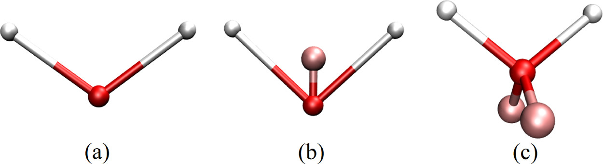
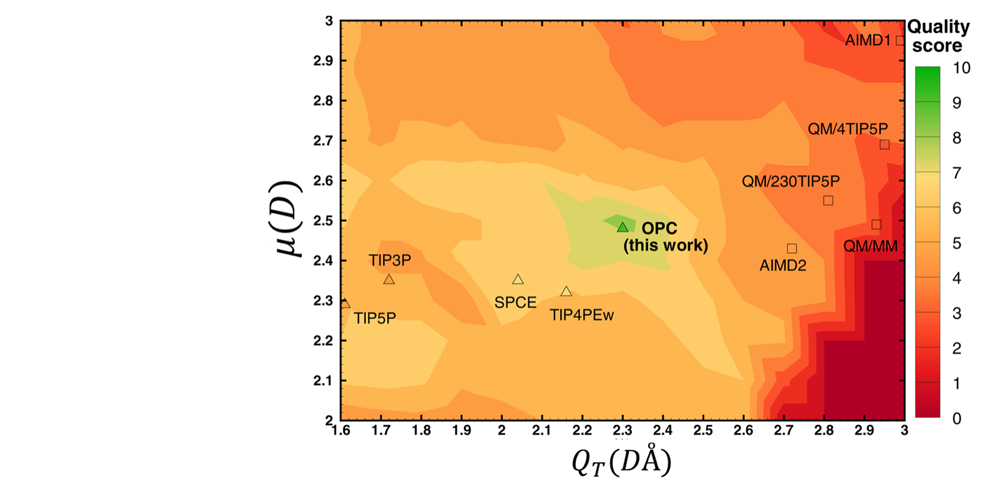
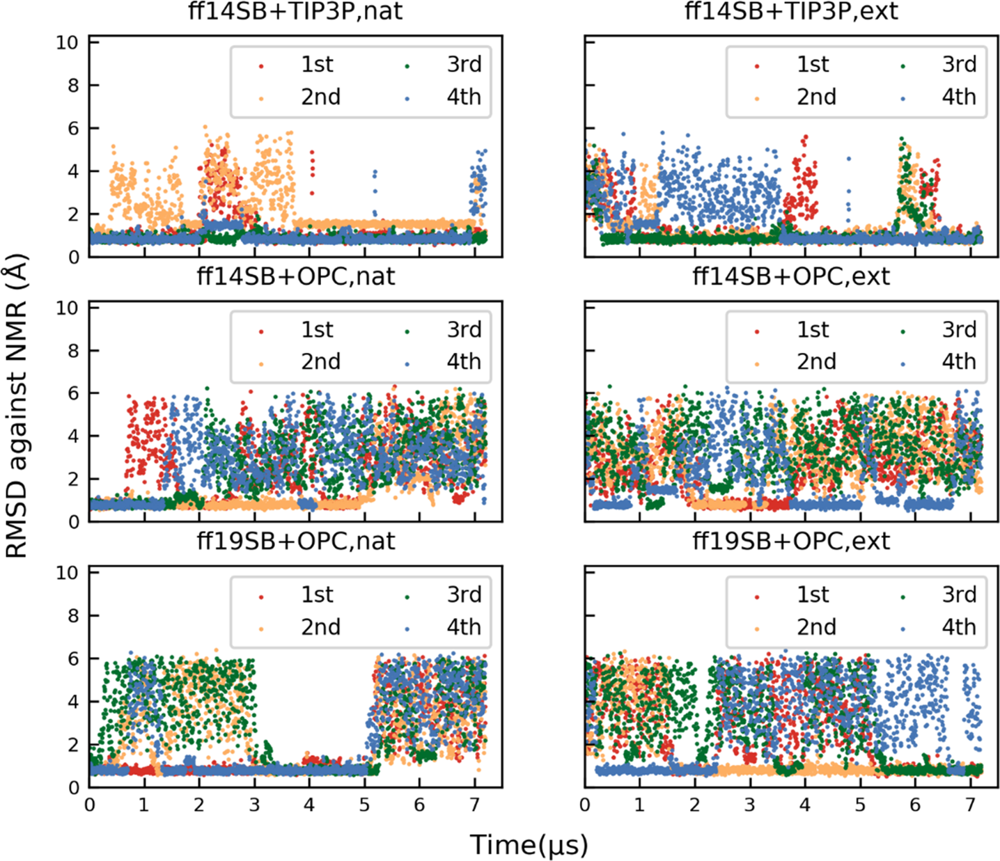
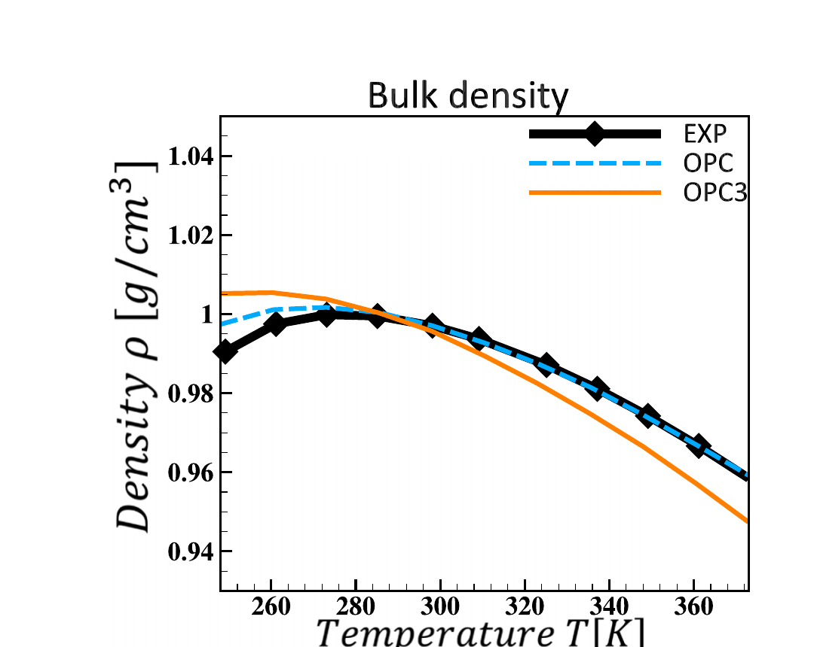
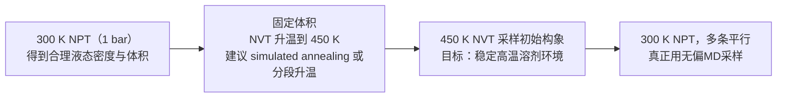
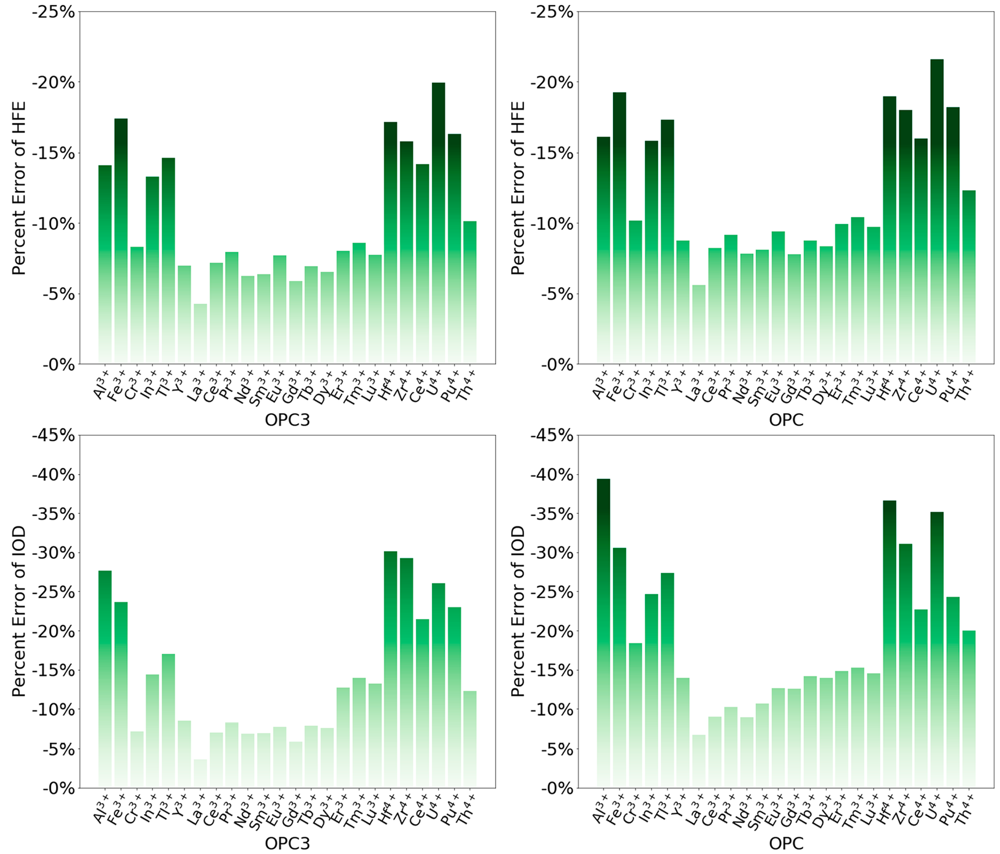
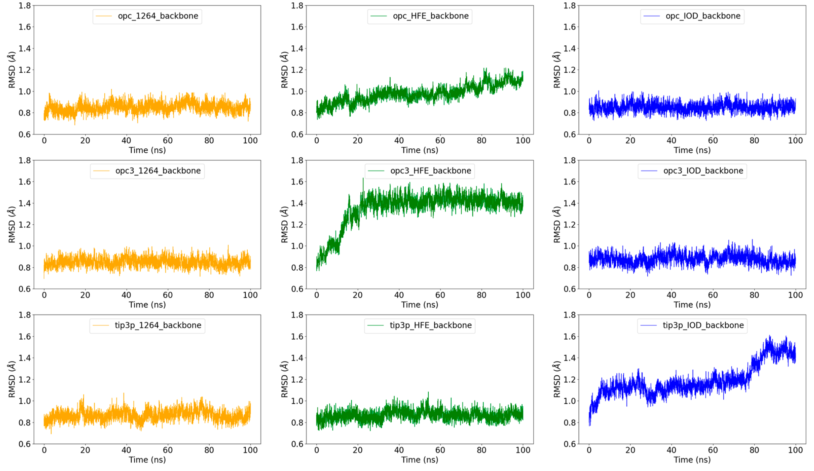
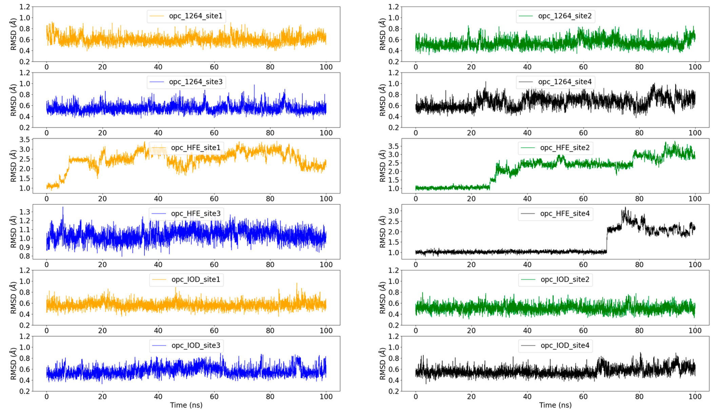

# Amber ff19SB高温MD模拟的水模型选择、系综设置与金属离子参数

> 搜到的资料不多，结合了AI整理和推断，如有错误恳请指出[合十][合十]。

## 摘要

> 在高温分子动力学模拟和金属离子体系建模中，水模型选择、系综设置和离子参数配套共同决定模拟结果的可靠性。本文系统性地梳理了 **OPC 与 OPC3 的适用边界**、**450 K 高温构象采样的系综选择逻辑**，以及**高价金属离子的 12-6-4 模型参数化与验证**。对于水模型选择，ff19SB 论文在已测试水模型中推荐与 **OPC** 组合（未评测 OPC3）；独立基准研究显示 OPC 在宽温区密度–温度曲线和热膨胀系数上整体优于 OPC3。对于 450 K 构象探索，推荐使用 **300 K NPT** 确定密度后进行 **NVT 高温采样**，最终回到 300 K NPT 重新平衡[3]。对于三价/四价金属离子，传统 **12-6 模型无法同时重现水化自由能（HFE）与离子–氧距离（IOD）**，误差可达 ±100 kcal/mol（HFE）和 ±0.1 Å（IOD），必须使用包含 $C_4$ 项的 **12-6-4 模型**（误差分别在 2 kcal/mol 与 0.01 Å 以内）。在超氧化物还原酶（$\ce{Fe^{3+}}$ + OPC）的验证中，**图8** 和 **图9** 共同证明：12-6-4 模型在保留配位球结构方面显著优于 12-6 模型，且 **优化 IOD 的 12-6 参数集** 在配位几何稳定性上也优于 12-6 HFE 参数集[5]。更换水模型时必须同步配套对应的离子参数，否则可能导致系统性偏差。

### 核心结论

- **水模型优先级**：ff19SB 原论文在已测试的显式水模型中推荐 **ff19SB + OPC**，且未评测 OPC3；若受限必须使用三点水，可选择 OPC3 作为折中方案[4]
- **高温性能判断**：基准研究显示 OPC 在宽温区密度–温度曲线和热膨胀系数上整体优于 OPC3；12-6 模型下 OPC3 的 IOD–HFE 曲线最接近实验目标点，但仍有系统性误差[1][2][5]
- **构象采样策略**：450 K 用于初始构象探索时，建议以 300 K NPT 的体积进入 NVT 高温采样**，最终结论以 300 K NPT 的再平衡与生产采样为准**[3]
- **离子参数配套**：更换水模型后必须同步更新对应的离子 Lennard-Jones 参数；对于三价/四价金属离子，优先采用 **12-6-4 模型**，其定量优势在图5部分详细说明[5]
- **12-6-4 在蛋白体系中的验证**：在超氧化物还原酶（$\ce{Fe^{3+}}$ + OPC）的验证中，**图8** 和 **图9** 共同证明12-6-4在保留配位球结构方面显著优于12-6；且**优化IOD比优化HFE更重要**，12-6 IOD参数集的配位几何稳定性远优于12-6 HFE参数集[5]
- **物理机制**：OPC 的 M-site 有助于更好拟合高阶多极矩，从而改善氢键网络与温度依赖性质[1][2]

---

## 背景

高温分子动力学模拟（如 **450 K 退火或加速采样**）在蛋白质构象探索和增强采样中广泛应用。然而，高温条件下的水模型选择往往被研究者忽视，导致模拟结果可能引入不必要的系统偏差。

水模型作为 MD 模拟中占比最大的组分（通常占体系原子数的 **80**% 以上），其性质对体系的动力学行为、热力学响应和溶剂化结构具有决定性影响。在常温（**300 K**）下，大多数主流水模型（TIP3P、OPC、OPC3 等）都能给出合理的结果。但在 **高温** 或 **宽温区** 研究中，不同水模型对 **温度依赖性质**（如密度随温度的变化、热膨胀系数、介电常数等）的拟合能力差异显著。

当前存在一个关键的知识缺口：当研究者需要使用 **Amber ff19SB** 这一代高精度蛋白力场进行 **高温 MD 模拟**时，应该选择 **OPC** 还是 **OPC3** 水模型？两者在 **450 K** 下的性能有何差异？在 **NVT** 和 **NPT** 系综之间应该如何选择？这些选择背后的物理机制是什么？

## 水模型选择

### ff19SB 水模型选择：OPC 还是 OPC3？

在设计高温 MD 模拟方案时，第一个需要明确的问题是：**ff19SB 力场应该搭配哪个水模型**？

#### ff19SB 的水模型兼容性

**ff19SB 力场**以氨基酸特异的 **CMAP** 修正主链 $\phi/\psi$ 能量面，共拟合 16 组 CMAP（$24 \times 24$ 网格），训练目标为溶液相 QM 能量面，因此不依赖于某一个固定水模型。从兼容性角度，ff19SB 可以与 **OPC**、**OPC3**、**TIP3P** 等多种水模型组合使用。

ff19SB 原论文仅比较了 **OPC 与 TIP3P** 并推荐在已测试的显式水模型中使用 OPC，同时强调 **ff19SB 并未用 OPC 拟合**，水模型仍可能是限制因素，未来其他水模型不排除更好[4]。

> 需要说明的是**，OPC3 并未包含在 ff19SB 原论文的评测范围内**，本文关于 OPC3 的讨论主要来自水模型基准研究。
>
> http://archive.ambermd.org/202303/0144.html 里提到[6]
> Hi Vlad,
> Yes we have done some tests using opc3, nothing published yet. For peptides
> the match to experiment degrades a little compared to opc, but better than
> tip3p. I don't have more specifics since I am at the ACS meeting this week.
> Carlos

#### OPC vs OPC3：本质区别

OPC（**Optimal Point Charge water**）与 OPC3（**Optimal Point Charge 3-point water**）是同一研究团队开发的两种水模型，它们的本质区别在于 **点位（sites）布置** 和 **电荷分布方式**：

| 特性 | OPC | OPC3 |
| --- | --- | --- |
| **点位类型** | 4-point 模型 | 3-point 模型 |
| **电荷布置** | 除了两个 H 和 O 以外，还有一个 **无质量的负电荷点**（M-site） 偏离氧原子中心，O上无电荷 | 所有电荷都放在 O/H 原子上 |
| **电荷参数** | q=0.6791 e[2] | q=0.447585 e[1] |
| **几何参数** | l=0.8724 Å，$z_1$=0.1594 Å，θ=103.6°[2] | l=0.97888 Å，θ=109.47°[1] |
| **LJ 参数** | $\sigma_\mathrm{LJ}$=3.16655 Å，$\varepsilon_\mathrm{LJ}$=0.89036 kJ/mol[2] | $\sigma_\mathrm{LJ}$=3.17427 Å，$\varepsilon_\mathrm{LJ}$=0.68369 kJ/mol[1] |
| **设计理念** | 类似 **TIP4P** 的思路，通过 M-site 更准确地拟合水分子的静电分布与氢键网络 | 在 **3 点刚性水模型** 的精度上限约束下做的最优拟合 |
| **拟合目标** | 优化整体水性质和溶质–水相互作用 | 在 3 点模型框架下达到最佳拟合 |

> 注：$z_1$ 表示负电荷虚拟点（M-site）相对氧原子沿水分子对称轴的位移，OPC3 为三点模型因此不适用。[1][2]

两者的共同点是以 **电荷分布** 为核心进行优化。OPC 的构建采用对 $\mu$–$Q_T$ 空间的系统搜索，仅保留对称性约束，以优化液相电静特征；OPC3 在相同思路下将模型压缩为三点形式，以获得更高的计算效率[1][2]

从物理意义上理解**，OPC 的 M-site** 相当于在氧原子附近增加了一个额外的“虚拟电荷点”，使得模型能够更准确地再现水分子的高阶多极矩（quadrupole moment），从而改善对 **氢键网络** 和 **溶剂化结构** 的描述。

> 这里的 $\mu$ 表示水分子偶极矩，$Q_T$ 表示四极矩的迹。OPC 论文定义了一个**质量评分**，用多项体相性质与水化自由能的综合误差来衡量模型在 $\mu$–$Q_T$ 空间的优劣，得分越高表示越接近目标性质[2]。

**图1**：**OPC 的 $\mu$–$Q_T$ 质量评分图**（原文 Figure 3）[2]

该图展示了在 $\mu$–$Q_T$ 空间中的模型质量分布，OPC 位于高质量区域，说明其电静多极矩选择更接近液相最优区间[2]。

#### 精度 vs 速度/兼容性

OPC 和 OPC3 的选择本质上是在模拟精度与计算通用性之间做权衡：

- **OPC 的优势**：在整体水性质、溶质–水静电相互作用、氢键网络的再现上通常更准确。但 4 点模型在某些 MD 引擎或工作流中会稍麻烦或略慢（如 GPU 加速路径对 4 点水的优化程度可能不如 3 点水）。
- **OPC3 的优势**：通常更快、更“通用”（3 点水对很多程序/加速路径更友好），但就 **水本身的综合性质拟合** 而言一般不如 OPC。

#### 社区实践经验

基于原论文结论与常见实践，若不受 3 点水限制，优先使用 **OPC**；若必须使用 3 点水，再以 **OPC3** 作为替代。

**ff19SB + OPC 的实验验证**：

**图11**：**CLN025 蛋白的主链 RMSD 随时间变化**（Maier et al., JCTC 2020, Figure 11）[4]

该图展示了在 **CLN025**（一种快速折叠的 β-hairpin 蛋白）的模拟中，三种力场+水模型组合的性能：从 **天然结构**（nat） 与 **完全伸展结构**（ext） 出发，各 4 条轨迹，共 8 次独立模拟**；300 K** 进行，总时长约 **172 μs**

**性能对比**：
- **ff19SB + OPC**（蓝色）：能够可逆地折叠到天然结构，native population = **50 ± 17**%
- **ff14SB + TIP3P**（红色）：native population = **75 ± 23**%
- **ff14SB + OPC**（黄色）：native population = **33 ± 19**%

**关键发现**：

1. **折叠可逆性**：4 次 nat 与 4 次 ext 轨迹均回到天然结构，说明该组合稳定可靠
2. **组合匹配性**：ff14SB + OPC 的 native population 低于 ff14SB + TIP3P，提示 OPC 与 ff14SB 的协同不足
3. **协同优势**：ff19SB 并未专门拟合 OPC，但与 TIP3P 对比时 OPC 在折叠动力学与构象平衡上更好[4]

这个实验数据支持 **ff19SB + OPC 作为推荐组合**的结论，特别是在蛋白折叠、构象平衡等应用中[4]。一个实用的 **经验法则**：

- **默认**（蛋白折叠/构象平衡/IDP 等）：ff19SB + OPC
- **必须 3 点水**（例如某些代码路径、极限性能、或你工作流只能稳定支持 3 点）：用 OPC3，并确保离子参数选择合理/一致

---

### 高温下的性能差异：OPC 还是 OPC3 更好？

高温（**450 K**）是水模型性能差异被放大的场景。当温度升高，水分子的 **动能增加**、**氢键网络减弱**、**密度下降**，不同水模型对 **温度依赖性质** 的拟合能力差异会显著影响模拟结果的可靠性。

#### 纯水基准测试：宽温区对比

多项研究已经系统对比了 OPC 和 OPC3 在 **宽温区**（270–650 K） 的表现：

1. **OPC3 相关论文**（Izadi & Onufriev, 2016）：直接对比了 OPC vs OPC3 的 **密度–温度曲线**，作者明确指出：[1]
   - **4-point OPC** 在宽温区密度的温度依赖上比 **3-point OPC3** 更准确
   - 给出了一个关键的派生量：**OPC3 的热膨胀系数偏差**（约 $67.9\%$）远大于 OPC（约 $5\%$）
   - 文中指出 OPC3 在三点模型中显著优于 TIP3P/SPC/E，并认为实用三点刚性非极化模型已接近精度上限

2. **2024 年三点水模型的大规模对比**（11 个刚性三点水模型）系统评估了液–汽共存、临界点与自发气化等高温行为：[3]
   - 给出各模型的 $T_\mathrm{C}$、$T_\mathrm{MD}$ 与 $T_\mathrm{evap}$，$T_\mathrm{evap}$ 范围约为 $520$–$620~\mathrm{K}$，并明确指出 $T_\mathrm{evap}$ 不是沸点
   - 该研究仅覆盖三点模型（包含 **OPC3**）**，不包含四点 OPC**，因此不能据此得出 “OPC3 优于 OPC” 的结论

3. **OPC 原始论文** 强调：OPC 通过优化点电荷分布来逼近液相电静特征**，体相性质平均相对误差**约 $0.76\%$，并且在宽温区保持与实验接近；同时小分子水化自由能的 RMS 误差可做到 **$<1~\mathrm{kcal/mol}$**[2]。

#### 高温性能差异从何而来？

OPC vs OPC3 在高温下的性能差异，核心来自 **电荷点位布置** 的不同：

- **OPC**（4-point，带 M-site）：负电荷不锁死在氧原子上，而是分布在 M-site → 能更好复现高阶多极矩，从而改善氢键网络与温度依赖性质
- **OPC3**（3-point）：负电荷必须在氧上 → 多极矩表达受限，作者明确指出这会拖累密度温度依赖与热膨胀等指标[1]

OPC3 论文给出了两者的多极矩差异：OPC 的 $\mu = 2.48~\mathrm{D}$、$Q_T = 2.3~\mathrm{D\cdot Å}$，而 OPC3 的 $\mu = 2.43~\mathrm{D}$、$Q_T = 2.06~\mathrm{D\cdot Å}$[1][2]。 OPC 的负电荷可偏离氧原子以更好兼顾高阶多极矩；OPC3 负电荷固定在氧上，导致高阶多极矩拟合受限。

#### 直接回答“高温下谁更好？”

- 如果你说的“高温”是指 **温度高于 350 K** 甚至更高并且你关心 **温度依赖的体相水性质**：**倾向选择 OPC**
- 如果你受限于 3 点水**（性能/引擎/工作流），OPC3 是可接受的折中方案**，但要接受它在 **密度–温度曲线/热膨胀** 上偏差更大。

---

### 450 K 构象采样：NVT 还是 NPT？

当你的研究目标是 **450 K 下进行蛋白质构象采样**（如高温退火、加速跨越能垒），系综的选择（**NVT** vs **NPT**）和体积/密度的设定策略会直接影响采样效率和结果可靠性。

#### NVT vs NPT：物理意义的本质区别

首先需要明确 **NVT** 和 **NPT** 系综在高温下的物理含义：

- **NVT**（等温等容）：固定体积，温度耦和到热浴。体系密度被锁死，不会因温度升高而膨胀。
- **NPT**（等温等压）：固定压力（通常 $1~\mathrm{bar}$），体积可以自由调整。体系会根据温度自动调整到平衡密度。

在 **$450~\mathrm{K}$、$1~\mathrm{bar}$** 的条件下，液态水处于 **超热液体** 区域。对 11 种刚性三点水模型的系统研究表明，NPT 下存在模型相关的 **自发气化温度** $T_\mathrm{evap}$，且 **$T_\mathrm{evap}$ 并不等于沸点**。该研究给出的 $T_\mathrm{evap}$ 范围约为 $520$–$620~\mathrm{K}$，其中 $T_\mathrm{evap}$ of **OPC3 为 $593.7 \pm 1.2~\mathrm{K}$**（C-rescale barostat）[3]。

因此，450 K 低于 $T_\mathrm{evap}$，体系在 NPT 下仍可能保持液相，但密度会明显下降，并对 barostat 与升温速率更敏感。若继续升温接近 $T_\mathrm{evap}$，则可能出现 **空泡、密度骤降、体积迅速增大** 的“自发气化”现象。

#### 你关心的问题类型

选择 NVT 还是 NPT，取决于你的研究目标：

**1) 只是要一个稳定溶剂环境**（重点关注蛋白高温退火/加速采样）

✅ **NVT 是合理选择**。OPC3 可以用（或 OPC，如果你能用 4-point）。作为三点模型，OPC3 在温度依赖的体相性质上精度有限，但用于“稳定溶剂环境”的需求通常足够。

在这种用途里，决定能否稳定运行的往往不是水模型，而是：
- **初始密度是否合理**（NVT 下密度不会自动纠正）
- **约束/时间步/恒温器设置是否稳定**

一个常见参照是温度‑REMD：**多数 REMD 实现会在 NVT 下运行多个 replica**，在 Amber 这类力场工作流中也很常见；Amber 早期 REMD 只支持 NVT，后续才扩展到 NPT‑REMD[7][8]。因此**，把高温 NVT 当作构象探索的工具是合理的**，但最终统计仍应回到常温 NPT 的再平衡与生产采样。

如果你只需要“稳定液相环境”，核心问题是 $450~\mathrm{K}$ **是否低于** $T_\mathrm{evap}$。三点水模型的大规模对比研究给出 OPC3 的 $T_\mathrm{evap}=593.7 \pm 1.2~\mathrm{K}$，**明显高于** $450~\mathrm{K}$，因此在 **$450~\mathrm{K}$ NVT** 下使用 OPC3 作为稳定溶剂环境是合理的[3]。

需要强调的是**，高温轨迹只用于初始构象探索**，最终统计应回到 **$300~\mathrm{K}$ NPT** 重新平衡与生产采样。若进行高温 NPT 预平衡，建议采用 **C-rescale** 并先在中间温度预平衡密度。

**2) 你要在 450 K 下比较水的热力学/界面性质**（密度-温度曲线、热膨胀、表面张力等）

⚠️ **需要谨慎**：OPC3 论文认为实用三点刚性非极化模型已接近精度上限；相比之下 **OPC**（4-point） 在密度温度依赖与热膨胀上通常更贴近实验[1]。

如果你在意这些**水本身的量**，优先考虑 **OPC**（如果你能用 4-point）或其他被广泛用来做宽温区热力学的模型。

**图2**：**OPC 与 OPC3 的密度–温度曲线对比**（原文 Figure 7）[1]

黑色为实验数据，蓝色虚线为 OPC，橙色为 OPC3。可以看到 OPC 在较宽温区内更贴近实验曲线，OPC3 在高温段偏离更明显[1]。

#### 密度设定策略：用300 K NPT 平衡还是 450 K NPT？

对于大多数“**关注蛋白构象采样**”的场景，推荐的流程是：

**为什么这样选**？

- **450 K、$1~\mathrm{bar}$ 的 NPT** 会显著降低液态密度，且密度对 barostat 和升温方式更敏感；如果目标是“维持高温液态环境以加速采样”，这与 NPT 的密度松弛方向存在冲突。
- 你需要的是“高动能且保持液态的溶剂环境”。
- 用 **300 K NPT 的体积**（接近常温液态密度） 去做 450 K NVT，等价于在高温下维持一个高温但仍致密的溶剂箱，使蛋白在溶剂中更快跨越能垒。

#### 推荐的 GROMACS 参数配置

**450 K + NVT 在 GROMACS 的实操建议**（保证 OPC3 可稳定使用）：

1. **先 NPT 调整密度，再切 NVT**
   - NVT 下密度锁死；如果直接用 300 K 的密度升到 450 K，水会处在不合理的内压状态，性质会出现偏差。
   - 若必须做高温 NPT，建议 **先在中间温度预平衡密度**，再升到目标高温；并优先使用 **C-rescale barostat**。三点水模型的 $T_\mathrm{evap}$ 对 barostat 有系统偏移：Berendsen 通常偏高、PR 往往更低。

2. **水用刚性约束**（SETTLE）
   - OPC/OPC3 都是 rigid water；在 GROMACS 里建议用 SETTLE 约束水（更稳定/更快）。

3. **时间步适当保守**
   - 450 K 动力学更活跃：如果你用全键约束 + 虚拟氢（有的话）可以 2 fs；不确定就从 **1–2 fs** 起步，先看能量漂移和约束警告。

4. **离子参数的“水模型一致性”**
   - 如果有盐，离子 LJ 参数最好与水模型配套，否则溶剂化/离子对结构可能出现漂移（这点在高温会更敏感）。

---

## 离子参数要配套

水模型一旦更换**，离子 Lennard-Jones 参数也应同步切换**，否则盐桥、屏蔽效应与溶剂化自由能可能出现系统性偏移，高温下这种偏移更明显。

> AMBER 生态里针对不同水模型有对应的 **frcmod.ions** 参数组合。若暂时缺少 OPC3 专用参数**，OPC3 论文** 给出过渡方案：可谨慎使用 **Joung/Cheatham**（TIP3P） 的单价离子参数。作者比较了 $\ce{Na+}$、$\ce{K+}$、$\ce{Cl-}$ 的离子–氧距离，指出该参数集在 OPC3 中能在 $\pm 0.05~\mathrm{Å}$ 内匹配目标 IOD 值[1]。

### 高价金属离子：12-6 与 12-6-4 LJ势

对于 **三价（$\ce{M^{3+}}$）和四价（$\ce{M^{4+}}$）金属离子**，离子参数的选择更为关键。这类离子在稀土化学、材料科学和金属蛋白中广泛存在，如 **$\ce{Fe^{3+}}$、$\ce{Al^{3+}}$、$\ce{Cr^{3+}}$、$\ce{U^{4+}}$、$\ce{Ce^{4+}}$** 等。

- **12-6-4 的核心优势**：传统 12-6 LJ 模型难以同时重现 **水化自由能**（HFE） 与 **离子–氧距离**（IOD），因此引入包含 **$C_4$ 项**的 12-6-4 模型以考虑 **离子诱导偶极相互作用**。该模型能同时逼近实验 HFE 与 IOD，误差分别约为 $2~\mathrm{kcal/mol}$ 与 $0.01~\mathrm{Å}$[5]。
- **12-6 的可取之处**：形式更简单，且可分别选择 **HFE** 或 **IOD** 目标进行拟合；但其在蛋白结合环境下对水模型更敏感[5]。

12-6-4 的**势能形式**可写为：[10]
$$
U_{ij}(r)=\frac{C_{12}^{ij}}{r^{12}}-\frac{C_{6}^{ij}}{r^{6}}-\frac{C_{4}^{ij}}{r^{4}}
$$

**与水模型的耦合**：

- **参数覆盖范围**：已为 18 个三价和 6 个四价金属离子开发了配套 OPC/OPC3 的 12-6-4 参数[5]
- **水模型依赖性**：$C_4$ 项对水模型敏感，因此 OPC/OPC3 需要专门参数化，不能直接沿用 TIP3P

#### Figure 4：12-6 vs 12-6-4 的 IOD–HFE 扫描对比

##### 什么是 IOD–HFE 扫描曲线？

- **扫描的物理意义**：在参数空间中系统地改变离子的 $r_{\min}/2$ 参数，计算每种参数组合对应的 **HFE（水化自由能）** 和 **IOD（离子–氧距离）** 预测值。将这些（HFE, IOD）数据点绘制成二维曲线，就是 **IOD–HFE 扫描曲线**。扫描曲线展示了在不同参数偏好下，模型如何在两个目标性质之间权衡，帮助理解参数选择的物理约束。
- **扫描的维度与 NGC 约束**：
  - 对于 **12-6 模型**（$C_4 = 0$）：只需扫描 $r_{\min}/2$ 一个参数。这是因为 $r_{\min}/2$ 与 $\varepsilon$ 通过 **noble gas curve (NGC)** 关联，$\varepsilon$ 不是独立自由度
  - NGC 是基于惰性气体原子实验数据拟合的经验关系，形式为 $\varepsilon = A \cdot \exp(-B \cdot r_{\min/2})$，反映了 LJ 势函数中两个参数的物理约束（原子越小 → 势阱越深）
  - 对于 **12-6-4 模型**：需要在 $r_{\min}/2$ 与 $C_4$ 二维空间扫描，增加一个自由度以同时满足 HFE 和 IOD
- **曲线的解读**：曲线上每个点代表一个可能的参数组合及其预测的（HFE, IOD）值。实验目标点通常不在曲线上，说明 12-6 模型无法同时命中两个目标；而 12-6-4 的虚线边界区域如果能覆盖实验点，则说明可以通过调节 $C_4$ 同时满足两个目标[5]

**图4**展示在 **12-6 模型**（$C_4 = 0$，实线） 与 **12-6-4 模型**（$C_4$ 扫描范围，虚线边界） 下，七种水模型的 IOD–HFE 扫描曲线与实验目标点的对比（Li & Merz, JCTC 2021, Figure 4），分为左右两个面板：

##### 左图：三价金属离子（$\ce{M^{3+}}$）

- **实验目标点的物理含义**：图中的**黑色实心点**代表实验测定的 HFE–IOD 目标值，每个点对应一种三价离子（如 $\ce{Al^{3+}}$、$\ce{Fe^{3+}}$、$\ce{Cr^{3+}}$ 等）的精确水化性质。

- **OPC3 在 12-6 框架下表现最优**：**OPC3 水模型的红色实线**（$C_4 = 0$，即 12-6 模型）在所有测试的水模型中**最接近实验点群**，验证了其在 12-6 框架下的优势地位。

- **12-6-4 虚线边界覆盖实验点**：**红色虚线边界**代表 $C_4$ 在扫描范围内变化时的 12-6-4 模型上下界，这个范围**覆盖了大部分实验点**。这意味着通过调整 $C_4$ 参数，12-6-4 模型可以同时重现实验的 HFE 和 IOD 值。

  > 也没有吧，有个别比较好，大部分并没有重合，加了 $C_4$ 就是整体上移了，不同水的趋势也基本保持一致。

- **三点水模型在金属离子模拟中表现优于四点水模型**：七种水模型的性能对比如下表所示：

| 水模型类型 | 代表模型 | 曲线颜色 | 与实验点的距离 | 性能排名 |
|-----------|---------|---------|--------------|---------|
| **三点水** | OPC3 | 红色 | **最近**（12-6 框架下最优） | 🥇 |
| **三点水** | TIP3P-FB | 黄色 | 相对接近 | 🥈 |
| **三点水** | TIP3P | 绿色 | 相对接近 | 🥉 |
| **三点水** | SPC/E | 绿色 | 相对接近 | - |
| **四点水** | OPC | 蓝色 | 系统性偏离 | - |
| **四点水** | TIP4P-FB | 紫色 | 偏离显著 | - |
| **四点水** | TIP4P-Ew | 紫色 | 偏离显著 | - |

**关键发现**：四点水模型（OPC、TIP4P-FB）的扫描曲线**系统性偏离实验点**，尤其是 TIP4P 系列偏差最为显著。这验证了原文的核心结论：**三点水模型在金属离子模拟中通常表现更好**，而 OPC3 是三点水模型中的最优选择。

- **三点水模型优势的物理机制**：三点水模型的负电荷固定在氧原子上，这种分布更接近金属离子周围的水分子排布（水分子通常以氧原子指向金属离子）。相比之下，四点水模型（如 OPC 的 M-site）的负电荷偏离氧原子，虽然对纯水性质更准确，但在描述金属离子–水相互作用时可能引入系统性偏差。

右图：四价金属离子（$\ce{M^{4+}}$）

- **OPC3 在四价离子中同样表现最优**：右图展示了 $\ce{U^{4+}}$、$\ce{Ce^{4+}}$、$\ce{Th^{4+}}$、$\ce{Pu^{4+}}$ 等四价离子的 HFE–IOD 关系。与三价离子类似**，OPC3（红色）的扫描范围最接近实验点**，而四点水模型（OPC、TIP4P-FB）的曲线相对偏离。

#### Figure 5：12-6 模型的定量误差分析

**图5**从定量角度展示了在 **12-6 模型** 下，OPC3 和 OPC 对不同高价金属离子的 **HFE 和 IOD 模拟误差**（以百分比表示）。该图分为四个子图，揭示了 12-6 模型的**顾此失彼**现象：当使用 12-6 IOD 参数集时，IOD 准确但 HFE 误差大（上图）；当使用 12-6 HFE 参数集时，HFE 准确但 IOD 误差大（下图）。

##### 12-6 vs 12-6-4 模型的定量对比

下表对比了12-6模型与12-6-4模型的误差水平：

| 模型类型 | HFE 误差 | IOD 误差 | 同时重现两个目标？ | 根本局限 |
|---------|---------|---------|------------------|---------|
| **12-6 IOD 参数集** | ±10%（约 ±100 kcal/mol） | < ±1% | ❌ HFE 误差大 | 势函数形式过于简化 |
| **12-6 HFE 参数集** | < ±1% | ±5%（约 ±0.1 Å） | ❌ IOD 误差大 | 势函数形式过于简化 |
| **12-6-4 模型** | **< 2 kcal/mol** | **< 0.01 Å** | ✅ 同时满足 | 无（引入 $C_4$ 项） |

**关键结论**：12-6-4模型通过引入离子诱导偶极项（$C_4$），能同时准确重现HFE与IOD，定量证明其在描述高价金属离子–水相互作用方面具有显著优势[5]。

##### 12-6 模型在不同离子上的误差表现

下表总结了三价离子在不同12-6参数集下的典型误差范围：

| 参数集 | 误差类型 | OPC3 典型误差 | OPC 典型误差 | 问题最严重的离子 |
|--------|----------|--------------|-------------|-----------------|
| **12-6 IOD** | HFE 误差 | ±10%（多数离子） | 略大于 OPC3 | $\ce{Be^{3+}}$：+16% |
| **12-6 HFE** | IOD 误差 | ±5%（多数离子） | 略大于 OPC3 | $\ce{Be^{3+}}$：+29% |

##### 关键观察与结论

- **影响误差的关键因素**
  - **离子尺寸**：小离子（如 $\ce{Be^{3+}}$）在所有指标上误差都最大，而大离子（如 $\ce{La^{3+}}$、$\ce{Ac^{3+}}$）的误差相对较小。这是因为大离子的较低电荷密度使得离子–水相互作用较弱。
  - **离子电荷**：对于四价离子（$\ce{U^{4+}}$、$\ce{Ce^{4+}}$ 等），误差进一步放大。Supporting Information Figure S1 显示四价离子的误差普遍大于三价离子，因为更高的电荷（+4）导致更强的离子–水相互作用，12-6 模型的偏差被进一步放大。

- **OPC3 略优于 OPC 的验证**
  - **定量验证**：图5定量验证了图4的观察——OPC3 的误差百分比整体略小于 OPC。但**优势幅度不大**，且无法改变 12-6 模型的根本性缺陷。
  - **物理机制**：OPC3 的优势可能来自其在三点水模型中的最优电荷分布，使得 HFE–IOD 曲线更接近实验目标点。但这种优势仍不足以弥补 12-6 模型缺少 $C_4$ 项的缺陷。

- **图4和图5共同构成的证据链**：图4从定性角度证明 OPC3 的 IOD–HFE 扫描曲线最接近实验点，图5从定量角度验证 OPC3 在具体离子的误差上略优于 OPC。两图的共同结论总结如下表：

| 结论层次 | 内容 | 说明 |
|---------|------|-----|
| **12-6 框架下的优先选择** | OPC3 | IOD–HFE 曲线最接近实验点，误差略小于 OPC |
| **12-6 模型的根本性局限** | 无法同时重现 HFE 和 IOD | "顾此失彼"现象源于简化的势函数形式 |
| **最终解决方案** | 使用 12-6-4 模型 | 引入 $C_4$ 项可同时满足 HFE 和 IOD |

- **结论的适用范围与局限**
  - **纯水溶液结论的限制**：这两图的分析都基于**纯水溶液中的金属离子**，其结论**不能直接外推到蛋白结合体系**。在蛋白环境中需要额外的验证（如下文的超氧化物还原酶案例）。
  - **蛋白环境的复杂性**：配位残基、质子化状态、局部电场等因素会使相互作用更复杂。金属离子稳定性不仅取决于水模型和离子参数，还与配位残基的类型、局部电场强度、质子化状态等因素密切相关。

### 金属蛋白应用案例：超氧化物还原酶中的 Fe³⁺

为了验证 12-6-4 模型在真实蛋白环境中的表现，作者选择了 **超氧化物还原酶**（superoxide reductase）作为测试体系。该蛋白的每个单体含有一个 **Fe³⁺ 离子结合位点**，由四个 His 残基和一个 Cys 残基配位[5]。

**⚠️ 适用范围说明**：
- **特定离子**：以下分析仅针对 **Fe³⁺**（三价铁），结论不能直接外推到其他金属离子
- **特定水模型**：以下分析主要针对 **OPC 水模型**，其他水模型的表现可能不同
- **体系特异性**：金属结合位点的稳定性依赖于配位残基、质子化状态、局部电场等因素

#### Figure 8：不同参数集和水模型的蛋白骨架 RMSD 对比

**图8**展示在 **9 次独立模拟** 中，使用不同离子参数集和水模型组合时**，蛋白骨架重原子的 RMSD** 随时间的变化（Li & Merz, JCTC 2021, Figure 8）。

##### 曲线特征与定量观察

- **曲线的基本特征**：图8展示了**9次独立模拟**的结果，每条彩色曲线代表**一次独立的模拟**，使用了不同的参数集/水模型组合。
- **模拟的可重复性**：虽然每条曲线的轨迹略有不同，但**所有曲线都集中在1.5–2.5 Å范围内**，说明不同模拟之间的结果相对一致，可重复性良好。
- **蛋白整体结构保持稳定**：大部分曲线的 RMSD 在 **1.5–2.5 Å** 之间，表明蛋白整体结构保持稳定。
- **骨架 RMSD 对离子参数不敏感**：不同参数集/水模型组合的 **RMSD 差异不大**，说明蛋白整体折叠对离子参数相对不敏感**，骨架 RMSD 不是评估金属离子参数优劣的敏感指标**。
- **骨架 RMSD 的局限性**：虽然骨架 RMSD 显示蛋白整体结构稳定，但**骨架 RMSD 不能完全反映金属结合位点的细节变化**。

#### Figure 9：OPC 下 Fe³⁺ 的结合位点稳定性对比

**图9**展示在 **OPC 水模型** 下，Fe³⁺ 使用三种不同参数集时**，金属结合位点残基的 RMSD** 随时间的变化。这与图8的**骨架 RMSD** 不同，这里专门关注**配位球结构**的稳定性。

##### 三组曲线的对比

| 参数集 | 颜色 | 优化目标 | 平均 RMSD | 波动性 |
|--------|------|----------|-----------|--------|
| **12-6-4** | 蓝色 | 同时重现 HFE 和 IOD | **最低**（~1.0 Å） | 最小 |
| **12-6 IOD** | 黄色 | 仅优化 IOD | 中等（~1.2 Å） | 较小 |
| **12-6 HFE** | 红色 | 仅优化 HFE | 最高（~1.4 Å） | 最大 |

##### 关键发现与物理机制

- **12-6-4 最稳定**（蓝色）：RMSD 值最低且最平稳，**平均约 1.0 Å**。阴影区域最窄，说明 9 次重复模拟**高度一致**，配位球结构紧密保持在天然构象附近。
- **12-6 IOD 次之（黄色）——优化 IOD 是配位几何稳定性的关键**：RMSD 值略高于 12-6-4（**约 1.2 Å**），但**远低于 12-6 HFE**（约 1.4 Å）。**重要发现**：优化 IOD 确实能有效保持配位球稳定性！
  - **IOD 重要的物理机制**：在蛋白环境中，**IOD（离子–配体距离）是配位几何稳定性的关键因素**。如果 IOD 参数准确，即使 HFE 有偏差，配位球仍能保持接近天然结构。蛋白结合位点的几何约束主要来自**离子–配体距离**。

- **12-6 HFE 最不稳定（红色）——仅优化 HFE 导致配位几何结构失稳**：RMSD 值最高且波动最大（**约 1.4 Å**），阴影区域很宽，说明不同模拟之间差异显著。
  - **HFE 优化的实验观察**：在部分模拟中，水分子会替换 His 残基与 Fe³⁺ 配位，导致配位球结构发生显著变化。

下表总结了三种参数集在蛋白环境中的性能对比与推荐使用场景：

| 参数集 | 优化目标 | 平均 RMSD | 配位球稳定性 | 推荐使用场景 |
|--------|----------|-----------|-------------|-------------|
| **12-6-4** | HFE + IOD | ~1.0 Å | 性能最优 | ✅ 首选，尤其是金属蛋白结构预测 |
| **12-6 IOD** | IOD only | ~1.2 Å | 良好 | ⚠️ 12-6 框架下的次优选择 |
| **12-6 HFE** | HFE only | ~1.4 Å | 性能最差 | ❌ 避免使用，容易导致配位球失稳 |

**核心结论**：在金属结合蛋白（不涉及解离）模拟中**，准确重现 IOD 比准确重现 HFE 更重要**，因为配位几何稳定性主要依赖于离子–配体距离的准确性。12-6-4 的表现更一致，如果计算资源受限必须使用 12-6 模型，应优先选择 12-6 IOD 参数集而非 12-6 HFE 参数集。

#### 配位数如何理解

论文并未给出系统的配位数对比，而是用“配位环境的保持性”作为证据链：结论是 **12-6-4 更一致地保持配位球**，整体优于 12-6，但并不保证所有体系的配位数都更接近实验。若你实测配位数偏大，可能与离子参数、水模型或采样条件有关，建议结合 RDF 积分与实验参考再评估[5]。

>  补充（非本文）：公开综述给出 Mg$^{2+}$ 水合中 12-6-4（TIP3P/SPC/E/TIP4P-EW）对应的 **CN=6** 与实验一致，但该表没有 12-6 的并列对照，因此不能据此直接判定“12-6-4 比 12-6 更接近实验”[9]。

**实操建议**：

- 对于包含 $\ce{Fe^{3+}}$、$\ce{Zn^{2+}}$、$\ce{Mg^{2+}}$ 等金属离子的体系，优先使用为对应水模型专门参数化的 **12-6-4 LJ 参数**[5]
- 如果体系涉及 **金属蛋白的金属结合位点**，12-6-4 模型在 **配位几何结构稳定性** 上通常优于 12-6 模型[5]
- 参数表格可在 Supporting Information 中找到（Table 4：12-6-4 参数集）[5]

> 搜到有蛋白锌体系的对比显示 12‑6‑4 反而更易引入额外配位水、使 CN 增加。我之前测12-6-4的配位数也是偏大的，$\ce{Al^{3+}}$的CN=7，不过，是14SB+TIP3P

---

## **参考文献**

1. Izadi, S., & Onufriev, A. (2016). Accuracy limit of rigid 3-point water models. *The Journal of Chemical Physics*, **145**(7), 074501. https://doi.org/10.1063/1.4960175. [OPC3 原始论文，系统对比 OPC 和 OPC3 在宽温区的性能]

2. Izadi, S., Anandakrishnan, R., & Onufriev, A. (2014). Building Water Models: A Different Approach. *The Journal of Physical Chemistry Letters*, **5**(21), 3863-3871. https://doi.org/10.1021/jz501780a. [OPC 原始论文]

3. N. C. Quoika, et al. (2024). Liquid−Vapor Coexistence and Spontaneous Evaporation at Atmospheric Pressure of Common Rigid Three-Point Water Models in Molecular Simulations. *The Journal of Physical Chemistry B*, **128**, 2457-2468. https://doi.org/10.1021/acs.jpcb.3c08183. [三点水模型的 $T_\mathrm{evap}$、$T_\mathrm{C}$ 与 $T_\mathrm{MD}$ 系统对比，包含 OPC3]

4. Maier, J. A., et al. (2019). ff19SB: Amino-Acid-Specific Protein Backbone Parameters Trained against Quantum Mechanics Energy Surfaces in Solution. *Journal of Chemical Theory and Computation*, **15**(8), 3696-3713. https://doi.org/10.1021/acs.jctc.9b00591. [ff19SB 力场原论文，推荐在已测试的显式水模型中使用 OPC]

5. Li, P., & Merz, K. M., Jr. (2021). Parameterization of trivalent and tetravalent metal ions for the OPC3, OPC, TIP3P-FB, and TIP4P-FB water models. *Journal of Chemical Theory and Computation*, **17**(4), 2342-2354. [DOI: 10.1021/acs.jctc.0c01320] [18 个三价和 6 个四价金属离子的 12-6-4 LJ 参数，包含 OPC/OPC3 专门参数化]

6. AMBER 邮件列表归档（2023-03-14）：关于 OPC3 的未发表测试反馈。http://archive.ambermd.org/202303/0144.html

7. Case, D. A., et al. (2025). Recent Developments in Amber Biomolecular Simulations. *Journal of Chemical Information and Modeling*, **65**(15), 7835-7843. https://doi.org/10.1021/acs.jcim.5c01063. [AMBER 的 REMD 支持扩展，含 NPT‑REMD 说明]

8. Bergonzo, C., Henriksen, N. M., Roe, [text](f:/Download/parkinson2022.pdf)D. R., Swails, J. M., Roitberg, A. E., & Cheatham, T. E., III. (2014). Multidimensional Replica Exchange Molecular Dynamics Yields a Converged Ensemble of an RNA Tetranucleotide. *Journal of Chemical Theory and Computation*, **10**(1), 492-499. https://doi.org/10.1021/ct400862k. [AMBER REMD 中每个 replica 以 NVT 生产运行的示例]

9. Li, P., Roberts, B. P., Chakravorty, D. K., & Merz, K. M., Jr. (2017). Metal Ion Modeling Using Classical Mechanics. *Chemical Reviews*, **117**(3), 1564-1686. https://doi.org/10.1021/acs.chemrev.6b00440. [综述 Table 2 汇总了 12-6-4 模型的配位数示例]

10. Li, P., Song, L. F., & Merz, K. M., Jr. (2015). Parameterization of highly charged metal ions using the 12-6-4 LJ-type nonbonded model in explicit water. *The Journal of Physical Chemistry B*, **119**(3), 883-895. https://doi.org/10.1021/jp505875v. [12-6-4 势能形式与参数化方法]

致谢：感谢 MD 模拟社区（GROMACS 论坛、AMBER 邮件列表）在实操经验上的无私分享。
