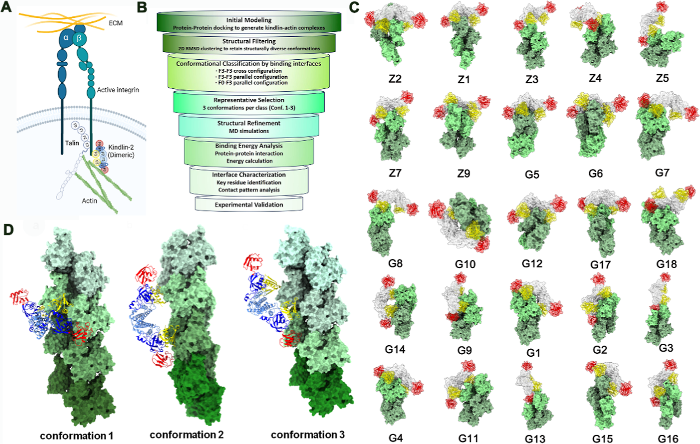
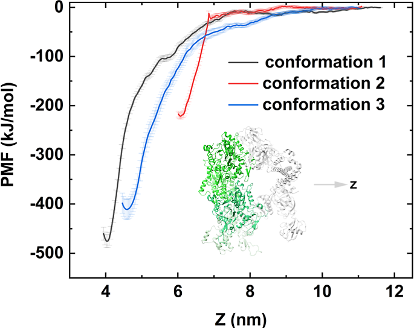
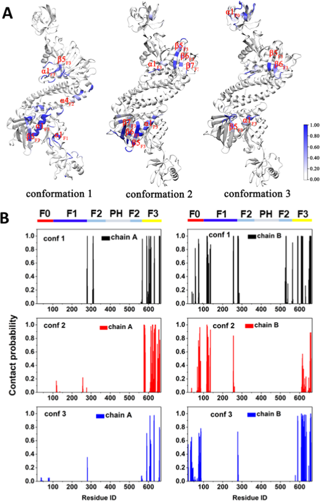
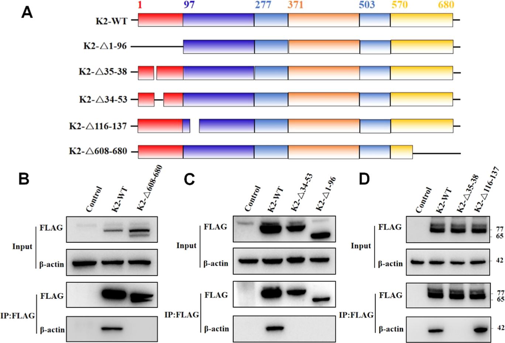

## 本文信息
- **标题**：二聚体Kindlin-2与F-肌动蛋白的结合模式：整合计算与实验研究
- **作者**：Xiuxiu Wang, Nan Yang, Jie Niu, Chenchen Wu, Shengtang Liu, Feng Wu, Lei Chang, Ruhong Zhou, Xuanyu Meng
- **发表时间**：2026年2月27日（J. Phys. Chem. B在线发表）
- **单位**：苏州大学放射医学与防护学院/放射医学与防护国家重点实验室、浙江大学定量生物中心（杭州）、复旦大学上海医学院放射医学研究所等
- **引用格式**：Wang X, Yang N, Niu J, et al. Binding Mode of Dimeric Kindlin-2 to F-Actin: An Integrated Computational and Experimental Study. *J Phys Chem B*. 2026. https://doi.org/10.1021/acs.jpcb.5c06999

---

## 摘要

> Kindlin-2是黏着斑中的关键蛋白，对整合素激活和肌动蛋白细胞骨架连接至关重要。然而，Kindlin-2与F-肌动蛋白直接相互作用的结构基础仍不清楚。作为FERM结构域家族成员，Kindlin-2包含F0-F3四个亚结构域，可能作为细胞骨架和膜结合的潜在界面。本文整合了**计算对接、分子动力学模拟、结合自由能计算和免疫共沉淀实验**，解析了Kindlin-2-肌动蛋白复合物的分子界面。研究发现，除了已知的F0结构域结合位点外，**F3结构域是一个之前未被识别的肌动蛋白结合位点**。F3结构域通过广泛的静电和疏水接触与肌动蛋白结合，其疏水残基与整合素β1胞质尾相互作用的残基重叠，表明F3是肌动蛋白和整合素的**共享对接枢纽**。通过结构域截断实验验证，确认了F3结构域的关键作用，排除了对接模型预测的其他界面。基于这些发现，我们提出了一个**不对称二聚体Kindlin-2-肌动蛋白复合物结构模型**，其中一个原聚体通过F0和F3结构域的协同作用形成相对稳定的肌动蛋白界面，另一个采用F0结构域未结合的更灵活构象，主要依赖F3结构域介导结合。这种不对称构型为Kindlin-2如何同时偶联整合素和肌动蛋白并协调黏着斑相关蛋白的招募提供了机制框架。

### 核心结论

- **F3结构域是关键的肌动蛋白结合位点**：除了已知的F0结构域外，F3结构域被识别为一个之前未被发现的肌动蛋白结合位点，通过广泛的静电和疏水接触与肌动蛋白结合
- **不对称二聚体模型**：二聚体Kindlin-2采用不对称构型与肌动蛋白结合，一个原聚体通过F0和F3结构域协同稳定结合肌动蛋白，另一个保持更灵活的构象以招募其他蛋白
- **F3结构域的双重角色**：F3结构域的疏水残基与整合素β1胞质尾相互作用的残基重叠，表明F3是肌动蛋白和整合素的共享对接枢纽
- **实验验证结合模式**：免疫共沉淀实验确认了F3结构域的关键作用，排除了对接模型预测的其他界面

---

## 背景

整合素是介导细胞-细胞外基质相互作用的双向信号转导受体，调控细胞黏附、迁移、增殖和存活。整合素激活需要talin和kindlin两类FERM结构域蛋白的协同作用，它们分别结合β整合素胞质尾的不同基序。Talin单独可以诱导整合素构象变化，但高效的激活和后续信号转导**关键依赖于kindlin的协同作用**。

Kindlin-2定位于黏着斑并与肌动蛋白纤维共定位。虽然Kindlin-2通过与整合素β尾的直接结合参与整合素激活已较为明确，但其与肌动蛋白的直接相互作用在体内是否稳定存在，还是依赖于额外的接头蛋白或特定细胞背景，目前仍不清楚。因此，**Kindlin-2如何协调整合素激活与肌动蛋白细胞骨架重塑的分子基础仍未完全理解**。

最近的结构研究表明，kindlin可以自组装成高级结构。Kindlin-3形成三聚体构象，空间上阻断F3结构域中的整合素结合口袋，提示一种自身抑制状态。相比之下，Kindlin-2采用F2结构域交换的二聚体构象，其中F0和F3亚结构域都保持暴露，**能够同时结合整合素和肌动蛋白丝**。功能分析表明，二聚体Kindlin-2通过促进talin激活的整合素聚集来增强整合素激活。这些发现提出了一个有趣的可能性：**二聚化不仅调控整合素信号，还可能调制肌动蛋白相互作用**，从而整合内向外和外向内信号通路。

### 关键科学问题

- Kindlin-2的二聚体形式如何与肌动蛋白丝结合？
- F0-F3哪些亚结构域**直接参与肌动蛋白结合**？
- Kindlin-2如何**同时协调整合素和肌动蛋白的结合**？

### 创新点

- **整合多尺度方法**：结合分子对接、全原子分子动力学模拟、结合自由能计算和免疫共沉淀实验，从计算预测到实验验证的完整工作流程
- **发现F3结构域新功能**：首次识别F3结构域为Kindlin-2的肌动蛋白结合位点，拓展了对FERM结构域功能的认知
- **提出不对称二聚体模型**：为Kindlin-2如何同时偶联整合素和肌动蛋白提供了结构机制框架

---

## 研究内容

### 研究方法：计算与实验的整合

本研究采用**多尺度整合策略**，结合计算模拟和实验验证来解析Kindlin-2与肌动蛋白的结合模式。

**计算模拟部分**包括：

| 方法 | 用途 | 关键参数 |
|------|------|----------|
| **分子对接** | 从Kindlin-2二聚体与肌动蛋白四聚体的全局构象搜索中识别潜在结合模式 | 使用ZDOCK 3.0.2和GRAMM-X v1.2.0进行刚性对接，获得30个候选构象 |
| **结构聚类分析** | 通过Cα RMSD分析将30个对接模型聚类成25个非冗余构象类别（RMSD cutoff = 1.5 nm） | 识别主要的构象家族并避免过度碎片化 |
| **静电互补性分析** | 使用APBS分析F0/F3正电荷区域与肌动蛋白负电荷表面的电荷互补性 | 验证静电相互作用对复合物形成的重要贡献 |
| **几何兼容性筛选** | 基于肌动蛋白丝纵向延长方向评估几何兼容性，**排除阻碍丝延长的构象后保留5个"可延长"构象** | 确保所选构象在生理上具有合理性 |
| **结合自由能排序** | 使用PDBePISA估算界面结合自由能，从5个可延长构象中筛选出3个代表性构象 | 构象1（ΔG = −8.4 kcal/mol）、构象2（ΔG = −8.6）、构象3（ΔG = −8.7） |
| **全原子MD模拟** | 在300 K和400 K下评估每个构象的稳定性，使用更长肌动蛋白丝（六聚体或八聚体）进行更真实的模拟 | 模拟时长100-300 ns，系统规模40万-80万原子 |
| **PMF计算** | 通过伞式采样和WHAM重构结合自由能剖面，量化二聚体Kindlin-2与四聚体肌动蛋白的结合强度 | 使用谐函数势约束，采样窗口间隔0.1 nm，每个窗口3 ns模拟 |

**实验验证部分**包括：

- 结构域截断策略：根据MD模拟的接触概率预测，设计Kindlin-2截断构建体
- 免疫共沉淀：在HeLa、HCT116和HEK293T细胞中验证**不同截断体与肌动蛋白的相互作用**
- 功能映射：通过系统性删除关键区域，精确定位**不可或缺的结合界面**

**图1**：对接分析识别Kindlin-2的F0和F3结构域中的潜在肌动蛋白结合位点。

- （A）卡通模型说明Kindlin-2和talin在整合素激活中的协同作用，图中显示**整合素（蓝色）**、**肌动蛋白丝（绿色）**、talin（橙色）和Kindlin-2（红色/粉色）
- （B）结合计算建模和实验验证的工作流程，用于筛选和分类候选Kindlin-2-肌动蛋白构象
- （C）对接模拟获得的25个独特Kindlin-2-肌动蛋白复合物构象的结构模型，显示**F0结构域（红色）或F3结构域（黄色）直接与肌动蛋白（绿色）相互作用**，大多数构象表现为两个结构域同时参与结合，蓝色应该可能是F1和F2结构域

### MD模拟与PMF计算：构象稳定性评估

为了评估预测的Kindlin-2-肌动蛋白复合物的稳定性和结合强度，研究对三个候选构象进行了无偏置全原子MD模拟。每个复合物在300 K下模拟，随后在400 K下测试热应力下的稳定性。**所有三个复合物都保持稳定结合而没有解离**，表明存在稳健的界面。

为了在更真实的肌动蛋白丝条件下检查结合，研究使用更长的肌动蛋白丝进行了扩展MD模拟。对于每种构象，在300 K下进行了300 ns模拟，将原始的四聚体肌动蛋白延伸为六聚体或八聚体，以更好代表F-肌动蛋白的纤维性质，**避免短丝模型带来的几何偏差**。

**图2**：平均力势（PMF）计算评估二聚体Kindlin-2与四聚体肌动蛋白的结合能。统计误差通过自助法估计。插图显示用于PMF拉伸的初始模型，**肌动蛋白为绿色，Kindlin-2为灰色**。

PMF计算的关键发现：

- 构象1和构象3结合更强：构象1和构象3都显示出比构象2更深的自由能最低点，提示二者都可能代表**有生物学意义的结合状态**
- 构象2相对较弱：虽然构象2和构象3都采用平行结合取向，但**构象2的结合明显更弱**
- 能量势垒：解离路径上的能垒反映了**复合物的动力学稳定性**

### 残基水平接触分析：F3结构域的核心作用

接触概率映射揭示了保守性和构象特异性相互作用基序。在所有模拟中，**F3结构域（残基608-660）成为主导且持久的肌动蛋白结合界面**。关键区域包括β5F3、β6F3、β7F3和α1F3，它们与肌动蛋白形成高占据率接触，**强调了F3在识别中的核心作用**。

**图3**：Kindlin-2-肌动蛋白复合物构象的残基水平接触概率分析。

- （A）基于MD模拟期间接触频率计算的残基接触概率，并映射到三个候选构象的结构模型上。使用从白色（低接触概率）到蓝色（高接触概率）的颜色梯度来可视化Kindlin-2上的**相互作用热点**
- （B）直方图总结了三个构象中每个残基的接触概率值，说明了**接触的频率和分布**

三个构象的相互作用模式：

| 构象 | 主要相互作用区域 | 特征 |
|------|----------------|------|
| **构象1** | 两个原聚体的β5F3和α1F3 | 占总接触面积的80%以上 |
| **构象2** | β5F3、β6F3、β7F3和α1F3 | 补充瞬态β4F0-β5F0环 |
| **构象3** | β5F3、β6F3和α1F3 | 伴随稳定的F0相互作用，包括β4F0-β5F0环 |

值得注意的是，构象3中的L46/K47残基（α1F0）之前被证实参与细胞铺展和肌动蛋白组织，在模拟中也**直接参与了结合界面的形成**。

### 免疫共沉淀验证：确认F3结构域的关键作用

为了验证这些预测的界面，研究采用了逐步截断策略。删除F3结构域（Δ608-680）**完全消除了**β-肌动蛋白的免疫共沉淀，而全长Kindlin-2强烈富集肌动蛋白，**确认F3为不可或缺的肌动蛋白结合模块**。

**图4**：免疫共沉淀实验验证预测的Kindlin-2-肌动蛋白结合构象。

- （A）根据每个候选构象的接触概率设计的Kindlin-2截断构建体的示意图
- （B-D）显示不同Kindlin-2截断构建体与肌动蛋白相互作用的**免疫共沉淀结果**

实验验证的关键发现：

| 截断体 | 目标区域 | 结果 | 结论 |
|--------|---------|------|------|
| **Δ608-680** | 整个F3结构域 | **完全丧失结合** | F3是必需的结合模块 |
| **Δ34-53** | 构象3特异的F0界面 | **完全丧失结合** | F0的某些区域也参与结合 |
| **Δ35-38** | F0关键残基（>**80**%接触概率） | **完全丧失结合** | 这4个残基是关键决定因素 |
| **Δ116-137** | 构象1/2预测的F0界面 | **无影响** | 排除构象1/2的正确性 |

这些结果表明，虽然PMF支持构象1和构象3都具有可行性，但结合F0截短验证后，**构象3获得了最强的实验支持**，同时排除了替代的对接预测界面。

### 不对称二聚体模型：Kindlin-2的双重角色机制

整合计算和实验结果，研究提出了一个**不对称二聚体Kindlin-2-肌动蛋白复合物结构模型**。

在这个模型中：
- 一个原聚体通过F0和F3结构域的协同作用与肌动蛋白形成**相对稳定界面**，负责锚定肌动蛋白细胞骨架
- 另一个原聚体采用F0结构域未结合的更灵活构象，主要依赖F3结构域介导**更瞬态的接触**，可以自由招募整合素或其他黏着斑相关蛋白

这种不对称构型为Kindlin-2如何**同时偶联整合素和肌动蛋白**并协调黏着斑复合物的组装提供了机制框架。F3结构域成为Kindlin介导的整合素-肌动蛋白偶联的**中心元件**，在黏着信号转导中具有广泛意义。

F3结构域的疏水残基与整合素β1胞质尾相互作用的残基重叠，表明F3是肌动蛋白和整合素的**共享对接枢纽**。这可能解释了Kindlin-2如何在整合素激活和肌动蛋白组织之间**发挥协调作用**。

---

## Q&A

- **Q1**：为什么F3结构域是肌动蛋白和整合素的共享结合位点？
- **A1**：F3结构域的疏水残基与整合素β1胞质尾相互作用的残基重叠，这种序列和结构上的重叠使得F3能够同时结合两种配体。从功能角度看，这种设计可能使得Kindlin-2能够**在整合素激活和肌动蛋白组织之间进行快速切换**，而不是需要完全解离一个配体才能结合另一个。

- **Q2**：不对称二聚体模型有什么生物学优势？
- **A2**：不对称构型使得Kindlin-2二聚体能够**同时执行多个功能**。一个原聚体稳定锚定肌动蛋白，维持细胞骨架连接；另一个原聚体保持灵活，可以招募整合素或其他信号分子。这种分工合作提高了信号转导的效率，也可能使得Kindlin-2能够作为**分子枢纽协调多个黏着斑组分**的组装和动态重组。

- **Q3**：为什么构象3是最合理的结合模式？
- **A3**：三个方面的证据支持构象3：一是PMF计算显示构象1和3都比构象2结合更强，因此构象3至少在能量学上是可行的；二是MD模拟显示构象3中F3和F0都形成稳定接触；三是免疫共沉淀实验同时验证了F3和F0，尤其是35-38残基的重要性。相比之下，构象1和2预测的F0界面（116-137残基）截断后不影响结合，因此**最终是实验验证而不是PMF单独决定了构象3更可信**。

---

## 关键结论与批判性总结

本研究通过整合计算对接、分子动力学模拟、结合自由能计算和免疫共沉淀实验，揭示了Kindlin-2与肌动蛋白直接相互作用的结构基础，**特别凸显了F3结构域的关键作用**。

### 主要贡献

- 发现F3结构域的肌动蛋白结合功能：研究揭示了**F3结构域是Kindlin-2之前未被识别的肌动蛋白结合位点**，通过静电和疏水相互作用网络与F-肌动蛋白结合，拓展了对Kindlin如何连接整合素与肌动蛋白细胞骨架的当前理解
- 识别共享对接枢纽：介导F-肌动蛋白结合的F3结构域疏水残基与已知识别整合素β1胞质尾的残基相同，将F3定位为**可能协调肌动蛋白和整合素相互作用的中央对接枢纽**
- 提出不对称二聚体模型：通过整合结构预测与生化验证，提出了二聚体Kindlin-2-F-肌动蛋白复合物模型，其中一个原聚体通过F0和F3结构域的协调贡献（主要由疏水相互作用主导）形成**相对稳定的肌动蛋白界面**，第二个原聚体采用更灵活的构象（主要由涉及F3结构域的静电相互作用介导，F0结构域未结合）
- 揭示结构基础：这种不对称构型为Kindlin-2在连接整合素与肌动蛋白丝的双重功能同时保留**招募额外黏着斑相关蛋白的能力**提供了合理的结构基础

### 研究的局限性

原文结论部分未明确讨论研究的局限性。根据研究内容可以推断：

- 体外系统的限制：虽然研究整合了计算模拟和实验验证，但体外免疫共沉淀实验可能无法完全复制**细胞内复杂环境和动态调节**
- 时间尺度限制：MD模拟达到数百纳秒，但对于蛋白质复合物在细胞内的组装和功能调控可能涉及**更长的时间尺度过程**
- 构象选择的限制：虽然从25个对接构象中筛选出3个代表性模型进行详细研究，但可能存在**其他未被充分探索的结合模式**

### 未来研究方向

- 更高阶组装体研究：需要进一步研究F3结构域如何在更高阶黏着斑组装体内协调与整合素和肌动蛋白的相互作用，这对于描绘**整合素激活和细胞骨架组织的动态调控**至关重要
- 动态调控机制：需要深入研究**不对称二聚体构象在细胞内的动态转换**及其在黏着斑组装和信号转导中的功能意义
- 与其他黏着斑蛋白的相互作用：需要探索Kindlin-2如何通过其灵活的原聚体**招募和协调其他黏着斑相关蛋白的组装**
