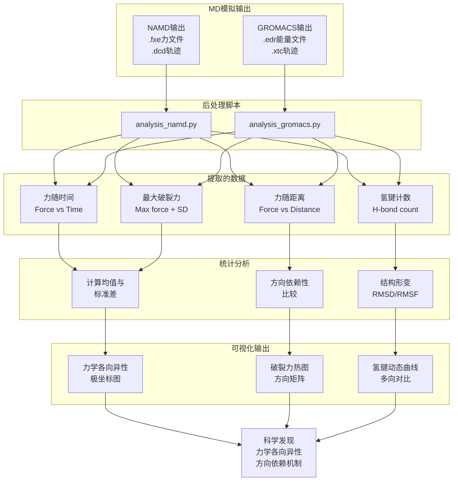
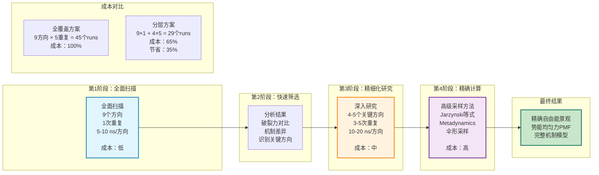

# multiSMD工具附录：技术细节、案例研究与计算成本

## 技术实现细节

### multiSMD程序结构

multiSMD由两个主程序组成：

1. **multismd_namd.py**：为NAMD生成SMD输入文件
2. **multismd_gromacs.py**：为GROMACS生成SMD输入文件

两个程序的工作流程相同：

1. **读入PDB结构**：解析蛋白质复合物的原子坐标
2. **计算牵引向量**：计算固定蛋白质与被拉蛋白质的质心，连线作为主轴
3. **生成方向集合**：在球面坐标系中以指定的角度采样。默认设置在 theta 坐标中包含 3 个角度（0°、45°、90°），在 phi 坐标中包含 4 个角度（0°、90°、180°、270°）。由于球面坐标的几何性质，当 θ=0° 或 θ=90° 时，所有的 φ 值都指向同一点（分别为北极和赤道），因此实际产生的独立方向为：1（θ=0°）+ 4（θ=45°）+ 1（θ=90°）= **9 个方向**，有效覆盖一个选定的半球
4. **参数化方向**：用theta和phi角度参数化每个拉伸向量
5. **生成输入文件**：为每个方向创建独立的目录，包含MD参数文件（.conf或.mdp）、拓扑文件和bash脚本
6. **可视化**：生成Tcl脚本，在VMD中展示所有拉伸向量的空间分布

### 后处理分析脚本

两个分析脚本随之提供：

- **analysis_namd.py**：处理NAMD输出文件（.fxe文件）
- **analysis_gromacs.py**：处理GROMACS输出（.xtc轨迹和能量数据）

**提取的关键数据**：
1. 拉伸力随时间的演化（Force vs. Time）
2. 力与两个定义原子组质心距离的关系（Force vs. Distance）
3. 拉伸过程中氢键数目的时间依赖性（H-bond count vs. Time）
4. 最大破裂力的统计（均值±标准差，来自多个重复）

使用MDAnalysis库分析轨迹，Matplotlib绘图。

### 数据分析与可视化工作流

---

## 案例研究II：Kir6.1与Kir6.2通道的ATP解离机制对比

### 背景

内向整流钾通道（Kir6.x）是ATP敏感钾通道（KATP）的孔形成亚基。这些通道通过感应细胞ATP/ADP比例来调控钾离子流和膜兴奋性，是葡萄糖稳态和胰岛素分泌的关键调节器。

Kir6.1和Kir6.2是两种主要亚型，尽管序列和结构相似度高，但它们对ATP的敏感性存在显著差异。ATP结合位点高度保守（cryo-EM结构6C3P和7MIT确认），但对ATP的回应差异提示存在微妙的机制差异。一个关键的序列变异是R195（Kir6.1）vs. K185（Kir6.2）的替换——两者都带正电荷，都对ATP结合至关重要，但可能对ATP结合力学的影响不同。

### 方法

**系统构建**：
- Kir6.1（PDB: 7MIT）和Kir6.2（PDB: 6C3P）的闭态同源体，各含4个ATP分子
- CHARMM-GUI准备，ATP分子放置在结合口袋（用Schrödinger准备向导优化）
- 不对称脂双分子层嵌入：外侧100% POPC，内侧90% POPC + 10% SAPI24（100 × 100 Å）
- CHARMM36m力场

**预平衡**：
- GROMACS 2020中进行
- 能量最小化 → 7步平衡 → 3个独立的250 ns生产运行（NPT系综）
- Nosé-Hoover恒温器，Parrinello-Rahman等压器

**SMD模拟**：
- 从最后一帧作为起始结构
- NVT系综（Nosé-Hoover恒温器）
- 恒定拉伸速度：$v_{pull} = 0.0005 \, \mathrm{nm/ps}$
- 3个独立重复，3个拉伸方向
- 在ATP完全解离之前进行

### 主要结果

**图S1：Kir6.1/Kir6.2的方向依赖ATP解离**

|  | 方向② | 方向③ |
|---|---|---|
| **Kir6.1最大力（pN）** | ~250 ± 50 | ~350 ± 60 |
| **Kir6.2最大力（pN）** | ~260 ± 40 | ~230 ± 50 |
| **力的比值（K6.1/K6.2）** | ~1.0 | ~1.5 |

方向③呈现出最显著的亚型差异：Kir6.1需要约1.5倍更大的力来解离ATP。这与ATP结合位点的空间分布一致——R195/K185替换位点在方向③恰好处于拉伸方向的对齐位置。

**机制分析**：
- R195（Kir6.1）的长侧链与ATP三磷酸基团形成更强的静电相互作用
- K185（Kir6.2）虽然也带正电，但侧链较短，静电势场覆盖范围较小
- 方向③的拉伸直接应用于这两个残基，最大程度激活了它们的静电相互作用差异
- 方向②则几乎垂直于R195/K185轴，因此两亚型差异最小

**限制**：
虽然该结果提示Kir6.1可能有更强的ATP结合，但实际的ATP敏感性不仅由Kir6亚基决定，还受到：
- SUR（磺脲受体）亚基的相互作用
- Mg-核苷酸的调制
- PIP2的调节效应
- NBD二聚化状态变化

在完整的KATP通道复合物中，这些因素会修饰甚至反转ATP敏感性的差异。因此，multiSMD的结果提供了**局部的、孤立条件下的力学洞察**，但需结合全长系统的模拟才能完全理解生理相关性。

---

## 案例研究III：KNt从SUR2B口袋中的解离机制

### 背景与科学问题

血管KATP通道（Kir6.1/SUR2B）的关闭与Kir6.1的N末端（KNt，26个残基）插入SUR2B远端口袋的现象密切相关。在闭态通道的cryo-EM结构中（PDB: 7MJP），可以观察到电子密度对应于KNt及其与SUR2B的相互作用。而在开态结构中，当SUR的核苷酸结合域（NBD）发生二聚化时，KNt从口袋中消失。

这提示存在一个**生理相关的KNt进出过程**。关键问题是：KNt作为本征无序区域，缺乏确定的口袋外位置，它应如何最有效地离开？是否存在特定的释放通道？多方向SMD能否识别出这些通道？

### 方法

**系统构建**：
- SUR2B与Kir6.1-Nt（26个残基，红色标记）复合物，基于PDB 7MJP
- 嵌入POPC膜，CHARMM-GUI溶剂化（135 × 135 × 160 Å）
- 能量最小化 + 平衡（GROMACS，NPT系综）
- 两种条件：
  1. **无配体**：单纯的KNt-SUR2B相互作用
  2. **含glibenclamide**：一种磺脲类药物，稳定KNt并促进通道闭合

**SMD拉伸方向**：
- 二维拉伸向量（方向①和②）
- 拉伸位点：KNt的近端部分（残基20-22）
- 目标：评估两个方向的解离阻力，识别更容易的离开通道

### 主要结果

**图S2：KNt从SUR2B口袋的多方向释放**

#### 无配体条件

- **方向①（垂直拉伸）**：
  - 初期需克服~400 pN的力（E1196-K24和E1173-R23盐桥断裂）
  - 这些静电相互作用垂直于拉伸方向，难以有效破坏
  - 随着KNt逐渐离开口袋，力逐渐下降

- **方向②（水平拉伸）**：
  - 初期阻力较小（~100-150 pN）
  - 力沿着E1196-K24/E1173-R23相互作用的轴向，更高效地破坏静电相互作用
  - KNt远端部分（残基1-10）从口袋离开时力陡增（~300-400 pN）

**推论**：方向②提供了一条更容易的离开通道，至少在初期。

#### 含glibenclamide条件

- 在两个方向上，glibenclamide的存在都稍微增加了所需的力（特别是方向②）
- 这与glibenclamide支持闭态、稳定KNt位置的生物学角色相符
- 但即使在glibenclamide存在下，方向②仍比方向①更容易

#### KNt-SUR2B接触频率分析

补充图S2b和S2c呈现了KNt各残基与SUR2B的接触频率热图。关键观察：
- E1196和E1173是KNt结合的主要锚点
- K24和R23是KNt上的关键正电残基
- 在无配体条件下接触频率最高（>0.8）
- glibenclamide存在时，接触频率略有增加，表明复合物稳定性增强

### 生物学意义与限制

**意义**：
- **multiSMD成功识别了出口通道的各向异性**：KNt更容易沿水平方向离开口袋
- **这与通道开合循环的假说相符**：NBD二聚化可能改变口袋的空间构象，使KNt易于沿有利方向逃逸
- **提示了理性药物设计的新思路**：调节KNt与SUR2B的相互作用强度来控制通道状态

**限制**：
- 当前的短SMD（几纳秒）可能低估了复杂的水和离子的作用
- 缺少精确的势能均匀力（PMF）表征；需要使用umbrella sampling或metadynamics进行后续验证
- IDR的本质灵活性意味着"口袋"和"外部"的边界模糊；严格的PMF定义困难
- 全长KATP通道复合物（包含完整的NBD二聚体）的效应尚未探索

---

## 计算成本与资源优化

多方向SMD的计算成本与以下因素线性相关：
- **系统大小**（原子数）
- **模拟方向数**（通常9-16）
- **每个方向的重复数**（通常3-5）
- **每个重复的模拟时长**（通常5-20 ns）

### 实际成本估算

#### 案例I：SARS-CoV-2 S-RBD:ACE2复合物

- 系统规模：~80,000原子
- MD引擎：NAMD 2.14
- 硬件：LUMI超算（CSC, Finland）
- **每个重复的成本**：10 ns SMD需~38.8 CPU小时（墙钟时间38.8小时单核）
- **总成本**：9方向 × 5重复 × 2变体（WT + MUT）= 90个10-ns runs
  - 90 × 38.8 CPU h = 3,492 CPU小时
  - 在LUMI的256核节点上，约需13-15小时墙钟时间

#### 案例II & III：Kir6.1/ATP与SUR2B/KNt系统

- 系统规模：~272,000-304,000原子
- MD引擎：GROMACS 2020
- 硬件：OKEANOS超算（波兰ICM）
- **配置**：5个节点，总计120个CPU核（每节点24核）
- **每个重复的成本**：~1,837 CPU小时，墙钟时间~7.65小时
- **典型研究的成本**：2-3个方向 × 3重复 = 6-9个runs
  - ~11,000-16,500 CPU小时
  - 在120核配置下墙钟时间约为~10-15小时

### 优化策略

为使多方向SMD研究在有限的计算资源下可行，推荐以下策略：

#### 1. 分层筛选策略

这种分层方法大幅削减总成本：例如从9方向×5重复全覆盖，降低至初筛9×1+深入4×5 = 29个runs，成本约为原来的65%（节省35%）。

#### 2. 参数优化

| 参数 | 原始 | 优化 | 影响 |
|---|---|---|---|
| 拉伸速度（nm/ps） | 0.0005 | 0.001-0.002 | 模拟时间↓50%，力值↑但相对差异保持 |
| 模拟时长（ns/方向） | 10-20 | 5-10 | 成本↓50%，仍可捕捉破裂事件 |
| 重复数 | 5 | 3 | 统计精度↓，成本↓40% |
| 系统大小 | 完整复合物 | 界面片段 | 成本↓70%，但可能遗漏远程作用 |

#### 3. 高通量并行执行

multiSMD的最大优势：**所有方向的模拟相互独立**，可在HPC集群上完全并行。
- 9个方向可同时提交，总墙钟时间仅为单个方向所需时间
- 在具有数千核的超算上，整个多方向研究可在24-48小时内完成

#### 4. 系统大小选择

- **完整系统**（全长蛋白+水+离子）：100,000-300,000原子，cost: 高
- **最小相关系统**（仅交互界面+薄水层）：30,000-80,000原子，cost: 低-中，推荐用于初筛

在我们的SARS-CoV-2案例中，使用截断的界面片段而非全长RBD和ACE2，将成本从~10,000 CPU h降至~3,500 CPU h，同时仍保留了关键的相互作用信息。

#### 5. 后处理数据管理

多方向研究生成大量轨迹数据。建议：
- 仅保留关键帧和分析数据，删除原始轨迹（每个方向节省数GB空间）
- 使用multiSMD的分析脚本直接提取统计量，避免重复分析
- 利用并行化的数据处理脚本（如使用Python多进程）加速后处理

---

## 补充分析与数据

### 氢键动态的定量分析

在所有三个案例中，监测拉伸过程中的氢键破裂是理解相互作用机制的关键。multiSMD通过MDAnalysis库自动识别满足以下标准的氢键：

- 供体-受体距离 < 3.5 Å
- 角度标准（供体-H-受体）< 30°

**SARS-CoV-2案例中的定量**（图2d）：
- **野生型，初始**：~35-40条氢键（不同方向变异小）
- **拉伸后**（10 ns）：~5-15条（取决于方向）
- **破裂速率**：最快方向（方向②）在前2 ns内破裂>80%的氢键；最慢方向（方向⑦）在整个10 ns过程中仅破裂~60%

这种方向依赖的破裂动力学直接反映了相互作用的各向异性：某些方向直接对齐主要氢键，快速破坏；其他方向则需通过复杂的蛋白质变形间接破坏。

### Force vs. Distance曲线的解释

multiSMD生成的Force vs. Distance曲线（中间列，图S3）提供了额外的机制洞察：

- **单峰曲线**：表现为一个明显的力最大值，提示单个主要的能垒
- **多峰曲线**：多个力峰，表明逐步的相互作用破裂（例如分层的氢键网络）
- **曲线宽度**：反映了相互作用强度的分布；窄曲线提示相互作用集中，宽曲线提示分散

在Kir6.1/ATP案例中（S1 b,d）：
- 方向②的力随距离曲线形状宽且平缓，提示ATP离开过程经历多个小能垒
- 方向③的曲线更尖锐，提示一个主导的破裂事件（R195-ATP相互作用的破裂）

这些曲线的微观特征可与自由能景观相关联，为后续的metadynamics等精细方法提供初步预测。

### 氨基酸贡献分析（残基接触频率热图）

图S6呈现的残基接触频率热图揭示了每个氨基酸对相互作用的贡献：

**Kir6.1 ATP结合位点关键残基**（接触频率 > 0.8）：
- R51, R195, L215, Y339, N48, I51, F342等

**Kir6.2对应残基**：
- R50, K185, L204, Y330, N49, I49, F333等（位置略微不同）

虽然总体布局相似，但R195（K6.1）vs. K185（K6.2）的位置细微差异和相对朝向的不同，造就了ATP解离力的方向依赖差异。这一分析为设计选择性KATP通道抑制剂提供了药物设计线索。

---

## 应用前景与参考资源

multiSMD已被应用于以下领域的研究：

1. **蛋白质相互作用工程**：改进蛋白质-蛋白质相互作用的方向特异性稳定性
2. **药物设计**：评估小分子抑制剂的方向依赖解离，筛选候选药物
3. **生物材料**：设计机械强度各向异性的生物聚合物和支架
4. **基础生物物理**：理解内在无序蛋白质、信号蛋白和膜蛋白的力学特征

使用multiSMD的研究者可访问GitHub仓库获取代码、文档和使用示例：
- **主仓库**：https://github.com/kszewc/multiSMD
- **许可证**：Apache 2.0（自由商业与非商业使用）
- **联系方式**：kszewc@umk.pl
