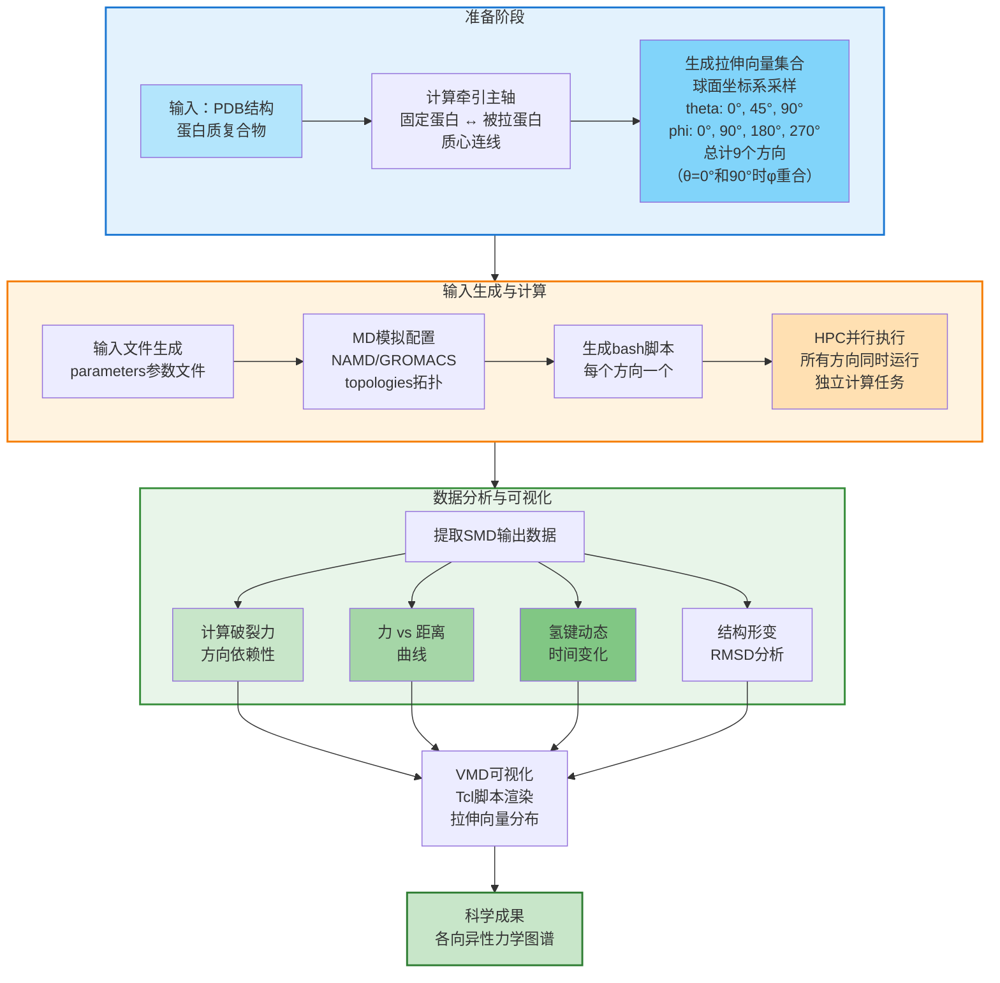
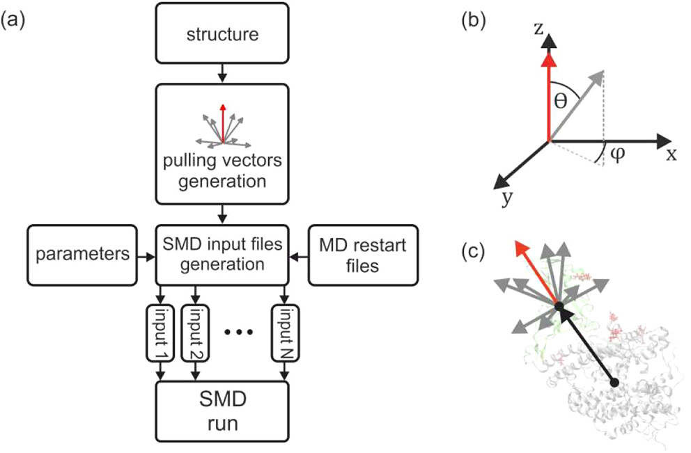
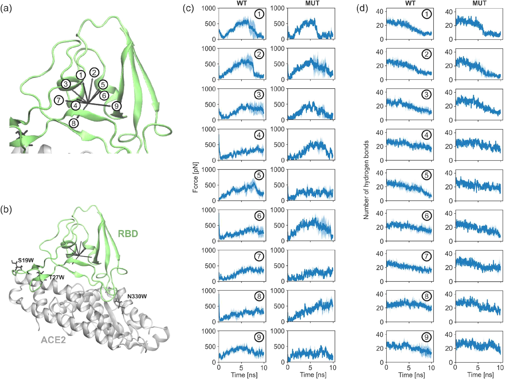
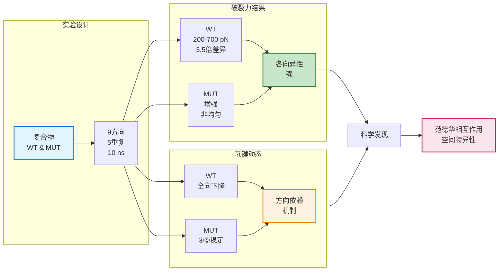

# 多方向牵引分子动力学新利器：以各向异性视角探测生物大分子力学

## 本文信息
- **标题**：multiSMD——多方向牵引分子动力学Python工具集
- **作者**：Katarzyna Walczewska-Szewc、Beata Niklas、Kamil Szewc、Wiesław Nowak
- 发表时间：2025年10月2日
- **单位**：Nicolaus Copernicus University（波兰托伦）、ESS Engineering Software Steyr GmbH（奥地利）
- **引用格式**：Walczewska-Szewc, K., Niklas, B., Szewc, K., & Nowak, W. (2025). multiSMD – A Python toolset for multidirectional steered molecular dynamics. *Journal of Chemical Information and Modeling*, 65(23), 10803–10807. https://doi.org/10.1021/acs.jcim.5c01742
- **源代码**：GitHub: https://github.com/kszewc/multiSMD（Apache 2.0许可证）

## 摘要
> 分子力主导着从细胞力学到分子识别事件等所有生物过程。传统的单向牵引分子动力学（SMD）模拟难以捕捉生物大分子的各向异性力学响应。本研究开发了**multiSMD工具**，通过自动化多方向力学探测，在NAMD和GROMACS中系统地沿多个空间向量探测外力效应，揭示隐藏于单轴方法中的方向依赖现象，如变化的能垒和结构韧性。通过SARS-CoV-2 S蛋白-ACE2复合物、钾通道ATP解离和本征无序区域力诱导重塑等案例，展示了该方法在探测生物大分子纳米力学各向异性中的实用价值。

### 核心结论

- **multiSMD自动化工作流**：系统生成多方向SMD输入文件并简化数据后处理，降低操作复杂度
- **揭示力学各向异性**：发现传统单向拉伸遗漏的方向依赖现象，如SARS-CoV-2突变体在特定方向的选择性增强稳定性
- **实验指导作用**：为AFM、光镊等单分子力谱实验提前筛选关键力学方向，优化实验设计
- **工具多样性**：支持不同生物体系（蛋白-蛋白、蛋白-配体、本征无序区域），展现广泛适用性

## 背景

分子力在调控生物功能中发挥着基础性作用，从质子泵的运行到信号转导无一不涉及。这些力源于静电作用、范德华力、氢键和疏水效应等分子相互作用，而其时间演化和方向特异性对理解生物体系中的力学行为至关重要。然而，生物大分子往往因其非球形的复杂结构而展现出**各向异性的力学响应**——即机械和动力学性质随外力施加方向变化而变化。单分子力谱技术（如AFM和光镊）虽然能够直接测量piconewton尺度的力，但面临样品制备困难、单分子识别困难和非特异性相互作用干扰等挑战，限制了其高通量应用。

相比之下，分子动力学（MD）模拟作为一种补充方法，提供了原子分辨率的计算显微镜功能。在牵引分子动力学（SMD）中，沿预选坐标施加时间依赖的外力以加速自由能景观中的转变，使得研究通常不可达的时间尺度的生物过程成为可能。然而，**传统SMD仅沿单一方向探测分子力**，可能遗漏了各向异性力学响应中的关键信息——不同的拉伸方向可能导致截然不同的破裂力、解离路径或结构变形机制。

## 关键科学问题

为什么需要多方向力学探测？答案在于生物体系固有的各向异性。考虑一个蛋白质复合物：拉伸不同的界面位点或沿不同的力方向可能会激活完全不同的解离机制。例如，在SARS-CoV-2 S蛋白-ACE2复合物中，增强结合亲和力的突变可能只沿特定方向强化相互作用，这种方向偏好性在单向拉伸实验中容易被忽视。类似地，内含本征无序区域（IDR）的蛋白质复合物，其无序尾部的解离机制极度依赖于拉伸方向——不同方向可能导致截然不同的出口通道。

**多方向SMD的核心科学问题**在于：单个分子复合物对外力的响应是否在所有方向上均匀？答案是否定的。通过系统地从多个角度探测分子力，我们能够绘制**力学景观的各向异性图谱**，揭示隐藏的转变态、方向特异的解离路径和结构失稳机制。

## 创新点

- **自动化工作流系统**：Python脚本自动生成球面坐标系中的多个拉伸方向，用户可灵活调整采样密度（默认9个方向）
- **双引擎兼容性**：支持NAMD和GROMACS两个主流MD引擎，提高工具的通用性和可达性
- **集成分析工具**：配套的分析脚本（analysis_namd.py、analysis_gromacs.py）自动提取力随时间、力随距离、氢键动态等关键数据
- **各向异性可视化**：生成Tcl脚本供VMD使用，直观展示所有拉伸方向的空间分布
- **开源与可用性**：Apache 2.0许可证，托管于GitHub，面向专家和非专家用户

---

## 研究内容

### multiSMD工作原理

multiSMD的核心工作流如下：

这种系统的多向探测方法一次性扫描**整个力学空间**，而不是依赖于单一的预选方向，从而大幅降低了遗漏关键现象的风险。

### 案例研究I：SARS-CoV-2 S蛋白-ACE2复合物的各向异性解离

**图1：SARS-CoV-2 S蛋白RBD-ACE2复合物的多方向破裂力分析**

研究人员将multiSMD应用于SARS-CoV-2 S蛋白受体结合域（RBD）与人ACE2受体的相互作用。该复合物在COVID-19感染过程中起关键作用，理解其力学特性对药物设计具有指导意义。

方法设定：从平衡MD轨迹中提取复合物界面的动态稳定片段，进行0.25μs经典MD预平衡，随后沿9个不同方向进行10ns的SMD拉伸（5个独立重复）。同时引入已知增强结合的三个ACE2突变体（S19W、T27W、N330Y），对比野生型与突变体。

**关键结果**：

**图2：SARS-CoV-2 S蛋白-ACE2复合物的多方向破裂力和氢键分析**

关键观察：

1. **野生型复合物**：沿所有拉伸方向均观察到氢键数目的显著下降。破裂力在不同方向间波动，最大约700 pN，最小约200 pN——**相同复合物、不同拉伸方向、破裂力存在显著差异**（最大与最小相差3.5倍）。

2. **ACE2突变体**：令人惊讶的是，突变体在某些特定方向上才增强稳定性。例如，在方向④和⑤上，突变体氢键数在拉伸初期保持稳定，与野生型的迅速下降形成对比。破裂力在大多数方向上都有所增加，但增幅不均一——某些方向增加**50**%以上，某些方向则无显著改变。

3. **机制推断**：三个突变位点引入的芳香侧链（W19、W27、Y330）通过范德华相互作用增强了相互作用，但这种增强在**空间上是各向异性的**，与相互作用位点的几何位置密切相关。

这个案例直接证明了：**单向拉伸实验可能错过相互作用的方向特异性强化，多方向探测是全面理解蛋白质相互作用各向异性的必要条件**。

### 案例研究II与III概述

**案例II：Kir6.1与Kir6.2通道的ATP解离机制**（详见附录）分析了两个ATP敏感钾通道亚型对配体的方向依赖性响应。结果显示Kir6.1沿特定方向（方向③）需要**更大的力**（约1.5倍）才能释放ATP，这归因于R195/K185氨基酸替换导致的静电相互作用差异。

**案例III：KNt从SUR2B口袋释放**（详见附录）展示了本征无序区域（IDR）的出口机制如何高度依赖于拉伸方向。两个测试方向需要的力差异巨大（初期~400 pN vs. 初期~100 pN），体现了IDR路径依赖性释放的机制。

这两个案例进一步证明了**multiSMD方法的跨领域适用性**——从蛋白质-蛋白质相互作用、到小分子配体解离、再到无序区域力学，都能揭示隐藏的各向异性。

### 与实验的联系：指导AFM与光镊研究

multiSMD的一个重要实用价值在于**提前筛选关键拉伸方向**。AFM和光镊实验成本高、耗时长，往往只能探测少数几个预选方向。通过multiSMD的快速计算筛选，研究人员可以：

1. 识别出最有趣的拉伸方向（如破裂力最大的方向、机制差异最大的方向）
2. 预测方向依赖的力学特性，指导实验设计
3. 解释实验中观察到的异常现象（如为什么某个方向的拉伸力异常高？）

---

## Q&A

- **Q1：为什么不直接用自由能方法（如伞形采样）计算所有方向的PMF？**
- **A1**：自由能方法虽然精确，但计算成本高达**数百**个CPU小时/个方向。multiSMD采用**快速筛选策略**——先用5-20 ns的短SMD模拟扫描所有方向，识别有趣的方向后再用元动力学（metadynamics）等精细方法深入研究。这样既节省资源又保证科学质量。

- **Q2：SMD拉伸速度对结果的影响有多大？**
- **A2**：拉伸速度会影响绝对力值（速度越快，力越大），但不同方向间的相对差异通常保持稳定。multiSMD主要关注**各向异性**——即方向间的力学差异，因此适度的速度变化（如从0.0005改为0.001 nm/ps）**不会改变定性结论**，仅影响定量力值。

- **Q3：本征无序区域（IDRs）为什么特别适合多方向探测？**
- **A3**：IDR缺乏固定的三维结构，其在口袋外的确切位置不确定。这意味着不存在自然的逆向拉伸方向。多方向SMD能**系统地探测所有可能的出口通道**，识别出最低能障的释放路径，这对理解IDR的生物学功能至关重要。

- **Q4：multiSMD能否用于预测药物结合的方向依赖性？**
- **A4**：可以。通过对蛋白-配体复合物进行多方向SMD，可以绘制不同拉伸方向的**破裂力图谱**。破裂力与结合亲和力相关，这种各向异性图谱可用于鉴别抑制剂候选物的相对效力。结合Jarzynski等式可进一步估算自由能。

- **Q5：多方向SMD的计算成本如何？是否可行？**
- **A5**：详见附录。对于~80,000原子的复合物，每个方向的10 ns SMD需约38.8 CPU小时。9个方向×5重复×2变体=约3,500 CPU小时，在现代**HPC集群上可并行执行**，总墙钟时间仅需数小时。**成本是可管理的**，尤其当作为实验前期筛选工具时。

---

## 关键结论与批判性总结

### 主要贡献

- **工具创新**：multiSMD填补了现有工具的空白，提供了**首个用户友好的多方向SMD自动化框架**，大幅**降低了使用门槛**。
- **科学发现**：三个案例研究**清晰地证明了生物大分子对外力的各向异性响应**，突出了单向方法的局限性。
- **应用前景**：**特别适合指导单分子力谱实验**、药物设计中的结合亲和力评估、以及力敏感蛋白质的力学特征化。

### 局限性与未来方向

- **当前局限**：
  - 所有案例均基于非平衡SMD，力值受拉伸速度影响；需结合平衡方法（如Jarzynski等式）才能获得真实自由能
  - 分子系统大小限制（~80,000-300,000原子）；超大复合物（如完整病毒颗粒）仍不可达
  - 本征无序区域的非平衡特性可能导致力值被大幅高估；需metadynamics等精细采样确认
  - SARS-CoV-2案例仅分析了截断的界面片段，缺少全长蛋白质的等位效应分析

- **未来发展**：
  - 整合Jarzynski等式、metadynamics等高级采样方法，从力学数据精确估算自由能景观
  - 扩展至膜蛋白、大型蛋白质复合物、甚至病毒颗粒的力学特征
  - 开发机器学习模块，从SMD轨迹直接预测方向依赖的力学性质
  - 与AFM实验团队建立紧密合作，并联验证计算与实验的一致性
