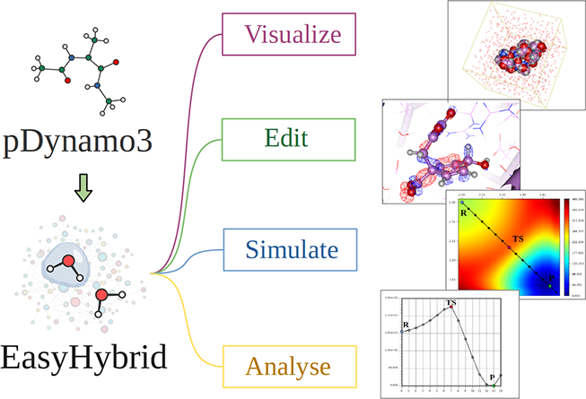
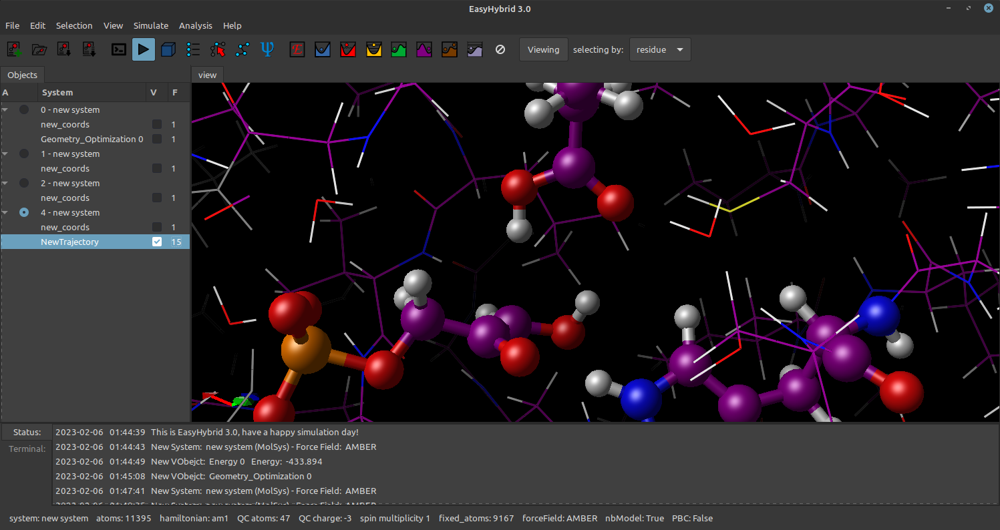
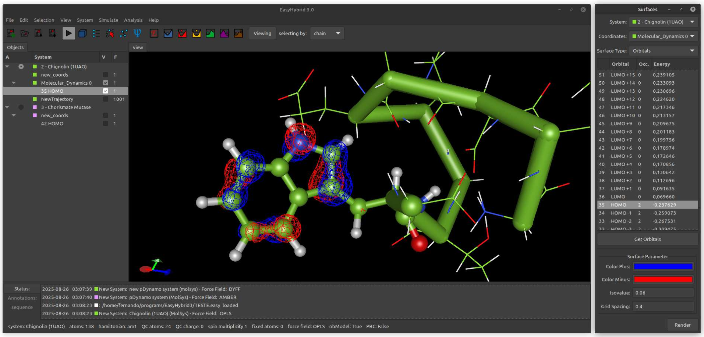
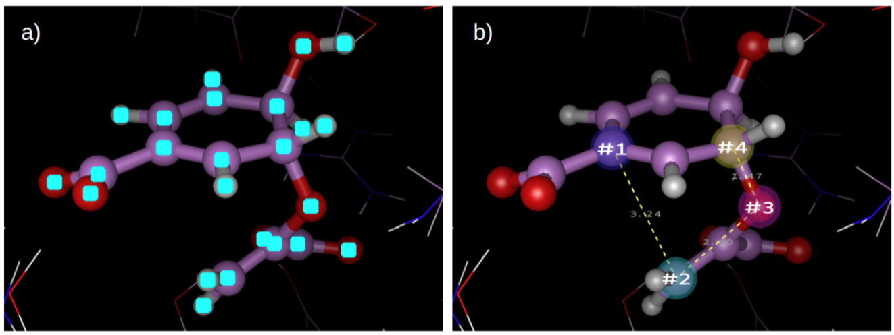
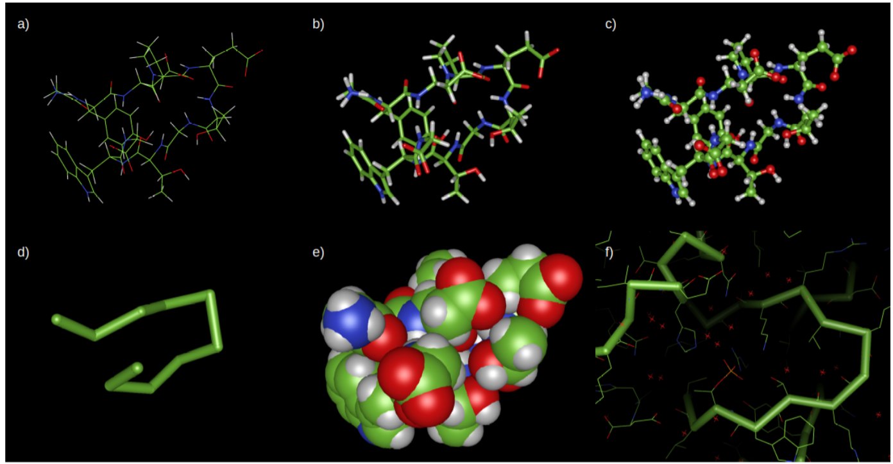
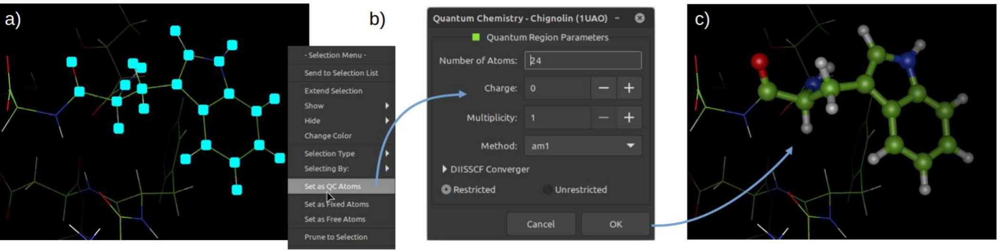
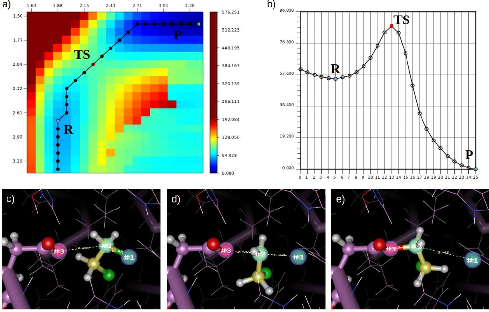
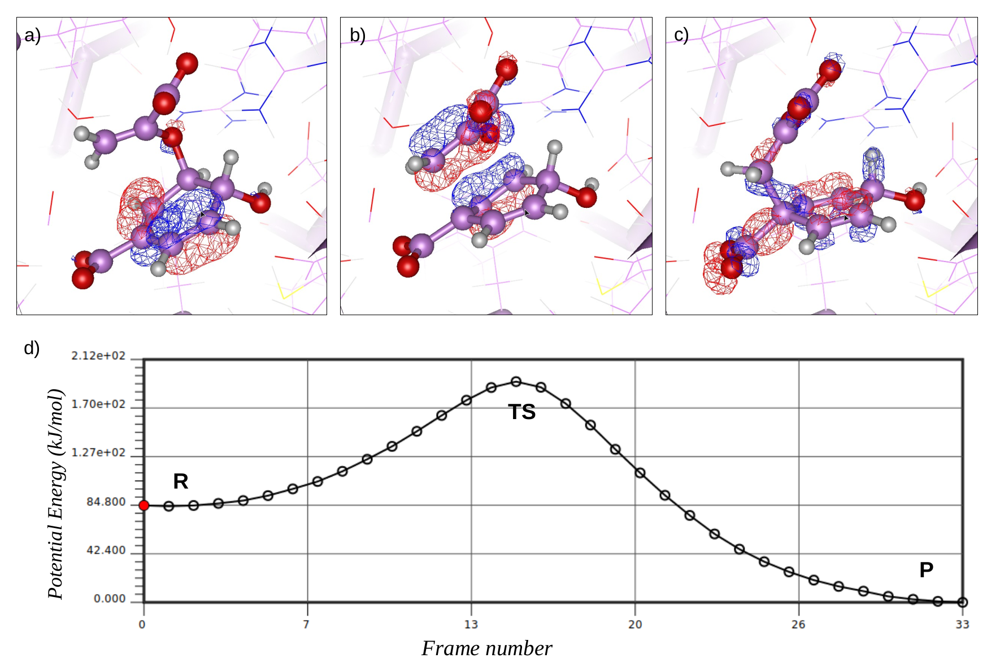

# EasyHybrid：让量子化学/分子力学混合模拟变得触手可及

## 本文信息

- **标题**：EasyHybrid：用于量子、经典和混合模拟的交互式图形环境（基于pDynamo3）
- **作者**：Jose Fernando R. Bachega、Gustavo Hagen、Carlos Sequeiros-Borja、Kai Nikklas、Jorge Chahine、Luis Fernando M. S. Timmers、Martin J. Field
- 发表时间：2026年1月11日
- **单位**：巴西阿雷格里港联邦健康科学大学药学院、巴西南里奥格兰德联邦大学生物技术中心、法国格勒诺布尔大学CEA-CNRS等
- **引用格式**：Bachega, J. F. R., Hagen, G., Sequeiros-Borja, C., Nikklas, K., Chahine, J., Timmers, L. F. M. S., & Field, M. J. (2026). EasyHybrid: An Interactive Graphical Environment for Quantum, Classical and Hybrid Simulations with pDynamo3. *Journal of Chemical Information and Modeling*, *66*, 1286−1292. https://doi.org/10.1021/acs.jcim.5c02047
- **源代码**：https://github.com/ferbachega/EasyHybrid3
- **Vismol源码**：https://github.com/casebor/Vismol/tree/vismol_easyhybrid
- **官方网站**：https://sites.google.com/view/easyhybrid
- **视频教程**：https://www.youtube.com/@EasyHybrid

## 摘要

> 我们推出了EasyHybrid，这是一个基于pDynamo3库构建的**免费开源图形界面**，用于混合量子化学/分子力学模拟。该软件为准备、检查和编辑分子系统提供了直观的环境，同时支持广泛的模拟类型，包括反应坐标扫描、分子动力学、正则模式分析、Nudged Elastic Band和伞形采样。关键特性包括大型生物分子系统的先进3D可视化、交互式编辑、灵活的原子选择、用于高效QC/MM设置的**系统裁剪**、轨道与静电势表面、自动日志解析和轨迹分析。EasyHybrid将这些工具集成到单一平台中，为量子化学和混合QC/MM模拟提供了一个熟悉而专业的环境。

### 核心结论

- EasyHybrid填补了pDynamo3生态系统的图形界面空白，**为学术社区提供免费入口**。
- EasyHybrid实现了**全流程工作流集成**，从构建、设置、执行到分析与可视化形成闭环。
- Vismol作为独立模块带来**大规模系统的高帧率渲染**，对生物大分子尤为关键。
- 系统管理支持多系统并行与轨迹解析，**显著改善日常操作效率**。
- 开源架构促进模块化扩展与社区协作，**降低新手入门门槛**。

## 背景

量子化学/分子力学混合模拟已成为研究大型生物分子系统化学反应的强大工具，能够**平衡计算精度与效率**。通过将**高精度的量子力学方法**应用于反应中心（如酶的活性位点），而用分子力学方法处理环境（如蛋白质骨架和溶剂），QM/MM方法能够在保持合理计算成本的同时，提供对化学键断裂和形成过程的准确描述。这种方法学已被广泛应用于酶催化机制研究、药物设计、材料科学等领域，成为**连接基础理论与实验观测的重要桥梁**。然而，这些高级方法学的使用通常面临显著的**技术障碍**。pDynamo3作为Python 3实现的分子模拟和建模程序库，提供了高度灵活的**脚本化工作流**，其输入文件本质上是调用所需子程序的Python脚本，这种设计几乎提供了无限的定制能力，但也对用户提出了**较高的编程要求**。

在计算化学和分子建模领域，**交互式图形界面**扮演着至关重要的角色。这些工具不仅作为简单的可视化器，还提供了分子绘制和编辑、文件类型和格式之间的相互转换，以及模拟输入文件的生成和提交等基本功能。值得注意的是，该领域已开发了多种图形工具来满足不同的研究需求，包括专门为支持量子化学软件而设计的wXMacMolPlt、ECCE和GaussView，专注于分子可视化的PyMOL、VMD和Avogadro，以及通用化学建模工具Gabedit和Coot。然而，这些工具要么缺乏对pDynamo3的**原生支持**，要么仅限于协助QC/MM输入文件的准备和结构可视化，未能提供**完全集成的模拟环境**。

在此背景下，EasyHybrid通过提供一个**易于访问**、**开源且完全集成的平台**，专门为pDynamo3生态系统设计而脱颖而出。作者团队之前开发了GTKDynamo（已不再维护），这是一个广泛使用的PyMOL查看器的Python 2插件，旨在支持pDynamo 1.7和1.9版本。随着pDynamo库被移植到Python 3并以pDynamo3的名义重新发布，功能进行了大量重写和扩展，EasyHybrid应运而生，作为其**现代化图形界面继承者**。

这种发展轨迹反映了计算化学软件演进的普遍趋势。早期的模拟软件通常提供命令行界面或简单的图形工具，但随着计算能力和用户需求的增长，现代软件需要提供更加友好和**功能丰富的用户体验**。EasyHybrid不仅继承了GTKDynamo的设计理念，还在技术架构上进行了**全面升级**，从Python 2迁移到Python 3，从PyMOL插件体系转变为独立的GTK3应用，从固定功能的渲染管线升级到基于现代着色器的可编程管线。这些改进使EasyHybrid能够更好地满足当代计算化学研究的需求，特别是在处理**日益复杂和庞大的分子系统**时。

### 关键科学问题

- 如何降低QM/MM模拟的**技术门槛**，让研究者和学生不必深度编程也能上手？
- 如何实现模拟工作流的**完全集成**，避免多工具切换带来的数据兼容问题？
- 如何提供**高效3D可视化能力**，在数千原子系统中仍保持交互流畅？
- 如何设计**灵活的原子选择与系统管理机制**，使量子区域与系统裁剪更直观？

### 创新点

- 架构创新：采用模块化设计，**Vismol作为独立3D核心**基于OpenGL 3.6实现高性能渲染，可嵌入其他GTK3应用。
- 工作流集成：首次为pDynamo3提供**完整图形化工作流**，覆盖构建、设置、执行到分析与可视化。
- 用户体验优化：集成EasyPlot，**自动解析日志并生成图表**，支持交互式轨迹分析与结构对齐。
- 开源教育价值：以免费学术工具形式降低入门门槛，**提升教学与培训可及性**。

---

## 研究内容

### 界面架构与实现：Vismol模块的核心特性

EasyHybrid界面使用Python 3实现，采用GTK3工具包生成图形窗口。其交互式3D可视化区域作为一个GTK3小部件运行，在一个名为Vismol的Python 3模块中开发，与EasyHybrid一起分发但由同一开发团队作为并行项目维护。这种模块化设计使Vismol能够**轻松集成到GTK3容器应用中**，为寻求将分子3D可视化功能嵌入自己工具的开发者提供了灵活的解决方案。

**图4**：**EasyHybrid运行界面截图**  
截图展示了**多系统管理面板**、**轨迹对象列表**与主视窗中的**QC/MM可视化结果**，强调Vismol渲染在日常操作中的直观性。

Vismol利用现代OpenGL（3.6版本），除了更广泛使用的片段着色器和顶点着色器外，还结合了几何着色器。这在特定渲染模式下，尤其是线表示和棍状表示，带来了**显著的性能提升**。传统OpenGL渲染管线在处理大量线条和棍状图元时面临性能瓶颈，因为每个图元需要单独的绘制调用。Vismol通过几何着色器在GPU上直接处理图元的生成和变换，**大幅减少CPU与GPU通信开销**，使得包含数千原子的生物大分子系统能够保持流畅的交互帧率。主EasyHybrid窗口集成了六个关键组件：菜单栏用于所有界面功能，工具栏包含常用操作，侧边栏显示系统和视觉对象列表，底部面板包含操作日志和残基查看器，状态栏总结系统属性，以及中央交互式3D画布。

界面交互的手感被刻意做成“熟悉的科学软件”：旋转、居中与选择等鼠标动作沿用了PyMOL和Coot的习惯，**降低迁移成本**；整体体验参考了PyMOL、VMD、Avogadro、wXMacMolPlt与Gabedit等经典工具。与GTKDynamo时代不同，EasyHybrid用基于OpenGL/GLSL的自研3D引擎替代PyMOL渲染管线，并用EasyPlot取代Matplotlib，形成一套**完全自控的可视化与绘图栈**。

EasyHybrid允许在同一会话中管理多个系统。新系统加载后会进入左侧树状列表并自动分配颜色，默认映射到可视化对象的碳原子，便于快速区分；用户可以通过树状列表按钮控制对象显示与编辑。可视化对象既可以来自模拟输出，也可以来自外部坐标文件，并支持“更新现有对象”或“生成新对象”的两种工作方式，从而把多条轨迹**聚合到一个会话里做对比**。

EasyHybrid允许用户在单个会话中同时管理和操作多个系统。加载系统时，界面会根据文件类型和内容自动识别系统类型（纯量子化学、纯分子力学或混合QC/MM），并相应地显示原子和表示。默认情况下，QC/MM系统中的MM原子以线显示，QC原子以球棍模型显示，固定原子以灰色显示，肽主链使用粗棍状表示（Cα迹线）。这种**动态且智能的显示策略**为用户提供了关于系统组成的即时视觉反馈。

### 系统准备与QC/MM设置

EasyHybrid可以读取和导出pDynamo3序列化文件（.pkl和.yaml格式），为模拟设置和GUI之外的执行提供了灵活性。这些文件包含所有系统信息，包括坐标和**QC/MM参数**。加载后，EasyHybrid将MM原子显示为线，QC原子显示为球棍模型（动态），固定原子显示为灰色，肽主链以粗棍状突出显示（Cα迹线）。

对于纯QC模拟，坐标通常足够，但由于计算成本高，仅适用于小系统。EasyHybrid提供了**专用的QC计算设置窗口**，用户可以选择pDynamo3原生方法或外部软件如ORCA、xTB和DFTB+，所有这些软件都与pDynamo3接口。每个选项都包含用于设置所需参数的专用辅助窗口。

将系统与分子力学模型关联更为复杂，因为除了原子类型和坐标外，还需要拓扑信息。可以使用pDynamo3原生支持的力场（如OPLS、CHARMM、DYFF、pDynamo3版本的通用力场）**构建MM系统**。在这种情况下，用户必须提供**包含拓扑信息的结构文件**（如.mol2）和**兼容的参数集**。界面会建议默认参数文件，但用户可以根据需要替换。

**图1**：**EasyHybrid界面总览**  
图中展示了一个**混合QC/MM系统**，其中**MM区域以线表示**、**QC区域以球棍模型表示**，肽主链以粗棍状（Cα迹线）突出显示，蓝色和红色网格描绘**最高占据分子轨道**（HOMO）。

对于QC/MM系统，用户必须将原子分配到不同区域。pDynamo3使用原子的`link`属性来确定哪些原子属于QC区域，其电荷将被相应处理。这一过程对于准确描述QM区域的边界条件至关重要，因为在QM/MM边界处需要使用**链接原子或冻结轨道等边界处理**来应对共价键切断。

EasyHybrid提供了专用的右键菜单，用户可以方便地选择、取消选择原子或切换链接状态，并且界面会**自动转换为pDynamo3的QC区域定义**。程序还存储原始电荷，以便在定义新的量子区域时，EasyHybrid最初恢复原始电荷，最小化可能的误差累积。这种电荷管理策略对于探索不同的QM划分方案特别重要，因为反复修改QC区域可能会导致**电荷累积误差**，影响能量计算的一致性。

### 选择与表示：操作细节的补充说明

论文的Supporting Information对选择逻辑和表示类型做了细化说明，能直接帮助读者理解“如何操作”和“为什么好用”。EasyHybrid提供两类选择模式：**查看选择**用于快速浏览当前选中的原子，默认以可调颜色的青色点标记；**拾取选择**用于建立有序的原子序列，系统会在原子上显示带序号的彩色球形标签，便于定义反应坐标、约束或路径上的关键原子。

表示类型方面，SI图中给出了可用的渲染集合，包括线框、棍状、带动态键的棍状、原子球、范德华球、ribbon或Cα迹线，以及非键连原子的线框显示。**表示设置会应用到轨迹的所有帧**，因此在多轨迹对比时也能保持一致的视觉语言。这些细节看似基础，但它们决定了QC/MM交互流程是否顺手，也是EasyHybrid在教学与日常分析中被认为“上手快”的关键之一。

**图S1**：**选择类型示意**。（a）查看选择以**青色方点**标记当前选中的原子；（b）拾取选择以**带编号的彩色球体**标记顺序，便于构建反应坐标或约束原子序列。

**图S2**：**EasyHybrid的表示类型**。（a）线框；（b）棍状；（c）球棍；（d）Cα迹线；（e）范德华球；（f）迹线、线框与非键连线的**组合表示**。图中常见配色为**碳绿**、**氧红**、**氮蓝**、**氢白**，便于快速识别原子类型。

### 多样化的模拟类型支持

EasyHybrid提供了全面的模拟工具套件，充分利用pDynamo3库的能力，覆盖了从基础能量计算到高级增强采样技术的广泛应用场景。这些模拟类型不仅代表了计算化学方法的不同层次，也反映了研究者面对不同科学问题时需要采用的多样化策略。

- **能量计算和单点计算**：使用特定QC/MM或MM模型计算系统的总能量、势能或动能。这些计算对于**基准测试与构型对比**非常有用，也常用于为后续模拟准备结构。在能量计算过程中，用户可以选择不同的理论方法和基组级别，**平衡计算精度与效率**，从而初步评估构象稳定性或验证参数合理性。
- **几何优化**：使用pDynamo3库中实现的最速下降和共轭梯度算法进行结构最小化。用户可以指定优化周期数、收敛标准，以及是否在优化过程中保存中间结构的轨迹。几何优化是模拟工作流的**基础步骤**，能够帮助研究者找到**局部或全局能量极小点**，为后续动力学模拟或频率分析提供起点。EasyHybrid的图形界面使用户能够实时监控优化进度，**可视化收敛过程**并快速判断优化是否成功。
- **分子动力学模拟**（MD）：EasyHybrid支持设置和运行MD模拟，用户可以指定集成时间步长、总模拟时间、温度控制器类型和恒温温度、坐标保存频率等参数。模拟完成后，轨迹可以自动加载到界面中，以**动态键表示**可视化，显示化学键如何随时间演变。MD模拟能够提供系统在有限温度下的**动态行为信息**，对于理解蛋白质折叠、配体结合、溶剂效应等过程具有不可替代的价值。EasyHybrid的动态键表示模式特别适合展示**键的形成与断裂**，使用户能够直观观察反应或构象变化。
- **势能面扫描**（PES）：沿一个或两个反应坐标扫描能量。单维扫描计算沿反应坐标各点的能量，而二维PES同时计算两个反应坐标的**能量矩阵**，这对于研究复杂反应机制特别有用。PES扫描是理解反应路径、识别**过渡态与中间体**的基础方法，EasyHybrid的EasyPlot工具能够将二维PES以能量矩阵图的形式呈现，用户可以**交互式选择反应路径**进行深入分析，这种功能在传统脚本工作流中难以实现。
- **正则模式分析**：计算系统的振动频率和正则模式。正则模式分析不仅能够提供分子的**振动光谱信息**，帮助与实验光谱（如红外、拉曼）进行对比，还能够识别分子的**柔性区域与刚性区域**，为理解分子功能提供线索。EasyHybrid集成的可视化功能使用户能够以动画形式展示正则模式的振动模式，直观理解不同原子在特定频率下的运动方式。
- **Nudged Elastic Band方法**（NEB）：用于寻找反应路径和过渡态，通过在反应物和产物之间插值表示路径，并优化这些图像以找到**最低能量路径**。NEB方法是研究化学反应机制的重要工具，能够确定反应的**能垒与过渡态结构**，对于理解反应速率和选择性的物理本质至关重要。
- **伞形采样**：一种增强采样技术，用于计算沿反应坐标的**自由能分布**。该方法在设置上类似PES扫描，但在每个窗口使用短MD模拟而不是几何优化。每个窗口获得的反应坐标轨迹可以使用pDynamo3中实现的加权直方图分析方法（WHAM）进行后处理，以**重建整体自由能面**。伞形采样是计算自由能景观的金标准方法之一，广泛应用于配体结合自由能、pKa预测、相变等研究领域，EasyHybrid的集成使用户能够在统一环境中完成从窗口设置到WHAM分析的全流程。

所有模拟类型都通过pDynamo3的后端执行，并受益于EasyHybrid的集成可视化、选择和配置工具。对于QC和QC/MM模拟，用户可以采用pDynamo3原生方法或pDynamo3与外部引擎的组合（如ORCA、xTB、DFTB+），所有这些都可通过专用界面面板访问。

**图2**：**EasyHybrid中的QC区域选择和设置**  
（a）查看模式下的原子选择，可通过**右键菜单**进入量子化学设置窗口；（b）**QC参数的配置界面**；（c）QC原子默认显示为球棍模型、MM原子显示为线，体现**QC/MM分区的可视化默认规则**。

### 结果分析与可视化

使用pDynamo3库执行的模拟会生成多种格式的结果。在EasyHybrid中，所有pDynamo3进程都被设计为输出包含特定模拟基本结果的日志文件。EasyHybrid可以**自动读取和解释日志文件**，以**图形形式显示关键数据**。这些图表可以被用户保存和操纵，提供了一种方便的方式来生成图形和结构表示。

日志文件处理在任何通过EasyHybrid执行的pDynamo3例程结束时**自动触发**，但也可以手动对先前生成的EasyHybrid/pDynamo3日志文件执行。绘图由名为EasyPlot的自定义工具处理，使用Pycairo图形库开发。这种集成使用户能够在模拟完成后立即获得**专业级的科学图表**，而无需借助外部绘图软件。

**图3**：**沿两个反应坐标同时进行的势能面扫描**（PES）  
（a）能量矩阵图，水平轴与垂直轴分别对应反应坐标r1和r2；（b）用户可在能量表面**交互式选择帧**生成一维能量曲线；（c）到（e）展示反应物、过渡态与产物结构。图中标记1、2、3的半透明球表示选取的反应坐标原子，虚线显示动态跟踪的原子间距离；论文指出右下角的替代路径在此例中属于**可视化伪影**，提醒读者谨慎解读路径选择。

pDynamo3的轨迹与可视化输出还包括轨道与势能面随反应路径演化的展示。SI图例以chorismate mutase反应坐标为例，给出了HOMO在势能面扫描过程中的三维展示，强调EasyHybrid可以把“结构-轨道-能量”三者**串联到同一条分析链**上。另有SI表格对比了EasyHybrid与其他免费分子可视化软件的功能覆盖范围，进一步凸显其**pDynamo3原生支持**与**QC/MM流程闭环**的定位差异。

**图S3**：**HOMO沿反应路径的可视化与能量轮廓**  
(a) 反应物、(b) 过渡态、(c) 产物的HOMO等值面示意，**红蓝网格**表示轨道等值面相位；(d) 对应的势能曲线，清晰标出R、TS与P的能量变化轨迹。

pDynamo3产生的另一类重要输出文件包括轨迹文件。这些文件可以采用多种格式，包括原生格式（如pkl）和外部格式（如CRD、NetCDF和DCD），并且可能包含原子坐标、能量、反应坐标值、速度等信息。EasyHybrid支持多种pDynamo3轨迹类型，允许用户同时加载多个轨迹并指定要处理的数据对象。该界面还包含一组结构分析工具，包括在轨迹过程中监控多个距离、角度或二面角，以及RMSD计算、结构对齐、重成像等。这些分析功能使用户能够深入理解模拟过程中发生的结构变化，例如蛋白质的构象转变、配体的结合模式变化、或溶剂分子与溶质的相互作用演化。通过同时加载多个轨迹，用户可以方便地比较**不同条件下的系统行为**，这种比较研究在理解温度、pH、突变等因素对分子结构和动力学的影响时特别有价值。

这种全面的结果分析和可视化能力确保了用户不仅能够设置和运行模拟，还能够在**统一环境中深入理解结果**，而无需在多个工具之间切换。

---

## Q&A

- **Q1**：EasyHybrid与传统的命令行pDynamo3使用方式相比有哪些优势？
- **A1**：
  - EasyHybrid最显著的优势在于极大地降低了**技术门槛和学习曲线**，图形界面让用户无需深度脚本即可设置和运行复杂的QM/MM模拟，尤其适合初学者与教学场景。
  - 集成的可视化环境使用户能够**实时检查系统设置并立即分析结果**，减少编写与调试脚本的成本。
  - 交互式原子选择与系统编辑支持快速迭代建模，提升整体研究效率。
  - 需要注意的是，对于高度定制化工作流，pDynamo3的**脚本化方式仍提供最大灵活性**，EasyHybrid更偏向常见任务的高效操作体验。
- **Q2**：Vismol模块在性能方面有何特殊之处，特别是与其他分子可视化工具相比？
- **A2**：
  - Vismol的核心优势在于充分利用现代OpenGL 3.6特性，尤其是**GPU端几何着色器加速**，提升了线表示与棍状表示的渲染效率。
  - 在包含数千甚至数万原子的系统中，这种优化使**交互式3D可视化更加流畅**，更适合大分子与QC/MM体系。
  - Vismol采用模块化设计，作为独立的Python 3模块与EasyHybrid并行维护，便于被其他GTK3应用复用，促进社区协作。
  - 需要注意的是，这种优化主要集中在特定渲染模式，体积渲染或光线追踪等高级效果仍可能不如专用可视化工具。
- **Q3**：EasyHybrid在系统裁剪和QC区域设置方面提供了哪些便利功能？
- **A3**：
  - 右键菜单提供直观的选择与取消选择操作，并能切换链接状态，界面会**自动转换为pDynamo3的QC区域定义**。
  - 系统保存原始电荷，当调整量子区域时先**恢复原始电荷并最小化误差累积**，有助于探索不同的QM/MM划分方案。
  - 通过pDynamo3系统管理能力，用户可裁剪远端水分子或离子，在保留关键相互作用的同时减少计算量，**显著提高QC/MM计算效率**。
- **Q4**：EasyPlot工具的自动化日志解析功能是如何工作的，它为用户带来了哪些便利？
- **A4**：
  - EasyPlot基于Pycairo实现，能够自动解析pDynamo3日志中的能量与结构数据，并生成**专业级科学图表**。
  - **自动化日志解析流程**减少了手动提取与绘图的时间成本。
  - 支持**交互式数据探索**，例如在二维PES扫描中点击矩阵点生成一维能量曲线，弥补传统静态图表的限制。
  - 主要针对pDynamo3输出优化，其他软件输出仍可能需要转换或借助通用绘图工具。
- **Q5**：EasyHybrid在教育和研究培训方面有哪些潜在应用价值？
- **A5**：
  - 作为免费的开源工具，EasyHybrid为计算化学教学提供**友好的入门平台**，学生无需深入编程即可理解QM/MM核心概念与常见流程。
  - 可视化能力让抽象概念变得直观，例如通过轨道演化与轨迹回放理解反应机制与构象变化。
  - 支持构建**虚拟实验和在线课程**，降低教学硬件门槛。
  - **开源性质**便于教学定制与功能扩展，提升课程与培训的可及性。

---

## 关键结论与批判性总结

### 主要影响

- **学术影响**：EasyHybrid为pDynamo3生态系统提供了**首个现代化图形界面**，填补了开源QM/MM模拟工具的重要空白，促进了先进方法学在学术社区的普及和应用，特别是对**资源有限的发展中国家研究机构**具有重要意义。
- **教育价值**：作为免费的开源工具，EasyHybrid为计算化学教学和培训提供了理想的平台，学生可以在不深入编程的情况下理解QM/MM模拟的基本概念和工作流程，**降低了学习门槛**并培养了下一代计算化学家。
- **方法学可及性**：通过集成全流程工作流和自动化日志解析，EasyHybrid使更多研究者能够使用**伞形采样和NEB等高级方法**，推动了酶催化、反应机理等领域的研究进展。

### 局限性

- **平台限制**：EasyHybrid目前主要在**Linux下运行**，Windows用户需要通过Ubuntu子系统使用，这可能会限制其在某些用户群体中的采用。对于不熟悉Linux环境的实验研究者而言，这种平台依赖可能成为使用的障碍。
- **功能边界**：虽然EasyHybrid提供了全面的图形界面，但对于高度定制化的模拟流程和特殊方法学，用户可能仍需要回归到pDynamo3的**脚本化工作流**。这种限制在需要串联多个不同软件或实现复杂自动化任务的场景下尤为明显。
- **性能权衡**：图形界面虽然降低了使用门槛，但在批处理任务和高通量计算场景中，**命令行脚本仍可能更高效**。图形界面的开销在运行大量相似模拟时可能累积为显著的时间成本。
- **生态系统整合**：EasyHybrid专注于pDynamo3生态，与其他主流模拟软件（如GROMACS、AMBER）的**互操作性有限**，可能需要用户进行数据格式转换。这种局限性在需要结合不同软件优势的多方法学研究中可能带来不便。
- **高级功能缺失**：一些先进的模拟技术，如元动力学、加速分子动力学等增强采样方法，在当前版本的EasyHybrid中可能**尚未完全集成**，需要用户通过脚本方式实现。

### 未来方向

- **跨平台支持**：开发原生Windows和macOS版本将**显著扩大用户基础**，使更多研究者能够轻松使用EasyHybrid。跨平台支持对于降低使用门槛和促进在不同操作系统环境中的普及至关重要。
- **功能扩展**：集成更多pDynamo3的高级功能，如元动力学、加速分子动力学等增强采样技术，以及更精确的自由能计算方法。这些功能的集成将使EasyHybrid能够**应对更复杂的科学问题**，拓宽其应用范围。
- **云端部署**：开发基于Web的版本或云计算集成，使用户无需本地安装就能使用EasyHybrid，进一步提高可及性。云计算平台还可以提供**按需分配的计算资源**，降低硬件门槛。
- **社区协作**：鼓励社区贡献插件和扩展，建立用户开发和分享定制功能的生态系统，类似于VMD或PyMOL的插件系统。活跃的社区贡献能够**加速功能迭代**，促进方法学创新。
- **教学资源**：开发更多的教程、示例课程和视频材料，特别是在线实验手册和虚拟实验室，促进在计算化学教育中的广泛应用。这些资源对于**培养下一代计算化学家**和推广QM/MM方法学具有重要意义。
- **互操作性增强**：改进与其他主流模拟软件的数据交换能力，支持更多文件格式和标准接口，使EasyHybrid能够更好地融入多方法学的研究工作流。这种改进对于**促进不同软件与方法协同使用**具有关键作用。
